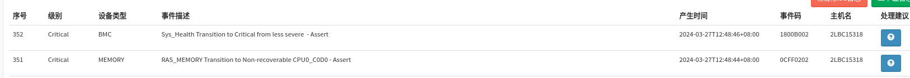

# 堆栈信息

堆栈大概有两种类型:
## 类型1 -- softlockup
```
[32227.272692]  ipmi_devintf ipmi_msghandler escache
[32227.369928] CPU: 65 PID: 925 Comm: kcompactd4 Kdump: loaded Tainted: G        W  OEL   --------- -  - 4.18.0-372.19.1.es8_10.aarch64 #1
[32227.383557] Hardware name: Inspur CS5280F3/CS5280F3, BIOS 2.12.01 03/23/2024
[32227.391337] pstate: 80c00009 (Nzcv daif +PAN +UAO)
[32227.396846] pc : smp_call_function_many_cond+0x34c/0x3a0
[32227.402885] lr : smp_call_function_many_cond+0x308/0x3a0
[32227.408912] sp : ffff80003344f900
[32227.412932] x29: ffff80003344f900 x28: fffff10eea740000 
[32227.418959] x27: 0000000000000080 x26: 000000000000007f 
[32227.424990] x25: ffff8000117956e0 x24: 0000000000000001 
[32227.431020] x23: ffff800011b7d718 x22: 0000000000000000 
[32227.437043] x21: ffff800011b793b4 x20: ffff800011b7d718 
[32227.443065] x19: ffff410eff6df6c0 x18: 0000000000000000 
[32227.449086] x17: 0000000001632b60 x16: 0000000001632ad0 
[32227.455114] x15: 0000000001632780 x14: 00000000016326f0 
[32227.461135] x13: 0000000001632660 x12: 00000000016325d0 
[32227.467155] x11: 0000000001632540 x10: 00000000016324b0 
[32227.473166] x9 : 0000000000000008 x8 : ffff40000198b710 
[32227.479178] x7 : 0000000000000000 x6 : ffff710efbed56e0 
[32227.485184] x5 : ffff710efbed56e0 x4 : ffffffffffffffff 
[32227.491195] x3 : 0000000000000000 x2 : ffff010eff6556f8 
[32227.497201] x1 : 0000000000000003 x0 : 0000000000000000 
[32227.503214] Call trace:
[32227.506355]  smp_call_function_many_cond+0x34c/0x3a0
[32227.512031]  on_each_cpu_cond_mask+0x58/0xd0
[32227.517006]  on_each_cpu_cond+0x44/0x58
[32227.521547]  invalidate_bh_lrus+0x2c/0x38
[32227.526259]  __buffer_migrate_page+0x1ec/0x328
[32227.531413]  buffer_migrate_page_norefs+0x40/0x50
[32227.536825]  move_to_new_page+0x64/0x1a8
[32227.541450]  unmap_and_move+0x524/0x618
[32227.545989]  migrate_pages+0x310/0x610
[32227.550443]  compact_zone+0x6f8/0xda0
[32227.554813]  kcompactd_do_work+0x168/0x278
[32227.559615]  kcompactd+0xcc/0x368
[32227.563637]  kthread+0x124/0x130
[32227.567572]  ret_from_fork+0x10/0x18
```

## 类型2 -- rcu_sched self-detected stall
```
[32296.878135] libceph: osd2 (1)51.168.30.2:6805 socket closed (con state V1_BANNER)
[32380.382030] rcu: INFO: rcu_sched self-detected stall on CPU
[32380.388373] rcu:     65-....: (3920456 ticks this GP) idle=b2e/1/0x4000000000000002 softirq=1073098/1073098 fqs=1552284 
[32380.399706]  (t=3930738 jiffies g=4128081 q=39909432)
[32380.405448] Task dump for CPU 65:
[32380.409429] task:kcompactd4      state:R  running task     stack:    0 pid:  925 ppid:     2 flags:0x0000002a
[32380.420021] Call trace:
[32380.423110]  dump_backtrace+0x0/0x158
[32380.427406]  show_stack+0x24/0x30
[32380.431330]  sched_show_task+0xdc/0x100
[32380.435761]  dump_cpu_task+0x48/0x58
[32380.439912]  rcu_dump_cpu_stacks+0x130/0x184
[32380.444738]  print_cpu_stall+0x1ac/0x2b8
[32380.449206]  rcu_sched_clock_irq+0x310/0x8a0
[32380.454013]  update_process_times+0x64/0xa0
[32380.458728]  tick_sched_handle.isra.5+0x34/0x70
[32380.463792]  tick_sched_timer+0x50/0xa0
[32380.468157]  __hrtimer_run_queues+0x10c/0x348
[32380.473045]  hrtimer_interrupt+0x114/0x2c8
[32380.477669]  arch_timer_handler_phys+0x3c/0x50
[32380.482647]  handle_percpu_devid_irq+0x90/0x238
[32380.487713]  generic_handle_irq+0x3c/0x58
[32380.492258]  __handle_domain_irq+0x6c/0xc0
[32380.496886]  gic_handle_irq+0xd4/0x178
[32380.501166]  el1_irq+0xb8/0x140
[32380.504835]  smp_call_function_many_cond+0x34c/0x3a0
[32380.510341]  on_each_cpu_cond_mask+0x58/0xd0
[32380.515154]  on_each_cpu_cond+0x44/0x58
[32380.519528]  invalidate_bh_lrus+0x2c/0x38
[32380.524085]  __buffer_migrate_page+0x1ec/0x328
[32380.529078]  buffer_migrate_page_norefs+0x40/0x50
[32380.534329]  move_to_new_page+0x64/0x1a8
[32380.538800]  unmap_and_move+0x524/0x618
[32380.543177]  migrate_pages+0x310/0x610
[32380.547463]  compact_zone+0x6f8/0xda0
[32380.551662]  kcompactd_do_work+0x168/0x278
[32380.556296]  kcompactd+0xcc/0x368
[32380.560145]  kthread+0x124/0x130
[32380.563910]  ret_from_fork+0x10/0x18
[32407.273314] watchdog: BUG: soft lockup - CPU#65 stuck for 22s! [kcompactd4:925]
[32407.281213] Modules linked in: vhost_net vhost vhost_iotlb tap tun af_packet_diag netlink_diag geneve ip6_udp_tunnel nf_conntrack_pptp tcp_diag udp_diag raw_diag inet_diag unix_diag act_mirred cls_u32 sch_ingress ifb sch_tbf ext4 mbcache jbd2 xt_recent nbd rbd libceph dns_resolver nf_conntrack_netlink veth ipt_REJECT nf_reject_ipv4 xt_addrtype xt_nat xt_statistic ipt_MASQUERADE xt_mark nft_chain_nat br_netfilter bridge stp llc overlay nfnetlink_cttimeout openvswitch(OE) nf_nat udp_tunnel xt_state xt_conntrack nf_conntrack nf_defrag_ipv6 nf_defrag_ipv4 xt_comment nft_compat nft_counter sunrpc ipmi_ssif nf_tables nfnetlink irdma ast drm_vram_helper drm_ttm_helper ice ttm crct10dif_ce i2c_algo_bit drm_kms_helper ib_uverbs ghash_ce sha2_ce drm ib_core ses sha256_arm64 enclosure acpi_ipmi fb_sys_fops sha1_ce syscopyarea scsi_transport_sas sysfillrect sysimgblt ipmi_si vfat fat xfs libcrc32c sg i40e megaraid_sas(OE) nvme nvme_core dm_mirror dm_region_hash dm_log dm_mod ipmi_watchdog
[32407.281319]  ipmi_devintf ipmi_msghandler escache
```

# 堆栈分析

## kernel C代码分析
由于只有softlockup有pt_regs, 我们想通过pt_regs 获取些信息, 最上级
函数代码截取:
```cpp
static void smp_call_function_many_cond(const struct cpumask *mask,
                                        smp_call_func_t func, void *info,
                                        bool wait, smp_cond_func_t cond_func)
{
        ...

        for_each_cpu(cpu, cfd->cpumask) {
                call_single_data_t *csd = per_cpu_ptr(cfd->csd, cpu);
                //cond不满足, 则continue
                if (cond_func && !cond_func(cpu, info))
                        continue;
                //====(1)=====
                csd_lock(csd);
                //====(4)======
                if (wait)
                        csd->flags |= CSD_FLAG_SYNCHRONOUS;
                csd->func = func;
                csd->info = info;
                if (llist_add(&csd->llist, &per_cpu(call_single_queue, cpu)))
                        __cpumask_set_cpu(cpu, cfd->cpumask_ipi);
        }
        //====(2)======
        /* Send a message to all CPUs in the map */
        arch_send_call_function_ipi_mask(cfd->cpumask_ipi);

        //====(4)======
        if (wait) {
                for_each_cpu(cpu, cfd->cpumask) {
                        call_single_data_t *csd;

                        //====(4)======
                        csd = per_cpu_ptr(cfd->csd, cpu);
                        //+++++++++++++++++++++
                        //++++ pt_regs现场 ++++
                        //+++++++++++++++++++++
                        //====(4)======
                        csd_lock_wait(csd);         
                }
        }
}

static void flush_smp_call_function_queue(bool warn_cpu_offline)
{
        ...
        llist_for_each_entry_safe(csd, csd_next, entry, llist) {
                smp_call_func_t func = csd->func;
                void *info = csd->info;

                /* Do we wait until *after* callback? */
                if (csd->flags & CSD_FLAG_SYNCHRONOUS) {
                        func(info);
                        //===(3)===
                        csd_unlock(csd);
                } else {
                        //===(3)===
                        csd_unlock(csd);
                        func(info);
                }
        }
        ...
}
```
该函数的大概目的是, 想让别的cpu 去做一些事情, 问题现场大致流程:

1. 找到目标cpu的 csd, 查看是否条件满足, 如果满足, 初始化csd, 然后把目标cpu的 csd lock住
2. 需要通过 IPI 的通知方式 打断其 执行流,让其处理我们需要在其他cpu上执行的function
(csd->func).
3. 其他cpu收到ipi后, 会根据该csd->flags是否是同步异步,决定先执行function还是先unlock, 
   但是最终两者都会执行到
4. 如果需要wait, 则将 csd->flags  或上 同步flag, 然后会去在集中发完ipi后,在一个循环中
   依次等待每个cpu执行完成, 这个也是触发softlockup 的现场

再来简单看下, `csd_lock_wait()`
```cpp
static __always_inline void csd_lock_wait(call_single_data_t *csd)
{
        smp_cond_load_acquire(&csd->flags, !(VAL & CSD_FLAG_LOCK));
}

#define smp_cond_load_acquire(ptr, cond_expr)                           \
({                                                                      \
        typeof(ptr) __PTR = (ptr);                                      \
        typeof(*ptr) VAL;                                               \
        for (;;) {                                                      \
                VAL = smp_load_acquire(__PTR);                          \
                if (cond_expr)                                          \
                        break;                                          \
                __cmpwait_relaxed(__PTR, VAL);                          \
        }                                                               \
        VAL;                                                            \
})
```
cond 为 `!(VAL & CSD_FLAG_LOCK)`, 也就是`!(csd->flags & CSD_FLAG_LOCK)`, 该flags bit
会在上面我们提到的 `csd_lock/unlock` 流程中处理
```cpp
static __always_inline void csd_lock(call_single_data_t *csd)
{
        csd_lock_wait(csd);
        csd->flags |= CSD_FLAG_LOCK;

        /*
         * prevent CPU from reordering the above assignment
         * to ->flags with any subsequent assignments to other
         * fields of the specified call_single_data_t structure:
         */
        smp_wmb();
}

static __always_inline void csd_unlock(call_single_data_t *csd)
{
        WARN_ON(!(csd->flags & CSD_FLAG_LOCK));

        /*
         * ensure we're all done before releasing data:
         */
        smp_store_release(&csd->flags, 0);
}
```

那也就是说, 这里实际上再等 别的cpu执行 `cpu_unlock()`

> 简单总结
>
> 目前触发softlockup的CPU 是给其他cpu 发送了中断, 然后开始wait, 其cpu是wait其他cpu执行
> 完一个function, 通过 csd_unlock()的方式, 通知到当前正在cpu, 那么当前现场是其softlockup
> cpu一直没有等待另一个(至少一个) CPU的回复.
>
> 我们接下来尝试通过反汇编和 PT_REGs 看看能不能获取到一些信息. 例如 等待的CPU

## smp_call_function_many_cond 反汇编

> NOTE
>
> 这段反汇编解析的 可读性太差, 但是也暂时想不到其他的方式. :( 

```
0xffff8000101b9f44 <smp_call_function_many_cond+172>:   ldp     x19, x20, [sp,#16]
0xffff8000101b9f48 <smp_call_function_many_cond+176>:   ldp     x21, x22, [sp,#32]
0xffff8000101b9f4c <smp_call_function_many_cond+180>:   ldp     x23, x24, [sp,#48]
0xffff8000101b9f50 <smp_call_function_many_cond+184>:   ldp     x25, x26, [sp,#64]
0xffff8000101b9f54 <smp_call_function_many_cond+188>:   ldp     x27, x28, [sp,#80]
0xffff8000101b9f58 <smp_call_function_many_cond+192>:   ldp     x29, x30, [sp],#128
0xffff8000101b9f5c <smp_call_function_many_cond+196>:   ret
...

/usr/src/debug/kernel-4.18.0-372.19.1.el8_6/linux-4.18.0-372.19.1.es8_10.aarch64/kernel/smp.c: 463
0xffff8000101ba198 <smp_call_function_many_cond+768>:   ldr     x1, [x19,#8]        //cfd->cpumask, 那么这时w0 为 cpu
0xffff8000101ba19c <smp_call_function_many_cond+772>:   bl      0xffff800010a8fa58 <cpumask_next>
0xffff8000101ba1a0 <smp_call_function_many_cond+776>:   ldr     w1, [x21]
0xffff8000101ba1a4 <smp_call_function_many_cond+780>:   cmp     w0, w1              //要return
//cs Greater than, equal, or unordered, 那就是>= 对应代码 cpu < nr_cpu_ids, 如果大于等于, 就说明要推出循环,return, x21 为 nr_cpu_ids
0xffff8000101ba1a8 <smp_call_function_many_cond+784>:   b.cs    0xffff8000101b9f44 <smp_call_function_many_cond+172> //arm64 sdm: C1.2.4 Condition code
/usr/src/debug/kernel-4.18.0-372.19.1.el8_6/linux-4.18.0-372.19.1.es8_10.aarch64/kernel/smp.c: 466
0xffff8000101ba1ac <smp_call_function_many_cond+788>:   ldr     x2, [x20,w0,sxtw #3]        //x2应该获取的是 per_cpu_ffset
0xffff8000101ba1b0 <smp_call_function_many_cond+792>:   ldr     x1, [x19]                   //x19 为cfd, cfd->csd
/usr/src/debug/kernel-4.18.0-372.19.1.el8_6/linux-4.18.0-372.19.1.es8_10.aarch64/kernel/smp.c: 467
0xffff8000101ba1b4 <smp_call_function_many_cond+796>:   add     x1, x1, x2                  //x1为csd
0xffff8000101ba1b8 <smp_call_function_many_cond+800>:   add     x2, x1, #0x18               //x1+0x18为 &csd->flags
/usr/src/debug/kernel-4.18.0-372.19.1.el8_6/linux-4.18.0-372.19.1.es8_10.aarch64/kernel/smp.c: 108
0xffff8000101ba1bc <smp_call_function_many_cond+804>:   ldar    w1, [x2]                    //load-acquire

                                                                    //看其是否为0, 如果是0, 则不需要wait, 继续循环, wait其他cpu
0xffff8000101ba1c0 <smp_call_function_many_cond+808>:   tbz     w1, #0, 0xffff8000101ba198 <smp_call_function_many_cond+768>
0xffff8000101ba1c4 <smp_call_function_many_cond+812>:   nop
/usr/src/debug/kernel-4.18.0-372.19.1.el8_6/linux-4.18.0-372.19.1.es8_10.aarch64/./arch/arm64/include/asm/cmpxchg.h: 246
0xffff8000101ba1c8 <smp_call_function_many_cond+816>:   mov     w1, w1
0xffff8000101ba1cc <smp_call_function_many_cond+820>:   sevl
0xffff8000101ba1d0 <smp_call_function_many_cond+824>:   wfe
0xffff8000101ba1d4 <smp_call_function_many_cond+828>:   ldxr    w3, [x2]
0xffff8000101ba1d8 <smp_call_function_many_cond+832>:   eor     w3, w3, w1
0xffff8000101ba1dc <smp_call_function_many_cond+836>:   cbnz    w3, 0xffff8000101ba1e4 <smp_call_function_many_cond+844>
0xffff8000101ba1e0 <smp_call_function_many_cond+840>:   wfe     //上面一整段, 都是 cmpwait_case逻辑,但是整个代码没有修改 w0, 所以x0还是 cpu
/usr/src/debug/kernel-4.18.0-372.19.1.el8_6/linux-4.18.0-372.19.1.es8_10.aarch64/kernel/smp.c: 108
0xffff8000101ba1e4 <smp_call_function_many_cond+844>:   ldar    w1, [x2]                                        //执行完 cmpwait_case 逻辑, 再次查看cond 是否满足
0xffff8000101ba1e8 <smp_call_function_many_cond+848>:   tbnz    w1, #0, 0xffff8000101ba1c8 <smp_call_function_many_cond+816>    //如果不满足,继续smp_cond_load_acquire
0xffff8000101ba1ec <smp_call_function_many_cond+852>:   b       0xffff8000101ba198 <smp_call_function_many_cond+768>            //如果满足, 则继续循环, wait其他cpu
```

综合上面反汇编得出
* **cpu**: **0** (reg_x0)
* **csd->flags**: **3** (reg_x1) (`CSD_FLAG_LOCK|CSD_FLAG_SYNCHRONOUS`)

**说明等待的cpu是CPU 0, 通过csd->flags 也说明了其cpu还未执行 `csd_unlock()`, 很可能是没有响应**

## ipmi sel
```
 ...

 124 | 03/22/2024 | 03:02:32 | Critical Interrupt #0xec | Transition to OK | Asserted
 125 | 03/22/2024 | 03:02:33 | Critical Interrupt #0xec | Transition to OK | Asserted
 126 | 03/22/2024 | 03:02:33 | Critical Interrupt #0xec | Transition to OK | Asserted
 127 | 03/22/2024 | 03:02:33 | Critical Interrupt #0xec | Transition to OK | Asserted
 128 | 03/23/2024 | 02:32:10 | Memory #0xeb | Transition to Non-recoverable | Asserted
 ====================(1)=====================
 129 | 03/23/2024 | 02:32:15 | Chassis #0xc4 | Transition to Critical from less severe | Asserted
 12a | 03/23/2024 | 08:39:53 | Memory #0xeb | Transition to Non-recoverable | Deasserted
 12b | 03/23/2024 | 08:40:21 | System ACPI Power State #0x7f | S4/S5: soft-off | Asserted
 12c | 03/23/2024 | 08:40:21 | Chassis #0xc4 | Transition to Critical from less severe | Deasserted
 12d | 03/23/2024 | 08:50:47 | System Boot Initiated #0xe8 | Initiated by power up | Asserted
 12e | 03/23/2024 | 08:51:45 | System ACPI Power State #0x7f | S0/G0: working | Asserted
 12f | 03/23/2024 | 08:52:07 | System Firmwares #0xd0 | Pointing device test | Asserted
 130 | 03/23/2024 | 08:53:09 | System Boot Initiated #0xc5 | State Asserted | Asserted
 131 | 03/25/2024 | 08:19:35 | System ACPI Power State #0x7f | S4/S5: soft-off | Asserted

 ...

 144 | 03/27/2024 | 03:46:28 | System Firmwares #0xd0 | Pointing device test | Asserted
 145 | 03/27/2024 | 03:47:00 | System Boot Initiated #0xc5 | State Asserted | Asserted
 ====================(2)=====================
 146 | 03/27/2024 | 12:48:44 | Memory #0xeb | Transition to Non-recoverable | Asserted     <----
 147 | 03/27/2024 | 12:48:46 | Chassis #0xc4 | Transition to Critical from less severe | Asserted
 148 | 03/28/2024 | 08:41:27 | System Boot Initiated #0xc6 | Initiated by warm reset | Asserted
 149 | 03/28/2024 | 08:41:32 | Power Supply #0x48 | Presence detected | Asserted
 14a | 03/28/2024 | 08:41:32 | Power Supply #0x49 | Presence detected | Asserted
 
```
日志中有两次 `Memory Transition to Critical` 的错误, 但是第一次出现, 我们没有保留现场信息
第二次出现时间点是`2024-03-27 20:48:44`

`2024-03-27 20:48:44` (146) sel的详细信息:
```
SEL Record ID          : 0146
 Record Type           : 02
 Timestamp             : 03/27/2024 12:48:44
 Generator ID          : 0020
 EvM Revision          : 04
 Sensor Type           : Memory
 Sensor Number         : eb
 Event Type            : Generic Discrete
 Event Direction       : Assertion Event
 Event Data (RAW)      : 063000
 Description           : Transition to Non-recoverable

Sensor ID              : RAS_MEMORY (0xeb)
Entity ID              : 0.0 (Unspecified)
Sensor Type            : Memory (0x0c)
```

ipmi web 截图:



**通过日志也可能看出是 CPU_CODO 内存插槽**

查看该环境中`/var/log/messages`
```
Mar 27 20:48:45 node-2 etcd[17285]: {"level":"warn","ts":"2024-03-27T12:48:45.46512Z","caller":"rafthttp/peer.go:267","msg":"dropped internal Raft message since se
nding buffer is full (overloaded network)","message-type":"MsgHeartbeat","local-member-id":"4a8c0468dc8e1b83","from":"4a8c0468dc8e1b83","remote-peer-id":"b9cd81a91
c48f678","remote-peer-name":"pipeline","remote-peer-active":false}
Mar 27 20:48:45 node-2 etcd[17285]: {"level":"warn","ts":"2024-03-27T12:48:45.46805Z","caller":"rafthttp/peer.go:267","msg":"dropped internal Raft message since se
nding buffer is full (overloaded network)","message-type":"MsgHeartbeat","local-member-id":"4a8c0468dc8e1b83","from":"4a8c0468dc8e1b83","remote-peer-id":"b9cd81a91
c48f678","remote-peer-name":"pipeline","remote-peer-active":false}
Mar 28 17:04:54 node-2 kernel: Linux version 4.18.0-372.19.1.es8_10.aarch64 (mockbuild@aarch64-kojid) (gcc version 8.4.1 20200928 (Red Hat 8.4.1-1) (GCC)) #1 SMP W
ed Mar 20 17:28:48 CST 2024
Mar 28 17:04:54 node-2 kernel: efi: Getting EFI parameters from FDT:
Mar 28 17:04:54 node-2 kernel: efi: EFI v2.80 by Byosoft
Mar 28 17:04:54 node-2 kernel: efi:  SMBIOS=0xf5f8a000  ACPI 2.0=0xf5a60018  MEMATTR=0xf8c98118  MEMRESERVE=0xf4a34b18
```
发现在相同的时间点, messages记录中断了.由此可见, 该错误影响到了系统运行.
