# CVE-2026-31431 数据结构状态图解

本文按“类图 + 状态快照”的方式解释 CVE-2026-31431：每一步只看内核关键对象的成员值如何变化。参考代码来自本地源码：

- `/Users/wangfuqiang49/workspace/kernel/extension_file_system/upstream/linux-master/include/crypto/if_alg.h`
- `/Users/wangfuqiang49/workspace/kernel/extension_file_system/upstream/linux-master/include/crypto/aead.h`
- `/Users/wangfuqiang49/workspace/kernel/extension_file_system/upstream/linux-master/crypto/af_alg.c`
- `/Users/wangfuqiang49/workspace/kernel/extension_file_system/upstream/linux-master/crypto/algif_aead.c`
- `/Users/wangfuqiang49/workspace/kernel/extension_file_system/upstream/linux-master/crypto/authencesn.c`

注意：本地当前源码是修复后的 `6.18-rc7-46437-g70390501d194`。CVE 触发点来自修复提交 `a664bf3d603d` 之前的 `algif_aead` in-place 解密逻辑；修复提交说明它回退了 `72548b093ee3` 引入的大部分 in-place 复杂逻辑。

## 1. 关键结构体类图

源码中的结构体字段可以抽象成下面这张“类图”。漏洞触发过程中，最关键的是 `af_alg_ctx.tsgl_list`、`af_alg_async_req.first_rsgl`、`af_alg_async_req.tsgl`、`aead_request.src/dst` 和底层 `scatterlist.page` 的指向关系。

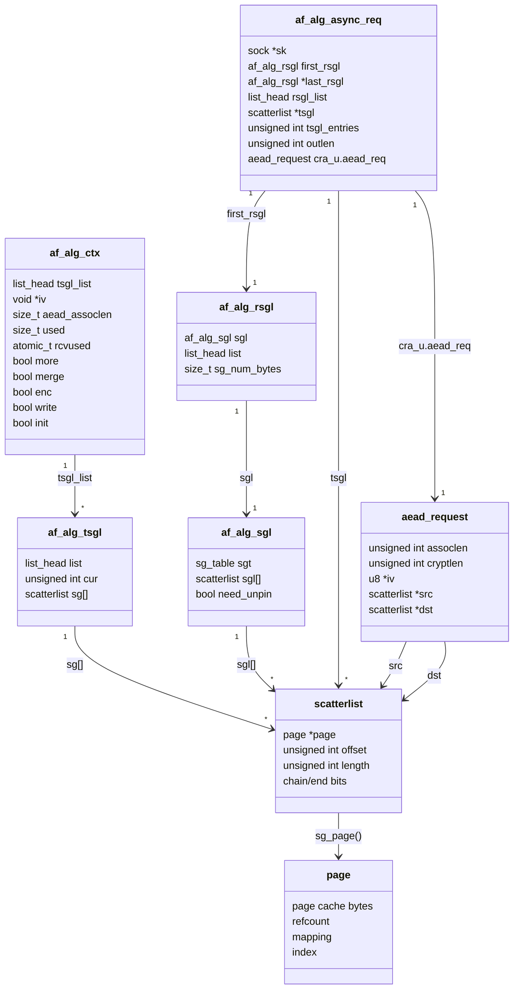

对应源码位置：

| 结构体/函数 | 本地源码位置 | 作用 |
|-------------|--------------|------|
| `struct af_alg_sgl` | `include/crypto/if_alg.h:58` | RX SGL 包装，内部有 `sg_table` 和 `scatterlist[]` |
| `struct af_alg_tsgl` | `include/crypto/if_alg.h:65` | TX SGL 节点，挂在 `ctx->tsgl_list` |
| `struct af_alg_async_req` | `include/crypto/if_alg.h:94` | 单次 `recvmsg()` 的请求对象 |
| `struct af_alg_ctx` | `include/crypto/if_alg.h:143` | AF_ALG socket 的长期上下文 |
| `struct aead_request` | `include/crypto/aead.h:90` | 传给 AEAD 算法的请求，核心字段是 `src/dst/assoclen/cryptlen` |
| `af_alg_sendmsg()` | `crypto/af_alg.c:909` | 把用户输入或 splice 页面放进 `ctx->tsgl_list` |
| `af_alg_pull_tsgl()` | `crypto/af_alg.c:682` | 从 `ctx->tsgl_list` 消费 scatterlist，可转移 page 引用到 `areq->tsgl` |
| `crypto_authenc_esn_decrypt()` | `crypto/authencesn.c:253` | 触发 `authencesn` 解密和 scratch write |

## 2. 触发参数模型

为了让状态图可读，使用下面这些符号：

```text
P_file       = 目标文件的 page cache page，例如 /usr/bin/su 的某个 struct page
P_rx         = recvmsg 用户输出缓冲区 pin 出来的 page
payload4     = 攻击者控制的 4 字节
t            = 目标文件内想写入的偏移
as           = authsize，PoC 中为 4
assoclen     = AAD 长度，PoC 中为 8
AAD          = "AAAA" + payload4
splice_len   = t + 4
recv_len     = 8 + t
```

AEAD 解密输入逻辑是：

```text
AAD || CT || Tag
```

PoC 让 `Tag` 的 4 字节来自文件 page cache 中“想被覆盖的位置”。之后 `authencesn` 会把 AAD 中拆出来的 `payload4` 写到 `dst[assoclen + cryptlen]` 附近。漏洞版 `algif_aead` 的 in-place 链接让这个位置落到 `P_file`。

## 3. S0：accept 后的初始对象

`accept()` 创建操作 socket 后，`aead_accept_parent_nokey()` 会分配并初始化 `af_alg_ctx`。

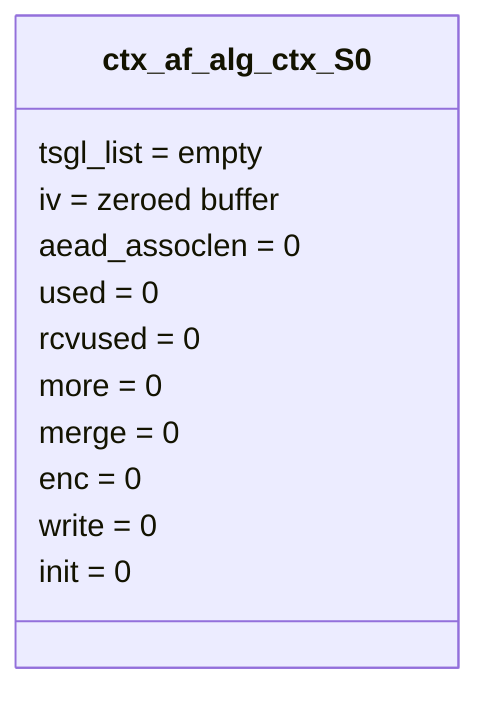

此时还没有 TX SGL，也没有 RX SGL。

## 4. S1：sendmsg 发送控制信息和 AAD

用户调用 `sendmsg(op_fd, AAD, CMSG)`：

```text
CMSG:
  ALG_SET_OP            = ALG_OP_DECRYPT
  ALG_SET_IV            = IV
  ALG_SET_AEAD_ASSOCLEN = 8

data:
  AAD = "AAAA" + payload4

flags:
  MSG_MORE
```

`af_alg_sendmsg()` 中关键赋值：

```c
ctx->enc = enc;                  // ALG_OP_DECRYPT => false
memcpy(ctx->iv, con.iv->iv, ivsize);
ctx->aead_assoclen = con.aead_assoclen;
ctx->used += plen;
ctx->more = msg->msg_flags & MSG_MORE;
```

对象状态变成：

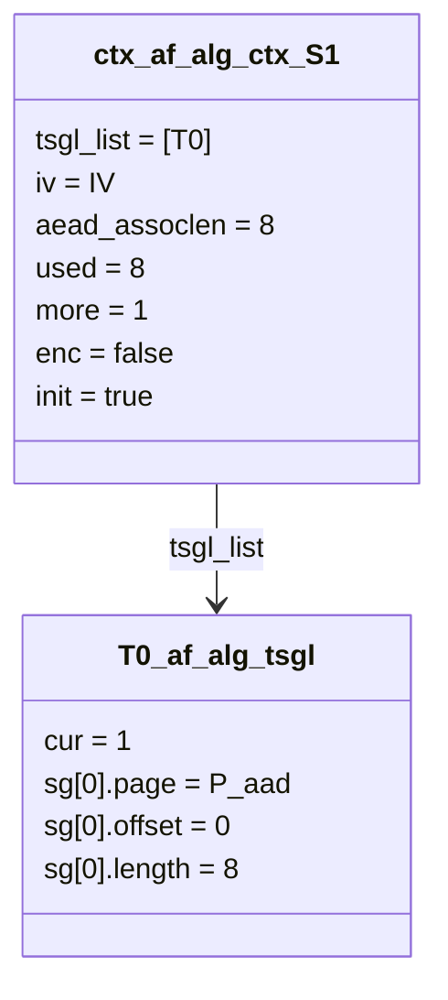

这里 `P_aad` 通常是 AF_ALG 普通 sendmsg 路径分配的内核页，不是漏洞关键。真正危险的对象在下一步出现。

## 5. S2：splice 把文件 page cache 引入 TX SGL

用户调用：

```text
splice(file_fd -> pipe, splice_len = t + 4)
splice(pipe -> op_fd,  splice_len = t + 4)
```

第二次 splice 进入 `af_alg_sendmsg()` 的 `MSG_SPLICE_PAGES` 分支。本地修复后源码仍能看到这个行为：

```c
plen = extract_iter_to_sg(&msg->msg_iter, len, &sgtable, ...);
for (; sgl->cur < sgtable.nents; sgl->cur++)
    get_page(sg_page(&sg[sgl->cur]));
ctx->used += plen;
```

关键是：`extract_iter_to_sg()` 填的是指向原 page 的 scatterlist，不复制文件内容。

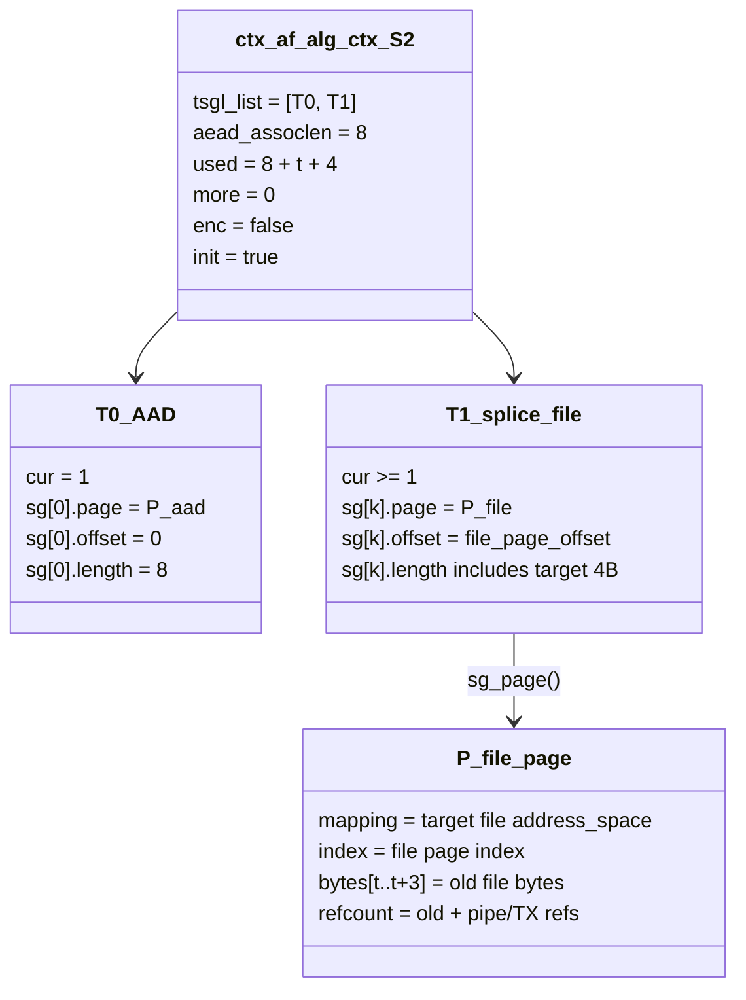

此时的要点：

| 成员 | S1 | S2 |
|------|----|----|
| `ctx->used` | `8` | `8 + t + 4` |
| `ctx->more` | `1` | `0`，可以被 `recvmsg()` 消费 |
| `ctx->tsgl_list` | 只有 AAD | AAD 后追加文件 page cache 的 SG |
| `T1.sg[k].page` | 不存在 | `P_file` |
| `P_file.bytes` | 原文件内容 | 仍是原文件内容，还没有被写 |

## 6. S3：recvmsg 分配 areq 和 RX SGL

`recvmsg(op_fd, recv_len = 8 + t)` 进入漏洞版 `_aead_recvmsg()`。先计算几个局部变量：

```text
ctx->used = 8 + t + 4
as        = 4
outlen    = ctx->used - as = 8 + t
used      = ctx->used - ctx->aead_assoclen = t + 4
processed = used + ctx->aead_assoclen = 8 + t + 4
```

然后 `af_alg_alloc_areq()` 和 `af_alg_get_rsgl()` 生成请求对象：

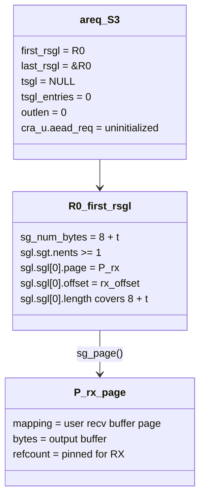

此时 `P_file` 还只在 `ctx->tsgl_list` 里，`areq->tsgl` 还没指向它。

## 7. S4：漏洞版先把 AAD + CT 复制到 RX SGL

修复前 `_aead_recvmsg()` 的解密分支中：

```c
memcpy_sglist(areq->first_rsgl.sgl.sgt.sgl, tsgl_src, outlen);
```

也就是把 `outlen = 8 + t` 字节复制到 RX SGL。

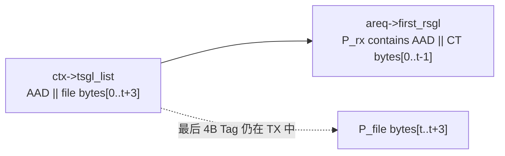

状态变化：

| 对象成员 | S3 | S4 |
|----------|----|----|
| `R0.sgl.sgl[0].page` | `P_rx` | `P_rx` |
| `P_rx.bytes[0..7]` | 未定义/用户缓冲旧值 | AAD |
| `P_rx.bytes[8..8+t-1]` | 未定义/用户缓冲旧值 | 从 TX 复制来的 CT/文件字节 |
| `P_file.bytes[t..t+3]` | 原文件 4 字节 | 仍未变 |

## 8. S5：漏洞版把 Tag 对应的文件页转移到 areq->tsgl

漏洞版为了 in-place 解密，只把末尾 tag 保留到请求级 `areq->tsgl`：

```c
areq->tsgl_entries = af_alg_count_tsgl(sk, processed, processed - as);
areq->tsgl = sock_kmalloc(...);
sg_init_table(areq->tsgl, areq->tsgl_entries);
af_alg_pull_tsgl(sk, processed, areq->tsgl, processed - as);
```

这里：

```text
processed      = 8 + t + 4
processed - as = 8 + t
as             = 4
```

所以 `areq->tsgl` 只接收最后 4 字节 tag。PoC 把这个 tag 对齐到目标文件偏移 `t`，因此：

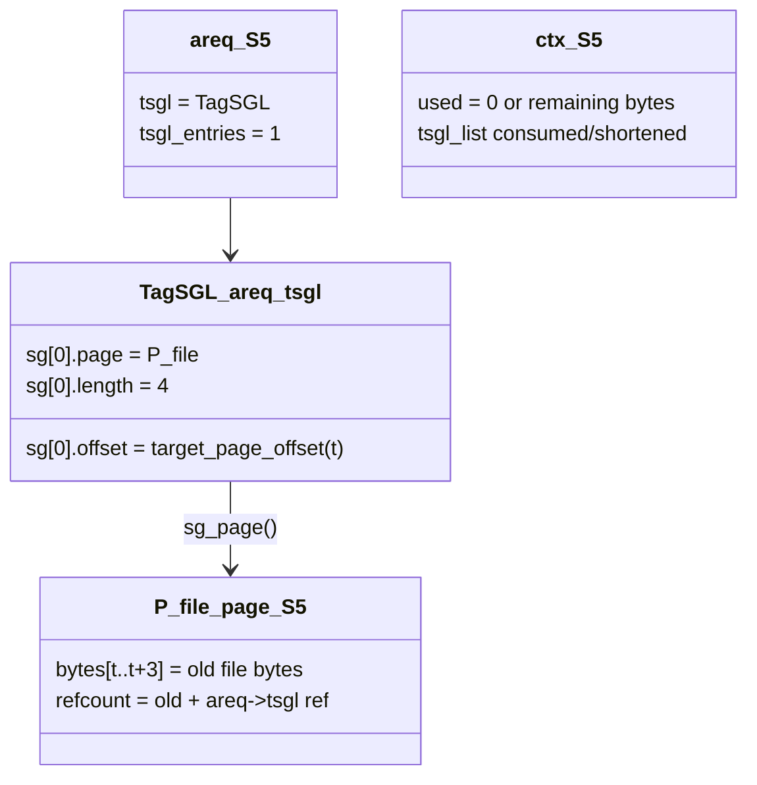

关键成员变化：

| 成员 | S4 | S5 |
|------|----|----|
| `areq->tsgl` | `NULL` | 指向新分配的 `scatterlist[]` |
| `areq->tsgl[0].page` | 不存在 | `P_file` |
| `areq->tsgl[0].offset` | 不存在 | 文件目标偏移所在 page 内 offset |
| `areq->tsgl[0].length` | 不存在 | `4` |
| `ctx->tsgl_list` | 仍持有输入 | 被 `af_alg_pull_tsgl()` 消费/释放 |
| `P_file.bytes[t..t+3]` | 原文件 4 字节 | 仍未变 |

`af_alg_pull_tsgl()` 本身不修改 page 内容，只做 `get_page()`、`sg_set_page()`、`put_page()` 和 `sg[i].offset/length` 调整。

## 9. S6：漏洞版 sg_chain 让 RX SGL 后面接上文件页

漏洞版接着执行：

```c
sg_unmark_end(sg + sgl_prev->sgt.nents - 1);
sg_chain(sg, sgl_prev->sgt.nents + 1, areq->tsgl);
```

对象关系变成：

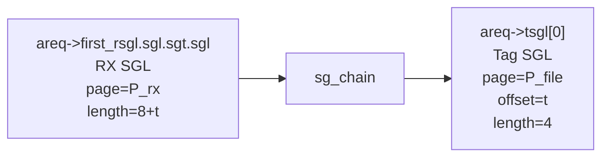

这一步非常关键：`P_file` 没有变成 RX page，但它被链接到了 RX SGL 的逻辑链尾。后续 scatterwalk 按逻辑连续空间走时，会从 `P_rx` 继续走到 `P_file`。

此时 `rsgl_src` 和 `dst` 的关系：

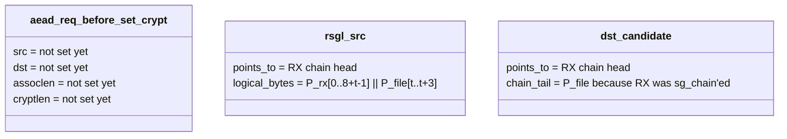

## 10. S7：aead_request_set_crypt 后的漏洞态对象

漏洞版最后设置 AEAD 请求：

```c
aead_request_set_crypt(&areq->cra_u.aead_req,
                       rsgl_src,
                       areq->first_rsgl.sgl.sgt.sgl,
                       used,
                       ctx->iv);
aead_request_set_ad(&areq->cra_u.aead_req, ctx->aead_assoclen);
```

成员值快照：

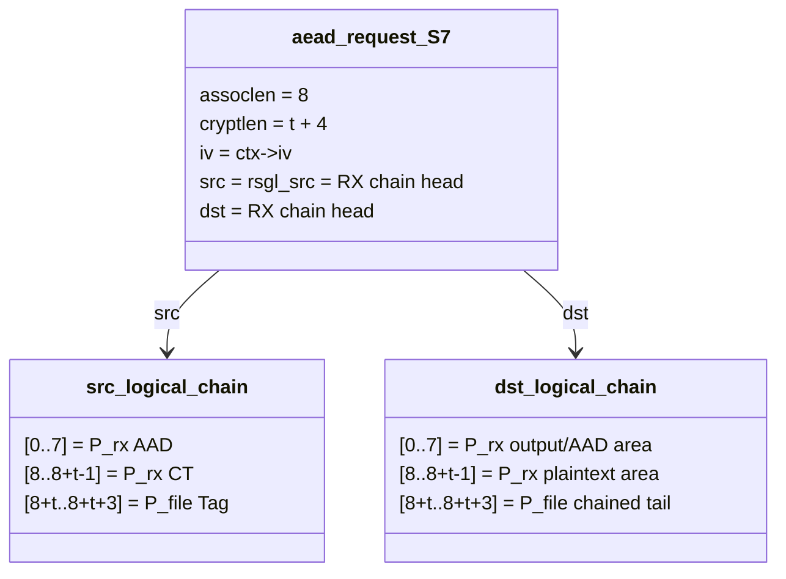

从 C 指针看，`src` 和 `dst` 都是 RX 链头；从逻辑 scatterlist 链看，RX 链尾已经接上 `P_file`。这就是漏洞版“in-place”的危险点。

## 11. S8：authencesn 写入时成员值如何导致 page cache 被改

`crypto_authenc_esn_decrypt()` 中关键代码：

```c
unsigned int assoclen = req->assoclen;
unsigned int cryptlen = req->cryptlen;
struct scatterlist *src = req->src;
struct scatterlist *dst = req->dst;

cryptlen -= authsize;
scatterwalk_map_and_copy(tmp, src, 0, 8, 0);
if (src == dst) {
    scatterwalk_map_and_copy(tmp, dst, 4, 4, 1);
    scatterwalk_map_and_copy(tmp + 1, dst, assoclen + cryptlen, 4, 1);
    dst = scatterwalk_ffwd(areq_ctx->dst, dst, 4);
}
```

代入 PoC 的关键值：

```text
req->assoclen = 8
req->cryptlen = t + 4
authsize = 4

函数内部:
  cryptlen = req->cryptlen - authsize = t
  写入位置 = assoclen + cryptlen = 8 + t
```

而 S7 的逻辑链是：

```text
dst logical chain:
  [0, 8+t)       -> P_rx
  [8+t, 8+t+4)   -> P_file
```

所以：

```text
scatterwalk_map_and_copy(tmp + 1, dst, 8 + t, 4, 1)
  => 写入 P_file.bytes[t..t+3]
```

写入前后：

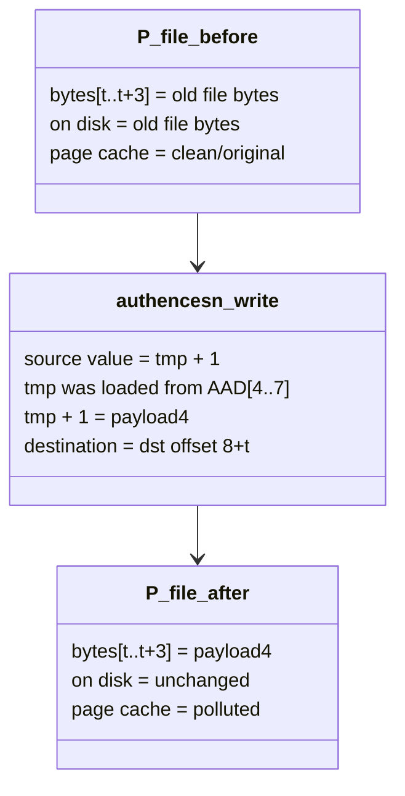

随后 HMAC 校验失败会返回 `-EBADMSG`，但这次写入发生在认证失败之前，没有回滚逻辑。

## 12. 全状态压缩图

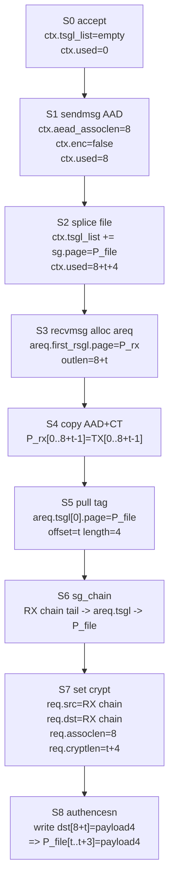

## 13. 修复后对象关系为什么安全

修复后本地源码的 `_aead_recvmsg()` 不再做“只拉 tag + sg_chain 到 RX”。它改为：

```c
processed = used + ctx->aead_assoclen;
areq->tsgl_entries = af_alg_count_tsgl(sk, processed);
areq->tsgl = sock_kmalloc(...);
sg_init_table(areq->tsgl, areq->tsgl_entries);
af_alg_pull_tsgl(sk, processed, areq->tsgl);
tsgl_src = areq->tsgl;

rsgl_src = areq->first_rsgl.sgl.sgt.sgl;
memcpy_sglist(rsgl_src, tsgl_src, ctx->aead_assoclen);

aead_request_set_crypt(&areq->cra_u.aead_req,
                       tsgl_src,
                       areq->first_rsgl.sgl.sgt.sgl,
                       used,
                       iv);
```

修复后状态：

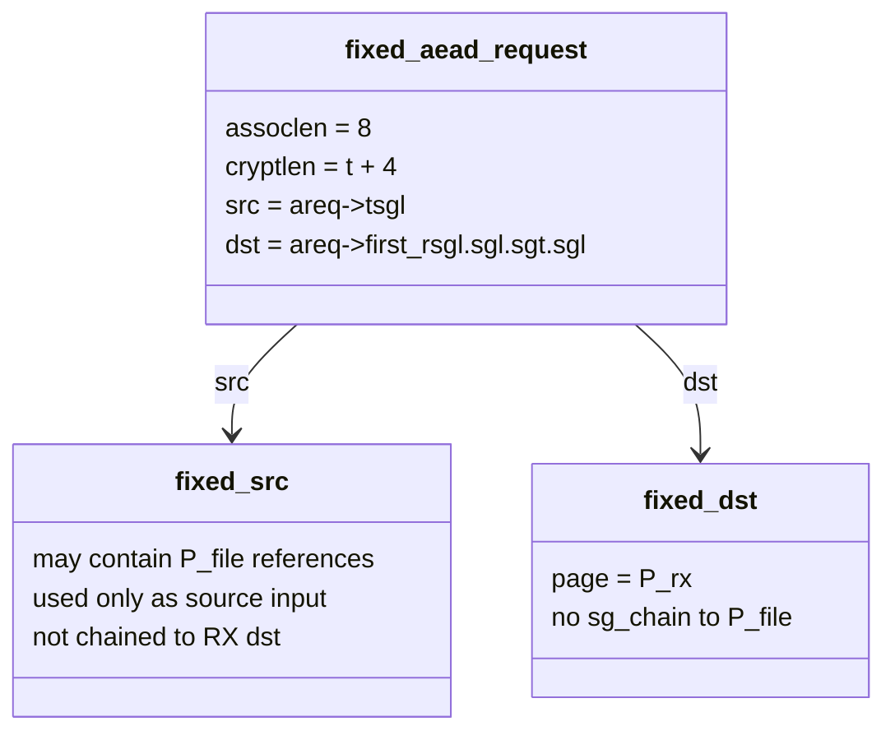

对比表：

| 成员 | 漏洞版 | 修复后 |
|------|--------|--------|
| `areq->tsgl` | 只保存 tag，可能是 `P_file[t..t+3]` | 保存完整 processed 输入 |
| `RX SGL` | 被 `sg_chain()` 接上 `areq->tsgl` | 不接上 `areq->tsgl` |
| `req->src` | RX 链头，逻辑链尾可到 `P_file` | `areq->tsgl` |
| `req->dst` | RX 链头，且链尾可到 `P_file` | RX SGL，仅用户输出页 |
| `authencesn` scratch write | `dst[8+t]` 可落到 `P_file` | `dst[8+t]` 不再通过 RX 链到达 `P_file` |

## 14. 一句话记忆

这个 CVE 的结构体本质是：

```text
ctx->tsgl_list.sg.page = P_file
    -> areq->tsgl.sg.page = P_file
    -> sg_chain(RX, areq->tsgl)
    -> req.dst = RX chain head
    -> authencesn writes dst[8+t]
    -> scatterwalk follows RX chain into P_file
    -> page cache 4 bytes changed
```

