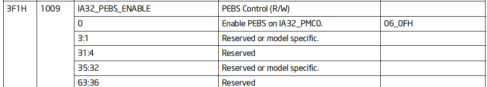

我这边主要分析的是和CPU 1堆栈相关内容

# CPU 1堆栈分析
##  CPU 堆栈

```
crash> bt -c 1 -f
PID: 2757   TASK: ffff8803e0e40000  CPU: 1   COMMAND: "qemu-kvm"
 #0 [ffff88003e5ebce8] __schedule at ffffffff816a8f45
    ffff88003e5ebcf0: ffff88043ea73280 0000000000000000 
    ffff88003e5ebd00: ffff88003e5ebd48 ffffffffc09a9833 
 #1 [ffff88003e5ebd08] kvm_mmu_load at ffffffffc09a9833 [kvm]
    ffff88003e5ebd10: ffff88003e5ebd48 000000000916619e 
    ffff88003e5ebd20: ffff88043ea73280 0000000000000000 
    ffff88003e5ebd30: 0000000000000001 0000000000000000 
    ffff88003e5ebd40: 0000000000000001 ffff88003e5ebdc8 
    ffff88003e5ebd50: ffffffffc09920fb 
 #2 [ffff88003e5ebd50] vcpu_enter_guest at ffffffffc09920fb [kvm]
    ffff88003e5ebd58: ffff88003e5ebda8 ffffffffc099689c 
    ffff88003e5ebd68: 000000013e5ebfd8 000000000916619e 
    ffff88003e5ebd78: 00ff8803e0e40000 ffff88043ea73280 
    ffff88003e5ebd88: ffff8800ab5e0000 0000000000000000 
    ffff88003e5ebd98: 000000000916619e ffff88043ea73280 
    ffff88003e5ebda8: ffff88003e5ebfd8 ffff8803e0e40000 
    ffff88003e5ebdb8: ffff8803f9678048 0000000000000001 
    ffff88003e5ebdc8: ffff88003e5ebe10 ffffffffc0999e1d 
 #3 [ffff88003e5ebdd0] kvm_arch_vcpu_ioctl_run at ffffffffc0999e1d [kvm]
	...
 #4 [ffff88003e5ebe18] kvm_vcpu_ioctl at ffffffffc097f1f1 [kvm]
	...

 #5 [ffff88003e5ebeb0] do_vfs_ioctl at ffffffff812151cd
	...

 #6 [ffff88003e5ebf30] sys_ioctl at ffffffff81215471
	...

 #7 [ffff88003e5ebf80] system_call_fastpath at ffffffff816b4fc9
	...
```

从这个堆栈打印来看, 最终的调用顺序是`vcpu_enter_guest`->`kvm_mmu_load`->
`__schedule`。但是根据

```
#0 [ffff88003e5ebce8] __schedule at ffffffff816a8f45
       ^                    ^              ^
       |                    |              |
     堆栈地              调用者函数  调用者函数的返回地址
```
实际上就是`kvm_mmu_load`函数调用的函数，假设该函数为A(),
A()在调用某函数时(假设B())，会使用`call`指令，将A()的下一
条指令压入栈, 所以`ffff88003e5ebce8`栈地址处的内容应该是
`ffffffff816a8f45`, 但是通过x指令查看`ffff88003e5ebce8`地址
的内存，如下:

```
crash> x/1xg 0xffff88003e5ebce8
0xffff88003e5ebce8:     0x0000000000000000
```

所以，该堆栈#0 实际上是不正确的。

从下面的堆栈信息看，
```
 #1 [ffff88003e5ebd08] kvm_mmu_load at ffffffffc09a9833 [kvm]
```
`kvm_mmu_load`函数调用子函数的返回地址为`ffffffffc09a9833`
***
查看`kvm_mmu_load`反汇编代码
```
...
0xffffffffc09a95b2 <kvm_mmu_load+18>:   mov    %rdi,%rbx
...
0xffffffffc09a982d <kvm_mmu_load+653>:  callq  *0x348(%rbx)
0xffffffffc09a9833 <kvm_mmu_load+659>:  jmpq   0xffffffffc09a95c5 <kvm_mmu_load+37> <---调用子函数的返回地址
```

这里的rbx, 是赋值的rdi, 也就是`kvm_mmu_load`的第一个参数，如下面所示

```
int kvm_mmu_load(struct kvm_vcpu *vcpu)
```

经过推导(推导过程略)第一个参数的地址为`ffff88043ea73280`:
`0x348`这个偏移实际上是`struct kvm_vcpu.arch.mmu.set_cr3`


查看该成员

```
crash> struct kvm_vcpu.arch ffff88043ea73280 -o -p
struct kvm_vcpu {
  [ffff88043ea73490] struct kvm_vcpu_arch arch;
}
crash> struct kvm_vcpu_arch.mmu ffff88043ea73490 |head
  mmu = {
    set_cr3 = 0xffffffffc07a2190 <vmx_set_cr3>,
...
```
也就是说，实际上调用流程为`kvm_mmu_load->vmx_set_cr3`

但是又不像调用的`vmx_set_cr3`函数原因主要有以下两条:
* vmx_set_cr3函数中，没有可以阻塞住的流程(死循环，或者锁)
* 根据下面的`vmx_set_cr3`堆栈和代码来看:

堆栈:
```
0xffff88003e5ebcb0:     0x0000000000000001              0xffff88043ec8aef8
0xffff88003e5ebcc0:     0xffff88003e5ebcfc              0xffff88043ea73280(上一层的pc)
0xffff88003e5ebcd0:     0xffff88043ea73280(-0x18)       0xffff88003e5ebd48(-0x10)
0xffff88003e5ebce0:     0x0000000000006c14(-0x8)        0x0000000000000000(rbx)
   ffff88003e5ebcf0: ffff88043ea73280(r12)   0000000000000000(r13)
   ffff88003e5ebd00: ffff88003e5ebd48(rbp)   ffffffffc09a9833(pc)
#1 [ffff88003e5ebd08] kvm_mmu_load at ffffffffc09a9833 [kvm]
   ffff88003e5ebd10: ffff88003e5ebd48            000000000916619e
   ffff88003e5ebd20: ffff88043ea73280            0000000000000000
   ffff88003e5ebd30: 0000000000000001            0000000000000000
   ffff88003e5ebd40: 0000000000000001            ffff88003e5ebdc8
   ffff88003e5ebd50: ffffffffc09920fb

```
代码:
```
0xffffffffc07a2190 <vmx_set_cr3>:   nopl   0x0(%rax,%rax,1) [FTRACE NOP]
0xffffffffc07a2195 <vmx_set_cr3+5>: push   %rbp
0xffffffffc07a2196 <vmx_set_cr3+6>: mov    %rsp,%rbp
0xffffffffc07a2199 <vmx_set_cr3+9>: push   %r13
0xffffffffc07a219b <vmx_set_cr3+11>:    push   %r12
0xffffffffc07a219d <vmx_set_cr3+13>:    mov    %rsi,%r12
0xffffffffc07a21a0 <vmx_set_cr3+16>:    push   %rbx
0xffffffffc07a21a1 <vmx_set_cr3+17>:    mov    %rdi,%rbx
0xffffffffc07a21a4 <vmx_set_cr3+20>:    sub    $0x18,%rsp
```
从这里可以看出, rbx寄存器压入栈的值为:0x0000000000000000, 而上一层函数
`vcpu_enter_guest`是将`struct kvm_vcpu`的地址存放在rbx，所以这个地方显示的不正确.

* 根据`vcpu_enter_guest`堆栈看
```
#2 [ffff88003e5ebd50] vcpu_enter_guest at ffffffffc09920fb [kvm]
```

汇编代码:
```
dis -l vcpu_enter_guest
/usr/src/debug/kernel-3.10.0-693.el7/linux-3.10.0-693.el7.x86_64/arch/x86/kvm/x86.c: 6703
0xffffffffc09920eb <vcpu_enter_guest+635>:  mov    0x4eafe(%rip),%rax        # 0xffffffffc09e0bf0 <kvm_x86_ops>
0xffffffffc09920f2 <vcpu_enter_guest+642>:  mov    %rbx,%rdi
0xffffffffc09920f5 <vcpu_enter_guest+645>:  callq  *0x178(%rax)
```

通过 `dis -l`可以得到`%rax`存放地址所代表全局变量,实际上是`kvm_x86_ops`
通过crash命令查看偏移代表的函数:

```
crash> p 0x178
$4 = 376
crash> struct kvm_x86_ops -o
...
[376] void (*run)(struct kvm_vcpu *);
...

crash> x/1xg 0xffffffffc09e0bf0
0xffffffffc09e0bf0 <kvm_x86_ops>:       0xffffffffc07b7140
crash> struct kvm_x86_ops.run 0xffffffffc07b7140
  run = 0xffffffffc079e8c0 <vmx_vcpu_run>
```

从上面来看, `vcpu_enter_guest`->`vmx_vcpu_run`

## 堆栈

```
0xffff88003e5ebcb0:     0x0000000000000001              0xffff88043ec8aef8
0xffff88003e5ebcc0:     0xffff88003e5ebcfc              0xffff88043ea73280        
0xffff88003e5ebcd0:     0xffff88043ea73280              0xffff88003e5ebd48        
0xffff88003e5ebce0:     0x0000000000006c14              0x0000000000000000(调用的下次压栈地址 rsp -0x38)
   ffff88003e5ebcf0: ffff88043ea73280(-0x58) 		0000000000000000(-0x50)
   ffff88003e5ebd00: ffff88003e5ebd48(-0x48) 		ffffffffc09a9833(-0x40)
#1 [ffff88003e5ebd08] kvm_mmu_load at ffffffffc09a9833 [kvm]
   ffff88003e5ebd10: ffff88003e5ebd48(-0x38)		000000000916619e(-0x30)
   ffff88003e5ebd20: ffff88043ea73280(rbx)(rsp) 	0000000000000000(-0x20)(r12)
   ffff88003e5ebd30: 0000000000000001(r13) 		0000000000000000(-0x20)(r14)
   ffff88003e5ebd40: 0000000000000001(r15)		ffff88003e5ebdc8(rbp寄存器地址)
   ffff88003e5ebd50: ffffffffc09920fb
#2 [ffff88003e5ebd50] vcpu_enter_guest at ffffffffc09920fb [kvm]
   ffff88003e5ebd58: ffff88003e5ebda8 ffffffffc099689c
   ffff88003e5ebd68: 000000013e5ebfd8 000000000916619e
   ffff88003e5ebd78: 00ff8803e0e40000 ffff88043ea73280
   ffff88003e5ebd88: ffff8800ab5e0000 0000000000000000
   ffff88003e5ebd98: 000000000916619e ffff88043ea73280
   ffff88003e5ebda8: ffff88003e5ebfd8 ffff8803e0e40000
   ffff88003e5ebdb8: ffff8803f9678048 0000000000000001
   ffff88003e5ebdc8: ffff88003e5ebe10 ffffffffc0999e1d
#3 [ffff88003e5ebdd0] kvm_arch_vcpu_ioctl_run at ffffffffc0999e1d [kvm]
   ffff88003e5ebdd8: fffffffe7ffbfeff 000000000916619e
   ffff88003e5ebde8: ffff88043ea73280 ffff8800ab5e1700
   ffff88003e5ebdf8: 0000000000000000 ffff88017a2b2500
   ffff88003e5ebe08: ffff8803e0e40000 ffff88003e5ebea8
   ffff88003e5ebe18: ffffffffc097f1f1
#4 [ffff88003e5ebe18] kvm_vcpu_ioctl at ffffffffc097f1f1 [kvm]
   ffff88003e5ebe20: 0000000000000000 000055d2495a6000
   ffff88003e5ebe30: ffff880401b38c80 000000000916619e
   ffff88003e5ebe40: 000000000916619e 000055d2495a6380
   ffff88003e5ebe50: 0000000000000081 0000000000000000
   ffff88003e5ebe60: 000055d2495a6380 ffff88003e5ebf58
   ffff88003e5ebe70: 0000004169359ca7 000000000916619e
   ffff88003e5ebe80: ffff88017a2b2500 0000000000000000
   ffff88003e5ebe90: ffff88017fbeee40 0000000000000000
   ffff88003e5ebea0: 0000000000000001 ffff88003e5ebf28
   ffff88003e5ebeb0: ffffffff812151cd
#5 [ffff88003e5ebeb0] do_vfs_ioctl at ffffffff812151cd
```

## kvm_mmu_load

```
0xffffffffc09a95a0 <kvm_mmu_load>:      nopl   0x0(%rax,%rax,1) [FTRACE NOP]
0xffffffffc09a95a5 <kvm_mmu_load+5>:    push   %rbp
0xffffffffc09a95a6 <kvm_mmu_load+6>:    mov    %rsp,%rbp
0xffffffffc09a95a9 <kvm_mmu_load+9>:    push   %r15
0xffffffffc09a95ab <kvm_mmu_load+11>:   push   %r14
0xffffffffc09a95ad <kvm_mmu_load+13>:   push   %r13
0xffffffffc09a95af <kvm_mmu_load+15>:   push   %r12
0xffffffffc09a95b1 <kvm_mmu_load+17>:   push   %rbx
0xffffffffc09a95b2 <kvm_mmu_load+18>:   mov    %rdi,%rbx
0xffffffffc09a95b5 <kvm_mmu_load+21>:   sub    $0x10,%rsp
```


## msg

```
crash> struct vcpu_vmx.nested ffff88003e5ebd48
  nested = {
    vmxon = false,
    vmxon_ptr = 0,
    current_vmptr = 0,
    current_vmcs12_page = 0x0,
    current_vmcs12 = 0x0,
    cached_vmcs12 = 0x0,
    sync_shadow_vmcs = false,
    vmcs02_pool = {
      next = 0x0,
      prev = 0x0
    },
    vmcs02_num = 0,
    change_vmcs01_virtual_x2apic_mode = false,
    nested_run_pending = false,
    apic_access_page = 0x0,
    virtual_apic_page = 0x0,
    pi_desc_page = 0x0,
    pi_desc = 0x0,
    pi_pending = false,

crash> struct vcpu_vmx.soft_vnmi_blocked ffff88003e5ebd48
  soft_vnmi_blocked = 0

crash> struct vcpu_vmx.emulation_required ffff88003e5ebd48
  emulation_required = false
crash> struct vcpu_vmx.ple_window_dirty ffff88003e5ebd48
  ple_window_dirty = false

```

# vmx abort调查

## 调查起因
查看vcpu 1 的`vmcs`结构体
```
crash> struct vcpu_vmx.loaded_vmcs 0xffff88043ea73280
  loaded_vmcs = 0xffff880225b74718
crash> struct loaded_vmcs.vmcs 0xffff880225b74718
  vmcs = 0xffff880004914000
crash> struct vmcs 0xffff880004914000
struct vmcs {
  revision_id = 4,
  abort = 4,
  data = 0xffff880004914008 ""
}
```
可以看出`vmcs->abort`实际上是`4`, 所以vcpu 1 实际上出发了vmx abort

## vmx abort机制
vmx abort机制在手册中`26.7 VMX ABORTS` 章节中，有这样的描述。

### vmx abort 触发原因
该章节手册开始有说明: 
```
A problem encountered during a VM exit leads to a VMX abort. 
A VMX abort takes a logical processor into a shutdown state 
as described below.
```
大概的意思就是在vm exit时，出现一些问题会导致vmx abort，该机制
会导致cpu进入shutdown状态。


### vmx abort reason 4
```
4. There was a failure on loading host MSRs (see Section 26.6).
```
如果在vm exit 时，load host MSR 失败时，会导致vmx abort reason 4。

26.6 章节对vm exit load host MSR 有细节描述：大概就是指这一行为会
load `VM-exit MSR-load area`(session 23.7.2)，如果有些不合理的寄存器
配置, 就会导致vmx-abort。

### vm exit load host MSR area
该区域有两个字段，手册中描述如下:
```
• VM-exit MSR-load count (32 bits). This field contains the number 
of MSRs to be loaded on VM exit. It is recommended that this count 
not exceed 512. Otherwise, unpredictable processor behavior (including 
a machine check) may result during VM exit.2

• VM-exit MSR-load address (64 bits). This field contains the physical 
address of the VM-exit MSR-load area. The area is a table of entries, 
16 bytes per entry, where the number of entries is given by the VM-exit 
MSR-load count (see Table 23-13). If the VM-exit MSR-load count is not 
zero, the address must be 16-byte aligned.
```
手册中描述的大概为
* `vm-exit MSR-load count`字段表述这个表中有存放了多少个entry。
* `vm-exit MSR-load area`字段表述这个entry数组的首地址

### MSR entry format
关于 MSR entry 的格式如下:
|Bit Position(s)| Contents|
|----|----|
|31:0 |MSR index|
|63:32 |Reserved|
|127:64 |MSR data|


### 关于触发VMX abort 之后 CPU state一段描述
```
After saving the VMX-abort indicator, operation of a logical 
processor experiencing a VMX abort depends on whether the 
logical processor is in SMX operation:1

• If the logical processor is in SMX operation, an Intel® TXT 
shutdown condition occurs. The error code used is 000DH, 
indicating “VMX abort.” See Intel® Trusted Execution Technology 
Measured Launched Environment Programming Guide.

• If the logical processor is outside SMX operation, it issues 
a special bus cycle (to notify the chipset) and enters the 
VMX-abort shutdown state. RESET is the only event that wakes a 
logical processor from the VMX-abort shutdown state. The following 
events do not affect a logical processor in this state: machine-check 
events; INIT signals; external interrupts; non-maskable interrupts 
(NMIs); start-up IPIs (SIPIs); and system-management interrupts (SMIs)
```
其中讲述到，如果逻辑处理器在SMX operation之外，当遇到VMX-abort时，
会进入`VMX-abort shutdown`状态，该状态只能接收RESET信号，其他信号如
INITs, 外部中断，NMIs，SIPIs以及SMIs都无法从该状态中唤醒CPU。

这个和该CASE比较像，该case在出发sysrq时，CPU 1 是无法接接受到NMIs, 而且
根据之前分析的栈信息可以看出，CPU 1是卡在了`vmx_vcpu_run`这个函数的那段汇编
程序中，如果是cpu 在vm exit 时候，发生了vmx abort，实际上会卡在那段汇编中。

## kernel 代码
### struct vcpu_vmx.msr_autoload 
在vcpu_vmx结构体中，有关于load msr的结构体:
代码如下:

```C/C++
struct vcpu_vmx {
...
    struct msr_autoload {
        unsigned nr;
        struct vmx_msr_entry guest[NR_AUTOLOAD_MSRS];
        struct vmx_msr_entry host[NR_AUTOLOAD_MSRS];
    } msr_autoload;
...
}
```

其中`msr_autoload.host`代表vm exit时 load的host MSR。

### 初始化代码

vmcs中初始化代码是在`vmx_vcpu_setup`时初始化的，代码如下:

```C/C++
static int vmx_vcpu_setup(struct vcpu_vmx *vmx) 
{
    ...
    vmcs_write32(VM_EXIT_MSR_STORE_COUNT, 0);
	//初始化load count
    vmcs_write32(VM_EXIT_MSR_LOAD_COUNT, 0);
	//初始化load addr
    vmcs_write64(VM_EXIT_MSR_LOAD_ADDR, __pa(vmx->msr_autoload.host));
    vmcs_write32(VM_ENTRY_MSR_LOAD_COUNT, 0);
    vmcs_write64(VM_ENTRY_MSR_LOAD_ADDR, __pa(vmx->msr_autoload.guest));
    ...
}
```

###  继续分析vmcore

查看`vcpu_vmx.msr_autoload.host`数组, 如下:
```
crash> struct vcpu_vmx.msr_autoload 0xffff88043ea73280
  msr_autoload = {
    nr = 1,
	...
    guest = {{
        index = 1009,
        reserved = 0,
        value = 0
 
    host = {{
        index = 1009,
        reserved = 0,
        value = 2
	...
  };
```
可以看出，只有一个数组成员，该数组成员在msr index为1009，
该value是2.
在手册中找到,如下图 :
<div style="text-align: center;">

<br />
图1. io路径(1)
</div>

关于这个寄存器了解不是太多，但是
根据该处理器型号:
```
CPU0: Intel(R) Core(TM) i5-6500 CPU @ 3.20GHz (fam: 06, model: 5e, stepping: 03)
```
查找手册`18.3.8.1 Processor Event Based Sampling (PEBS) Facility`
中有一句话说明:

```
Only IA32_PMC0 through IA32_PMC3 support PEBS.
```
感觉这个很有关系(猜测), 有待进一步调查
