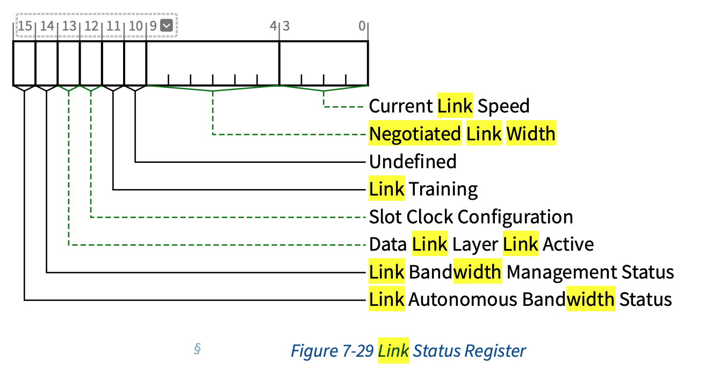

## 现象
有一张ib卡出现了pcie 通道`16x->8x`的情况:
```
31:00.0 Infiniband controller: Mellanox Technologies MT28908 Family [ConnectX-6]
        Subsystem: Mellanox Technologies MT28908 Family [ConnectX-6]
        Physical Slot: 3
        Control: I/O- Mem+ BusMaster+ SpecCycle- MemWINV- VGASnoop- ParErr+ Stepping- SERR+ FastB2B- DisINTx+
        Status: Cap+ 66MHz- UDF- FastB2B- ParErr- DEVSEL=fast >TAbort- <TAbort- <MAbort- >SERR- <PERR- INTx-
        Latency: 0, Cache Line Size: 32 bytes
        Interrupt: pin A routed to IRQ 18
        NUMA node: 0
        Region 0: Memory at 202ffc000000 (64-bit, prefetchable) [size=32M]
        Expansion ROM at a6400000 [disabled] [size=1M]
        Capabilities: [60] Express (v2) Endpoint, MSI 00
                DevCap: MaxPayload 512 bytes, PhantFunc 0, Latency L0s unlimited, L1 unlimited
                        ExtTag+ AttnBtn- AttnInd- PwrInd- RBE+ FLReset+ SlotPowerLimit 75.000W
                DevCtl: CorrErr+ NonFatalErr+ FatalErr+ UnsupReq-
                        RlxdOrd+ ExtTag+ PhantFunc- AuxPwr- NoSnoop+ FLReset-
                        MaxPayload 512 bytes, MaxReadReq 4096 bytes
                DevSta: CorrErr+ NonFatalErr- FatalErr- UnsupReq+ AuxPwr- TransPend-
                LnkCap: Port #0, Speed 16GT/s, Width x16, ASPM not supported
                                 ^^^^^^^^^^^^^^^^^^^^^^^^
                        ClockPM- Surprise- LLActRep- BwNot- ASPMOptComp+
                LnkCtl: ASPM Disabled; RCB 64 bytes, Disabled- CommClk+
                        ExtSynch- ClockPM- AutWidDis- BWInt- AutBWInt-
                LnkSta: Speed 16GT/s (ok), Width x8 (downgraded)
                        ^^^^^^^^^^^^^^^^^^^^^^^^^^^^^^^^^^^^^^^
                        TrErr- Train- SlotClk+ DLActive- BWMgmt- ABWMgmt-
```

## 查看PCIe手册



`current link speed`:
> **Current Link Speed** - This field indicates the **_negotiated_** Link speed of the given
> PCI Express Link.
> 
> The encoded value specifies a Bit Location in the Supported Link Speeds Vector
> (in the Link Capabilities 2 Register) that corresponds to the current Link
> speed. 
> 
> Defined encodings are:
> 
> * 0001b Supported Link Speeds Vector field bit 0 
> * 0010b Supported Link Speeds Vector field bit 1 
> * 0011b Supported Link Speeds Vector field bit 2 
> * 0100b Supported Link Speeds Vector field bit 3 
> * 0101b Supported Link Speeds Vector field bit 4
> * 0110b Supported Link Speeds Vector field bit 5
> * 0111b Supported Link Speeds Vector field bit 6
> 
> All other encodings are Reserved.
>
> The value in this field is undefined when the Link is not up.

**Negotiated Link Width** -  This field indicates the negotiated width of the
given PCI Express Link. This includes the Link Width determined during **initial
link training** as well changes that occur after initial link training (e.g., **L0p**)

Defined encodings are: 
* **00 0001b** x1 
* **00 0010b** x2 
* **00 0100b** x4 
* **00 1000b** x8 
* **01 0000b** x16

All other encodings are Reserved. The value in this field is undefined when the
Link is not up.

> NOTE
>
> `L0p` 是 PCIe 6.0支持的feature。我们先不看

通过上面可知, link bandwidth 是协商得来的. 

手册中关于协商部分，细节很多，简单的流程可以看链接[1]. 个人猜测大概率是bios配置
问题. 

## dmidecode 查看slot link bandwidth
```
root@ibs04:~# dmidecode -t slot
# dmidecode 3.3
Getting SMBIOS data from sysfs.
SMBIOS 3.3.0 present.

Handle 0x0004, DMI type 9, 24 bytes
System Slot Information
        Designation: CPU1_1A
        Type: x16 PCI Express 3 x16
        Current Usage: In Use
        Length: Long
        ID: 5
        Characteristics:
                3.3 V is provided
                PME signal is supported
        Bus Address: 0000:17:00.0
        Data Bus Width: 0
        Peer Devices: 0
        Height: Not applicable

Handle 0x0005, DMI type 9, 24 bytes
System Slot Information
        Designation: CPU1_2A
        Type: x8 PCI Express 3 x8
        Current Usage: In Use
        Length: Short
        ID: 3
        Characteristics:
                3.3 V is provided
                PME signal is supported
        Bus Address: 0000:31:00.0
                     ^^^^^^^^^^^^
        Data Bus Width: 0
        Peer Devices: 0
        Height: Not applicable

Handle 0x0006, DMI type 9, 24 bytes
System Slot Information
        Designation: CPU1_4A
        Type: x8 PCI Express 3 x8
        Current Usage: In Use
        Length: Short
        ID: 19
        Characteristics:
                3.3 V is provided
                PME signal is supported
        Bus Address: 0000:4b:00.0
        Data Bus Width: 0
        Peer Devices: 0
        Height: Not applicable
```

可以看到slot是x8的link width。

需要进一步查看bios配置.

<!-- ## 4.2.5 Link Initialization and Training
 
### 4.2.5.2 Alternate Protocol Negotiation
--->

## 参考链接
1. [PCIe Link training时width是如何协商的？](https://www.cnblogs.com/wanglouxiaozi/p/18946244)
