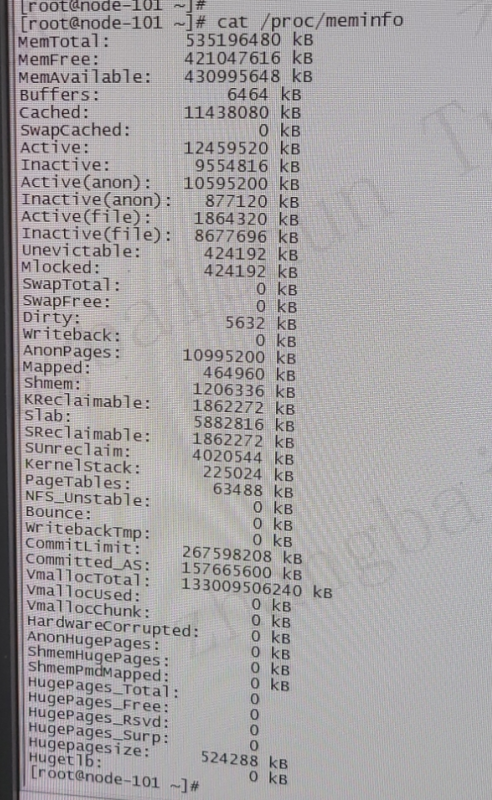
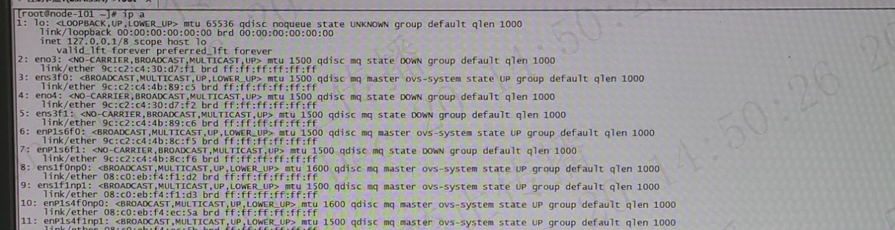

# 客户环境
客户环境为
* 浪潮CS5260
* 长城擎天EF860
* 紫光恒越R3810G5

我们主要找两个环境进行分析:
* 53环境(浪潮CS5260)
* 52环境(华为)
其中，52环境没有这个问题, 53环境有
# 53环境分析(node-2)
## 环境内存信息获取
```
[root@node-2 wangfuqiang]# free -g
              total        used        free      shared  buff/cache   available
Mem:            254          77         170           0           6         176
Swap:             0           0           0
[root@node-2 wangfuqiang]# cat /proc/meminfo |less
...
Active:         47975168 kB
Inactive:        5058112 kB
Slab:            5421632 kB
KernelStack:      900928 kB
...
```
可以看到，可跟踪的内存大概有58G左右, 还有大概19G内存。
## crash page 分析
### 通过crash找某些特征的page
找具有以下特征的内存:
* 找到已分配(_refcount > 0)
* 但是未在lru链表上的页(lru.next = 0xdead000000000100)

具体页有很多，但是有相似类型的统计如下:
```
lru.next          flags	            mapping           _mapcount  _refcount  统计数量
dead000000000100  35fffff000000000  0000000000000000  -1         0000ffff   60809
dead000000000100  31fffff000000000  0000000000000000  -1         0000ffff   34249
dead000000000100  2dfffff000000000  0000000000000000  -1         0000ffff   95058
dead000000000100  25fffff000000000  0000000000000000  -1         0000ffff   304
dead000000000100  21fffff000000000  0000000000000000  -1         0000ffff   2684
```
这部分内存约12G

其中page ffff7ffc9aa00040, 满足这一条件
```
ffff7ffc44901d40  dead000000000100  21fffff000000000  0000000000000000  -1  0000ffff
```
### 通过crash 工具查找下面地址
```
crash> search -p  ffff7ffc9aa00040
121dcef9fa0: ffff7ffc9aa00040
149862b6fb0: ffff7ffc9aa00040
149862b9fa0: ffff7ffc9aa00040
359c6694020: ffff7ffc9aa00040
crash> x/50xg 0xfffff26b86694000
0xfffff26b86694000:     0x00000358c0000000      0xffff7ffc9aa00000
0xfffff26b86694010:     0x0000ffff00000042      0x00000358c0010000
0xfffff26b86694020:     0xffff7ffc9aa00040      0x0000ffff00000042
0xfffff26b86694030:     0x00000358c0020000      0xffff7ffc9aa00080
0xfffff26b86694040:     0x0000ffff00000042      0x00000358c0030000
0xfffff26b86694050:     0xffff7ffc9aa000c0      0x0000ffff00000042
0xfffff26b86694060:     0x00000358c0040000      0xffff7ffc9aa00100
0xfffff26b86694070:     0x0000ffff00000042      0x00000358c0050000
0xfffff26b86694080:     0xffff7ffc9aa00140      0x0000ffff00000042
0xfffff26b86694090:     0x00000358c0060000      0xffff7ffc9aa00180
0xfffff26b866940a0:     0x0000ffff00000042      0x00000358c0070000
0xfffff26b866940b0:     0xffff7ffc9aa001c0      0x0000ffff00000042
0xfffff26b866940c0:     0x00000358c0080000      0xffff7ffc9aa00200
0xfffff26b866940d0:     0x0000ffff00000042      0x00000358c0090000
0xfffff26b866940e0:     0xffff7ffc9aa00240      0x0000ffff00000042
0xfffff26b866940f0:     0x00000358c00a0000      0xffff7ffc9aa00280
0xfffff26b86694100:     0x0000ffff00000042      0x00000358c00b0000
0xfffff26b86694110:     0xffff7ffc9aa002c0      0x0000ffff00000042
0xfffff26b86694120:     0x00000358c00c0000      0xffff7ffc9aa00300
0xfffff26b86694130:     0x0000ffff00000042      0x00000358c00d0000
0xfffff26b86694140:     0xffff7ffc9aa00340      0x0000ffff00000042
0xfffff26b86694150:     0x00000358c00e0000      0xffff7ffc9aa00380
0xfffff26b86694160:     0x0000ffff00000042      0x00000358c00f0000
0xfffff26b86694170:     0xffff7ffc9aa003c0      0x0000ffff00000042
0xfffff26b86694180:     0x00000358c0100000      0xffff7ffc9aa00400
```
这个很像之前分析的case : https://easystack.atlassian.net/browse/EAS-109948
该数据组成很像网卡驱动的rx_buffer。

根据上个case的经验，调研该环境的网卡驱动。

## 网卡信息获取
### 通过ip, ethtool 获取相关信息
```
[root@node-2 wangfuqiang]# ip a|grep en |head
1: lo: <LOOPBACK,UP,LOWER_UP> mtu 65536 qdisc noqueue state UNKNOWN group default qlen 1000
2: eno3: <BROADCAST,MULTICAST> mtu 1500 qdisc noop state DOWN group default qlen 1000
3: ens2f0: <NO-CARRIER,BROADCAST,MULTICAST,UP> mtu 1500 qdisc mq state DOWN group default qlen 1000
4: ens1f0: <NO-CARRIER,BROADCAST,MULTICAST,UP> mtu 1500 qdisc mq state DOWN group default qlen 1000
5: eno4: <BROADCAST,MULTICAST> mtu 1500 qdisc noop state DOWN group default qlen 1000
6: ens2f1: <NO-CARRIER,BROADCAST,MULTICAST,UP> mtu 1500 qdisc mq state DOWN group default qlen 1000
7: ens1f1: <NO-CARRIER,BROADCAST,MULTICAST,UP> mtu 1500 qdisc mq state DOWN group default qlen 1000
8: enP1s5f0: <BROADCAST,MULTICAST,UP,LOWER_UP> mtu 1500 qdisc mq master ovs-system state UP group default qlen 1000
9: enP1s5f1: <BROADCAST,MULTICAST,UP,LOWER_UP> mtu 1500 qdisc mq master ovs-system state UP group default qlen 1000
10: enP1s6f0: <BROADCAST,MULTICAST,UP,LOWER_UP> mtu 1500 qdisc mq master ovs-system state UP group default qlen 1000
```
我们只看下i40e相关网卡(`enP1s5f0`)

```
[root@node-2 wangfuqiang]# ethtool -i enP1s5f0
driver: i40e
version: 2.8.20-k
firmware-version: 8.15 0x8000a4e8 1.2879.0
expansion-rom-version:
bus-info: 0001:03:00.0
supports-statistics: yes
supports-test: yes
supports-eeprom-access: yes
supports-register-dump: yes
supports-priv-flags: yes

[root@node-2 wangfuqiang]# ethtool -l enP1s5f0
Channel parameters for enP1s5f0:
Pre-set maximums:
RX:             0
TX:             0
Other:          1
Combined:       128
Current hardware settings:
RX:             0
TX:             0
Other:          1
Combined:       119

[root@node-2 wangfuqiang]# ethtool -g enP1s5f0
Ring parameters for enP1s5f0:
Pre-set maximums:
RX:             4096
RX Mini:        0
RX Jumbo:       0
TX:             4096
Current hardware settings:
RX:             512
RX Mini:        0
RX Jumbo:       0
TX:             512
```
得到的信息是该网卡开启了120个队列，每个队列有512个descriptor。

## 通过crash分析ring_buffer
查看相关net_device
```
   NET_DEVICE     NAME   IP ADDRESS(ES)
fffff019c4211000  lo     127.0.0.1
fffff019c54e4000  eno3
fffff25b818ad000  ens2f0
fffff019c54f8000  ens1f0
fffff019c5498000  eno4
fffff25b818bd000  ens2f1
fffff019c54dc000  ens1f1
fffff21b8262a000  enP1s5f0
fffff21b82638000  enP1s5f1
fffff21b82620000  enP1s6f0
fffff21b82614000  enP1s6f1
```
查看i40e相关网卡(`enP1s5f0`)

```
crash> p (char *)0xfffff21b8262a000+sizeof(struct net_device)
$3 = 0xfffff21b8262aac0 ""
crash> struct i40e_netdev_priv 0xfffff21b8262aac0
struct i40e_netdev_priv {
  vsi = 0xfffff21b82603000
}

crash> p ((struct i40e_vsi *)0xfffff21b82603000)->alloc_queue_pairs
$7 = 128
crash> p ((struct i40e_vsi *)0xfffff21b82603000)->num_queue_pairs
$47 = 119
crash> p ((struct i40e_vsi *)0xfffff21b82603000)->rx_rings
$4 = (struct i40e_ring **) 0xfffff21b84d19c00

crash> x/4xg 0xfffff21b84d19c00
0xfffff21b84d19c00:     0xfffff21b84e22dc0      0xfffff21b84e2e1c0
0xfffff21b84d19c10:     0xfffff21b84e2a9c0      0xfffff21b84e24dc0

crash> p ((struct i40e_ring*)0xfffff21b84e22dc0)->count
$8 = 512
crash> p ((struct i40e_ring*)0xfffff21b84e22dc0)->rx_buf_len
$9 = 2048
crash> p ((struct i40e_ring*)0xfffff21b84e22dc0)->size
$10 = 16384
```
符合ethtool的相关判断

# 结合代码分析
## 初始化代码路径
```
i40e_probe
	i40e_vsi_open
		i40e_vsi_setup_rx_resources
			i40e_setup_rx_descriptors
			i40e_alloc_rx_buffers
				i40e_alloc_mapped_page
```

### i40e_setup_rx_descriptors
```cpp
int i40e_setup_rx_descriptors(struct i40e_ring *rx_ring)
{
	...
	bi_size = sizeof(struct i40e_rx_buffer) * rx_ring->count;
	//(1)
	//分配 i40e_rx_buffer
	rx_ring->rx_bi = kzalloc(bi_size, GFP_KERNEL);
	...
	rx_ring->size = rx_ring->count * sizeof(union i40e_32byte_rx_desc);
	...
	//分配desc
	rx_ring->desc = dma_alloc_coherent(dev, rx_ring->size,
                                ¦  &rx_ring->dma, GFP_KERNEL);
	...
	//遍历每个队列
	for (i = 0; i < vsi->num_queue_pairs; i++) {
		...
		//(3)
		unused = I40E_DESC_UNUSED(&rx_rings[i]);
		err = i40e_alloc_rx_buffers(&rx_rings[i], unused);
		...
	}
}
#define I40E_DESC_UNUSED(R)     \
        ((((R)->next_to_clean > (R)->next_to_use) ? 0 : (R)->count) + \
        (R)->next_to_clean - (R)->next_to_use - 1)
```
1. 可以看到i40e_rx_buffer的数组数量为`rx_ring->count`, 在这里是512
2. 分配desc, 和 rx_buffer一一对应
3. 计算unused desc count, 当作参数传入,
   并且因为刚初始化好，unused数量为`rx_ring->count`

### i40e_alloc_rx_buffers
```cpp
bool i40e_alloc_rx_buffers(struct i40e_ring *rx_ring, u16 cleaned_count)
{
        u16 ntu = rx_ring->next_to_use;
        union i40e_rx_desc *rx_desc;
        struct i40e_rx_buffer *bi;
	...	
	rx_desc = I40E_RX_DESC(rx_ring, ntu);
	bi = &rx_ring->rx_bi[ntu];
	...

	do {
		if (!i40e_alloc_mapped_page(rx_ring, bi))
			goto no_buffers;
		...

		rx_desc++;
		bi++;
		ntu++;
		if (unlikely(ntu == rx_ring->count)) {
		        rx_desc = I40E_RX_DESC(rx_ring, 0);
		        bi = rx_ring->rx_bi;
		        ntu = 0;
		}
		...
		cleaned_count--;
	} while (cleaned_count);
	...
}
```
可以看到，这个循环，会将所有used desc 对应的i40e_rx_buffer 全部调用
`i40e_alloc_mapped_page()`
### i40e_alloc_mapped_page
```cpp
static bool i40e_alloc_mapped_page(struct i40e_ring *rx_ring,
                               	  struct i40e_rx_buffer *bi)
{
	...
	page = dev_alloc_pages(i40e_rx_pg_order(rx_ring));
	...	
	dma = dma_map_page_attrs(rx_ring->dev, page, 0,
                        i40e_rx_pg_size(rx_ring),
                        DMA_FROM_DEVICE,
                        I40E_RX_DMA_ATTR);
	...
	bi->dma = dma;
	bi->page = page;
	bi->page_offset = i40e_rx_offset(rx_ring);
	page_ref_add(page, USHRT_MAX - 1);
	bi->pagecnt_bias = USHRT_MAX;
	...
}
```
可以看到分配的page, `__refcount`加上`USHRT_MAX-1`(65534), 之前`__refcount = 1`,
所以加了之后的`__refcount`为`0xffff`(65536)。

## alloc,free代码路径
```
i40e_napi_poll
	i40e_clean_rx_irq
```
### 注册i40e_napi_poll
```
//上面的堆栈可能会根据vf,pf有分支
i40e_vsi_setup
	i40e_vsi_setup_vectors
		i40e_vsi_alloc_q_vectors
			i40e_vsi_alloc_q_vector
```
i40e_vsi_alloc_q_vector:
```cpp
static int i40e_vsi_alloc_q_vector(struct i40e_vsi *vsi, int v_idx, int cpu)
{
        struct i40e_q_vector *q_vector;

        /* allocate q_vector */
        q_vector = kzalloc(sizeof(struct i40e_q_vector), GFP_KERNEL);
        if (!q_vector)
                return -ENOMEM;

        q_vector->vsi = vsi;
        q_vector->v_idx = v_idx;
        cpumask_copy(&q_vector->affinity_mask, cpu_possible_mask);

        if (vsi->netdev)
                netif_napi_add(vsi->netdev, &q_vector->napi,
                               i40e_napi_poll, NAPI_POLL_WEIGHT);

        /* tie q_vector and vsi together */
        vsi->q_vectors[v_idx] = q_vector;

        return 0;
}
```
NAPI（New API） 将中断与轮讯结合在一起，避免频繁的中断造成的系统开销, 所以这里
的poll function 会在中断到来时call到。

### i40e_napi_poll
```cpp
int i40e_napi_poll(struct napi_struct *napi, int budget)
{
	...
	i40e_for_each_ring(ring, q_vector->rx) {
	        int cleaned = ring->xsk_umem ?
	                ¦     i40e_clean_rx_irq_zc(ring, budget_per_ring) :
	                ¦     i40e_clean_rx_irq(ring, budget_per_ring);
	
	        work_done += cleaned;
	        /* if we clean as many as budgeted, we must not be done */
	        if (cleaned >= budget_per_ring)
	                clean_complete = false;
	}
	...
}
```
会在这里遍历每一个ring
### i40e_clean_rx_irq
```cpp
static int i40e_clean_rx_irq(struct i40e_ring *rx_ring, int budget)
{
	...
	while (likely(total_rx_packets < (unsigned int)budget)) {
		...
		//(5)
		if (cleaned_count >= I40E_RX_BUFFER_WRITE) {
			failure = failure ||
                		i40e_alloc_rx_buffers(rx_ring, cleaned_count);
			cleaned_count = 0;
		}
		...
		//(1)
		rx_buffer = i40e_clean_programming_status(rx_ring, rx_desc,
                                         qword);
		...
		//(2)
		rx_buffer = i40e_get_rx_buffer(rx_ring, size);

		...
		if (IS_ERR(skb)) {
        		unsigned int xdp_res = -PTR_ERR(skb);

        		if (xdp_res & (I40E_XDP_TX | I40E_XDP_REDIR)) {
        		        xdp_xmit |= xdp_res;
        		        i40e_rx_buffer_flip(rx_ring, rx_buffer, size);
        		} else {
        		        rx_buffer->pagecnt_bias++;
        		}
        		total_rx_bytes += size;
        		total_rx_packets++;
		} else if (skb) {
		        i40e_add_rx_frag(rx_ring, rx_buffer, skb, size);
		} else if (ring_uses_build_skb(rx_ring)) {
		        skb = i40e_build_skb(rx_ring, rx_buffer, &xdp);
		} else {
			//(3)
		        skb = i40e_construct_skb(rx_ring, rx_buffer, &xdp);
		}
		...
		//(4)
		i40e_put_rx_buffer(rx_ring, rx_buffer);
		...
	}
	...
}
```
这里就不详细罗列代码了
1. 在该函数中会将`rx_ring->next_to_clean--`
2. 在该函数中会将pagecnt_bias--
3. 在该函数中会将pagecnt_bias++
4. 在该函数中会检查page->__refcount和pagecnt_bias,如果相等，就
认为没有人使用了，将page释放

但是(5)这个点会去检测，有多少释放了的page，如果释放了的page超过了
I40E_RX_BUFFER_WRITE(32), 就会在去`alloc_rx_buffer`

所以我们写个stap脚本跟踪下,脚本如下:
```
[root@node-2 stap]# cat i40e.stap
probe module("i40e").function("i40e_clean_rx_irq")
{
        if ($rx_ring == 0xfffff21b84e22dc0) {

        printf("next_to_use(%d) next_to_clean(%d)\n",
                $rx_ring->next_to_use,
                $rx_ring->next_to_clean);
        }
}

probe module("i40e").function("i40e_alloc_rx_buffers")
{
        if ($rx_ring == 0xfffff21b84e22dc0) {
                printf("the func i40e_alloc_rx_buffers enter\n");
                printf("cleaned_countenter(%d)\n", $cleaned_count);
        }

}
```
这里只检测一个队列`0xfffff21b84e22dc0`
输出如下:
```
next_to_use(191) next_to_clean(192)
...
next_to_use(191) next_to_clean(223)
the func i40e_alloc_rx_buffers enter
cleaned_countenter(32)
next_to_use(223) next_to_clean(224)
...
next_to_use(223) next_to_clean(255)
the func i40e_alloc_rx_buffers enter
cleaned_countenter(32)
```
这里省略了一些打印，总之可以看到，如果设置了512 count，
则实际分配的buffer会在, (512 - 32, 512)的范围内浮动。

# 52环境分析(node-2)
```
[root@node-3 crash]# free -g
              total        used        free      shared  buff/cache   available
Mem:            510         118         383           4           8         386
Swap:             0           0           0

[root@node-3 crash]# cat /proc/meminfo |less
Active:         95110016 kB
Inactive:        7282240 kB
Slab:            7157120 kB
```
可以看到，`slab + Active+ Inactive`内存，基本就占满内存，网卡驱动占用内存很少。

我们来看下上面的网卡情况 
* mlnx网卡
```
[root@node-3 crash]# ethtool -l enP1p3s0f0np0
Channel parameters for enP1p3s0f0np0:
Pre-set maximums:
RX:             0
TX:             0
Other:          0
Combined:       63
Current hardware settings:
RX:             0
TX:             0
Other:          0
Combined:       63

[root@node-3 crash]# ethtool -g enP1p3s0f0np0
Ring parameters for enP1p3s0f0np0:
Pre-set maximums:
RX:             8192
RX Mini:        0
RX Jumbo:       0
TX:             8192
Current hardware settings:
RX:             8192
RX Mini:        0
RX Jumbo:       0
TX:             8192

[root@node-3 crash]# ethtool -i enP1p3s0f0np0
driver: mlx5_core
version: 5.5-1.0.3
firmware-version: 14.28.1300 (HUA0020040036)
expansion-rom-version:
bus-info: 0001:03:00.0
supports-statistics: yes
supports-test: yes
supports-eeprom-access: no
supports-register-dump: no
supports-priv-flags: yes
```
* ngbe网卡(这个52环境也有)
```
[root@node-3 crash]# ethtool -l enP1p5s0f0
Channel parameters for enP1p5s0f0:
Pre-set maximums:
RX:             0
TX:             0
Other:          1
Combined:       8
Current hardware settings:
RX:             0
TX:             0
Other:          1
Combined:       8
[root@node-3 crash]# ethtool -i enP1p5s0f0
driver: ngbe
version: 1.1.1
firmware-version: 0x00010014
expansion-rom-version:
bus-info: 0001:05:00.0
supports-statistics: yes
supports-test: yes
supports-eeprom-access: yes
supports-register-dump: yes
supports-priv-flags: no
[root@node-3 crash]# ethtool -g enP1p5s0f0
Ring parameters for enP1p5s0f0:
Pre-set maximums:
RX:             8192
RX Mini:        0
RX Jumbo:       0
TX:             8192
Current hardware settings:
RX:             8192
RX Mini:        0
RX Jumbo:       0
TX:             8192
```

# 其他代码
next_to_clean改动
```
<---tx_buffer
i40e_clean_fdir_tx_irq
i40e_clean_rx_irq
```

# 客户环境
## cat /proc/meminfo


## ip a


## 网卡 && 网卡驱动
|网卡|驱动|rx desc_count|rx queue_num|
|----|----|----|----|
|eno3|ngbe|512|8|
|eno4|ngbe|512|8|
|ens3f0|i40e|4096|119|
|ens3f1|i40e|512|119|
|enP1s6f0|i40e|4096|119|
|enP1s6f1|i40e|512|119|
|ens1f0np0|mlx5_core|8192|63|
|ens1f1np1|mlx5_core|8192|63|
|enP1ps4f0np0|mlx5_core|8192|63|
|enP1ps4f1np1|mlx5_core|8192|63|

单算i40e网卡驱动占用
```
(4096 * 119 * 2 + 512 * 119 *2) * 64 /1024 /1024 = 66G
```
i40e约`66G`左右。
根据之前巨枫统计的约有80G左右的内存不知道被谁占用了，
从这里可见是i40e驱动占用了

另外从上面的表格来看，mlx5_core驱动的网卡也有大量的队列(63)以及
每个队列也有大量的desc(8192) ，但是mlx5_core驱动没有太多的内存占用，
所以怀疑mlx5_core驱动申请内存的方式和i40e不同。

不过查看kernel 主线上的i40e驱动代码, 分配内存逻辑和4.18内核一致。
# 结论
网卡如果队列多，队列中的descriptor又数量多的话，会占用大量内存


