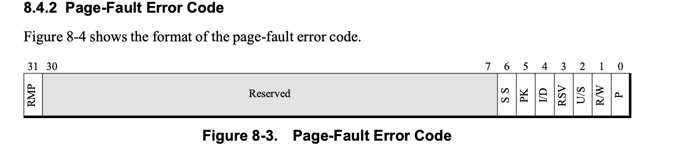

## 编写脚本
```sh
qemu-system-x86_64  -m 1G -accel kvm -smp 4 -cpu host -name wang,debug-threads=on -monitor stdio \
        -serial tcp:localhost:4444,server,nowait
```

执行该脚本后，在monitor shell中执行`info registers`
```
EAX=00000000 EBX=00000000 ECX=00000000 EDX=00a10f11
ESI=00000000 EDI=00000000 EBP=00000000 ESP=00000000
EIP=0000fff0 EFL=00000002 [-------] CPL=0 II=0 A20=1 SMM=0 HLT=0
ES =0000 00000000 0000ffff 00009300
CS =f000 ffff0000 0000ffff 00009b00
SS =0000 00000000 0000ffff 00009300
DS =0000 00000000 0000ffff 00009300
FS =0000 00000000 0000ffff 00009300
GS =0000 00000000 0000ffff 00009300
LDT=0000 00000000 0000ffff 00008200
TR =0000 00000000 0000ffff 00008b00
GDT=     00000000 0000ffff
IDT=     00000000 0000ffff
CR0=60000010 CR2=00000000 CR3=00000000 CR4=00000000
DR0=0000000000000000 DR1=0000000000000000 DR2=0000000000000000 DR3=0000000000000000
DR6=00000000ffff0ff0 DR7=0000000000000400
EFER=0000000000000000
FCW=037f FSW=0000 [ST=0] FTW=00 MXCSR=00001f80
FPR0=0000000000000000 0000 FPR1=0000000000000000 0000
FPR2=0000000000000000 0000 FPR3=0000000000000000 0000
FPR4=0000000000000000 0000 FPR5=0000000000000000 0000
FPR6=0000000000000000 0000 FPR7=0000000000000000 0000
XMM00=0000000000000000 0000000000000000 XMM01=0000000000000000 0000000000000000
XMM02=0000000000000000 0000000000000000 XMM03=0000000000000000 0000000000000000
XMM04=0000000000000000 0000000000000000 XMM05=0000000000000000 0000000000000000
XMM06=0000000000000000 0000000000000000 XMM07=0000000000000000 0000000000000000
```
从qemu看，vcpu 并未跑

使用crash查看该线程堆栈:
```cpp
crash> bt 250199
PID: 250199  TASK: ff2d94c614234080  CPU: 128  COMMAND: "CPU 0/KVM"
(active)
```

可以发现看不到堆栈。

执行runq命令:

```
CPU 128 RUNQUEUE: ff2d94c72f834b40
  CURRENT: PID: 250199  TASK: ff2d94c614234080  COMMAND: "CPU 0/KVM"
  RT PRIO_ARRAY: ff2d94c72f834d80
     [no tasks queued]
  CFS RB_ROOT: ff2d94c72f834bf0
     [no tasks queued]
```

通过strace调试发现进入了KVM_RUN接口
```
[pid 255971] ioctl(13, KVM_RUN <unfinished ...>
[pid 255973] ioctl(15, KVM_RUN <unfinished ...>
[pid 255973] ioctl(15, KVM_RUN <unfinished ...>
[pid 255972] ioctl(14, KVM_RUN <unfinished ...>
[pid 255972] ioctl(14, KVM_RUN <unfinished ...>
[pid 255971] ioctl(13, KVM_RUN <unfinished ...>
[pid 255974] ioctl(16, KVM_RUN, 0)      = -1 EINTR (Interrupted system call)
[pid 255974] ioctl(16, KVM_RUN <unfinished ...>
```

打开graph function tracer, 过滤`kvm_arch_vcpu_ioctl_run`

获取trace打印，一直在处理 svm exit.
```
   0)               |        handle_exit [kvm_amd]() {
   0)               |          npf_interception [kvm_amd]() {
   0)               |            kvm_mmu_page_fault [kvm]() {
   0)               |              kvm_tdp_page_fault [kvm]() {
   0)               |                kvm_mtrr_check_gfn_range_consistency [kvm]() {
   0)   0.060 us    |                  mtrr_lookup_start.constprop.0 [kvm]();
   0)   0.180 us    |                }
   0)               |                direct_page_fault [kvm]() {
   0)   0.060 us    |                  is_tdp_mmu_root [kvm]();
   0)   0.060 us    |                  fast_page_fault [kvm]();
   0)               |                  mmu_topup_memory_caches [kvm]() {
   0)   0.060 us    |                    kvm_mmu_topup_memory_cache [kvm]();
   0)   0.080 us    |                    kvm_mmu_topup_memory_cache [kvm]();
   0)   0.060 us    |                    kvm_mmu_topup_memory_cache [kvm]();
   0)   0.420 us    |                  }
   0)               |                  try_async_pf [kvm]() {
   0)   0.050 us    |                    kvm_vcpu_gfn_to_memslot [kvm]();
   0)               |                    __gfn_to_pfn_memslot [kvm]() {
   0)               |                      hva_to_pfn [kvm]() {
   0)               |                        hva_to_pfn_slow [kvm]() {
   0)               |                          get_user_pages_unlocked() {
   0)   0.060 us    |                            down_read();
   0)               |                            __get_user_pages() {
   0)               |                              find_extend_vma() {
   0)               |                                find_vma() {
   0)   0.060 us    |                                  vmacache_find();
   0)   0.170 us    |                                }
   0)   0.290 us    |                              }
   0)               |                              __cond_resched() {
   0)   0.060 us    |                                rcu_all_qs();
   0)   0.220 us    |                              }
   0)               |                              follow_page_mask() {
   0)   0.050 us    |                                follow_huge_addr();
   0)               |                                follow_p4d_mask() {
   0)               |                                  follow_pud_mask.isra.0() {
   0)   0.060 us    |                                    pud_huge();
   0)               |                                    follow_pmd_mask.isra.0() {
   0)   0.060 us    |                                      pmd_huge();
   0)               |                                      follow_page_pte() {
   0)   0.060 us    |                                        _raw_spin_lock();
   0)   0.060 us    |                                        vm_normal_page();
   0)   0.060 us    |                                        try_grab_page();
   0)   0.060 us    |                                        mark_page_accessed();
   0)   0.520 us    |                                      }
   0)   0.750 us    |                                    }
   0)   0.980 us    |                                  }
   0)   1.080 us    |                                }
   0)   1.310 us    |                              }
   0)   2.080 us    |                            }
   0)   0.070 us    |                            up_read();
   0)   2.430 us    |                          }
   0)   2.550 us    |                        }
   0)   2.670 us    |                      }
   0)   2.780 us    |                    }
   0)   3.010 us    |                  }
   0)   0.060 us    |                  handle_abnormal_pfn [kvm]();
   0)   0.060 us    |                  _raw_spin_lock();
   0)   0.060 us    |                  is_tdp_mmu_root [kvm]();
   0)               |                  __direct_map [kvm]() {
   0)               |                    kvm_mmu_hugepage_adjust [kvm]() {
   0)   0.060 us    |                      kvm_is_reserved_pfn [kvm]();
   0)   0.060 us    |                      kvm_vcpu_gfn_to_memslot [kvm]();
   0)   0.280 us    |                    }
   0)   0.060 us    |                    shadow_walk_init_using_root [kvm]();
   0)   0.060 us    |                    drop_large_spte.isra.0 [kvm]();
   0)   0.060 us    |                    drop_large_spte.isra.0 [kvm]();
   0)   0.070 us    |                    drop_large_spte.isra.0 [kvm]();
   0)               |                    mmu_set_spte [kvm]() {
   0)               |                      set_spte [kvm]() {
   0)               |                        make_spte [kvm]() {
   0)   0.050 us    |                          kvm_is_mmio_pfn [kvm]();
   0)   0.060 us    |                          svm_get_mt_mask [kvm_amd]();
   0)   0.060 us    |                          kvm_is_mmio_pfn [kvm]();
   0)   0.400 us    |                        }
   0)   0.520 us    |                      }
   0)   0.640 us    |                    }
   0)   1.590 us    |                  }
   0)               |                  kvm_release_pfn_clean [kvm]() {
   0)   0.060 us    |                    kvm_is_reserved_pfn [kvm]();
   0)   0.060 us    |                    kvm_release_pfn_clean.part.0 [kvm]();
   0)   0.290 us    |                  }
   0)   6.210 us    |                }
   0)   6.570 us    |              }
   0)   6.680 us    |            }
   0)   6.780 us    |          }
   0)   6.900 us    |        }
   0)   9.640 us    |      }
```

编写bpf脚本, 获取`__direct_map`参数.
```
pid(221843) comm(CPU 0/KVM) vcpu(ff2d95ea37920000) gpa(fffff000) error_code(20)
pid(221843) comm(CPU 0/KVM) vcpu(ff2d95ea37920000) gpa(fffff000) error_code(20)
pid(221843) comm(CPU 0/KVM) vcpu(ff2d95ea37920000) gpa(fffff000) error_code(20)
```
获取errorcode的最初代码在:
```cpp
static int npf_interception(struct vcpu_svm *svm)
{
    u64 fault_address = __sme_clr(svm->vmcb->control.exit_info_2);
    u64 error_code = svm->vmcb->control.exit_info_1;

    trace_kvm_page_fault(fault_address, error_code);
    return kvm_mmu_page_fault(&svm->vcpu, fault_address, error_code,
            static_cpu_has(X86_FEATURE_DECODEASSISTS) ?
            svm->vmcb->control.insn_bytes : NULL,
            svm->vmcb->control.insn_len);
}
```
查看amd 手册:

> 15.12.15 #PF (Page Fault)
> 
> This intercept is tested before CR2 is written by the exception. The error
> code saved in EXITINFO1 is the same as would be pushed onto the stack by a
> non-intercepted #PF exception in protected mode.



|bit|abbreviation|value|action|
|---|---|---|----|
|0|p|0|caused by a not-present page|
|1|R/W|0|the access that caused the page fault is a memory read|
|2|U/S|1|access in user mode (CPL=3) caused the page fault. |
|3|RSV|0||
|4|I/D|1|it indicates that the access that caused the page fault was an instruction fetch|

抓取`kvmmmu:kvm_mmu_set_spte` 获取
```
trace-cmd record -e kvmmmu:kvm_mmu_spte_requested  -e kvmmmu:kvm_mmu_set_spte
trace-cmd report
```
打印:
```
[root@11-241-212-141 10:01:16 wangfuqiang49]# trace-cmd report |grep -C 2 kvm_mmu_set_spte
cpus=256
       CPU 0/KVM-995362 [016] 55709.716253: kvm_mmu_spte_requested: gfn fffff pfn 8be2171 level 1
       CPU 0/KVM-995362 [016] 55709.716256: kvm_mmu_set_spte:     gfn fffff spte 8be2171025 (r-xu) level 1 at 8a53b01ff8
       CPU 0/KVM-995362 [016] 55709.716259: kvm_mmu_spte_requested: gfn fffff pfn 8be2171 level 1
       CPU 0/KVM-995362 [016] 55709.716260: kvm_mmu_spte_requested: gfn fffff pfn 8be2171 level 1
--
       CPU 0/KVM-995362 [016] 55710.720210: kvm_mmu_spte_requested: gfn fffff pfn 8be2171 level 1
       CPU 0/KVM-995362 [016] 55710.720421: kvm_mmu_spte_requested: gfn fffff pfn 8be2171 level 1
       CPU 0/KVM-995362 [016] 55710.720422: kvm_mmu_set_spte:     gfn fffff spte 8be2171025 (r-xu) level 1 at 8a53b01ff8
       CPU 0/KVM-995362 [016] 55710.720423: kvm_mmu_spte_requested: gfn fffff pfn 8be2171 level 1
       CPU 0/KVM-995362 [016] 55710.720424: kvm_mmu_spte_requested: gfn fffff pfn 8be2171 level 1
--
       CPU 0/KVM-995362 [144] 55714.729269: kvm_mmu_spte_requested: gfn fffff pfn 8be2171 level 1
       CPU 0/KVM-995362 [144] 55714.729392: kvm_mmu_spte_requested: gfn fffff pfn 8be2171 level 1
       CPU 0/KVM-995362 [144] 55714.729392: kvm_mmu_set_spte:     gfn fffff spte 8be2171025 (r-xu) level 1 at 8a53b01ff8
       CPU 0/KVM-995362 [144] 55714.729393: kvm_mmu_spte_requested: gfn fffff pfn 8be2171 level 1
       CPU 0/KVM-995362 [144] 55714.729394: kvm_mmu_spte_requested: gfn fffff pfn 8be2171 level 1
```

查看该hpa
```
crash> struct kvm_vcpu.arch.mmu ff2d950873c54000
  arch.mmu = 0xff2d950873c54408,
crash> struct kvm_mmu.root_hpa 0xff2d950873c54408 -x
  root_hpa = 0x8aa3a9c000

crash> struct kvm_vcpu.kvm ff2d950873c54000
  kvm = 0xff54771434c62000

```
其会一直触发`kvm_mmu_spte_requested` tracepoint, 周期性触发`kvm_mmu_set_spte`

查看其他信息:
```
crash> struct kvm_mmu.shadow_root_level 0xff2d950873c54408
  shadow_root_level = 4 '\004'

struct kvm.arch.active_mmu_pages 0xff54771434c62000
    active_mmu_pages = {
      next = 0xff2d950963d03458,
      prev = 0xff2d950963d03e30
    },
crash> struct kvm_arch.active_mmu_pages ff54771434c62a50 -o
struct kvm_arch {
  [ff54771434c6aa70] struct list_head active_mmu_pages;
}
```

增加一些tracepoint
```
[root@11-241-212-141 10:25:22 wangfuqiang49]# trace-cmd report |grep -C 2 -E 'kvm_mmu_get_page|kvm_mmu_set_page'
CPU 255 is empty
cpus=256
       CPU 0/KVM-1018505 [025] 57120.030891: kvm_mmu_get_page:     new sp gfn 0 4 q0 direct wux pae !nxe !wp root 0 sync
       CPU 0/KVM-1018505 [025] 57120.030899: kvm_mmu_spte_requested: gfn fffff pfn 8aa17d0 level 1
       CPU 0/KVM-1018505 [025] 57120.030900: kvm_mmu_get_page:     new sp gfn 0 3 q0 direct wux pae !nxe !wp root 0 sync
       CPU 0/KVM-1018505 [025] 57120.030900: kvm_mmu_get_page:     new sp gfn c0000 2 q0 direct wux pae !nxe !wp root 0 sync
       CPU 0/KVM-1018505 [025] 57120.030900: kvm_mmu_get_page:     new sp gfn ffe00 1 q0 direct wux pae !nxe !wp root 0 sync
       CPU 0/KVM-1018505 [025] 57120.030901: kvm_mmu_set_spte:     gfn fffff spte 8aa17d0025 (r-xu) level 1 at 8daea94ff8
       CPU 0/KVM-1018505 [025] 57120.030903: kvm_mmu_spte_requested: gfn fffff pfn 8aa17d0 level 1
```


## 获取 所有的mmu pages
```
crash> list kvm_mmu_page.link -H 0xff54771434c6aa70 -s kvm_mmu_page.role -s kvm_mmu_page.gfn -x
ff2d950963d03458
  role = {
    word = 0x791,
    {
      level = 0x1,
      gpte_is_8_bytes = 0x1,
      quadrant = 0x0,
      direct = 0x1,
      access = 0x7,
      invalid = 0x0,
      nxe = 0x0,
      cr0_wp = 0x0,
      smep_andnot_wp = 0x0,
      smap_andnot_wp = 0x0,
      ad_disabled = 0x0,
      guest_mode = 0x0,
      smm = 0x0
    }
  }
  gfn = 0xffe00
ff2d950963d02540
  role = {
    word = 0x792,
    {
      level = 0x2,
      gpte_is_8_bytes = 0x1,
      quadrant = 0x0,
      direct = 0x1,
      access = 0x7,
      invalid = 0x0,
      nxe = 0x0,
      cr0_wp = 0x0,
      smep_andnot_wp = 0x0,
      smap_andnot_wp = 0x0,
      ad_disabled = 0x0,
      guest_mode = 0x0,
      smm = 0x0
    }
  }
  gfn = 0xc0000
ff2d950963d021f8
  role = {
    word = 0x793,
    {
      level = 0x3,
      gpte_is_8_bytes = 0x1,
      quadrant = 0x0,
      direct = 0x1,
      access = 0x7,
      invalid = 0x0,
      nxe = 0x0,
      cr0_wp = 0x0,
      smep_andnot_wp = 0x0,
      smap_andnot_wp = 0x0,
      ad_disabled = 0x0,
      guest_mode = 0x0,
      smm = 0x0
    }
  }
  gfn = 0x0
ff2d950963d03e30
  role = {
    word = 0x794,
    {
      level = 0x4,
      gpte_is_8_bytes = 0x1,
      quadrant = 0x0,
      direct = 0x1,
      access = 0x7,
      invalid = 0x0,
      nxe = 0x0,
      cr0_wp = 0x0,
      smep_andnot_wp = 0x0,
      smap_andnot_wp = 0x0,
      ad_disabled = 0x0,
      guest_mode = 0x0,
      smm = 0x0
    }
  }
  gfn = 0x0
```
精简信息:
```
crash> list kvm_mmu_page.link -H 0xff54771434c6aa70 -s kvm_mmu_page.role.level -s kvm_mmu_page.gfn,spt -x
ff2d950963d03458
  role.level = 0x1,
  gfn = 0xffe00
  spt = 0xff2d950aa3afa000
ff2d950963d02540
  role.level = 0x2,
  gfn = 0xc0000
  spt = 0xff2d950aa3af9000
ff2d950963d021f8
  role.level = 0x3,
  gfn = 0x0
  spt = 0xff2d950aa3a9d000
ff2d950963d03e30
  role.level = 0x4,
  gfn = 0x0
  spt = 0xff2d950aa3a9c000
```

查看`ptov level 1`
```
crash> vtop 0xff2d950aa3a9c000
VIRTUAL           PHYSICAL
ff2d950aa3a9c000  8aa3a9c000

PGD DIRECTORY: ffffffff84c0a000
PAGE DIRECTORY: 67e3001067
   P4D: 67e3001950 => 2436d3fc067
   PUD: 2436d3fc150 => 8780581063
   PMD: 87805818e8 => 8000008aa3a001e3
  PAGE: 8aa3a00000  (2MB)

      PTE          PHYSICAL   FLAGS
8000008aa3a001e3  8aa3a00000  (PRESENT|RW|ACCESSED|DIRTY|PSE|GLOBAL|NX)

      PAGE          PHYSICAL      MAPPING       INDEX CNT FLAGS
ff8a4632aa8ea700  8aa3a9c000                0        0  1 57ffffc0000000
```
其`8aa3a9c000`可以和之前`root_hpa`对上, 我们来看下各个entry

将`0xfffff000`分开

|level|bits|index|page addr|addr|val|
|----|----|----|----|----|----|
|4|47-39|0|0xff2d950aa3a9c000|0xff2d950aa3a9c000|8aa3a9d027|
|3|38-30|3|0xff2d950aa3a9d000|0xff2d950aa3a9d018|8aa3af9027|
|2|29-21|0x1FF|0xff2d950aa3af9000|0xff2d950aa3af9ff8|8aa3afa027|
|1|20-12|0x1FF|0xff2d950aa3afa000|0xff2d950aa3afaff8|8aa111e025|

查看最后的page
```
crash> kmem 0x8aa111e000
      PAGE          PHYSICAL      MAPPING       INDEX CNT FLAGS
ff8a4632aa844780  8aa111e000 ff2d94bdd6e5e209 7f7a79c3f  1 5027d180080036 referenced,uptodate,lru,active,swapbacked
```
尝试通过该page找到其owner(通过rmap):
```
crash> struct anon_vma.rb_root ff2d94bdd6e5e208 -o
struct anon_vma {
  [ff2d94bdd6e5e248] struct rb_root_cached rb_root;
}
crash> tree -t rbtree -o anon_vma_chain.rb ff2d94bdd6e5e248 -s anon_vma_chain
ff2d9506e1367dc0 ---> 只有一个
struct anon_vma_chain {
  vma = 0xff2d950af39b4740,
  anon_vma = 0xff2d94bdd6e5e208, --->说明对上了
  same_vma = {
    next = 0xff2d950af39b47b8,
    prev = 0xff2d950af39b47b8
  },
  rb = {
    __rb_parent_color = 1,
    rb_right = 0x0,
    rb_left = 0x0
  },
  rb_subtree_last = 34219727935
}

crash> struct vm_area_struct.vm_start,vm_end,vm_mm 0xff2d950af39b4740 -x
  vm_start = 0x7f7a79c00000
  vm_end = 0x7f7a79c40000
  vm_mm = 0xff2d950bdeab17c0
crash> struct mm_struct.owner 0xff2d950bdeab17c0
    owner = 0xff2d950694ee4080
crash> struct task_struct.comm,pid 0xff2d950694ee4080
  comm = "qemu-system-x86"
  pid = 1040705

[root@11-241-212-141 13:40:21 ~]# cat /proc/1040705/smaps  |grep 7f7a79c0000
7f7a79c00000-7f7a79c40000 rw-p 00000000 00:00 0    ---> 256K 疑似bios
```
***

所以，该page 映射到了匿名页。并且整个的页表看不出什么问题。映射的页也没有问题，
那为什么会造成page fault，并且errorcode中显示是not present?


## 猜测
之前我们观察到, `vcpu->arch.mmu.shadow_root_level = 4`, 说明使用的是4-level
page, 但是从host看，其使用的是5-level page。

而如果使用5-level page, 则第二级 index 就是0（而非3), 这样就会找到全0的PTE，从而
触发上面提到的 non-present #NPF

通过`lscpu`也可以看到, 其启用了La57
```sh
[root@11-241-212-141 13:45:00 ~]# lscpu
Architecture:            x86_64
  CPU op-mode(s):        32-bit, 64-bit
  Address sizes:         52 bits physical, 57 bits virtual
```

La57 是由 CR4[LA57]控制(`amd sdm 5.3.2 CR3`), 但是nested page table level是由谁控制的呢?

在手册中没有找到，但是根据patch<sup>1</sup> :


中提到:
```
AMD future CPUs will require a 5-level NPT if host CR4.LA57 is set.
```

所以个人猜测:
* GVA->GPA: guest page table level 由 gCR4[LA57] 决定
* GPA->HPA: nested page table level 由 hCR4[LA57] 决定

为了进一步确认，编写内核模块，获取CR4的值, 主要代码如下(其实通过lscpu也能看出来):
```cpp
    asm volatile ("mov %%cr4, %0" : "=r" (cr4));
    printk(KERN_INFO "Current CR4 value: 0x%lx\n", cr4);
```

输出:
```
[77150.781947] Current CR4 value: 0x771ee0
```
amd spec中展示LA57 feature enable bit 为 bit-12, 所以该系统使能了LA57.

我们简单修改内核代码:

```diff
--- a/arch/x86/kvm/svm/svm.c
+++ b/arch/x86/kvm/svm/svm.c
@@ -257,7 +257,8 @@ static inline void invlpga(unsigned long addr, u32 asid)
 static int get_max_npt_level(void)
 {
 #ifdef CONFIG_X86_64
-       return PT64_ROOT_4LEVEL;
+       //return PT64_ROOT_4LEVEL;
+       return 5;
 #else
        return PT32E_ROOT_LEVEL;
 #endif
```

将max_level强制设置为5，启动虚拟机，发现可以正常进入bios。

## 结论
所以，该问题是由于kvm 对amd la57 支持不好导致，通过引入patch<sup>1</sup>, 可以解
决该问题。

## 参考链接
1. amd spec
2. [KVM: x86: Allow CPU to force vendor-specific TDP level](https://lore.kernel.org/all/20210818165549.3771014-2-wei.huang2@amd.com/)
