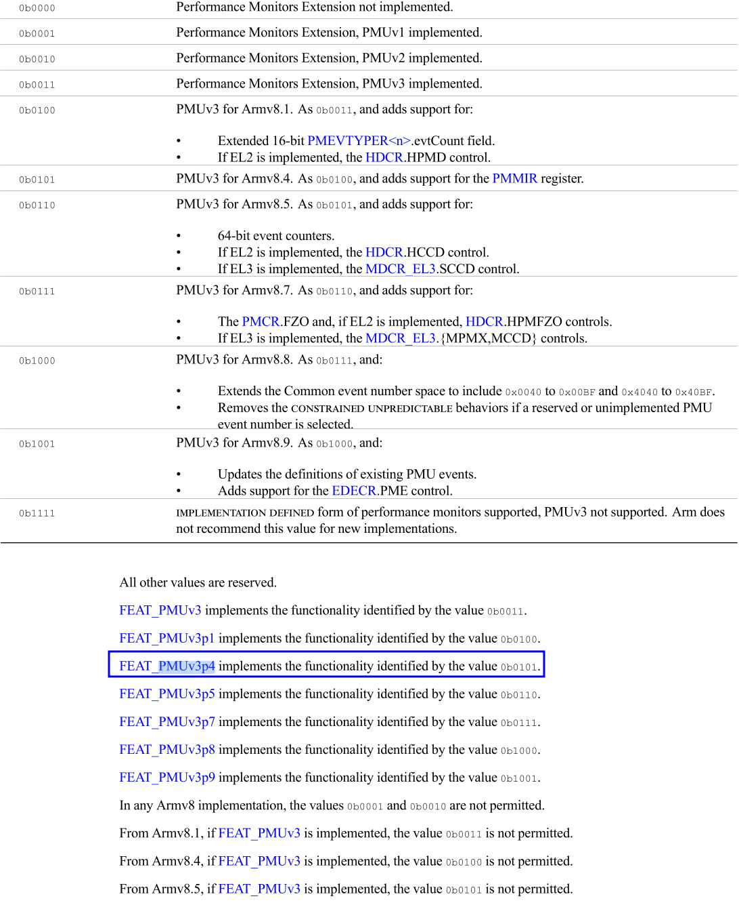
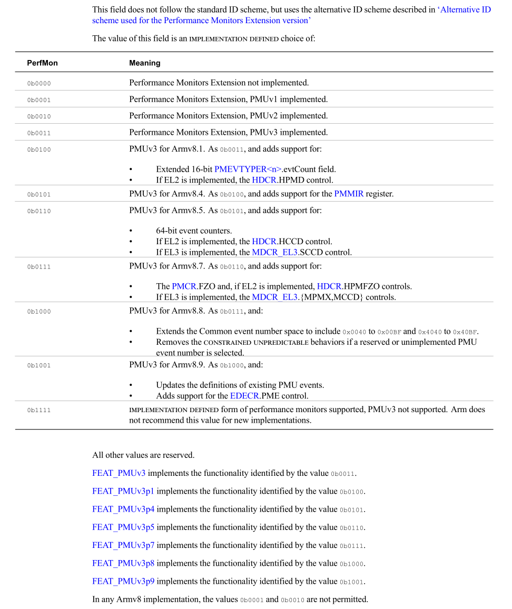

## 环境描述

* **CPU**: `kunpeng 920 7260z`
* **host kernel**: 4.19.90-89.11.v2401.ky10.aarch64
* **guest OS**: 
  + openeuler 2203+ (目前仅测试了openeuler 2203, openeuler 2509)

## 问题描述
启动虚拟机后 , 系统卡住，通过串口查看dmesg，发现出现内核panic:
```
Loading Linux 6.6.0-102.0.0.8.oe2509.aarch64 ...
^MLoading initial ramdisk ...
^M[    0.568058][    T1] Internal error: Oops - Undefined instruction: 0000000002000000 [#1] SMP
[    0.568613][    T1] Modules linked in:
[    0.568859][    T1] CPU: 0 PID: 1 Comm: swapper/0 Not tainted 6.6.0-102.0.0.8.oe2509.aarch64 #1
[    0.569704][    T1] Hardware name: JD JCloud Iaas Jvirt, BIOS 0.0.0 02/06/2015
[    0.570171][    T1] pstate: 214000c5 (nzCv daIF +PAN -UAO -TCO +DIT -SSBS BTYPE=--)
[    0.570666][    T1] pc : __armv8pmu_probe_pmu+0xdc/0x110
[    0.571009][    T1] lr : __armv8pmu_probe_pmu+0xd4/0x110
[    0.571351][    T1] sp : ffff80008000baf0
[    0.571610][    T1] x29: ffff80008000bb00 x28: ffff800081e7fa80 x27: ffff800081e85000
[    0.572113][    T1] x26: ffff800081e85390 x25: ffff800081aa4120 x24: ffff0000c18f0000
[    0.572616][    T1] x23: 0000000000000000 x22: 000000000000004f x21: 0000000000000007
[    0.573119][    T1] x20: ffff0000c18f0000 x19: 0000000000000006 x18: ffffffffffffffff
[    0.573625][    T1] x17: 000000005ae8c03d x16: 00000000b85d0e5b x15: ffffffffffffffff
[    0.574128][    T1] x14: ffff0000c18f0458 x13: 0000000000000108 x12: ffff800080b8ef00
[    0.574632][    T1] x11: ffff800080b8e9d8 x10: ffff800080b8f228 x9 : ffff80008000baf4
[    0.575135][    T1] x8 : 000000000000004f x7 : 0000000000000000 x6 : 000000070000004f
[    0.575639][    T1] x5 : 0000000000000002 x4 : 0000000000000003 x3 : 0000000000000002
[    0.576143][    T1] x2 : 0000000000000040 x1 : ffff80008000baf0 x0 : ffff0000c18f0418
[    0.576647][    T1] Call trace:
[    0.576851][    T1]  __armv8pmu_probe_pmu+0xdc/0x110
[    0.577186][    T1]  generic_exec_single+0xac/0x1d8
[    0.577506][    T1]  smp_call_function_single+0x144/0x1b8
[    0.577856][    T1]  smp_call_function_any+0x130/0x160
[    0.578188][    T1]  armv8_pmu_init+0x60/0x2c8
[    0.578477][    T1]  armv8_pmuv3_pmu_init+0x28/0x40
[    0.578790][    T1]  arm_pmu_acpi_probe+0x19c/0x2b0
[    0.579106][    T1]  armv8_pmu_driver_init+0x4c/0x70
[    0.579425][    T1]  do_one_initcall+0x4c/0x2d8
[    0.579717][    T1]  do_initcalls+0x104/0x1d8
[    0.580002][    T1]  kernel_init_freeable+0x170/0x328
[    0.580332][    T1]  kernel_init+0x2c/0x208
[    0.580605][    T1]  ret_from_fork+0x10/0x20
[    0.580885][    T1] Code: 290057f6 97ed4c0a f100127f 54000049 (d5389ed7) 
[    0.581321][    T1] ---[ end trace 0000000000000000 ]---
[    0.581663][    T1] Kernel panic - not syncing: Oops - Undefined instruction: Fatal exception
[    0.582214][    T1] Kernel Offset: disabled
[    0.582486][    T1] CPU features: 0x00,00000040,00000003,80080943,1003da03
[    0.582927][    T1] Memory Limit: none
[    0.583171][    T1] Rebooting in 3 seconds..
```

## 问题调研

panic 原因是`undefine inst`, 使用gdb 查看出问题的指令:
```
(gdb) p __armv8pmu_probe_pmu
$1 = {void (void *)} 0xffff800080b948e0 <__armv8pmu_probe_pmu>

## 0xe0+0xdc = 0x1bc

0xffff800080b949b8 <+216>:   b.ls    0xffff800080b949c0 <__armv8pmu_probe_pmu+224>  // b.plast
0xffff800080b949bc <+220>:   mrs     x23, s3_0_c9_c14_6  // <== here
0xffff800080b949c0 <+224>:   str     x23, [x20, #1152]
```

可以看到是访问`s3_0_c9_c14_6`，查看内核代码:

```cpp
#define SYS_PMMIR_EL1                   sys_reg(3, 0, 9, 14, 6)
```

可以发现触发问题的指令是在访问`pmmir` sys regsiter, 代码如下:

```sh
__armv8pmu_probe_pmu
=> if (is_pmuv3p4(pmuver))
      cpu_pmu->reg_pmmir = read_pmmir();  ## <== this
=> else
      cpu_pmu->reg_pmmir = 0;
```

在读取`PMMIR`寄存器时, 会触发undefine.

我们先来下`is_pmuv3p4(pmuver))`中的`pmuver`怎么获取的:

```sh
__armv8pmu_probe_pmu
=> pmuver = read_pmuver();
   ## 读取 id_aa64dfr0_el1 sysreg 值
   => u64 dfr0 = read_sysreg(id_aa64dfr0_el1);
   ## ID_AA64DFR0_EL1_PMUVer_SHIFT 值未找到定义，但是根据
   ## 手册来看, 其占用[35, 32], 那该宏为32
   => return cpuid_feature_extract_unsigned_field(dfr0,
        ID_AA64DFR0_EL1_PMUVer_SHIFT);
      ## dfr0: features
      ## ID_AA64DFR0_EL1_PMUVer_SHIFT: field
      => cpuid_feature_extract_unsigned_field_width(features, field, 4);
         ## width 4

         ## 这里实际的算法是获取 ID_AA64DFR0_EL1.PMUVer 字段
         => return (u64)(features << (64 - width - field)) >> (64 - width);
```

`pmuver`变量获取是通过读取`ID_AA64DFR0_EL1.PMUVer`字段得到。

我们再来看下`is_pmuv3v4()`宏的定义:

```cpp
static inline bool is_pmuv3p4(int pmuver)
{
        return pmuver >= ID_AA64DFR0_EL1_PMUVer_V3P4;
}
```

不知道这个宏怎么生成的，但是通过`arch/arm64/tools/sysreg`文件可以看到:

```
UnsignedEnum    11:8    PMUVer
        0b0000  NI
        0b0001  IMP
        0b0100  V3P1
        0b0101  V3P4
        0b0110  V3P5
        0b0111  V3P7
        0b1000  V3P8
        0b1111  IMP_DEF
```

手册中也有如下介绍:

<details>
<summary>ID_DFR0_EL1_PMUVer 展开</summary>



</details>

而`PMUV3P4`也控制`PMMIR` register define.

<details>
<summary> PMUV3P4 展开</summary>


> 除了`ID_AA64DFR0_EL1`, 还有其他寄存器都通过字段指示 PMUV3P4 功能是是
> 否存在
>
> （这里不太确定是不是子feature, 这些寄存器会不会呈现不同的vesion)

</details>

而在
```diff
commit 46081078feb451b5488c225c1e600ada24285c06
Author: Marc Zyngier <maz@kernel.org>
Date:   Sun Feb 16 18:17:22 2020 +0000

    KVM: arm64: Upgrade PMU support to ARMv8.4

    Upgrading the PMU code from ARMv8.1 to ARMv8.4 turns out to be
    pretty easy. All that is required is support for PMMIR_EL1, which
    is read-only, and for which returning 0 is a valid option as long
    as we don't advertise STALL_SLOT as an implemented event.

    Let's just do that and adjust what we return to the guest.

@@ -1496,6 +1496,7 @@ static const struct sys_reg_desc sys_reg_descs[] = {

        { SYS_DESC(SYS_PMINTENSET_EL1), access_pminten, reset_unknown, PMINTENSET_EL1 },
        { SYS_DESC(SYS_PMINTENCLR_EL1), access_pminten, reset_unknown, PMINTENSET_EL1 },
+       { SYS_DESC(SYS_PMMIR_EL1), trap_raz_wi },
```
patch 之前, kvm是不模拟的，如果此时guest判断当前PMU 大于 `V3P4`, 则就会访问`PMMIR`寄存器
触发异常。

但是经openeuler大佬研究之后，发现下面的patch可以解决这个问题，我们来分析下:

```diff
commit c854188ea01062f5a5fd7f05658feb1863774eaa
Author: Andrew Murray <amurray@thegoodpenguin.co.uk>
Date:   Mon Mar 2 18:17:51 2020 +0000

    KVM: arm64: limit PMU version to PMUv3 for ARMv8.1

    We currently expose the PMU version of the host to the guest via
    emulation of the DFR0_EL1 and AA64DFR0_EL1 debug feature registers.
    However many of the features offered beyond PMUv3 for 8.1 are not
    supported in KVM. Examples of this include support for the PMMIR
    registers (added in PMUv3 for ARMv8.4) and 64-bit event counters
    added in (PMUv3 for ARMv8.5).

    我们目前通过对 DFR0_EL1 和 AA64DFR0_EL1 调试特性寄存器的模拟，将主机的 PMU
    版本暴露给客户机。然而，KVM 并不支持 PMUv3 for 8.1 之后提供的许多功能。例如，
    PMUv3 for ARMv8.4 中新增的 PMMIR 寄存器支持，以及 PMUv3 for ARMv8.5 中新增的
    64 位事件计数器等。

    Let's trap the Debug Feature Registers in order to limit
    PMUVer/PerfMon in the Debug Feature Registers to PMUv3 for ARMv8.1
    to avoid unexpected behaviour.

    为了避免意外行为，让我们对调试特性寄存器进行陷阱处理，将调试特性寄存器中的
    PMUVer/PerfMon 限制在 PMUv3 for ARMv8.1 的范围内。

    Both ID_AA64DFR0.PMUVer and ID_DFR0.PerfMon follow the "Alternative ID
    scheme used for the Performance Monitors Extension version" where 0xF
    means an IMPLEMENTATION DEFINED PMU is implemented, and values 0x0-0xE
    are treated as with an unsigned field (with 0x0 meaning no PMU is
    present). As we don't expect to expose an IMPLEMENTATION DEFINED PMU,
    and our cap is below 0xF, we can treat these fields as unsigned when
    applying the cap.

    ID_AA64DFR0.PMUVer 和 ID_DFR0.PerfMon 都遵循“Alternative ID  scheme used for
    the Performance Monitors Extension version", 其中 0xF 表示实现定义
    （IMPLEMENTATION DEFINED）的 PMU 被实现，0x0-0xE 的值则作为无符号字段处理
    （0x0 表示没有 PMU）。由于我们不打算暴露实现定义的 PMU，并且我们的上限低于
    0xF，因此在应用上限时可以将这些字段视为无符号数。
```

大概的意思是, 目前KVM只支持到了 `ARMv8.1` 的 PMU feature, ARMv8.4 中新增的
`PMMIR`寄存器以及 ARMv8.5 64 event counter 均不支持。(kvm还没有实现)

所以这里将暴露给guest的`PMUVer`, `PerfMon` 均限制在 `<= PMUv3(ARMv8.1)`.

> NOTE
>
> 如果这字段值为 `0xF`, PMU 则为 `IMPLEMENTATION DEFINE`， 如果是这种情况，
> KVM 不打算报漏给虚拟机这个值。(这种类似于自定义的，KVM 没有办法（也不想）模拟)
>
> 个人瞎猜，还需要在看下手册 **TODO**

上面两个 patch 代码类似，我们以后一个patch为例, 代码为:
```diff
@@ -1085,6 +1085,16 @@ static u64 read_id_reg(const struct kvm_vcpu *vcpu,
                         (0xfUL << ID_AA64ISAR1_API_SHIFT) |
                         (0xfUL << ID_AA64ISAR1_GPA_SHIFT) |
                         (0xfUL << ID_AA64ISAR1_GPI_SHIFT));
+       } else if (id == SYS_ID_AA64DFR0_EL1) {
+               /* Limit guests to PMUv3 for ARMv8.1 */
+               val = cpuid_feature_cap_perfmon_field(val,
+                                               ID_AA64DFR0_PMUVER_SHIFT,
+                                               ID_AA64DFR0_PMUVER_8_1);
+       } else if (id == SYS_ID_DFR0_EL1) {
+               /* Limit guests to PMUv3 for ARMv8.1 */
+               val = cpuid_feature_cap_perfmon_field(val,
+                                               ID_DFR0_PERFMON_SHIFT,
+                                               ID_DFR0_PERFMON_8_1);
        }
```

大概是控制, `SYS_ID_AA64DFR0_EL1` 和`SYS_ID_DFR0_EL1` 两个寄存器的值，来控制
guest探测到`PMUV3P4`(如果没有该代码则返回host值).

我们还是先来看下`cpuid_feature_cap_perfmon_field()`代码:
```sh
cpuid_feature_cap_perfmon_field
## 上面介绍过该函数，这里在列出来, 相当于读取 features[field] 数据，长度
## 为4-bit
=> u64 val = cpuid_feature_extract_unsigned_field(features, field);
   => cpuid_feature_extract_unsigned_field_width(features, field, 4);
      => return (u64)(features << (64 - width - field)) >> (64 - width);

## 从将 [field + 3 , field] bit都设置为1, 其他都设置为0,形成一个该字段全1
## 的mask
=> u64 mask = GENMASK_ULL(field + 3, field);
=> if (val == ID_AA64DFR0_EL1_PMUVer_IMP_DEF)
   => val = 0
=> if (val > cap)
   => features &= ~mask;
   => features |= (cap << field) & mask
=> return featrues
```

大概的算法是 `val` 表示该字段的值，一般表示ver, ver 越大，表示版本越新，一般
新版本功能在旧版本功能基础上的扩展。

* 如果 `val == ID_AA64DFR0_EL1_PMUVer_IMP_DEF`, 则val 返回zero.(不暴露
    `IMPLEMENTATION DEFINE PMU`)

* 如果 `val > cap`, (相当于当前host版本 --`val` 高于KVM 目前实现的版本 
  -- `cap`, 则使用 KVM 目前实现的版本。

回到上面patch:
```cpp
#define ID_DFR0_PERFMON_8_1            0x4
#define ID_AA64DFR0_PMUVER_8_1         0x4

val = cpuid_feature_cap_perfmon_field(val, ID_AA64DFR0_PMUVER_SHIFT, ID_AA64DFR0_PMUVER_8_1);
val = cpuid_feature_cap_perfmon_field(val, ID_DFR0_PERFMON_SHIFT, ID_DFR0_PERFMON_8_1);
```

我们先看比较熟悉的 `ID_AA64DFR0`, 其`armv8.1`的值为`4`, 即`PMUV3P1`, 手册中有描述:
```
FEAT_PMUv3p1, Armv8.1 PMU extensions

In an Armv8.1 implementation, if FEAT_PMUv3 is implemented, FEAT_PMUv3p1 is implemented.
```

而`ID_DFR0.PERFMON`， 则表示另一个verison,我们这里先不详细展开:

<details>
<summary>ID_DFR0_PERFMON 展开</summary>



</details>

***

综合来看，该patch的作用就是将 guest 能观察到的一些 "version" 限制到了 `armv8.1`,
(而上面第一个commit 
```
46081078feb451b5488c225c1e600ada24285c06
KVM: arm64: Upgrade PMU support to ARMv8.4
```
则是KVM PMU 实现到了 `armv8.4`,  所以暴露给guest 8.4 的 Ver)

## 其他host 内核测试

查看openeuler 2203 kvm代码，发现已经合入该patch, 在host安装该内核启动虚拟机，
虚拟机可以正常启动

## 总结

### 问题原因

`kunpeng 920 7260z` 硬件支持`PMUV3P4`, KVM 将该feature 报告给了guest, guest 误认
为 自己所在的"硬件" 支持该feature, 便访问了`pmmir`, 但是KVM 只实现到了 `PMU
8.1(PMUv3P1)`. 所以需要报告给guest，当前模拟的硬件为`PMU 8.1`

### 影响范围
* CPU: 支持 PMUv3p4, 例如 `kunpeng 920 7260z`
* guest kernel:
  + 合入 commit 
    ```
    f5be3a61fdb5dd11ef60173e2783ccf62685f892

    arm64: perf: Add support caps under sysfs
    ```
  + 上游版本: `v5.10-rc1+`
* host kernel:
  + 未合入 commit
    ```
    c854188ea01062f5a5fd7f05658feb1863774eaa
    KVM: arm64: limit PMU version to PMUv3 for ARMv8.1
    ```
  + 上游版本: `v5.7-rc1`

> NOTE
>
> 必须上面三个条件都满足才会复现问题

### 解决方法


#### host kernel 修复
需要在原有内核合入下面patch:
```
c854188ea01062f5a5fd7f05658feb1863774eaa
KVM: arm64: limit PMU version to PMUv3 for ARMv8.1
```
openeuler commit:
* https://gitee.com/openeuler/kernel/commit/c854188ea

#### host libvirt 禁用

禁用方法, 在xml`domain.features`路径中，新增如下部分

```diff
  <features>
    <acpi/>
+   <pmu state='off'/>
    <gic version='3'/>
  </features>
```

验证方法:

使用修改后的xml启动虚拟机, qemu参数新增会新增 `pmu=off`

```sh
/usr/libexec/qemu-kvm \
-cpu host,pmu=off
          ^^^^^^^
```

<!--
## TODO
* 在客户环境host，查看 `kunpeng 920 7260z` 是否支持`PMUV3P4`
* `ID_AA64DFR0_EL1_PMUVer_xxx` 在内核中的定义
-->
