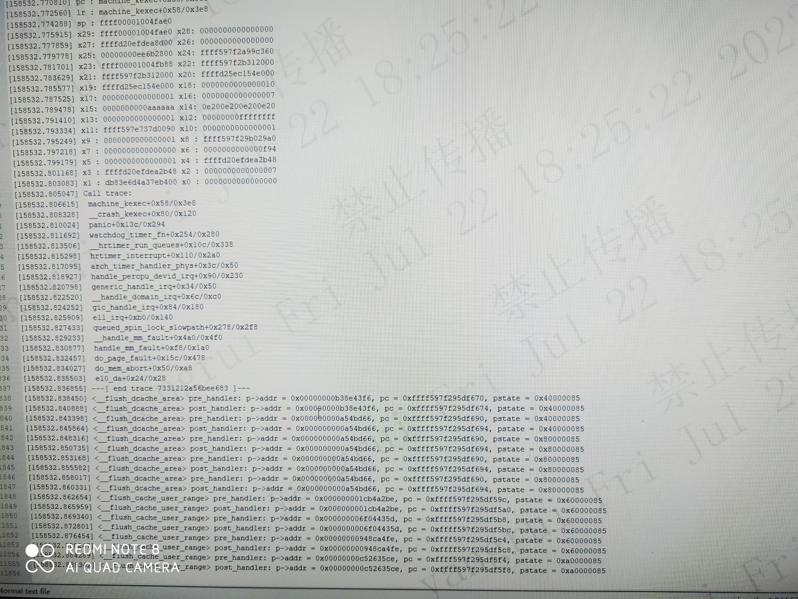

# 1. 客户环境上无法获取vmcore
在客户环境执行`echo 1 > /proc/sys/kernel/softlockup_panic`, 并因系统异常
导致softlockup时，会出现panic，但是无法产生vmcore, 现象如下:
```
[8489810.600917] watchdog: BUG: soft lockup - CPU#24 stuck for 23s! [containerd:2333]
[8489810.603409] Modules linked in: vhost_net vhost tap tun dm_service_time iscsi_tcp libiscsi_tcp libiscsi dm_round_robin dm_multipath scsi_transport_iscsi ebtable_filter ebtables ip6table_filter rbd libceph dns_resolver ip_set nf_nat_pptp nf_nat_proto_gre nf_conntrack_pptp nf_conntrack_proto_gre ip6_tables vxlan ip6_udp_tunnel udp_tunnel xt_statistic xt_nat xt_addrtype xt_recent ipt_REJECT nf_reject_ipv4 nf_conntrack_netlink nfnetlink ipt_MASQUERADE xt_mark iptable_nat br_netfilter bridge stp llc overlay openvswitch nf_nat_ipv6 nf_nat_ipv4 nf_conncount nf_nat iptable_mangle xt_conntrack xt_comment iptable_filter vfat fat crc32_ce crct10dif_ce ghash_ce sha2_ce sha256_arm64 sha1_ce ses enclosure sg ipmi_si escache drbd_transport_tcp(OE) drbd(OE) nf_conntrack_ipv6 nf_defrag_ipv6 nf_conntrack_ipv4 nf_defrag_ipv4
[8489810.622744]  nf_conntrack ip_tables xfs libcrc32c ast i2c_algo_bit ttm drm_kms_helper syscopyarea sysfillrect sysimgblt fb_sys_fops drm ixgbe smartpqi ngbe(OE) scsi_transport_sas mdio dm_mirror dm_region_hash dm_log dm_mod ipmi_watchdog ipmi_devintf ipmi_msghandler
[8489810.630732] CPU: 24 PID: 2333 Comm: containerd Kdump: loaded Tainted: G           OE    --------- -  - 4.18.0-147.5.1.el8_1.5es.20.numa64.aarch64 #1
[8489810.635816] Hardware name: Inspur     CS5260F     /YZMB-02006-101   , BIOS 4.0.10 02/16/22 14:27:08
[8489810.638686] pstate: 80000005 (Nzcv daif -PAN -UAO)
[8489810.641017] pc : queued_spin_lock_slowpath+0x278/0x2f8
[8489810.643398] lr : __handle_mm_fault+0x4a0/0x4f0
[8489810.645783] sp : ffff00004630fd20
[8489810.647917] x29: ffff00004630fd20 x28: 0000000000000002 
[8489810.650357] x27: ffffe4f2c1997860 x26: 0000000000000000 
[8489810.652727] x25: ffffe4f2ccd3e548 x24: ffff53f9a82d3000 
[8489810.655063] x23: ffffe4f2c19b7400 x22: 0000000000000055 
[8489810.657386] x21: ffff53f9a8a53708 x20: 0000000000180101 
[8489810.659725] x19: ffff7ff93cb1d128 x18: 0000ffffdcc92010 
[8489810.661987] x17: 0000000000180101 x16: 0000000000180101 
[8489810.664209] x15: 0000000000000003 x14: 0000000000002001 
[8489810.666371] x13: 0000000000000003 x12: 0000aaaae6771c40 
[8489810.668496] x11: 0000000000000003 x10: 0000000000640000 
[8489810.670606] x9 : 0000000000000000 x8 : 0000ffff8d570000 
[8489810.672718] x7 : ffffe2f2ffe8e980 x6 : ffff53f9a8a53938 
[8489810.674826] x5 : ffffe2f2ffe8e980 x4 : ffff53f9a8a53708 
[8489810.676938] x3 : ffff53f9a871e980 x2 : 0000000000000000 
[8489810.679018] x1 : 0000000000000000 x0 : ffffe2f2ffe8e988 
[8489810.681129] Call trace:
[8489810.682795]  queued_spin_lock_slowpath+0x278/0x2f8
[8489810.684795]  __handle_mm_fault+0x4a0/0x4f0
[8489810.686663]  handle_mm_fault+0xf8/0x1a0
[8489810.688406]  do_page_fault+0x15c/0x478
[8489810.690227]  do_mem_abort+0x50/0xa8
[8489810.691908]  el0_da+0x24/0x28
[8489810.693530] Kernel panic - not syncing: softlockup: hung tasks
[8489810.695571] CPU: 24 PID: 2333 Comm: containerd Kdump: loaded Tainted: G           OEL   --------- -  - 4.18.0-147.5.1.el8_1.5es.20.numa64.aarch64 #1
[8489810.699802] Hardware name: Inspur     CS5260F     /YZMB-02006-101   , BIOS 4.0.10 02/16/22 14:27:08
[8489810.702274] Call trace:
[8489810.703868]  dump_backtrace+0x0/0x188
[8489810.705570]  show_stack+0x24/0x30
[8489810.707244]  dump_stack+0x90/0xb4
[8489810.708897]  panic+0x12c/0x294
[8489810.710496]  watchdog_timer_fn+0x254/0x280
[8489810.712167]  __hrtimer_run_queues+0x10c/0x338
[8489810.713839]  hrtimer_interrupt+0x110/0x2a0
[8489810.715454]  arch_timer_handler_phys+0x3c/0x50
[8489810.717107]  handle_percpu_devid_irq+0x90/0x230
[8489810.718727]  generic_handle_irq+0x34/0x50
[8489810.720244]  __handle_domain_irq+0x6c/0xc0
[8489810.721773]  gic_handle_irq+0x84/0x180
[8489810.723173]  el1_irq+0xb0/0x140
[8489810.724512]  queued_spin_lock_slowpath+0x278/0x2f8
[8489810.726040]  __handle_mm_fault+0x4a0/0x4f0
[8489810.727425]  handle_mm_fault+0xf8/0x1a0
[8489810.728776]  do_page_fault+0x15c/0x478
[8489810.730061]  do_mem_abort+0x50/0xa8
[8489810.731259]  el0_da+0x24/0x28
[8489810.732562] SMP: stopping secondary CPUs
[8489811.776734] SMP: failed to stop secondary CPUs 0-23,25-127
[8489811.786399] Starting crashdump kernel...
[8489811.787778] ------------[ cut here ]------------
[8489811.789213] Some CPUs may be stale, kdump will be unreliable.
[8489811.790929] WARNING: CPU: 24 PID: 2333 at arch/arm64/kernel/machine_kexec.c:159 machine_kexec+0x58/0x3e8
[8489811.793099] Modules linked in: vhost_net vhost tap tun dm_service_time iscsi_tcp libiscsi_tcp libiscsi dm_round_robin dm_multipath scsi_transport_iscsi ebtable_filter ebtables ip6table_filter rbd libceph dns_resolver ip_set nf_nat_pptp nf_nat_proto_gre nf_conntrack_pptp nf_conntrack_proto_gre ip6_tables vxlan ip6_udp_tunnel udp_tunnel xt_statistic xt_nat xt_addrtype xt_recent ipt_REJECT nf_reject_ipv4 nf_conntrack_netlink nfnetlink ipt_MASQUERADE xt_mark iptable_nat br_netfilter bridge stp llc overlay openvswitch nf_nat_ipv6 nf_nat_ipv4 nf_conncount nf_nat iptable_mangle xt_conntrack xt_comment iptable_filter vfat fat crc32_ce crct10dif_ce ghash_ce sha2_ce sha256_arm64 sha1_ce ses enclosure sg ipmi_si escache drbd_transport_tcp(OE) drbd(OE) nf_conntrack_ipv6 nf_defrag_ipv6 nf_conntrack_ipv4 nf_defrag_ipv4
[8489811.808584]  nf_conntrack ip_tables xfs libcrc32c ast i2c_algo_bit ttm drm_kms_helper syscopyarea sysfillrect sysimgblt fb_sys_fops drm ixgbe smartpqi ngbe(OE) scsi_transport_sas mdio dm_mirror dm_region_hash dm_log dm_mod ipmi_watchdog ipmi_devintf ipmi_msghandler
[8489811.814914] CPU: 24 PID: 2333 Comm: containerd Kdump: loaded Tainted: G           OEL   --------- -  - 4.18.0-147.5.1.el8_1.5es.20.numa64.aarch64 #1
[8489811.818885] Hardware name: Inspur     CS5260F     /YZMB-02006-101   , BIOS 4.0.10 02/16/22 14:27:08
[8489811.821296] pstate: 40000085 (nZcv daIf -PAN -UAO)
[8489811.823184] pc : machine_kexec+0x58/0x3e8
[8489811.824977] lr : machine_kexec+0x58/0x3e8
[8489811.826760] sp : ffff00001030fae0
[8489811.828469] x29: ffff00001030fae0 x28: 0000000000000000 
[8489811.830391] x27: ffffe2f2ffe78d00 x26: 0000000000000000 
[8489811.832244] x25: 00000000ee6b2800 x24: ffff53f9a8a5c360 
[8489811.834125] x23: ffff00001030fb88 x22: ffff53f9a93d2000 
[8489811.836003] x21: ffff53f9a93d2000 x20: ffffe532c3025800 
[8489811.837860] x19: ffffe532c3025800 x18: 0000000000000010 
[8489811.839704] x17: 0000000000000001 x16: 0000000000000007 
[8489811.841566] x15: 0000000000aaaaaa x14: 0e200e200e200e20 
[8489811.843422] x13: 0000000000000001 x12: 00000000ffffffff 
[8489811.845232] x11: ffff53f97fe80090 x10: 0000000000000001 
[8489811.847061] x9 : 0000000000000001 x8 : ffff53f9a7bc29a0 
[8489811.848915] x7 : 0000000000000000 x6 : 0000000000001240 
[8489811.850765] x5 : 0000000000000001 x4 : ffffe2f2ffe72b48 
[8489811.852621] x3 : ffffe2f2ffe72b48 x2 : 0000000000000007 
[8489811.854485] x1 : 82cc1715a9faf400 x0 : 0000000000000000 
[8489811.856336] Call trace:
[8489811.857790]  machine_kexec+0x58/0x3e8
[8489811.859444]  __crash_kexec+0x80/0x120
[8489811.861126]  panic+0x13c/0x294
[8489811.862702]  watchdog_timer_fn+0x254/0x280
[8489811.864360]  __hrtimer_run_queues+0x10c/0x338
[8489811.866055]  hrtimer_interrupt+0x110/0x2a0
[8489811.867744]  arch_timer_handler_phys+0x3c/0x50
[8489811.869476]  handle_percpu_devid_irq+0x90/0x230
[8489811.871268]  generic_handle_irq+0x34/0x50
[8489811.872960]  __handle_domain_irq+0x6c/0xc0
[8489811.874657]  gic_handle_irq+0x84/0x180
[8489811.876279]  el1_irq+0xb0/0x140
[8489811.877830]  queued_spin_lock_slowpath+0x278/0x2f8
[8489811.879661]  __handle_mm_fault+0x4a0/0x4f0
[8489811.881331]  handle_mm_fault+0xf8/0x1a0
[8489811.882963]  do_page_fault+0x15c/0x478
[8489811.884500]  do_mem_abort+0x50/0xa8
[8489811.886001]  el0_da+0x24/0x28
[8489811.887391] ---[ end trace 4b2d55c226933569 ]---
```

可以看到在`8489810.600917` 时间戳处，kernel watchdog发现softlockup, 并在`8489810.693530`
触发panic， 在`8489811.789213`, 打印，`WARN("Some CPUs may be stale, kdump will be unreliable.")`，
该打印位于kernel 代码`arch/arm64/kernel/machine_kexec.c:machine_kexec()处，代码如下:

```cpp
void machine_kexec(struct kimage *kimage)
{
    phys_addr_t reboot_code_buffer_phys;
    void *reboot_code_buffer;
    bool in_kexec_crash = (kimage == kexec_crash_image);
    bool stuck_cpus = cpus_are_stuck_in_kernel();

    /*
    ¦* New cpus may have become stuck_in_kernel after we loaded the image.
    ¦*/
    BUG_ON(!in_kexec_crash && (stuck_cpus || (num_online_cpus() > 1)));
	//====================(1)============================
    WARN(in_kexec_crash && (stuck_cpus || smp_crash_stop_failed()),
        "Some CPUs may be stale, kdump will be unreliable.\n");

    reboot_code_buffer_phys = page_to_phys(kimage->control_code_page);
    reboot_code_buffer = phys_to_virt(reboot_code_buffer_phys);

    kexec_image_info(kimage);

    pr_debug("%s:%d: control_code_page:        %p\n", __func__, __LINE__,
        kimage->control_code_page);
    pr_debug("%s:%d: reboot_code_buffer_phys:  %pa\n", __func__, __LINE__,
        &reboot_code_buffer_phys);
    pr_debug("%s:%d: reboot_code_buffer:       %p\n", __func__, __LINE__,
        reboot_code_buffer);
    pr_debug("%s:%d: relocate_new_kernel:      %p\n", __func__, __LINE__,
        arm64_relocate_new_kernel);
    pr_debug("%s:%d: relocate_new_kernel_size: 0x%lx(%lu) bytes\n",
        __func__, __LINE__, arm64_relocate_new_kernel_size,
        arm64_relocate_new_kernel_size);

    /*
    ¦* Copy arm64_relocate_new_kernel to the reboot_code_buffer for use
    ¦* after the kernel is shut down.
    ¦*/
    memcpy(reboot_code_buffer, arm64_relocate_new_kernel,
        arm64_relocate_new_kernel_size);

    /* Flush the reboot_code_buffer in preparation for its execution. */
    __flush_dcache_area(reboot_code_buffer, arm64_relocate_new_kernel_size);
    flush_icache_range((uintptr_t)reboot_code_buffer,
        arm64_relocate_new_kernel_size);
	    kexec_list_flush(kimage);

    /* Flush the new image if already in place. */
    if ((kimage != kexec_crash_image) && (kimage->head & IND_DONE))
        kexec_segment_flush(kimage);
	//===================(2)============================
    pr_info("Bye!\n");

    local_daif_mask();

    /*
    ¦* cpu_soft_restart will shutdown the MMU, disable data caches, then
    ¦* transfer control to the reboot_code_buffer which contains a copy of
    ¦* the arm64_relocate_new_kernel routine.  arm64_relocate_new_kernel
    ¦* uses physical addressing to relocate the new image to its final
    ¦* position and transfers control to the image entry point when the
    ¦* relocation is complete.
    ¦* In kexec case, kimage->start points to purgatory assuming that
    ¦* kernel entry and dtb address are embedded in purgatory by
    ¦* userspace (kexec-tools).
    ¦* In kexec_file case, the kernel starts directly without purgatory.
    ¦*/

	//===================(3)============================
    cpu_soft_restart(kimage != kexec_crash_image,
        reboot_code_buffer_phys, kimage->head, kimage->start,
#ifdef CONFIG_KEXEC_FILE
                        kimage->arch.dtb_mem);
#else
                        0);
#endif

    BUG(); /* Should never get here. */
}
```
* 在 (1) 处打印`WARN("Some CPUs may be stale, kdump will be unreliable.")`
* 在 (2) 处打印`Bye!\n`
* 在 (3) 处触发`soft restart`，重启进入crashkernel

可见，在客户环境上，打印了(1) ,并未打印(2). 
可能阻塞在了中间的某些流程，例如flush i/d cache

# 2. 增加kprobe调试
在 `__flush_dcache_area`和 `flush_icache_area`中加入kprobe调试点，如下:

## 2.1 __flush_dcache_area
```
0xffff00001009f680 <__efistub___flush_dcache_area>:     mrs     x3, ctr_el0
0xffff00001009f684 <__pi___flush_dcache_area+4>:        nop
0xffff00001009f688 <__pi___flush_dcache_area+8>:        ubfx    x3, x3, #16, #4
0xffff00001009f68c <__pi___flush_dcache_area+12>:       mov     x2, #0x4                        // #4
0xffff00001009f690 <__pi___flush_dcache_area+16>:       lsl     x2, x2, x3
0xffff00001009f694 <__pi___flush_dcache_area+20>:       add     x1, x0, x1
0xffff00001009f698 <__pi___flush_dcache_area+24>:       sub     x3, x2, #0x1
0xffff00001009f69c <__pi___flush_dcache_area+28>:       bic     x0, x0, x3
0xffff00001009f6a0 <__pi___flush_dcache_area+32>:       dc      civac, x0
0xffff00001009f6a4 <__pi___flush_dcache_area+36>:       add     x0, x0, x2
0xffff00001009f6a8 <__pi___flush_dcache_area+40>:       cmp     x0, x1
0xffff00001009f6ac <__pi___flush_dcache_area+44>:       b.cc    0xffff00001009f6a0 <__pi___flush_dcache_area+32>
0xffff00001009f6b0 <__pi___flush_dcache_area+48>:       dsb     sy
0xffff00001009f6b4 <__pi___flush_dcache_area+52>:       ret
```
在 `__flush_dcache_area +0, + 32` 处加入kprobe调试

## 2.2 flush_icache_range
```
crash> dis flush_icache_range
0xffff00001009f5ac <__flush_cache_user_range>:  nop
0xffff00001009f5b0 <flush_icache_range+4>:      nop
0xffff00001009f5b4 <flush_icache_range+8>:      mrs     x3, ctr_el0
0xffff00001009f5b8 <flush_icache_range+12>:     nop
0xffff00001009f5bc <flush_icache_range+16>:     ubfx    x3, x3, #16, #4
0xffff00001009f5c0 <flush_icache_range+20>:     mov     x2, #0x4                        // #4
0xffff00001009f5c4 <flush_icache_range+24>:     lsl     x2, x2, x3
0xffff00001009f5c8 <flush_icache_range+28>:     sub     x3, x2, #0x1
0xffff00001009f5cc <flush_icache_range+32>:     bic     x4, x0, x3
0xffff00001009f5d0 <flush_icache_range+36>:     dc      cvau, x4
0xffff00001009f5d4 <flush_icache_range+40>:     add     x4, x4, x2
0xffff00001009f5d8 <flush_icache_range+44>:     cmp     x4, x1
0xffff00001009f5dc <flush_icache_range+48>:     b.cc    0xffff00001009f5d0 <flush_icache_range+36>
0xffff00001009f5e0 <flush_icache_range+52>:     dsb     ish
0xffff00001009f5e4 <flush_icache_range+56>:     nop
0xffff00001009f5e8 <flush_icache_range+60>:     nop
0xffff00001009f5ec <flush_icache_range+64>:     mrs     x3, ctr_el0
0xffff00001009f5f0 <flush_icache_range+68>:     nop
0xffff00001009f5f4 <flush_icache_range+72>:     and     x3, x3, #0xf
0xffff00001009f5f8 <flush_icache_range+76>:     mov     x2, #0x4                        // #4
0xffff00001009f5fc <flush_icache_range+80>:     lsl     x2, x2, x3
0xffff00001009f600 <flush_icache_range+84>:     sub     x3, x2, #0x1
0xffff00001009f604 <flush_icache_range+88>:     bic     x3, x0, x3
0xffff00001009f608 <flush_icache_range+92>:     ic      ivau, x3
0xffff00001009f60c <flush_icache_range+96>:     add     x3, x3, x2
0xffff00001009f610 <flush_icache_range+100>:    cmp     x3, x1
0xffff00001009f614 <flush_icache_range+104>:    b.cc    0xffff00001009f608 <flush_icache_range+92>
0xffff00001009f618 <flush_icache_range+108>:    dsb     ish
0xffff00001009f61c <flush_icache_range+112>:    isb
0xffff00001009f620 <flush_icache_range+116>:    mov     x0, #0x0                        // #0
0xffff00001009f624 <flush_icache_range+120>:    ret
0xffff00001009f628 <flush_icache_range+124>:    mov     x0, #0xfffffffffffffff2         // #-14
0xffff00001009f62c <flush_icache_range+128>:    b       0xffff00001009f624 <flush_icache_range+120>
```
由于`flush_icache_range+36, +92`处无法加入kprobe调试(`register_kprobe()`
会返回错误), 在该指令前后加入kprobe调试，如下:
```
flush_icache_range+0, +28, +40, +88, +96
```
在客户机器上加载kprobe module, 运行，获取调试信息。
（下面的测试均开启`/proc/sys/kernel/softlockup_panic`)

# 3. 获取kprobe 调试信息
## 3.1 在系统正常时，手动触发softlockup, 导致panic
如下图:

通过打印的`pc = %lx`可以看到上述的kprobe点全部打印，并且可以打印`Bye!`

## 3.2 系统异常softlockup时，导致panic
如下图:


可以看到看起来在阻塞在了`__flush_cache_user_range`（和`flush_icache_range`
symbol位于一个地址）
根据pc 进行分析:
```
0xffff597f295df59c   
flush_icache_range + 0
0xffff597f295df5b8
flush_icache_range + 28
0xffff597f295df5c4
flush_icache_range + 40
0xffff597f295df5f4
flush_icache_range + 88
```
可以看到没有 执行到+96 指令，可以看到
应该是`flush_icache_range + 92` 出了问题

# 4. 分析kprobe调试信息
从上面信息看起来是`ic`指令发生了阻塞,
但是这里有一点没有做好，就是没有去考虑`ic`指令出现异常的
情况，查看kernel代码
```
ENTRY(__flush_cache_user_range)
    uaccess_ttbr0_enable x2, x3, x4
alternative_if ARM64_HAS_CACHE_IDC
    dsb ishst
    b   7f
alternative_else_nop_endif
    dcache_line_size x2, x3
    sub x3, x2, #1
    bic x4, x0, x3
1:
user_alt 9f, "dc cvau, x4",  "dc civac, x4",  ARM64_WORKAROUND_CLEAN_CACHE
    add x4, x4, x2
    cmp x4, x1
    b.lo    1b
    dsb ish

7:
alternative_if ARM64_HAS_CACHE_DIC
    isb
    b   8f
alternative_else_nop_endif
    invalidate_icache_by_line x0, x1, x2, x3, 9f
8:  mov x0, #0
1:
    uaccess_ttbr0_disable x1, x2
    ret
9:
    mov x0, #-EFAULT
    b   1b
ENDPROC(flush_icache_range)
ENDPROC(__flush_cache_user_range)
```
其中宏`invalidate_icache_by_line`中会调用到`ic`指令,
其中9f地址作为最后一个参数传入，表示fixup exp 的跳出
地址。
如下:
```
    .macro invalidate_icache_by_line start, end, tmp1, tmp2, label
    icache_line_size \tmp1, \tmp2
    sub \tmp2, \tmp1, #1
    bic \tmp2, \start, \tmp2
9997:
USER(\label, ic ivau, \tmp2)            // invalidate I line PoU
    add \tmp2, \tmp2, \tmp1
    cmp \tmp2, \end
    b.lo    9997b
    dsb ish
    isb
    .endm
```

其中`USER`宏如下:
```
	.macro      _asm_extable, from, to
	.pushsection    __ex_table, "a"
	.align      3
	.long       (\from - .), (\to - .)
	.popsection
	.endm

#define USER(l, x...)               \
9999:   x;                  \
    _asm_extable    9999b, l
```
可以看到，该宏会往`__ex_table`中压入，from ,to 
的地址，供kernel异常处理使用。

假如`ic`指令发生异常，会导致跳转到
`flush_icache_range+128`处（见flush_icache_range的反汇编),
然后返回，如果当时抓了下这个地址，基本可以确切说明，`ic`指令
发生了异常，还是发生了阻塞。

但是，再返回`machine_kexec`的代码, 在调用`flush_icache_range`后，又
调用了`kexec_list_flush`,根据之前的调试

```cpp
static void kexec_list_flush(struct kimage *kimage)
{
    kimage_entry_t *entry;

    for (entry = &kimage->head; ; entry++) {
        unsigned int flag;
        void *addr;

        /* flush the list entries. */
        __flush_dcache_area(entry, sizeof(kimage_entry_t));

        flag = *entry & IND_FLAGS;
        if (flag == IND_DONE)
            break;

        addr = phys_to_virt(*entry & PAGE_MASK);

        switch (flag) {
        case IND_INDIRECTION:
            /* Set entry point just before the new list page. */
            entry = (kimage_entry_t *)addr - 1;
            break;
        case IND_SOURCE:
            /* flush the source pages. */
            __flush_dcache_area(addr, PAGE_SIZE);
            break;
        case IND_DESTINATION:
            break;
        default:
            BUG();
        }
    }
}
```
根据3.1 可知，在该函数中会掉用`__flush_dcache_area`, 如果调用到该函数
也会触发kprobe 的打印，所以，很大概率是卡在了`flush_icache_area`中的
ic 指令处。
