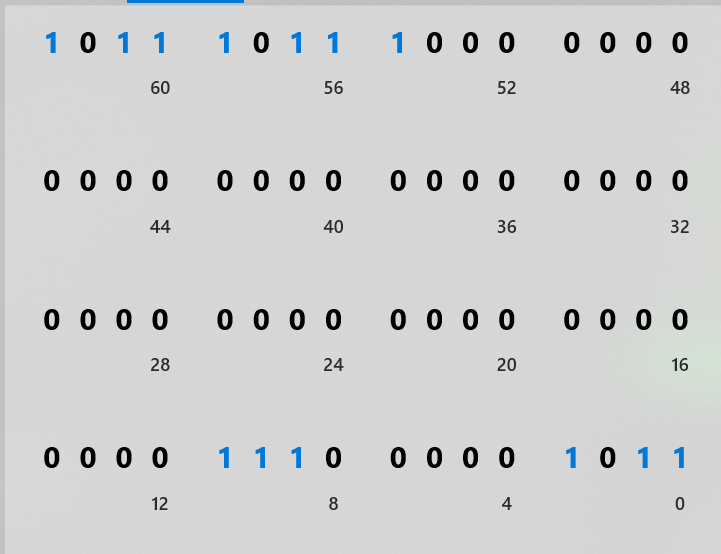
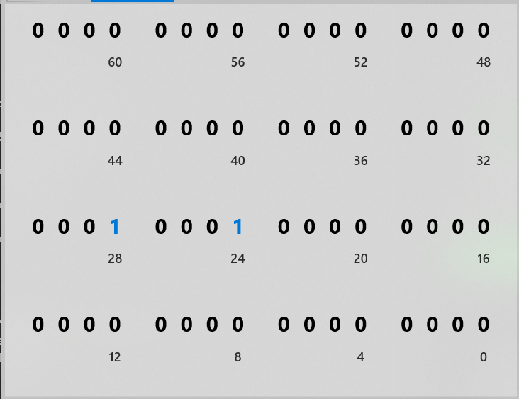
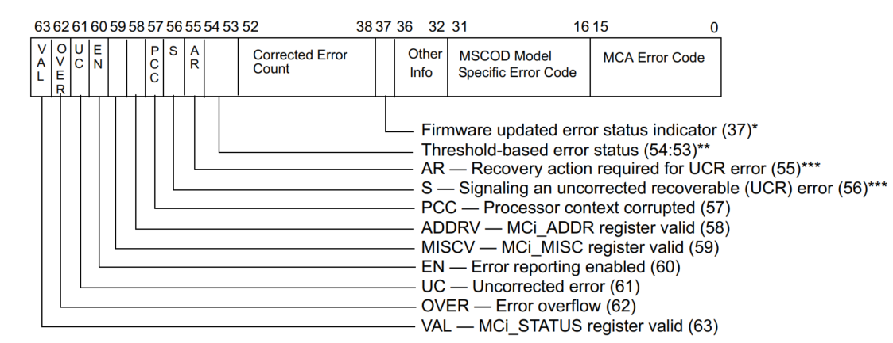
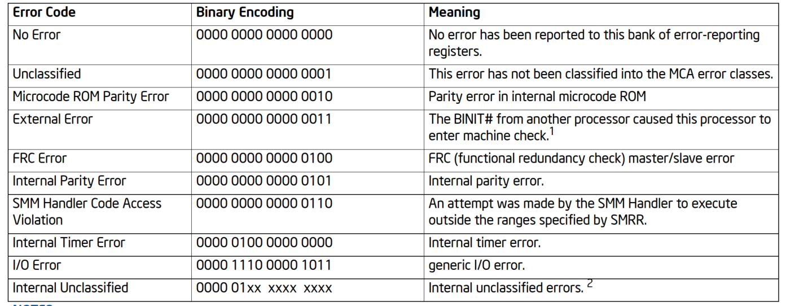
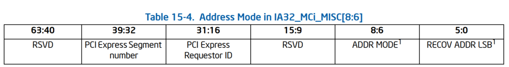

# 对message中的栈进行分析

首先查找打印`------------[ cut here  ]------------`
的代码
查找到为__warn函数
函数代码为:

<details>
<summary><code>__warn</code></summary>

```C/C++
void __warn(const char *file, int line, void *caller, unsigned taint,
        struct pt_regs *regs, struct warn_args *args)
{
    disable_trace_on_warning();

    pr_warn("------------[ cut here ]------------\n");
    
    if (file)               //1.message中打印了下面的行
        pr_warn("WARNING: CPU: %d PID: %d at %s:%d %pS\n",
            raw_smp_processor_id(), current->pid, file, line,
            caller);
    else
        pr_warn("WARNING: CPU: %d PID: %d at %pS\n",
            raw_smp_processor_id(), current->pid, caller);

    if (args)
        vprintk(args->fmt, args->args);

    if (panic_on_warn) {    //2.如果设置了panic_on_warn才会走到panic的流程
        /*
         * This thread may hit another WARN() in the panic path.
         * Resetting this prevents additional WARN() from panicking the
         * system on this thread.  Other threads are blocked by the
         * panic_mutex in panic().
         */
        panic_on_warn = 0;
        panic("panic_on_warn set ...\n");
    }

    print_modules();

    if (regs)
        show_regs(regs);
    else
        dump_stack();

    print_oops_end_marker();

    /* Just a warning, don't kill lockdep. */
    add_taint(taint, LOCKDEP_STILL_OK);
}
```
</details>
其中如果设置了panic_on_warn则会调用`panic("panic_on_warn set ...\n");`

查看panic函数
```C/C++
void panic(const char *fmt, ...)
{
...
    printk(KERN_EMERG "Kernel panic - not syncing: %s\n",buf);
...
}
```
在panic函数中有一条EMERG级别的日志是必打的, 但是在message文件中未找到该
打印，所以可以判断实际上没有设置panic_on_warn，系统重启是由于其他原因导致

# 对vmcore文件进行分析

下载对应的debuginfo-kernel和网盘中的vmcore文件，使用crash文件进行分析

并执行`bt -a`
打印如下:
<details>
<summary><code>堆栈打印</code></summary>

```
crash> bt -a
...
PID: 0      TASK: ffff880152d10fe0  CPU: 1   COMMAND: "swapper/1"
 #0 [ffff881fbfc45e48] crash_nmi_callback at ffffffff8104fd91
 #1 [ffff881fbfc45e58] nmi_handle at ffffffff816ad527
 #2 [ffff881fbfc45eb0] do_nmi at ffffffff816ad75d
 #3 [ffff881fbfc45ef0] end_repeat_nmi at ffffffff816ac9d3
    [exception RIP: delay_tsc+50]
    RIP: ffffffff813305e2  RSP: ffff881fbfc48e10  RFLAGS: 00000283
    RAX: 00000000000003dc  RBX: 00000000004bd44b  RCX: 000603316743b340
    RDX: 000603316743b71c  RSI: 0000000000000001  RDI: 00000000000007d1
    RBP: ffff881fbfc48e10   R8: 0000000000000005   R9: 0000000000000005
    R10: 0000000000000001  R11: 0000000000000001  R12: 0000000000000014
    R13: ffff881fbfc48f58  R14: 0000000000000007  R15: 0000000000000028
    ORIG_RAX: ffffffffffffffff  CS: 0010  SS: 0018
--- <NMI exception stack> ---
 #4 [ffff881fbfc48e10] delay_tsc at ffffffff813305e2
 #5 [ffff881fbfc48e18] __const_udelay at ffffffff81330547
 #6 [ffff881fbfc48e28] wait_for_panic at ffffffff8169c40c
 #7 [ffff881fbfc48e40] mce_timed_out at ffffffff81043b3e
 #8 [ffff881fbfc48e58] do_machine_check at ffffffff81045183
 #9 [ffff881fbfc48f50] machine_check at ffffffff816ac65f
    [exception RIP: native_safe_halt+6]
    RIP: ffffffff816ab596  RSP: ffff880152d1bea8  RFLAGS: 00000286
    RAX: 00000000ffffffed  RBX: ffffffff81b1c860  RCX: 0100000000000000
    RDX: 0000000000000000  RSI: 0000000000000000  RDI: 0000000000000046
    RBP: ffff880152d1bea8   R8: 0000000000000000   R9: 000000012d0cb94a
    R10: 0000000000000000  R11: 7fffffffffffffff  R12: 0000000000000001
    R13: ffff880152d18000  R14: ffff880152d18000  R15: ffff880152d18000
    ORIG_RAX: ffffffffffffffff  CS: 0010  SS: 0018
--- <MCE exception stack> ---
#10 [ffff880152d1bea8] native_safe_halt at ffffffff816ab596
#11 [ffff880152d1beb0] default_idle at ffffffff816ab42e
#12 [ffff880152d1bed0] arch_cpu_idle at ffffffff81035006
#13 [ffff880152d1bee0] cpu_startup_entry at ffffffff810e7bda
#14 [ffff880152d1bf28] start_secondary at ffffffff81051b56

...

PID: 0      TASK: ffff8840939c2fa0  CPU: 29  COMMAND: "swapper/29"
 #0 [ffff885fbfa48c68] machine_kexec at ffffffff8105c52b
 #1 [ffff885fbfa48cc8] __crash_kexec at ffffffff81104a42
 #2 [ffff885fbfa48d98] panic at ffffffff8169dd4f
 #3 [ffff885fbfa48e18] mce_panic at ffffffff81043aaa
 #4 [ffff885fbfa48e58] do_machine_check at ffffffff8104551f
 #5 [ffff885fbfa48f50] machine_check at ffffffff816ac65f
    [exception RIP: native_safe_halt+6]
    RIP: ffffffff816ab596  RSP: ffff8840939d7ea8  RFLAGS: 00000286
    RAX: 00000000ffffffed  RBX: ffffffff81b1c860  RCX: 0100000000000000
    RDX: 0000000000000000  RSI: 0000000000000000  RDI: 0000000000000046
    RBP: ffff8840939d7ea8   R8: 0000000000000000   R9: 000000012d0cb94a
    R10: 0000000000000000  R11: 7fffffffffffffff  R12: 000000000000001d
    R13: ffff8840939d4000  R14: ffff8840939d4000  R15: ffff8840939d4000
    ORIG_RAX: ffffffffffffffff  CS: 0010  SS: 0018
--- <MCE exception stack> ---
 #6 [ffff8840939d7ea8] native_safe_halt at ffffffff816ab596
 #7 [ffff8840939d7eb0] default_idle at ffffffff816ab42e
 #8 [ffff8840939d7ed0] arch_cpu_idle at ffffffff81035006
 #9 [ffff8840939d7ee0] cpu_startup_entry at ffffffff810e7bda
#10 [ffff8840939d7f28] start_secondary at ffffffff81051b56

```
</details>
基本上就上面两种栈

首先说下MCE
MCE全称Machine Check Exception，是CPU发现硬件错误时触发的异常,

## MCE相关注册
<details>
<summary><code>MCE exp 注册</code></summary>

中断号为18
对于x86来说该异常的注册流程为
```C/C++

//=========FILE:arch/x86/kernel/traps.c=================
void __init trap_init(void)
{
	...
#ifdef CONFIG_X86_MCE                                          
    set_intr_gate_ist(X86_TRAP_MC, &machine_check, MCE_STACK); 
#endif 
	...                                                        
}
```

而`X86_TRAP_MC`定义为
```C/C++
enum {
	...
	X86_TRAP_MC,        /* 18, Machine Check */`
	...
};
```
再看下`machine_check`的定义为
```C/C++
//==============FILE:arch/x86/kernel/entry_64.S =====
#ifdef CONFIG_X86_MCE                                       
paranoidzeroentry machine_check *machine_check_vector(%rip) 
#endif                                       

.macro paranoidzeroentry sym do_sym                          
ENTRY(\sym)                                                  
    INTR_FRAME                                               
    ASM_CLAC                                                 
    PARAVIRT_ADJUST_EXCEPTION_FRAME                          
    pushq_cfi $-1       /* ORIG_RAX: no syscall to restart */
    subq $ORIG_RAX-R15, %rsp                                 
    CFI_ADJUST_CFA_OFFSET ORIG_RAX-R15                       
    call save_paranoid                                       
    TRACE_IRQS_OFF                                           
    movq %rsp,%rdi      /* pt_regs pointer */                
    xorl %esi,%esi      /* no error code */                  
    call \do_sym                                             
    jmp paranoid_exit   /* %ebx: no swapgs flag */           
    CFI_ENDPROC                                              
END(\sym)                                                                   
```

而machine_check_vector得定义为
```C/C++
void (*machine_check_vector)(struct pt_regs *, long error_code) =
                        unexpected_machine_check;
```
赋值为:
```C/C++
//=====FILE:arch/x86/kernel/cpu/mcheck/mce.c====
void mcheck_cpu_init(struct cpuinfo_x86 *c)
{
	...
	machine_check_vector = do_machine_check;
	...
}
```
从这里来看，基本和第二个栈吻合。
</details>

## 初步预测

那么再说下前两个栈
先说下第二个栈
第二个栈实际上就是收到了CPU发出的MCE exception(CPU29)
然后进入MCE exception stack，处理不了MCE的错误后，
调用panic使系统重启

而第二个栈的CPU(CPU 1)也收到了MCE excetion, 但是由于CPU 29正在进行panic的
处理，所以在这里执行等待，在CPU 29 处理panic完重启前，会给其他
核发送nmi中断, 让其他核心打印堆栈

## panic栈分析
这里面比较重要的函数为`mce_panic`，函数原型为:<br />
`static void mce_panic(const char *msg, struct mce *final, char *exp)`
函数中参数的msg, exp都是有用信息
从`do_machine_check`函数信息<br />
`#4 [ffff885fbfa48e58] do_machine_check at ffffffff8104551f`
可知`do_machine_check`调用`mce_panic`函数实在代码地址ffffffff8104551f附近
执行`dis do_machine_check`

```
0xffffffff81045503 <do_machine_check+2499>:     jg     0xffffffff8104551f <do_machine_check+2527>
0xffffffff81045505 <do_machine_check+2501>:     mov    -0xe0(%rbp),%rdx             //第三个参数
0xffffffff8104550c <do_machine_check+2508>:     mov    -0xd0(%rbp),%rsi             //第二个参数
0xffffffff81045513 <do_machine_check+2515>:     mov    $0xffffffff818e86e4,%rdi     //第一个参数
0xffffffff8104551a <do_machine_check+2522>:     callq  0xffffffff810438b0 <mce_panic>
0xffffffff8104551f <do_machine_check+2527>:     mov    $0xffffffff,%esi  <== 相当于mce_panic返回地址
```

我们来查看下这三个参数的值
### 查看第一个参数值
```
crash> p (char *)0xffffffff818e86e4
$1 = 0xffffffff818e86e4 "Fatal machine check"
```

我们再来看下第三个参数执行`bt -f -c 29`，rbp寄存器实际上
会压在下一层栈的栈首，我们来看下`mce_panic`的栈内存
```
 #3 [ffff885fbfa48e18] mce_panic at ffffffff81043aaa
    ffff885fbfa48e20: ffffffff818e86e4 000000000000cf20
    ffff885fbfa48e30: 000000000000004f ffff885fbfa48f58
    ffff885fbfa48e40: 0000000000000000 0000000000000028
    ffff885fbfa48e50: ffff885fbfa48f48 <== 这个地方为rbp的值 ffffffff8104551f
```

### 看第二个参数

<!-- mce param BEG -->
<details>
<summary><code>mce param</code></summary>

```
crash> p 0xffff885fbfa48f48-0xd0	<==稍微解释下:这个地址为栈里面的地址,是个指针
$17 = 18446612543551344248
crash> p *(unsigned long long *)18446612543551344248 <==这个为指针指向的地址,为第二个参数
$18 = 18446612268675288864		
crash> mce 0xffff881fbfc0cf20	<==为18446612268675288864 16进制
struct mce {
  status = 13510798882111491595,
  misc = 285212672,
  addr = 0,
  mcgstatus = 5,
  ip = 18446744071585838486,
  tsc = 1692359594983532,
  time = 1616567954,
  cpuvendor = 0 '\000',
  inject_flags = 0 '\000',
  severity = 7 '\a',
  pad = 0 '\000',
  cpuid = 329300,
  cs = 16 '\020',
  bank = 6 '\006',
  cpu = 0 '\000',
  finished = 1 '\001',
  extcpu = 0,
  socketid = 0,
  apicid = 0,
  mcgcap = 251660308,
  synd = 0,
  ipid = 0
}
```
</details>
<!--mce param END-->

### 查看第三个参数
查看-0xe0(%rbp)内存的值, 因为该地址是一个指针，再去寻址得到字符串
```
crash> p 0xffff885fbfa48f48-0xe0
$9 = 18446612543551344232
crash> p *(unsigned long long *)18446612543551344232
$10 = 18446744071588185983
crash> p (char *)18446744071588185983
$11 = 0xffffffff818e877f "Processor context corrupt"
```
第三个参数的值为"Processor context corrupt"

## 结合代码分析
### 根据第一个参数得到函数调用栈

查看kernel代码，找到以该字符串("Fatal machine check")
作为第一个参数传入的代码流程:
流程为:
```
do_machine_check
    mce_end
        mce_reign
            mce_panic    
```

### 结合第二个参数查看mce_regin代码 

查看`mce_regin`代码

<!--mce_regin BEG -->
<details>
<summary><code>mce_regin</code></summary>

```C/C++
static void mce_reign(void)
{
    int cpu;
    struct mce *m = NULL;
    int global_worst = 0;
    char *msg = NULL;
    char *nmsg = NULL;

    /*
     * This CPU is the Monarch and the other CPUs have run
     * through their handlers.
     * Grade the severity of the errors of all the CPUs.
     */
    for_each_possible_cpu(cpu) {
        int severity = mce_severity(&per_cpu(mces_seen, cpu),
                        mca_cfg.tolerant,
                        &nmsg, true);
        if (severity > global_worst) {
            msg = nmsg;
            global_worst = severity;
            m = &per_cpu(mces_seen, cpu);
        }
    }

    /*
     * Cannot recover? Panic here then.
     * This dumps all the mces in the log buffer and stops the
     * other CPUs.
     */
    if (m && global_worst >= MCE_PANIC_SEVERITY && mca_cfg.tolerant < 3)
        mce_panic("Fatal machine check", m, msg);
	...
```
</details>
<!--mce_regin END-->

该函数实际上会返回调用`mce_severity`返回给`severity`变量，该变量可以理解为
最糟糕的处理方式，我们来看下`mce_severity`相关代码

<!--mce_severity BEG -->
<details>
<summary><code>mce_severity </code></summary>

```C/C++
int (*mce_severity)(struct mce *m, int tolerant, char **msg, bool is_excp) =      
            mce_severity_intel;
static int mce_severity_intel(struct mce *m, int tolerant, char **msg, bool is_excp)
{                                                                                   
    enum exception excp = (is_excp ? EXCP_CONTEXT : NO_EXCP);                       
    enum context ctx = error_context(m);                                            
    struct severity *s;                                                             
                                                                                    
    for (s = severities;; s++) {                                                    
        if ((m->status & s->mask) != s->result)                                     
            continue;                                                               
        if ((m->mcgstatus & s->mcgmask) != s->mcgres)                               
            continue;                                                               
        if (s->ser == SER_REQUIRED && !mca_cfg.ser)                                 
            continue;                                                               
        if (s->ser == NO_SER && mca_cfg.ser)                                        
            continue;                                                               
        if (s->context && ctx != s->context)                                        
            continue;                                                               
        if (s->excp && excp != s->excp)                                             
            continue;                                                               
        if (msg)                                                                    
            *msg = s->msg;                                                          
        s->covered = 1;                                                             
        if (s->sev >= MCE_UC_SEVERITY && ctx == IN_KERNEL) {                        
            if (tolerant < 1)                                                       
                return MCE_PANIC_SEVERITY;                                          
        }                                                                           
        return s->sev;                                                              
    }                                                                               
}                                                                                   
```
</details>
<!--mce_severity END-->

实际上该代码是遍历severities数组，并将参数m和数组成员中的
信息做比对，如果符合的话，则返回`s->sev`, 在我看来应该是
处理方式。

回到`mce_reign`函数，当检查到最糟糕的处理方式>=`MCE_PANIC_SEVERITY`
时，则调用mce_panic，认为该mce异常当前系统处理不了，需要触发panic
重启。

我们来看下severities数组

<!--severities BEG -->
<details>
<summary><code>severities</code></summary>

```C/C++
static struct severity {                                                        
    u64 mask;                                                                   
    u64 result;                                                                 
    unsigned char sev;                                                          
    unsigned char mcgmask;                                                      
    unsigned char mcgres;                                                       
    unsigned char ser;                                                          
    unsigned char context;                                                      
    unsigned char excp;                                                         
    unsigned char covered;                                                      
    char *msg;                                                                  
} severities[] = {                                                              
#define MCESEV(s, m, c...) { .sev = MCE_ ## s ## _SEVERITY, .msg = m, ## c }    
#define  KERNEL     .context = IN_KERNEL                                        
#define  USER       .context = IN_USER                                          
#define  KERNEL_RECOV   .context = IN_KERNEL_RECOV                              
#define  SER        .ser = SER_REQUIRED                                         
#define  NOSER      .ser = NO_SER                                               
#define  EXCP       .excp = EXCP_CONTEXT                                        
#define  NOEXCP     .excp = NO_EXCP                                             
#define  BITCLR(x)  .mask = x, .result = 0                                      
#define  BITSET(x)  .mask = x, .result = x                                      
#define  MCGMASK(x, y)  .mcgmask = x, .mcgres = y                               
#define  MASK(x, y) .mask = x, .result = y                                      
#define MCI_UC_S (MCI_STATUS_UC|MCI_STATUS_S)                                   
#define MCI_UC_AR (MCI_STATUS_UC|MCI_STATUS_AR)                                 
#define MCI_UC_SAR (MCI_STATUS_UC|MCI_STATUS_S|MCI_STATUS_AR)                   
#define MCI_ADDR (MCI_STATUS_ADDRV|MCI_STATUS_MISCV)                            
...
MCESEV(                                  
    PANIC, "Processor context corrupt",  	//和第二个参数一致
    BITSET(MCI_STATUS_PCC)               
    ),                                   
...
```
</details>
<!--severities END-->

这里数组中的成员并没有贴完，只是贴了和本case相关的.
可以看到.sev的值为 `MCE_ ## PANIC ## _SEVERITY ==> MCE_PANIC_SEVERITY`,
和上面的函数中的流程可以对上。

那么现在问题来了，`mce_regin`函数中调用`mce_severity`的第一个参数
`mces_seen`在什么地方获取的呢，这个变量明显是存储着和mce异常的相关
信息。

我们来看下mces_seen数据获取。

## 获取和machine check相关信息

相关代码在do_machine_check中

### do_machine_check

<!--do_machine_check BEG -->
<details>
<summary><code>do_machine_check</code></summary>

```C/C++
void do_machine_check(struct pt_regs *regs, long error_code)
{
    struct mce m, *final;
    char *msg = "Unknown"; 
    ...

	//获取一部分信息实际上是获取MSR_IA32_MCG_STATUS,该值为5
    mce_gather_info(&m, regs);               

    final = &__get_cpu_var(mces_seen);       //找到per CPU变量
    *final = m;                              //相当于memcpy

    memset(valid_banks, 0, sizeof(valid_banks));
    ...
	
	//中间许多的逻辑暂时不分析了
	//主要涉及两个MSR寄存器的读取
	//IA32_MCi_STATUS MSRS
	//IA32_MCi_MISC MSRs
	for () {
		...
		m.status = mce_rdmsrl(msr_ops.status(i));	//读取IA32_MCi_STATUS 
		...
		mce_read_aux(&m, i);						//里面读取了IA32_MCi_MISC 
		...
	}

	...
}	

static void mce_read_aux(struct mce *m, int i)                   
{	
	//这里INTEL 芯片手册中提到，只有当IA32_MCi_STATUS寄存器中的
	//MISCV生效，该寄存器会存一些额外的描述信息                           
    if (m->status & MCI_STATUS_MISCV)
		//读取IA32_MCi_MISC MSR寄存器信息
        m->misc = mce_rdmsrl(msr_ops.misc(i));                   
	...
}
```
</details>
<!--do_machine_check END-->

从上面的流程中，可知`mce->status`存储的为`IA32_MCi_STATUS`
而 mce->misc中存储的是`IA32_MCi_MISC`

从上面对vmcore的分析中可以得到这两个值分别为
```
IA32_MCi_STATUS = 13510798882111491595,
IA32_MCi_MISC = 285212672,
```

bit位分布表

<!--bit table BEG -->
<details>
<summary><code>bit table</code></summary>

* IA32_MCi_STATUS

<div style="text-align: center;">

<br />
</div>

* IA32_MCi_MISC

<div style="text-align: center;">

<br />
</div>
</details>
<!--bit table END-->

关于MSR寄存器的解释我们需要参照intel芯片手册

# 结合intel芯片手册对上述信息分析
NOTE: 这里不做过多展开

## IA32_MCi_STATUS

<div style="text-align: center;">

<br />
对于IA32_MCi_STATUS解释,来自手册15.3.2.2节
</div>
0~15位代表`MCA Error Code`
我们来看下对于此信息的解释
<div style="text-align: center;">

<br />
来自手册15.9.1节
</div>

结合`IA32_MCi_STATUe`值可以看出, 该错误为`I/O Error`
并且`MISCV — MCi_MISC register valid (59)`位为1，表示
可以通过`IA32_MCi_MISC`寄存器获取更多信息

## IA32_MCi_MISC
<div style="text-align: center;">

<br />
来自手册15.3.2.4.2节
</div>

可以看出`PCI ExpressRequestor ID`为`1 0001 0000 0000`

关于该字段的解析可以参照kernel文档<br/>
链接:https://www.kernel.org/doc/Documentation/devicetree/bindings/pci/pci-iommu.txt
```
Each PCI(e) device under a root complex is uniquely identified by its Requester
ID (AKA RID). A Requester ID is a triplet of a Bus number, Device number, and
Function number.

For the purpose of this document, when treated as a numeric value, a RID is
formatted such that:

* Bits [15:8] are the Bus number.
* Bits [7:3] are the Device number.
* Bits [2:0] are the Function number.
```
可以解析为`11:00.0`


# 关于产生panic的核心给其他核心发送NMI请求的代码验证
代码流程为
```
panic
    __crash_kexec
        machine_crash_shutdown
            nnative_machine_crash_shutdown
                crash_smp_send_stop
                    smp_send_stop
                        smp_ops.stop_other_cpus ==> native_stop_other_cpus
```
`native_stop_other_cpus`函数流程

<!--native_stop_other_cpus BEG -->
<details>
<summary><code>native_stop_other_cpus</code></summary>

```C/C++
static void native_stop_other_cpus(int wait)                                      
{   
	...                                                                             
    if (num_online_cpus() > 1) {                                                  
        /* did someone beat us here? */                                           
        if (atomic_cmpxchg(&stopping_cpu, -1, safe_smp_processor_id()) != -1)     
            return;                                                               
                                                                                  
        /* sync above data before sending IRQ */                                  
        wmb();                                                                    
                                                                                  
        apic->send_IPI_allbutself(REBOOT_VECTOR);	//先发送ipi中断
                                                                                  
        /*                                                                        
         * Don't wait longer than a second if the caller                          
         * didn't ask us to wait.
         */                                                                       
        timeout = USEC_PER_SEC;                                                   
        while (num_online_cpus() > 1 && (wait || timeout--))
            udelay(1);		//等待ipi回应
    }                                                                             
                                                                                  
    /* if the REBOOT_VECTOR didn't work, try with the NMI */
	//发现除这个CPU之外, 还有其他的cpu online，说明并没有完成收到/回应 IPI中断
    if ((num_online_cpus() > 1) && (!smp_no_nmi_ipi))  {
		//注册NMI中断
        if (register_nmi_handler(NMI_LOCAL, smp_stop_nmi_callback,     
                     NMI_FLAG_FIRST, "smp_stop"))                                 
            /* Note: we ignore failures here */                                   
            /* Hope the REBOOT_IRQ is good enough */                              
            goto finish;                                                          
                                                                                  
        /* sync above data before sending IRQ */                                  
        wmb();                                                                    
                                                                                  
        pr_emerg("Shutting down cpus with NMI\n");                                
		//发送nmi中断
        apic->send_IPI_allbutself(NMI_VECTOR);
                                                                                  
        /*                                                                        
         * Don't wait longer than a 10 ms if the caller                           
         * didn't ask us to wait.                                                 
         */                                                                       
        timeout = USEC_PER_MSEC * 10;                                             
        while (num_online_cpus() > 1 && (wait || timeout--))                      
            udelay(1);                                                            
    }
	...
```
</details>

