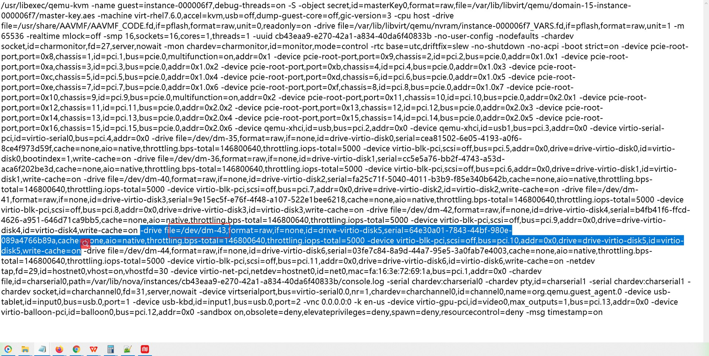
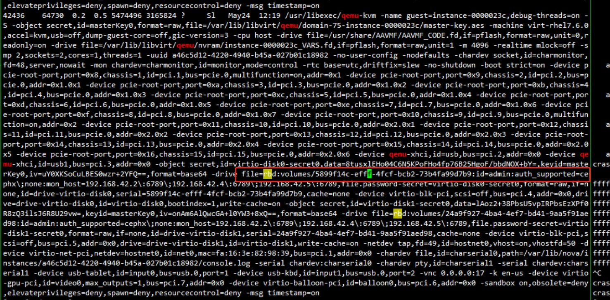

# 调查过程

## 问题难点描述
* 在我们内部的环境中是无法复现thp泄漏的
* 因为page的泄漏表现在`page->refcount > 0` , 假如说
  想获取`page->refcount`变化的话, 需要使用`systemtap`抓取
  `get_page`, `put_page`等**inline**接口，但是inline接口
   信息抓取`systemtap` 不好抓取(一个是抓取的点可能补全，第二个
  是参数不好获取)

## 问题突破
但是我们在自己环境发现了一些普通页的泄漏，而且这些页出现频率
特别高（在不开启ftrace的情况下，基本上每隔几秒钟就会出现一个）,
所以是一个必现的情况。

使用`page-types`工具获取到的这些泄漏页信息如下:

```shell
> page-types -l |grep R |grep l |grep a_ |grep -v M 
...
5f3e7e  1       __RUDlA_____a_b____________________________
5fd790  1       __RUDlA_____a_b____________________________
5ff4c0  1       __RUDlA_____a_b____________________________
...
```
除了thp属性，其余跟客户环境上泄漏页的属性基本一致。

**PS** : 客户环境泄漏页属性

```
__RUDlA_____a_b_______t____________________  # t 代表thp大页
```

## 调试方法

这里主要使用的是ftrace event

### CONFIG_DEBUG_PAGE_REF

内核编译选项中有`CONFIG_DEBUG_PAGE_REF`该编译选项, 该编译选项实际上
在`page_ref_*` 相关接口中增加了`tracepoint`，可以在`page_ref`trace event
打开后，获取到全部page refcount的变化情况，获取信息如下:

```
<...>-33724 [067] ....   161.787931: page_ref_mod_and_test: pfn=0x3dbc47 flags=referenced|uptodate|dirty|lru|active|swapbacked count=1 mapcount=1 mapping=00000000d68d0ca0 mt=1 val=-1 ret=0
<...>-33724 [067] ....   161.787936: page_ref_mod_and_test: pfn=0x3dbc47 flags=referenced|uptodate|dirty|lru|active|swapbacked count=0 mapcount=0 mapping=00000000d68d0ca0 mt=1 val=-1 ret=1
```

**PS** : eskernel 并未打开该选项，需要重新编译内核

### trace event filter
trace event 支持filter， 具体可以参考kernel 代码`Documentation/trace/events.rst`

执行的命令如下:

```shell
echo '(flags & 0x20) && (flags & 0x4) && (flags & 0x40000) && (flags & 0x40)' > /sys/kernel/debug/tracing/events/page_ref/filter
```
这里解释下, 使用的过滤条件可以查看`/sys/kernel/debug/tracing/events/page_ref/page_ref_freeze/format`

PS: 这里的page_ref_freeze可以为`page_ref`目录下的任意子目录。
得到的信息如下:
```
name: page_ref_freeze
ID: 498
format:
        field:unsigned short common_type;       offset:0;       size:2; signed:0;
        field:unsigned char common_flags;       offset:2;       size:1; signed:0;
        field:unsigned char common_preempt_count;       offset:3;       size:1; signed:0;
        field:int common_pid;   offset:4;       size:4; signed:1;

        field:unsigned long pfn;        offset:8;       size:8; signed:0;
        field:unsigned long flags;      offset:16;      size:8; signed:0;
        field:int count;        offset:24;      size:4; signed:1;
        field:int mapcount;     offset:28;      size:4; signed:1;
        field:void * mapping;   offset:32;      size:8; signed:0;
        field:int mt;   offset:40;      size:4; signed:1;
        field:int val;  offset:44;      size:4; signed:1;
        field:int ret;  offset:48;      size:4; signed:1;
...

```
上面的信息中的`field`, 都可以作为条件进行filter，我这里过滤的是flags,
flags中的值可以参考`include/linux/page-flags.h`,这里就不在展开，对应的关系
大概是:

|flags值(16进制)|flags含义|
|--|--|
|0x4			|PG_referenced		|
|0x20			|PG_lru				|
|0x40			|PG_active			|
|0x40000		|PG_swapbacked		|


### trace event trigger
使用`stacktrace`可以打印相关调用堆栈, 使用方法可以查看kernel代码
`Documentation/trace/events.rst`。

具体命令为:
```shell
echo 'stacktrace if (flags & 0x20) && (flags & 0x4) && (flags & 0x40000) && (flags & 0x40)' > /sys/kernel/debug/tracing/events/page_ref/page_ref_mod/trigger
echo 'stacktrace if (flags & 0x20) && (flags & 0x4) && (flags & 0x40000) && (flags & 0x40)' > /sys/kernel/debug/tracing/events/page_ref/page_ref_freeze/trigger
echo 'stacktrace if (flags & 0x20) && (flags & 0x4) && (flags & 0x40000) && (flags & 0x40)' > /sys/kernel/debug/tracing/events/page_ref/page_ref_mod_and_return/trigger
echo 'stacktrace if (flags & 0x20) && (flags & 0x4) && (flags & 0x40000) && (flags & 0x40)' > /sys/kernel/debug/tracing/events/page_ref/page_ref_mod_and_test/trigger
echo 'stacktrace if (flags & 0x20) && (flags & 0x4) && (flags & 0x40000) && (flags & 0x40)' > /sys/kernel/debug/tracing/events/page_ref/page_ref_mod_unless/trigger
echo 'stacktrace if (flags & 0x20) && (flags & 0x4) && (flags & 0x40000) && (flags & 0x40)' > /sys/kernel/debug/tracing/events/page_ref/page_ref_set/trigger
echo 'stacktrace if (flags & 0x20) && (flags & 0x4) && (flags & 0x40000) && (flags & 0x40)' > /sys/kernel/debug/tracing/events/page_ref/page_ref_unfreeze/trigger
```

### 增加trace event
在找到相应的堆栈后，为了获取更多的调试信息，又修改内核代码增加了一些
trace event, 用来获取函数运行中的变量信息。这里不再展开

## 调试信息分析

### DEBUG_PAGE_REF相关信息分析
通过`page-types -l`获取到泄漏的页的页框.
再通过`cat /sys/kernel/debug/tracing/trace_pipe`获取完整的ftrace 信息.
(在信息量大的情况下，`trace_pipe`获取的信息比`trace`要更加完整)

这里面主要是获取到`page->refcount`异常变化的流程
截取信息如下:
```
 cat trace.txt |grep 0x3cb36d
    kworker/42:1-780   [042] ....   347.476106: page_ref_mod_and_test: pfn=0x3cb36d flags=referenced|uptodate|lru|active|swapbacked count=2 mapcount=1 mapping=00000000918db821 mt=1 val=-1 ret=0
           <...>-43947 [031] d...   347.488321: page_ref_mod_unless: pfn=0x3cb36d flags=referenced|uptodate|lru|active|swapbacked count=3 mapcount=1 mapping=00000000918db821 mt=1 val=1 ret=1
           <...>-785   [031] ....   347.488679: page_ref_mod_and_test: pfn=0x3cb36d flags=referenced|uptodate|lru|active|swapbacked count=2 mapcount=1 mapping=00000000918db821 mt=1 val=-1 ret=0
           <...>-43947 [031] d...   347.501173: page_ref_mod_unless: pfn=0x3cb36d flags=referenced|uptodate|lru|active|swapbacked count=3 mapcount=1 mapping=00000000918db821 mt=1 val=1 ret=1
           <...>-43947 [031] d...   347.501175: page_ref_mod_unless: pfn=0x3cb36d flags=referenced|uptodate|lru|active|swapbacked count=4 mapcount=1 mapping=00000000918db821 mt=1 val=1 ret=1
           <...>-785   [031] ....   347.501531: page_ref_mod_and_test: pfn=0x3cb36d flags=referenced|uptodate|lru|active|swapbacked count=3 mapcount=1 mapping=00000000918db821 mt=1 val=-1 ret=0
           <...>-45954 [027] ....   472.868444: page_ref_mod: pfn=0x3cb36d flags=referenced|uptodate|lru|active|swapbacked count=4 mapcount=1 mapping=00000000918db821 mt=1 val=1
```
从这里可以看出,
count变化
```
2->3->2->3->4->3->4
	     ^  ^
```

这里`2->3->4`是一个连续增长的过程，是`page->refcount`最终在页释放不掉的原因。
可以获取到调用`page_ref_mod_unless`增加`page->refcount`的堆栈
```
 => __page_ref_mod_unless
 => gup_pgd_range
 => get_user_pages_fast
 => iov_iter_get_pages
 => bio_iov_iter_get_pages
 => blkdev_direct_IO
 => generic_file_direct_write
 => __generic_file_write_iter
 => blkdev_write_iter
 => aio_write.isra.5
 => io_submit_one.isra.6
 => __arm64_sys_io_submit
 => el0_svc_handler
 => el0_svc
```

可以看到实际上时gup（get user pages）这个过程出了问题。
这里稍微解释下, 内核态访问用户态数据时，往往采用两种方式:
* copy from user: 将用户态内存copy 一份到内核(适用于小内存)
* get user pages: 直接引用用户态pages(适用于较大内存)

### 分析kernel代码
#### bio_iov_iter_get_pages
```C/C++
/*
 * 该函数实际上会遍历iter, 并调用__bio_iov_iter_get_pages, 
 * __bio_iov_iter_get_pages会get_page并且add_to_bio
 */
int bio_iov_iter_get_pages(struct bio *bio, struct iov_iter *iter)
{
    unsigned short orig_vcnt = bio->bi_vcnt;

    do {
        int ret = __bio_iov_iter_get_pages(bio, iter);

        if (unlikely(ret))
            return bio->bi_vcnt > orig_vcnt ? 0 : ret;

    } while (iov_iter_count(iter) && !bio_full(bio));

    return 0;
}
/*
 * 其实内核态无非是想访问用户态内存，并增加引用计数防止该page被释放
 * 访问用户态内存的话，需要从内核态建立起对用户态内存的映射，而iov_iter_get_pages
 * 实际上会建立起va->pa映射，并且get_page()，这里不再展开
 */
static int __bio_iov_iter_get_pages(struct bio *bio, struct iov_iter *iter)
{
    unsigned short nr_pages = bio->bi_max_vecs - bio->bi_vcnt;
    unsigned short entries_left = bio->bi_max_vecs - bio->bi_vcnt;
    struct bio_vec *bv = bio->bi_io_vec + bio->bi_vcnt;
    struct page **pages = (struct page **)bv;
    ssize_t size, left;
    unsigned len, i;
    size_t offset;

    /*
     * Move page array up in the allocated memory for the bio vecs as far as
     * possible so that we can start filling biovecs from the beginning
     * without overwriting the temporary page array.
    */
    BUILD_BUG_ON(PAGE_PTRS_PER_BVEC < 2);
    pages += entries_left * (PAGE_PTRS_PER_BVEC - 1);
	// 建立va->pa映射, get_pages()
    size = iov_iter_get_pages(iter, pages, LONG_MAX, nr_pages, &offset);
    if (unlikely(size <= 0))
        return size ? size : -EFAULT;

    for (left = size, i = 0; left > 0; left -= len, i++) {
        struct page *page = pages[i];

        len = min_t(size_t, PAGE_SIZE - offset, left);
		//将page 加入到bio中
        if (WARN_ON_ONCE(bio_add_page(bio, page, len, offset) != len))
            return -EINVAL;
        offset = 0;
    }

    iov_iter_advance(iter, size);
    return 0;
}

int bio_add_page(struct bio *bio, struct page *page,
         unsigned int len, unsigned int offset)
{
	//尝试merge bio page
    if (!__bio_try_merge_page(bio, page, len, offset)) {
        if (bio_full(bio))
            return 0;
		//merge不成功，则直接add
        __bio_add_page(bio, page, len, offset);
    }
    return len;
}

bool __bio_try_merge_page(struct bio *bio, struct page *page,
        unsigned int len, unsigned int off)
{
    if (WARN_ON_ONCE(bio_flagged(bio, BIO_CLONED)))
        return false;

    if (bio->bi_vcnt > 0) {
        struct bio_vec *bv = &bio->bi_io_vec[bio->bi_vcnt - 1];
		//实际上merge的作用，是将两个iov_iter merge到一个bio_vec中	
        if (page == bv->bv_page && off == bv->bv_offset + bv->bv_len) {
            bv->bv_len += len;
            bio->bi_iter.bi_size += len;
            return true;
        }
    }
    return false;
}

```

中间也是一点点加调试信息打印推测，最终怀疑是和`bio_add_page()->_bio_try_merge_page()`
merge成功有关, 因为在`bio_add_page()`之前, iov_iter_get_pages()是按照iov_iter去
`get_page()`，而因为`bio_merge`, 两个iov_iter 会merge到一个bio_vec中，而release bio时，
实际上是按照bio_vec 进行put_page的，那这样就会造成两次`page_add()`一次`page_put()`

### 增加trace event调试信息

增加ftrace信息如下(不完整，截取一部分):
```C/C++
diff -aru ./lib/iov_iter.c patch/lib/iov_iter.c
--- ./lib/iov_iter.c    2021-05-26 07:43:50.153601427 -0400
+++ patch/lib/iov_iter.c        2021-06-17 05:21:45.242307425 -0400
@@ -6,6 +6,8 @@
 #include <linux/vmalloc.h>
 #include <linux/splice.h>
 #include <net/checksum.h>
+#define CREATE_TRACE_POINTS 1
+#include <trace/events/direct_io_test.h>

 #define PIPE_PARANOIA /* for now */

@@ -1190,6 +1192,7 @@
                   struct page **pages, size_t maxsize, unsigned maxpages,
                   size_t *start)
 {
+    char buf[256] = "";
        if (maxsize > i->count)
                maxsize = i->count;

@@ -1200,14 +1203,17 @@
                size_t len = v.iov_len + (*start = addr & (PAGE_SIZE - 1));
                int n;
                int res;
+               int j = 0;

                if (len > maxpages * PAGE_SIZE)
                        len = maxpages * PAGE_SIZE;
                addr &= ~(PAGE_SIZE - 1);
                n = DIV_ROUND_UP(len, PAGE_SIZE);
                res = get_user_pages_fast(addr, n, (i->type & WRITE) != WRITE, pages);
-               if (unlikely(res < 0))
+        if (unlikely(res < 0))
                        return res;
+
+        trace_iterate_all_deb_iov_iter_gp(v.iov_base, addr, v.iov_len, *start); //v.iov_base 和对齐地址(page 首地址)
                return (res == n ? len : res * PAGE_SIZE) - *start;
        0;}),({
                /* can't be more than PAGE_SIZE */

diff -aru ./block/bio.c patch/block/bio.c
--- ./block/bio.c       2021-06-17 05:11:21.748443137 -0400
+++ patch/block/bio.c   2021-05-25 03:04:23.802122835 -0400
@@ -34,6 +34,9 @@
 #include "blk.h"
 #include "blk-rq-qos.h"

+#define CREATE_TRACE_POINTS 1
+#include <trace/events/blk_test.h>
+
 /*
  * Test patch to inline a certain number of bi_io_vec's inside the bio
  * itself, to shrink a bio data allocation from two mempool calls to one
@@ -773,6 +776,7 @@
                if (page == bv->bv_page && off == bv->bv_offset + bv->bv_len) {
                        bv->bv_len += len;
                        bio->bi_iter.bi_size += len;
+            trace_bio_msg_deb_merge("the bio is merge");		//在bio merge打印信息
                        return true;
                }
        }
```

增加ftrace event,最终获取到的信息如下:
```
           <...>-43947 [031] ....   347.501172: blkdev_direct_IO <-generic_file_direct_write
           <...>-43947 [031] ....   347.501172: bio_iov_iter_get_pages <-blkdev_direct_IO
           <...>-43947 [031] ....   347.501172: bio_iov_deb_beg: iov_iter: type(1) iov_offset(0) count(24576) kvec.iov_base(00000000a3e12b0c) kvec.iov_len(12288)
           <...>-43947 [031] ....   347.501173: get_user_pages_fast <-iov_iter_get_pages
           <...>-43947 [031] d...   347.501173: page_ref_mod_unless: pfn=0x3cb36d flags=referenced|uptodate|lru|active|swapbacked count=3 mapcount=1 mapping=00000000918db821 mt=1 val=1 ret=1
           <...>-43947 [031] d...   347.501174: <stack trace>
 => __page_ref_mod_unless
 => gup_pgd_range
 => get_user_pages_fast
 => iov_iter_get_pages
 => bio_iov_iter_get_pages
 => blkdev_direct_IO
 => generic_file_direct_write
 => __generic_file_write_iter
 => blkdev_write_iter
 => aio_write.isra.5
 => io_submit_one.isra.6
 => __arm64_sys_io_submit
 => el0_svc_handler
 => el0_svc
           <...>-43947 [031] ....   347.501174: iterate_all_deb_iov_iter_gp: addr_org(187651449749504) addr(187651449749504) iov_len(12288) start(0)
           <...>-43947 [031] ....   347.501174: bio_iov_iter_gp_deb: size(12288) offset(0)
           <...>-43947 [031] ....   347.501174: bio_msg_deb_add: msg is the bio is add
           <...>-43947 [031] ....   347.501175: get_user_pages_fast <-iov_iter_get_pages
           <...>-43947 [031] d...   347.501175: page_ref_mod_unless: pfn=0x3cb36d flags=referenced|uptodate|lru|active|swapbacked count=4 mapcount=1 mapping=00000000918db821 mt=1 val=1 ret=1
           <...>-43947 [031] d...   347.501175: <stack trace>
 => __page_ref_mod_unless
 => gup_pgd_range
 => get_user_pages_fast
 => iov_iter_get_pages
 => bio_iov_iter_get_pages
 => blkdev_direct_IO
 => generic_file_direct_write
 => __generic_file_write_iter
 => blkdev_write_iter
 => aio_write.isra.5
 => io_submit_one.isra.6
 => __arm64_sys_io_submit
 => el0_svc_handler
 => el0_svc
           <...>-43947 [031] ....   347.501178: iterate_all_deb_iov_iter_gp: addr_org(187651449761792) addr(187651449749504) iov_len(12288) start(12288)
           <...>-43947 [031] ....   347.501178: bio_iov_iter_gp_deb: size(12288) offset(12288)
           <...>-43947 [031] ....   347.501178: bio_msg_deb_add: msg is the bio is add
           <...>-43947 [031] ....   347.501178: bio_msg_deb_merge: msg is the bio is merge
           <...>-43947 [031] ....   347.501179: bcache_request_start: 8,0 WS 55376024 + 48 (from 251,0 @ 55376008)
           <...>-43947 [031] ....   347.501179: bcache_write: ccb59243-826c-49f9-b24e-f164703c50a2 inode 0  WS 55376024 + 48 hit 1 bypass 0
           <...>-43947 [031] ....   347.501180: bcache_cache_insert: 0:55376072 len 48 dirty 1
```

### 分析结果

可以看到, 整个过程是一个blkdev_direct_IO, 也就是一次aio，其中有两个iov_iter，两个iov_iter->iov_base是: 187651449749504,  187651449761792 大小均为 12288, 
而他们都在一个页上，页的首地址为187651449749504, 实际上两个地址关系如下图所示:
```
----------iov_iter1->iov_base   187651449749504   page首地址
    |
	| 中间间隔:12288
	|
----------iov_iter2->iov_base   187651449761792 
```

所以从上图来看，这两个iov是两个同一个page上的连续向量。而实际上，满足bio_merge的条件也是如此:<br />
两个向量在同一个page上，并且连续。
而且从
```
       <...>-43947 [031] ....   347.501178: bio_msg_deb_merge: msg is the bio is merge
```
该行打印来看，bio确实发生了merge。
假如说这个page是thp的话，也就发生了客户环境上出现的那种现象。


## 进一步验证

### 在本地编写小程序复现客户环境现象
编写小程序需要满足:
* 申请大页
* 在大页上去构建两个连续的iov_iter
* 去触发aio

编写小程序如下:

```C/C++

char *ptr1 = NULL;

void aio_test()
{

	io_context_t ctx;
    unsigned nr_events = 10;
    struct iovec myiovec[2];
    int errcode = 0;
    memset(&ctx, 0, sizeof(ctx));  // It's necessary，这里一定要的

	//申请两个向量为同一个page的连续向量
    myiovec[0].iov_base = ptr1; 		
    myiovec[0].iov_len = 12288;
    myiovec[1].iov_base = ptr1 + 12288;
    myiovec[1].iov_len = 12288;
	....
	//这里一定要使用设备文件，否则进入不了blkdev_direct_IO, 这里后面会解释下
	int fd = open("/dev/loop2", O_CREAT|O_DIRECT|O_RDWR, S_IRWXU|S_IRWXG|S_IROTH);
	...
	//使用向量
	iocbpp[0].aio_lio_opcode = IO_CMD_PWRITEV;
	...
	//提交bio	
	int n = io_submit(ctx, 1, &iocbpp);
	...
}

int mmap_and_madvise(char **pptr)
{
    char *ptr = NULL;
    int ret = 0;

	//mmmap 一段内存
    ptr = (char *)mmap(NULL, BUF_SIZE, PROT_READ|PROT_WRITE, MAP_PRIVATE | MAP_ANONYMOUS ,-1, 0);
    if (ptr == MAP_FAILED)
    {
        printf("mmap failed\n");
        return -1;
    }
	
	//使用MADV_HUGEPAGE属性
	ret = madvise(ptr, BUF_SIZE, MADV_HUGEPAGE);
	if (ret < 0)
	{
	        printf("the madvise < 0\n");
	        return -1;
	}

	return ret;
}
int main(int argc, char *argv[])
{
    int ret = 0;
    int i = 0;
    char buf[8] = "";
    int j = 0;

	//申请大页
    ret = mmap_and_madvise(&ptr1);
    if (ret < 0) {
        printf("mmap and madvise Faild\n");
        goto err;
    }
	//触发缺页中断，申请页面
	for (i = 0; i < BUF_SIZE; i++) {
	    ptr1[i] = (unsigned char )i;
	}

	//触发aio
	aio_test();
}
```
编写小程序后，可以触发thp泄漏，
使用page-types可以获取到
`__RUDlA_____a_b_______t____________________`
该类型page(thp泄漏page)。

### open(/dev/loop0)
这里为什么要打开设备文件呢，我这里也做了打开文件系统上的文件
进行了bio测试，发现根本进入不了`blkdev_direct_IO`, 这个函数。
为什么呢？我们来看下代码:

```C/C++
static const struct address_space_operations def_blk_aops = {
    .readpage   = blkdev_readpage,
    .readpages  = blkdev_readpages,
    .writepage  = blkdev_writepage,
    .write_begin    = blkdev_write_begin,
    .write_end  = blkdev_write_end,
    .writepages = blkdev_writepages,
    .releasepage    = blkdev_releasepage,
    .direct_IO  = blkdev_direct_IO, 		//def_blk_aops会调用
    .is_dirty_writeback = buffer_check_dirty_writeback,
};
...
static const struct address_space_operations ext4_da_aops = {
    .readpage       = ext4_readpage,
    .readpages      = ext4_readpages,
    .writepage      = ext4_writepage,
    .writepages     = ext4_writepages,
    .write_begin        = ext4_da_write_begin,
    .write_end      = ext4_da_write_end,
    .set_page_dirty     = ext4_set_page_dirty,
    .bmap           = ext4_bmap,
    .invalidatepage     = ext4_da_invalidatepage,
    .releasepage        = ext4_releasepage,
    .direct_IO      = ext4_direct_IO,		//不是blkdev_direct_IO,而且也不会调用bio_merge
    .migratepage        = buffer_migrate_page,
    .is_partially_uptodate  = block_is_partially_uptodate,
    .error_remove_page  = generic_error_remove_page,
};

...
```
实际上, bdev fs使用的是`def_blk_aops`，会在注册块设备时，在vfs
层注册设备，创建块设备文件时,调用`bdget`函数获取到 
堆栈和bdget如下:

```C/C++
//register_disk
//	bdget_disk
//		bdget

...
//文件系统类型
static struct file_system_type bd_type = {      
    .name       = "bdev",                       
    .mount      = bd_mount,                     
    .kill_sb    = kill_anon_super,              
}; 
...
                                             
struct block_device *bdget(dev_t dev)                         
{                                                             
    struct block_device *bdev;                                
    struct inode *inode;                                      
    //superblock 是blockdev_superblock
    inode = iget5_locked(blockdev_superblock, hash(dev),      
            bdev_test, bdev_set, &dev);                       
                                                              
    if (!inode)                                               
        return NULL;                                          
                                                              
    bdev = &BDEV_I(inode)->bdev;                              
                                                              
    if (inode->i_state & I_NEW) {                             
        bdev->bd_contains = NULL;                             
        bdev->bd_super = NULL;                                
        bdev->bd_inode = inode;                               
        bdev->bd_block_size = i_blocksize(inode);             
        bdev->bd_part_count = 0;                              
        bdev->bd_invalidated = 0;                             
        inode->i_mode = S_IFBLK;                              
        inode->i_rdev = dev;                                  
        inode->i_bdev = bdev;
		//赋值def_blk_aops
        inode->i_data.a_ops = &def_blk_aops;                  
        mapping_set_gfp_mask(&inode->i_data, GFP_USER);       
        spin_lock(&bdev_lock);                                
        list_add(&bdev->bd_list, &all_bdevs);                 
        spin_unlock(&bdev_lock);                              
        unlock_new_inode(inode);                              
    }                                                         
    return bdev;                                              
}
```

# 其余诉求(需进一步验证)
现在只是在本地环境上通过小程序复现了这个问题，
客户环境上是QEMU申请了大页，并产生了泄漏的问题。
为了严谨，还需要验证下qemu-kvm进程是否会调用`blkdev_direct_IO`

但是客户环境上的qemu-kvm启动参数是这样的:

其中用作磁盘的文件为`/dev/dm-*`
而现在本地环境上qemu-kvm启动参数为:

用作磁盘的文件为`rbd`
查看`/proc/${QEMU PID}/fd/`下的文件描述符，
发现并没有打开/dev/下的块设备文件，所以在现在本地环境的qemu-kvm
是无法复现该问题的。请教负责计算的同事，说该参数变化和商业存储有关。

但是目前QA那边没有商业存储环境，而有些商业存储环境可能还不一样（依然是
rbd存储）。所以希望可以在客户生产环境上做下验证。

