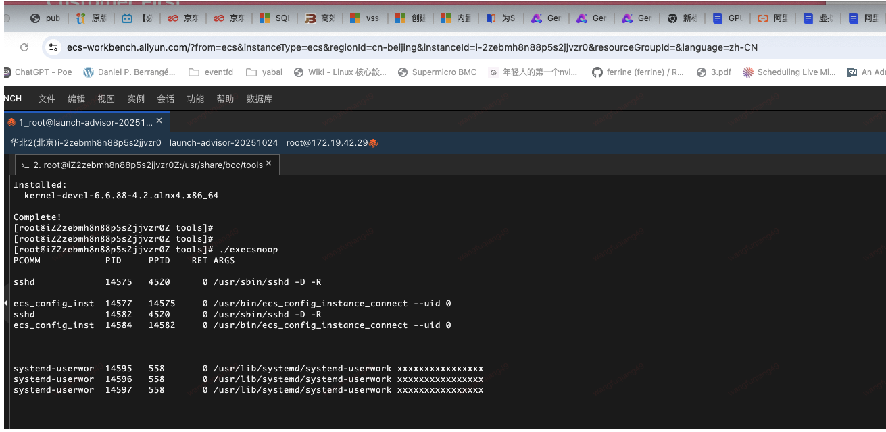

## 测试aliyun快照时文件系统一致性
### 未开启应用一致性

首先将数据盘挂载到mnt下，创建下面python脚本
用于频繁修改文件系统元数据:
```python
import os
import time

while True:
    temp_files = []
    for i in range(1000):
        filename = f"tempfile_{i}.tmp"
        with open(filename, "w") as f:
            f.write("tmpfile...\n")
        temp_files.append(filename)

    for file_path in temp_files:
        try:
            os.remove(file_path)
        except Exception as e:
            print(f"delete {file_path} failed: {e}")
```

使用下面 bcc-tools `execsnoop`抓取是否有进程在该过程被拉起:
然后在页面执行创建快照组,



可以发现`execsnoop`并未显示有特殊的进程拉起


使用bpftrace 抓取 `filesystem freeze` 流程:
```
[root@iZ2ze34bqeifu0i50tzhv3Z ~]# cat bpftrace
kprobe:freeze_super { printf("freeze_super called! sb=%p\n", arg0); }
kprobe:thaw_super { printf("thaw_super called! sb=%p\n", arg0); }
```

结果发现，在整个快照过程中也没有输出。

所以，怀疑 **其根本未做文件系统一致性的动作** !


使用之前快照回滚盘, 在第一次挂载数据盘时，会打印 `recovery`:
```
## 第一次
[   68.752727] XFS (nvme1n1): Mounting V5 Filesystem 7c7b5119-64ce-4b26-a913-48f7dd05285a
[   69.171908] XFS (nvme1n1): Starting recovery (logdev: internal)
[   69.979664] XFS (nvme1n1): Ending recovery (logdev: internal)
[  110.650693] XFS (nvme1n1): Unmounting Filesystem 7c7b5119-64ce-4b26-a913-48f7dd05285a

## 第二次
[  138.815070] XFS (nvme1n1): Mounting V5 Filesystem 7c7b5119-64ce-4b26-a913-48f7dd05285a
[  138.822890] XFS (nvme1n1): Ending clean mount
[  141.977432] XFS (nvme1n1): Unmounting Filesystem 7c7b5119-64ce-4b26-a913-48f7dd05285a

## 第三次
[  144.785305] XFS (nvme1n1): Mounting V5 Filesystem 7c7b5119-64ce-4b26-a913-48f7dd05285a
[  144.794335] XFS (nvme1n1): Ending clean mount
```

说明第一次挂载时，xfs 发现日志中的事务是不完整的，所以！aliyun似乎未做文件系统一
致性的动作。

### 开启应用一致性

> NOTE
>
> 在centos7 上测试，使用其他镜像可能会失败


使用如下systemtap脚本获取:
```
probe kprobe.function("freeze_super") {
    printf("freeze_super called at %s (pid=%d)\n", execname(), pid())
    print_backtrace()
}
probe kprobe.function("thaw_super") {
    printf("thaw_super called at %s (pid=%d)\n", execname(), pid())
    print_backtrace()
}
```

输出信息:

```
Pass 1: parsed user script and 473 library scripts using 272056virt/69208res/3512shr/65836data kb, in 440usr/30sys/746real ms.
Pass 2: analyzed script: 2 probes, 3 functions, 3 embeds, 0 globals using 286700virt/84528res/6264shr/78380data kb, in 180usr/620sys/3445real ms.
Missing separate debuginfos, use: debuginfo-install kernel-3.10.0-1160.119.1.el7.x86_64 
Pass 3: using cached /root/.systemtap/cache/1c/stap_1cc6b922ca858ccb5c6104fc4651a9c5_2594.c
Pass 4: using cached /root/.systemtap/cache/1c/stap_1cc6b922ca858ccb5c6104fc4651a9c5_2594.ko
Pass 5: starting run.
WARNING: Missing unwind data for a module, rerun with 'stap -d kernel'
freeze_super called at fsfreezer (pid=1967)
 0xffffffff9aa5f090
 0xffffffff9aa71c71
 0xffffffff9afc539a
freeze_super called at fsfreezer (pid=1967)
 0xffffffff9aa5f090
 0xffffffff9aa71c71
 0xffffffff9afc539a
thaw_super called at fsfreezer (pid=1967)
 0xffffffff9aa5f060
 0xffffffff9aa71c71
 0xffffffff9afc539a
thaw_super called at fsfreezer (pid=1967)
 0xffffffff9aa5f060
 0xffffffff9aa71c71
 0xffffffff9afc539a
```

可以看到是由一个叫`fsfreezer`的进程执行的filesystem frozen

可执行文件位置:
```
[root@iZ2zej48nvay43y5f66hlfZ usr]# find ./ -name "fsfreezer"
./local/share/aliyun-assist/plugin/app-snapshot-plugin/1.8/fsfreezer

[root@iZ2zej48nvay43y5f66hlfZ usr]# rpm -qf ./local/share/aliyun-assist/plugin/app-snapshot-plugin/1.8/fsfreezer
file /usr/local/share/aliyun-assist/plugin/app-snapshot-plugin/1.8/fsfreezer is not owned by any package
```

不确定是如何安装上的, aliyun似乎并未公开该程序源码

### 再次mount
```
[    1.147337] EXT4-fs (nvme0n1p1): mounted filesystem with ordered data mode. Opts: (null)
[    1.670240] EXT4-fs (nvme0n1p1): re-mounted. Opts: (null)
[    9.168285]  nvme1n1: p1
[    9.179122]  nvme1n1: p1
[   10.720093]  nvme1n1: p1
[   10.850036]  nvme1n1: p1
[   54.609040] EXT4-fs (nvme1n1p1): mounted filesystem with ordered data mode. Opts: (null)
```

再次`mount`没有输出`recovery`的信息，所以aliyun通过这种方式保证了文件系统一致性

## aliyun内部日志
```
[root@iZ2zej48nvay43y5f66hlfZ log]# cat app_snapshot_plugin.log.20251027.5 
time="2025-10-27 13:47:31.584201122" level=info msg="Runtime Args: [--RamRoleName=snap -EnableFsFreeze=true -TimeoutInSeconds=30 -PreScriptPath=/tmp/prescript.sh -PostScriptPath=/tmp/postscript.sh -Name=Created_At_202510271347]"
time="2025-10-27 13:47:31.584390988" level=error msg="Failded to read local default configure file" error="open /usr/local/share/aliyun-assist/plugin/app-snapshot-plugin/1.8/app_snapshot_plugin.json: no such file or directory"
time="2025-10-27 13:47:31.603080569" level=info msg="http://100.100.100.200/latest/meta-data/instance-id i-2zej48nvay43y5f66hlf <nil>"
time="2025-10-27 13:47:31.617991815" level=info msg="http://100.100.100.200/latest/meta-data/region-id cn-beijing <nil>"
time="2025-10-27 13:47:31.659075547" level=info msg="=========BEGIN===========" Type=lsb_release
time="2025-10-27 13:47:31.659118349" level=info msg="LSB Version:\t:core-4.1-amd64:core-4.1-noarch"
time="2025-10-27 13:47:31.659127461" level=info msg="Distributor ID:\tCentOS"
time="2025-10-27 13:47:31.659135034" level=info msg="Description:\tCentOS Linux release 7.9.2009 (Core)"
time="2025-10-27 13:47:31.6591418" level=info msg="Release:\t7.9.2009"
time="2025-10-27 13:47:31.659148683" level=info msg="Codename:\tCore"
time="2025-10-27 13:47:31.659156585" level=info msg="==========End===========" Type=lsb_release
time="2025-10-27 13:47:31.65919145" level=error msg="File /tmp/prescript.sh not found , error=stat /tmp/prescript.sh: no such file or directory"
time="2025-10-27 13:47:31.65920855" level=error msg="File /tmp/postscript.sh not found , error=stat /tmp/postscript.sh: no such file or directory"
time="2025-10-27 13:47:31.65921966" level=error msg="Pre/Post-Script have no Expected Permission"
time="2025-10-27 13:47:31.659231645" level=info msg="Pre/Post-Script files were not found!"
time="2025-10-27 13:47:31.659243095" level=info msg="Dump SnapshotContext Options:"
time="2025-10-27 13:47:31.659250138" level=info msg="InstanceID: i-2zej48nvay43y5f66hlf"
time="2025-10-27 13:47:31.659257204" level=info msg="RegionID: cn-beijing"
time="2025-10-27 13:47:31.659263495" level=info msg="RamRoleName: snap"
time="2025-10-27 13:47:31.65927293" level=info msg="ExcludeDiskId: []"
time="2025-10-27 13:47:31.65927963" level=info msg="ProductNetwork: vpc"
time="2025-10-27 13:47:31.659286672" level=info msg="PreScriptPath: /tmp/prescript.sh"
time="2025-10-27 13:47:31.659293473" level=info msg="PostScriptPath: /tmp/postscript.sh"
time="2025-10-27 13:47:31.659300671" level=info msg="EnableFsFreeze: true"
time="2025-10-27 13:47:31.659309099" level=info msg="TimeoutInSeconds: 30"
time="2025-10-27 13:47:31.659315904" level=info msg="ScriptTimeoutInSeconds: 1800"
time="2025-10-27 13:47:31.787152472" level=info msg="Network connection RequestId= 57A0B508-56C3-590D-BD21-BC35F987A050, timeCost=127.727092ms"
time="2025-10-27 13:47:31.787204086" level=info msg="Attached DiskId=d-2zej48nvay43y5ezy63u, Device=/dev/xvdb, Category=cloud_auto"
time="2025-10-27 13:47:31.787216747" level=info msg="Attached DiskId=d-2zej48nvay43y5ezy63t, Device=/dev/xvda, Category=cloud_essd"
time="2025-10-27 13:47:31.921288861" level=info msg="Start to check Pre/Post-Script"
time="2025-10-27 13:47:31.921347255" level=error msg="lstat /tmp/prescript.sh: no such file or directory"
time="2025-10-27 13:47:31.921358029" level=error msg="lstat /tmp/prescript.sh: no such file or directory"
time="2025-10-27 13:47:31.921371697" level=error msg="No such Pre/Post-Script files or have no \"execute\" Permission"
time="2025-10-27 13:47:31.921394627" level=info msg="Discovering Mounted Volumes ..."
time="2025-10-27 13:47:31.924304584" level=info msg="=========BEGIN===========" Type=lsblk
time="2025-10-27 13:47:31.924338057" level=info msg="NAME=\"nvme0n1\" TYPE=\"disk\" FSTYPE=\"\" MOUNTPOINT=\"\" LABEL=\"\" UUID=\"\" MODEL=\"Alibaba Cloud Elastic Block Storage     \" SIZE=\"21474836480\""
time="2025-10-27 13:47:31.924352576" level=info msg="NAME=\"nvme0n1p1\" TYPE=\"part\" FSTYPE=\"ext4\" MOUNTPOINT=\"/\" LABEL=\"\" UUID=\"c8b5b2da-5565-4dc1-b002-2a8b07573e22\" MODEL=\"\" SIZE=\"21473787904\""
time="2025-10-27 13:47:31.924365022" level=info msg="NAME=\"nvme1n1\" TYPE=\"disk\" FSTYPE=\"\" MOUNTPOINT=\"\" LABEL=\"\" UUID=\"\" MODEL=\"Alibaba Cloud Elastic Block Storage     \" SIZE=\"10737418240\""
time="2025-10-27 13:47:31.924373965" level=info msg="NAME=\"nvme1n1p1\" TYPE=\"part\" FSTYPE=\"ext4\" MOUNTPOINT=\"/mnt\" LABEL=\"\" UUID=\"e2daa09e-73eb-4914-900d-c4dd131a7804\" MODEL=\"\" SIZE=\"10736352768\""
time="2025-10-27 13:47:31.924383704" level=info msg="==========End===========" Type=lsblk
time="2025-10-27 13:47:31.92441921" level=info msg="Empty lsblk device MountPoint, skipped: lsblk MOUNTPOINT=, NAME=nvme0n1, TYPE=disk, FSTYPE=, LABEL=, UUID=, MODEL=Alibaba, Size=21474836480"
time="2025-10-27 13:47:31.924430379" level=info msg="Empty lsblk device MountPoint, skipped: lsblk MOUNTPOINT=, NAME=nvme1n1, TYPE=disk, FSTYPE=, LABEL=, UUID=, MODEL=Alibaba, Size=10737418240"
time="2025-10-27 13:47:31.925771709" level=info msg="=========BEGIN===========" Type=/bin/mount
time="2025-10-27 13:47:31.925817028" level=info msg="sysfs on /sys type sysfs (rw,nosuid,nodev,noexec,relatime)"
time="2025-10-27 13:47:31.925826278" level=info msg="proc on /proc type proc (rw,nosuid,nodev,noexec,relatime)"
time="2025-10-27 13:47:31.925833859" level=info msg="devtmpfs on /dev type devtmpfs (rw,nosuid,size=1856112k,nr_inodes=464028,mode=755)"
time="2025-10-27 13:47:31.925841577" level=info msg="securityfs on /sys/kernel/security type securityfs (rw,nosuid,nodev,noexec,relatime)"
time="2025-10-27 13:47:31.92584893" level=info msg="tmpfs on /dev/shm type tmpfs (rw,nosuid,nodev)"
time="2025-10-27 13:47:31.92585643" level=info msg="devpts on /dev/pts type devpts (rw,nosuid,noexec,relatime,gid=5,mode=620,ptmxmode=000)"
time="2025-10-27 13:47:31.925863833" level=info msg="tmpfs on /run type tmpfs (rw,nosuid,nodev,mode=755)"
time="2025-10-27 13:47:31.925871048" level=info msg="tmpfs on /sys/fs/cgroup type tmpfs (ro,nosuid,nodev,noexec,mode=755)"
time="2025-10-27 13:47:31.925880767" level=info msg="cgroup on /sys/fs/cgroup/systemd type cgroup (rw,nosuid,nodev,noexec,relatime,xattr,release_agent=/usr/lib/systemd/systemd-cgroups-agent,name=systemd)"
time="2025-10-27 13:47:31.925889375" level=info msg="pstore on /sys/fs/pstore type pstore (rw,nosuid,nodev,noexec,relatime)"
time="2025-10-27 13:47:31.925896813" level=info msg="cgroup on /sys/fs/cgroup/devices type cgroup (rw,nosuid,nodev,noexec,relatime,devices)"
time="2025-10-27 13:47:31.925903915" level=info msg="cgroup on /sys/fs/cgroup/net_cls,net_prio type cgroup (rw,nosuid,nodev,noexec,relatime,net_prio,net_cls)"
time="2025-10-27 13:47:31.92591183" level=info msg="cgroup on /sys/fs/cgroup/freezer type cgroup (rw,nosuid,nodev,noexec,relatime,freezer)"
time="2025-10-27 13:47:31.925918739" level=info msg="cgroup on /sys/fs/cgroup/cpu,cpuacct type cgroup (rw,nosuid,nodev,noexec,relatime,cpuacct,cpu)"
time="2025-10-27 13:47:31.925928607" level=info msg="cgroup on /sys/fs/cgroup/pids type cgroup (rw,nosuid,nodev,noexec,relatime,pids)"
time="2025-10-27 13:47:31.92593605" level=info msg="cgroup on /sys/fs/cgroup/cpuset type cgroup (rw,nosuid,nodev,noexec,relatime,cpuset)"
time="2025-10-27 13:47:31.925943588" level=info msg="cgroup on /sys/fs/cgroup/blkio type cgroup (rw,nosuid,nodev,noexec,relatime,blkio)"
time="2025-10-27 13:47:31.925951473" level=info msg="cgroup on /sys/fs/cgroup/hugetlb type cgroup (rw,nosuid,nodev,noexec,relatime,hugetlb)"
time="2025-10-27 13:47:31.925958547" level=info msg="cgroup on /sys/fs/cgroup/memory type cgroup (rw,nosuid,nodev,noexec,relatime,memory)"
time="2025-10-27 13:47:31.925966066" level=info msg="cgroup on /sys/fs/cgroup/perf_event type cgroup (rw,nosuid,nodev,noexec,relatime,perf_event)"
time="2025-10-27 13:47:31.925973451" level=info msg="configfs on /sys/kernel/config type configfs (rw,relatime)"
time="2025-10-27 13:47:31.925984685" level=info msg="/dev/nvme0n1p1 on / type ext4 (rw,relatime,data=ordered)"
time="2025-10-27 13:47:31.925991878" level=info msg="systemd-1 on /proc/sys/fs/binfmt_misc type autofs (rw,relatime,fd=26,pgrp=1,timeout=0,minproto=5,maxproto=5,direct,pipe_ino=10314)"
time="2025-10-27 13:47:31.926002664" level=info msg="debugfs on /sys/kernel/debug type debugfs (rw,relatime)"
time="2025-10-27 13:47:31.926009586" level=info msg="hugetlbfs on /dev/hugepages type hugetlbfs (rw,relatime)"
time="2025-10-27 13:47:31.926016797" level=info msg="mqueue on /dev/mqueue type mqueue (rw,relatime)"
time="2025-10-27 13:47:31.926023749" level=info msg="sunrpc on /var/lib/nfs/rpc_pipefs type rpc_pipefs (rw,relatime)"
time="2025-10-27 13:47:31.926031892" level=info msg="tmpfs on /run/user/0 type tmpfs (rw,nosuid,nodev,relatime,size=373340k,mode=700)"
time="2025-10-27 13:47:31.926039617" level=info msg="/dev/nvme1n1p1 on /mnt type ext4 (rw,relatime,data=ordered)"
time="2025-10-27 13:47:31.926046655" level=info msg="binfmt_misc on /proc/sys/fs/binfmt_misc type binfmt_misc (rw,relatime)"
time="2025-10-27 13:47:31.926055539" level=info msg="==========End===========" Type=/bin/mount
time="2025-10-27 13:47:31.926106766" level=info msg="MountPoint: /, FsType: ext4 Added"
time="2025-10-27 13:47:31.926120149" level=info msg="Add MountPoint mountpoint:/_deviceName:nvme0n1p1_fsType:ext4_uniqueName:/_nvme0n1p1"
time="2025-10-27 13:47:31.926129402" level=info msg="MountPoint: /mnt, FsType: ext4 Added"
time="2025-10-27 13:47:31.926139213" level=info msg="Add MountPoint mountpoint:/mnt_deviceName:nvme1n1p1_fsType:ext4_uniqueName:/mnt_nvme1n1p1"
time="2025-10-27 13:47:31.926237597" level=info msg="###########1. Starting FsFreeze"
time="2025-10-27 13:47:32.925106618" level=info msg="FsFreeze Finished successfully"
time="2025-10-27 13:47:32.925151817" level=info msg="FsFreeze Finished"
time="2025-10-27 13:47:32.925165015" level=info msg="=========BEGIN===========" Type=FsFreeze
time="2025-10-27 13:47:32.925176577" level=info msg="user defined signal 12025-10-27 13:47:31 ############2. Filesystem Freeze Started"
time="2025-10-27 13:47:32.925185013" level=info msg="2025-10-27 13:47:31 freezing: /"
time="2025-10-27 13:47:32.925194923" level=info msg="2025-10-27 13:47:31 freezing: /mnt"
time="2025-10-27 13:47:32.925202706" level=info msg="2025-10-27 13:47:31 ############ 3. Filesystem Freeze Completed "
time="2025-10-27 13:47:32.925212501" level=info msg="2025-10-27 13:47:32 quiescing 1 second "
time="2025-10-27 13:47:32.925219571" level=info msg="2025-10-27 13:47:32 ############ 5. Filesystem Thaw Received "
time="2025-10-27 13:47:32.925233361" level=info msg="2025-10-27 13:47:32 Thawing: /mnt"
time="2025-10-27 13:47:32.925240869" level=info msg="2025-10-27 13:47:32 Thawing: /"
time="2025-10-27 13:47:32.925248994" level=info msg="==========End===========" Type=FsFreeze
time="2025-10-27 13:47:32.925258464" level=info msg="=========BEGIN===========" Type=CreateSnapshot
time="2025-10-27 13:47:32.925268584" level=info msg="2025-10-27 13:47:32.25470979 SnapshotGroup, requestId=27F2F825-776E-5C3D-839B-813B36123F90, GroupId=ssg-2ze7j78cztap073v1xba, Cost:318.727822ms"
time="2025-10-27 13:47:32.925280698" level=info msg="2025-10-27 13:47:32.333255308 Error:Unexpected length of the snapshot group%!(EXTRA int=30)"
time="2025-10-27 13:47:32.925288885" level=info msg="2025-10-27 13:47:32.395244228 Error:Unexpected length of the snapshot group%!(EXTRA int=30)"
time="2025-10-27 13:47:32.925296783" level=info msg="2025-10-27 13:47:32.466278714 Error:Unexpected length of the snapshot group%!(EXTRA int=30)"
time="2025-10-27 13:47:32.925304679" level=info msg="2025-10-27 13:47:32.668963454 Quering SnapshotGroup Progress[0], RequestId=B92CE5D7-4C03-542D-B3BE-1C6A492B3A36, GroupId=ssg-2ze7j78cztap073v1xba, Cost=202.666366ms, TotalCost=414.230578ms"
time="2025-10-27 13:47:32.925313612" level=info msg="2025-10-27 13:47:32.92417632 Quering SnapshotGroup Progress[1], RequestId=C089B9DC-230A-53CC-83E1-0EF20C20DBBE, GroupId=ssg-2ze7j78cztap073v1xba, Cost=205.137166ms, TotalCost=669.44581ms"
time="2025-10-27 13:47:32.925321247" level=info msg="2025-10-27 13:47:32.924177784 Finished Quering SnapshotGroup Progress"
time="2025-10-27 13:47:32.925328954" level=info msg="2025-10-27 13:47:32.924191678 Finish SnapshotGroup=ssg-2ze7j78cztap073v1xba Creation, TotalCost=988.217821ms, QueryCost=669.468498ms"
time="2025-10-27 13:47:32.925341399" level=info msg="==========End===========" Type=CreateSnapshot
time="2025-10-27 13:47:33.069961139" level=info msg="Take FsConsistent snapshots successfully"
time="2025-10-27 13:47:33.070003669" level=info msg="Prescript cost=, Postscript cost="
time="2025-10-27 13:47:33.070019742" level=info msg="Prepare Freeze=14.586567ms, Thaw cost=1.059262ms, Snapshot Creation=988.224506ms, Tag Resources=144.6089ms"
time="2025-10-27 13:47:33.070031507" level=info msg="Finish whole Processes of Snapshot successfully"
```

### 约束

当我们将`/dev/nvme1n1p1`挂载到两个路径时，
```
[root@iZ2zej48nvay43y5f66hlfZ /]# mount /dev/nvme1n1p1 /mnt2/
[root@iZ2zej48nvay43y5f66hlfZ /]# mount |grep nvme1n1p1
/dev/nvme1n1p1 on /mnt type ext4 (rw,relatime,data=ordered)
/dev/nvme1n1p1 on /mnt2 type ext4 (rw,relatime,data=ordered)
```
任务会执行失败，查看日志:

```
[root@iZ2zej48nvay43y5f66hlfZ log]# cat app_snapshot_plugin.log.20251027.8 
time="2025-10-27 14:09:44.275743555" level=info msg="Runtime Args: [--RamRoleName=snap -EnableFsFreeze=true -TimeoutInSeconds=30 -PreScriptPath=/tmp/prescript.sh -PostScriptPath=/tmp/postscript.sh -ExcludeDiskId=d-2zej48nvay43y5ezy63t -Name=Created_At_202510271409]"
time="2025-10-27 14:09:44.27592087" level=error msg="Failded to read local default configure file" error="open /usr/local/share/aliyun-assist/plugin/app-snapshot-plugin/1.8/app_snapshot_plugin.json: no such file or directory"
time="2025-10-27 14:09:44.28521262" level=info msg="http://100.100.100.200/latest/meta-data/instance-id i-2zej48nvay43y5f66hlf <nil>"
time="2025-10-27 14:09:44.293287091" level=info msg="http://100.100.100.200/latest/meta-data/region-id cn-beijing <nil>"
time="2025-10-27 14:09:44.309703922" level=info msg="=========BEGIN===========" Type=lsb_release
time="2025-10-27 14:09:44.309738811" level=info msg="LSB Version:\t:core-4.1-amd64:core-4.1-noarch"
time="2025-10-27 14:09:44.309746008" level=info msg="Distributor ID:\tCentOS"
time="2025-10-27 14:09:44.30975265" level=info msg="Description:\tCentOS Linux release 7.9.2009 (Core)"
time="2025-10-27 14:09:44.309758934" level=info msg="Release:\t7.9.2009"
time="2025-10-27 14:09:44.309763635" level=info msg="Codename:\tCore"
time="2025-10-27 14:09:44.30976907" level=info msg="==========End===========" Type=lsb_release
time="2025-10-27 14:09:44.309791344" level=error msg="File /tmp/prescript.sh not found , error=stat /tmp/prescript.sh: no such file or directory"
time="2025-10-27 14:09:44.309804145" level=error msg="File /tmp/postscript.sh not found , error=stat /tmp/postscript.sh: no such file or directory"
time="2025-10-27 14:09:44.30981302" level=error msg="Pre/Post-Script have no Expected Permission"
time="2025-10-27 14:09:44.309823206" level=info msg="Pre/Post-Script files were not found!"
time="2025-10-27 14:09:44.309840256" level=info msg="Dump SnapshotContext Options:"
time="2025-10-27 14:09:44.309847057" level=info msg="InstanceID: i-2zej48nvay43y5f66hlf"
time="2025-10-27 14:09:44.309851925" level=info msg="RegionID: cn-beijing"
time="2025-10-27 14:09:44.309856296" level=info msg="RamRoleName: snap"
time="2025-10-27 14:09:44.30987237" level=info msg="ExcludeDiskId: [d-2zej48nvay43y5ezy63t]"
time="2025-10-27 14:09:44.30987858" level=info msg="ProductNetwork: vpc"
time="2025-10-27 14:09:44.309883148" level=info msg="PreScriptPath: /tmp/prescript.sh"
time="2025-10-27 14:09:44.309887726" level=info msg="PostScriptPath: /tmp/postscript.sh"
time="2025-10-27 14:09:44.309892357" level=info msg="EnableFsFreeze: true"
time="2025-10-27 14:09:44.309897748" level=info msg="TimeoutInSeconds: 30"
time="2025-10-27 14:09:44.309902276" level=info msg="ScriptTimeoutInSeconds: 1800"
time="2025-10-27 14:09:44.426058149" level=info msg="Network connection RequestId= CF1E3059-EF37-5DDE-922F-313CCF7F850E, timeCost=116.078595ms"
time="2025-10-27 14:09:44.426103238" level=info msg="Attached DiskId=d-2zej48nvay43y5ezy63u, Device=/dev/xvdb, Category=cloud_auto"
time="2025-10-27 14:09:44.426114021" level=info msg="Excluded DiskId=d-2zej48nvay43y5ezy63t, Device=/dev/xvda, Category=cloud_essd"
time="2025-10-27 14:09:44.426122386" level=error msg="All attached ESSD Disks were excluded"
```

并未有什么有价值打印. 怀疑和多挂载点有关。但是日志没有做好。

## TODO
* 测试fsfroze 能否保证xfs事务完整
