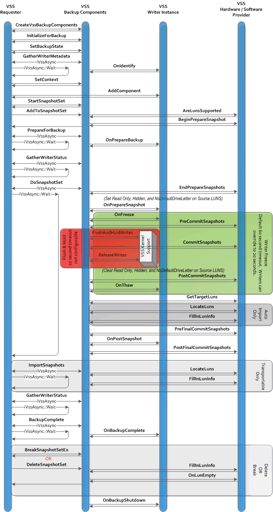
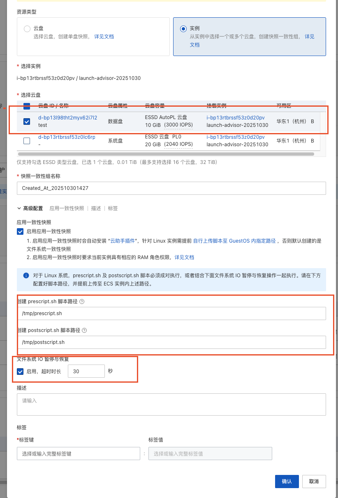
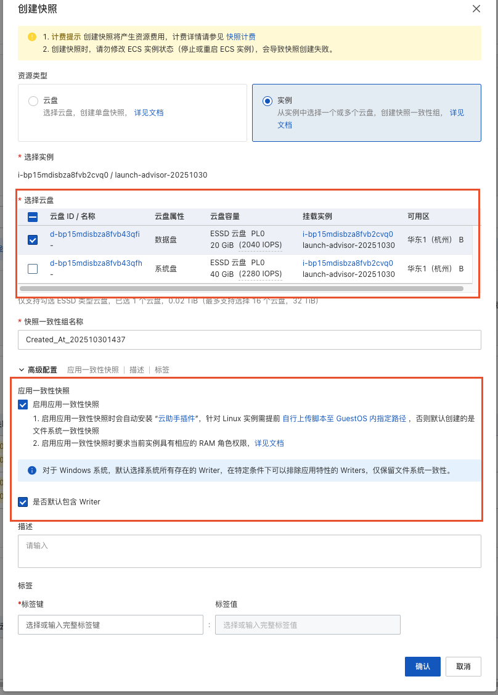

## overflow

一致性快照需要保证文件系统一致性/应用一致性。而文件系统一致性/应用一致性需要
guest侧做一些实现。下面是实现一致性快照的大致流程:


开源GQA 提供了用于冻结文件系统的接口。可以用在在线制作快照功能
中, 保证文件系统一致性/应用一致性。

本文章介绍首先介绍了开源qga的相关接口并讲述目前Linux，windows侧的实现。
并通过aliyun的界面配置，了解阿里可能做的一些额外的优化。

## 接口

* guest-fsfreeze-freeze: 
  + 作用:
    + Linux: 调用`/fsfreeze-hook`(启动qga的时候可以配置), 冻结 **所有盘** 的文件系统
    + windows: 调用相关writers, 冻结 **所有盘** 文件系统
  + 返回值: 冻结文件系统的个数
* guest-fsfreeze-freeze-list
  + 作用:
    + Linux: 和上面相同，只不过能冻结指定盘文件系统
    + windows: 同上
  + 参数: 
    + `{ '*mountpoints': ['str'] }`
    + e.g.: `{ "arguments": {"mountpoints": ["/mnt/disk1", "/mnt/disk2"]}}`
  + 返回值: 冻结的文件系统数量
* guest-fsfreeze-status:
  + 作用: 获取目前guest状态，是否冻结
  + 返回值: 冻结文件系统数量
* guest-fsfreeze-thaw:
  + 作用: 解冻文件系统
  + 返回值: 解冻文件系统数量

## 开源GQA实现

### Linux

Linux 流程非常简单
+ freeze
  * 调用`freeze_hook`回调程序，freeze 应用程序
  * 根据参数选择挂载点 对每个挂载点, 调用 `ioctl(FIFREEZE)`
+ thaw
  * 对 **所有** 挂载点, 调用 `ioctl(FIFREEZE)`
  * 调用`freeze_hook`, thaw 应用程序

我们来看下gqa具体代码

#### freeze
我们以`guest-fsfreeze-freeze`为例
```sh
qmp_guest_fsfreeze_freeze
## 执行hook回调
=> qmp_guest_fsfreeze_freeze_list
   => execute_fsfreeze_hook(FSFREEZE_HOOK_FREEZE, &local_err);
      => exec(freeze_hook_path, "freeze")

## 寻找所有mount 路径
=> build_fs_mount_list
   => read /proc/self/mountinfo

## 设置当前guest状态是fsfreeze 状态
=> ga_set_frozen(ga_state);

## 通过和参数列表对比，找出要freeze的mountpoints,如果是`guest-fsfreeze-freeze`
## 则冻结所有
=> qmp_guest_fsfreeze_do_freeze_list 
   => QTAILQ_FOREACH_REVERSE(mount, &mounts, next) {
      ## mountpoints 是参数
      => for (list = mountpoints; list; list = list->next) {
         => if (strcmp(list->value, mount->dirname) == 0) {
            ## 找到了就break
            => break
      ## 没有找到
      => if !list
         => continue
      ## 打开挂载点
      => fd = qga_open_cloexec(mount->dirname, O_RDONLY, 0);
      ## 执行ioctl(FIFREEZE) 冻结文件系统
      => ret = ioctl(fd, FIFREEZE);
      => if ret != -1
         ## 说明冻结文件系统成功
         => i++
      ## 返回冻结文件系统数量
      => return i
```
#### thaw
```sh
qmp_guest_fsfreeze_thaw
=> qmp_guest_fsfreeze_do_thaw
   ## 查找所有挂载点
   => build_fs_mount_list(&mounts, &local_err)
   ## 对每一个挂载点都做 FITHAW
   => QTAILQ_FOREACH(mount, &mounts, next) 
      => fd = qga_open_cloexec(mount->dirname, O_RDONLY, 0);
      => ret = ioctl(fd, FITHAW)
=> ga_unset_frozen
=> execute_fsfreeze_hook
   => execute_fsfreeze_hook(FSFREEZE_HOOK_THAW, errp);
      => exec(freeze_hook_path, "thaw")
```
***

另外`freeze hook`程序，可以通过 `-F` 参数指定

#### freeze hook 指定
命令行参数:
```
.. option:: -F, --fsfreeze-hook=PATH

  Enable fsfreeze hook. Accepts an optional argument that specifies
  script to run on freeze/thaw. Script will be called with
  'freeze'/'thaw' arguments accordingly (default is
  |CONFDIR|\ ``/fsfreeze-hook``). If using -F with an argument, do
  not follow -F with a space (for example:
  ``-F/var/run/fsfreezehook.sh``).
```
通过命令行参数, 可以指定`freeze-hook` 脚本路径，用于应用一致性实现,
代码流程:
```sh
config_load
=>  if (g_key_file_has_key(keyfile, "general", "fsfreeze-hook", NULL)) {
    => config->fsfreeze_hook =
            g_key_file_get_string(keyfile,
           "general", "fsfreeze-hook", &gerr);
```

### windows

windows 有一套vss的机制用来实现备份，windows中的备份工具会将盘备份到当前的存储
卷中, 而云场景下, windows和Linux 对guest内部备份工具的需求是一致的，只需要其完成
freeze app, freeze filesystem. 而不需要将数据备份到本地。备份工作需要offload到
云盘侧。所以windows 中的备份工具并不适合虚拟化的场景。QGA 通过直接调用VSS API,
实现一个特殊的provider, 在安装过程中注册到 `COM+` 中，并在 QMP发起相关命令,
`freeze`, `thaw`时和 provider进行交互。

我们先看下官方backup的流程图:



可以看到通过该API可以做到
* requester侧:
  + 获取系统中writers信息: `GatherWriterMetadata`
  + 可以设置本次快照的属性（可以不设置writers): `SetContext(VSS_VOLSNAP_ATTR_NO_WRITERS)`
  + 通过`AddToSnapshotSet`可以控制哪些盘做备份
  + 调用 `DoSnapshotSet`
    + freeze writers
    + freeze filesystem
    + `CommitSnapshots`, `PreCommitSnapshots`, `PostCommitShatshots` 通知provider
    + thaw filesystem
    + thaw writers
* provider 侧主要是实现各种回调，供`VSS Backup Components`使用.只介绍CommitSnapshots
  + CommitSnapshots: freeze filesystem后调用，用来触发provider 创建shadow copy

我们来看下，qga接口如何配合qga 实现的requester， provider来利用VSS实现文件系统freeze, thaw, 
以及调用各个writer的。


流程比较复杂，简单说明:
* gqa实现了一个agent，一个DLL, DLL提供windows vss 的requester 和provider的代码。
    并在安装时，将provider 注册到`COM+`中。（不是很懂这块，注册到`COM+`后，`VSS
    backup compontents`就能将requester下发的请求，传递到provider。(在主流程中调用
    provider的各个callback)

* 仍然是overflow图中的三个流程:
  + freeze

    在freeze时，host侧通过gqa通知guest侧，让其走一个完整的快照备份流程。该流程会
    默认使能所有的writers，并提交要备份的卷组, 而和前面不同的是，该流程并不等待
    `DoSnapshotSet`整个流程完成，而是等待一个文件系统冻结的事件(`FREEZE event`).

    而`FREEZE event`，由gqa 定制的 provider的 `CommitSnapshots`触发, 触发后，该
    函数会首先触发该事件，通知到requester侧，让其不再阻塞。随后provider侧等待
    `THAW`事件

    freeze流程等待到`FREEZE event`后，便继续执行。
  + 存储侧创建快照: 而控制面等待存储侧快照请求完成后，继续执行`thaw`流程。
  + thaw

    仍然是host侧通过gqa，发起`thaw`, 该流程会首先触发`THAW event`事件，让provider
    继续执行。而provider侧收到thaw事件后，则直接返回。

    gqa在发起`thaw`事件后，等待`DoSnapshotSet`异步执行完成.

### 代码分析

#### install

regsvr32 会调用
```sh
DllRegisterServer
##  registers a new shadow copy provider.
=> hr = pVssAdmin->RegisterProvider(g_gProviderId, CLSID_QGAVSSProvider,
                              const_cast<WCHAR*>(QGA_PROVIDER_LNAME),
                              VSS_PROV_SOFTWARE,
                              const_cast<WCHAR*>(QGA_PROVIDER_VERSION),
                              g_gProviderVersion);
```

注册`QGAVSSProvider`

#### init
```sh
main
=> config_parse
   => ga_install_vss_provider
      => vss_init
         ## load qga-vss.dll
         => provider_lib = LoadLibraryA(QGA_VSS_DLL);
         => call_vss_provider_func("requester_init");
            ## load vssapi.dll
            => LoadLibraryA("VSSAPI.DLL");
            ## 找到这个函数地址
            => pCreateVssBackupComponents = 
                  GetProcAddress(xxxx)
      ## 注册 COM+, 感觉是为了让vss sevice 调用
      => call_vss_provider_func("COMRegister")
         ## 在 COM+ 组件中查找是否已经加载了 VSS provider
         => chk(QGAProviderFind())
         => ICOMAdminCatalog2()
```

#### registers

出发点是qmp:
```sh
qmp_guest_fsfreeze_freeze
=> qmp_guest_fsfreeze_freeze_list(false, NULL, errp);
=> ga_set_frozen(ga_state);
=> qga_vss_fsfreeze(&i, true, mountpoints, &local_err);
   ## 这里选择 requester_freeze
   => const char *func_name = freeze ? "requester_freeze" : "requester_thaw";
   ## 从qga-vss.dll 中查找 requester_freeze function
   => func = (QGAVSSRequesterFunc)GetProcAddress(provider_lib, func_name);
   ## 执行该function
   => func(nr_volume, mountpoints, &errset);
```

#### requester_freeze
```sh
requester_freeze
## 首先创建三个event
=> vss_ctx.hEventFrozen = CreateEvent(&sa, TRUE, FALSE, EVENT_NAME_FROZEN);
=> vss_ctx.hEventThaw = CreateEvent(&sa, TRUE, FALSE, EVENT_NAME_THAW);
=> vss_ctx.hEventTimeout = CreateEvent(&sa, TRUE, FALSE, EVENT_NAME_TIMEOUT);
## 创建一个 IVssBackupComponents 接口对象
=> hr = pCreateVssBackupComponents(&vss_ctx.pVssbc);
=> hr = vss_ctx.pVssbc->InitializeForBackup();
=> hr = vss_ctx.pVssbc->SetBackupState(true, true, vss_bt, false);
=> hr = vss_ctx.pVssbc->SetContext(ctx);
=> hr = vss_ctx.pVssbc->GatherWriterMetadata(pAsync.replace());
   ## 等待上面的异步接口完成
   \-- WaitForAsync(pAsync);
=> vss_ctx.pVssbc->StartSnapshotSet(&guidSnapshotSet);
=> if (mountpoints)
   ## 为每个挂载点，执行AddToSnapshotSet()
   => for(list = mountpoints; list ;list=list->nexts)
      => vss_ctx.pVssbc->AddToSnapshotSet()
=> hr = vss_ctx.pVssbc->PrepareForBackup(pAsync.replace());
   \-- WaitForAsync(pAsync);

=> hr = vss_ctx.pVssbc->GatherWriterStatus(pAsync.replace());
   \-- WaitForAsync(pAsync);
## !! 执行DoSnapshotSet() 函数
## 该函数会
## * 通知各个writer frozen，
## * writer filesystem
## * 通知provider让其backup
## * thaw filesystem and writers
## 这里的provdier是 gqa自己写的
=> vss_ctx.pVssbc->DoSnapshotSet(&vss_ctx.pAsyncSnapshot);
   ## 最多等60s
   => for (i = 0; i < VSS_TIMEOUT_FREEZE_MSEC/VSS_TIMEOUT_EVENT_MSEC; i++) {
      ## 等待文件系统冻结
      => wait_status = WaitForSingleObject(vss_ctx.hEventFrozen,
                                  VSS_TIMEOUT_EVENT_MSEC);
=> if (wait_status == WAIT_TIMEOUT) {
       等待超时
       goto out1
   }
out1:
   ## 例如超时，在这里abort backup
   => vss_ctx.pVssbc->AbortBackup();
```

那么provider在干啥呢?

#### provider

```sh
CommitSnapshots
## 打开 requester 创建的三个event
=> hEventFrozen = OpenEvent(EVENT_ALL_ACCESS, FALSE, EVENT_NAME_FROZEN);
=> hEventThaw = OpenEvent(EVENT_ALL_ACCESS, FALSE, EVENT_NAME_THAW);
=> hEventTimeout = OpenEvent(EVENT_ALL_ACCESS, FALSE, EVENT_NAME_TIMEOUT);
## 执行到这里，肯定是将文件系统和writers都冻结了
=> SetEvent(hEventFrozen);
## 这里其实等待 thaw事件，但是有个超时 60s
=> if (WaitForSingleObject(hEventThaw, VSS_TIMEOUT_MSEC) != WAIT_OBJECT_0) {
       ## 如果超时，设置超时事件
       SetEvent(hEventTimeout);
   }
```

#### WHO initialize thaw

同样也是qga发起:
```sh
qmp_guest_fsfreeze_thaw
## 下面函数，上面展示过，这里会调用 gqa-vss.dll-> requester_thaw
=> qga_vss_fsfreeze(&i, false, NULL, errp);
=> requester_thaw
```
requester_thaw:
```sh
requester_thaw
## 首先会设置 hEventThaw, 通知provider, 目前快照已经准备完成
=> SetEvent(vss_ctx.hEventThaw);
## 等待 provider 流程走完
=> HRESULT hr = WaitForAsync(vss_ctx.pAsyncSnapshot);
=> 判断返回值
=> done
```


## aliyun 优化

### Linux 

主要是下图三个红框



* freeze filesystem? freeze all filesystem of this block

  aliyun在原有的功能上进行了一些需求扩展。我们来看gqa的三个接口，非常的死板，
  只有`guest-fsfreeze-freeze-list`接口提供了一个参数，用来配置各个分区路径!

  而对云盘的备份往往是整块盘。所以，aliyun首先针对这块做了定制。

  （windows不太清楚，我们主要来看下Linux)

  备份时云助手打印的日志:
  ```
  time="2025-10-27 13:47:31.787204086" level=info msg="Attached DiskId=d-2zej48nvay43y5ezy63u, Device=/dev/xvdb, Category=cloud_auto"
  time="2025-10-27 13:47:31.787216747" level=info msg="Attached DiskId=d-2zej48nvay43y5ezy63t, Device=/dev/xvda, Category=cloud_essd"
  ```

  可以看到, `aliyun`似乎能将备份的具体盘和guest中的盘符联系起来，然后找到这些盘符
  的挂载点。 **所以在gqa传参时，很可能传递的是块设备侧的信息.**

* timeout

  目前开源qga 没有设置timeout

* scripts path

  目前开源qga 应用回调脚本是固定路径，如果要调整，得在guest侧自己通过gqa调整，比
  较死板，aliyun可以在界面配置


### windows



* freeze filesystem ? freeze all filesystem of this block
* 可以设置是否包含默认writers.
  > NOTE
  >
  > 使用writers创建快照会比较慢一些情况下，客户可能不需要保证应用一致性。
  > 这时没有必要使能writers

  目前开源组件并没有参数可以设置writers。默认使能 writers.

## 需要和计算控制面讨论
* 定制 ？ 使用开源？
* 要不要对标阿里云

## 参考链接
1. [RegisterProvider](https://learn.microsoft.com/en-us/windows/win32/api/vsadmin/nf-vsadmin-ivssadmin-registerprovider)
2. [CreateVssBackupComponents](https://learn.microsoft.com/en-us/windows/win32/api/vsbackup/nf-vsbackup-createvssbackupcomponents)
3. [Overview of Processing a Backup Under VSS](https://learn.microsoft.com/en-us/windows/win32/vss/overview-of-processing-a-backup-under-vss)
