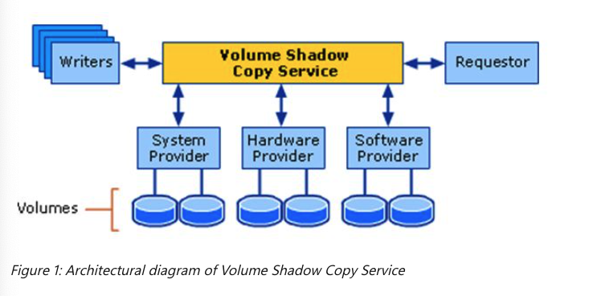
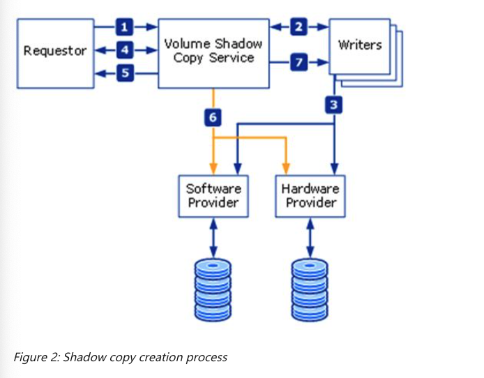
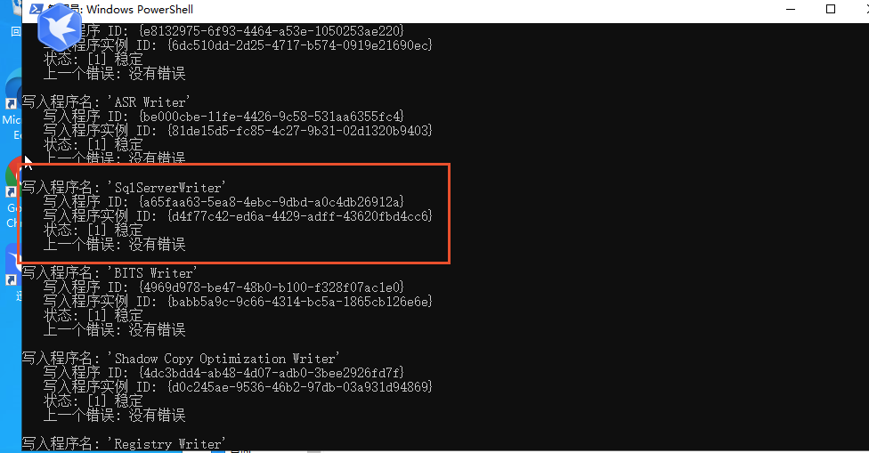
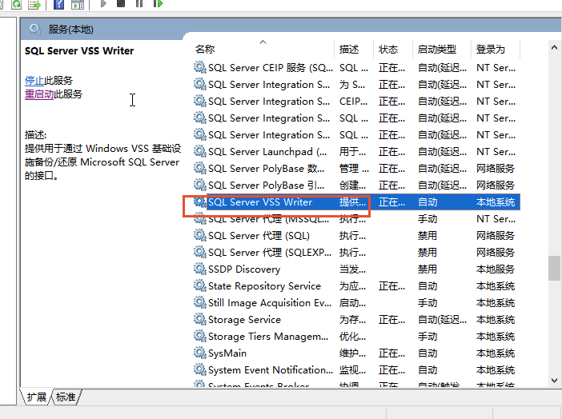
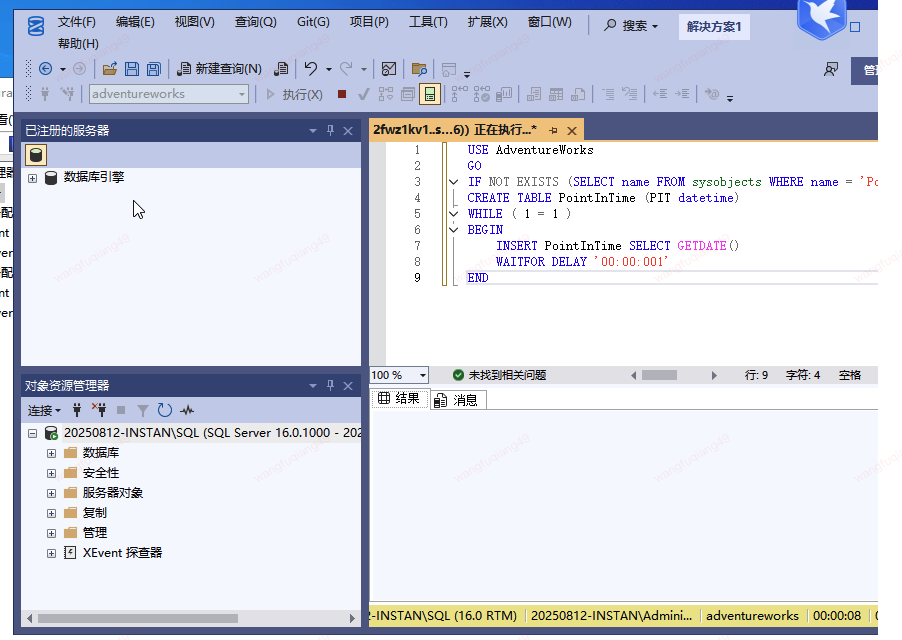
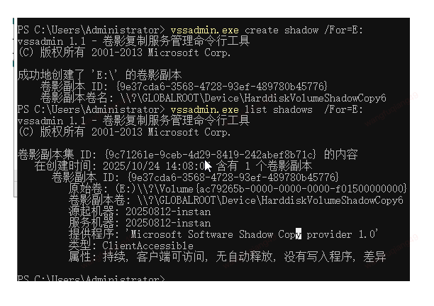
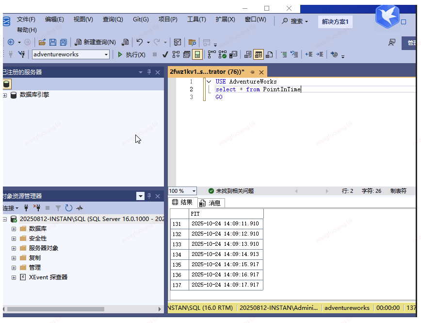
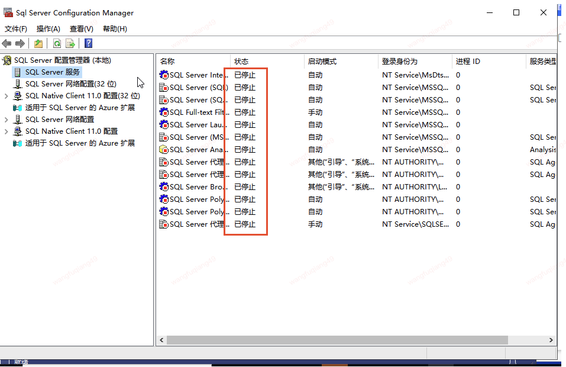
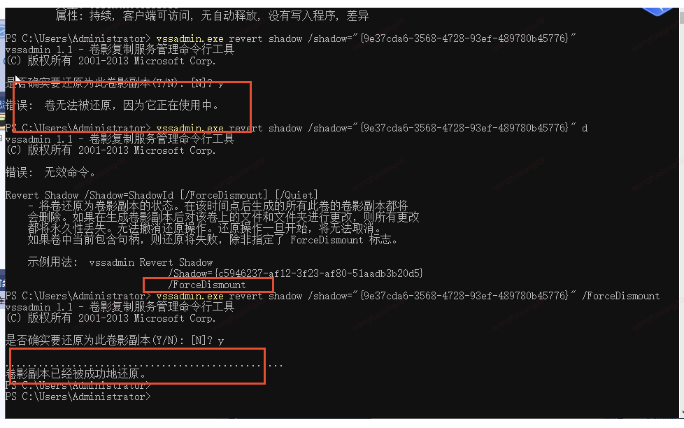
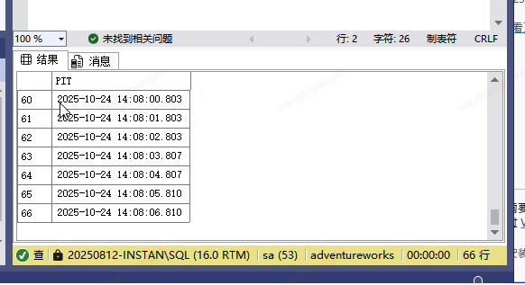

## windows VSS

`windows VSS` 可以在系统正在运行的情况下备份数据.

## How VSS works

需要四个组件配合工作:

* **VSS service**: Windows 操作系统的一部分，相当于主服务
* **VSS requester**: 请求者。类似于快照的发起者。可以是三方软件。也可以是
  WINDOWS 系统软件，例如定期备份工具
* **_VSS writer_**: 应用自己提供，用于保证应用一致性。
* **VSS provider**: 创建和维护shadow copies的组件。(大概就是创建和管理
  备份卷的)

service用来串联各个服务，最终使得整个的系统处于一个一致性状态时，
通知provider 创建shadow copy.

具体工作流程:

## How a shadow copy is create

1. requester 发起VSS 相关请求.
2. 每个 writer 会创建一个描述该服务所需备份的组件和数据存储的xml文件。
   提供给VSS，并提供一个恢复方法。然后在传给requestor, requestor从
   中选要备份的组件
3. VSS 通知所有writers 准备他们的数据以制作shadow copy
4. 每个 writer根据需要准备数据，例如完成所有正在运行的事务，刷新
   缓存等等，当准备好进行shadow copy, writer 会通知VSS
5. VSS 通知writer **暂停IO请求**。然后 **VSS会刷新文件系统缓冲区**
   (pagecache), freezes file system(写IO)
6. 通知provider 创建shadow copy, 此时仍然冻结文件系统(写IO)
7. VSS 释放文件系统写入请求
8. VSS 通知 writers解冻应用程序 写入io请求（上面是文件系统层面，
   下面是 application 层面). 

## How provider work

上面提到, VSS service 用于串联各个组件完成一致性状态，将服务停止，
将IO停止，并将后续的备份工作交给provider，待provider完成后，恢复。

我们来看下provider如何工作:

* **Complete copy**: 对原始卷完整复制
* **copy-on-write**: 写实复制. 不会复制原始卷，当时如果之后有数据修改。
  则将该数据copy到 备份卷中，然后修改原始卷
* **Redirect-on-write**: 不会复制原始卷。和上面不同，当之后如果有
  数据修改, 则将该请求重定向到不同的卷，来创建差异副本，这样不会动
  原来的卷

## windows 管理 VSS工具

有两套:
* vssadmin3
* diskshadow4

我们先来简单测试 `vssadmin`

## vssadmin 命令介绍
* **vssadmin create shadow /for=C:**

  为C盘创建shadows（可以简单理解为快照, 但是挂载中的系统盘
  无法恢复, 可以将C盘挂载到其他地方恢复)
* **vssadmin list shadows** [/For=X:]
* vssadmin delete shadows /shadow={shadow_id}
* vssadmin list writers
* vssadmin list providers

* **vssadmin revert shadow /shadow="{shadow uuid}" [/forceDismount]**

  用来恢复某个卷
  >>>>>>>> 注意: 一定要将 shadow uuid, 用 `"{ }"` 包裹

## vssadmin + sql server 简单测试

搭建sql server过程见5

搭建好后，我们用`vssadmin list writers`观察是否有sql server writers:

并且有writers服务:

我们用aliyun示例1中的例子，向表中插入
数据:

在插入过程中我们创建shadow(时间为14:08:07)

重启，我们查询查询表中数据:

最后一条io是`14:09:17`

> 注意重启后，sql server得等一段时间后才能启动，中间时间数据库不能链接 
>
> 

我们用下面的命令恢复卷:

恢复卷时，注意要使用`forceDismount`参数。

恢复后重启，查询:

可以发现，时间为创建快照时间.

## 其他测试

将插入间隔由1s修改为0.1s, 也可以正常恢复。

**另外，如果将sql writer 服务停止，也能正常恢复, 这样通过
阿里云的示例不太确定VSS sql server writer是否在正常工作，
需要和aliyun的实现对下**

但是无论如何，文件系统一致性，VSS按照现在的测试是可以实现的。

具体流程不再截图。

## TODO

* 调研diskshadow

## 参考链接
1. [aliyun 一致性快照组](https://help.aliyun.com/zh/ecs/user-guide/snapshot-consistency-group-overview/?spm=5176.21213303.J_ZGek9Blx07Hclc3Ddt9dg.1.35d02f3dzVnCWQ&scm=20140722.S_help@@%E6%96%87%E6%A1%A3@@2841384._.ID_help@@%E6%96%87%E6%A1%A3@@2841384-RL_%E4%B8%80%E8%87%B4%E6%80%A7%E5%BF%AB%E7%85%A7-LOC_2024SPAllResult-OR_ser-PAR1_2150427a17604116337564634ef571-V_4-PAR3_o-RE_new5-P0_0-P1_0)
2. [Volume Shadow Copy Service (VSS)](https://learn.microsoft.com/en-us/windows-server/storage/file-server/volume-shadow-copy-service)
3. [vssadmin](https://learn.microsoft.com/en-us/windows-server/administration/windows-commands/vssadmin)
4. [Diskshadow](https://learn.microsoft.com/en-us/windows-server/administration/windows-commands/diskshadow)
5. [【必成功】最新版 SQL Server 下载安装详细教程](https://www.bilibili.com/video/BV1Si421U7PR/)

