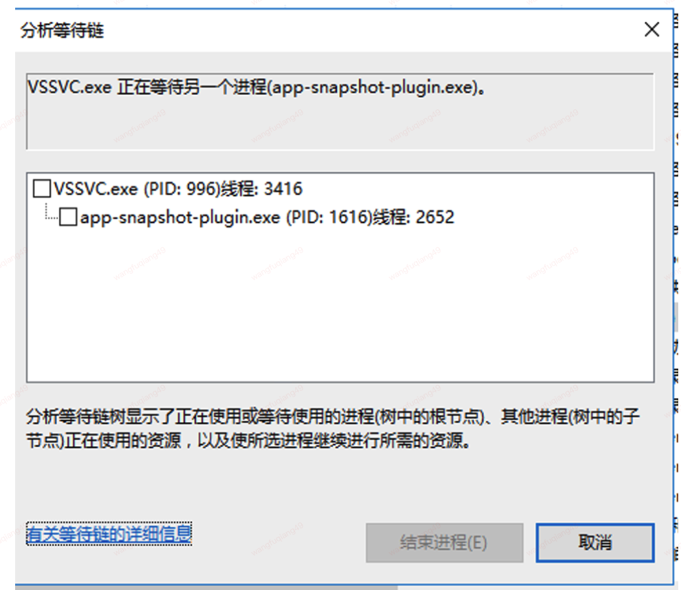
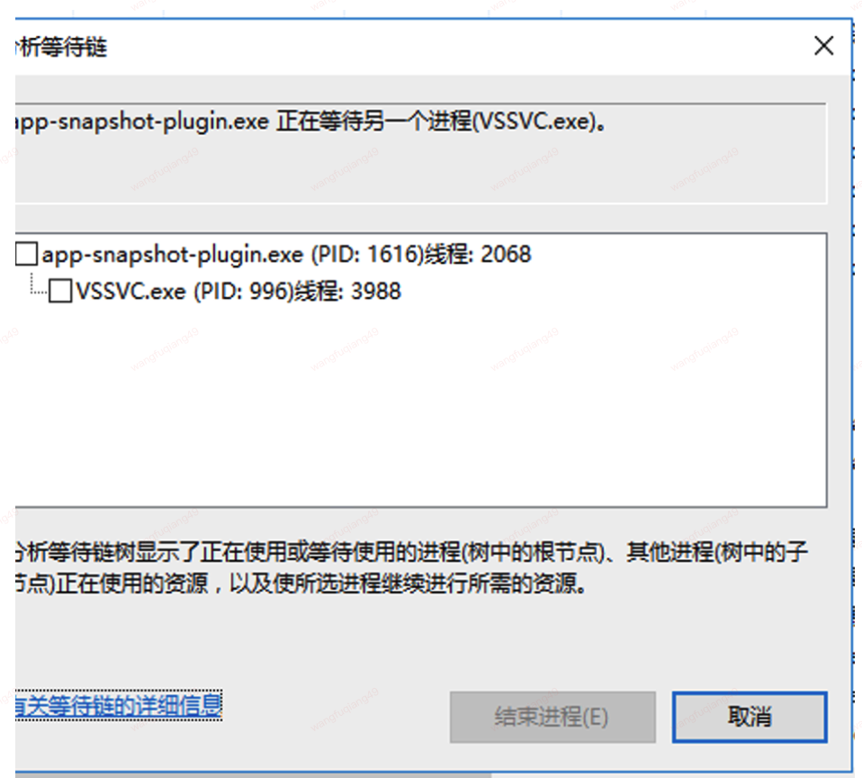
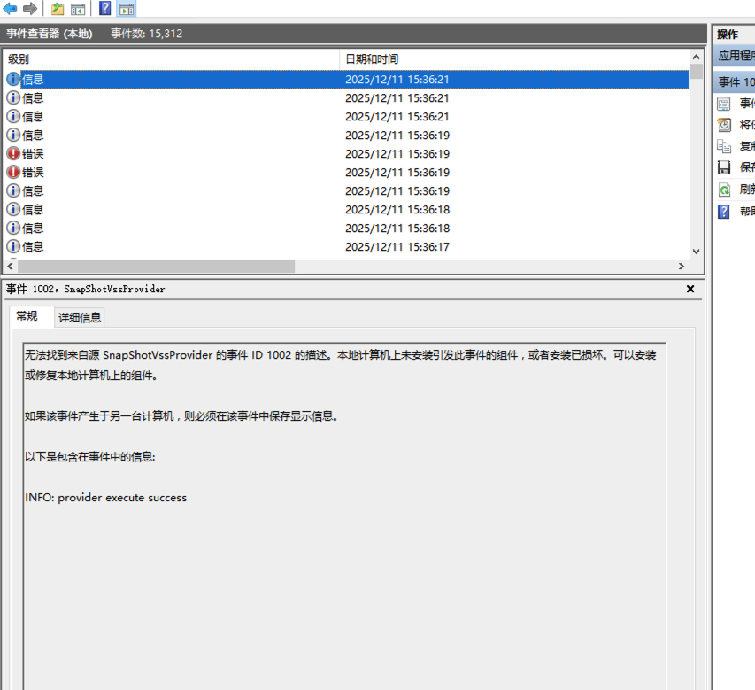
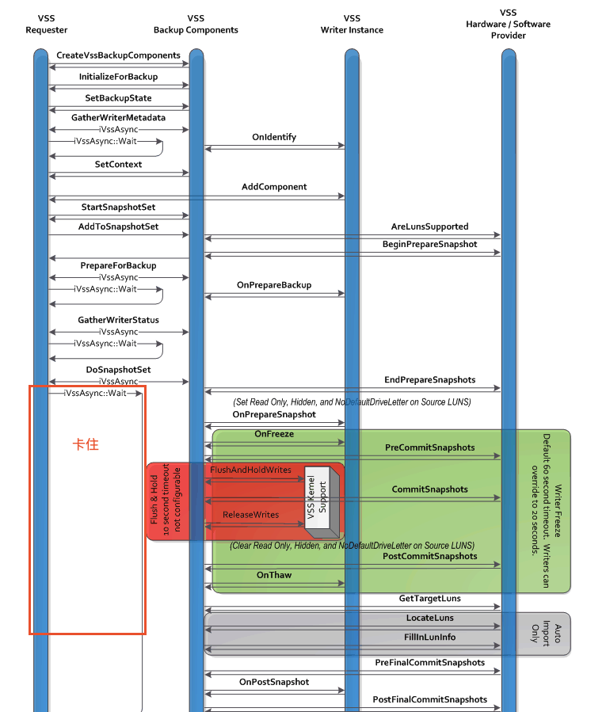

## 问题现象


执行解冻流程，会卡在`WaitForAsync(vss_ctx.pAsyncSnapshot)`
```
[2025-12-11 11:35:48] requester_thaw:begin
[2025-12-11 11:35:48] requester_thaw: set event thaw..
[2025-12-11 11:35:48] requester_thaw: waitting for asymc pAsymcSnapshot...
[2025-12-11 11:35:48] WaitForAsymc: begin
```


从windows任务管理器查看，似乎这两个应用死锁了:





## 问题分析

怀疑是`provider` 卡住了, 在provider中增加windows 事件日志:
```diff
 STDMETHODIMP CQGAVssProvider::CommitSnapshots(VSS_ID SnapshotSetId)
 {
     HRESULT hr = S_OK;
@@ -376,17 +405,25 @@ STDMETHODIMP CQGAVssProvider::CommitSnapshots(VSS_ID SnapshotSetId)
     }

     /* Send event to qemu-ga to notify filesystem is frozen */
+    WriteEventLog("SnapShotVssProvider", "INFO: set event frozen...",
+            EVENTLOG_INFORMATION_TYPE, 1002);
     SetEvent(hEventFrozen);

     /* Wait until the snapshot is taken by the host. */
+    WriteEventLog("SnapShotVssProvider", "INFO: set event frozen success, wait thaw event.",
+            EVENTLOG_INFORMATION_TYPE, 1002);
     if (WaitForSingleObject(hEventThaw, VSS_TIMEOUT_MSEC) != WAIT_OBJECT_0) {
         /* Send event to qemu-ga to notify the provider is timed out */
         SetEvent(hEventTimeout);
+        WriteEventLog("SnapShotVssProvider", "WARN: wait thaw event timeout",
+                EVENTLOG_WARNING_TYPE, 1002);
     }

     CloseHandle(hEventThaw);
     CloseHandle(hEventFrozen);
     CloseHandle(hEventTimeout);
+    WriteEventLog("SnapShotVssProvider", "INFO: provider execute success",
+        EVENTLOG_INFORMATION_TYPE, 1002);
     return hr;
 }
```

调试发现provider没有卡住:



通过windows 官方提供的图:



在requester调用`DoSnapshotSet()`后, 调用`iVssAsync::wait()`等待就可以了，无需做
其他事情。

而provider 则保证各个回调不阻塞。

而qemu vss provider 其他回调都是空，例如:
```cpp
STDMETHODIMP CQGAVssProvider::PostCommitSnapshots(
    VSS_ID SnapshotSetId, LONG lSnapshotsCount)
{
    return S_OK;
}
```
所以，应该是`VSS backup Components`组件和 接口有BUG。（个人猜测）

## 解决方法

参考windows api 官方链接<sup>1</sup>, `wait()`接口有一个timeout参数，
事件单位是`ms`, 改写代码:
```diff
@@ -156,10 +157,17 @@ static HRESULT WaitForAsync(IVssAsync *pAsync)
 {
     qga_debug_begin;

+    LARGE_INTEGER freq, start, end;
+    double wait_elapse_time_s = 15;
+    QueryPerformanceFrequency(&freq);
+    QueryPerformanceCounter(&start);
+
     HRESULT ret, hr;

     do {
-        hr = pAsync->Wait();
+        qga_debug("async->waitting...");
+        hr = pAsync->Wait(1 * 1000);
+        qga_debug("async->waitted.");
         if (FAILED(hr)) {
             ret = hr;
             break;
@@ -169,6 +177,19 @@ static HRESULT WaitForAsync(IVssAsync *pAsync)
             ret = hr;
             break;
         }
+        QueryPerformanceCounter(&end);
+
+        double elapsed = (end.QuadPart - start.QuadPart) * 1.0
+                / freq.QuadPart;
+
+        if (elapsed > wait_elapse_time_s) {
+            qga_debug("wait time > %lu, " \
+                    "may be windows BUG, so break wait",
+                    (unsigned long)wait_elapse_time_s);
+            ret = MY_ERR_WAIT_TIMEOUT;
+            break;
+        }
+
     } while (ret == VSS_S_ASYNC_PENDING);

```

增加15s超时。

结果发现，这个地方卡不住了，但是在
```cpp
vss_ctx.pVssbc->AbortBackup();
```

可以卡住。

所以越过该流程:
```diff
@@ -667,10 +695,18 @@ void requester_thaw(int *num_vols, void *mountpints, ErrorSet *_errset)
     }

     if (err_is_set(errset)) {
-        vss_ctx.pVssbc->AbortBackup();
+        if (errset->ret == MY_ERR_WAIT_TIMEOUT) {
+            qga_debug("wait async timeout, may be need abortbackup\n"
+                    "but it will still block , so skip");
+        } else {
+            qga_debug("abortbackup ...");
+            vss_ctx.pVssbc->AbortBackup();
+            qga_debug("abortbackuped");
+        }
+    } else {
+        *num_vols = vss_ctx.cFrozenVols;
+        qga_debug("success fozen %d vol", *num_vols);
     }
-    *num_vols = vss_ctx.cFrozenVols;
-    qga_debug("success fozen %d vol", *num_vols);
```


## 自测

经过上千次测试，问题不再复现

## 参考链接
1. [IVssAsync::Wait method (vss.h)](https://learn.microsoft.com/en-us/windows/win32/api/vss/nf-vss-ivssasync-wait)
