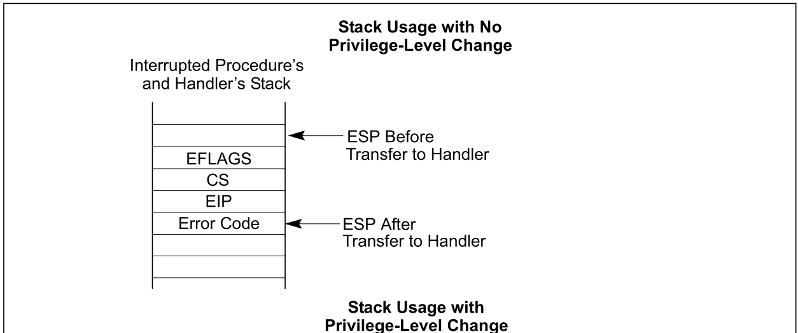
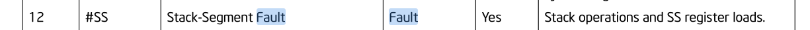
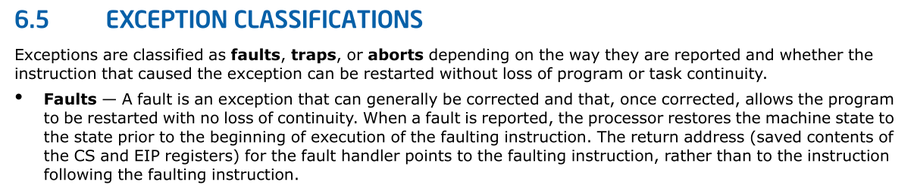

# 上传的vmcore
目前上传的`vmcore`有
* 127.0.0.1-2022-02-23-14_54_07
* 127.0.0.1-2022-05-29-03_02_39
* 127.0.0.1-2022-06-03-02_37_46
* 127.0.0.1-2022-06-05-11_04_06

以 `127.0.0.1-2022-06-05-11_04_06`为例:

# 127.0.0.1-2022-06-05-11_04_06

堆栈如下:
```
crash> bt
PID: 11941  TASK: ffff8f0bca5717c0  CPU: 10  COMMAND: "esdm-agent"
 #0 [ffffabfa4b0eb9d0] machine_kexec at ffffffff8405879e
 #1 [ffffabfa4b0eba28] __crash_kexec at ffffffff84155e1d
 #2 [ffffabfa4b0ebaf0] crash_kexec at ffffffff84156d1d
 #3 [ffffabfa4b0ebb08] oops_end at ffffffff84020e8d
 #4 [ffffabfa4b0ebb28] do_trap at ffffffff8401d6ec
 #5 [ffffabfa4b0ebb70] do_stack_segment at ffffffff8401e071
 #6 [ffffabfa4b0ebb80] stack_segment at ffffffff84a0108e
 #7 [ffffabfa4b0ebc08] __kmalloc at ffffffff84287f8b
 #8 [ffffabfa4b0ebc70] usb_hcd_submit_urb at ffffffff845c5e52
 #9 [ffffabfa4b0ebd38] proc_do_submiturb at ffffffff845d3a9f
#10 [ffffabfa4b0ebdc8] usbdev_do_ioctl at ffffffff845d54ad
#11 [ffffabfa4b0ebe78] usbdev_ioctl at ffffffff845d591a
#12 [ffffabfa4b0ebe80] do_vfs_ioctl at ffffffff842cdd74
#13 [ffffabfa4b0ebef8] ksys_ioctl at ffffffff842ce360
#14 [ffffabfa4b0ebf30] __x64_sys_ioctl at ffffffff842ce3a6
#15 [ffffabfa4b0ebf38] do_syscall_64 at ffffffff840041cb
#16 [ffffabfa4b0ebf50] entry_SYSCALL_64_after_hwframe at ffffffff84a000ad
    RIP: 00007f0e33cdb2f7  RSP: 00007ffc0db68cc8  RFLAGS: 00000246
    RAX: ffffffffffffffda  RBX: 00000000010e1720  RCX: 00007f0e33cdb2f7
    RDX: 00000000010e1720  RSI: 000000008038550a  RDI: 000000000000000c
    RBP: 0000000000a56c20   R8: 0000000000000002   R9: 0000000000000038
    R10: 0000000000000004  R11: 0000000000000246  R12: 0000000000a56cd0
    R13: 0000000001142920  R14: 0000000001ecab40  R15: 0000000000000000
    ORIG_RAX: 0000000000000010  CS: 0033  SS: 002b
```

##  堆栈分析
可以看到由__kmalloc 直接调用到了`stack_segment`，而
`stack_segment` 在 `def_idts`表中定义:

```cpp
static const __initconst struct idt_data def_idts[] = {
	...
    INTG(X86_TRAP_SS,       stack_segment),
	...
```
可以看到，定义的是一个中断门，其中处理SS Fault，所以这里实际上
发生了一个异常，由于是同一特权级发生异常，不会发生堆栈切换，
如intel sdm 中图示所示:


异常发生前后，在同一特权级，会在堆栈中保存Error Code, EIP,
CS和EFLAGS，硬件保存的寄存器很少，就看软件有没有保存什么信息了。

### 查看__kmalloc 栈后面的栈内容
```
crash> bt -f
 #5 [ffffabfa4b0ebb70] do_stack_segment at ffffffff8401e071
    ffffabfa4b0ebb78: 0000000000000000 ffffffff84a0108e
 #6 [ffffabfa4b0ebb80] stack_segment at ffffffff84a0108e
    ffffabfa4b0ebb88: ffff8ef487c0e9c0 ffff8ef487c0e9c0
    ffffabfa4b0ebb98: 00000000000000fe 00000000006080c0
    ffffabfa4b0ebba8: 0072006900560338 00000000006080c0
    ffffabfa4b0ebbb8: 00000000000000fe 0000000000000001
    ffffabfa4b0ebbc8: 0000000000000001 ffff8f03dfb28120
    ffffabfa4b0ebbd8: 0000000000000000 0000000000032a9b
    ffffabfa4b0ebbe8: 0000000000032a9a 00000000006080c0
    ffffabfa4b0ebbf8: 0000000000028120 ffffffffffffffff
    ffffabfa4b0ebc08: ffffffff84287f8b
 #7 [ffffabfa4b0ebc08] __kmalloc at ffffffff84287f8b
    ffffabfa4b0ebc10: 0000000000000010 0000000000010202
    ffffabfa4b0ebc20: ffffabfa4b0ebc38 0000000000000018
    ffffabfa4b0ebc30: ffffffff84288063 ffffffff845c5e52
    ffffabfa4b0ebc40: ffff8f03dee11380 ffff8efc0658e000
    ffffabfa4b0ebc50: ffffffff85cabf80 00000000fffffff4
    ffffabfa4b0ebc60: 0000000000000000 0000000000000000
    ffffabfa4b0ebc70: ffffffff845c5e52
```
可以看到stack_segment 栈中有大量信息。x86 不像arm64可以比较
准确的通过汇编代码判断该function拥有的堆栈大小，主要和其
支持的orc-unwinder有关。

那么我们反汇编下 `stack_segment`函数看下：

### dis  stack_segment
```
crash> dis stack_segment
0xffffffff84a01070 <stack_segment>:     clac
0xffffffff84a01073 <stack_segment+3>:   callq  0xffffffff84a01310 <error_entry>
0xffffffff84a01078 <stack_segment+8>:   mov    %rsp,%rdi
0xffffffff84a0107b <stack_segment+11>:  mov    0x78(%rsp),%rsi
0xffffffff84a01080 <stack_segment+16>:  movq   $0xffffffffffffffff,0x78(%rsp)
0xffffffff84a01089 <stack_segment+25>:  callq  0xffffffff8401e050 <do_stack_segment>
0xffffffff84a0108e <stack_segment+30>:  jmpq   0xffffffff84a01470 <error_exit>
0xffffffff84a01093 <stack_segment+35>:  nopl   (%rax)
0xffffffff84a01096 <stack_segment+38>:  nopw   %cs:0x0(%rax,%rax,1)
```

可以看到在调用`do_stack_segment` 之前，该函数并不会对堆栈进行操作。
那么对堆栈的相关操作可能是`stack_segment`之后，`do_stack_segment`之前，
进行过push操作。
这里我们先看下相关代码:

* 定义`stack_segment`
```cpp
idtentry stack_segment      do_stack_segment    has_error_code=1
```

* 定义`do_stack_segment`
```cpp
DO_ERROR(X86_TRAP_SS,     SIGBUS,           0, NULL, "stack segment",       stack_segment)
#define DO_ERROR(trapnr, signr, sicode, addr, str, name)           \
dotraplinkage void do_##name(struct pt_regs *regs, long error_code)    \
{                                      \
    do_error_trap(regs, error_code, str, trapnr, signr, sicode, addr); \
}
```
* idtentry 相关代码
```cpp
.macro idtentry sym do_sym has_error_code:req paranoid=0 shift_ist=-1   
ENTRY(\sym)
	...
	movq    %rsp, %rdi	/*(1)*/

	.if \has_error_code                                        
	movq    ORIG_RAX(%rsp), %rsi        /* get error code */   
	movq    $-1, ORIG_RAX(%rsp)     /* no syscall to restart */
	.else                                                      
	xorl    %esi, %esi          /* no error code */            
	.endif                                                     

	.if \shift_ist != -1                                       
	subq    $EXCEPTION_STKSZ, CPU_TSS_IST(\shift_ist)          
	.endif                                                     

	call    \do_sym
	...
```

可以看到在调用`do_stack_segment`的第一个参数是pt_regs,
而(1)处代码表明当前rsp寄存器是pt_regs,所以说明，在这个点
之前，软件曾在堆栈保存过pt_regs，大概图示如下

```
+---------------------------+
|do_stack_segment           |
+---------------------------+
|pt_regs->r15               |
|...                        |
|pt_regs->di                |
|    上面是软件存储的       |
|    下面是硬件存储的       |
|pt_regs->ERROR_CODE(origax)|
|pt_regs->ip                |
|pt_regs->CS                |
|pt_regs->EFLAGS            |
+---------------------------+
|__kmalloc                  |
+---------------------------+
```

pt_regs是在哪存储的呢，其实是在`stack_segment`->`error_entry`
->`PUSH_AND_CLEAR_REGS`中存储的。这里不再展开。

我们在回到触发异常的栈`__kmalloc`,反汇编代码如下:

```cpp
/usr/src/debug/kernel-4.18.0-147.5.1.el8_1/linux-4.18.0-147.5.1.el8_1.5es.14.x86_64/mm/slub.c: 283
0xffffffff84287f80 <__kmalloc+160>:     mov    0x20(%r15),%eax
0xffffffff84287f84 <__kmalloc+164>:     mov    (%r15),%rdi
0xffffffff84287f87 <__kmalloc+167>:     lea    0x1(%rdx),%rcx
0xffffffff84287f8b <__kmalloc+171>:     mov    0x0(%rbp,%rax,1),%rbx
```
可以看到是slub.c的283 行，相关代码如下:

```cpp
static inline void *get_freepointer_safe(struct kmem_cache *s, void *object)
{
    unsigned long freepointer_addr;
    void *p;

    if (!debug_pagealloc_enabled())
        return get_freepointer(s, object);		--->283

    freepointer_addr = (unsigned long)object + s->offset;
    probe_kernel_read(&p, (void **)freepointer_addr, sizeof(p));
    return freelist_ptr(s, p, freepointer_addr);
}
static inline void *get_freepointer(struct kmem_cache *s, void *object)
{
    return freelist_dereference(s, object + s->offset);
}
static inline void *freelist_dereference(const struct kmem_cache *s,
                    ¦void *ptr_addr)
{
    return freelist_ptr(s, (void *)*(unsigned long *)(ptr_addr),
            ¦   (unsigned long)ptr_addr);
}
static inline void *freelist_ptr(const struct kmem_cache *s, void *ptr,
                ¦unsigned long ptr_addr)
{
#ifdef CONFIG_SLAB_FREELIST_HARDENED
    return (void *)((unsigned long)ptr ^ s->random ^ ptr_addr);
#else
    return ptr;
#endif
}
```
这里异常的指令是实际上是: `ffffabfa4b0ebc08`存储的地址

```
 #7 [ffffabfa4b0ebc08] __kmalloc at ffffffff84287f8b
0xffffffff84287f8b <__kmalloc+171>:     mov    0x0(%rbp,%rax,1),%rbx
```
请看手册中描述:



可以看到stack-segment fault是一个fault类型，并且处理fault类型的异常时，
硬件保存的CS和EIP寄存器，绘制想faulting instruction, 而不是faulting instruction
的下面的指令。

由于`CONFIG_SLAB_FREELIST_HARDENED`编译选项没有打开，该函数
实际运行的返回值为: `object+s->offset`
对应的汇编代码为:`0x0(%rbp,%rax,1),%rbx`
其中`eax`相关值在
```
//%eax
0xffffffff84287f80 <__kmalloc+160>:     mov    0x20(%r15),%eax
//%r15
0xffffffff84287f4d <__kmalloc+109>:     mov    %r14,%r15
//%r14
0xffffffff84287f06 <__kmalloc+38>:      callq  0xffffffff8423fe30 <kmalloc_slab>
0xffffffff84287f0b <__kmalloc+43>:      mov    %rax,%r14
```


这里`__kmalloc+43`处的`rax`实际上是`kmalloc_slab`的返回值, 那么`r15`实际上
为是参数s(struct kmem_cache *)。

而`rbp`实际上是:
```
//%rbp
0xffffffff84287f6e <__kmalloc+142>:     mov    (%r8),%rbp
//%r8

```
这里的r8 实际上是`struct kmem_cache_cpu`（可以结合dis -l 和代码看下，
不再分析)

我们来看下这两个寄存器:
再回到`stack_segment`相关栈:
```
 #6 [ffffabfa4b0ebb80] stack_segment at ffffffff84a0108e
    ffffabfa4b0ebb88: ffff8ef487c0e9c0[r15] ffff8ef487c0e9c0
    ffffabfa4b0ebb98: 00000000000000fe 00000000006080c0
    ffffabfa4b0ebba8: 0072006900560338[rbp] 00000000006080c0
    ffffabfa4b0ebbb8: 00000000000000fe 0000000000000001
    ffffabfa4b0ebbc8: 0000000000000001 ffff8f03dfb28120[r8]
    ffffabfa4b0ebbd8: 0000000000000000[ax] 0000000000032a9b[cx]
    ffffabfa4b0ebbe8: 0000000000032a9a[dx] 00000000006080c0[si]
    ffffabfa4b0ebbf8: 0000000000028120[di] ffffffffffffffff[Error Code]
    ffffabfa4b0ebc08: ffffffff84287f8b[ip]
```

首先看下`s->offset`, 实际上是rax， 但是也可以通过`kmem_cache`结构体看下
```
crash> struct kmem_cache ffff8ef487c0e9c0
struct kmem_cache {
  cpu_slab = 0x28120,
  flags = 1073741824,
  min_partial = 5,
  size = 256,
  object_size = 256,
  offset = 0,
```

可以看到值为0，
那么再看下object的值,实际上是`rbp`, 也可以通过`kmem_cache_cpu`看下:

```
crash> struct kmem_cache_cpu ffff8f03dfb28120
struct kmem_cache_cpu {
  freelist = 0x72006900560338,
  tid = 207514,
  page = 0xffffde4601109480,
  partial = 0xffffde45df972100
}
```
可以看到，c->freelist有错误的值，和秦焜之前分析的
https://easystack.atlassian.net/browse/ECS-5106
值一样。
像字符串
`0x72006900560338 8.V.i.r.`

# 其他vmcore
其他vmcore的`struct kmem_cache_cpu->freelist`值都是
`0x72006900560338`
