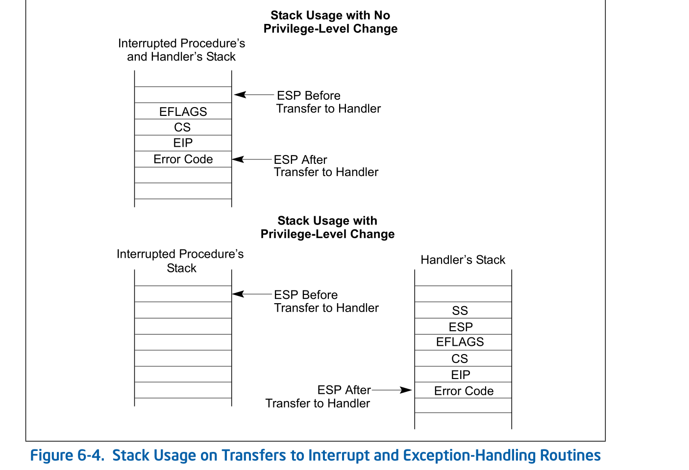
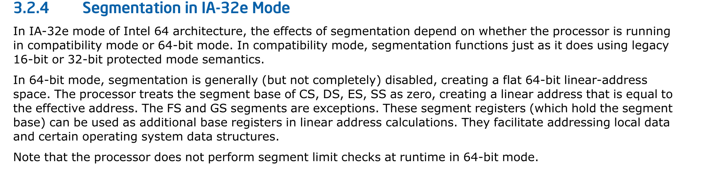
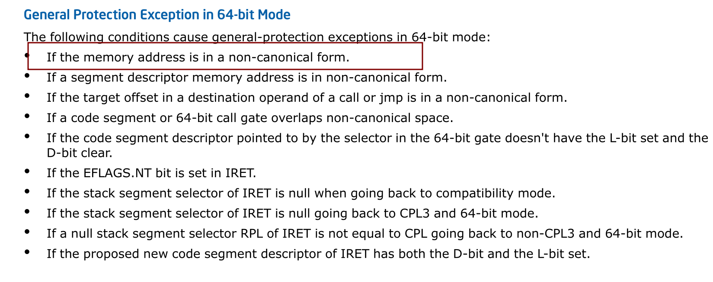
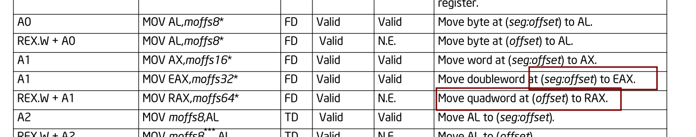
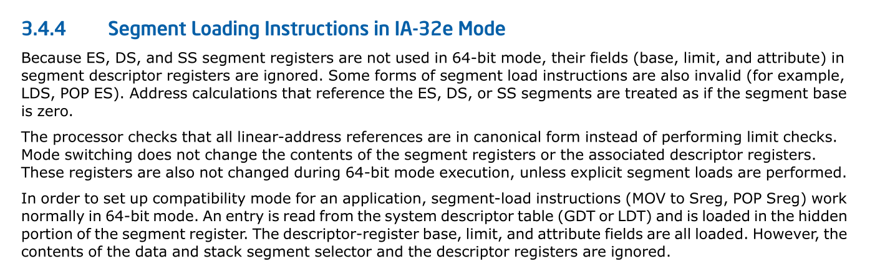
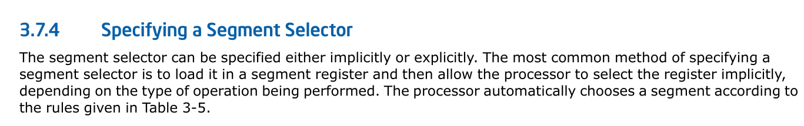
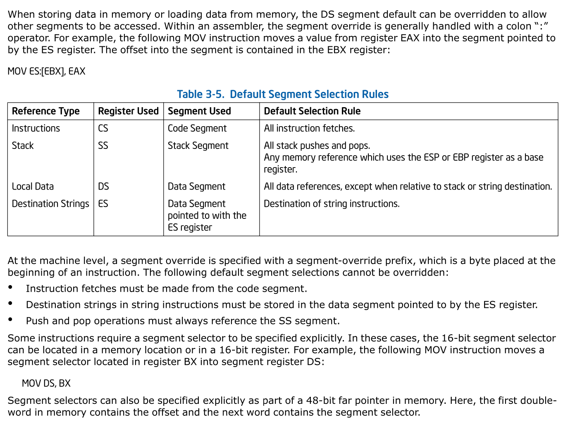

# #SS堆栈

## 问题现象
根据之前查看的vmcore相关信息来看，出现了类似于下面的堆栈:
```
 #6 [ffffa269e37dbc40] stack_segment at ffffffffb8e0108e
    ffffa269e37dbc48: ffff8cd3c7c0e9c0 ffff8cd3c7c0e9c0
    ffffa269e37dbc58: 0000000000000100 0000000000600640
    ffffa269e37dbc68: 0072006900560318[rbp] 0000000000600640
    ffffa269e37dbc78: 0000000000000000 0000000000000000
    ffffa269e37dbc88: ffffffffc06e7e6c
    ffffa269e37dbc90: ffff8cf31eaa8120 0000000000000000
    ffffa269e37dbca0: 000000000846f51e 000000000846f51d
    ffffa269e37dbcb0: 0000000000600640 0000000000028120
    ffffa269e37dbcc0: ffffffffffffffff ffffffffb8687f8b[ip]
    ffffa269e37dbcd0: 0000000000000010[CS] 0000000000010206[RFLAGS]
    ffffa269e37dbce0: ffffa269e37dbcf8[sp] 0000000000000018[ss]

    ffffa269e37dbcf0: ffffffffb8688063 
    ffffa269e37dbcf8: ffffffffc07258b3
 # 7 [ffffa269e37dbcf0] __kmalloc at ffffffffb8687f8b
    ffffa269e37dbd00: 0000000000000000 0000000000600640
    ffffa269e37dbd10: 0000000000000008 0000000000000100
    ffffa269e37dbd20: 0000000000000000 0000000000000100
    ffffa269e37dbd30: ffffffffc07258b3
 #8 [ffffa269e37dbd30] kmem_alloc at ffffffffc07258b3 [xfs]
    ffffa269e37dbd38: 0000000000000005 ffff8cede68c5430
    ffffa269e37dbd48: 0000000000000100 ffff8ce31e383c00
    ffffa269e37dbd58: ffffffffc0725968
```

根据intel 手册来看:


当没有发生特权级别的切换时，压栈，只会压入`EFLAGS, CS, EIP, Error Code`,
而从上面的堆栈，可以发现，还压入了, `SS,SP`。其中除了`SS,SP`，还多了两个
堆栈`ffffa269e37dbcf0,ffffa269e37dbcf8`。

## 查看intel sdm 
在`intel sdm 6.14 EXCEPTION AND INTERRUPT HANDLING IN 64-BIT MODE`中有讲述, 
以下是该章节内容
>
> In 64-bit mode, interrupt and exception handling is similar
> to what has been described for non-64-bit modes. The following 
> are the exceptions:
> 1. All interrupt handlers pointed by the IDT are in 64-bit 
> code (this does not apply to the SMI handler).
> 2. The new SS is set to NULL if there is a change in CPL.
> 3. The size of interrupt-stack pushes is fixed at 64 bits; 
> and the processor uses 8-byte, zero extended stores.
> 4. The stack pointer (SS:RSP) is pushed unconditionally on 
> interrupts. In legacy modes, this push is conditional
> and based on a change in current privilege level (CPL).
> 5. IRET behavior changes.
> 6. There is a new interrupt stack-switch mechanism and a new
> interrupt shadow stack-switch mechanism.
> 7. The alignment of interrupt stack frame is different.

我们主要看两条: 
* 第4条提到，在64-bit模式中，CPU会无条件的压入stack pointer (SS:RSP)
无论其是否发生异常级别切换
* 第7条提到, 会有一个不一样的 interrupt stack frame 的对齐机制

并且该对齐机制，在`intel sdm 6.14.2 64-bit Mode Stack Frame`中有讲到,
以下是该章节部分内容:
> In legacy mode, the stack pointer may be at any alignment 
> when an interrupt or exception causes a stack frame to
> be pushed. This causes the stack frame and succeeding pushes 
> done by an interrupt handler to be at arbitrary alignments.
> In IA-32e mode, the RSP is aligned to a 16-byte  boundary 
> before pushing the stack frame. The stack frame itself is 
> aligned on a 16-byte boundary when the interrupt handler is 
> called. The processor can arbitrarily realign the new RSP on
> interrupts because the previous (possibly unaligned) RSP is 
> unconditionally saved on the newly aligned stack. The previous
> RSP will be automatically restored by a subsequent IRET.

该段的大意为:
在legacy mode中， 当发生intr/exp 时导致需要push到一个stack frame，
该stack pointer 没有任何对齐要求。所以当，执行到interrupt handler时，
SP可能是任意的对齐。

但是在IA-32e mode中，RSP 在 push stack frame 之前，需要以16-byte
对齐。这样当interrupt handler被调用时，也是以16-byte对齐的。对齐后，
要push sp, 这时sp是对齐前的rsp，当执行IRET时，先前的RSP也会被automatically
restored。

## 结合crash 堆栈进行分析
在分析堆栈之前说下push的原理
### push
在intel sdm push指令伪代码中截取片段如下:
```
IF StackAddrSize = 64
	THEN
	IF OperandSize = 64
	THEN
		RSP := RSP – 8;
		Memory[SS:RSP] := SRC;
		(* push quadword *)
	ELSE IF OperandSize = 32
	THEN
		RSP := RSP – 4;
		Memory[SS:RSP] := SRC;
		(* push dword *)
	ELSE (* OperandSize = 16 *)
		RSP := RSP – 2;
		Memory[SS:RSP] := SRC;
		(* push word *)
	FI;
ELSE IF StackAddrSize = 32
```
可以看到，是先将RSP - 8， 然后在将操作数
压进去

### crash堆栈
```
    ffffa269e37dbcd0: 0000000000000010[CS] 0000000000010206[RFLAGS]
    ffffa269e37dbce0: ffffa269e37dbcf8[sp] 0000000000000018[ss]

    ffffa269e37dbcf0: ffffffffb8688063 
    ffffa269e37dbcf8: ffffffffc07258b3
 # 7 [ffffa269e37dbcf0] __kmalloc at ffffffffb8687f8b

```
可以看到这里的sp为`ffffa269e37dbcf8`, `__kmalloc`所占的栈，不是6 * 8 byte
而是7 * 8 byte, 而这里`ffffa269e37dbcf8`, 并不是对齐的，所以需要对齐，
对齐后的RSP为`ffffa269e37dbcf0`, 然后依次压入`ss,sp,rflags,cs,ip`等
寄存器的值。

我们回过头来看下`__kmalloc`的反汇编: 
```
crash> dis -l __kmalloc
/usr/src/debug/kernel-4.18.0-147.5.1.el8_1/linux-4.18.0-147.5.1.el8_1.5es.14.x86_64/mm/slub.c: 3726
0xffffffffb8687ee0 <__kmalloc>: nopl   0x0(%rax,%rax,1) [FTRACE NOP]
/usr/src/debug/kernel-4.18.0-147.5.1.el8_1/linux-4.18.0-147.5.1.el8_1.5es.14.x86_64/mm/slub.c: 3730
0xffffffffb8687ee5 <__kmalloc+5>:       push   %r15
0xffffffffb8687ee7 <__kmalloc+7>:       push   %r14
0xffffffffb8687ee9 <__kmalloc+9>:       push   %r13
0xffffffffb8687eeb <__kmalloc+11>:      push   %r12
0xffffffffb8687eed <__kmalloc+13>:      push   %rbp
0xffffffffb8687eee <__kmalloc+14>:      push   %rbx
0xffffffffb8687eef <__kmalloc+15>:      sub    $0x8,%rsp

...
/usr/src/debug/kernel-4.18.0-147.5.1.el8_1/linux-4.18.0-147.5.1.el8_1.5es.14.x86_64/arch/x86/include/asm/jump_label.h: 44
0xffffffffb8687fc7 <__kmalloc+231>:     add    $0x8,%rsp
0xffffffffb8687fcb <__kmalloc+235>:     mov    %rbp,%rax
0xffffffffb8687fce <__kmalloc+238>:     pop    %rbx
0xffffffffb8687fcf <__kmalloc+239>:     pop    %rbp
0xffffffffb8687fd0 <__kmalloc+240>:     pop    %r12
0xffffffffb8687fd2 <__kmalloc+242>:     pop    %r13
0xffffffffb8687fd4 <__kmalloc+244>:     pop    %r14
0xffffffffb8687fd6 <__kmalloc+246>:     pop    %r15
0xffffffffb8687fd8 <__kmalloc+248>:     retq
```
虽然只是push了6次，但是随后执行了一次`sub $0x8, %rsp`指令，并在ret之前，
执行了`add $0x8,%rsp`指令，所以在发生异常的时候，RSP的值应该为
`0xffffa269e37dbcf8`。

相关的堆栈操作在kvm早期引入post interrupt 的代码中出现过。
### kvm 代码中引入 post interrupt
在引入post interrupt 之前，需要打开`acknowledge interrupt on exit`功能，
这里具体原因，就不详细介绍了，可以看下之前分享的关于vapic 的相关文档。

当cpu处于VMX non-root operation 中，接收到了来自于lapic 的外部中断，
当满足下面条件是:
* VM-exit control `acknowledge interrupt on exit`字段为1
* VM-execution control `process posted interrupt` 字段为1
* 到达的外部中断vector != posted-interrupt notification vector
* VM-execution control `external-interrupt exiting `字段为1

cpu会acknowledge 该外部中断，并且将响应的中断信息，保存到`VM-exit intteruption
information` 字段中(intel sdm `27.2.2 Information for VM Exits Due to Vectored
Events`中有讲），然后触发vm-exit, 在该过程中中断请求已经被ack了，
即便在在VM-exit后，VM-root operation下, interrupt-windows打开(开中断), 
也不会出现通过IDT去delivery该vector的动作，所以需要软件层面去模拟构建中断的现场,
其中，就涉及了堆栈对齐的操作。

我们来看下相关代码:
引入的patch:
```cpp
a547c6db4d2f16ba5ce8e7054bffad6acc248d40
KVM: VMX: Enable acknowledge interupt on vmexit

+static void vmx_handle_external_intr(struct kvm_vcpu *vcpu)
+{
+       u32 exit_intr_info = vmcs_read32(VM_EXIT_INTR_INFO);
+
+       /*
+        * If external interrupt exists, IF bit is set in rflags/eflags on the
+        * interrupt stack frame, and interrupt will be enabled on a return * from interrupt handler.
+        */
+       if ((exit_intr_info & (INTR_INFO_VALID_MASK | INTR_INFO_INTR_TYPE_MASK))
+                       == (INTR_INFO_VALID_MASK | INTR_TYPE_EXT_INTR)) {
+               unsigned int vector;
+               unsigned long entry;
+               gate_desc *desc;
+               struct vcpu_vmx *vmx = to_vmx(vcpu);
+#ifdef CONFIG_X86_64
+               unsigned long tmp;
+#endif
+
+               vector =  exit_intr_info & INTR_INFO_VECTOR_MASK;
+               desc = (gate_desc *)vmx->host_idt_base + vector;
+               entry = gate_offset(*desc);
+               asm volatile(
+#ifdef CONFIG_X86_64
+                       "mov %%" _ASM_SP ", %[sp]\n\t"
+                       "and $0xfffffffffffffff0, %%" _ASM_SP "\n\t"
+                       "push $%c[ss]\n\t"
+                       "push %[sp]\n\t"
+#endif
+                       "pushf\n\t"
+                       "orl $0x200, (%%" _ASM_SP ")\n\t"
+                       __ASM_SIZE(push) " $%c[cs]\n\t"
+                       "call *%[entry]\n\t"
+                       :
+#ifdef CONFIG_X86_64
+                       [sp]"=&r"(tmp)
+#endif
+                       :
+                       [entry]"r"(entry),
+                       [ss]"i"(__KERNEL_DS),
+                       [cs]"i"(__KERNEL_CS)
+                       );
+       } else
+               local_irq_enable();
+}
```
可以看到，该函数的流程是，现在 `vm-exit interruption information`字段中，
找到了vector, 然后再根据vector，从host_idt中找到响应的descriptor, 然后
再从该描述符中找到该interrupt handler(entry)。


我们分析下内嵌汇编代码(稍微分析下，详细分析请见对该patch的分析文档):

> mov %%" _ASM_SP ", %[sp]\n\t
>> 这里_ASM_SP指的是rsp寄存器，%[sp]指的是tmp，
>> 实际上是将rsp的值，放到tmp中
>
> "and $0xfffffffffffffff0, %%" _ASM_SP "\n\t" 
>> 这里实际上是对**RSP** 寄存器进行`and $0xfffffffffffffff0`的操作，
>> 目的就是16-byte对齐。
> 
> push $%c[ss]
>> 这里实际上是pushq $__KERNEL_DS， 这里%c没有搞懂
>
> push %[sp]
>> 这里是push tmp的值，该值并没有对齐，所以push的是可能没有对齐的原来
>> 的RSP的值

上面的代码均在`#ifdef CONFIG_X86_64`下，所以`CONFIG_X86_32`是不会执行该代码。
下面是32,64位都会执行的代码。
> pushf
>> push rflags
>
> orl $0x200, (%%" _ASM_SP ")
>> orl $0x200, rsp, 这里为什么进行或操作，不了解，后来patc
>> f2485b3e0c6c0aa3a9546babc2fad3739e964ebb 将其删除
>
> pushq $[cs]
>> pushq __KERNEL_CS
>
> call *%[entry]
>> 这里call操作，其实也有个push 的动作, 执行完该指令后，
>> 便进入了相应的interrupt handler

# #SS && #PF
造成异常的指令是：
```
mov    0x0(%rbp,%rax,1),%rbx
```
其中
```
rbp: 0072006900560318
rax: 0
```
所以访问的地址为0x72006900560318, 该地址是一个没有建立映射的
地址，但是为什么产生的是 `#SS`，而不是`#PF`

我们来看下 关于 #SS的说明:
> Indicates that one of the following stack related conditions
> was detected:
> * A limit violation is detected during an operation that 
> refers to the SS register. Operations that can cause a limit
> violation include stack-oriented instructions such as POP, 
> PUSH, CALL, RET, IRET, ENTER, and LEAVE, as well as other 
> memory references which implicitly or explicitly use the SS 
> register (for example, MOV AX, [BP+6] or MOV AX, SS:[EAX+6]).
> The ENTER instruction generates this exception when there is
> not enough stack space for allocating local variables.
> * A not-present stack segment is detected when attempting to
> load the SS register. This violation can occurduring the 
> execution of a task switch, a CALL instruction to a different
> privilege level, a return to a different privilege level, 
> an LSS instruction, or a MOV or POP instruction to the SS 
> register.
> * A canonical violation is detected in 64-bit mode during an
> operation that reference memory using the stack pointer register
> containing a non-canonical memory address.

大概有三种情况:
* limit violation
* a not-present stack segment
* using the stack pointer register containing a non-canonical memory address

## limit violation
我们先说下第一个: 在intel sdm `3.2.4  segmentation in IA-32e Mode`有讲解，
截图说明：


大致意思为，在64-bit mode, segmenatation的功能大部分（而不是全部）被disable，
创造出一个 64-bit 线性地址空间，CS,DS,ES,SS的segment base为0。

而在最后一段，则说明在64-bit mode 中不再进行`segment limit check`

## SS segment desc is not-present
从vmcore来看，SS为0x18, 该值一直没有变过，而gdt是在系统启动早期，设置的。
SS寄存器会在某些情况下load(见intel sdm 3.4.3 segment register, 不再详述),
load的内容为selector 指向的segment desc, 我们通过qemu来看下SS寄存器的值。
```
SS =0018 0000000000000000 ffffffff 00c09300 DPL=0 DS   [-WA]
```
present位为15位, 为1, 所以也不是该原因。

## a non-canonical memory address
关于canonical memory address的定义在`4.1.1 Four Paging Modes`章节中有讲:
```
64-bit mode. While this sub-mode produces 64-bit linear addresses,
the processor enforces canonicality, meaning that the upper bits
of such an address are identical: bits 63:47 for 4-level paging
and bits 63:56 for 5-level paging. 4-level paging (respectively,
5-level paging) does not use bits 63:48 (respectively, bits 63:57)
of such addresses.
```
我们只关注4level paging
<table>
	<tr>
		<th>Paging Mode</th>
		<th>PG in CR0</th>
		<th>PAE in CR4</th>
		<th>LME in IA32_EFER</th>
		<th>LA57 in CR4</th>
		<th>Lin-Addr.Width</th>
		<th>Phys.-Addr.Width</th>
		<th>Page Sizes</th>
		<th>Supports Execute-Disable?</th>
		<th>PCIDs and protection keys?</th>
	</tr>
	<tr>
		<td>4-level</td>
		<td>1</td>
		<td>1</td>
		<td>1</td>
		<td>0</td>
		<td>48</td>
		<td>up to 52</td>
		<td>4KB,2MB,1GB</td>
		<td>Yes</td>
		<td>Yes</td>
	</tr>
</table>
从上面文字部分可知，在64-bit mode中，63~47位，需要保持一致，并且在4level-paging
寻址中，不会使用到`63:48`bit。

我们来做下测试:
|访问的地址|触发#SS or #PF|
|---|---|
|0x0000100000000000|PF|
|0x0000400000000000|PF|
|0x0000700000000000|PF|
|0x00007FFFFF000000|PF|
|0x00007FFFFFFFF000|PF|
|0x00007FFFFFFFFF00|PF|
|0x00007FFFFFFFFFF0|PF|
|0x00007FFFFFFFFFF7|PF|
|0x00007FFFFFFFFFF8|PF|
|------------------|--|
|0x00007FFFFFFFFFF9|SS|
|0x00007FFFFFFFFFFa|SS|
|0x00007FFFFFFFFFFc|SS|
|0x00007FFFFFFFFFFe|SS|
|0x00007FFFFFFFFFFF|SS|
|0x0000800000000000|SS|
|0x0000FFFFFFFFFFFF|SS|
|0x0001000000000000|SS|
|0x0010000000000000|SS|
|0xFFFF7FFFFFFFFFFF|SS|
|------------------|--|
|0xFFFF800000000000|PF|
|0xFFFFFFFFFFFFFFFF|PF|

我们可以看到, 这里其实有三个区域:

访问[0x0, 0x00007FFFFFFFFFF8], [0xFFFF800000000000,0xFFFFFFFFFFFFFFFF],
如果没有建立映射的话，则触发#PF

访问[0x00007FFFFFFFFFF9, 0xFFFF7FFFFFFFFFFF] 则会触发#SS

之前的章节提到过，4-level paging mode, 会[63,47]位需要保持一致，
比如说`0x0000800000000000`, 47位为1, [63,48]为0，就不可以

那`0x00007FFFFFFFFFF9`地址,[63,47]全都为0，为什么不可以呢，在64-bitmode中，
一般对堆栈的操作都是8-byte的，所以对该地址操作，会覆盖到`0x0000800000000000`
non-canonical memory address。


> NOTE:
>
> 那我们思考下，既然是在4-level paging mode中，lin-addr.width为47， 
> 为什么不让[63,48]保持一致呢?
> 原因在于，可能出现地址编码于实际地址存在多对多的情况:
>
> 例如: 0xffff 0000 0000 0000和0x0代表的是同一地址:0
>
> 而在[63,47]保持一致的情况下实际地址为0,只能是地址编码0x0
>
> （以上为个人推测)

# 其他case
关于 case ECS-5645 中遇到了#GP异常。也是因为access 
non-canonical memory address，触发异常的指令为:
```
0xffffffffb868794a <kmem_cache_alloc_trace+138>:        mov    (%r15,%rax,1),%rbx
R15: 0072006900560338 RAX: 0000000000000000
```
其中R15为`0072006900560338`,RAX为0, 所以访问的地址为0x72006900560318,
地址宽度为8-byte

## #GP
而在intel sdm `6.15 EXCEPTION AND INTERRUPT REFERENCE` 关于GP的章节中，有提到:



如果memory address 是non-canonical form 则会出发#GP 异常。而之前提到的#SS异常。
这里主要是mov指令寻址的寄存器不同:
```
mov    (%r15,%rax,1),%rbx    #GP
mov    0x0(%rbp,%rax,1),%rbx #SS
```
这里，如果使用rbp寄存器，会触发#SS异常，而使用%r15则会触发#GP异常

## MOV
我们来看下内存宽度为32位和64位的mov指令：


可见, quadword 宽度的内存访问，只需要一个offset，而不需要segment了，所以按道理来说，64bit-mode已经不需要段寄存器了，

在intel sdm中有描述:

## segment load in IA32 mode

大致意思为，ES,DS,SS寄存器在64-bit模式下，不再使用，处理器只对所有的线性地址做canonical form的
检查。并且即使这些段寄存器load为其他的limit, base也会被忽略。但是这里面没有提，如果发生了canonical
form检查错误，会触发什么类型的异常。

这里猜测，64位操作数和16位操作参数类似，虽然只是指定了offset但是还是有一个隐式的seg作为选择子，
虽然这个不起作用，但是发生异常的时候，会根据选择子类型触发异常。

## sepecify a segment selector
在intel sdm `3.7.4 Specifying a Segment Selector`讲解了该内容



从上面可知，如果有两种情况默认使用SS register:
* 所有的push和pop指令 
* 使用ESP和EBP作为base register 寻址

