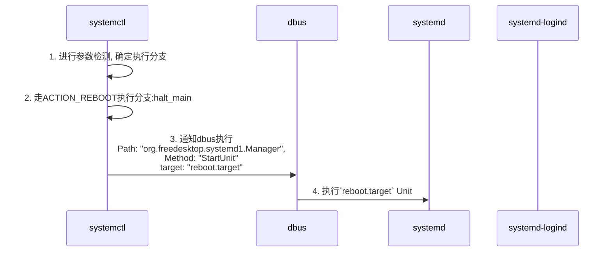
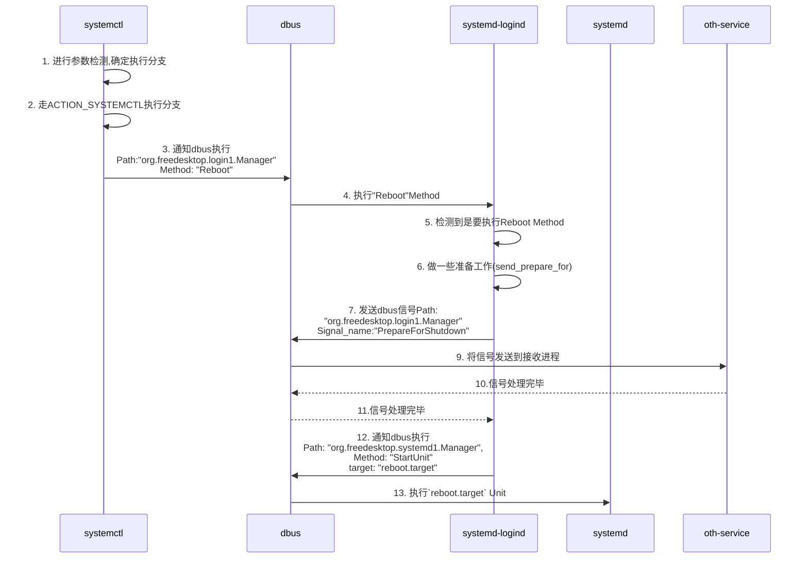

# 问题现象
执行`reboot`命令,理论上`systemd-logind`会发出
```
["/org/freedesktop/login1", 
"org.freedesktop.login1.Manager",
"PrepareForShutdown"]
```
dbus signal, 但是在测试过程中,发现未触发该流程

# 问题原因
`reboot`命令在系统中为`systemctl`软连接
```
$ ls -l /usr/sbin/reboot
lrwxrwxrwx 1 root root 14 3月   7 10:47 /usr/sbin/reboot -> /bin/systemctl ``` `reboot`命令执行过程如下:
```

但是执行`reboot` 命令和`systemctl reboot`命令走的流程不一样,
执行后者就可以通知`systemd-logind`发出该信号

## 执行`reboot`命令



所以从上图可以看出执行reboot命令并没有通知到`systemd-logind`

## 执行`systemctl reboot`命令


可见该流程通知了`systemd-logind`, `logind`执行了`Reboot Method`相关的处理流程,
该处理流程首先要发送`PrepareForShutdown`信号通知其他接受信号方,让他们作处理,
待处理完成`systemd-logind`再通知systemd执行`StartUnit reboot.target`

# 疑问点
按道理说,reboot是`systemctl`的软连接,两者应该有相同的行为,但是不知道为什么
`systemctl`会走两套代码流程,目前在man文档和一些其他的资料中没有找到相关
解释

# 解决方法(规避)
可以将reboot由`systemctl`的软连接替换成执行`systemctl reboot`命令的脚本
