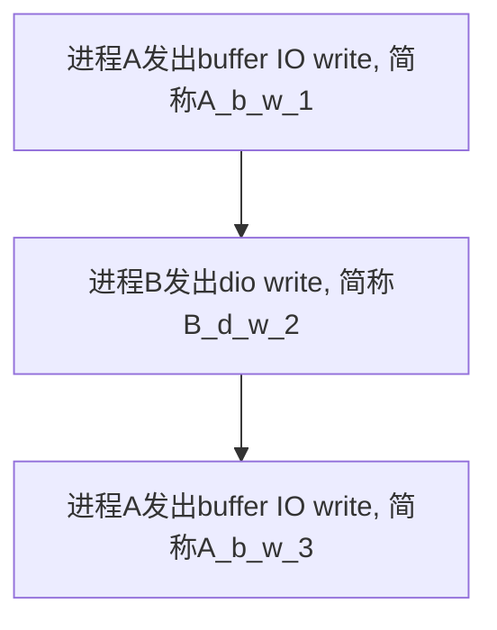

# direct aio 主要代码路径
> NOTE: 这里只分析devtmpfs文件系统
```
aio_write
	call_write_iter
		file->f_op->write_iter (blkdev_write_iter)
			__generic_file_write_iter
				generic_file_direct_write
					
```
# 细节分析

## aio 和 sync io 底层代码通用代码怎么区分

通过 `is_sync_kiocb()`接口判断, 代码为:

```C
static inline bool is_sync_kiocb(struct kiocb *kiocb)
{
    return kiocb->ki_complete == NULL;
}
```

如果是异步I/O流程，`kiocb->ki_complete`会在aio_prep_rw()中赋值

```C
static int aio_prep_rw(struct kiocb *req, struct iocb *iocb)
{
	int ret;
	
	req->ki_filp = fget(iocb->aio_fildes);
	if (unlikely(!req->ki_filp))
	    return -EBADF;
	req->ki_complete = aio_complete_rw;
	req->ki_pos = iocb->aio_offset;
	req->ki_flags = iocb_flags(req->ki_filp);

	...
}
```

direct IO的标记位也是在该流程中标记
```
//aio_write->aio_prep_rw->iocb_flags
static inline int iocb_flags(struct file *file)
{
    int res = 0;
    if (file->f_flags & O_APPEND)
        res |= IOCB_APPEND;
	//在该位置标记
    if (io_is_direct(file))
        res |= IOCB_DIRECT;
    if ((file->f_flags & O_DSYNC) || IS_SYNC(file->f_mapping->host))
        res |= IOCB_DSYNC;
    if (file->f_flags & __O_SYNC)
        res |= IOCB_SYNC;
    return res;
}

static inline bool io_is_direct(struct file *filp)
{
    return (filp->f_flags & O_DIRECT) || IS_DAX(filp->f_mapping->host);
}
```

## kernel怎么处理direct IO和buffer IO同步关系
下面是个人理解:
这个得从需求端出发，也就是得从用户态的角度去看，怎么处理合理，
理想情况是能让用户顺序的处理写请求，也就是说，对于两个进程
同时进行写请求，kernel无法处理先后顺序，谁都有可能后写入，把
前者覆盖，但是对于顺序写入，例如, 先后对一个block 写入A, B, C
(无论哪个进程写的），需要保证的是block中的数据最终为C

对于direct IO和Buffer IO也是这样, 举个例子, 这里有两个进程A, B,
先后发出一些direct IO， 和Buffer IO, 顺序如下:



在上面的场景下, 假设在触发 A_b_w_1 构建 page cache, 但是
page cache还没有落盘, 触发了B_d_w_2时, 那么这个时候, 
B_d_w_2如果不去操作page cache, 直接落盘的话, 那么sync page cache
时, 会A_b_w_1会覆盖掉B_d_w_2, 但是由于B_d_w_2 为直接IO, 为了
减少数据copy, 所以不会覆盖pagecache,那么最好的方法是,在B_d_w_2之前
sync page cache. 

在执行完, B_d_w_2后, 如果执行A_b_w_3, 这时候,page cache 是clean, 
但是没有写入B_d_w_2的内容, 所以page cache中还是A_b_w_1 的内容,
这时,方法可以有两个, 一个是无效pagecache, 另一个是将数据更新到pagecache,
而direct IO是为了避免数据copy, 所以说无效pagecache是比较好的选择.

从上面的流程可以看出, 在direct IO 中也是需要对page cache进行操作,
这里可能会去处理page cache sync的操作, 但是需要做到尽量避免进行数据copy.


# 结合代码进行分析direct aio流程
上面代码路径走到了`generic_file_direct_write`
查看该代码
```cpp
ssize_t __generic_file_write_iter(struct kiocb *iocb, struct iov_iter *from)
{
    struct file *file = iocb->ki_filp;
    struct address_space * mapping = file->f_mapping;
    struct inode    *inode = mapping->host;
    ssize_t     written = 0;
    ssize_t     err;
    ssize_t     status;

    /* We can write back this queue in page reclaim */
    current->backing_dev_info = inode_to_bdi(inode);
    err = file_remove_privs(file);
    if (err)
        goto out;

    err = file_update_time(file);
    if (err)
        goto out;

    if (iocb->ki_flags & IOCB_DIRECT) {
        loff_t pos, endbyte;

        written = generic_file_direct_write(iocb, from);
        /*
        ¦* If the write stopped short of completing, fall back to
        ¦* buffered writes.  Some filesystems do this for writes to
        ¦* holes, for example.  For DAX files, a buffered write will
        ¦* not succeed (even if it did, DAX does not handle dirty
        ¦* page-cache pages correctly).
        ¦*/
        //=============================(1)==============
        if (written < 0 || !iov_iter_count(from) || IS_DAX(inode))
            goto out;

        status = generic_perform_write(file, from, pos = iocb->ki_pos);
        /*
        ¦* If generic_perform_write() returned a synchronous error
        ¦* then we want to return the number of bytes which were
        ¦* direct-written, or the error code if that was zero.  Note
        ¦* that this differs from normal direct-io semantics, which
        ¦* will return -EFOO even if some bytes were written.
        ¦*/
        if (unlikely(status < 0)) {
            err = status;
            goto out;
        }
        /*
        ¦* We need to ensure that the page cache pages are written to
        ¦* disk and invalidated to preserve the expected O_DIRECT
        ¦* semantics.
        ¦*/
        endbyte = pos + status - 1;
        //==============================(2)=======================
        err = filemap_write_and_wait_range(mapping, pos, endbyte);
        if (err == 0) {
            iocb->ki_pos = endbyte + 1;
		        err = filemap_write_and_wait_range(mapping, pos, endbyte);
        //==============================(3)=======================
        if (err == 0) {
            iocb->ki_pos = endbyte + 1;
            written += status;
            invalidate_mapping_pages(mapping,
                        ¦pos >> PAGE_SHIFT,
                        ¦endbyte >> PAGE_SHIFT);
        } else {
            /*
            ¦* We don't know how much we wrote, so just return
            ¦* the number of bytes which were direct-written
            ¦*/
        }
    } else {
        written = generic_perform_write(file, from, iocb->ki_pos);
        if (likely(written > 0))
            iocb->ki_pos += written;
    }
out:
    current->backing_dev_info = NULL;
    return written ? written : err;
}
```
整个代码均贴出,需要注意以下几点:
* kernel 对于direct IO出错, 处理的很小心,会做一些补救,
  例如,如果direct IO写了一部分,会尝试在作一次buffer io, 避免
  之后的写入产生空洞
* 做完buffer io后,由于在用户看来作的是direct IO, 所以需要将
  数据会写到磁盘中
* 注释中提到了会invalidate page cache 保证O_DIRECT semantics

其中主要的函数是`generic_file_direct_write()`
代码如下:

```cpp
ssize_t
generic_file_direct_write(struct kiocb *iocb, struct iov_iter *from)
{
    struct file *file = iocb->ki_filp;
    struct address_space *mapping = file->f_mapping;
    struct inode    *inode = mapping->host;
    loff_t      pos = iocb->ki_pos;
    ssize_t     written;
    size_t      write_len;
    pgoff_t     end;

    write_len = iov_iter_count(from);
    end = (pos + write_len - 1) >> PAGE_SHIFT;

    set_inode_w_debug_flag_and_validate();
    //====================(1)==========================
    if (iocb->ki_flags & IOCB_NOWAIT) {
        /* If there are pages to writeback, return */
        if (filemap_range_has_page(inode->i_mapping, pos,
                    ¦  pos + iov_iter_count(from)))
            return -EAGAIN;
    } else {
        written = filemap_write_and_wait_range(mapping, pos,
                            pos + write_len - 1);
        if (written)
            goto out;
    }

    /*
    ¦* After a write we want buffered reads to be sure to go to disk to get
    ¦* the new data.  We invalidate clean cached page from the region we're
    ¦* about to write.  We do this *before* the write so that we can return
    ¦* without clobbering -EIOCBQUEUED from ->direct_IO().
    ¦*/
    //======================(2)==============================
    written = invalidate_inode_pages2_range(mapping,
                    pos >> PAGE_SHIFT, end);
    /*
    ¦* If a page can not be invalidated, return 0 to fall back
    ¦* to buffered write.
    ¦*/
    if (written) {
        if (written == -EBUSY)
            return 0;
        goto out;
    }

    //======================(3)==============================
    written = mapping->a_ops->direct_IO(iocb, from);

    /*
    ¦* Finally, try again to invalidate clean pages which might have been
    ¦* cached by non-direct readahead, or faulted in by get_user_pages()
    ¦* if the source of the write was an mmap'ed region of the file
    ¦* we're writing.  Either one is a pretty crazy thing to do,
    ¦* so we don't support it 100%.  If this invalidation
    ¦* fails, tough, the write still worked...
    ¦*
    ¦* Most of the time we do not need this since dio_complete() will do
    ¦* the invalidation for us. However there are some file systems that
    ¦* do not end up with dio_complete() being called, so let's not break
    ¦* them by removing it completely
    ¦*/
	//=============================(4)========================
    if (mapping->nrpages)
        invalidate_inode_pages2_range(mapping,
                    pos >> PAGE_SHIFT, end);

    if (written > 0) {
        pos += written;
        write_len -= written;
        if (pos > i_size_read(inode) && !S_ISBLK(inode->i_mode)) {
            i_size_write(inode, pos);
            mark_inode_dirty(inode);
        }
        iocb->ki_pos = pos;
    }
    iov_iter_revert(from, write_len - iov_iter_count(from));
out:
    return written;
}
```

该函数较长, 对部分代码解释如下:

* 这里想sync pagecache , 并且需要等待io_complete, 
如果有`IOCB_NOWAIT`位, 则说明该系统调用过程中不能阻塞, 所以直接返回失败
* 为一些特殊情况, invalidate page cache
* 执行direct IO
* invalidate page cache

关键在于这个invalidate page cache, 这个地方是direct IO落盘, page cache中
存放的是老的数据,所以要invalidate page cache, 对于sync IO来说,是很有必要
的,但是对于async IO来说, 执行到这个点时IO可能还未落盘,所以该地方的invalidate
对async IO可能起不到作用.

那么在那里做invalidate操作呢, invalidate操作需要在文件系统层做,又需要在
io complete之后去做,我这里想到的是在`bio->bi_end_io` 的上游函数中去做

跟踪了下async IO `bio->bi_end_io`上游的流程,其中回调在`__blkdev_direct_IO`中赋值,

```cpp
static ssize_t                                                             
__blkdev_direct_IO(struct kiocb *iocb, struct iov_iter *iter, int nr_pages)
{     
	...
	for (;;) {                                  
	    bio_set_dev(bio, bdev);                 
	    bio->bi_iter.bi_sector = pos >> 9;      
	    bio->bi_write_hint = iocb->ki_hint;     
	    bio->bi_private = dio;                  
	    bio->bi_end_io = blkdev_bio_end_io;     
	    bio->bi_ioprio = iocb->ki_ioprio;       
	...
}
```
发现`blkdev_bio_end_io`中并未有invalidate page cache
的情况

那是不是, 异步IO没有做invalidate page cache 操作呢 ?
我们针对性测试下. 

# 针对性测试
我们进行一个针对性测试, 修改kernel `generic_file_direct_write`
在direct_IO后增加一个buf读操作. 修改如下:

```cpp
+static bool is_nvme0n1_file(struct file *file)
+{
+       char *d_iname = NULL;
+       if (!file->f_op || file->f_op != &def_blk_fops) {
+                       goto not_nvme;
+       }
+
+       if (!file->f_path.mnt ) {
+                       goto not_nvme;
+       }
+       //if(!file->f_path.mnt->mnt_root) {
+       //              goto not_nvme;
+       //}
+       //
+       //if (file->f_path.mnt->mnt_root != file->f_path.dentry->d_parent) {
+       //              goto not_nvme;
+       //}
+
+       d_iname = file->f_path.dentry->d_iname;
+
+       if (strncmp(d_iname, "nvme0n1", strlen("nvme0n1"))) {
+                       goto not_nvme;
+       }
+
+       return 1;
+not_nvme:
+       return 0;
+}
+
+static char my_read_buf[4096];
+static loff_t my_read_pos = 0;
 ssize_t
 generic_file_direct_write(struct kiocb *iocb, struct iov_iter *from)
 {
@@ -3075,6 +3112,9 @@ generic_file_direct_write(struct kiocb *iocb, struct iov_iter *from)
        size_t          write_len;
        pgoff_t         end;

+       //wang debug
+       int is_w_d = 0;
+
        write_len = iov_iter_count(from);
        end = (pos + write_len - 1) >> PAGE_SHIFT;

@@ -3107,9 +3147,8 @@ generic_file_direct_write(struct kiocb *iocb, struct iov_iter *from)
                        return 0;
                goto out;
        }
-
        written = mapping->a_ops->direct_IO(iocb, from);
-
+
@@ -3126,7 +3165,22 @@ generic_file_direct_write(struct kiocb *iocb, struct iov_iter *from)
        if (mapping->nrpages)
                invalidate_inode_pages2_range(mapping,
                                        pos >> PAGE_SHIFT, end);
-
+       if (is_nvme0n1_file(file)) {
+               file->f_mode |= FMODE_READ;
+               file->f_mode |= FMODE_CAN_READ;
+               if (io_is_direct(file)) {
+                       file->f_flags &= ~O_DIRECT;
+                       is_w_d = 1;
+               }
+               vfs_read(file, my_read_buf, 4096, &my_read_pos);
+               if (is_w_d == 1) {
+                       file->f_flags |= O_DIRECT;
+               }
+               file->f_mode &= ~FMODE_READ;
+               file->f_mode &= ~FMODE_CAN_READ;
+       }
        if (written > 0) {
                pos += written;


```
其中,由于调用vfs_read 流程会执行失败, 修改了一些buffer read的代码,但是
不影响整个流程.(虽然现在vfs_read仍然失败,但是是进行完page cache read
失败的, 所以达到了目的)

在上面的流程中加入vfs_read, 实际上是想产生buffer_read后,产生page cache(由于
是async dio, 很可能老数据), 之后async dio落盘, 如果没有invalidate page cache,
则page cache中一直是老数据. 

编写了一个用户态程序用于测试:
```cpp
#define FILE_NAME "/dev/nvme0n1"
//#define FILE_NAME "./direct.txt"
int main()
{
    ¦   io_context_t ctx;
    ¦   unsigned nr_events = 10;
    ¦   memset(&ctx, 0, sizeof(ctx));  // It's necessary，这里一定要的
    ¦   int errcode = io_setup(nr_events, &ctx);
    ¦   if (errcode == 0)
    ¦   ¦   ¦   printf("io_setup success\n");
    ¦   else
    ¦   ¦   ¦   printf("io_setup error: :%d:%s\n", errcode, strerror(-errcode));

    ¦   // 如果不指定O_DIRECT，则io_submit操作和普通的read/write操作没有什么区别了，将来的LINUX可能
    ¦   // 可以支持不指定O_DIRECT标志
    ¦   int fd = open(FILE_NAME, O_CREAT|O_DIRECT|O_WRONLY, S_IRWXU|S_IRWXG|S_IROTH);
    ¦   printf("open: %s\n", strerror(errno));

    ¦   char* buf;
    ¦   errcode = posix_memalign((void**)&buf, sysconf(_SC_PAGESIZE), sysconf(_SC_PAGESIZE));
    ¦   printf("posix_memalign: %s\n", strerror(errcode));

    ¦   strcpy(buf, "hello xxxxxxxxxxxxxxxxxxxxxxxxxxxxxxxxxxxxxxxxxxxx");

    ¦   struct iocb *iocbpp = (struct iocb *)malloc(sizeof(struct iocb));
    ¦   memset(iocbpp, 0, sizeof(struct iocb));

    ¦   iocbpp[0].data           = buf;
    ¦   iocbpp[0].aio_lio_opcode = IO_CMD_PWRITE;
    ¦   iocbpp[0].aio_reqprio    = 0;
    ¦   iocbpp[0].aio_fildes     = fd;

    ¦   iocbpp[0].u.c.buf    = buf;
    ¦   iocbpp[0].u.c.nbytes = 4096; //page_size;//strlen(buf); // 这个值必须按512字节对齐
    ¦   iocbpp[0].u.c.offset = 0; // 这个值必须按512字节对齐

    ¦   // 提交异步操作，异步写磁盘
    ¦   int n = io_submit(ctx, 1, &iocbpp);
        if (n < 0) {
            printf("==io_submit==: %d:%s\n", n, strerror(-n));
        } else {
            printf("io_submit solve %d iov\n",  n);
        }

        struct io_event events[10];
        struct timespec timeout = {1, 100};
        // 检查写磁盘情况，类似于epoll_wait或select
     n = io_getevents(ctx, 1, 10, events, &timeout);

     if (n < 0) {
         printf("io_getevents: %d:%s\n", n, strerror(-n));
     } else {
         printf("io_getevents solve %d iov\n",  n);
     }

 	//sleep(1000);
 	close(fd);
 	io_destroy(ctx);
 	return 0;
}
```

测试结果如下:
```
root@runninglinuxkernel:~/aio# dd if=/dev/zero of=/dev/nvme0n1 bs=1M count=1
1+0 records in
1+0 records out
1048576 bytes (1.0 MB, 1.0 MiB) copied, 0.0127927 s, 82.0 MB/s
root@runninglinuxkernel:~/aio# ./main
io_setup success
open: Success
posix_memalign: Success
io_submit solve 1 iov
io_getevents solve 1 iov
root@runninglinuxkernel:~/aio# xxd -l 64 /dev/nvme0n1
00000000: 6865 6c6c 6f20 7878 7878 7878 7878 7878  hello xxxxxxxxxx
00000010: 7878 7878 7878 7878 7878 7878 7878 7878  xxxxxxxxxxxxxxxx
00000020: 7878 7878 7878 7878 7878 7878 7878 7878  xxxxxxxxxxxxxxxx
00000030: 7878 0000 0000 0000 0000 0000 0000 0000  xx..............
```

可以看到和预想的不一样, 磁盘中还是aio的数据,并未覆盖,那就说明有
地方invalidate
通过查看kernel代码,发现`invalidate_mapping_pages` 也能invalidate page cache,

通过gdb定位, 堆栈如下:

```
#5  0xffffffff818929b0 in rescan_partitions (disk=0xffff88803d9ef800, bdev=0xffff88803e048340) at block/partition-generic.c:516
#7  0xffffffff81888bbd in blkdev_reread_part (bdev=0xffff88803e048340) at block/ioctl.c:193
#8  0xffffffff8188a53a in blkdev_ioctl (bdev=0xffff88803e048340, mode=134873181, cmd=4703, arg=0) at block/ioctl.c:579
#9  0xffffffff8152682c in block_ioctl (file=0xffff88803d272800, cmd=4703, arg=0) at fs/block_dev.c:1914
#10 0xffffffff814c68bb in vfs_ioctl (filp=0xffff88803d272800, cmd=4703, arg=0) at fs/ioctl.c:46
#11 0xffffffff814c8377 in do_vfs_ioctl (filp=0xffff88803d272800, fd=14, cmd=4703, arg=0) at fs/ioctl.c:698
#12 0xffffffff814c8414 in ksys_ioctl (fd=14, cmd=4703, arg=0) at fs/ioctl.c:713
#13 0xffffffff814c850d in __do_sys_ioctl (fd=14, cmd=4703, arg=0) at fs/ioctl.c:720
--Type <RET> for more, q to quit, c to continue without paging--
#14 0xffffffff814c84d9 in __se_sys_ioctl (fd=14, cmd=4703, arg=0) at fs/ioctl.c:718
#15 0xffffffff814c8468 in __x64_sys_ioctl (regs=0xffffc9000043ff58) at fs/ioctl.c:718
#16 0xffffffff81006ecf in do_syscall_64 (nr=16, regs=0xffffc9000043ff58) at arch/x86/entry/common.c:290
#17 0xffffffff8220007c in entry_SYSCALL_64 () at arch/x86/entry/entry_64.S:175
#18 0x000055f2838ecac0 in ?? ()
#19 0x00007ffce94b1908 in ?? ()
#20 0x0000000000000000 in ?? ()
```
可以看到是用户态主动调用的ioctl函数去做的, 我们并为调用类似的库函数
通过修改`invalidate_mapping_pages` , 查看当前current
```cpp
unsigned long invalidate_mapping_pages(struct address_space *mapping,
                pgoff_t start, pgoff_t end)
{
        pgoff_t indices[PAGEVEC_SIZE];
        struct pagevec pvec;
        pgoff_t index = start;
        unsigned long ret;
        unsigned long count = 0;
        int i;
+       struct task_struct *task = NULL;

+       task = current;

```
通过gdb查看, 
```
(gdb) p task->comm
$1 = "systemd-udevd\000\000"
```
是`systemd-udev`调用的, 而且看起来是在测试进程退出之前执行的.
并且每次都是这样.

我们修改下测试进程代码,
将注释中的sleep()打开,不让main进程退出试试.
```
root@runninglinuxkernel:~/aio# cat main.c |grep sleep
        sleep(1000);
root@runninglinuxkernel:~/aio# dd if=/dev/zero of=/dev/nvme0n1 bs=1M count=1
1+0 records in
1+0 records out
1048576 bytes (1.0 MB, 1.0 MiB) copied, 0.0213511 s, 49.1 MB/s
root@runninglinuxkernel:~/aio# ./main &
[1] 1548
root@runninglinuxkernel:~/aio# io_setup success
open: Success
posix_memalign: Success
io_submit solve 1 iov
io_getevents solve 1 iov

root@runninglinuxkernel:~/aio# xxd -l 64 /dev/nvme0n1
00000000: 0000 0000 0000 0000 0000 0000 0000 0000  ................
00000010: 0000 0000 0000 0000 0000 0000 0000 0000  ................
00000020: 0000 0000 0000 0000 0000 0000 0000 0000  ................
00000030: 0000 0000 0000 0000 0000 0000 0000 0000  ................
root@runninglinuxkernel:~/aio#
```

神奇的一幕发生了, 看起来page cache会对磁盘发生覆盖

我们将kernel 中的`vfs_read`patch删除.
```
@@ -3126,7 +3165,22 @@ generic_file_direct_write(struct kiocb *iocb, struct iov_iter *from)
        if (mapping->nrpages)
                invalidate_inode_pages2_range(mapping,
                                        pos >> PAGE_SHIFT, end);
-
+#if 0
+       if (is_nvme0n1_file(file)) {
+               file->f_mode |= FMODE_READ;
+               file->f_mode |= FMODE_CAN_READ;
+               if (io_is_direct(file)) {
+                       file->f_flags &= ~O_DIRECT;
+                       is_w_d = 1;
+               }
+               vfs_read(file, my_read_buf, 4096, &my_read_pos);
+               if (is_w_d == 1) {
+                       file->f_flags |= O_DIRECT;
+               }
+               file->f_mode &= ~FMODE_READ;
+               file->f_mode &= ~FMODE_CAN_READ;
+       }
+#endif
        if (written > 0) {
                pos += written;
```
重新编译试下, 测试结果如下:
```
root@runninglinuxkernel:~/aio# cat main.c  |grep sleep
        sleep(1000);
root@runninglinuxkernel:~/aio# dd if=/dev/zero of=/dev/nvme0n1 count=1 bs=1M
1+0 records in
1+0 records out
1048576 bytes (1.0 MB, 1.0 MiB) copied, 0.0144599 s, 72.5 MB/s
root@runninglinuxkernel:~/aio# ./main &
[1] 1489
root@runninglinuxkernel:~/aio# io_setup success
open: Success
posix_memalign: Success
io_submit solve 1 iov
io_getevents solve 1 iov

root@runninglinuxkernel:~/aio# xxd -l 64 /dev/nvme0n1
00000000: 6865 6c6c 6f20 7878 7878 7878 7878 7878  hello xxxxxxxxxx
00000010: 7878 7878 7878 7878 7878 7878 7878 7878  xxxxxxxxxxxxxxxx
00000020: 7878 7878 7878 7878 7878 7878 7878 7878  xxxxxxxxxxxxxxxx
00000030: 7878 0000 0000 0000 0000 0000 0000 0000  xx..............
```

可以看到`vfs_read()`操作真的影响到了后面的`buffer IO`

# 进一步测试
上面提到, 看着像是进程exit 时, xxd显示的数据为direct IO 写入的数据,
这种现象猜测如下:

1. 进程exit 时, 把direct IO 该写入的数据刷回到磁盘上
2. direct IO 把数据早就写到了磁盘上,但是由于page cache中,拥有
的是老数据,并且在 io complete 结束后, 未无效pagecache, 所以xxd
命令看到的数据是旧的, 在进程exit()时, 可能会将该pagecache无效,
所以再次xxd 查看, 显示的数据是新的数据(direct IO写入的数据)

验证方法如下:
在kernel `generic_file_direct_write()`函数中打开vfs_read()的操作,
重新编译kernel启动后,输入命令如下:

PS:本次测试,kernel中vfs_read pos参数,和aio 小程序direct write
的偏移都设置了1048576 1M处, 避免kernel 会走到一些分区表的操作流程

```
root@runninglinuxkernel:~/aio# dd if=/dev/zero of=/dev/nvme0n1 bs=1M count=2
2+0 records in
2+0 records out
2097152 bytes (2.1 MB, 2.0 MiB) copied, 0.0191111 s, 110 MB/s
root@runninglinuxkernel:~/aio# ./main &
[1] 1543
root@runninglinuxkernel:~/aio# io_setup success
open: Success
posix_memalign: Success
io_submit solve 1 iov
io_getevents solve 1 iov

root@runninglinuxkernel:~/aio# xxd -l 64 -s +1048576 /dev/nvme0n1
00100000: 0000 0000 0000 0000 0000 0000 0000 0000  ................
00100010: 0000 0000 0000 0000 0000 0000 0000 0000  ................
00100020: 0000 0000 0000 0000 0000 0000 0000 0000  ................
00100030: 0000 0000 0000 0000 0000 0000 0000 0000  ................
```
该测试是通过qemu测试的,可以通过在host查看设备文件,得到磁盘上的
真正数据:
```
$ xxd -l 64 -s 1048576 ./nvme.raw
00100000: 6865 6c6c 6f20 7878 7878 7878 7878 7878  hello xxxxxxxxxx
00100010: 7878 7878 7878 7878 7878 7878 7878 7878  xxxxxxxxxxxxxxxx
00100020: 7878 7878 7878 7878 7878 7878 7878 7878  xxxxxxxxxxxxxxxx
00100030: 7878 0000 0000 0000 0000 0000 0000 0000  xx..............
```

可以看到数据已经落盘,但是pagecache中用的是老数据.

那么这个时候,如果要做一次buffer write IO,是不是会将原来的磁盘数据
覆盖呢?
测试如下:

```
root@runninglinuxkernel:/# dd if=/dev/zero of=/dev/nvme0n1 bs=1M count=2
2+0 records in
2+0 records out
2097152 bytes (2.1 MB, 2.0 MiB) copied, 0.0217507 s, 96.4 MB/s
root@runninglinuxkernel:/# /root/aio/main &
[1] 1487
root@runninglinuxkernel:/# io_setup success
open: Success
posix_memalign: Success
io_submit solve 1 iov
io_getevents solve 1 iov

root@runninglinuxkernel:/# xxd -l 64 -s 1048576 /dev/nvme0n1
00100000: 0000 0000 0000 0000 0000 0000 0000 0000  ................
00100010: 0000 0000 0000 0000 0000 0000 0000 0000  ................
00100020: 0000 0000 0000 0000 0000 0000 0000 0000  ................
00100030: 0000 0000 0000 0000 0000 0000 0000 0000  ................
root@runninglinuxkernel:/# /mnt/direct_test/main1
main1.c:50 io_write()::deb  file:/dev/nvme0n1, buf_len:64 flag:0 w_size:64
root@runninglinuxkernel:/# xxd -l 64 -s 1048576 /dev/nvme0n1
00100000: 0101 0101 0101 0101 0101 0101 0101 0101  ................
00100010: 0101 0101 0101 0101 0101 0101 0101 0101  ................
00100020: 0101 0101 0101 0101 0101 0101 0101 0101  ................
00100030: 0101 0101 0101 0101 0101 0101 0101 0101  ................
root@runninglinuxkernel:/# killall main
root@runninglinuxkernel:/#
[1]+  Terminated              /root/aio/main
root@runninglinuxkernel:/# xxd -l 64 -s 1048576 /dev/nvme0n1
00100000: 0101 0101 0101 0101 0101 0101 0101 0101  ................
00100010: 0101 0101 0101 0101 0101 0101 0101 0101  ................
00100020: 0101 0101 0101 0101 0101 0101 0101 0101  ................
00100030: 0101 0101 0101 0101 0101 0101 0101 0101  ................
```

可见,在这个过程中插入一个buffer write IO, 确实会出现
覆盖的情况.

# 进程退出引起的invalidate page cache

测试了几个invalidate page cache 的函数,发现并未调到, 所以
尝试调试下更底层的接口 ---- delete page cache 

主要测试函数有下面两个
* `page_cache_delete`
* `page_cache_delete_batch`

由于调用两个函数比较频繁,需要做些过滤,过滤增加代码如下:
```
diff --git a/mm/filemap.c b/mm/filemap.c
index 9f5e323e..dc83370c 100644
--- a/mm/filemap.c
+++ b/mm/filemap.c
@@ -112,7 +112,7 @@
  * ->i_mmap_rwsem
  *   ->tasklist_lock            (memory_failure, collect_procs_ao)
  */
-
+struct page *test_page = NULL;
 static void page_cache_delete(struct address_space *mapping,
                                   struct page *page, void *shadow)
 {
@@ -121,6 +121,11 @@ static void page_cache_delete(struct address_space *mapping,

        mapping_set_update(&xas, mapping);

+       if (test_page == page) {
+               dump_stack();
+               test_page = NULL;
+       }
+
        /* hugetlb pages are represented by a single entry in the xarray */
        if (!PageHuge(page)) {
                xas_set_order(&xas, page->index, compound_order(page));
@@ -316,6 +321,10 @@ static void page_cache_delete_batch(struct address_space *mapping,
                        if (PageTransHuge(page) && !PageHuge(page))
                                tail_pages = HPAGE_PMD_NR - 1;
                        page->mapping = NULL;
+                       if (test_page == page) {
+                               //dump_stack();
+                               test_page = NULL;
+                       }
                        /*
                         * Leave page->index set: truncation lookup relies
                         * upon it
						  */
@


@@ -3074,6 +3120,10 @@ generic_file_direct_write(struct kiocb *iocb, struct iov_iter *from)
        ssize_t         written;
        size_t          write_len;
        pgoff_t         end;
+       struct page *t_page;
+
+       //wang debug
+       int is_w_d = 0;

        write_len = iov_iter_count(from);
        end = (pos + write_len - 1) >> PAGE_SHIFT;
@@ -3107,9 +3157,8 @@ generic_file_direct_write(struct kiocb *iocb, struct iov_iter *from)
                        return 0;
                goto out;
        }
-
        written = mapping->a_ops->direct_IO(iocb, from);
-
+
        /*
         * Finally, try again to invalidate clean pages which might have been
         * cached by non-direct readahead, or faulted in by get_user_pages()
@@ -3126,7 +3175,28 @@ generic_file_direct_write(struct kiocb *iocb, struct iov_iter *from)
        if (mapping->nrpages)
                invalidate_inode_pages2_range(mapping,
                                        pos >> PAGE_SHIFT, end);
+#if 1
+       if (is_nvme0n1_file(file)) {
+               file->f_mode |= FMODE_READ;
+               file->f_mode |= FMODE_CAN_READ;
+               if (io_is_direct(file)) {
+                       file->f_flags &= ~O_DIRECT;
+                       is_w_d = 1;
+               }
+               my_read_pos = 1048576;
+               vfs_read(file, my_read_buf, 4096, &my_read_pos);
+               t_page = find_get_page(mapping, 1048576 >> PAGE_SHIFT);

+               if (t_page) {
+                       test_page = t_page;
+               }
+               if (is_w_d == 1) {
+                       file->f_flags |= O_DIRECT;
+               }
+               file->f_mode &= ~FMODE_READ;
+               file->f_mode &= ~FMODE_CAN_READ;
+       }
+#endif
        if (written > 0) {
                pos += written;
 
```

主要的方法是,在`generic_file_direct_write` 进行了buffer read IO后, 
获取了下page cache的page struct, 赋值到全局变量`test_page`, 再
在 `page_cache_delete`,  `page_cache_delete_batch`过滤`test_page`

通过调试, 在`page_cache_delete_batch`中发现了该page cache delete
的操作, 通过gdb 获取堆栈:
```
#0  page_cache_delete_batch (mapping=0xffff88803e048578, pvec=0xffffc900001bb988) at mm/filemap.c:326
#1  0xffffffff8136d45c in delete_from_page_cache_batch (mapping=0xffff88803e048578, pvec=0xffffc900001bb988) at mm/filemap.c:359
#2  0xffffffff8139e2cc in truncate_inode_pages_range (mapping=0xffff88803e048578, lstart=0, lend=-1) at mm/truncate.c:365
#3  0xffffffff8139e7db in truncate_inode_pages (mapping=0xffff88803e048578, lstart=0) at mm/truncate.c:475
#4  0xffffffff815228d2 in kill_bdev (bdev=0xffff88803e048340) at fs/block_dev.c:86
#5  0xffffffff815265cc in __blkdev_put (bdev=0xffff88803e048340, mode=135004190, for_part=0) at fs/block_dev.c:1834
#6  0xffffffff81526861 in blkdev_put (bdev=0xffff88803e048340, mode=135004190) at fs/block_dev.c:1902
#7  0xffffffff815268a7 in blkdev_close (inode=0xffff88803dfc9028, filp=0xffff88803cdda500) at fs/block_dev.c:1909
#8  0xffffffff814a2209 in __fput (file=0xffff88803cdda500) at fs/file_table.c:278
#9  0xffffffff814a23b8 in ____fput (work=0xffff88803cdda500) at fs/file_table.c:309
#10 0xffffffff81131b39 in task_work_run () at kernel/task_work.c:113
#11 0xffffffff810efa89 in exit_task_work (task=0xffff88803bb88d80) at ./include/linux/task_work.h:22
#12 0xffffffff810f2d49 in do_exit (code=2) at kernel/exit.c:875
#13 0xffffffff810f312c in do_group_exit (exit_code=2) at kernel/exit.c:979
#14 0xffffffff8110e39a in get_signal (ksig=0xffffc900001bbda0) at kernel/signal.c:2575
#15 0xffffffff8103d0b9 in do_signal (regs=0xffffc900001bbf58) at arch/x86/kernel/signal.c:816
#16 0xffffffff810068c2 in exit_to_usermode_loop (regs=0xffffc900001bbf58, cached_flags=4) at arch/x86/entry/common.c:162
#17 0xffffffff81006b1e in prepare_exit_to_usermode (regs=0xffffc900001bbf58) at arch/x86/entry/common.c:197
#18 0xffffffff81006d41 in syscall_return_slowpath (regs=0xffffc900001bbf58) at arch/x86/entry/common.c:268
#19 0xffffffff81006ee6 in do_syscall_64 (nr=35, regs=0xffffc900001bbf58) at arch/x86/entry/common.c:293
#20 0xffffffff8220007c in entry_SYSCALL_64 () at arch/x86/entry/entry_64.S:175
#21 0x0000000000000000 in ?? ()
```

可以看到在进程退出时, 在函数`exit_task_work`中, 执行task work, 其中有个task
work 是 `___fput`, 在`____fput`中最终会调用到`truncate_indoe_page`, 其中lstart =
0,  说明是要把所有的page cache删除, 这些流程不再详述.

比较关心的是, `____fput`是怎么加入到task work list中的.
通过查看代码并调试得知, 在fput函数中操作了上述内容:

```cpp
void fput(struct file *file)
{
    if (atomic_long_dec_and_test(&file->f_count)) {
        struct task_struct *task = current;

        if (likely(!in_interrupt() && !(task->flags & PF_KTHREAD))) {
            init_task_work(&file->f_u.fu_rcuhead, ____fput);
            if (!task_work_add(task, &file->f_u.fu_rcuhead, true))
                return;
            /*
             * After this task has run exit_task_work(),
             * task_work_add() will fail.  Fall through to delayed
             * fput to avoid leaking *file.
             */
        }

        if (llist_add(&file->f_u.fu_llist, &delayed_fput_list))
            schedule_delayed_work(&delayed_fput_work, 1);
    }
}
```
可以看到, 在`file->f_count`计数器 = 0 时, fput会做这个操作.
通过gdb调试,获取函数堆栈:

```
#0  fput (file=0xffff88803b7d3f00) at fs/file_table.c:341
#1  0xffffffff814991d1 in filp_close (filp=0xffff88803b7d3f00, id=0xffff88803b73c000) at fs/open.c:1146
#2  0xffffffff814e25f4 in close_files (files=0xffff88803b73c000) at fs/file.c:388
#3  0xffffffff814e271d in put_files_struct (files=0xffff88803b73c000) at fs/file.c:416
#4  0xffffffff814e2824 in exit_files (tsk=0xffff88803a070d80) at fs/file.c:445
#5  0xffffffff810f2d11 in do_exit (code=2) at kernel/exit.c:870
#6  0xffffffff810f312c in do_group_exit (exit_code=2) at kernel/exit.c:979
#7  0xffffffff8110e39a in get_signal (ksig=0xffffc900002abda0) at kernel/signal.c:2575
#8  0xffffffff8103d0b9 in do_signal (regs=0xffffc900002abf58) at arch/x86/kernel/signal.c:816
#9  0xffffffff810068c2 in exit_to_usermode_loop (regs=0xffffc900002abf58, cached_flags=4) at arch/x86/entry/common.c:162
#10 0xffffffff81006b1e in prepare_exit_to_usermode (regs=0xffffc900002abf58) at arch/x86/entry/common.c:197
#11 0xffffffff81006d41 in syscall_return_slowpath (regs=0xffffc900002abf58) at arch/x86/entry/common.c:268
#12 0xffffffff81006ee6 in do_syscall_64 (nr=35, regs=0xffffc900002abf58) at arch/x86/entry/common.c:293
#13 0xffffffff8220007c in entry_SYSCALL_64 () at arch/x86/entry/entry_64.S:175
```

可以看到,该流程是在进程exit时, 把打开的文件全部关闭的流程(具体函数不再分析),
所以这根小程序中sleep的位置有关, sleep加到了close函数前面
```
int main(){
		...
        sleep(1000);
        close(fd);
        io_destroy(ctx);
        return 0;
}

```
在进程被kill时, 进程未调用close(), 所以在进程exit()时,执行了close的流程, 
触发了pagecache invalidate

那么, 如果在sleep之前调用close呢?
测试结果如下:

```
root@runninglinuxkernel:~/aio# dd if=/dev/zero of=/dev/nvme0n1 bs=1M count=2
2+0 records in
2+0 records out
2097152 bytes (2.1 MB, 2.0 MiB) copied, 0.0225383 s, 93.0 MB/s
root@runninglinuxkernel:~/aio# ./main &
[1] 1507
root@runninglinuxkernel:~/aio# io_setup success
open: Success
posix_memalign: Success
io_submit solve 1 iov
io_getevents solve 1 iov

root@runninglinuxkernel:~/aio#  xxd -l 64 -s 1048576 /dev/nvme0n1
00100000: 6865 6c6c 6f20 7878 7878 7878 7878 7878  hello xxxxxxxxxx
00100010: 7878 7878 7878 7878 7878 7878 7878 7878  xxxxxxxxxxxxxxxx
00100020: 7878 7878 7878 7878 7878 7878 7878 7878  xxxxxxxxxxxxxxxx
00100030: 7878 0000 0000 0000 0000 0000 0000 0000  xx..............
```
可见,在进程未退出之前,就已经将page cache invalidate了, 符合预期.

