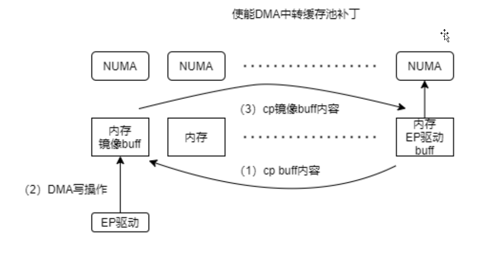

## swiotlb

`swiotlb` 是kernel里面的一个功能, 而 ft `pswiotlb`则是基于
`swiotlb`针对设备跨NUMA DMA 做的一个性能优化.

我们先来看下`swiotlb`的目的和实现方法:

`swiotlb`有一个很大的作用是, 在没有IOMMU, Device又只能访问低内存的情
况下, 可以让driver端来分配 high memory DMA buffer, 在DMA层, 会将
设备DMA 的实际地址, 分配到一个 临时DMA缓冲区(low memory). 这样有几方
面好处:

1. driver端 在分配dma buffer时, 无需再考虑 low memory 的限制, 更加灵活
2. 避免很多设备都去在 low memory 中 reserve, 导致low memory 不足或者不够这
   些设备分配

> NOTE
>
> 当然, swiotlb 还有其他用途, 请见 [kernel doc][kernel doc]

swiotlb的主要流程总结如下:


可以看到, 图中的CPU, 其实指的driver部分, 访问的都是  high buffer, 
而Device 端 访问的是 low buffer, 而DMA 层, 会负责high buffer, 和
low buffer的 alloc/map/sync动作.

关于sync动作举个例子, 当处于网卡驱动发包方向时, 需要将图中的high buffer
sync 到 low buffer, 以供 deivce做 read DMA, 这个动作会在
`swiotlb_tbl_map_single`去做. 而如果在收包方向, 则需要将 device 做完
write DMA的low buffer sync到 high buffer. 这个动作会在 `swiotbl_tlb_unmap_single`
去做.

关于`swiotlb`的目的和实现细节, 我们简单介绍到这里. 接下来, 我们主要结合`pswiotlb`
的代码来看下其细节.

## pswiotlb



ft pswiotlb 的流程大概如上, ft这边实现的目的是为了避免设备端在做DMA时, 进行跨NUMA
的访问, 所以在driver端申请 DMA buffer时候, 不做限制, 而在DMA 层, 则在 driver所在的NUMA
节点上申请镜像 buffer, 然后步骤(1) (3) 同上面`swiotlb`提到的sync操作.

我们思考下, 该操作是如何提升性能的.

从上图的做法来看, 无非是使用了镜像buffer, 让device可以避免跨NUMA访问, 但是CPU 侧做
cp操作的使用也会涉及到跨NUMA访问, 这样来看, 是将 设备端跨NUMA访问的代价 转交给了CPU,
从一定程度上可以让两者并行执行, 总的来看,应该能够增加io吞吐量. 如果两者代价一样, 那
io延迟上似乎不会有所提升, 不过从ft那边的测试来看, 磁盘跨DIE DMA 写延迟会有较大改善.
那也就说明CPU 跨DIE 访问的代价似乎比device端要小.

### 具体实现

#### p_io_tlb_mem, p_io_tlb_pool

和`swiotlb`不同的是 `p_io_tlb_mem` 的实体有多个, 每个numa一个,定义如下:

```cpp
struct p_io_tlb_mem p_io_tlb_default_mem[MAX_NUMNODES];
```
而执行`pswiotlb_tlb_map_single`时, 则会传入`nid`参数, 并且在 `pswiotlb_find_slots()`时,
会根据`nid`, 从 `p_io_tlb_default_mem` 中索引到其`nid` index 的`p_io_tlb_mem`成员.
```cpp
phys_addr_t pswiotlb_tbl_map_single(struct device *dev, int nid, phys_addr_t orig_addr,
                size_t mapping_size, size_t alloc_size,
                unsigned int alloc_align_mask, enum dma_data_direction dir,
                unsigned long attrs);

static int pswiotlb_find_slots(struct device *dev, int nid, phys_addr_t orig_addr,
                size_t alloc_size, unsigned int alloc_align_mask,
                struct p_io_tlb_pool **retpool)
{
        struct p_io_tlb_mem *mem = &dev->dma_p_io_tlb_mem[nid];
        ...

        找到相应的 p_io_tlb_pool

        pswiotlb_pool_find_slots
        ...
}
```
这里, 找到相应的`p_io_tlb_mem`后, 会在从其中找到合适的`p_io_tlb_pool`(我们下面再具体分析),
找到合适的`io_tlb_pool`之后, 再调用`pswiotlb_pool_find_slots`从pool中分配free buffer.
这部分内容就不再展开.

那从现在看来, 似乎从每个`p_io_tlb_default_mem[nid]`中分配的DMA buffer, 就是该nid numa上
的memory. 我们从两方面来看下, 一个是nid是怎么获取的, 另一个是`p_io_tlb_default_mem`中的
`io_tlb_pool`中的内存池是如何分配的.


1. nid的获取

我们来看下下面的调用路径:
```
pswiotlb_dma_direct_map_page
  pswiotlb_map
    pswiotlb_tbl_map_single
```

在`pswiotlb_dma_direct_map_page()`中, nid 是通过`device->numa_node`获取,也就是设备所在的numa
节点.
```cpp
static inline dma_addr_t pswiotlb_dma_direct_map_page(struct device *dev,
                struct page *page, unsigned long offset, size_t size,
                enum dma_data_direction dir, unsigned long attrs)
{
        int nid = dev->numa_node;
        ...

        pswiotlb_map(..., nid, ...)
        ...
}
```

2. 内存池内存申请

内存池分为两种:
```cpp
struct p_io_tlb_mem {
        struct p_io_tlb_pool defpool;
        ...
        struct p_io_tlb_pool *pool_addr[64*1024/8];
        ...
        int capacity;
};
```

一种是 defpool, 这个在系统启动早期, 通过memblock 内存分配器分配.
另一种是 pool_addr[] 数组指向, 表示defpool内存不足时, 可以从该pool
中分配. 我们先来看下内存预留的代码:

* default pool
在下面调用路径中, 会预留default pool
```
mem_init
  pswiotlb_init
  {
      for  NUMA_NUM {
          pwiotlb_init_remap()
            pswiotlb_memblock_alloc()
      }
  }
```

我们来看下具体代码:
```cpp
void __init pswiotlb_init_remap(bool addressing_limit, int nid, unsigned int flags,
                int (*remap)(void *tlb, unsigned long npslabs))
{
        struct p_io_tlb_pool *mem = &p_io_tlb_default_mem[nid].defpool;
        ...

        while ((tlb = pswiotlb_memblock_alloc(npslabs, nid, flags, remap)) == NULL) {
                if (npslabs <= P_IO_TLB_MIN_SLABS)
                        return;
                npslabs = ALIGN(npslabs >> 1, P_IO_TLB_SEGSIZE);
                nareas = limit_nareas(nareas, npslabs);
        }
        ...
        add_mem_pool(&p_io_tlb_default_mem[nid], mem);
```

可以看到, 对于每个numa来说, 会传入相应的nid 调用`pswiotlb_memblock_alloc`
```cpp
static void __init *pswiotlb_memblock_alloc(unsigned long npslabs,
                int nid, unsigned int flags,
                int (*remap)(void *tlb, unsigned long npslabs))
{
        size_t bytes = PAGE_ALIGN(npslabs << P_IO_TLB_SHIFT);
        void *tlb;

        tlb = memblock_alloc_node(bytes, PAGE_SIZE, nid);
        ...
        return tlb;
}
```
可以看到其分配内存时, 也是申请该numa node 内存.

在`pswiotlb_init_remap`的末尾, 会将defpool 加入到pool_addr[0]的位置:
```cpp
static void add_mem_pool(struct p_io_tlb_mem *mem, struct p_io_tlb_pool *pool)
{
        spin_lock(&mem->lock);
        if (mem->capacity != mem->whole_size) {
                mem->pool_addr[mem->whole_size] = mem->pool_addr[mem->capacity];
                mem->pool_addr[mem->capacity] = pool;
        } else {
                mem->pool_addr[mem->capacity] = pool;
        }
        /* prevent any other writes prior to this time */
        smp_wmb();
        mem->capacity++;
        mem->whole_size++;
        mem->nslabs += pool->nslabs;
        spin_unlock(&mem->lock);
}
```
`mem->capacity`表示当前pool_addr[]数组的有效大小.

* pool_addr[x]  x > 0

我们再来看下`pool_addr[]`其他数组成员的分配.
```cpp
static int pswiotlb_find_slots(struct device *dev, int nid, phys_addr_t orig_addr,
                size_t alloc_size, unsigned int alloc_align_mask,
                struct p_io_tlb_pool **retpool)
{
        for (i = 0; i < 15; i++) {
                if (i == 0) {
                        pool = mem->pool_addr[0];
                        index = pswiotlb_pool_find_slots(dev, nid, pool, orig_addr,
                                                alloc_size, alloc_align_mask);
                } else if (i == 1 && capacity > (cpuid + 1)) {
                        pool = mem->pool_addr[cpuid + 1];
                        index = pswiotlb_pool_find_slots(dev, nid, pool, orig_addr,
                                                alloc_size, alloc_align_mask);
                } else {
                        try_pool_idx = get_random_int() % capacity;
                        pool = mem->pool_addr[try_pool_idx];
                        index = pswiotlb_pool_find_slots(dev, nid, pool, orig_addr,
                                                        alloc_size, alloc_align_mask);
                }
                if (index >= 0) {
                        rcu_read_unlock();
                        goto found;
                }
        }
        rcu_read_unlock();
        if (!mem->can_grow)
                return -1;

        pool = pswiotlb_formal_alloc(dev, mem);
        if (!pool)
                return -1; 
        ...
}
```
该过程发生在现有pool内存都不足的情况下,`mem->can_grow`为真, 也就是说,允许额外在申请pool的情况下,
会调用`pswiotlb_formal_alloc`来申请新的pool, 我们先来看下在现有存在多个pool时的分配原则.

1. 第一轮分配: i == 0: 从 default pool 中分配
2. 第二轮分配: i == 1 并且现有的pool的数量`capacity > cpuid + 1`, 从cpuid + 1 的index中分配, 避免
               多个cpu竞争一个pool
3. 第三轮+ 分配: 随机分配

一共尝试15次, 超过15次, 则退出循环, 尝试分配新的 pool

```cpp
static struct p_io_tlb_pool *pswiotlb_formal_alloc(struct device *dev,
                struct p_io_tlb_mem *mem)
{
        struct p_io_tlb_pool *pool;

        pool = pswiotlb_alloc_pool(dev, mem->numa_node_id,
                                P_IO_TLB_MIN_SLABS, dynamic_inc_thr_npslabs,
                                dynamic_inc_thr_npslabs, mem->phys_limit,
                                0, GFP_NOWAIT | __GFP_NOWARN);
        if (!pool) {
                pr_warn_ratelimited("Failed to allocate new formal pool");
                return NULL;
        }
        pool->busy_record = bitmap_zalloc(pool->nareas, GFP_KERNEL);
        if (!pool->busy_record) {
                pr_warn_ratelimited("%s: Failed to allocate pool busy record.\n", __func__);
                return NULL;
        }

        add_mem_pool(mem, pool);

        return pool;
}
```

`pswiotlb_alloc_pool`的代码流程大致如下:

```
pswiotlb_alloc_pool
  pswiotlb_alloc_tlb
    alloc_dma_pages(nid, gfp, bytes)
```

最终也会根据`nid`来分配内存, 不过由于不是系统启动早期, 并且这部分内存也最好动态申请不需要预留,
所以使用的`alloc_pages`相关接口分配.

另外, 分配完pool 后, 同样使用`add_mem_pool`将该pool, 加入到`p_io_tlb_mem.pool_addr[]`数组中.

了解完这些, 基本上就了解了`pswiotlb` 和`swiotlb`的需求以及实现上的不同点.

接下来, 我们来看下 使用`pswiotlb`的影响.

## 影响

我们主要来看下, 设备在什么情况下会使用pswiotlb

在 `device` 数据结构中增加如下成员:

```cpp
struct device {
#ifdef CONFIG_PSWIOTLB
        struct p_io_tlb_mem *dma_p_io_tlb_mem;
        bool dma_uses_p_io_tlb;
        bool can_use_pswiotlb;
#endif
}
```
> NOTE 
>
> device中有不少 reserve field, 如果使用reserve field 替换该改动, 也不
> 会影响kabi

* dma_p_io_tlb_mem: 指向该device所在的`p_io_tlb_mem`
* dma_uses_p_io_tlb: 表明该设备是否在使用`pswiotlb`
* can_use_pswiotlb: 表示该设备是否有资格使用`pswiotlb`

在`mem_init()`时, 会通过判断是否是ft的某个平台(具体啥平台不清楚,怀疑至少是ft2500), 
确定是否初始化:
```cpp
void __init mem_init(void)
{
        if (swiotlb_force == SWIOTLB_FORCE ||
            max_pfn > PFN_DOWN(arm64_dma_phys_limit))
                swiotlb_init(1);
        else if (!xen_swiotlb_detect())
                swiotlb_force = SWIOTLB_NO_FORCE;

#ifdef CONFIG_PSWIOTLB
        /* enable pswiotlb default */
        if ((pswiotlb_force_disable != true) &&
                is_phytium_ps23064_socs())
                pswiotlb_init(1, PSWIOTLB_VERBOSE);
#endif
        ...
}
```

另外, 在使用dma相关接口时:
```cpp
static int __dma_map_sg_attrs(struct device *dev, struct scatterlist *sg,
         int nents, enum dma_data_direction dir, unsigned long attrs)
{
        const struct dma_map_ops *ops = get_dma_ops(dev);
        int ents;

        BUG_ON(!valid_dma_direction(dir));

        if (WARN_ON_ONCE(!dev->dma_mask))
                return 0;
#ifdef CONFIG_PSWIOTLB
        if (check_if_pswiotlb_is_applicable(dev)) {
                ents = pswiotlb_dma_map_sg_attrs_distribute(dev, sg, nents, dir, attrs);
                return ents;
        }
#endif
        ...
}
```
会通过`check_if_pswiotlb_is_applicable()` 来判断
```cpp
static inline bool check_if_pswiotlb_is_applicable(struct device *dev)
{
        if (dev->can_use_pswiotlb && is_phytium_ps23064_socs()
                                && !pswiotlb_force_disable) {
                if (dev->numa_node == NUMA_NO_NODE ||
                        dev->numa_node != dev->local_node)
                        dev->numa_node = dev->local_node;

                if (dev_is_pci(dev) && (dev->numa_node != NUMA_NO_NODE))
                        return true;
        }

        return false;
}
```
判断条件也是增加了phytinum 平台的判断, 并且`dev->can_use_pswiotlb`则是通过
ft 这边搞的一个白名单来判定:

```cpp
void pci_set_master(struct pci_dev *dev)
{
#ifdef CONFIG_PSWIOTLB                                                                                                                                 
		if ((pswiotlb_force_disable != true) &&
				is_phytium_ps23064_socs()) {
        		dev->dev.can_use_pswiotlb = pswiotlb_is_dev_in_blacklist(dev);
        		dev_info(&dev->dev, "The device %s use pswiotlb because vendor "
						"0x%04x %s in pswiotlb blacklist\n",
        		dev->dev.can_use_pswiotlb ? "would" : "would NOT",
        	    		dev->vendor, dev->dev.can_use_pswiotlb ? "is NOT" : "is");
		}
#endif
		__pci_set_master(dev, true);
		pcibios_set_master(dev);
}
```
`pswiotlb_is_dev_in_blacklist()`会在`blacklist`中查找是否有该设备, 如果找到了返回false, 表明没有在黑名单中.

```cpp
bool pswiotlb_is_dev_in_blacklist(struct pci_dev *dev)
{
        struct pswiotlb_blacklist *bl_entry;

        rcu_read_lock();
        list_for_each_entry_rcu(bl_entry, &blacklist, node) {
                if (bl_entry->vendor == dev->vendor) {
                        rcu_read_unlock();
                        goto out;
                }
        }
        rcu_read_unlock();

        return true;
out:
        return false;
}
```

那也就是说, 不再blacklist中的设备都是在黑名单內. 所以这个blacklist表示白名单, 
接下来我们以白名单表示blacklist, 我们来看下设备在什么时候会往该白名单中加.

主要有三种方法:
1. 直接改代码
```cpp
static struct pswiotlb_blacklist_entry {
        unsigned short vendor;
        unsigned short device;
} ps_blacklist[] = {
        {BL_PCI_VENDOR_ID_NVIDIA,         0xFFFF},
        {BL_PCI_VENDOR_ID_ILUVATAR,       0xFFFF},
        {BL_PCI_VENDOR_ID_METAX,      0xFFFF},
        {}
};

static void pswiotlb_blacklist_init(void)
{
        int dev_num = 0;
        int i;
        size_t alloc_size;
        struct pswiotlb_blacklist *blacklist_array;

        spin_lock_init(&blacklist_lock);

        for (i = 0; ps_blacklist[i].vendor != 0; i++)
                dev_num++;

        alloc_size = PAGE_ALIGN(array_size(sizeof(struct pswiotlb_blacklist), dev_num));
        blacklist_array = memblock_alloc(alloc_size, PAGE_SIZE);
        if (!blacklist_array) {
                pr_warn("%s: Failed to allocate memory for blacklist\n",
                                        __func__);
                return;
        }

        for (i = 0; i < dev_num; i++) {
                blacklist_array[i].vendor = ps_blacklist[i].vendor;
                blacklist_array[i].device = ps_blacklist[i].device;

                spin_lock(&blacklist_lock);
                list_add_rcu(&blacklist_array[i].node, &blacklist);
                spin_unlock(&blacklist_lock);
        }

        pswiotlb_show_blacklist();
}
```
可以看到, 在`ps_blacklist`中添加vendor和device, 在执行`pswiotlb_blacklist_init`
时, 可以将该数组中的设备加到白名单中.

2.  kernel command line
```cpp
static int __init
setup_pswiotlb_blacklist(char *str)
{
        char tmp_str[5] = {'\0'};
        unsigned long flags;
        int i, j, k;
        int ret;

        for (i = 0, j = 0, k = 0; i < strlen(str) + 1; i++) {
                if (*(str + i) != ',' && *(str + i) != '\0') {
                        tmp_str[j++] = *(str + i);
                } else {
                        j = 0;

                        ret = kstrtou16(tmp_str, 16, &blacklist_entry[k].vendor);
                        if (ret)
                                return ret;

                        blacklist_entry[k].from_grub = true;

                        spin_lock_irqsave(&blacklist_lock, flags);
                        list_add_rcu(&blacklist_entry[k].node, &blacklist);
                        spin_unlock_irqrestore(&blacklist_lock, flags);

                        k++;
                }
        }

        return 0;
}
early_param("pswiotlb_blacklist", setup_pswiotlb_blacklist);
```
可以看到, 允许在cmdline中添加多个设备到白名单, 可以看到需要用`','`隔开.

3. debugfs -- 以add为例:
```cpp
static int blacklist_add(void *data, u64 val)
{
        struct pswiotlb_blacklist *bl_entry;
        unsigned long flags;

        bl_entry = kzalloc(sizeof(*bl_entry), GFP_ATOMIC);
        if (!bl_entry)
                return -ENOMEM;

        bl_entry->vendor = val;
        bl_entry->from_grub = false;

        spin_lock_irqsave(&blacklist_lock, flags);
        list_add_rcu(&bl_entry->node, &blacklist);
        spin_unlock_irqrestore(&blacklist_lock, flags);

        return 0;
}
DEFINE_DEBUGFS_ATTRIBUTE(fops_blacklist_add, NULL,
                                blacklist_add, "%llu\n");
//dirname: pswiotlb-blacklist
static void pswiotlb_create_blacklist_debugfs_files(const char *dirname)
{
        blacklist_debugfs = debugfs_create_dir(dirname, blacklist_debugfs);
        if (!blacklist_debugfs)
                return;

        debugfs_create_file("show_devices", 0400, blacklist_debugfs, NULL,
                        &blacklist_display_fops);
        debugfs_create_file("add_device", 0600, blacklist_debugfs, NULL,
                        &fops_blacklist_add);
        debugfs_create_file("del_device", 0600, blacklist_debugfs, NULL,
                        &fops_blacklist_del);
}
```

可以看到, 其可以通过操作`$DEBUGFS/pswiotlb-blacklist/add-device` 添加 设备到白名单,并且
能通过`show_devices`查看已经添加到白名单的设备,通过`del_device`在白名单中删除已添加设
备.

> NOTE
> 
> 上面三种方法均在 ft <<DMA中转缓存池补丁说明>> 中有例子.


## 总结

目前pswiotlb 的代码, 基本上在ft机器上才能执行, 所以影响较小, 对于kabi change来说,也可以通过
将改动字段替换为 reserved 字段解决, 根据ft研发人员测试, 该功能在ft平台上性能提升较大, 
网卡和nvme io吞吐方面都有1倍左右的提升. 而在io延时方面,磁盘延时也缩小了30%~50%, 整体提升不小.


综上所属, 该功能代码较多, 可以暂时不合入到621产品中, 但是, 由于性能提升较大, 可以合入到
631产品.


## 参考链接

[没有IOMMU的DMA操作-swiotlb]: https://blog.csdn.net/gjioui123/article/details/128851246

[kernel doc]: https://docs.kernel.org/core-api/swiotlb.html
