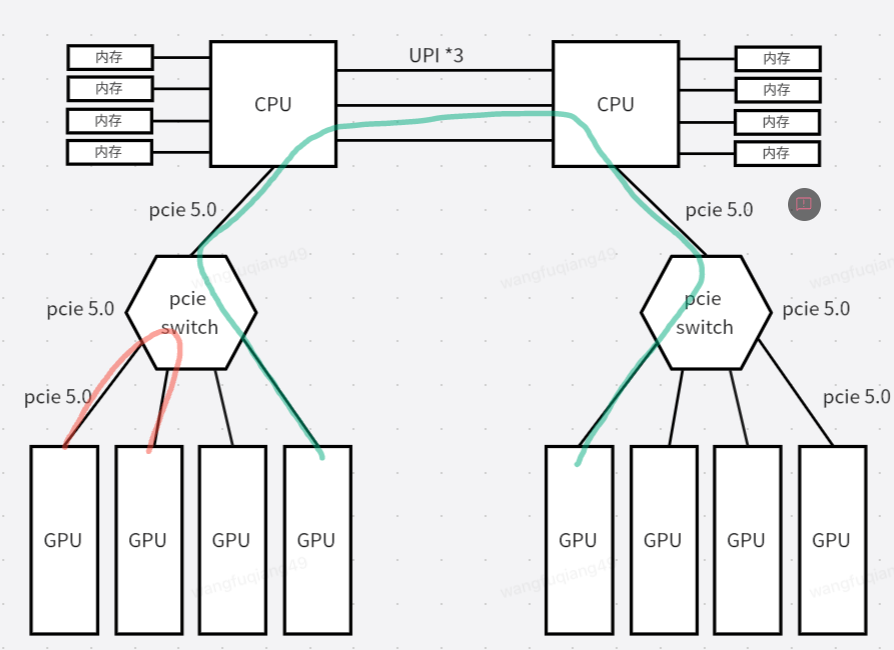
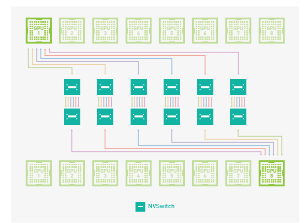
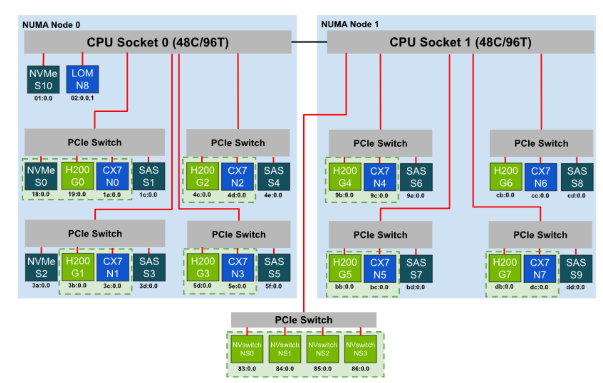
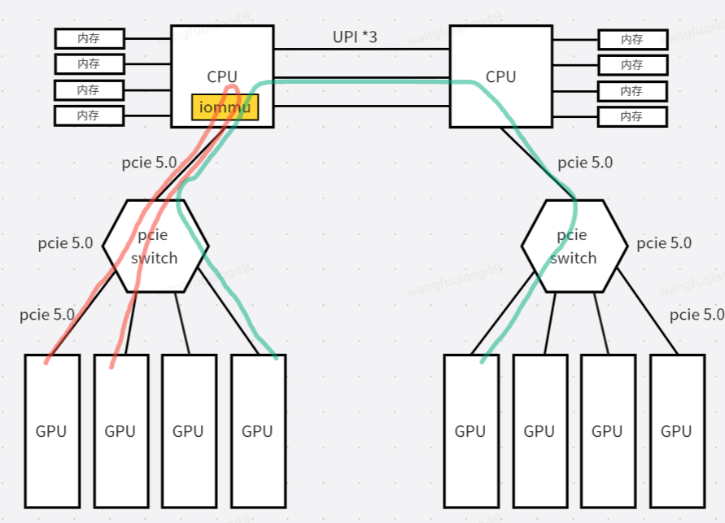

## VM GPU 拓扑

### 背景知识

GPU 之间的通信有下面几种方式:
1. PCIe P2P(仅考虑pcie switch 支持p2p): 

   

   GPU之间通信通过 P2P 的方式通信，该过程bypass CPU, 当GPU 在一个PCIe switch时,
   P2P的路径较短(如红色的线), 假如两GPU位于不同的numa，其需要走一个较长的路径(如绿色
   的线), 其过程也是bypass cpu core, 但是会占用一定的QPI
2. NVSWITCH

   

   nvswitch互联了各个GPU, 同节点nvswitch 通信将不再通过PCIe P2P 机制，而是使用一种特殊的
   协议（个人理解), 让某个GPU 可以看到其他GPU的显存, 并通过 nvlink协议中规定的nvlink消息，
   将请求地址和数据进行转发，最终达到目的GPU。这个拓扑是平坦的，每个GPU之间的"距离"非常接
   近。

3. GPUDirect RDMA

   当两个GPU之间位于不同的主机, GPU首先会和指定的IB网卡进行通信，而各个主机上的IB网卡组成IB
   网络用于在不同的主机上传输数据。而GPU 和 IB 网卡通信是通过 GPU Direct RDMA的方式(PCIe P2P),
   根据 1 应该让GPU和其PCI 拓扑较近的IB卡进行绑定，如下图:



图中, 用绿虚线框框起来的位于一个 `PCIe switch`, 位于一个框中的设备在PCIe 拓扑中是"较近" 的.

上面是基于物理机考虑, 在虚拟化中，由于IOMMU的存在，所有从设备触发的PCIe tlp 都要经过IOMMU
的地址转换，基于此，如果设备之间要做P2P则需要一个非常长的路径:



即便是两个设备位于一个nvswitch, 其P2P也要走到upstream的顶端，然后再向下路由。

为此, IOMMU 引入了`ATS` 协议，部分PCIe设备也支持了该功能.(例如IB卡)。 其作用是, 在虚拟化场景
中, 每个PCIe设备发出的p2p路由向上传递到顶的原因是，需要IOMMU进行地址翻译，然后转发。如果设备
通过某种方式"知道了" 翻译后的地址, 拿着翻译后的地址发起TLP请求，则可以直接发给 目的设备。如下图:


有了ATS之后，IB 在请求是可以向`RC(TA)`请求翻译后的地址，当拿到翻译后的地址后，可以对翻译后的地址
**范围**直接请求，发送给GPU.

所以, 在虚拟机中仍然有较短路径的P2P。**因此我们在构造虚拟机中拓扑时，除了搞定GPU, 
IB 的NUMA亲和，还需要让虚拟机能看到 GPU和 IB 的亲和性**

## 方案

大致的方案如上图所示:


主要的目标是，将HOST 链接到一个PCIe switch 的IB和GPU， 在guest中也使用
`PCI bridge/PCIe switch`连接，这样guest就可以知道 某个GPU使用哪个IB进行RDMA
比较合适.

但是具体实现上, 有两种方式:

1. 采用q35 machine, 构造PCIe switch topo, 这样构造的拓扑，NCCL可以直接识别. 
   无需做额外工作, 但是缺点是，q35 对于控制面来说改动较大。

2. 采用pc machine, 构造`pci bridge + pci expander bus`构造GPU/IB 以及NUMA亲和,
   但是NCCL并不识别该 PCI topo, 需要 在guest中构造xml 给NCCL使用。
   (`NCCL_TOPO_FILE`)

目前打算使用 2

[示例xml](./example.xml)

虚拟机中pci拓扑如下:
```
root@ubuntu240403:~# lspci -t
-+-[0000:00]-+-00.0
 |           +-01.0
 |           +-01.1
 |           +-01.2
 |           +-01.3
 |           +-02.0-[01]--
 |           +-03.0
 |           +-04.0
 |           +-05.0
 |           +-06.0
 |           +-07.0
 |           +-08.0
 |           +-09.0
 |           +-0a.0
 |           \-15.0
 +-[0000:f0]---00.0-[f1]--+-01.0
 |                        \-02.0
 +-[0000:f2]---00.0-[f3]--+-01.0
 |                        \-02.0
 +-[0000:f4]---00.0-[f5]--+-01.0
 |                        \-02.0
 +-[0000:f6]---00.0-[f7]--+-01.0
 |                        \-02.0
 +-[0000:f8]---00.0-[f9]--+-01.0
 |                        \-02.0
 +-[0000:fa]---00.0-[fb]--+-01.0
 |                        \-02.0
 +-[0000:fc]---00.0-[fd]--+-01.0
 |                        +-02.0
 |                        +-05.0
 |                        \-06.0
 \-[0000:fe]---00.0-[ff]--+-00.0
                          +-01.0
                          \-02.0
```

> [!NOTE]
>
> `ff:00.0`, `fd:05.0`, `fd:06.0` 是我这边挂载的其他的设备，除去这三个bridge,
> 每个bridge 挂载一个GPU, 一个IB卡

## 参考链接

1. [Optimizing VM Configuration for Performant AI Inference](https://docs.nvidia.com/ai-enterprise/planning-resource/optimizing-vm-configuration-ai-inference/latest/appendix.html)
2. [NVIDIA NVSWITCH The World’s Highest-Bandwidth On-Node Switch](https://images.nvidia.com/content/pdf/nvswitch-technical-overview.pdf)
