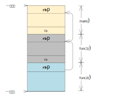
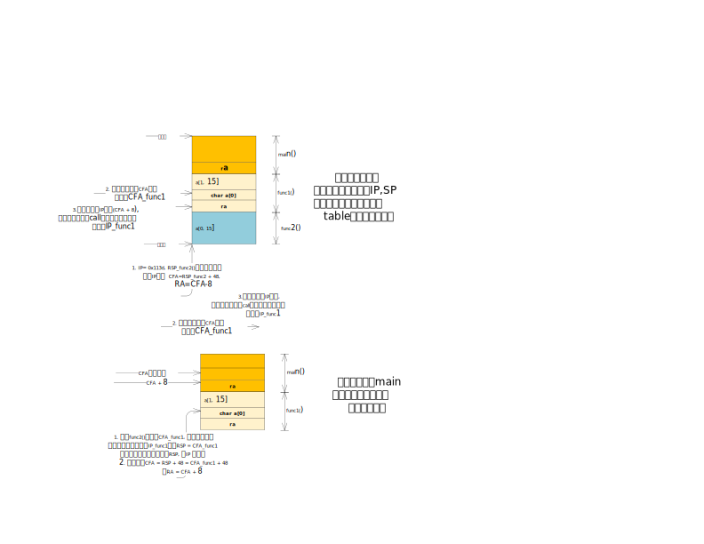

# ORC unwind
orc 和frame pointer 一样都用于堆栈回溯。我们先来看下frame pointer
的实现。

## frame pointer
我们编写一个小程序来看下:
```cpp
#include <stdio.h>
void func2()
{
        return;
}
void func1()
{
        func2();
        return;
}
int main()
{
        func1();
        return 0;
}
```
使用 -O0 编译选项编译，然后反编译看下:
```
0000000000001119 <func2>:
    1119:       55                      push   %rbp
    111a:       48 89 e5                mov    %rsp,%rbp
    111d:       90                      nop
    111e:       5d                      pop    %rbp
    111f:       c3                      ret

0000000000001120 <func1>:
    1120:       55                      push   %rbp
    1121:       48 89 e5                mov    %rsp,%rbp
    1124:       b8 00 00 00 00          mov    $0x0,%eax
    1129:       e8 eb ff ff ff          call   1119 <func2>
    112e:       90                      nop
    112f:       5d                      pop    %rbp
    1130:       c3                      ret

0000000000001131 <main>:
    1131:       55                      push   %rbp
    1132:       48 89 e5                mov    %rsp,%rbp
    1135:       b8 00 00 00 00          mov    $0x0,%eax
    113a:       e8 e1 ff ff ff          call   1120 <func1>
    113f:       b8 00 00 00 00          mov    $0x0,%eax
    1144:       5d                      pop    %rbp
    1145:       c3                      ret
```
可以看到，在函数开始都会去执行下面两条指令
```
push %rbp ===1
mov %rsp, %rbp ====2
```
堆栈回溯，主要的两个寄存器，sp, ip, 我们分别说下:
* 关于sp，这里push的 rbp, 就是上一级函数执行到push %rbp 之后的sp值, 
 这个比较好理解，可以看底下的图
* 关于ip，其实这个开头是固定的，也就是说，`mov %rsp, %rbp`这个操作一定发生在
`push %rbp`之后，不能有其他的堆栈操作。这样就固定了ip和sp之间的关系

> NOTE
>
> 这里举个例子:
>
> ```
> 0xffffffffb1c605f0 <__schedule>:        push   %rbp
> 0xffffffffb1c605f1 <__schedule+1>:      mov    %rsp,%rbp
> 0xffffffffb1c605f4 <__schedule+4>:      push   %r15
> 0xffffffffb1c605f6 <__schedule+6>:      push   %r14
> ```
> 可以看到, 在`__schedule`函数中，还需要保存其他的寄存器，例如
> r15, r14 。但是 mov 操作，还是紧跟着 push %rbp之后，这样固定下来
> 之后，就方便之后的堆栈回溯分析，因为固定了保存堆栈的位置，这个位置
> - 16 正好是ra 的位置（return address) 也就是调用者调用call指令
> 存放ip的位置

我们先来结合反汇编看下:
* func2: 假设执行到111a 偏移(func2+0x0)，这时执行完了`push %rbp`，此时sp指向的内存
 存放的是rbp, rbp中的值，是为执行到func1函数执行到1121的sp的值，NOTE 中也提到，
 这个位置是固定的，那这个位置 - 16, 正好可以获取到 ip 的位置。这样就可以找到func1调用
call指令的ip, sp
* func1: 通过func1 传过来的 rbp ip, 我们主要再利用rbp, 找到上一级的sp, ip。
 rbp指向的内存正好是上一级的sp(main), 而ip的位置和sp的位置
 又是固定的，所以可以通过 sp - 16 获取到上一级的ip, 一次递归即可

但是这里有一个问题，第一级函数func2，我们必须知道存放rbp时的位置，而这时%rbp可能指向的不是存放上一级sp的位置
例如:
```
0xffffffffb1c605f0 <__schedule>:        push   %rbp      <===在这个时候需要堆栈回溯
0xffffffffb1c605f1 <__schedule+1>:      mov    %rsp,%rbp
```
这个时候很可能在堆栈回溯时，就把上一级函数越过了。

我们再来看个图, 更清晰了解下frame pointer 的堆栈回溯:



frame pointer比较容易理解，但是在堆栈中去push rbp的操作，实际上只用于堆栈回溯
相关的debug功能，却带来了不小的性能影响。

orc/dwarf通过另一种方式解决了这个问题。

## dwarf
orc 是基于dwarf实现的，在dwarf的基础上，做了一些简化，主要是考虑到
orc的功能主要是用在堆栈回溯，而dwarf可能用于其他的debug，例如，去查找
当前的一些其他的临时寄存器例如rdi rsi （像gdb的话，就需要找到这些寄存器
所存储的位置用于打印临时变量）

我们先看下dwarf怎么做的。dwarf的话, 一般情况下 不再会有push rbp的这种操作（有
的时候也会有，但是不是用于堆栈回溯，而是用于保存临时寄存器 rbp ) 。通过在编译
时构建一张 结合ip , rsp 和其他寄存器关系的映射。
可以通过`readelf -wF elf文件`获取到该表

我们直接去看vmlinux, 直接看vmlinx 的原因是,我们自己编写的小程序，可能不会用到临时寄存器
导致表的内容比较简单。
```
00000058 000000000000004c 00000000 FDE cie=00000000 pc=ffffffff8279927a..ffffffff827994f8
   LOC           CFA      rbx   rbp   r12   r13   r14   r15   ra
ffffffff8279927a rsp+8    u     u     u     u     u     u     c-8
ffffffff827992ae rsp+16   u     u     u     u     u     c-16  c-8
ffffffff827992b3 rsp+24   u     u     u     u     c-24  c-16  c-8
ffffffff827992b8 rsp+32   u     u     u     c-32  c-24  c-16  c-8
ffffffff827992ba rsp+40   u     u     c-40  c-32  c-24  c-16  c-8
ffffffff827992bb rsp+48   u     c-48  c-40  c-32  c-24  c-16  c-8
ffffffff827992bc rsp+56   c-56  c-48  c-40  c-32  c-24  c-16  c-8
ffffffff827994ea rsp+48   u     c-48  c-40  c-32  c-24  c-16  c-8
ffffffff827994eb rsp+40   u     u     c-40  c-32  c-24  c-16  c-8
ffffffff827994ed rsp+32   u     u     u     c-32  c-24  c-16  c-8
ffffffff827994ef rsp+24   u     u     u     u     c-24  c-16  c-8
ffffffff827994f1 rsp+16   u     u     u     u     u     c-16  c-8
ffffffff827994f3 rsp+8    u     u     u     u     u     u     c-8
```

我这里随意截取了一个function, 解释下表中的内容
* LOC表示指令的相对位置（不一定是IP，总之他能决定指令的相对位置）
* CFA 我理解为，上一级函数调用call指令之前的RSP，例如`LOC=ffffffff8279927a`
 这个位置表示函数的开始，这时RSP指向ra，而ra是call指令压入的，所以RSP+8,正好
 是调用call之前的RSP的状态
* rbx, rbp... : 这些列中的u，表示在该指令下，无法找到寄存器位置（这个寄存器没有
 压栈）。c表示CFA， 拿`ffffffff827992ae` r15 举例，c-16 = rsp + 16 -16 = rsp
* ra： 表示return address, 即通过call指令压入ip的位置。

我们来编写一个小程序，看dwarf如何进行堆栈回溯。
```cpp
#include <stdio.h>
void func2()
{
        char a[16];
        return ;
}
void func1()
{
        char a[16];
        return;
}
int main()
{
        func1();
        return 0;
}
```
在函数中加入局部变量数组的目的，是为了多产生一些指令。
反编译如下:
```
0000000000001139 <func2>:
    1139:       48 83 ec 28             sub    $0x28,%rsp
    113d:       64 48 8b 04 25 28 00    mov    %fs:0x28,%rax
    1144:       00 00
    1146:       48 89 44 24 18          mov    %rax,0x18(%rsp)
    114b:       31 c0                   xor    %eax,%eax
    114d:       90                      nop
    114e:       48 8b 44 24 18          mov    0x18(%rsp),%rax
    1153:       64 48 2b 04 25 28 00    sub    %fs:0x28,%rax
    115a:       00 00
    115c:       74 05                   je     1163 <func2+0x2a>
    115e:       e8 cd fe ff ff          call   1030 <__stack_chk_fail@plt>
    1163:       48 83 c4 28             add    $0x28,%rsp
    1167:       c3                      ret

0000000000001168 <func1>:
    1168:       48 83 ec 28             sub    $0x28,%rsp
    116c:       64 48 8b 04 25 28 00    mov    %fs:0x28,%rax
    1173:       00 00
    1175:       48 89 44 24 18          mov    %rax,0x18(%rsp)
    117a:       31 c0                   xor    %eax,%eax
    117c:       90                      nop
    117d:       48 8b 44 24 18          mov    0x18(%rsp),%rax
    1182:       64 48 2b 04 25 28 00    sub    %fs:0x28,%rax
    1189:       00 00
    118b:       74 05                   je     1192 <func1+0x2a>
    118d:       e8 9e fe ff ff          call   1030 <__stack_chk_fail@plt>
    1192:       48 83 c4 28             add    $0x28,%rsp
    1196:       c3                      ret

0000000000001197 <main>:
    1197:       48 83 ec 08             sub    $0x8,%rsp
    119b:       b8 00 00 00 00          mov    $0x0,%eax
    11a0:       e8 c3 ff ff ff          call   1168 <func1>
    11a5:       b8 00 00 00 00          mov    $0x0,%eax
    11aa:       48 83 c4 08             add    $0x8,%rsp
    11ae:       c3                      ret
```
readelf -wF
```
0000000000001139 rsp+8    c-8
000000000000113d rsp+48   c-8
0000000000001167 rsp+8    c-8

00000070 0000000000000014 00000074 FDE cie=00000000 pc=0000000000001168..0000000000001197
   LOC           CFA      ra
0000000000001168 rsp+8    c-8
000000000000116c rsp+48   c-8
0000000000001196 rsp+8    c-8

00000088 0000000000000014 0000008c FDE cie=00000000 pc=0000000000001197..00000000000011af
   LOC           CFA      ra
0000000000001197 rsp+8    c-8
000000000000119b rsp+16   c-8
00000000000011ae rsp+8    c-8
```
假设ip指向了113d, 需要堆栈回溯, 此时sp = RSP_func2 我们来看下怎么做:
1. 计算CFA_func2 = RSP_func2 + 48,  ra = c - 8 = CFA_func2 - 8
2. 刚刚提到过CFA 可以认为上一层调用call指令之前的状态，实际上 
上一层调用 ip指向call指令时 RSP的值。通过call指令的ip(118d)查表(差表为向低取值)，
得到下面的条目:
```
0000000000001168 rsp+8    c-8
000000000000116c rsp+48   c-8    <-----取这个
0000000000001196 rsp+8    c-8
```
所以此时 CFA_func1 = rsp + 48 = CFA_func2 + 48 , 而 ra = CFA_func1 - 8
3. 同上， CFA_main = rsp + 16 = CFA_func1 + 16,  ra = CFA_main -8

这样就可以完成堆栈回溯。我们结合图再来看下:



# orc
上面提到ORC，是基于dwarf去简化的。我们来看下dwarf的table entry的格式是
怎样的:
```cpp
struct orc_entry {
        s16             sp_offset;
        s16             bp_offset;
        unsigned        sp_reg:4;
        unsigned        bp_reg:4;
        unsigned        type:2;
        unsigned        end:1;
} __packed;
```
我们分别看下里面的成员:
1. sp_reg, sp_offset: 
用于计算CFA, 计算方式为: <br/>
CFA = sp_reg + sp_offset

而这里面的sp_reg/bp_reg可以为 下面的一些值。
这里有常规的寄存器，还有ORC_REG_BP_INDIRECT
这种间接寻址的寄存器，我们下面会提到
```
#define ORC_REG_UNDEFINED               0
#define ORC_REG_PREV_SP                 1
#define ORC_REG_DX                      2
#define ORC_REG_DI                      3
#define ORC_REG_BP                      4
#define ORC_REG_SP                      5
#define ORC_REG_R10                     6
#define ORC_REG_R13                     7
#define ORC_REG_BP_INDIRECT             8
#define ORC_REG_SP_INDIRECT             9
```

而type，则表示该指令所在代码块的类型，我们下面会结合
代码看下:
```
#define ORC_TYPE_CALL                   0
#define ORC_TYPE_REGS                   1
#define ORC_TYPE_REGS_IRET              2
#define UNWIND_HINT_TYPE_SAVE           3
#define UNWIND_HINT_TYPE_RESTORE        4
```
一般的函数为`ORC_TYPE_CALL`

2. bp_offset, bp_reg : 用来计算rbp的值
3. end: 可以认为指向函数末尾。（这个不是指return指令，
而是该function 最大的偏移 的指令）

## init
无论是orc，还是dwarf都需要对静态汇编指令进行分析，而很多时候
需要去理解GCC的行为，因为大部分的代码，还是通过GCC 编译C代码
得到。dwarf呢，是在gcc中实现的，而ORC是kernel自己搞的，所以
gcc可能会增加有一些优化，orc可能也得跟着更新，因为orc是dwarf的
精简版，所以还是有一定风险的（可能现有的结构不能满足要求）。不过
现在是没有什么问题。

静态分析指令，生成orc table的段，是使用objtools去做的。

```
//=========scripts/Makefile.build===============
ifndef CONFIG_FRAME_POINTER
objtool_args += --no-fp
endif
ifdef CONFIG_GCOV_KERNEL
objtool_args += --no-unreachable
else
objtool_args += $(call cc-ifversion, -lt, 0405, --no-unreachable)
endif
ifdef CONFIG_RETPOLINE
  objtool_args += --retpoline
endif

ifdef CONFIG_MODVERSIONS
objtool_o = $(@D)/.tmp_$(@F)
else
objtool_o = $(@)
endif

cmd_objtool = $(if $(patsubst y%,, \
        $(OBJECT_FILES_NON_STANDARD_$(basetarget).o)$(OBJECT_FILES_NON_STANDARD)n), \
        $(__objtool_obj) $(objtool_args) "$(objtool_o)";)
```

objtool 和堆栈回溯方面，不仅是要生成orc table 的section, 而且
会做一些function validation的操作，去检查这些被调用的func
是否满足堆栈回溯。可以看到objtool是分析每个.o, 那种跨.c的调用
objtool是无法验证的。这里验证的主要还是汇编代码，以及内联汇编，
之后我们会举例子来看下。

我们先来看下objtools是如何分析汇编代码的。
代码主要路径:
```cpp
static struct cmd_struct objtool_cmds[] = {
	...
	{"orc",         cmd_orc,        "Generate in-place ORC unwind tables for an object file" },	
};

cmd_orc()
 if (!strncmp(argv[0], "gen", 3)) { 
    return check(objname, true);
 }

check()
  arch_initial_func_cfi_state()  //初始化CFI state
  decode_sections()		//去解码指令
  validate_retpoline		//做一些retpoline 的validate工作，暂时不看
  validate_functions		//(1)做一些function的 vaildate
```

我们主要分析下(1)(2)(3)代码
## validate_functions()
```cpp
static int validate_functions(struct objtool_file *file)
{
        struct section *sec;
        struct symbol *func;
        struct instruction *insn;
        struct insn_state state;
        int ret, warnings = 0;

        clear_insn_state(&state);
	//将cfa设置为arch_initial_func_cfi_state()中初始化的CFI state
        state.cfa = initial_func_cfi.cfa;
        memcpy(&state.regs, &initial_func_cfi.regs,
              CFI_NUM_REGS * sizeof(struct cfi_reg));
        state.stack_size = initial_func_cfi.cfa.offset;

	//遍历每个段
        for_each_sec(file, sec) {
		//遍历每个段中的symbol
                list_for_each_entry(func, &sec->symbol_list, list) {
			//必须是STT_FUNC类型
                        if (func->type != STT_FUNC || func->pfunc != func)
                                continue;
			//找到该function的第一条指令
                        insn = find_insn(file, sec, func->offset);
                        if (!insn || insn->ignore)
                                continue;
			//去验证branch 里面的所有指令, 我们再下面的分析会看到
                        ret = validate_branch(file, insn, state);
                        warnings += ret;
                }
        }

        return warnings;
}
```

我们知道`validate_functions`有`validate function`的功能，同时还会去更新CFI state

## validate_branch
```cpp
static int validate_branch(struct objtool_file *file, struct instruction *first,
                        	struct insn_state state)
{
	...
	while(1) {
		...
		if (insn->hint) {
			... //一般函数不会走这个路径
		} else {
			//将指令赋值为state， 这里实际上类似于memcpy,
			//并不是用指针指向
			//NOTE: state指的是这条指令执行之前的CFI state
			//类似于RIP = insn_address时CFI state
			insn->state = state;
		}
		...
		switch (insn->type) {
		...
		case INSN_JUMP_CONDITIONAL:
		case INSN_JUMP_UNCONDITIONAL:
		        if (insn->jump_dest &&
		        ¦   (!func || !insn->jump_dest->func ||
		        ¦    insn->jump_dest->func->pfunc == func)) {
				//================(1)==================
		                ret = validate_branch(file, insn->jump_dest,
		                                ¦     state);
		                if (ret)
		                        return 1;
		
		        } else if (func && has_modified_stack_frame(&state)) {
		                WARN_FUNC("sibling call from callable "
					"instruction with modified stack frame",
		                         sec, insn->offset);
		                return 1;
		        }
		
		        if (insn->type == INSN_JUMP_UNCONDITIONAL)
		                return 0;
		
		        break;

		case INSN_STACK:
        		if (update_insn_state(insn, &state))
        		        return 1;
			break;

		default:
		        break;
		}
		...
		insn = next_insn;
	}
	return 0;

}
```
这里insn->type有很多，我们主要关注两个
* INSN_JUMP...: 这里包括无条件跳转，和带条件跳转，可见在(1)调了递归，
`insn->jump_dest`作为first insn传入，如果是带条件跳转，可能会出现两个分支，
但是都本着jmp指令本身不会影响CFI state
	+ jmp : 将当前state作为jmp后的指令的state，但是这个递归需要返回，jmp后的
		分支不一定能回来，所以这里只能传值，不能传址
	+ no jmp : 将当前state作为jmp下一条指令的state<br/>
但是这里会有一个问题，假设出现了如下指令:
```
test %rax, %rax
jne  1f
2:
ret
1:
push %rbx
jmp 2b
```
假设第二条指令jne跳转了，但是由于底下会有push指令改变CFI state，再次
回到2,和jne没有跳转的CFI state不一样。按照CFI的设计不能去处理这种问题，
即便是frame pointer也不能去处理。所以我认为是GCC去避免了这样的指令翻译，
让每个offset的指令在所有分支下，CFI state都是一样的。

* INSN_STACK:
这些指令和堆栈相关，或者和栈寄存器(rsp,rbp)，相关, 主要处理函数为`update_insn_state()`,
在分析这个函数之前，我们先来思考下，对于orc 来说 CFI state包括什么，其实最主要
CFI base，CFI offset。
我们来简单看下这个函数:

```cpp
static int update_insn_state(struct instruction *insn, struct insn_state *state)
{
	struct stack_op *op = &insn->stack_op;
	struct cfi_reg *cfa = &state->cfa;
	struct cfi_reg *regs = state->regs;
	...
	switch (op->dest.type) {
	case OP_DEST_REG:
		switch (op->src.type) {
		...
		case OP_SRC_ADD:
			 if (op->dest.reg == CFI_SP && op->src.reg == CFI_SP) {
         			/* add imm, %rsp */
         			state->stack_size -= op->src.offset;
         			if (cfa->base == CFI_SP)
         			        cfa->offset -= op->src.offset;
         			break;
			}
			...
		}
		...
	}
	...
}
```
这里分支有点多，我们只看一个简单的分支, `OP_DEST_REG` 表示dest 为寄存器操作,
`OP_SRC_ADD` 则表示对源操作数进行add操作。
`op->dest.reg == CFI_SP == op->src.reg`则表示源操为立即数，目的操作数为RSP,
这时回去查看当前的CFI base是否还是RSP，如果是现在offset变了，就去修改offset，
offset的变化和base的变化正好相反，这里可以理解为 base + offset = CFI（固定）
CFI是一个相对固定的值。
