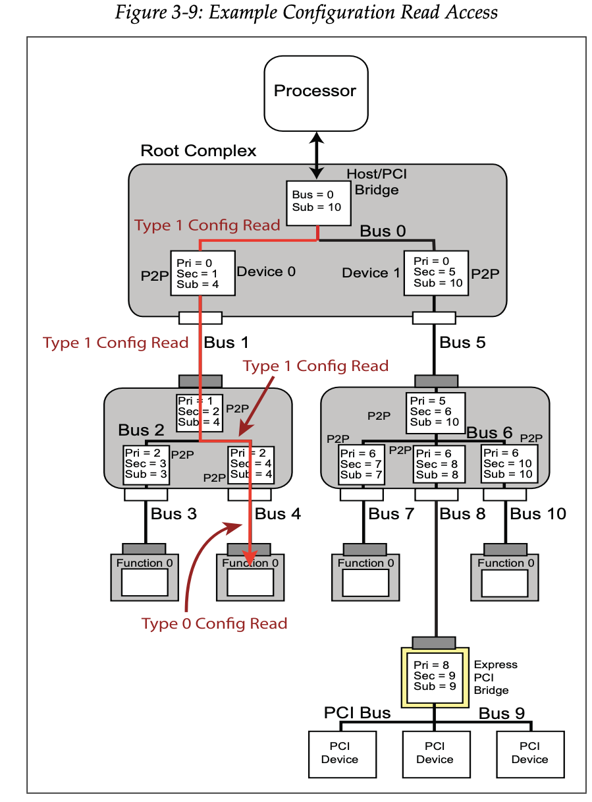
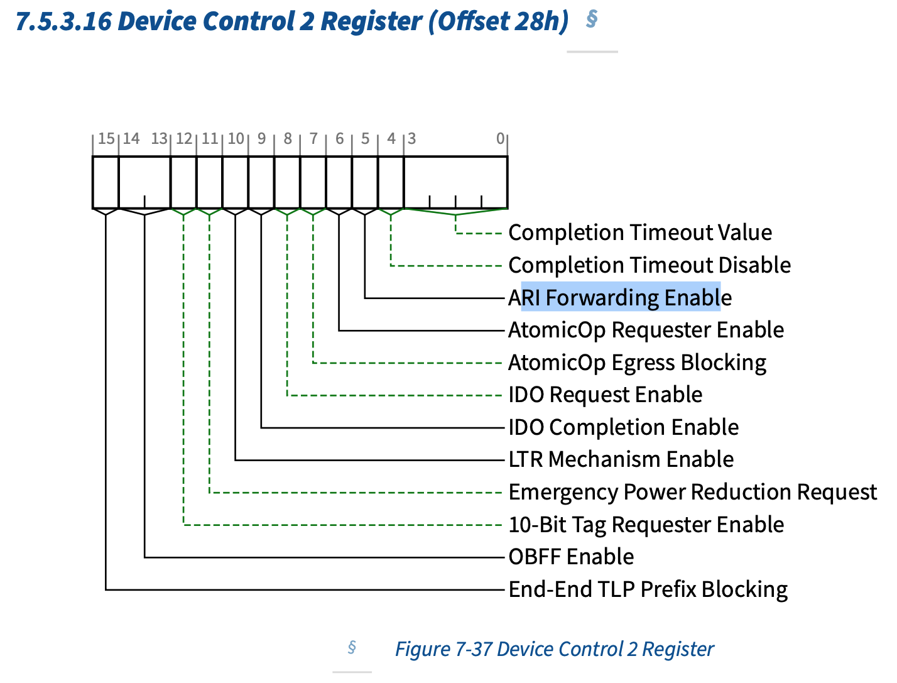
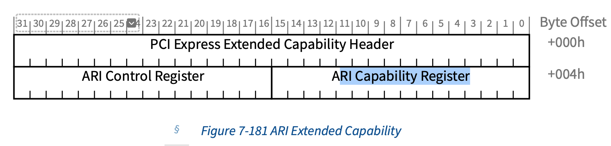
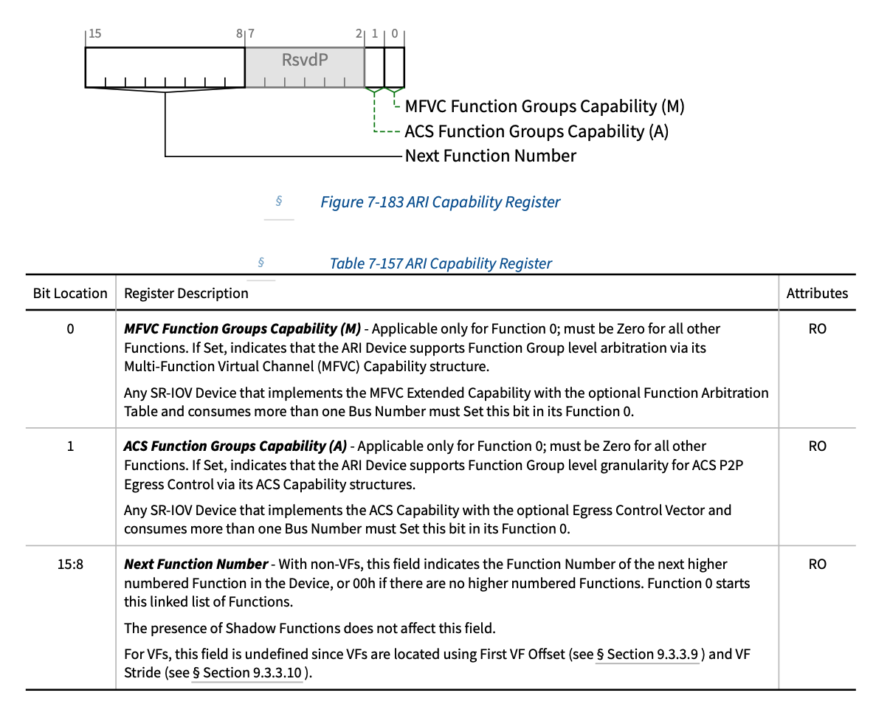
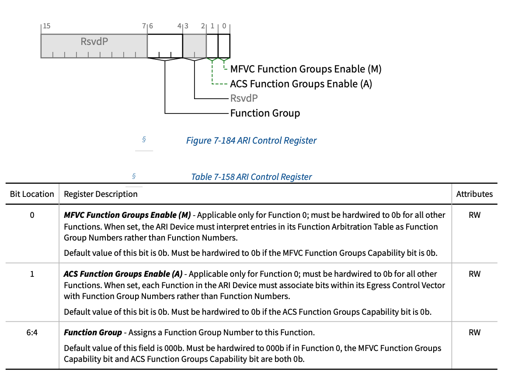
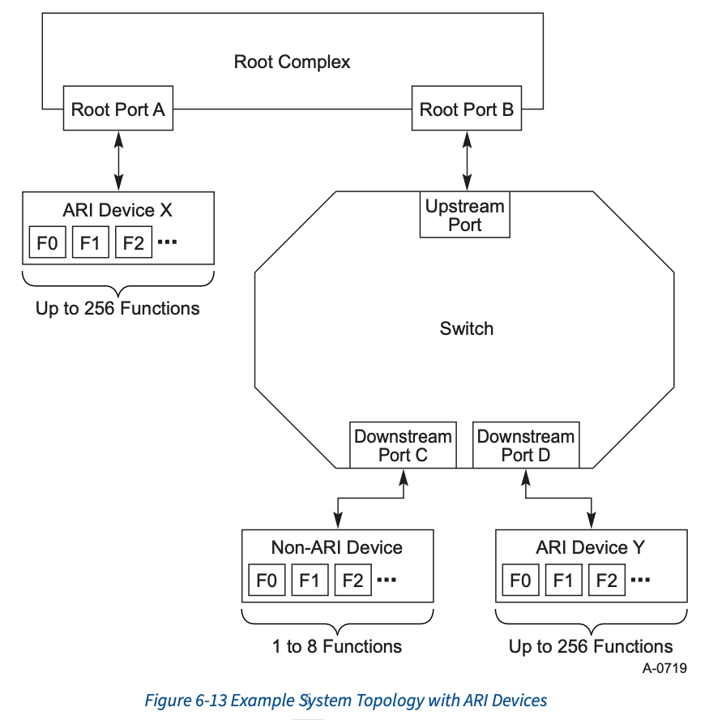

## 现象
PF
```
[root@6-25-33-131 11:28:53 ~]# lspci -vvv -s 08:00.0
08:00.0 Ethernet controller: Mellanox Technologies MT27800 Family [ConnectX-5]
```
执行:
```
echo 8 > /sys/class/infiniband/mlx5_0/device/sriov_numvfs
```
遇到下面错误:
```
[ 2928.754432] mlx5_core 0000:08:01.0: firmware version: 16.35.4506
[ 2929.428680] mlx5_core 0000:08:00.7 ens9f0v5: Link down
[ 2989.756437] mlx5_core 0000:08:01.0: wait_func:1203:(pid 435): ENABLE_HCA(0x104) timeout. Will cause a leak of a command resource
[ 2989.757204] mlx5_core 0000:08:01.0: mlx5_function_enable:1529:(pid 435): enable hca failed
[ 2989.758392] mlx5_core 0000:08:01.0: probe_one:2498:(pid 435): mlx5_init_one failed with error code -110
[ 2989.778817] mlx5_core: probe of 0000:08:01.0 failed with error -110
[ 2989.779505] pci 0000:08:01.1: [15b3:1018] type 00 class 0x020000
[ 2989.784774] pci 0000:08:01.1: Adding to iommu group 126
[ 2989.787596] mlx5_core 0000:08:01.1: firmware version: 16.35.4506
[ 3050.789035] mlx5_core 0000:08:01.1: wait_func:1203:(pid 435): ENABLE_HCA(0x104) timeout. Will cause a leak of a command resource
[ 3050.789831] mlx5_core 0000:08:01.1: mlx5_function_enable:1529:(pid 435): enable hca failed
[ 3050.791042] mlx5_core 0000:08:01.1: probe_one:2498:(pid 435): mlx5_init_one failed with error code -110
[ 3050.811484] mlx5_core: probe of 0000:08:01.1 failed with error -110
```

查看bridge:
```
08:00.0 Ethernet controller: Mellanox Technologies MT27800 Family [ConnectX-5]
08:00.1 Ethernet controller: Mellanox Technologies MT27800 Family [ConnectX-5]
08:00.2 Ethernet controller: Mellanox Technologies MT27800 Family [ConnectX-5 Virtual Function]
08:00.3 Ethernet controller: Mellanox Technologies MT27800 Family [ConnectX-5 Virtual Function]
08:00.4 Ethernet controller: Mellanox Technologies MT27800 Family [ConnectX-5 Virtual Function]
08:00.5 Ethernet controller: Mellanox Technologies MT27800 Family [ConnectX-5 Virtual Function]
08:00.6 Ethernet controller: Mellanox Technologies MT27800 Family [ConnectX-5 Virtual Function]
08:00.7 Ethernet controller: Mellanox Technologies MT27800 Family [ConnectX-5 Virtual Function]
08:01.0 Ethernet controller: Mellanox Technologies MT27800 Family [ConnectX-5 Virtual Function]
08:01.1 Ethernet controller: Mellanox Technologies MT27800 Family [ConnectX-5 Virtual Function]
```
可以看到报错的两个device 被挤到了 device number 1上.
```
[root@6-25-33-131 11:39:15 ~]# lspci -xxx -s 08:01.0
08:01.0 Ethernet controller: Mellanox Technologies MT27800 Family [ConnectX-5 Virtual Function]
00: ff ff ff ff ff ff ff ff ff ff ff ff ff ff ff ff
10: ff ff ff ff ff ff ff ff ff ff ff ff ff ff ff ff
20: ff ff ff ff ff ff ff ff ff ff ff ff ff ff ff ff
30: ff ff ff ff ff ff ff ff ff ff ff ff ff ff ff ff
40: ff ff ff ff ff ff ff ff ff ff ff ff ff ff ff ff
50: ff ff ff ff ff ff ff ff ff ff ff ff ff ff ff ff
60: ff ff ff ff ff ff ff ff ff ff ff ff ff ff ff ff
70: ff ff ff ff ff ff ff ff ff ff ff ff ff ff ff ff
80: ff ff ff ff ff ff ff ff ff ff ff ff ff ff ff ff
90: ff ff ff ff ff ff ff ff ff ff ff ff ff ff ff ff
a0: ff ff ff ff ff ff ff ff ff ff ff ff ff ff ff ff
b0: ff ff ff ff ff ff ff ff ff ff ff ff ff ff ff ff
c0: ff ff ff ff ff ff ff ff ff ff ff ff ff ff ff ff
d0: ff ff ff ff ff ff ff ff ff ff ff ff ff ff ff ff
e0: ff ff ff ff ff ff ff ff ff ff ff ff ff ff ff ff
f0: ff ff ff ff ff ff ff ff ff ff ff ff ff ff ff ff
```
读取配置空间时，发现是全`F`

关于其bridge:
```
[root@6-25-33-131 11:40:20 ~]# lspci -t
-+-[0000:00]-+-00.0
 |           +-1c.4-[08-40]--+-00.0
 |           |               +-00.1
 |           |               +-00.2
 |           |               +-00.3
 |           |               +-00.4
 |           |               +-00.5
 |           |               +-00.6
 |           |               +-00.7
 |           |               +-01.0
 |           |               \-01.1

[root@6-25-33-131 11:46:15 ~]# lspci -s 00:1c.4
00:1c.4 PCI bridge: Intel Corporation C610/X99 series chipset PCI Express Root Port #5 (rev d5)
```

## ID-Routing
访问配置空间是`ID-routing`, 我们来简单看下`ID-routing`, 如下图:



当process 发出对`04:00.0`配置空间的请求时，由RC 将其转换为TLB, 其配置请求最开始
时Type1. 然后匹配了bus 0 switch 中的左边的桥 $bus \in{1, 4}$, 并且发现该bridge
`Sec != Sub`, 所以其下面仍然需要bridge/switch 转发, 仍然保持type1， 然后路由到左
下 switch，匹配到了右边的bridge -- `Pri = 2, Sec = 4, Sub=4`， 此时`Sec == Sub`,
则该bus下的设备就是要访问的设备。

这样的P2P层次就要求, bridge /switch 下的每个port(bus)， 只能有一个device，所以
该`[bus, Device, function]` 组合中`Device`往往等于0（图中的Express Pci Bridge)
除外，这是兼容PCI device的桥。所以PCIe 协议限制 PCIe bridge/switch，只能将
`Device number ==0` 的 TLP 请求，由Type 1 转Type 0. 

我们知道, 在request ID组合中, Device所占用的bit为5, 这些bit 往往不够用了。
又由于引入的SRIOV的机制。$function\_number \in 0,7$将大大限制VF的个数。

于是引入了Alternative Routing-ID Interpretation (ARI)
## Alternative Routing-ID Interpretation

其大概想法是, PCIe bridge 不再只将 `Device number == 0`的TLP 由 `Type 0 ->
Type1`, 其他的 `Device number`也可以。另外Device这边也可以接触限制，一个
`EP`从支持最多7个function增加到支持255个function.

而如果支持这个功能需要software 配置 bridge 和 EP

### ARI configure about BRIDGE



> **ARI Forwarding Enable** - When set, the Downstream Port disables its
> traditional Device Number field being 0 enforcement when turning a Type 1
> Configuration Request into a Type 0 Configuration Request, permitting access
> to Extended Functions in an ARI Device immediately below the Port. See §
> Section 6.13 .
>
> Default value of this bit is 0b. Must be hardwired to 0b if the ARI Forwarding
> Supported bit is 0b. This bit is not applicable and Reserved for Upstream
> Ports.

大概的意思是，该位用于 Downstream port enable/disable ARI 的功能，如果enable将允许
`device number 0` 的 Type 1 请求转换为 Type 0, 否则将不允许。

### API configure about EP

`EP` 这边主要有两个寄存器:



ARI cap reg:





> NOTE
>
> 关于ARI device 的相关配置, 和`Multi-Function VC` 相关，先不关注



上图是支持ARI的一个例子, 其中Root port, switch Downstream port 均支持并使能ARI.
ARI device 最多支持256个function，而non-ari device最多 支持 8个function。

## 确认环境中设备

查看设备:
```
[root@6-25-33-131 14:23:11 ~]# lspci -vvv -s 08:00.0 |grep -i ari
        Capabilities: [150 v1] Alternative Routing-ID Interpretation (ARI)
                ARICap: MFVC- ACS-, Next Function: 1
                ARICtl: MFVC- ACS-, Function Group: 0
                IOVCtl: Enable+ Migration- Interrupt- MSE+ ARIHierarchy- 10BitTagReq-
```
可以发现设备支持ARI.

查看bridge:
```
[root@6-25-33-131 14:23:27 ~]# lspci -vvv -s 00:1c.4 |grep -i ari
        BridgeCtl: Parity- SERR+ NoISA- VGA- VGA16+ MAbort- >Reset- FastB2B-
                         FRS- LN System CLS Not Supported, TPHComp- ExtTPHComp- ARIFwd-
                DevCtl2: Completion Timeout: 50us to 50ms, TimeoutDis- LTR- 10BitTagReq- OBFF Disabled, ARIFwd-
```
bridge 并未开启`ARI forward`

通过进入bios查找其相关选项，并未找到。

而浪潮之前提供的修改/查询bios 工具中可以找到该选项:
```
        "DevAri": "Disabled",
        "AriEn": "Enabled",
        "AriForward": "Disabled",
```

## 带有`ARI forward` 环境举例
```
04:00.0 Infiniband controller: Mellanox Technologies MT28908 Family [ConnectX-6]
04:00.1 Infiniband controller: Mellanox Technologies MT28908 Family [ConnectX-6 Virtual Function]
04:00.2 Infiniband controller: Mellanox Technologies MT28908 Family [ConnectX-6 Virtual Function]
04:00.3 Infiniband controller: Mellanox Technologies MT28908 Family [ConnectX-6 Virtual Function]
04:00.4 Infiniband controller: Mellanox Technologies MT28908 Family [ConnectX-6 Virtual Function]
04:00.5 Infiniband controller: Mellanox Technologies MT28908 Family [ConnectX-6 Virtual Function]
04:00.6 Infiniband controller: Mellanox Technologies MT28908 Family [ConnectX-6 Virtual Function]
04:00.7 Infiniband controller: Mellanox Technologies MT28908 Family [ConnectX-6 Virtual Function]
04:01.0 Infiniband controller: Mellanox Technologies MT28908 Family [ConnectX-6 Virtual Function]
04:01.1 Infiniband controller: Mellanox Technologies MT28908 Family [ConnectX-6 Virtual Function]
04:01.2 Infiniband controller: Mellanox Technologies MT28908 Family [ConnectX-6 Virtual Function]
04:01.3 Infiniband controller: Mellanox Technologies MT28908 Family [ConnectX-6 Virtual Function]
04:01.4 Infiniband controller: Mellanox Technologies MT28908 Family [ConnectX-6 Virtual Function]
04:01.5 Infiniband controller: Mellanox Technologies MT28908 Family [ConnectX-6 Virtual Function]
04:01.6 Infiniband controller: Mellanox Technologies MT28908 Family [ConnectX-6 Virtual Function]
04:01.7 Infiniband controller: Mellanox Technologies MT28908 Family [ConnectX-6 Virtual Function]
84:00.0 Infiniband controller: Mellanox Technologies MT28908 Family [ConnectX-6]
84:00.1 Infiniband controller: Mellanox Technologies MT28908 Family [ConnectX-6 Virtual Function]
84:00.2 Infiniband controller: Mellanox Technologies MT28908 Family [ConnectX-6 Virtual Function]
84:00.3 Infiniband controller: Mellanox Technologies MT28908 Family [ConnectX-6 Virtual Function]
84:00.4 Infiniband controller: Mellanox Technologies MT28908 Family [ConnectX-6 Virtual Function]
84:00.5 Infiniband controller: Mellanox Technologies MT28908 Family [ConnectX-6 Virtual Function]
84:00.6 Infiniband controller: Mellanox Technologies MT28908 Family [ConnectX-6 Virtual Function]
84:00.7 Infiniband controller: Mellanox Technologies MT28908 Family [ConnectX-6 Virtual Function]
84:01.0 Infiniband controller: Mellanox Technologies MT28908 Family [ConnectX-6 Virtual Function]
84:01.1 Infiniband controller: Mellanox Technologies MT28908 Family [ConnectX-6 Virtual Function]
84:01.2 Infiniband controller: Mellanox Technologies MT28908 Family [ConnectX-6 Virtual Function]
84:01.3 Infiniband controller: Mellanox Technologies MT28908 Family [ConnectX-6 Virtual Function]
84:01.4 Infiniband controller: Mellanox Technologies MT28908 Family [ConnectX-6 Virtual Function]
84:01.5 Infiniband controller: Mellanox Technologies MT28908 Family [ConnectX-6 Virtual Function]
84:01.6 Infiniband controller: Mellanox Technologies MT28908 Family [ConnectX-6 Virtual Function]
84:01.7 Infiniband controller: Mellanox Technologies MT28908 Family [ConnectX-6 Virtual Function]
```
可以看到，`04:00.0` 和 `84:00.0`两个ib卡，均已分出了超过8个VF

查看这两个所在的tree
```
[root@6-25-33-131 11:36:02 ~]# lspci -t -s 04:00.0
-[0000:00]---03.0-[04]----00.0
[root@6-25-33-131 11:36:15 ~]# lspci -t -s 84:00.0
-[0000:80]---02.0-[84]----00.0
```
查看这两个bridge是否有ari fwd feature enable
```
[root@6-25-33-131 11:36:56 ~]# lspci -vvv -s 00:03.0 |grep -i ari
        BridgeCtl: Parity- SERR+ NoISA- VGA- VGA16+ MAbort- >Reset- FastB2B-
                         FRS- LN System CLS Not Supported, TPHComp+ ExtTPHComp- ARIFwd+
                DevCtl2: Completion Timeout: 50us to 50ms, TimeoutDis- LTR- 10BitTagReq- OBFF Disabled, ARIFwd+
[root@6-25-33-131 11:36:59 ~]# lspci -vvv -s 80:02.0 |grep -i ari
        BridgeCtl: Parity- SERR+ NoISA- VGA- VGA16+ MAbort- >Reset- FastB2B-
                         FRS- LN System CLS Not Supported, TPHComp+ ExtTPHComp- ARIFwd+
                DevCtl2: Completion Timeout: 50us to 50ms, TimeoutDis- LTR- 10BitTagReq- OBFF Disabled, ARIFwd+
```

可以看到都有.

## 参考链接
1. [【PCIe】PCIe ARI介绍](https://zhuanlan.zhihu.com/p/690179350)
2. [PCIe扫盲——TLP路由之ID Routing](https://blog.chinaaet.com/justlxy/p/5100053324)
3. PCIe 6.0 spec
