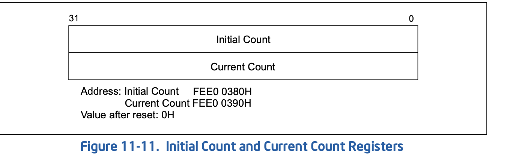

## 查看异常堆栈
```
#10 [fffffe0000900ec8] do_nmi at ffffffff8e62733f
#11 [fffffe0000900ef0] end_repeat_nmi at ffffffff8f0015a4
    [exception RIP: advance_periodic_target_expiration+77]
    RIP: ffffffffc0d46d4d  RSP: ff4f88f5d98d8ef0  RFLAGS: 00000046
    RAX: fff0103f91be678e  RBX: fff0103f91be678e  RCX: 00843a7d9e127bcc
    RDX: 0000000000000002  RSI: 0052ca4003697505  RDI: ff440d5bfbdbd500
    RBP: ff440d5956f99200   R8: ff2ff2a42deb6a84   R9: 000000000002a6c0
    R10: 0122d794016332b3  R11: 0000000000000000  R12: ff440db1af39cfc0
    R13: ff440db1af39cfc0  R14: ffffffffc0d4a560  R15: ff440db1af39d0f8
    ORIG_RAX: ffffffffffffffff  CS: 0010  SS: 0018
--- <NMI exception stack> ---
#12 [ff4f88f5d98d8ef0] advance_periodic_target_expiration at ffffffffc0d46d4d [kvm]
#13 [ff4f88f5d98d8f00] apic_timer_fn at ffffffffc0d4a591 [kvm]
#14 [ff4f88f5d98d8f18] __hrtimer_run_queues at ffffffff8e784900
#15 [ff4f88f5d98d8f78] hrtimer_interrupt at ffffffff8e7853d0
#16 [ff4f88f5d98d8fd8] smp_apic_timer_interrupt at ffffffff8f0026ba
#17 [ff4f88f5d98d8ff0] apic_timer_interrupt at ffffffff8f001c4f
--- <IRQ stack> ---
#18 [ff4f88f5f144fc58] apic_timer_interrupt at ffffffff8f001c4f
    [exception RIP: vcpu_enter_guest+2501]
    RIP: ffffffffc0d35eb5  RSP: ff4f88f5f144fd00  RFLAGS: 00000206
    RAX: 0000000000000030  RBX: ff440d5bfbdbd500  RCX: 0122d79401632f1f
    RDX: 000000000122d794  RSI: ff2ff2a42deb6a84  RDI: ff440d5bfbdbd500
    RBP: ff4f88f5f144fd98   R8: 0000000000000000   R9: 0000000000000000
    R10: 0000000000000000  R11: 0000000000000000  R12: 0000000000000000
    R13: 0000000000000000  R14: 0014975e8048c01a  R15: 0000000000000246
    ORIG_RAX: ffffffffffffff13  CS: 0010  SS: 0018
#19 [ff4f88f5f144fda0] kvm_arch_vcpu_ioctl_run at ffffffffc0d3940f [kvm]
#20 [ff4f88f5f144fdd0] kvm_vcpu_ioctl at ffffffffc0d12738 [kvm]
#21 [ff4f88f5f144fe80] do_vfs_ioctl at ffffffff8e9552f4
#22 [ff4f88f5f144fef8] ksys_ioctl at ffffffff8e955930
#23 [ff4f88f5f144ff30] __x64_sys_ioctl at ffffffff8e955976
#24 [ff4f88f5f144ff38] do_syscall_64 at ffffffff8e60430b
#25 [ff4f88f5f144ff50] entry_SYSCALL_64_after_hwframe at ffffffff8f0000ad
    RIP: 00007f04e094162b  RSP: 00007f04a6ffc628  RFLAGS: 00000246
    RAX: ffffffffffffffda  RBX: 000055acf74f7240  RCX: 00007f04e094162b
    RDX: 0000000000000000  RSI: 000000000001ae80  RDI: 0000000000000025
    RBP: 000055acf75041c0   R8: 000055acf525a948   R9: 0000000000000000
    R10: 0000000000000000  R11: 0000000000000246  R12: 000055acf503fec0
    R13: 000055acf528b2a0  R14: 00007ffc83056a50  R15: 00007f04e4027000
    ORIG_RAX: 0000000000000010  CS: 0033  SS: 002b
```

时钟中断触发的时间点:
```
0xffffffffc0d35e9e <vcpu_enter_guest+2478>:     mov    %rbx,%rdi
0xffffffffc0d35ea1 <vcpu_enter_guest+2481>:     call   0xffffffff8f201210 <__x86_indirect_thunk_rax>
0xffffffffc0d35ea6 <vcpu_enter_guest+2486>:     mov    %rbx,%gs:0x3f2f8322(%rip)        # 0x2e1d0
0xffffffffc0d35eae <vcpu_enter_guest+2494>:     sti
0xffffffffc0d35eaf <vcpu_enter_guest+2495>:     nopw   0x0(%rax,%rax,1)
0xffffffffc0d35eb5 <vcpu_enter_guest+2501>:     addq   $0x1,0x2038(%rbx)
```
（有待进一步分析)

而触发的timer是`periodic` timer, 该timer机制和tsc-deadline机制不同, 首先将 `inital
count` copy到 `Current counter`, 然后，按照根据`Divide Configuration Register` 
调整频率，按照该频率自减, 当减少到0后，触发时钟中断，再将`initial` copy到
`current`, 一直周期性循环。



## 进一步分析堆栈
`advance_periodic_target_expiration()`函数:
```cpp
static void advance_periodic_target_expiration(struct kvm_lapic *apic)
{
    //取now()
    ktime_t now = ktime_get();
    //取tsc
    u64 tscl = rdtsc();
    ktime_t delta;

    /*
     * Synchronize both deadlines to the same time source or
     * differences in the periods (caused by differences in the
     * underlying clocks or numerical approximation errors) will
     * cause the two to drift apart over time as the errors
     * accumulate.
     *
     * 将两个截止时间同步到同一个时间源，否则，由于底层时钟的差异
     * 或数值近似误差导致的周期差异，会随着时间推移逐渐积累，最终导
     * 致两者之间产生偏移。
     */

    apic->lapic_timer.target_expiration =
        ktime_add_ns(apic->lapic_timer.target_expiration,
                apic->lapic_timer.period);
    delta = ktime_sub(apic->lapic_timer.target_expiration, now);
    apic->lapic_timer.tscdeadline = kvm_read_l1_tsc(apic->vcpu, tscl) +
        nsec_to_cycles(apic->vcpu, delta);
}
```

获取相关apic:
```
0xffffffffc0d4a588 <apic_timer_fn+40>:  ret
0xffffffffc0d4a589 <apic_timer_fn+41>:  mov    %rbp,%rdi -- apic
0xffffffffc0d4a58c <apic_timer_fn+44>:  call   0xffffffffc0d46d00 <advance_periodic_target_expiration>

0xffffffffc0d46d00 <advance_periodic_target_expiration>:        nopl   0x0(%rax,%rax,1) [FTRACE NOP]
0xffffffffc0d46d05 <advance_periodic_target_expiration+5>:      push   %rbp --apic
0xffffffffc0d46d06 <advance_periodic_target_expiration+6>:      mov    %rdi,%rbp
0xffffffffc0d46d09 <advance_periodic_target_expiration+9>:      push   %rbx

#12 [ff4f88f5d98d8ef0] advance_periodic_target_expiration at ffffffffc0d46d4d [kvm]
    ff4f88f5d98d8ef8: ff440d5956f99200[apic] ffffffffc0d4a591[pc]

crash> dis -l advance_periodic_target_expiration
/usr/src/debug/kernel-4.18.0-372.19.1.el8_6/linux-4.18.0-372.19.1.es8_10.x86_64/arch/x86/kvm/lapic.c: 1797
0xffffffffc0d46d00 <advance_periodic_target_expiration>:        nopl   0x0(%rax,%rax,1) [FTRACE NOP]
/usr/src/debug/kernel-4.18.0-372.19.1.el8_6/linux-4.18.0-372.19.1.es8_10.x86_64/arch/x86/kvm/lapic.c: 1798
0xffffffffc0d46d05 <advance_periodic_target_expiration+5>:      push   %rbp
0xffffffffc0d46d06 <advance_periodic_target_expiration+6>:      mov    %rdi,%rbp
0xffffffffc0d46d09 <advance_periodic_target_expiration+9>:      push   %rbx
0xffffffffc0d46d0a <advance_periodic_target_expiration+10>:     call   0xffffffff8e7872b0 <ktime_get>
0xffffffffc0d46d0f <advance_periodic_target_expiration+15>:     mov    %rax,%rcx       ## now() rcx
/usr/src/debug/kernel-4.18.0-372.19.1.el8_6/linux-4.18.0-372.19.1.es8_10.x86_64/./arch/x86/include/asm/msr.h: 205
0xffffffffc0d46d12 <advance_periodic_target_expiration+18>:     rdtsc ## 保存在 rdx:rax
/usr/src/debug/kernel-4.18.0-372.19.1.el8_6/linux-4.18.0-372.19.1.es8_10.x86_64/arch/x86/kvm/lapic.c: 1809
0xffffffffc0d46d14 <advance_periodic_target_expiration+20>:     mov    0x60(%rbp),%rbx ## lapic.lapic_timer.period
0xffffffffc0d46d18 <advance_periodic_target_expiration+24>:     add    0x68(%rbp),%rbx ## target_expiration = period + target_expiration
/usr/src/debug/kernel-4.18.0-372.19.1.el8_6/linux-4.18.0-372.19.1.es8_10.x86_64/./arch/x86/include/asm/msr.h: 207
0xffffffffc0d46d1c <advance_periodic_target_expiration+28>:     shl    $0x20,%rdx      ## 拼接 tscl
/usr/src/debug/kernel-4.18.0-372.19.1.el8_6/linux-4.18.0-372.19.1.es8_10.x86_64/arch/x86/kvm/lapic.c: 1809
0xffffffffc0d46d20 <advance_periodic_target_expiration+32>:     mov    %rbx,0x68(%rbp) ## 获取更新后的 target_expiration
/usr/src/debug/kernel-4.18.0-372.19.1.el8_6/linux-4.18.0-372.19.1.es8_10.x86_64/arch/x86/kvm/lapic.c: 1812
0xffffffffc0d46d24 <advance_periodic_target_expiration+36>:     mov    %rdx,%rsi
/usr/src/debug/kernel-4.18.0-372.19.1.el8_6/linux-4.18.0-372.19.1.es8_10.x86_64/arch/x86/kvm/lapic.c: 1813
0xffffffffc0d46d27 <advance_periodic_target_expiration+39>:     mov    0xa8(%rbp),%rdi ## apic->vcpu
/usr/src/debug/kernel-4.18.0-372.19.1.el8_6/linux-4.18.0-372.19.1.es8_10.x86_64/arch/x86/kvm/lapic.c: 1812
0xffffffffc0d46d2e <advance_periodic_target_expiration+46>:     sub    %rcx,%rbx       ## delta = target_expiration - now()
/usr/src/debug/kernel-4.18.0-372.19.1.el8_6/linux-4.18.0-372.19.1.es8_10.x86_64/arch/x86/kvm/lapic.c: 1813
0xffffffffc0d46d31 <advance_periodic_target_expiration+49>:     or     %rax,%rsi       ## 拼接 tscl 完成
0xffffffffc0d46d34 <advance_periodic_target_expiration+52>:     call   0xffffffffc0d1d670 <kvm_read_l1_tsc>
/usr/src/debug/kernel-4.18.0-372.19.1.el8_6/linux-4.18.0-372.19.1.es8_10.x86_64/arch/x86/kvm/lapic.c: 1814
0xffffffffc0d46d39 <advance_periodic_target_expiration+57>:     mov    0xa8(%rbp),%rdi
/usr/src/debug/kernel-4.18.0-372.19.1.el8_6/linux-4.18.0-372.19.1.es8_10.x86_64/arch/x86/kvm/x86.h: 352
0xffffffffc0d46d40 <advance_periodic_target_expiration+64>:     mov    %rax,%rsi       ## rsi 为 guest tsc
/usr/src/debug/kernel-4.18.0-372.19.1.el8_6/linux-4.18.0-372.19.1.es8_10.x86_64/./arch/x86/include/asm/pvclock.h: 52
0xffffffffc0d46d43 <advance_periodic_target_expiration+67>:     mov    %rbx,%rax
/usr/src/debug/kernel-4.18.0-372.19.1.el8_6/linux-4.18.0-372.19.1.es8_10.x86_64/arch/x86/kvm/x86.h: 352
0xffffffffc0d46d46 <advance_periodic_target_expiration+70>:     movsbl 0xe22(%rdi),%edx
/usr/src/debug/kernel-4.18.0-372.19.1.el8_6/linux-4.18.0-372.19.1.es8_10.x86_64/./arch/x86/include/asm/pvclock.h: 51
0xffffffffc0d46d4d <advance_periodic_target_expiration+77>:     mov    %edx,%ecx
```
结合`lapic_timer`得到的结果为:

```
crash> struct kvm_lapic ff440d5956f99200 |grep -E 'period|expiration|tscdead'
    period = 1739904,
    target_expiration = 32733273709929306,
    tscdeadline = 10135384616420291996,
    expired_tscdeadline = 0,

rcx : now = 00843a7d9e127bcc = 37219008123141068
## 电表倒转
rbx : delta : fff0103f91be678e = (-4485734413211762)
delta = target_expiration - now = 32733273709929306 - 37219008123141068 = -4485734413211762 
RSI : 0052ca4003697505(guest_counter)
```

## KVM timer
KVM timer有两个, hv timer 和sw timer，hv timer使用的是VMX支持的, `VMX-Preemption Timer`.
`VMX-Preemption` timer 只能在VMX non-root operation 下工作，所以，如果VM使用`VMX-Preemption 
Timer`, 在vcpu_block时，仍有pending的hv_timer, 需要将其转换为`sw timer`

而 KVM 也可以只是用`sw timer`, `sw timer`是使用hrtimer模拟的. 而能不能使用 `hv_timer`由
模块参数`preemption_timer`控制
```cpp
module_param_named(preemption_timer, enable_preemption_timer, bool, S_IRUGO);

crash> p enable_preemption_timer
enable_preemption_timer = $96 = true
```
可以发现，可以使用`hv_timer`

而当前堆栈可以看出，使用的是`sw timer`, 并且该timer发生在`vcpu_enter_guest`的上下文, 完全有能力
使用`hv_timer`:
```cpp
vmx_post_block
|-> kvm_lapic_switch_to_hv_timer
    |-> restart_apic_timer
        |-> if (!start_hv_timer(apic))
            |-> start_sw_timer()
```
从上面可以看出, 可能是`hv_timer` 返回出错了，导致只能使用`sw timer`

其中在`vmx_set_hv_timer`, 获取判断当前的delta 是否很大，如果很大，则没必要来回切
`sw && hv timer`, 因为`hv timer`本来就相当于`vtimer`的fastpath. 那既然都不会因为
timer expired 而vm-exit, 就没有必要来回切timer了
```sh
vmx_set_hv_timer(,guest_deadline_tsc, )
|-> tscl = rdtsc();
|-> guest_tscl = kvm_read_l1_tsc(vcpu, tscl);
|-> delta_tsc = max(guest_deadline_tsc, guest_tscl) - guest_tscl;
    |-> if (delta_tsc >> (cpu_preemption_timer_multi + 32))
        |-> return -ERANGE;
```

而上面我们知道`delta`非常大，因为`guest_deadline_tsc`已经是负数了。
所以其最高位是63 bit，肯定`> 39`.

所以，这时候就要使用`sw timer`模拟, 而使用`sw timer` 模拟，就会使用非常
小的`target_expiration`做累加，然后很快的就到期，周而复始。

**现在的关键点是, 为什么target_expiration 是一个如此低的值呢(相比now来说)**

## 查看代码

period timer 和其他的timer不同, 其会周期性的触发timer。所以其开启是，就要根据
`initical counter` 配置"vtimer"
```cpp
set_target_expiration()
|-> u64 tscl = rdtsc();
|-> now = ktime_get();
|-> apic->lapic_timer.period =
         tmict_to_ns(apic, kvm_lapic_get_reg(apic, APIC_TMICT));
|-> deadline = apic->lapic_timer.period
|-> apic->lapic_timer.tscdeadline = kvm_read_l1_tsc(apic->vcpu, tscl) +
      nsec_to_cycles(apic->vcpu, deadline);
|-> apic->lapic_timer.target_expiration = ktime_add_ns(now, deadline);
```
这里，将hv, sw timer配置好了，当模拟的timer到期时，再更新两个timer更新, 
以software timer expired 为例:

```sh
apic_timer_fn
## 时钟到期, 注入 vtimer中断
|-> apic_timer_expired(apic, true);
|-> if (lapic_is_periodic(apic))
    |-> advance_periodic_target_expiration
        ## 更新target_expiration
        |-> apic->lapic_timer.target_expiration =
            ktime_add_ns(apic->lapic_timer.target_expiration,
                apic->lapic_timer.period);
        ## 获取delta，不过这里假定 delta 一定会大于零
        |-> delta = ktime_sub(apic->lapic_timer.target_expiration, now);
        ## 将tscdeadline 加上delta, 这样保持hw timer, 和software timer 保持一致
        |-> apic->lapic_timer.tscdeadline = kvm_read_l1_tsc(apic->vcpu, tscl) +
                nsec_to_cycles(apic->vcpu, delta);
    ## 更新hrtimer
    |-> hrtimer_add_expires_ns(&ktimer->timer, ktimer->period);
        |-> return HRTIMER_RESTART;
```
所以`target_expiration`会持续的更新，但是这里有一个问题，其和`now()`之间的`delta`是
不是相对稳定的，或者说，会不会落后太多。

答: 不会，因为sw timer一直是和clock 对标。如果其到期时间特别小，会频繁触发timer
来追赶当前时间（就跟case中的一样），而hv timer 则会根据到期时间和now进行调整，保
证了hv timer和sw timer 一致。

## 附录
### 获取其他成员
```
vcpu:
crash> struct kvm_lapic.vcpu ff440d5956f99200
  vcpu = 0xff440d5bfbdbd500,

kvm:
crash> struct kvm_vcpu.kvm 0xff440d5bfbdbd500
  kvm = 0xff4f88f5f59c9000,

l1_tsc_offset:
crash> struct kvm_vcpu.arch 0xff440d5bfbdbd500 |grep l1_tsc_offset
    l1_tsc_offset = 18388182590535985796,
crash> eval 18388182590535985796
hexadecimal: ff2ff2a42deb6a84
    decimal: 18388182590535985796  (-58561483173565820)

tsc_scaling_ratio
crash> struct kvm_vcpu.arch 0xff440d5bfbdbd500 |grep tsc_scaling_ratio
    l1_tsc_scaling_ratio = 281474976710656,
    tsc_scaling_ratio = 281474976710656,
crash> p kvm_default_tsc_scaling_ratio
kvm_default_tsc_scaling_ratio = $3 = 281474976710656
crash> struct kvm_vcpu.arch 0xff440d5bfbdbd500  |grep -E 'virtual_tsc_mult|virtual_tsc_shift'
    virtual_tsc_shift = 2 '\002',
    virtual_tsc_mult = 2356694726,
```


### hrtimer
#### hrtimer cpu 45
```
crash> p hrtimer_bases |grep 45
  [45]: ff440db1af39cfc0
crash> struct hrtimer_cpu_base.clock_base ff440db1af39cfc0 -o
struct hrtimer_cpu_base {
  [ff440db1af39d000] struct hrtimer_clock_base clock_base[8];
}
crash> struct hrtimer_clock_base.active ff440db1af39d000 -o
struct hrtimer_clock_base {
  [ff440db1af39d020] struct timerqueue_head active;
}
crash> tree -t rbtree ff440db1af39d020 -r timerqueue_node.node -S timerqueue_node
ff440db1af39d600
struct timerqueue_node {
  node = {
    __rb_parent_color = 1,
    rb_right = 0xff440db1af39d7e0,
    rb_left = 0x0
  },
  expires = 37218992804000000
}
ff440db1af39d7e0
struct timerqueue_node {
  node = {
    __rb_parent_color = 18393841834888123904,
    rb_right = 0x0,
    rb_left = 0x0
  },
  expires = 37218996343000000
}

crash> struct kvm_lapic ff440d5956f99200
struct kvm_lapic {
  base_address = 4276092928,
  dev = {
    ops = 0xffffffffc0d79160 <apic_mmio_ops>
  },
  lapic_timer = {
    timer = {
      node = {
        node = {
          __rb_parent_color = 18393841455450395152,
          rb_right = 0x0,
          rb_left = 0x0
        },
        expires = 32733273708189402
      },
      _softexpires = 32733273708189402,
      function = 0xffffffffc0d4a560 <apic_timer_fn>,
      base = 0xff440db1af39d000,
      state = 0 '\000',
      is_rel = 0 '\000',
      is_soft = 0 '\000',
      is_hard = 1 '\001',
      hrtimer_size_rh = 0,
      _rh = 0x0
    },
    period = 1739904,
    target_expiration = 32733273709929306,
    timer_mode = 131072,
    timer_mode_mask = 393216,
    tscdeadline = 10135384616420291996,
    expired_tscdeadline = 0,
    timer_advance_ns = 2836,
    advance_expire_delta = 10582308149557745,
    pending = {
      counter = 1
    },
    hv_timer_in_use = false
  },

```

#### hrtimer cpu 49
```
crash> p hrtimer_bases |grep 49
  [49]: ff440db1af41cfc0
crash> struct hrtimer_cpu_base.clock_base ff440db1af41cfc0 -o
struct hrtimer_cpu_base {
  [ff440db1af41d000] struct hrtimer_clock_base clock_base[8];
}
crash> struct hrtimer_clock_base.active ff440db1af41d000 -o
struct hrtimer_clock_base {
  [ff440db1af41d020] struct timerqueue_head active;
}
crash> tree -t rbtree ff440db1af41d020 -r timerqueue_node.node -S timerqueue_node
ff440d5760b79470
struct timerqueue_node {
  node = {
    __rb_parent_color = 1,
    rb_right = 0xff4f88f5db19ba70,
    rb_left = 0xff440db1af41d600
  },
  expires = 37218992856218969
}
ff440db1af41d600
struct timerqueue_node {
  node = {
    __rb_parent_color = 18393841447023907953,
    rb_right = 0x0,
    rb_left = 0x0
  },
  expires = 37218992804000000
}
ff4f88f5db19ba70
struct timerqueue_node {
  node = {
    __rb_parent_color = 18393841447023907953,
    rb_right = 0x0,
    rb_left = 0xff440db1af41d7e0
  },
  expires = 39366476203259139
}
ff440db1af41d7e0
struct timerqueue_node {
  node = {
    __rb_parent_color = 18397073592356026992,
    rb_right = 0x0,
    rb_left = 0x0
  },
  expires = 37218996361000000
}

## next timer

crash> struct hrtimer_cpu_base.next_timer ff440db1af41cfc0
  next_timer = 0xff440d5cca6abe10,
struct kvm_lapic {
  base_address = 4276092928,
  dev = {
    ops = 0xffffffffc0d79160 <apic_mmio_ops>
  },
  lapic_timer = {
    timer = {
      node = {
        node = {
          __rb_parent_color = 18393841470272093712,
          rb_right = 0x0,
          rb_left = 0x0
        },
        expires = 32729147389809510
      },
      _softexpires = 32729147389809510,
      function = 0xffffffffc0d4a560 <apic_timer_fn>,
      base = 0xff440db1af41d000,
      state = 0 '\000',
      is_rel = 0 '\000',
      is_soft = 0 '\000',
      is_hard = 1 '\001',
      hrtimer_size_rh = 0,
      _rh = 0x0
    },
    period = 1739904,
    target_expiration = 32729147389809510,
    timer_mode = 131072,
    timer_mode_mask = 393216,
    tscdeadline = 10135375559799280917,
    expired_tscdeadline = 0,
    timer_advance_ns = 2384,
    advance_expire_delta = 10582308150240497,
    pending = {
      counter = 1
    },
    hv_timer_in_use = false
  },
  divide_count = 128,
```
