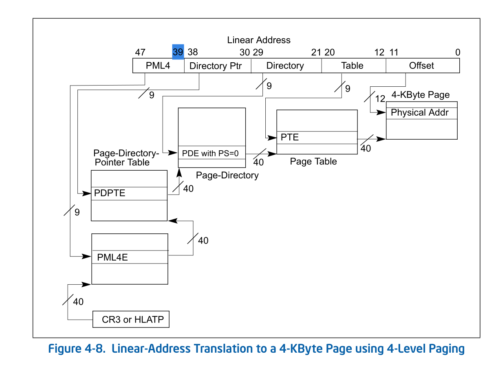
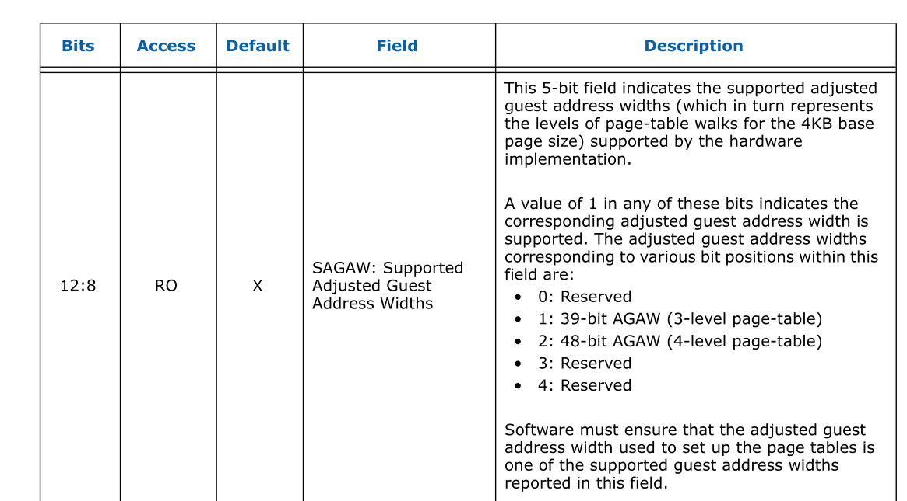

# 代码流程
我们只看下`md_domain_init`和`prepare_domain_attach_device`
相关代码

## md_domain_init
```cpp
#define DEFAULT_DOMAIN_ADDRESS_WIDTH 57

static int md_domain_init(struct dmar_domain *domain, int guest_width)
{
        int adjust_width;

        /* calculate AGAW */
        domain->gaw = guest_width;
        adjust_width = guestwidth_to_adjustwidth(guest_width);
        domain->agaw = width_to_agaw(adjust_width);

        domain->iommu_coherency = 0;
        domain->iommu_snooping = 0;
        domain->iommu_superpage = 0;
        domain->max_addr = 0;

        /* always allocate the top pgd */
        domain->pgd = (struct dma_pte *)alloc_pgtable_page(domain->nid);
        if (!domain->pgd)
                return -ENOMEM;
        domain_flush_cache(domain, domain->pgd, PAGE_SIZE);
        return 0;
}

static struct iommu_domain *intel_iommu_domain_alloc(unsigned type)
{
        struct dmar_domain *dmar_domain;
        struct iommu_domain *domain;

        switch (type) {
        case IOMMU_DOMAIN_DMA:
        case IOMMU_DOMAIN_UNMANAGED:
		...
		if (md_domain_init(dmar_domain, DEFAULT_DOMAIN_ADDRESS_WIDTH)) {
			...
		}
	}
	...
```
可见，这里调整为一个固定的值，那为什么还要调整呢?
我们看下相关函数
```cpp
static inline int guestwidth_to_adjustwidth(int gaw)
{
        int agaw;
        int r = (gaw - 12) % 9;

        if (r == 0)
                agaw = gaw;
        else
                agaw = gaw + 9 - r;
        if (agaw > 64)
                agaw = 64;
        return agaw;
}

```
这里的gaw实际上是bit width, 12代表大小4096
9实际上代表每级页表代表的地址宽度：



所以为了补足地址宽度，例如，如果传进来的值在(48, 39)，则会
计算为48。
```cpp
#define LEVEL_STRIDE            (9)
static inline int width_to_agaw(int width)
{
        return DIV_ROUND_UP(width - 30, LEVEL_STRIDE);
}
```


结合agaw，4-level-pgtable的图可以看出，30代表2-level,
39代表3level, 这样计算出的39正好为1, 48正好为2。满足了与
iommu Capability Register SAGAW(support adjust guest 
address width) 关系。

**所以, 该函数并未按照cap reg中的mgaw和 sagaw寄存器调整**

##  prepare_domain_attach_device
```cpp
static int prepare_domain_attach_device(struct iommu_domain *domain,
                                        struct device *dev)
{
        struct dmar_domain *dmar_domain = to_dmar_domain(domain);
        struct intel_iommu *iommu;
        int addr_width;

        iommu = device_to_iommu(dev, NULL, NULL);
        if (!iommu)
                return -ENODEV;

        /* check if this iommu agaw is sufficient for max mapped address */
        addr_width = agaw_to_width(iommu->agaw);
        if (addr_width > cap_mgaw(iommu->cap))
                addr_width = cap_mgaw(iommu->cap);

        if (dmar_domain->max_addr > (1LL << addr_width)) {
                dev_err(dev, "%s: iommu width (%d) is not "
                ¦       "sufficient for the mapped address (%llx)\n",
                ¦       __func__, addr_width, dmar_domain->max_addr);
                return -EFAULT;
        }
        dmar_domain->gaw = addr_width;

        /*
        ¦* Knock out extra levels of page tables if necessary
        ¦*/
        while (iommu->agaw < dmar_domain->agaw) {
                struct dma_pte *pte;

                pte = dmar_domain->pgd;
                if (dma_pte_present(pte)) {
                        dmar_domain->pgd = (struct dma_pte *)
                                phys_to_virt(dma_pte_addr(pte));
                        free_pgtable_page(pte);
                }
                dmar_domain->agaw--;
        }

        return 0;
}
```
可以这里比对了`iommu->agaw`和`cap_mgaw(iommu->cap)`, 取得了两者之间的最小值。
同时在下面的while循环中调整`dmar_domain->agaw`使其大于等于`iommu->agaw`

而iommu->agaw在哪里赋值的呢
```cpp
//alloc_iommu
//	iommu_calculate_agaw
#define DEFAULT_DOMAIN_ADDRESS_WIDTH 57
int iommu_calculate_agaw(struct intel_iommu *iommu)
{
        return __iommu_calculate_agaw(iommu, DEFAULT_DOMAIN_ADDRESS_WIDTH);
}

static int __iommu_calculate_agaw(struct intel_iommu *iommu, int max_gaw
{
        unsigned long sagaw;
        int agaw = -1;

        sagaw = cap_sagaw(iommu->cap);
        for (agaw = width_to_agaw(max_gaw);
        ¦    agaw >= 0; agaw--) {
                if (test_bit(agaw, &sagaw))
                        break;
        }

        return agaw;
}
```
可见, 该函数是获取了sagaw中最接近 `DEFAULT_DOMAIN_ADDRESS_WIDTH`
的值(也就是最大值), 但是这个值并未和mgaw比较。

所以才有了上面的逻辑。
当面的逻辑实际上计算的值为
```
dmar_domain->gaw = min(iommu->sagaw, iommu->mgaw)
dmar_domain->agaw = min(dmar_domain->agaw, iommu->sagaw, iommu->mgaw)
```
所以这里获取的值，一定小于等于`sagaw`, `mgaw`。

综上所述，372 kernel 解决了这一问题。
