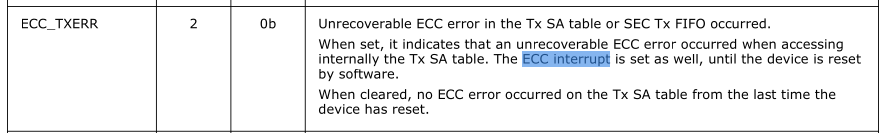

# 问题现象
在客户环境拔插网线后，bmc console会打印如下内容:


# 问题调查
## 查看kernel代码
查看kernel代码, 有两个函数会调用到分别是:
```
static irqreturn_t ixgbe_intr(int irq, void *data);
static irqreturn_t ixgbe_msix_other(int irq, void *data)
```
这两个函数都是中断的回调:
```
static int ixgbe_request_msix_irqs(struct ixgbe_adapter *adapter)
{
	...
	for (vector = 0; vector < adapter->num_q_vectors; vector++) {
		...
		err = request_irq(entry->vector, &ixgbe_msix_clean_rings, 0,
                	q_vector->name, q_vector);
		...
	}
	...
	err = request_irq(adapter->msix_entries[vector].vector,
	                ixgbe_msix_other, 0, netdev->name, adapter);
	...
}
static int ixgbe_request_irq(struct ixgbe_adapter *adapter)
{
	...
	if (adapter->flags & IXGBE_FLAG_MSIX_ENABLED)
	        err = ixgbe_request_msix_irqs(adapter);
	else if (adapter->flags & IXGBE_FLAG_MSI_ENABLED)
	        err = request_irq(adapter->pdev->irq, ixgbe_intr, 0,
	                          netdev->name, adapter);
	else
	        err = request_irq(adapter->pdev->irq, ixgbe_intr, IRQF_SHARED,
	                          netdev->name, adapter);
	...
}
```
我们只看下msix, 可以看到，这个中断不对应收队列, 而是属于其他类型的中断，
如果是收包中断的话，会调用clean rings。

我们只看下`ixgbe_msix_other`代码
### ixgbe_msix_other
```
static irqreturn_t ixgbe_msix_other(int irq, void *data)
{
        struct ixgbe_adapter *adapter = data;
        struct ixgbe_hw *hw = &adapter->hw;
        u32 eicr;

        /*
         * Workaround for Silicon errata.  Use clear-by-write instead
         * of clear-by-read.  Reading with EICS will return the
         * interrupt causes without clearing, which later be done
         * with the write to EICR.
         */
	//读这个寄存器相当于读EICR
        eicr = IXGBE_READ_REG(hw, IXGBE_EICS);

        /* The lower 16bits of the EICR register are for the queue interrupts
         * which should be masked here in order to not accidentally clear them if
         * the bits are high when ixgbe_msix_other is called. There is a race
         * condition otherwise which results in possible performance loss
         * especially if the ixgbe_msix_other interrupt is triggering
         * consistently (as it would when PPS is turned on for the X540 device)
         */
	//这里主要避免该流程对收包产生影响
	//commit : d87d830720a1446403ed38bfc2da268be0d356d1
        eicr &= 0xFFFF0000;
	//写1的相当于清空, 写0相当于没写
	IXGBE_WRITE_REG(hw, IXGBE_EICR, eicr);
	...
	switch (hw->mac.type) {
	case ixgbe_mac_82599EB:
	case ixgbe_mac_X540:
	case ixgbe_mac_X550:
	case ixgbe_mac_X550EM_x:
	case ixgbe_mac_x550em_a:
		...
		if (eicr & IXGBE_EICR_ECC) {
        		e_info(link, "Received ECC Err, initiating reset\n");
        		set_bit(__IXGBE_RESET_REQUESTED, &adapter->state);
        		ixgbe_service_event_schedule(adapter);
        		IXGBE_WRITE_REG(hw, IXGBE_EICR, IXGBE_EICR_ECC);
		}
		...
		break;
	default:
		break;
	}
	...
	return IRQ_HANDLED;
}
```
可以看到，在进入switch之前，就已经对IXGBE_EICR寄存器高16位清空，
但是在检测到IXGBE_EICR_ECC时，在执行完`ixgbe_service_event_schedule`
操作后，又对该位进行清空。我觉得这里可能是意识到在reset 过程中
可能会再次触发该类型中断，但是由于这个过程是屏蔽中断的，所以
硬件改了寄存器，但是还没发中断。这是reset完，就不需要再次处理了，
这次中断处理完成后，开中断，还是会收到此类型中断，但是由于该位
清空，就不用重复reset。

PS: 
1. IXGBE_EICR
```
Writing a 1b to any bit in the register clears it. Writing a 0b to 
any bit has no effect. The EICR is also cleared on read if GPIE.OCD 
bit is cleared. When the GPIE.OCD bit is set, 
then only bits 16...29 are cleared on read. The later setting is useful
 for MSI-X mode in which the Tx and Rx and possibly the timer interrupts 
do not share the same interrupt with the other causes. Bits in the 
register can be auto cleared depending on the EIAC register setting 
(detailed in Section7.3.1.4).
```
在kernel中，支持MSIX的设备设置了GPIE.OCD
```cpp
static void ixgbe_setup_gpie(struct ixgbe_adapter *adapter)
{
	...
	if (adapter->flags & IXGBE_FLAG_MSIX_ENABLED) {
        	gpie = IXGBE_GPIE_MSIX_MODE | IXGBE_GPIE_PBA_SUPPORT |
        	      IXGBE_GPIE_OCD;
		...
	...
}
```
2. IXGBE_ICRS
```
This register enables software to initiate a hardware interrupt. 
Setting any bit on the EICS sets its corresponding bit in the 
EICR register while bits written to 0b have no 
impact. It then causes an interrupt assertion if enabled by the 
EIMS register. Setting any bit generates either LLI or throttled 
interrupt depending on the GPIE.EIMEN setting: 
When the EIMEN bit is set, then setting the EICS register causes 
an LLI interrupt; When the EIMEN bit is cleared, then setting 
the EICS register causes an interrupt after the 
corresponding interrupt throttling timer expires.
```
ps: GPIE.EIMEN没有设置

## reset流程
```cpp
static void ixgbe_service_event_schedule(struct ixgbe_adapter *adapter)
{
        if (!test_bit(__IXGBE_DOWN, &adapter->state) &&
            !test_bit(__IXGBE_REMOVING, &adapter->state) &&
            !test_and_set_bit(__IXGBE_SERVICE_SCHED, &adapter->state))
                queue_work(ixgbe_wq, &adapter->service_task);
}
```
必须满足上面三个条件，才会调到地下的`queue_work`

`adapter->service_task`在下面函数中初始化
```cpp
static int ixgbe_probe(struct pci_dev *pdev, const struct pci_device_id *ent)
{
	...
	INIT_WORK(&adapter->service_task, ixgbe_service_task);
	...
}
```
可以看到，初始化为`ixgbe_service_task` 函数

`ixgbe_service_task`该函数比较长，不一次分析，主要看下面:
```cpp
static void ixgbe_service_task(struct work_struct *work)
{
	...
	ixgbe_reset_subtask(adapter);
	...
}
static void ixgbe_reset_subtask(struct ixgbe_adapter *adapter)
{
        if (!test_and_clear_bit(__IXGBE_RESET_REQUESTED, &adapter->state))
                return;

        rtnl_lock();
        /* If we're already down, removing or resetting, just bail */
        if (test_bit(__IXGBE_DOWN, &adapter->state) ||
        ¦   test_bit(__IXGBE_REMOVING, &adapter->state) ||
        ¦   test_bit(__IXGBE_RESETTING, &adapter->state)) {
                rtnl_unlock();
                return;
        }

        ixgbe_dump(adapter);
        netdev_err(adapter->netdev, "Reset adapter\n");
        adapter->tx_timeout_count++;

        ixgbe_reinit_locked(adapter);
        rtnl_unlock();
}
```
`ixgbe_reset_subtask`理论上是可以走到的（虽然前面有分支会return，但是
应该走不到），走到`ixgbe_reset_subtask`时，必然会打`Reset adapter`,
可以从用户的console 日志中看到，并没有该打印。

再回到 interrupt handler的流程，该流程只是queue work, 并没有去等
这个work完成，所以可能会在reset的过程中重复调入。至于reset的流程，
没有走到`ixgbe_reset_subtask`的打印，可能有两点原因:
* 没有调入，可能和设备的`__IXGBE_DOWN`, `__IXGBE_REMOVING`, `__IXGBE_RESETTING`有关，
  鉴于客户环境是拔了光纤导致，不知道是否和`__IXGBE_REMOVING`有关。（这个状态会在
  pci device remove的时候调到，不知道把光纤是否会走该流程，**需要找环境测试**)
* 调用了，但是该task还没跑，或者跑的慢，interrupt handler没有等，导致多次
  调入, 产生多次打印，在这个过程中，不知道什么原因，导致系统挂了（没有vmcore/calltrace，
  不好分析为什么挂掉)

# 早期日志分析
根据永安传过来的早期日志，会有如下打印:


早期日志中，可以看到会有`NIC Link is Down`相关打印, 
** 但是, 两个触发Down 的网卡，和Ecc Err的网卡不是一个网卡, 
并且中间差了14s, 所以很可能该问题产生和拔网线没有关系**, 
但是我们还是分析下kernel代码流程

## EICR LSC field
上面也提到过EICR中的ECC字段，该字段表示触发中断的原因是
遇到了ECC 错误。

而该寄存器还有一个字段`LSC`该字段表示链路状态变化
(from up to down, or from down to up)


## 查看相关kernel代码
路径有几个，但是最可能的路径，还是通过msix interrupt上报:
代码如下:
```cpp
static irqreturn_t ixgbe_msix_other(int irq, void *data)
{
	...
	if (eicr & IXGBE_EICR_LSC)
	        ixgbe_check_lsc(adapter);
	...
}

static void ixgbe_check_lsc(struct ixgbe_adapter *adapter)
{
        struct ixgbe_hw *hw = &adapter->hw;

        adapter->lsc_int++;
        adapter->flags |= IXGBE_FLAG_NEED_LINK_UPDATE;
        adapter->link_check_timeout = jiffies;
        if (!test_bit(__IXGBE_DOWN, &adapter->state)) {
                IXGBE_WRITE_REG(hw, IXGBE_EIMC, IXGBE_EIMC_LSC);
                IXGBE_WRITE_FLUSH(hw);
                ixgbe_service_event_schedule(adapter);
        }
}
```

上面看过`ixgbe_service_event_schedule`的代码, 这里稍微列一些代码:
```cpp
static void ixgbe_service_event_schedule(struct ixgbe_adapter *adapter)
{
        if (!test_bit(__IXGBE_DOWN, &adapter->state) &&
           !test_bit(__IXGBE_REMOVING, &adapter->state) &&
           !test_and_set_bit(__IXGBE_SERVICE_SCHED, &adapter->state))
                queue_work(ixgbe_wq, &adapter->service_task);
}
static void ixgbe_service_task(struct work_struct *work)
{
	...
	ixgbe_reset_subtask(adapter);
	...
	ixgbe_watchdog_subtask(adapter);
	...
}
static void ixgbe_watchdog_subtask(struct ixgbe_adapter *adapter)
{
        /* if interface is down, removing or resetting, do nothing */
        if (test_bit(__IXGBE_DOWN, &adapter->state) ||
        ¦   test_bit(__IXGBE_REMOVING, &adapter->state) ||
        ¦   test_bit(__IXGBE_RESETTING, &adapter->state))
                return;

        ixgbe_watchdog_update_link(adapter);

        if (adapter->link_up)
                ixgbe_watchdog_link_is_up(adapter);
        else
                ixgbe_watchdog_link_is_down(adapter);

        ixgbe_check_for_bad_vf(adapter);
        ixgbe_spoof_check(adapter);
        ixgbe_update_stats(adapter);

        ixgbe_watchdog_flush_tx(adapter);
}
```

之前分析过，如果ECC err路径进入了`ixgbe_reset_subtask`, 但是lsc的报的中断，为什么
没有打印呢，这是因为，Ecc err在`ixgbe_msix_other`中会设置`__IXGBE_RESET_REQUESTED`位，
但是lsc的流程不会设置，所以，会提前return。代码如下:
```cpp
static void ixgbe_reset_subtask(struct ixgbe_adapter *adapter)
{
	...
	if (!test_and_clear_bit(__IXGBE_RESET_REQUESTED, &adapter->state))
	        return;
	...
	netdev_err(adapter->netdev, "Reset adapter\n");
	...
}
```
在`ixgbe_watchdog_subtask`流程中，回去看`adapter->link_up`的状态，实际就是之前网卡
的状态，之前是up状态的话，现在状态改变了，就应该将状态置为down，反之同理。
我们再来看下`ixgbe_watchdog_link_is_down`代码:(adapter);
```cpp
static void ixgbe_watchdog_link_is_down(struct ixgbe_adapter *adapter)
{
	struct net_device *netdev = adapter->netdev;
	struct ixgbe_hw *hw = &adapter->hw;
	
	adapter->link_up = false;
	adapter->link_speed = 0;
	
	/* only continue if link was up previously */
	if (!netif_carrier_ok(netdev))
	        return;
	
	/* poll for SFP+ cable when link is down */
	if (ixgbe_is_sfp(hw) && hw->mac.type == ixgbe_mac_82598EB)
	        adapter->flags2 |= IXGBE_FLAG2_SEARCH_FOR_SFP;
	
	if (test_bit(__IXGBE_PTP_RUNNING, &adapter->state))
	        ixgbe_ptp_start_cyclecounter(adapter);
	
	e_info(drv, "NIC Link is Down\n");
	netif_carrier_off(netdev);

	/* ping all the active vfs to let them know link has changed */
	ixgbe_ping_all_vfs(adapter);
}
```
这里会将`adapter->link_up`设置为false，并且将`link_speed`设置为0, 然后打印
`NIC Link is Down`。

# ECC error interrupt

ECC error interrupt是硬件报的，在82599 datasheet中有描述(来自
7.14.1  Memory Integrity Protection)
```

All the 82599 internal memories are protected against soft 
errors. Most of them are covered by ECC that correct single 
error per memory line and detect double errors per memory line.
 Few of the smaller memories are covered by parity protection 
that detects a single error per memory line.

Single errors in memories with ECC protection are named also
 as correctable errors. Such errors are silently corrected. 
Two errors in memories with ECC protection or single error in
 memories with parity protection are also named as un-correctable
 errors. Uncorrectable errors are considered as fatal errors.
 If an un-correctable error is detected in Tx packet data, 
the packet is transmitted with a CRC error. If un-correctable 
error is detected in Rx packet data, the packet is reported 
to the host (or manageability) with a CRC error. If an un-correctable 
error is detected anywhere else, the 82599 halts the 
traffic and sets the ECC error interrupt. Software is then 
required to initiate a complete initialization cycle to 
resume nominal operation.
```
有两种错误，一种ECC机制能恢复，另一种(two errors) ecc不能恢复。
这种错误来源有三个，
* 发现在Tx packet data CRC error
* 发现在Rx packet data 中的 CRC error
* 在其他地方发现的，这种情况下会设置ECC error interrupt
*
软件方便需要做一个完成的 initialization 的动作来将设备恢复正常
## ECC error interrupt                                            
在手册中能搜到的ECC error interrupt主要有两个地方                 

### ECC_TXERR

访问Tx SA table时，触发了ECC error interrupt

### ECC_RXERR                                                     

访问Rx SA table时，触发了ECC error interrupt

这两个Tx SA和 Rx SA 主要是和ipsec offload相关,
在下面的章节简单介绍下。（这里先介绍IPSEC)

# IPSEC

> NOTE
>
> 下面的内容主要来自
>
> https://blog.csdn.net/weixin_45317091/article/details/123071953
> https://blog.csdn.net/lyg920/article/details/51658295

## 简述
先简单说下IPSEC, ipsec主要是用于提高IP 层的安全性，
我们知道ssl协议，是用来保护tcp层的。这个是对ip底层提供安全保护。
主要提供以下保护:
* 数据完整性(Data Integrity). 保持数据的一致性， 防止未授权地生成、修改或删除
数据。
* 认证(Authentication)。 保证接收的数据与发送的相同，保证实际发送者就是声称的
发送者。
* 保密性(Confidentiality)。 传输的数据是经过加密的，只有预定的接收者知道发送的
内容。
* 应用透明的安全性(Application-transparent Security)。IPSec的安全头插入在标准的IP
头和上层协议(例如TCP)之间，任何网络服务和网络应用都可以不经修改地从标准
IP转向IPSec，同时，IPSec 通信也可以透明地通过现有的IP路由器

## 涉及协议
* 认证头(Authentication Header, AH) :用于数据完整性认证和数据源认证。
* 封装安全负荷( Encapsulating Security Payload, ESP) :提供数据保密性和数据完整
性认证，ESP 也包括了防止重放攻击的顺序号。
* Internet密钥交换协议( Internet Key Exchange, IKE) :用于生成和分发在ESP和AH .
中使用的密钥，IKE也对远程系统进行初始认证(这个不介绍, 82599 貌似没有卸载该功能)

## AH
AH 提供对 提供了数据完整性和数据源认证。也就是保证IP报文来源可信，并且在传输过程
中不被篡改，但是他不提供加密功能。**AH协议在每个数据包的标准ip头后加了一个AH报文头**
AH协议的对报文的完整性校验范围是整个的IP报文，AH 包含了对称密钥散列函数，使得
第三方无法修改传输中的数据(这个没太看懂，感觉像是通过这个密钥去生成摘要验证完整性),
IPSEC 支持两个认证方法:
* HMAC-SHA1：128比特密钥
* HMAC-MD5：160比特密钥

### AH 头部格式


AH 头在IP 头后面, 成员包括:
* 下一个头: 表示AH头部后面协议类型，也就是ip data的协议类型(因为这个ip包，
type被赋为 AH 了，所以得在AH中表明下一个头的类型)
* 有效载荷长度: 以32个字节为单位的AH数据（包括头部和变长验证数据) 再-2
* 保留: 目前协议为0
* 安全参数索引SPI : 值为[256,2^32-1]。实际上它是用来标识发送方在处理IP数据包时使用了
哪些安全策略，当接收方看到这个字段后就知道如何处理收到的IPsec包。
* 序列号（32位）：一个单调递增的计数器，为每个AH包赋予一个序号。当通信双方建立SA时，
初始化为0。SA是单向的，每发送/接收一个包，外出/进入SA的计数器增1。该字段可用于抗重放攻击。
* 验证数据：可变长，取决于采用何种消息验证算法。包含完整性验证码，也就是HMAC算法的结果，
称为ICV，它的生成算法由SA指定

### 身份验证方式
AH通过对报文应用一个使用密钥的单向散列函数来创建一个散列或消息摘要来进行身份验证。
散列与文本合在一起传输。接收方对接收到的报文运用同样的单向散列函数并将结果与发送方提供的
消息摘要的值比较，从而检测报文在传输过程中是否有部分发生变化。由于单向散列也包含两个系统
之间的一个共享密钥，因此能确保真实性。 AH作用于整个报文，但任意会在传输中改变的IP头字段除外。
例如，由沿传输路径的路由器修改的生存时间（Time to Live, TTL）字段是可变字段。

AH的处理过程顺序如下。 
* 步骤1 使用共享密钥对IP头和数据载荷进行散列。 
* 步骤2 散列构建一个新的AH头，插入到原始报文中。 
* 步骤3 新报文路由器使用共享密钥对IP头和数据载荷进行散列，从AH头中取出传输的散列，再比较两个散列。

（从这里可以看到共享密钥的作用是用于计算摘要，由于是对称密钥，可以保证中间有人篡改)

散列值必须精确匹配。如果报文传输中有一个比特位发生了变化，则接收到的报文的散列输出将改变，
AH头将不能匹配。
AH支持HMAC-MD5和HMAC-SHA-1算法。在使用NAT的环境中，AH可能会遇到问题。

## ESP
ESP利用对称密钥对IP数据进行加密，支持的算法如下:
* DES-CBC (Data Encryption Standard Cipher Block Chaining Mode): 56 位密钥。
* 3DES-CBC (三重DES CBC): 56位密钥
* AES128-CBC ( Advanced Encryption Standard CBC): 128 位密钥。

### ESP头部格式

这里下一个字段同理，也是只有效载荷的报文类型
* SPI: 同上
* 序列号: 同上
* 报文有效载荷: 可以是明文，也可以是密文
* 填充项: 可选，为对齐加密数据而根据需要进行4-byte对齐
* 下一个头: 同上
* 验证数据: 变长字段，只有选择了验证服务才有的字段

ESP通过加密载荷实现机密性，它支持多种对称加密算法。如果选择了ESP作为IPSec协议，
也必须选择一种加密算法。IPSec的默认算法是56位DES。

ESP也能提供完整性和认证。首先对载荷加密，然后对加密过的载荷使用一种散列算法（HMAC-MD5或HMAC-SHA-1）。
散列为数据载荷提供认证和数据完整性。(下面会提到）

作为可选功能，ESP还能进行防重放保护。防重放保护验证每个报文是唯一的且没有被复制，这种保护确保黑客不
能拦截报文和在数据流中插入改变后的报文。防重放的工作原理是跟踪报文顺序号并在目的端使用一个滑动窗口。
当在源和目的间建立了一条连接时，两端的计数器被初始化为0。每次有报文发送时，源给报文追加一个顺序号，
目的端使用滑动窗口确定预期的顺序号。目的端验证的报文的顺序号不是复制的，并且以正确的顺序被接收。
例如，如果目的端的滑动窗口设为1，目的端期望接收到顺序号为1的报文。收到这样的报文后，滑动窗口进入到2.
如果检测到重放的报文，重放报文将被丢弃，对此事件记录日志。

原始数据通过ESP得到良好保护，因为完整的原始IP数据报和ESP附加尾部都被加密。使用ESP认证，
加密的IP数据报和附加尾部以及ESP头都得到散列进程处理。最后，一个新的IP头被附加到经过认证的载荷，
使用新的IP地址在Internet中路由报文。

如果同时选择了认证和加密，先执行加密。这种处理顺序的一个原因是它有助于接收设备快速检测和丢弃重放的
或伪造的报文。在解密报文之前，接收方可以认证进入的报文。这样可以快速检测到问题，并间接的降低了DoS
攻击的影响。

## AH 和 ESP区别
* AH不提供加密服务
* 验证的范围不同：AH验证IP头（传输模式验证原IP头，隧道模式验证新的IP头和原IP头），
ESP只验证部分IP头（传输模式验证IP头，隧道模式只验证原IP头，新的IP头不验证）

## 传输模式
传输模式只对IP负载进行保护。可能是TCP/UDP/ICMP， 也可能是(AH/ESP)(套娃?)
### 传输+AH

可以看到，AH头，在IP头后，在有效载荷之前，并且对IP头，IP有效载荷都作了认证摘要

### 传输+ESP(不开起验证)


这里对IP头IP数据，和ESP尾做了加密

### 传输+ESP+ESP (开启验证）

可以看到，将上述的加密数据做了MD5/SHA1 摘要计算，形成ESP摘要，放到加密数据之后

## 隧道模式
隧道旨在两个网关之间提供颠倒点通信，参与通信的两个网关，实际上是为了两个以其
为边界的网络中的计算机提供安全通信服务(VPN ?)

通常情况下，只要使用IPSEC的双方有一个是安全网关，就必须采用隧道模式。隧道模式
隧道模式的一个优点是可以隐藏内部主机和服务器的IP地址。大部分VPN都使用隧道模式，
因为它不仅对整个原始报文加密，还对通信的源地址和目的地址进行部分和全部加密，
只需要在安全网关，而不需要在内部主机上安装VPN软件，期间所有加密和解密以及协商操
作均由前者负责完成。

隧道模式的数据包有两个IP头，内部头由路由器背后的主机创建，是通信终点；
外部头由提供IPSec的设备（如路由器）创建，是IPSec的终点。

### 隧道+AH

同上，不再描述

### 隧道+ESP
 
这里需要说明下，由于ESP是对IP data进行加密，所以不会加密外网ip头, 但是
会加密内网ip头

### 隧道+ESP+ESP

这里同上，不再描述

# IPSEC offload
回到IPSEC offload, offload是卸载的意思，实际上可以理解为将某些功能从软件侧
下沉到硬件, 让硬件侧（网卡）去完成软件测要执行的内容（加密，签名），从而解放
部分CPU算力。

关于82599这部分实现比较复杂，我这边也没太看懂，不过可以说下和该case相关的部分。


## SA table
上面提到的手册中涉及到ECC err interrupt，主要是访问到TX SA table, RX SA table。
这里的访问，我认为是硬件访问（网卡访问自己的寄存器），理由如下:

这里以Tx SA table为例。

### Tx SA table
Tx SA table, 是由以下的entry构成, 有1024个

这里的，AES-128 KEY AES-128 SALT,会在加密AES-128加密算法中用到，除了这两个
字段，还有一些其他的输入:

* Nonce — 96-bits initialization vector used by the AES-128 engine, which 
 is distinct for each invocation of the encryption operation for a fixed key.
 It is formed by the AES-128 Salt field stored for that IPsec flow 
 in the Tx SA table, appended with the Initialization Vector (IV) 
 field included in the IPsec packet: Nonce = [AES-128 SALT, IV]

> NOTE 
>
> Nonce 是通过 AES-128 Salt 和 IPSEC packet 中的IV 字段计算来的
> 这样的目的是能使用相同的密钥获取到多种加密输入
>

可以看到这里和上面博客中写的格式不是很一样，多了个IV字段。
* AAD — Additional Authentication Data input, which is 
authenticated data that must be left un-encrypted.(这个不清楚哪来的)
* ICV — 128-bit Integrity Check Value (referred also as authentication
    tag).（验证数据)
* H — is internally derived from the key. （从密钥里面来的)

那软件测是如何访问这个table的呢?

#### write access
1. Software writes the IPSTXKEY 0...3 and/or IPSTXSALT register(s).
2. Software writes the IPSTXIDX register with the SA_IDX field
carrying the index of the SA entry to be written, and with the
Write bit set (Read bit cleared).
3. Hardware issues a Write command into the SA table, copying
the IPSTXKEY (16 bytes) and the IPSTXSALT (4 bytes) registers
into the table entry pointed by the SA_IDX field configured in
IPSTXIDX register. It then clears the Write bit in IPSTXIDX
register.
4. Software starts/resumes sending IPsec offload packets with
the IPsec SA IDX field in the Tx context descriptor pointing 
to valid/invalid SA entries. A valid SA entry contains updated
key and salt fields currently in use by the IPsec peers.

大概的意思是通过`IPSTXIDX`寄存器可以确定写哪个index， 并且可以设置Write bit
(Read bit clear),然后通过写`IPSEXKEY`/`IPSTXSALT`往表中写内容，当然`IPSEXKEY`
是4-byte，寄存器是1-byte，对应4个寄存器

这个写命令提交到网卡时，网卡将其copy到对应的entry中。

软件这边发送 IPsec offload package时，会在Tx context descriptor 中提供
IPsec SA index字段, 指向SA entries( 这里提到有非法的entries，但是没有提到
访问了非法entry是否会造成 ECC err interrupt) 。SA entry中的内容将会在IPsec中
用到。

#### Read access
Read access类似，只不过是要设置Read bit(Write bit clear)。

所以软件测软件只是去写寄存器，最终命令下发到网卡时，由网卡去访问该资源。
（当然使用ipsec offload发包时硬件也会访问)但是访问过程中什么情况下会触发异常，
手册中并没有提到。

# 个人建议
找硬件厂商反馈下这个问题。
