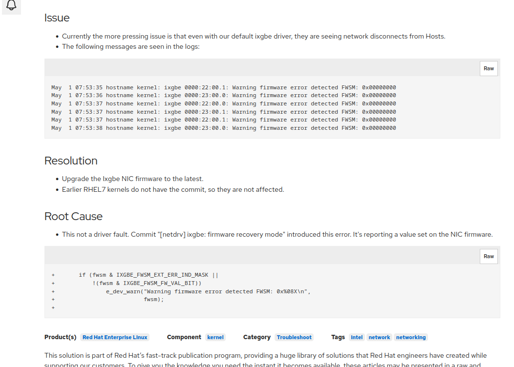

# 问题现象
替换紫光网卡后，出现了ifup 不起来，并且网卡运行着可能突然down掉,
dmesg中有如下报错:


并且网络不稳定，可能出现丢包的情况.
查看驱动固件版本:


其中厂商给的回复，希望更新驱动版本, 厂商参考链接如下:

https://forum.proxmox.com/threads/pve-6-0-7-ixgbe-firmware-errors.58592/


# 查看厂商给出的链接
大概如下:
```
-- Oct 1, 2019
   dm15用户反馈, 在 dmesg中发现了如下报错:
   [44650.577580] ixgbe 0000:05:00.0: Warning firmware error detected FWSM: 0x00000000
   [44650.741545] ixgbe 0000:05:00.1: Warning firmware error detected FWSM: 0x00000000
   ...
   并且在没有任何state change 的情况下，网卡偶尔hung住。并且ip link set ...up 可以让链路
   正常，无需重启 {不知道翻译的对不对，原文如下:  The NICs (05:00.0 Ethernet controller: Intel 
   Corporation 82599ES 10-Gigabit SFI/SFP+ Network Connection (rev 01)) randomly hang without 
   any state changes, `ip link set ... up` brings them back without reboot.}
	
   他发现当前kernel 自带的ixgbe driver 不如官网上的新:
   他那kernel自带的:
     # ethtool -i enp5s0f0
     driver: ixgbe
     version: 5.1.0-k
     firmware-version: 0x000118b3 
   官网: 5.6.3

   给出了一个链接，在centos的bug tracer上，有相同的报错，并且给出了解释, 我们一会再看
   https://bugs.centos.org/view.php?id=16495

   随后他表示，将更新  "最新"版本ixgbe驱动, (为什么最新打引号呢，我们之后分析), 有进展在
   该页面更新

-- Oct 10,  2019
   dm15用户表示，该问题，已经通过更新驱动解决，他的环境已经好了
```

# 查看 centos bug tracer 链接
```
-- 2019-09-30 :
   kadafax报告了该问题, 表示在Dell PowerEdge R510(fully firmware updated) 情况下，也遇到了
   这个问题，他表示: 网卡看起来仍在继续工作。
-- 2019-09-30 :
   nixma 更新，说在Debian上也遇到了该问题，表示网络突然被当了，并且dmesg中出现了该打印，
   通过重启暂时解决(原文如下: Not a CentOS user, but searched for this on Google because 
   it happened today to me on Debian. Suddenly network was down and that dmesg spam, 
   soft reboot has resolved the problem.)

   因为他使用的kernel是5.0.21-1-pve, 猜测，和kernel version 关系不大

-- 2019-09-30 
   pgreco(deveplor) 表示，让其提供固件版本，表示某些driver可能依赖特定的固件版本.

-- 2019-10-01
   kadafax(reporter) 提供版本如下:
      Here it is:
      driver: ixgbe
      version: 5.1.0-k-rh7.6
      firmware-version: 0x800001a5, 16.5.20 


-- 2019-10-01
   nixma 提供如下:
       # ethtool -i enp5s0f0
       driver: ixgbe
       version: 5.1.0-k
       firmware-version: 0x000118b3
       expansion-rom-version:
       bus-info: 0000:05:00.0
       supports-statistics: yes
       supports-test: yes
       supports-eeprom-access: yes
       supports-register-dump: yes
       supports-priv-flags: yes

-- 2021-07-29
   toracat(manager) 表示, 该问题需要通过将固件更新为最新解决，参考如下:
   https://access.redhat.com/solutions/5068871
```

# 查看红帽知识库


红帽知识库中认为是驱动加了对固件异常的检测代码导致，但是最终原因还是
固件有问题，建议更新最新的固件

# 查看相关代码
改代码源于 kernel upstream commit :
```
commit 59dd45d550c518a2c297b2888f194633cb8e5700
Author: Sebastian Basierski <sebastianx.basierski@intel.com>
Date:   Tue Jul 31 18:04:10 2018 +0200

    ixgbe: firmware recovery mode

    Add check for FW NVM recovery mode during driver initialization and
    service task. If in recovery mode, log message and unregister device

...
+/**
+ * ixgbe_check_fw_error - Check firmware for errors
+ * @adapter: the adapter private structure
+ *
+ * Check firmware errors in register FWSM
+ */
+static bool ixgbe_check_fw_error(struct ixgbe_adapter *adapter)
+{
+       struct ixgbe_hw *hw = &adapter->hw;
+       u32 fwsm;
+
+       /* read fwsm.ext_err_ind register and log errors */
+       fwsm = IXGBE_READ_REG(hw, IXGBE_FWSM(hw));
+
+       if (fwsm & IXGBE_FWSM_EXT_ERR_IND_MASK ||
+           !(fwsm & IXGBE_FWSM_FW_VAL_BIT))
+               e_dev_warn("Warning firmware error detected FWSM: 0x%08X\n",
+                          fwsm);
+
+       if (hw->mac.ops.fw_recovery_mode && hw->mac.ops.fw_recovery_mode(hw)) {
+               e_dev_err("Firmware recovery mode detected. Limiting functionality. Refer to the Intel(R) Ethernet Adapters and Devices User Guide for details on firmware recovery mode.\n");
+               return true;
+       }
+
+       return false;
+}
+
 /**
  * ixgbe_service_task - manages and runs subtasks
  * @work: pointer to work_struct containing our data
@@ -7792,6 +7819,15 @@ static void ixgbe_service_task(struct work_struct *work)
                ixgbe_service_event_complete(adapter);
                return;
        }
+       if (ixgbe_check_fw_error(adapter)) {
+               if (!test_bit(__IXGBE_DOWN, &adapter->state)) {
+                       rtnl_lock();
+                       unregister_netdev(adapter->netdev);
+                       rtnl_unlock();
+               }
+               ixgbe_service_event_complete(adapter);
+               return;
+       }
        if (adapter->flags2 & IXGBE_FLAG2_UDP_TUN_REREG_NEEDED) {

...
```

在改patch中回去检测fw的错误，但是只会报warn打印，并不会去报`unregister_netdev`。

可以看到改patch的提交时间是2018.07.31, 而`4.18.0-147`中带的ixgbe驱动合入了这个patch，
但是intel 5.6.3 ixgbe驱动包，并没有合入这个patch。所以不会报这个错误。

# PS: 测试了下两个版本的驱动
## 安装5.12.5驱动
```
[root@localhost ixgbe-5.12.5]# ethtool -i enp5s0f1
driver: ixgbe
version: 5.12.5
firmware-version: 0x546c0001, 255.65535.255
expansion-rom-version:
bus-info: 0000:05:00.1
supports-statistics: yes
supports-test: yes
supports-eeprom-access: yes
supports-register-dump: yes
supports-priv-flags: yes
```

## kernel本身驱动
```
[root@localhost ixgbe]# ethtool -i enp5s0f1
driver: ixgbe
version: 5.1.0-k-rh8.1.0
firmware-version: 0x0001546c
expansion-rom-version:
bus-info: 0000:05:00.1
supports-statistics: yes
supports-test: yes
supports-eeprom-access: yes
supports-register-dump: yes
supports-priv-flags: yes
```
可以看到，安装驱动前后，firmware-version值改变了，但是自是字节序的改变，
个人认为，前后firmware-version并没有改变。
