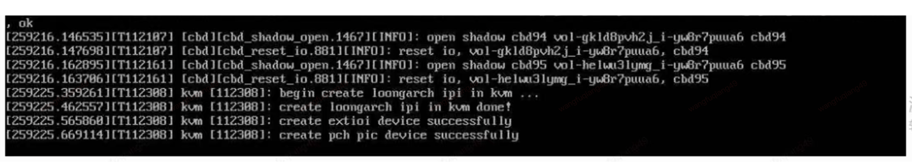

## loongarch测试

* 性能
  * 目前unixbench 测试，在开启pv-ipi的情况下，损耗仍较高:
    * 单核7%, 多核25%
  * [unixbench性能测试细节](./perf/README.md)  中的
    `UNIXBENCH/综合跑分虚拟化损耗` 章节
  * TODO
    * [ ] 目前龙芯工程师发现是openeuler 2403 并未合入 `irqchip in kvm` 相关patch，可能会导致性能问题,
          待合入patch 再次做测试。
* 稳定性问题
  * 内核
    * [ ] 多次重启后，重启卡住，进不去任何系统（包括bios setup)
    * [ ] 更换kernel 为 `kernel-6.6.0-117.0.0.122.oe2403sp2` 后，仍然出现了 `megaraid_sas`报错 [details](./bug/2026_02_09_kernel__megaraid_sas.md)
    * [X] KVM ioeventfd bug, 现象是疑似 多个vm之间io eventfd batch (de)assign 出现race [details](./bug/2026_02_09_kernel__ioeventfd.md)
    * [ ] crash 命令解析 指令地址和所在的函数符号不匹配(龙芯已经定位到问题，待出包解决)
  * qemu
    * [ ] 热迁移后，源端异常，virsh 命令卡住. [details](./bug/2026_02_09_qemu__migrate_hung_source.md)
      * [X] 问题定位(定位到是openeuler上游bug，upstream已经解决)
      * [X] 反馈openeuler
        * [X] 提交issue patch
        * [X] 等待反馈
    * [ ] 热迁移后，源端异常后，目的端也异常, virsh 命令卡住. [details](./bug/2026_02_09_qemu__migrate_hung_dest.md)
    * [X] 合入pv-ipi补丁后，热迁移源端qemu 从热度门票 [details](./bug/2026_02_25_qemu__migrate_source_qemu_crash.md)
    * [ ] 龙芯不支持CPU热插拔 [details](./bug/2026_02_25_cpu_hotplug_error.md)
  * 其他
    * [ ] gcore 命令获取的coredump堆栈信息打印不全

## 2026-05-14 整理

目前阻塞的问题有:
+ host
  + [X] host 无法触发sysrq
    + 个人键盘问题，通过[修改sysrq默认键位->F12](./sysrq_alt_f12/) 解决
  + [X] host 无法在串口产生panic堆栈
    + 配置问题, 修改cmdline, 将 `console=ttyS0,115200` 放到 `console=tty0`之后
  + [X] host 通过sysrq无法产生vmcore
    + cmdline过长，通过合入
      + kexec-tools : [LoongArch: Change COMMAND_LINE_SIZE to 4096](https://atomgit.com/src-openeuler/kexec-tools/pull/161)
      + kernel: [\[OLK-6.6\]\[LoongArch\] Loongarch 下 命令行参数长度不足](https://gitcode.com/openeuler/kernel/issues/8609) 解决
  + [ ] host内核崩溃，因上述原因，没有产生vmcore
    + 


* guest
  + [ ] softlockup, 有vmcore(virsh dump`i-gh8p9tc01f`), 还未分析. 
    
    <details>
    <summary>堆栈展开</summary>

    ```
    [438588.129955][    C0] CPU 0 Unable to handle kernel paging request at virtual address 0000000000000010, era == 0000000000000010, ra == 90000001003b3c70
    [438588.129966][    C0] Kernel panic - not syncing: stack-protector: Kernel stack is corrupted in: vprintk_store+0x518/0x518
    [438588.131690][    C0] ------------[ cut here ]------------
    [438588.132019][    C0] WARNING: CPU: 0 PID: 0 at kernel/smp.c:786 smp_call_function_many_cond+0x550/0x598
    [438588.132530][    C0] Modules linked in: sch_tbf binfmt_misc rfkill nls_cp936 vfat fat joydev efi_pstore virtio_net net_failover pstore failover rtc_efi virtio_balloon fuse nfnetlink virtio_gpu virtio_dma_buf virtio_blk drm_shmem_helper ipv6 crc_ccitt
    [438588.133817][    C0] CPU: 0 PID: 0 Comm: swapper/0 Not tainted 6.6.0-97.0.0.102.oe2403sp2.loongarch64 #1
    [438588.134455][    C0] Hardware name: JD JCloud Iaas Jvirt, BIOS unknown 2/2/2022
    [438588.134958][    C0] pc 90000000003494f0 ra 9000000000349574 tp 90000000022f8000 sp 90000001003b3790
    [438588.135556][    C0] a0 90000000025949b0 a1 90000000002341b0 a2 0000000000000000 a3 0000000000000000
    [438588.136349][    C0] a4 0000000000000000 a5 90000001003b3690 a6 0000000000000001 a7 0000000000000001
    [438588.138064][    C0] t0 0000000000000100 t1 0000000000000100 t2 0000000000000000 t3 0000000000000000
    [438588.139664][    C0] t4 fffffffffffffffe t5 900000010611a7d0 t6 ffffffffffffffff t7 0000000000000001
    [438588.141098][    C0] t8 0000000000000001 u0 90000000002e22a0 s9 9000000002595000 s0 90000000025949b0
    [438588.142583][    C0] s1 900000000347fbb8 s2 0000000000000003 s3 0000000000000000 s4 0000000000000000
    [438588.144073][    C0] s5 90000000002341b0 s6 0000000000000002 s7 0000000000000000 s8 90000001003b3aa8
    [438588.145320][    C0]    ra: 9000000000349574 smp_call_function+0x2c/0x38
    [438588.146436][    C0]   ERA: 90000000003494f0 smp_call_function_many_cond+0x550/0x598
    [438588.148420][    C0]  CRMD: 000000b0 (PLV0 -IE -DA +PG DACF=CC DACM=CC -WE)
    [438588.149779][    C0]  PRMD: 00000000 (PPLV0 -PIE -PWE)
    [438588.150787][    C0]  EUEN: 00000000 (-FPE -SXE -ASXE -BTE)
    [438588.151826][    C0]  ECFG: 00071c1d (LIE=0,2-4,10-12 VS=7)
    [438588.153036][    C0] ESTAT: 000c1800 [BRK] (IS=11-12 ECode=12 EsubCode=0)
    [438588.154094][    C0]  PRID: 0014c010 (Loongson-64bit, Loongson-3A5000)
    [438588.155393][    C0] CPU: 0 PID: 0 Comm: swapper/0 Not tainted 6.6.0-97.0.0.102.oe2403sp2.loongarch64 #1
    [438588.156545][    C0] Hardware name: JD JCloud Iaas Jvirt, BIOS unknown 2/2/2022
    [438588.157640][    C0] Stack : 9000000001ae2a58 0000000000000000 90000000002243f4 90000000022f8000
    [438588.158861][    C0]         90000001003b33e0 90000001003b33e8 0000000000000000 90000001003b3528
    [438588.159999][    C0]         90000001003b3520 90000001003b3520 90000001003b3300 0000000000000001
    [438588.161101][    C0]         0000000000000001 90000001003b33e8 a5cdd97871b863b8 90000001006bc840
    [438588.162572][    C0]         90000001003b31f8 fffffffffffffffe 900000010611a970 ffffffffffffffff
    [438588.163749][    C0]         0000000000000001 0000000000000001 0000000006904000 9000000002595000
    [438588.165051][    C0]         0000000000000000 0000000000000000 9000000001ae2a58 9000000002391000
    [438588.166203][    C0]         90000000003494f0 0000000000000312 0000000000000002 0000000000000000
    [438588.167512][    C0]         90000001003b3aa8 0000000000000000 900000000022440c 0000000000000010
    [438588.168598][    C0]         00000000000000b0 0000000000000000 0000000000000000 0000000000071c1d
    [438588.169623][    C0]         ...
    [438588.170350][    C0] Call Trace:
    [438588.170353][    C0] [<900000000022440c>] show_stack+0x64/0x188
    [438588.172210][    C0] [<90000000015c46bc>] dump_stack_lvl+0x5c/0x88
    [438588.173469][    C0] [<9000000000249f20>] __warn+0x88/0x148
    [438588.174967][    C0] [<90000000015519a8>] report_bug+0x1f8/0x2b8
    [438588.176236][    C0] [<90000000015c5010>] do_bp+0x258/0x3e0
    [438588.177018][    C0] [<9000000000222980>] handle_bp+0x120/0x1c0
    [438588.177785][    C0] [<90000000003494f0>] smp_call_function_many_cond+0x550/0x598
    [438588.178780][    C0] [<9000000000349570>] smp_call_function+0x28/0x38
    [438588.180057][    C0] [<9000000000233c6c>] crash_smp_send_stop.part.0+0x4c/0xc0
    [438588.180989][    C0] [<900000000159f450>] panic+0x188/0x348
    [438588.181928][    C0] [<90000000015c5a0c>] __stack_chk_fail+0x14/0x18
    [438588.182788][    C0] [<90000000002dfc94>] vprintk_store+0x514/0x518
    [438588.183633][    C0] [<9000000000224704>] die+0x124/0x188
    [438588.184401][    C0] [<90000000015c530c>] do_ri+0x174/0x180
    ```
    </details>
  + [ ] kernel panic (访问非法地址) `i-xt7st1ncf7`
    + 只有一行报错
      ```
      general-2-11-211-129-43 login: [ 6717.673327][    C0] CPU 0 Unable to handle kernel paging request at virtual address 0000000000000010, era == 90000000002bf128, ra == 90000000002bf128
      ```

      有vmcore，`virsh dump`产生
  + [ ] guest 无法产生vmcore
    + [X] 通过将guest内核替换为host内核版本基于`kernel-6.6.0-117.0.0.122.oe2403sp2.src.rpm` 构建 + 
      [kexec-tools](https://atomgit.com/src-openeuler/kexec-tools/issues/66)，并修改`kdump reserved memory
      -> 1G` 可以通过`sysrq` 产生vmcore
    + [ ] **某些情况下还是没有办法产生vmcore，就像上一个问题**

**个人认为应该首先解决无法产生vmcore的问题**

## 目前采用的软件版本

* **kernel** : kernel-6.6.0-117.0.0.122.oe2403sp2.src.rpm
* **qemu**: qemu-8.2.0-37.oe2403sp2.src.rpm
