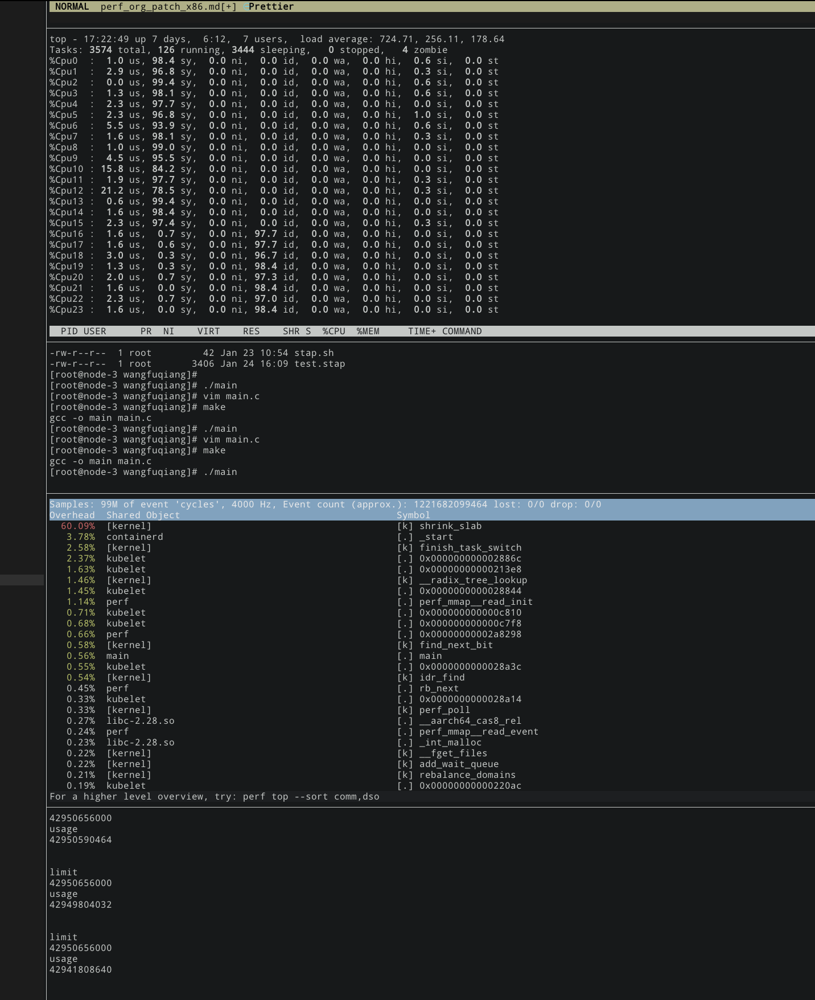

# 1. 问题现象
在某些时候, 环境中会出现高负载现象,通过top查看,发现环境负载很高,
另外, cpu占用率很高, 很大部分是运行在 sys 空间.

通过 perf top 查看,发现热点函数是在 shrink_slab函数.



# 2. 查看代码
```cpp
static unsigned long shrink_slab(gfp_t gfp_mask, int nid,
                                 struct mem_cgroup *memcg,
                                 int priority)
{
        unsigned long ret, freed = 0;
        struct shrinker *shrinker;

        /*
         * The root memcg might be allocated even though memcg is disabled
         * via "cgroup_disable=memory" boot parameter.  This could make
         * mem_cgroup_is_root() return false, then just run memcg slab
         * shrink, but skip global shrink.  This may result in premature
         * oom.
         */
        if (!mem_cgroup_disabled() && !mem_cgroup_is_root(memcg))
                return shrink_slab_memcg(gfp_mask, nid, memcg, priority);

        ...
```
因为出问题的进程是 k8s 相关进程, 在`shrink_slab` 中, 会走到 `shrink_slab_memcg`
```cpp
static unsigned long shrink_slab_memcg(gfp_t gfp_mask, int nid,
                        struct mem_cgroup *memcg, int priority)
{
        struct shrinker_info *info;
        unsigned long ret, freed = 0;
        int i;
        //该mem_cgroup不是online的
        if (!mem_cgroup_online(memcg))
                return 0;
        //获取读者信号量, trylock, 获取不到直接返回
        if (!down_read_trylock(&shrinker_rwsem))
                return 0;

        info = shrinker_info_protected(memcg, nid);
        if (unlikely(!info))
                goto unlock;
        // shrink /ʃrɪŋk/ 收缩
        // 在map中找各个shrinker, 主要是找到id, 然后通过idr找到该shrinker
        for_each_set_bit(i, info->map, shrinker_nr_max) {
                struct shrink_control sc = {
                        .gfp_mask = gfp_mask,
                        .nid = nid,
                        .memcg = memcg,
                };
                struct shrinker *shrinker;

                shrinker = idr_find(&shrinker_idr, i);
                if (unlikely(!shrinker || !(shrinker->flags & SHRINKER_REGISTERED))) {
                        if (!shrinker)
                                clear_bit(i, info->map);
                        continue;
                }

                //因为环境cmdline设置为 cgroup.memory=nokmem, 所以memcg_kmem_enabled
                //返回假, 所以这里
                //只有 只有shrinker->flags & SHRINKER_NONSLAB 为真的时候,才不会continue
                /* Call non-slab shrinkers even though kmem is disabled */
                if (!memcg_kmem_enabled() &&
                    !(shrinker->flags & SHRINKER_NONSLAB))
                        continue;

                ret = do_shrink_slab(&sc, shrinker, priority);
```

查看代码, 发现代码中只有
```cpp
static struct shrinker deferred_split_shrinker = {
        .count_objects = deferred_split_count,
        .scan_objects = deferred_split_scan,
        .seeks = DEFAULT_SEEKS,
        .flags = SHRINKER_NUMA_AWARE | SHRINKER_MEMCG_AWARE |
                 SHRINKER_NONSLAB,
};
```
才会设置`SHRINKER_NONSLAB`

通过systemtap 调试了下,确实能抓到这个shrinker的执行, 不再展示.

# 3. 通过self modify code的方式进行验证
我们想通过self modify code的方式, 让某些流程提前返回,以便验证那些流程出了问题.

举个例子:
```
func_a()
{
    inst1

    inst_no_effect       <===modify this to GOTO END

    inst2

end:

}
```
我们这里假设, inst_no_effect 不会有性能上的影响.
如果做了上述的改动,
改动之前能复现问题, 改动之后,不能复现问题, 就说明是 inst2 指令有问题.

## 3.1 测试module
```cpp
#include <linux/module.h>
#include <linux/proc_fs.h>
#include <linux/init.h>
#include <linux/uaccess.h>
#include <linux/mm_types.h>

#include <linux/mm.h>
#include <asm/tlbflush.h>
#include <linux/kallsyms.h>
#include <asm/pgtable-hwdef.h>

extern struct pv_mmu_ops pv_mmu_ops;
static bool debug;

#define my_pr_info(...)                                 \
        do {                                            \
                if (debug)                              \
                        pr_info( __VA_ARGS__);  \
        } while(0)
struct page_info {
        unsigned long virt;
        pgd_t *pgd;
        p4d_t *p4d;
        pud_t *pud;
        pmd_t *pmd;
        pte_t *pte;
        pte_t org_pte;
};
static struct page_info g_page_info = {
        .virt = 0
};

static void *symbol_modify = NULL;
static struct mm_struct *init_mm_struct = NULL;
static unsigned long org_val;

pte_t *my_pte_offset_map(pmd_t *pmd, unsigned long addr)
{
        return pte_offset_kernel(pmd, addr);
}
#define get_vaild_ptr_val(ptr)  ((ptr) ? (*(unsigned long *)ptr) : 0)
static void init_page_info(unsigned long virt, struct page_info *pg_info)
{
        pg_info->virt = virt;
        pg_info->pgd = pgd_offset(init_mm_struct,  pg_info->virt);
        pg_info->p4d = p4d_offset(pg_info->pgd,           pg_info->virt);
        pg_info->pud = pud_offset(pg_info->p4d,           pg_info->virt);
        pg_info->pmd = pmd_offset(pg_info->pud,           pg_info->virt);

        pg_info->pmd = pud_trans_huge(*pg_info->pud) ? (pmd_t *)pg_info->pud :
                          pmd_offset(pg_info->pud, pg_info->virt);
        pg_info->pte = pmd_trans_huge(*pg_info->pmd) ? (pte_t *)pg_info->pmd :
                         my_pte_offset_map(pg_info->pmd,    pg_info->virt);

        pg_info->org_pte = *pg_info->pte;

        return ;
}

static void print_page_info(struct page_info *pg_info)
{
        my_pr_info("virt (%lx) \n"
                "pgd : %lx ==> %lx\n"
                "p4d : %lx ==> %lx\n"
                "pud : %lx ==> %lx\n"
                "pmd : %lx ==> %lx\n"
                "pte : %lx ==> %lx\n",
                pg_info->virt,
                (unsigned long )pg_info->pgd, get_vaild_ptr_val(pg_info->pgd),
                (unsigned long )pg_info->p4d, get_vaild_ptr_val(pg_info->p4d),
                (unsigned long )pg_info->pud, get_vaild_ptr_val(pg_info->pud),
                (unsigned long )pg_info->pmd, get_vaild_ptr_val(pg_info->pmd),
                (unsigned long )pg_info->pte, get_vaild_ptr_val(pg_info->pte));
}

#define SET_PAGE_FLAGS(pte, cond, flag)  \
        (                                \
         (pte) = cond ? (pte) | (flag) : \
                (pte) & (~(flag))        \
        )

static void modify_pgtable_flags(struct page_info *pg_info, unsigned long flags, bool enable)
{
        pte_t pte;

        pte.pte = get_vaild_ptr_val(pg_info->pte);

        SET_PAGE_FLAGS(pte.pte, enable, flags);

        set_pte(pg_info->pte, pte);
}

static void revert_pgtable_flags(struct page_info *pg_info)
{
        set_pte(pg_info->pte, pg_info->org_pte);
}


static void modify_val(void *dst, void *src, void *org, size_t size)
{
        if (!g_page_info.virt) {
                init_page_info((unsigned long )symbol_modify, &g_page_info);
        }

        my_pr_info("modify page table prev, print \n");
        print_page_info(&g_page_info);

        modify_pgtable_flags(&g_page_info, PTE_RDONLY, 0);
        my_pr_info("modify page table post, print \n");
        print_page_info(&g_page_info);
        /*
         * avoid org tlb has not RW bit, may cause kernel panic
         *
         * see
         * https://github.com/cai-fuqiang/kernel_test/tree/master/tlb_test
         */
        flush_tlb_all();

        //WRITE_ONCE(pv_mmu_ops.shrink_slab, ptr);
        smp_mb();

        memcpy(org, dst, size);
        memcpy(dst, src, size);

        revert_pgtable_flags(&g_page_info);
        flush_tlb_all();
        my_pr_info("revert page table post, print \n");
        print_page_info(&g_page_info);
}

static int __init my_init(void)
{
        //d2800000
        //unsigned long ret_inst_val = 0xd65f03c0d2800000; mov x0, #0; ret
        //unsigned long ret_inst_val = 0xd2800000d65f03c0;
        //unsigned long ret_inst_val = 0xd2800000;      //mov x0, #0 idr_find
        unsigned long ret_inst_val = 0xd280001c;        //mov x28, #0 down_read_try_lock
        //symbol_modify = (void *)kallsyms_lookup_name("shrink_slab");
        //symbol_modify = (void *)kallsyms_lookup_name("do_shrink_slab");
        //symbol_modify = (void *)kallsyms_lookup_name("do_shrink_slab");
        init_mm_struct = (void *)kallsyms_lookup_name("init_mm");
        //symbol_modify = (void *)0xffff8000102d0a10;           //idr_find
        symbol_modify = (void *)0xffff8000102d0970; //down_read_try_lock
        my_pr_info("shrink_slab(%lx)\n",
                        (unsigned long )symbol_modify);

        my_pr_info("the symbol_modify is %lx\n", (unsigned long )symbol_modify);
        my_pr_info("the init_mm is %lx\n", (unsigned long )init_mm_struct);
        modify_val(symbol_modify, &ret_inst_val, &org_val, sizeof(unsigned int));
        my_pr_info("org val (%lx)\n", org_val);

        return 0;
}

static void __exit my_exit(void)
{
        unsigned long modifyed_val = 0;
        if (!symbol_modify) {
                return;
        }

        modify_val(symbol_modify, &org_val, &modifyed_val, sizeof(unsigned int));

        my_pr_info("modify val(%lx)\n", modifyed_val);
        return;
}
module_param(debug, bool, 0);
MODULE_PARM_DESC(debug, "print debug");

module_init(my_init);
module_exit(my_exit);
MODULE_LICENSE("GPL");
```

函数比较长, 这里我们说下主要的代码流程, 因为我们要修改代码,而代码所在的段是只读的,所以
我们要修改pte, 让其不再只读.所以大致流程如下:
```
module_init()
{
    修改页表, 屏蔽只读属性
    修改指令
    修改页表, 还原只读属性
}

module_exit()
{
    修改页表, 屏蔽只读属性
    恢复指令为原本的
    修改页表, 还原只读属性
}
`
```

## 3.2 做测试

### 3.2.1 修改 shrink_slab, 让其在开始就返回.

> NOTE
>
> 注意, 返回的之前, 我们需要处理返回值, 而且最好在开始处,返回,避免处理堆栈.

修改后的指令如下:
```
/usr/src/debug/kernel-4.18.0-372.19.1.el8_6/linux-4.18.0-372.19.1.es8_8.aarch64/mm/vmscan.c: 855
0xffff8000102d0820 <shrink_slab>:       mov     x0, #0x0                        // #0
0xffff8000102d0824 <shrink_slab+4>:     ret
```

修改后, 仍然可能复现
```

```

### 3.2.2 修改shrink_slab_node, 让其在开始就返回

修改指令如下:
```
/usr/src/debug/kernel-4.18.0-372.19.1.el8_6/linux-4.18.0-372.19.1.es8_8.aarch64/mm/vmscan.c: 655
0xffff8000102cf460 <do_shrink_slab>:    mov     x0, #0x0                        // #0
0xffff8000102cf464 <do_shrink_slab+4>:  ret
```

修改后, 仍然复现.

说明问题代码在 `shrink_slab`->`do_shrink_slab`中间.

### 3.2.3 down_read_trylock

在`down_read_trylock`之前没有什么执行流程, 我们直接在 `down_read_trylock`之后, 让其直接return
```
#ifdef CONFIG_MEMCG
static unsigned long shrink_slab_memcg(gfp_t gfp_mask, int nid,
                        struct mem_cgroup *memcg, int priority)
{
        struct shrinker_info *info;
        unsigned long ret, freed = 0;
        int i;

        if (!mem_cgroup_online(memcg))
                return 0;

        if (!down_read_trylock(&shrinker_rwsem))        //让其执行完
                return 0;

        info = shrinker_info_protected(memcg, nid);
        if (unlikely(!info))                            //可以修改info的值, 让其==0
                goto unlock;

```

查看汇编代码
```
/usr/src/debug/kernel-4.18.0-372.19.1.el8_6/linux-4.18.0-372.19.1.es8_8.aarch64/./include/linux/memcontrol.h: 923
0xffff8000102d0948 <shrink_slab+296>:   ldr     w0, [x21,#124]
0xffff8000102d094c <shrink_slab+300>:   tbz     w0, #1, 0xffff8000102d0a9c <shrink_slab+636>
/usr/src/debug/kernel-4.18.0-372.19.1.el8_6/linux-4.18.0-372.19.1.es8_8.aarch64/mm/vmscan.c: 761
0xffff8000102d0950 <shrink_slab+304>:   adrp    x20, 0xffff800011f74000 <event_oom_score_adj_update+128>
0xffff8000102d0954 <shrink_slab+308>:   add     x20, x20, #0x618
0xffff8000102d0958 <shrink_slab+312>:   mov     x0, x20         
0xffff8000102d095c <shrink_slab+316>:   bl      0xffff800010160d98 <down_read_trylock>      //调用down_read_trylock
0xffff8000102d0960 <shrink_slab+320>:   cbz     w0, 0xffff8000102d0a9c <shrink_slab+636>
/usr/src/debug/kernel-4.18.0-372.19.1.el8_6/linux-4.18.0-372.19.1.es8_8.aarch64/mm/vmscan.c: 764
0xffff8000102d0964 <shrink_slab+324>:   add     x0, x21, w23, sxtw #3
0xffff8000102d0968 <shrink_slab+328>:   stp     x27, x28, [sp,#80]
0xffff8000102d096c <shrink_slab+332>:   ldr     x0, [x0,#4120]
0xffff8000102d0970 <shrink_slab+336>:   ldr     x28, [x0,#840]                              //这条指令是获取info的值
/usr/src/debug/kernel-4.18.0-372.19.1.el8_6/linux-4.18.0-372.19.1.es8_8.aarch64/mm/vmscan.c: 765
0xffff8000102d0974 <shrink_slab+340>:   cbz     x28, 0xffff8000102d0aac <shrink_slab+652>   //跳转到unlock
```

我们将`shrink_slab+336`修改为`mov x28, #0`

```
0xffff8000102d096c <shrink_slab+332>:   ldr     x0, [x0,#4120]
0xffff8000102d0970 <shrink_slab+336>:   mov     x28, #0x0                       // #0       //===>修改代码
/usr/src/debug/kernel-4.18.0-372.19.1.el8_6/linux-4.18.0-372.19.1.es8_8.aarch64/mm/vmscan.c: 765
0xffff8000102d0974 <shrink_slab+340>:   cbz     x28, 0xffff8000102d0aac <shrink_slab+652>
```

修改后, 问题仍然复现
```
  36.34%  [kernel]                                           [k] down_read_trylock
   6.59%  [kernel]                                           [k] shrink_node
   5.27%  [kernel]                                           [k] up_read
   3.32%  [kernel]                                           [k] finish_task_switch
   3.18%  kubelet                                            [.] 0x000000000002886c
   3.00%  containerd                                         [.] _start
   2.69%  kubelet                                            [.] 0x00000000000213e8
   2.68%  [kernel]                                           [k] mem_cgroup_iter
   2.49%  [kernel]                                           [k] shrink_lruvec
   2.03%  perf                                               [.] 0x0000000000204468
```

### 3.2.4 shrink_slab_memcg 提前返回

进一步验证, 我们在

```
#ifdef CONFIG_MEMCG
static unsigned long shrink_slab_memcg(gfp_t gfp_mask, int nid,
                        struct mem_cgroup *memcg, int priority)
{
        struct shrinker_info *info;
        unsigned long ret, freed = 0;
        int i;

        if (!mem_cgroup_online(memcg))      <===让这个返回值始终为0
                return 0;

        if (!down_read_trylock(&shrinker_rwsem))
                return 0;
```

查看汇编指令
```
/usr/src/debug/kernel-4.18.0-372.19.1.el8_6/linux-4.18.0-372.19.1.es8_8.aarch64/./include/linux/memcontrol.h: 923
0xffff8000102d0948 <shrink_slab+296>:   ldr     w0, [x21,#124]          //===(1)===
0xffff8000102d094c <shrink_slab+300>:   tbz     w0, #1, 0xffff8000102d0a9c <shrink_slab+636>
/usr/src/debug/kernel-4.18.0-372.19.1.el8_6/linux-4.18.0-372.19.1.es8_8.aarch64/mm/vmscan.c: 761
0xffff8000102d0950 <shrink_slab+304>:   adrp    x20, 0xffff800011f74000 <event_oom_score_adj_update+128>
0xffff8000102d0954 <shrink_slab+308>:   add     x20, x20, #0x618
0xffff8000102d0958 <shrink_slab+312>:   mov     x0, x20
0xffff8000102d095c <shrink_slab+316>:   bl      0xffff800010160d98 <down_read_trylock>
```
将(1)处指令修改为`mov w0, #0`即可

修改后指令如下:
```
0xffff8000102d0948 <shrink_slab+296>:   mov     w0, #0x0                        // #0
0xffff8000102d094c <shrink_slab+300>:   tbz     w0, #1, 0xffff8000102d0a9c <shrink_slab+636>
0xffff8000102d0950 <shrink_slab+304>:   adrp    x20, 0xffff800011f74000 <event_oom_score_adj_update+128>
0xffff8000102d0954 <shrink_slab+308>:   add     x20, x20, #0x618
```

也会复现问题.(15s)

## 3.3 该测试结论

所以虽然热点在`shrink_slab`, 即使越过当前的热点函数, 但是依旧会有别的热点在内存回收的流程中.

# 4. 4.18.0-147 VS 4.18.0-372

似乎在372上更容易复现问题, 我们来分析下, 147 和372kernel上是否有性能差距.

## 4.1 测试147, 372 内存回收性能差距
我们使用`vmscan` 相关`tracepoint` 查看147 和372 内存回收的性能差距, 截取中间某一次
内存回收的ftrace输出:
* 4.18.0-372
```
bash-16737 [010] .... 426414.625682: mm_vmscan_memcg_reclaim_begin: order=0 gfp_flags=GFP_HIGHUSER_MOVABLE
bash-16737 [010] dN.. 426414.658469: mm_vmscan_lru_isolate: isolate_mode=0 classzone=2 order=0 nr_requested=1 nr_scanned=1 nr_skipped=0 nr_taken=1 lru=inactive_file
bash-16737 [010] .N.. 426414.668008: mm_vmscan_lru_shrink_inactive: nid=0 nr_scanned=1 nr_reclaimed=0 nr_dirty=0 nr_writeback=0 nr_congested=0 nr_immediate=0 nr_activate_anon=0 nr_activate_file=1 nr_ref_keep=0 nr_unmap_fail=0 priority=12 flags=RECLAIM_WB_FILE|RECLAIM_WB_ASYNC
bash-16737 [010] dN.. 426414.846406: mm_vmscan_lru_isolate: isolate_mode=0 classzone=2 order=0 nr_requested=1 nr_scanned=1 nr_skipped=0 nr_taken=1 lru=inactive_file
bash-16737 [010] .... 426414.872130: mm_vmscan_lru_shrink_inactive: nid=0 nr_scanned=1 nr_reclaimed=1 nr_dirty=0 nr_writeback=0 nr_congested=0 nr_immediate=0 nr_activate_anon=0 nr_activate_file=0 nr_ref_keep=0 nr_unmap_fail=0 priority=11 flags=RECLAIM_WB_FILE|RECLAIM_WB_ASYNC
bash-16737 [010] dN.. 426415.087755: mm_vmscan_lru_isolate: isolate_mode=0 classzone=2 order=0 nr_requested=2 nr_scanned=2 nr_skipped=0 nr_taken=2 lru=inactive_file
bash-16737 [010] .... 426415.088328: mm_vmscan_lru_shrink_inactive: nid=0 nr_scanned=2 nr_reclaimed=2 nr_dirty=0 nr_writeback=0 nr_congested=0 nr_immediate=0 nr_activate_anon=0 nr_activate_file=0 nr_ref_keep=0 nr_unmap_fail=0 priority=10 flags=RECLAIM_WB_FILE|RECLAIM_WB_ASYNC
bash-16737 [010] d... 426415.103782: mm_vmscan_lru_isolate: isolate_mode=0 classzone=2 order=0 nr_requested=1 nr_scanned=1 nr_skipped=0 nr_taken=1 lru=inactive_file
bash-16737 [010] .... 426415.103799: mm_vmscan_lru_shrink_inactive: nid=0 nr_scanned=1 nr_reclaimed=0 nr_dirty=0 nr_writeback=0 nr_congested=0 nr_immediate=0 nr_activate_anon=0 nr_activate_file=0 nr_ref_keep=1 nr_unmap_fail=0 priority=10 flags=RECLAIM_WB_FILE|RECLAIM_WB_ASYNC
bash-16737 [010] dN.. 426415.281149: mm_vmscan_lru_isolate: isolate_mode=0 classzone=2 order=0 nr_requested=5 nr_scanned=5 nr_skipped=0 nr_taken=5 lru=inactive_file
bash-16737 [010] .... 426415.285073: mm_vmscan_lru_shrink_inactive: nid=0 nr_scanned=5 nr_reclaimed=5 nr_dirty=0 nr_writeback=0 nr_congested=0 nr_immediate=0 nr_activate_anon=0 nr_activate_file=0 nr_ref_keep=0 nr_unmap_fail=0 priority=9 flags=RECLAIM_WB_FILE|RECLAIM_WB_ASYNC
bash-16737 [010] d... 426415.285185: mm_vmscan_lru_isolate: isolate_mode=0 classzone=2 order=0 nr_requested=1 nr_scanned=1 nr_skipped=0 nr_taken=1 lru=inactive_file
bash-16737 [010] .... 426415.285193: mm_vmscan_lru_shrink_inactive: nid=0 nr_scanned=1 nr_reclaimed=0 nr_dirty=0 nr_writeback=0 nr_congested=0 nr_immediate=0 nr_activate_anon=0 nr_activate_file=0 nr_ref_keep=1 nr_unmap_fail=0 priority=9 flags=RECLAIM_WB_FILE|RECLAIM_WB_ASYNC
bash-16737 [010] dN.. 426415.301085: mm_vmscan_lru_isolate: isolate_mode=0 classzone=2 order=0 nr_requested=2 nr_scanned=2 nr_skipped=0 nr_taken=2 lru=inactive_file
bash-16737 [010] .... 426415.301134: mm_vmscan_lru_shrink_inactive: nid=0 nr_scanned=2 nr_reclaimed=2 nr_dirty=0 nr_writeback=0 nr_congested=0 nr_immediate=0 nr_activate_anon=0 nr_activate_file=0 nr_ref_keep=0 nr_unmap_fail=0 priority=9 flags=RECLAIM_WB_FILE|RECLAIM_WB_ASYNC
bash-16737 [010] d... 426415.301335: mm_vmscan_lru_isolate: isolate_mode=0 classzone=2 order=0 nr_requested=1 nr_scanned=1 nr_skipped=0 nr_taken=1 lru=inactive_file
bash-16737 [010] .... 426415.301356: mm_vmscan_lru_shrink_inactive: nid=0 nr_scanned=1 nr_reclaimed=1 nr_dirty=0 nr_writeback=0 nr_congested=0 nr_immediate=0 nr_activate_anon=0 nr_activate_file=0 nr_ref_keep=0 nr_unmap_fail=0 priority=9 flags=RECLAIM_WB_FILE|RECLAIM_WB_ASYNC
bash-16737 [010] d... 426415.301367: mm_vmscan_lru_isolate: isolate_mode=0 classzone=2 order=0 nr_requested=1 nr_scanned=1 nr_skipped=0 nr_taken=1 lru=inactive_file
bash-16737 [010] .... 426415.301378: mm_vmscan_lru_shrink_inactive: nid=0 nr_scanned=1 nr_reclaimed=1 nr_dirty=0 nr_writeback=0 nr_congested=0 nr_immediate=0 nr_activate_anon=0 nr_activate_file=0 nr_ref_keep=0 nr_unmap_fail=0 priority=9 flags=RECLAIM_WB_FILE|RECLAIM_WB_ASYNC
bash-16737 [010] dN.. 426415.480248: mm_vmscan_lru_isolate: isolate_mode=0 classzone=2 order=0 nr_requested=10 nr_scanned=10 nr_skipped=0 nr_taken=10 lru=inactive_file
bash-16737 [010] .... 426415.484510: mm_vmscan_lru_shrink_inactive: nid=0 nr_scanned=10 nr_reclaimed=10 nr_dirty=0 nr_writeback=0 nr_congested=0 nr_immediate=0 nr_activate_anon=0 nr_activate_file=0 nr_ref_keep=0 nr_unmap_fail=0 priority=8 flags=RECLAIM_WB_FILE|RECLAIM_WB_ASYNC
bash-16737 [010] d... 426415.484599: mm_vmscan_lru_isolate: isolate_mode=0 classzone=2 order=0 nr_requested=1 nr_scanned=1 nr_skipped=0 nr_taken=1 lru=inactive_file
bash-16737 [010] .... 426415.484622: mm_vmscan_lru_shrink_inactive: nid=0 nr_scanned=1 nr_reclaimed=1 nr_dirty=0 nr_writeback=0 nr_congested=0 nr_immediate=0 nr_activate_anon=0 nr_activate_file=0 nr_ref_keep=0 nr_unmap_fail=0 priority=8 flags=RECLAIM_WB_FILE|RECLAIM_WB_ASYNC
bash-16737 [010] d... 426415.484631: mm_vmscan_lru_isolate: isolate_mode=0 classzone=2 order=0 nr_requested=2 nr_scanned=2 nr_skipped=0 nr_taken=2 lru=inactive_file
bash-16737 [010] .... 426415.484650: mm_vmscan_lru_shrink_inactive: nid=0 nr_scanned=2 nr_reclaimed=2 nr_dirty=0 nr_writeback=0 nr_congested=0 nr_immediate=0 nr_activate_anon=0 nr_activate_file=0 nr_ref_keep=0 nr_unmap_fail=0 priority=8 flags=RECLAIM_WB_FILE|RECLAIM_WB_ASYNC
bash-16737 [010] d... 426415.500784: mm_vmscan_lru_isolate: isolate_mode=0 classzone=2 order=0 nr_requested=1 nr_scanned=1 nr_skipped=0 nr_taken=1 lru=inactive_file
bash-16737 [010] .... 426415.500797: mm_vmscan_lru_shrink_inactive: nid=0 nr_scanned=1 nr_reclaimed=0 nr_dirty=0 nr_writeback=0 nr_congested=0 nr_immediate=0 nr_activate_anon=0 nr_activate_file=1 nr_ref_keep=0 nr_unmap_fail=0 priority=8 flags=RECLAIM_WB_FILE|RECLAIM_WB_ASYNC
bash-16737 [010] d... 426415.500984: mm_vmscan_lru_isolate: isolate_mode=0 classzone=2 order=0 nr_requested=4 nr_scanned=4 nr_skipped=0 nr_taken=4 lru=inactive_file
bash-16737 [010] .... 426415.501014: mm_vmscan_lru_shrink_inactive: nid=0 nr_scanned=4 nr_reclaimed=1 nr_dirty=0 nr_writeback=0 nr_congested=0 nr_immediate=0 nr_activate_anon=0 nr_activate_file=3 nr_ref_keep=0 nr_unmap_fail=0 priority=8 flags=RECLAIM_WB_FILE|RECLAIM_WB_ASYNC
bash-16737 [010] d... 426415.501130: mm_vmscan_lru_isolate: isolate_mode=0 classzone=2 order=0 nr_requested=1 nr_scanned=1 nr_skipped=0 nr_taken=1 lru=inactive_file
bash-16737 [010] .... 426415.501142: mm_vmscan_lru_shrink_inactive: nid=0 nr_scanned=1 nr_reclaimed=1 nr_dirty=0 nr_writeback=0 nr_congested=0 nr_immediate=0 nr_activate_anon=0 nr_activate_file=0 nr_ref_keep=0 nr_unmap_fail=0 priority=8 flags=RECLAIM_WB_FILE|RECLAIM_WB_ASYNC
bash-16737 [010] d... 426415.501214: mm_vmscan_lru_isolate: isolate_mode=0 classzone=2 order=0 nr_requested=3 nr_scanned=3 nr_skipped=0 nr_taken=3 lru=inactive_file
bash-16737 [010] .... 426415.501235: mm_vmscan_lru_shrink_inactive: nid=0 nr_scanned=3 nr_reclaimed=3 nr_dirty=0 nr_writeback=0 nr_congested=0 nr_immediate=0 nr_activate_anon=0 nr_activate_file=0 nr_ref_keep=0 nr_unmap_fail=0 priority=8 flags=RECLAIM_WB_FILE|RECLAIM_WB_ASYNC
bash-16737 [010] d... 426415.501244: mm_vmscan_lru_isolate: isolate_mode=0 classzone=2 order=0 nr_requested=3 nr_scanned=3 nr_skipped=0 nr_taken=3 lru=inactive_file
bash-16737 [010] .... 426415.501262: mm_vmscan_lru_shrink_inactive: nid=0 nr_scanned=3 nr_reclaimed=3 nr_dirty=0 nr_writeback=0 nr_congested=0 nr_immediate=0 nr_activate_anon=0 nr_activate_file=0 nr_ref_keep=0 nr_unmap_fail=0 priority=8 flags=RECLAIM_WB_FILE|RECLAIM_WB_ASYNC
bash-16737 [010] .N.. 426415.669056: mm_vmscan_memcg_reclaim_end: nr_reclaimed=33
```

可以看到bash-16737进程走进直接内存回收, 大概1s 时间. 确实很慢, 并且 priority 比较大时, 
会很少走 shrink_list流程. 需要和147 对比下, 大概是在priority=8时,回收到了想要的数量的
内存(最少32个page), 整个内存回收, 回收到33个page

* 4.18.0-147
```
httpd-11244 [010] .... 519278.538285: mm_vmscan_memcg_reclaim_begin: order=0 may_writepage=1 gfp_flags=GFP_HIGHUSER_MOVABLE classzone_idx=2
httpd-11244 [010] d... 519278.538434: mm_vmscan_lru_isolate: isolate_mode=0 classzone=2 order=0 nr_requested=2 nr_scanned=2 nr_skipped=0 nr_taken=2 lru=inactive_file
httpd-11244 [010] .... 519278.538475: mm_vmscan_lru_shrink_inactive: nid=0 nr_scanned=2 nr_reclaimed=0 nr_dirty=0 nr_writeback=0 nr_congested=0 nr_immediate=0 nr_activate=0 nr_ref_keep=2 nr_unmap_fail=0 priority=12 flags=RECLAIM_WB_FILE|RECLAIM_WB_ASYNC
httpd-11244 [010] dn.. 519278.542876: mm_vmscan_lru_isolate: isolate_mode=0 classzone=2 order=0 nr_requested=5 nr_scanned=5 nr_skipped=0 nr_taken=5 lru=inactive_file
httpd-11244 [010] .... 519278.561153: mm_vmscan_lru_shrink_inactive: nid=0 nr_scanned=5 nr_reclaimed=0 nr_dirty=0 nr_writeback=0 nr_congested=0 nr_immediate=0 nr_activate=0 nr_ref_keep=5 nr_unmap_fail=0 priority=11 flags=RECLAIM_WB_FILE|RECLAIM_WB_ASYNC
httpd-11244 [010] dn.. 519278.564343: mm_vmscan_lru_isolate: isolate_mode=0 classzone=2 order=0 nr_requested=1 nr_scanned=1 nr_skipped=0 nr_taken=1 lru=inactive_file
httpd-11244 [010] .... 519278.601718: mm_vmscan_lru_shrink_inactive: nid=0 nr_scanned=1 nr_reclaimed=0 nr_dirty=0 nr_writeback=0 nr_congested=0 nr_immediate=0 nr_activate=1 nr_ref_keep=0 nr_unmap_fail=1 priority=10 flags=RECLAIM_WB_FILE|RECLAIM_WB_ASYNC
httpd-11244 [010] .... 519278.601731: mm_vmscan_inactive_list_is_low: nid=0 reclaim_idx=2 total_inactive=1397 inactive=1397 total_active=1398 active=1398 ratio=1 flags=RECLAIM_WB_FILE
httpd-11244 [010] d... 519278.601733: mm_vmscan_lru_isolate: isolate_mode=0 classzone=2 order=0 nr_requested=1 nr_scanned=1 nr_skipped=0 nr_taken=1 lru=active_file
httpd-11244 [010] .... 519278.601736: mm_vmscan_lru_shrink_active: nid=0 nr_taken=1 nr_active=0 nr_deactivated=1 nr_referenced=1 priority=10 flags=RECLAIM_WB_FILE|RECLAIM_WB_ASYNC
httpd-11244 [010] .... 519278.601783: mm_vmscan_inactive_list_is_low: nid=0 reclaim_idx=2 total_inactive=156 inactive=156 total_active=1161 active=1161 ratio=1 flags=RECLAIM_WB_FILE
httpd-11244 [010] d... 519278.601787: mm_vmscan_lru_isolate: isolate_mode=0 classzone=2 order=0 nr_requested=1 nr_scanned=1 nr_skipped=0 nr_taken=1 lru=active_file
httpd-11244 [010] .... 519278.601788: mm_vmscan_lru_shrink_active: nid=0 nr_taken=1 nr_active=0 nr_deactivated=1 nr_referenced=0 priority=10 flags=RECLAIM_WB_FILE|RECLAIM_WB_ASYNC
httpd-11244 [010] d... 519278.601881: mm_vmscan_lru_isolate: isolate_mode=0 classzone=2 order=0 nr_requested=11 nr_scanned=11 nr_skipped=0 nr_taken=11 lru=inactive_file
httpd-11244 [010] .... 519278.601891: mm_vmscan_lru_shrink_inactive: nid=0 nr_scanned=11 nr_reclaimed=0 nr_dirty=0 nr_writeback=0 nr_congested=0 nr_immediate=0 nr_activate=0 nr_ref_keep=11 nr_unmap_fail=0 priority=10 flags=RECLAIM_WB_FILE|RECLAIM_WB_ASYNC
httpd-11244 [010] d... 519278.602054: mm_vmscan_lru_isolate: isolate_mode=0 classzone=2 order=0 nr_requested=3 nr_scanned=3 nr_skipped=0 nr_taken=3 lru=inactive_file
httpd-11244 [010] .... 519278.602080: mm_vmscan_lru_shrink_inactive: nid=0 nr_scanned=3 nr_reclaimed=3 nr_dirty=0 nr_writeback=0 nr_congested=0 nr_immediate=0 nr_activate=0 nr_ref_keep=0 nr_unmap_fail=0 priority=10 flags=RECLAIM_WB_FILE|RECLAIM_WB_ASYNC
httpd-11244 [010] d... 519278.602088: mm_vmscan_lru_isolate: isolate_mode=0 classzone=2 order=0 nr_requested=1 nr_scanned=1 nr_skipped=0 nr_taken=1 lru=inactive_file
httpd-11244 [010] .... 519278.602099: mm_vmscan_lru_shrink_inactive: nid=0 nr_scanned=1 nr_reclaimed=0 nr_dirty=0 nr_writeback=0 nr_congested=0 nr_immediate=0 nr_activate=0 nr_ref_keep=1 nr_unmap_fail=0 priority=10 flags=RECLAIM_WB_FILE|RECLAIM_WB_ASYNC
httpd-11244 [010] d... 519278.602114: mm_vmscan_lru_isolate: isolate_mode=0 classzone=2 order=0 nr_requested=1 nr_scanned=1 nr_skipped=0 nr_taken=1 lru=inactive_file
httpd-11244 [010] .... 519278.602126: mm_vmscan_lru_shrink_inactive: nid=0 nr_scanned=1 nr_reclaimed=1 nr_dirty=0 nr_writeback=0 nr_congested=0 nr_immediate=0 nr_activate=0 nr_ref_keep=0 nr_unmap_fail=0 priority=10 flags=RECLAIM_WB_FILE|RECLAIM_WB_ASYNC
httpd-11244 [010] .... 519278.602243: mm_vmscan_inactive_list_is_low: nid=0 reclaim_idx=2 total_inactive=347 inactive=347 total_active=1811 active=1811 ratio=1 flags=RECLAIM_WB_FILE
httpd-11244 [010] d... 519278.602247: mm_vmscan_lru_isolate: isolate_mode=0 classzone=2 order=0 nr_requested=1 nr_scanned=1 nr_skipped=0 nr_taken=1 lru=active_file
httpd-11244 [010] .... 519278.602250: mm_vmscan_lru_shrink_active: nid=0 nr_taken=1 nr_active=0 nr_deactivated=1 nr_referenced=0 priority=10 flags=RECLAIM_WB_FILE|RECLAIM_WB_ASYNC
httpd-11244 [010] d... 519278.602324: mm_vmscan_lru_isolate: isolate_mode=0 classzone=2 order=0 nr_requested=1 nr_scanned=1 nr_skipped=0 nr_taken=1 lru=inactive_file
httpd-11244 [010] .... 519278.602334: mm_vmscan_lru_shrink_inactive: nid=0 nr_scanned=1 nr_reclaimed=1 nr_dirty=0 nr_writeback=0 nr_congested=0 nr_immediate=0 nr_activate=0 nr_ref_keep=0 nr_unmap_fail=0 priority=10 flags=RECLAIM_WB_FILE|RECLAIM_WB_ASYNC
httpd-11244 [010] d... 519278.605641: mm_vmscan_lru_isolate: isolate_mode=0 classzone=2 order=0 nr_requested=2 nr_scanned=2 nr_skipped=0 nr_taken=2 lru=inactive_file
httpd-11244 [010] .... 519278.605657: mm_vmscan_lru_shrink_inactive: nid=0 nr_scanned=2 nr_reclaimed=0 nr_dirty=0 nr_writeback=0 nr_congested=0 nr_immediate=0 nr_activate=1 nr_ref_keep=1 nr_unmap_fail=1 priority=9 flags=RECLAIM_WB_FILE|RECLAIM_WB_ASYNC
httpd-11244 [010] .... 519278.605660: mm_vmscan_inactive_list_is_low: nid=0 reclaim_idx=2 total_inactive=1392 inactive=1392 total_active=1397 active=1397 ratio=1 flags=RECLAIM_WB_FILE
httpd-11244 [010] d... 519278.605662: mm_vmscan_lru_isolate: isolate_mode=0 classzone=2 order=0 nr_requested=2 nr_scanned=2 nr_skipped=0 nr_taken=2 lru=active_file
httpd-11244 [010] .... 519278.605663: mm_vmscan_lru_shrink_active: nid=0 nr_taken=2 nr_active=0 nr_deactivated=2 nr_referenced=0 priority=9 flags=RECLAIM_WB_FILE|RECLAIM_WB_ASYNC
httpd-11244 [010] .... 519278.605688: mm_vmscan_inactive_list_is_low: nid=0 reclaim_idx=2 total_inactive=157 inactive=157 total_active=1160 active=1160 ratio=1 flags=RECLAIM_WB_FILE
httpd-11244 [010] d... 519278.605690: mm_vmscan_lru_isolate: isolate_mode=0 classzone=2 order=0 nr_requested=2 nr_scanned=2 nr_skipped=0 nr_taken=2 lru=active_file
httpd-11244 [010] .... 519278.605692: mm_vmscan_lru_shrink_active: nid=0 nr_taken=2 nr_active=0 nr_deactivated=2 nr_referenced=0 priority=9 flags=RECLAIM_WB_FILE|RECLAIM_WB_ASYNC
httpd-11244 [010] d... 519278.605699: mm_vmscan_lru_isolate: isolate_mode=0 classzone=2 order=0 nr_requested=1 nr_scanned=1 nr_skipped=0 nr_taken=1 lru=inactive_file
httpd-11244 [010] .... 519278.605714: mm_vmscan_lru_shrink_inactive: nid=0 nr_scanned=1 nr_reclaimed=1 nr_dirty=0 nr_writeback=0 nr_congested=0 nr_immediate=0 nr_activate=0 nr_ref_keep=0 nr_unmap_fail=0 priority=9 flags=RECLAIM_WB_FILE|RECLAIM_WB_ASYNC
httpd-11244 [010] .... 519278.605715: mm_vmscan_inactive_list_is_low: nid=0 reclaim_idx=2 total_inactive=980 inactive=980 total_active=540 active=540 ratio=1 flags=RECLAIM_WB_FILE
httpd-11244 [010] d... 519278.605780: mm_vmscan_lru_isolate: isolate_mode=0 classzone=2 order=0 nr_requested=23 nr_scanned=23 nr_skipped=0 nr_taken=23 lru=inactive_file
httpd-11244 [010] .... 519278.605794: mm_vmscan_lru_shrink_inactive: nid=0 nr_scanned=23 nr_reclaimed=0 nr_dirty=0 nr_writeback=0 nr_congested=0 nr_immediate=0 nr_activate=0 nr_ref_keep=23 nr_unmap_fail=0 priority=9 flags=RECLAIM_WB_FILE|RECLAIM_WB_ASYNC
httpd-11244 [010] d... 519278.605879: mm_vmscan_lru_isolate: isolate_mode=0 classzone=2 order=0 nr_requested=1 nr_scanned=1 nr_skipped=0 nr_taken=1 lru=inactive_file
httpd-11244 [010] .... 519278.605891: mm_vmscan_lru_shrink_inactive: nid=0 nr_scanned=1 nr_reclaimed=1 nr_dirty=0 nr_writeback=0 nr_congested=0 nr_immediate=0 nr_activate=0 nr_ref_keep=0 nr_unmap_fail=0 priority=9 flags=RECLAIM_WB_FILE|RECLAIM_WB_ASYNC
httpd-11244 [010] .... 519278.605893: mm_vmscan_inactive_list_is_low: nid=0 reclaim_idx=2 total_inactive=1021 inactive=1021 total_active=1021 active=1021 ratio=1 flags=RECLAIM_WB_FILE
httpd-11244 [010] d... 519278.605917: mm_vmscan_lru_isolate: isolate_mode=0 classzone=2 order=0 nr_requested=7 nr_scanned=7 nr_skipped=0 nr_taken=7 lru=inactive_file
httpd-11244 [010] .... 519278.605953: mm_vmscan_lru_shrink_inactive: nid=0 nr_scanned=7 nr_reclaimed=7 nr_dirty=0 nr_writeback=0 nr_congested=0 nr_immediate=0 nr_activate=0 nr_ref_keep=0 nr_unmap_fail=0 priority=9 flags=RECLAIM_WB_FILE|RECLAIM_WB_ASYNC
httpd-11244 [010] .... 519278.605954: mm_vmscan_inactive_list_is_low: nid=0 reclaim_idx=2 total_inactive=4029 inactive=4029 total_active=737 active=737 ratio=1 flags=RECLAIM_WB_FILE
httpd-11244 [010] d... 519278.605958: mm_vmscan_lru_isolate: isolate_mode=0 classzone=2 order=0 nr_requested=2 nr_scanned=2 nr_skipped=0 nr_taken=2 lru=inactive_file
httpd-11244 [010] .... 519278.605967: mm_vmscan_lru_shrink_inactive: nid=0 nr_scanned=2 nr_reclaimed=0 nr_dirty=0 nr_writeback=0 nr_congested=0 nr_immediate=0 nr_activate=0 nr_ref_keep=2 nr_unmap_fail=0 priority=9 flags=RECLAIM_WB_FILE|RECLAIM_WB_ASYNC
httpd-11244 [010] .... 519278.605967: mm_vmscan_inactive_list_is_low: nid=0 reclaim_idx=2 total_inactive=1476 inactive=1476 total_active=994 active=994 ratio=1 flags=RECLAIM_WB_FILE
httpd-11244 [010] d... 519278.605976: mm_vmscan_lru_isolate: isolate_mode=0 classzone=2 order=0 nr_requested=1 nr_scanned=1 nr_skipped=0 nr_taken=1 lru=inactive_file
httpd-11244 [010] .... 519278.605988: mm_vmscan_lru_shrink_inactive: nid=0 nr_scanned=1 nr_reclaimed=1 nr_dirty=0 nr_writeback=0 nr_congested=0 nr_immediate=0 nr_activate=0 nr_ref_keep=0 nr_unmap_fail=0 priority=9 flags=RECLAIM_WB_FILE|RECLAIM_WB_ASYNC
httpd-11244 [010] d... 519278.605991: mm_vmscan_lru_isolate: isolate_mode=0 classzone=2 order=0 nr_requested=2 nr_scanned=2 nr_skipped=0 nr_taken=2 lru=inactive_file
httpd-11244 [010] .... 519278.606002: mm_vmscan_lru_shrink_inactive: nid=0 nr_scanned=2 nr_reclaimed=2 nr_dirty=0 nr_writeback=0 nr_congested=0 nr_immediate=0 nr_activate=0 nr_ref_keep=0 nr_unmap_fail=0 priority=9 flags=RECLAIM_WB_FILE|RECLAIM_WB_ASYNC
httpd-11244 [010] .... 519278.606044: mm_vmscan_inactive_list_is_low: nid=0 reclaim_idx=2 total_inactive=156 inactive=156 total_active=861 active=861 ratio=1 flags=RECLAIM_WB_FILE
httpd-11244 [010] d... 519278.606045: mm_vmscan_lru_isolate: isolate_mode=0 classzone=2 order=0 nr_requested=1 nr_scanned=1 nr_skipped=0 nr_taken=1 lru=active_file
httpd-11244 [010] .... 519278.606047: mm_vmscan_lru_shrink_active: nid=0 nr_taken=1 nr_active=0 nr_deactivated=1 nr_referenced=0 priority=9 flags=RECLAIM_WB_FILE|RECLAIM_WB_ASYNC
httpd-11244 [010] .... 519278.606087: mm_vmscan_inactive_list_is_low: nid=0 reclaim_idx=2 total_inactive=348 inactive=348 total_active=1810 active=1810 ratio=1 flags=RECLAIM_WB_FILE
httpd-11244 [010] d... 519278.606088: mm_vmscan_lru_isolate: isolate_mode=0 classzone=2 order=0 nr_requested=3 nr_scanned=3 nr_skipped=0 nr_taken=3 lru=active_file
httpd-11244 [010] .... 519278.606090: mm_vmscan_lru_shrink_active: nid=0 nr_taken=3 nr_active=0 nr_deactivated=3 nr_referenced=0 priority=9 flags=RECLAIM_WB_FILE|RECLAIM_WB_ASYNC
httpd-11244 [010] d... 519278.606141: mm_vmscan_lru_isolate: isolate_mode=0 classzone=2 order=0 nr_requested=1 nr_scanned=1 nr_skipped=0 nr_taken=1 lru=inactive_file
httpd-11244 [010] .... 519278.606152: mm_vmscan_lru_shrink_inactive: nid=0 nr_scanned=1 nr_reclaimed=1 nr_dirty=0 nr_writeback=0 nr_congested=0 nr_immediate=0 nr_activate=0 nr_ref_keep=0 nr_unmap_fail=0 priority=9 flags=RECLAIM_WB_FILE|RECLAIM_WB_ASYNC
httpd-11244 [010] d... 519278.606155: mm_vmscan_lru_isolate: isolate_mode=0 classzone=2 order=0 nr_requested=2 nr_scanned=2 nr_skipped=0 nr_taken=2 lru=inactive_file
httpd-11244 [010] .... 519278.606167: mm_vmscan_lru_shrink_inactive: nid=0 nr_scanned=2 nr_reclaimed=2 nr_dirty=0 nr_writeback=0 nr_congested=0 nr_immediate=0 nr_activate=0 nr_ref_keep=0 nr_unmap_fail=0 priority=9 flags=RECLAIM_WB_FILE|RECLAIM_WB_ASYNC
httpd-11244 [010] d... 519278.606225: mm_vmscan_lru_isolate: isolate_mode=0 classzone=2 order=0 nr_requested=1 nr_scanned=1 nr_skipped=0 nr_taken=1 lru=inactive_file
httpd-11244 [010] .... 519278.606233: mm_vmscan_lru_shrink_inactive: nid=0 nr_scanned=1 nr_reclaimed=1 nr_dirty=0 nr_writeback=0 nr_congested=0 nr_immediate=0 nr_activate=0 nr_ref_keep=0 nr_unmap_fail=0 priority=9 flags=RECLAIM_WB_FILE|RECLAIM_WB_ASYNC
httpd-11244 [010] .... 519278.606234: mm_vmscan_inactive_list_is_low: nid=0 reclaim_idx=2 total_inactive=735 inactive=735 total_active=586 active=586 ratio=1 flags=RECLAIM_WB_FILE
httpd-11244 [010] dn.. 519278.606351: mm_vmscan_lru_isolate: isolate_mode=0 classzone=2 order=0 nr_requested=1 nr_scanned=1 nr_skipped=0 nr_taken=1 lru=inactive_file
httpd-11244 [010] .... 519278.611169: mm_vmscan_lru_shrink_inactive: nid=1 nr_scanned=1 nr_reclaimed=1 nr_dirty=0 nr_writeback=0 nr_congested=0 nr_immediate=0 nr_activate=0 nr_ref_keep=0 nr_unmap_fail=0 priority=9 flags=RECLAIM_WB_FILE|RECLAIM_WB_ASYNC
httpd-11244 [010] d... 519278.614443: mm_vmscan_lru_isolate: isolate_mode=0 classzone=2 order=0 nr_requested=5 nr_scanned=5 nr_skipped=0 nr_taken=5 lru=inactive_file
httpd-11244 [010] .... 519278.614470: mm_vmscan_lru_shrink_inactive: nid=0 nr_scanned=5 nr_reclaimed=0 nr_dirty=0 nr_writeback=0 nr_congested=0 nr_immediate=0 nr_activate=0 nr_ref_keep=5 nr_unmap_fail=0 priority=8 flags=RECLAIM_WB_FILE|RECLAIM_WB_ASYNC
httpd-11244 [010] .... 519278.614474: mm_vmscan_inactive_list_is_low: nid=0 reclaim_idx=2 total_inactive=1476 inactive=1476 total_active=994 active=994 ratio=1 flags=RECLAIM_WB_FILE
httpd-11244 [010] d... 519278.614478: mm_vmscan_lru_isolate: isolate_mode=0 classzone=2 order=0 nr_requested=1 nr_scanned=1 nr_skipped=0 nr_taken=1 lru=inactive_file
httpd-11244 [010] .... 519278.614486: mm_vmscan_lru_shrink_inactive: nid=0 nr_scanned=1 nr_reclaimed=0 nr_dirty=0 nr_writeback=0 nr_congested=0 nr_immediate=0 nr_activate=1 nr_ref_keep=0 nr_unmap_fail=1 priority=8 flags=RECLAIM_WB_FILE|RECLAIM_WB_ASYNC
httpd-11244 [010] d... 519278.614494: mm_vmscan_lru_isolate: isolate_mode=0 classzone=2 order=0 nr_requested=2 nr_scanned=2 nr_skipped=0 nr_taken=2 lru=inactive_file
httpd-11244 [010] .... 519278.614513: mm_vmscan_lru_shrink_inactive: nid=0 nr_scanned=2 nr_reclaimed=2 nr_dirty=0 nr_writeback=0 nr_congested=0 nr_immediate=0 nr_activate=0 nr_ref_keep=0 nr_unmap_fail=0 priority=8 flags=RECLAIM_WB_FILE|RECLAIM_WB_ASYNC
httpd-11244 [010] d... 519278.614516: mm_vmscan_lru_isolate: isolate_mode=0 classzone=2 order=0 nr_requested=4 nr_scanned=4 nr_skipped=0 nr_taken=4 lru=inactive_file
httpd-11244 [010] .... 519278.614542: mm_vmscan_lru_shrink_inactive: nid=0 nr_scanned=4 nr_reclaimed=4 nr_dirty=0 nr_writeback=0 nr_congested=0 nr_immediate=0 nr_activate=0 nr_ref_keep=0 nr_unmap_fail=0 priority=8 flags=RECLAIM_WB_FILE|RECLAIM_WB_ASYNC
httpd-11244 [010] .... 519278.614584: mm_vmscan_inactive_list_is_low: nid=0 reclaim_idx=2 total_inactive=157 inactive=157 total_active=860 active=860 ratio=1 flags=RECLAIM_WB_FILE
httpd-11244 [010] d... 519278.614587: mm_vmscan_lru_isolate: isolate_mode=0 classzone=2 order=0 nr_requested=3 nr_scanned=3 nr_skipped=0 nr_taken=3 lru=active_file
httpd-11244 [010] .... 519278.614592: mm_vmscan_lru_shrink_active: nid=0 nr_taken=3 nr_active=0 nr_deactivated=3 nr_referenced=0 priority=8 flags=RECLAIM_WB_FILE|RECLAIM_WB_ASYNC
httpd-11244 [010] d... 519278.614637: mm_vmscan_lru_isolate: isolate_mode=0 classzone=2 order=0 nr_requested=1 nr_scanned=1 nr_skipped=0 nr_taken=1 lru=inactive_file
httpd-11244 [010] .... 519278.614643: mm_vmscan_lru_shrink_inactive: nid=0 nr_scanned=1 nr_reclaimed=0 nr_dirty=0 nr_writeback=0 nr_congested=0 nr_immediate=0 nr_activate=0 nr_ref_keep=1 nr_unmap_fail=0 priority=8 flags=RECLAIM_WB_FILE|RECLAIM_WB_ASYNC
httpd-11244 [010] d... 519278.614645: mm_vmscan_lru_isolate: isolate_mode=0 classzone=2 order=0 nr_requested=1 nr_scanned=1 nr_skipped=0 nr_taken=1 lru=inactive_file
httpd-11244 [010] .... 519278.614653: mm_vmscan_lru_shrink_inactive: nid=0 nr_scanned=1 nr_reclaimed=1 nr_dirty=0 nr_writeback=0 nr_congested=0 nr_immediate=0 nr_activate=0 nr_ref_keep=0 nr_unmap_fail=0 priority=8 flags=RECLAIM_WB_FILE|RECLAIM_WB_ASYNC
httpd-11244 [010] .... 519278.614654: mm_vmscan_inactive_list_is_low: nid=0 reclaim_idx=2 total_inactive=415 inactive=415 total_active=398 active=398 ratio=1 flags=RECLAIM_WB_FILE
httpd-11244 [010] d... 519278.614656: mm_vmscan_lru_isolate: isolate_mode=0 classzone=2 order=0 nr_requested=1 nr_scanned=1 nr_skipped=0 nr_taken=1 lru=inactive_file
httpd-11244 [010] .... 519278.614661: mm_vmscan_lru_shrink_inactive: nid=0 nr_scanned=1 nr_reclaimed=1 nr_dirty=0 nr_writeback=0 nr_congested=0 nr_immediate=0 nr_activate=0 nr_ref_keep=0 nr_unmap_fail=0 priority=8 flags=RECLAIM_WB_FILE|RECLAIM_WB_ASYNC
httpd-11244 [010] .... 519278.614662: mm_vmscan_inactive_list_is_low: nid=0 reclaim_idx=2 total_inactive=350 inactive=350 total_active=1807 active=1807 ratio=1 flags=RECLAIM_WB_FILE
httpd-11244 [010] d... 519278.614664: mm_vmscan_lru_isolate: isolate_mode=0 classzone=2 order=0 nr_requested=7 nr_scanned=7 nr_skipped=0 nr_taken=7 lru=active_file
httpd-11244 [010] .... 519278.614667: mm_vmscan_lru_shrink_active: nid=0 nr_taken=7 nr_active=0 nr_deactivated=7 nr_referenced=0 priority=8 flags=RECLAIM_WB_FILE|RECLAIM_WB_ASYNC
httpd-11244 [010] d... 519278.614719: mm_vmscan_lru_isolate: isolate_mode=0 classzone=2 order=0 nr_requested=2 nr_scanned=2 nr_skipped=0 nr_taken=2 lru=inactive_file
httpd-11244 [010] .... 519278.614733: mm_vmscan_lru_shrink_inactive: nid=0 nr_scanned=2 nr_reclaimed=2 nr_dirty=0 nr_writeback=0 nr_congested=0 nr_immediate=0 nr_activate=0 nr_ref_keep=0 nr_unmap_fail=0 priority=8 flags=RECLAIM_WB_FILE|RECLAIM_WB_ASYNC
httpd-11244 [010] .... 519278.616689: mm_vmscan_memcg_reclaim_end: nr_reclaimed=32
```

147 kernel 和 372 走的内存回收的次数类似, 都是 最终减少到 priority=8, 但是其用时非常少.用了不到0.1s, 
这个差距还是比较大的.

那现在相同循环次数的情况下, 372 用的时间多, 那就说明, 每次循环用的时间多, 根据之前的perf采样. 
很可能是shrink_slab.


## 4.2 编写systemtap脚本统计shrink_slab耗时
```
global shrink_slab_beg[128];

global shrink_slab_shrink_node[128];

global shrink_node_beg[128];


global try_to_free_page_beg[128];

global shrink_slab_try_to_free[128];

probe kernel.function("shrink_node")
{
        cpu = cpu()
        shrink_slab_shrink_node[cpu] = 0
        shrink_node_beg[cpu] = gettimeofday_ns()
        printf("[%d] comm(%s) shrink_node BEG, priority(%d) nr_scanned(%d) nr_reclaimed(%d)\n",
                        cpu, execname(), $sc->priority, $sc->nr_scanned, $sc->nr_reclaimed);
}
probe kernel.function("shrink_node").return
{
        cpu = cpu()
        end = gettimeofday_ns()
        shrink_node_delta = end - shrink_node_beg[cpu];
        shrink_slab_delta = shrink_slab_shrink_node[cpu]
        printf("[%d] comm(%s) shrink_node_delta(%u) shrink_slab_delta(%u)\n",
                cpu, execname(), shrink_node_delta, shrink_slab_delta)
}

probe kernel.function("do_try_to_free_pages")
{
        cpu = cpu()
        try_to_free_page_beg[cpu] =  gettimeofday_ns();
        shrink_slab_try_to_free[cpu] = 0;
        printf("[%d] %s comm(%s) BEG\n", cpu, ppfunc(), execname());
}

probe kernel.function("do_try_to_free_pages").return
{
        end = gettimeofday_ns();
        cpu = cpu();
        delta = end - try_to_free_page_beg[cpu];
        printf("[%d] do_try_to_free_pages comm(%s) END: try_to_free_delta(%u) shrink_slab_delta(%u)\n", cpu, execname(),
                delta, shrink_slab_try_to_free[cpu]);
}

probe kernel.function("shrink_slab")
{
        cpu = cpu()
        shrink_slab_beg[cpu] = gettimeofday_ns()
}

probe kernel.function("shrink_slab").return
{
        cpu = cpu()
        end =  gettimeofday_ns()
        shrink_slab_delta_once = end - shrink_slab_beg[cpu]
        shrink_slab_shrink_node[cpu] += shrink_slab_delta_once
        shrink_slab_try_to_free[cpu] += shrink_slab_delta_once
}
```

* 372 stap脚本输出
```
[13] do_try_to_free_pages comm(postgres) BEG
[13] comm(postgres) shrink_node BEG, priority(12) nr_scanned(0) nr_reclaimed(0)
[13] comm(postgres) shrink_node_delta(49430165) shrink_slab_delta(34438839)
[13] comm(postgres) shrink_node BEG, priority(12) nr_scanned(0) nr_reclaimed(0)
[13] comm(postgres) shrink_node_delta(17719400) shrink_slab_delta(13424538)
[13] comm(postgres) shrink_node BEG, priority(12) nr_scanned(0) nr_reclaimed(0)
[13] comm(postgres) shrink_node_delta(17914303) shrink_slab_delta(12567552)
[13] comm(postgres) shrink_node BEG, priority(12) nr_scanned(0) nr_reclaimed(0)
[13] comm(postgres) shrink_node_delta(19474680) shrink_slab_delta(12529864)
[13] comm(postgres) shrink_node BEG, priority(12) nr_scanned(0) nr_reclaimed(0)
[13] comm(postgres) shrink_node_delta(17271068) shrink_slab_delta(12512235)
[13] comm(postgres) shrink_node BEG, priority(12) nr_scanned(0) nr_reclaimed(0)
[13] comm(postgres) shrink_node_delta(16493855) shrink_slab_delta(12279948)
[13] comm(postgres) shrink_node BEG, priority(12) nr_scanned(0) nr_reclaimed(0)
[13] comm(postgres) shrink_node_delta(19043059) shrink_slab_delta(12568035)
[13] comm(postgres) shrink_node BEG, priority(12) nr_scanned(0) nr_reclaimed(0)
[13] comm(postgres) shrink_node_delta(17821782) shrink_slab_delta(12560643)
[13] comm(postgres) shrink_node BEG, priority(11) nr_scanned(0) nr_reclaimed(0)
[13] comm(postgres) shrink_node_delta(18561040) shrink_slab_delta(12809527)
[13] comm(postgres) shrink_node BEG, priority(11) nr_scanned(3) nr_reclaimed(3)
[13] comm(postgres) shrink_node_delta(18900024) shrink_slab_delta(12817958)
[13] comm(postgres) shrink_node BEG, priority(11) nr_scanned(3) nr_reclaimed(3)
[13] comm(postgres) shrink_node_delta(16785659) shrink_slab_delta(12506104)
[13] comm(postgres) shrink_node BEG, priority(11) nr_scanned(3) nr_reclaimed(3)
[13] comm(postgres) shrink_node_delta(16927807) shrink_slab_delta(12163235)
[13] comm(postgres) shrink_node BEG, priority(11) nr_scanned(3) nr_reclaimed(3)
[13] comm(postgres) shrink_node_delta(19158287) shrink_slab_delta(12317884)
[13] comm(postgres) shrink_node BEG, priority(11) nr_scanned(3) nr_reclaimed(3)
[13] comm(postgres) shrink_node_delta(17650795) shrink_slab_delta(12393235)
[13] comm(postgres) shrink_node BEG, priority(11) nr_scanned(3) nr_reclaimed(3)
[13] comm(postgres) shrink_node_delta(20801260) shrink_slab_delta(12671238)
[13] comm(postgres) shrink_node BEG, priority(11) nr_scanned(3) nr_reclaimed(3)
[13] comm(postgres) shrink_node_delta(16791239) shrink_slab_delta(12592177)
[13] comm(postgres) shrink_node BEG, priority(10) nr_scanned(0) nr_reclaimed(3)
[13] comm(postgres) shrink_node_delta(22160385) shrink_slab_delta(12749123)
[13] comm(postgres) shrink_node BEG, priority(10) nr_scanned(7) nr_reclaimed(10)
[13] comm(postgres) shrink_node_delta(41057209) shrink_slab_delta(36529663)
[13] comm(postgres) shrink_node BEG, priority(10) nr_scanned(7) nr_reclaimed(10)
[13] comm(postgres) shrink_node_delta(42451751) shrink_slab_delta(38259543)
[13] comm(postgres) shrink_node BEG, priority(10) nr_scanned(7) nr_reclaimed(10)
[13] comm(postgres) shrink_node_delta(19194945) shrink_slab_delta(13362677)
[13] comm(postgres) shrink_node BEG, priority(10) nr_scanned(7) nr_reclaimed(10)
[13] comm(postgres) shrink_node_delta(19193503) shrink_slab_delta(12980786)
[13] comm(postgres) shrink_node BEG, priority(10) nr_scanned(7) nr_reclaimed(10)
[13] comm(postgres) shrink_node_delta(18353065) shrink_slab_delta(12724779)
[13] comm(postgres) shrink_node BEG, priority(10) nr_scanned(7) nr_reclaimed(10)
[13] comm(postgres) shrink_node_delta(17533767) shrink_slab_delta(12773812)
[13] comm(postgres) shrink_node BEG, priority(10) nr_scanned(7) nr_reclaimed(10)
[13] comm(postgres) shrink_node_delta(20888079) shrink_slab_delta(12942285)
[13] comm(postgres) shrink_node BEG, priority(9) nr_scanned(0) nr_reclaimed(10)
[13] comm(postgres) shrink_node_delta(22720292) shrink_slab_delta(13540331)
[13] comm(postgres) shrink_node BEG, priority(9) nr_scanned(15) nr_reclaimed(25)
[13] comm(postgres) shrink_node_delta(21807175) shrink_slab_delta(13403180)
[13] comm(postgres) shrink_node BEG, priority(9) nr_scanned(15) nr_reclaimed(25)
[13] comm(postgres) shrink_node_delta(20327605) shrink_slab_delta(12734510)
[13] comm(postgres) shrink_node BEG, priority(9) nr_scanned(15) nr_reclaimed(25)
[13] comm(postgres) shrink_node_delta(17538227) shrink_slab_delta(12240359)
[13] comm(postgres) shrink_node BEG, priority(9) nr_scanned(15) nr_reclaimed(25)
[13] comm(postgres) shrink_node_delta(21627767) shrink_slab_delta(12524338)
[13] comm(postgres) shrink_node BEG, priority(9) nr_scanned(15) nr_reclaimed(25)
[13] comm(postgres) shrink_node_delta(14999659) shrink_slab_delta(12377904)
[13] comm(postgres) shrink_node BEG, priority(9) nr_scanned(15) nr_reclaimed(25)
[13] comm(postgres) shrink_node_delta(29449421) shrink_slab_delta(24948343)
[13] comm(postgres) shrink_node BEG, priority(9) nr_scanned(15) nr_reclaimed(25)
[13] comm(postgres) shrink_node_delta(44157190) shrink_slab_delta(40159941)
[13] comm(postgres) shrink_node BEG, priority(8) nr_scanned(0) nr_reclaimed(25)
[13] comm(postgres) shrink_node_delta(34496594) shrink_slab_delta(29355877)
[13] comm(postgres) shrink_node BEG, priority(8) nr_scanned(39) nr_reclaimed(63)
[13] comm(postgres) shrink_node_delta(19145286) shrink_slab_delta(12733966)
[13] comm(postgres) shrink_node BEG, priority(8) nr_scanned(39) nr_reclaimed(63)
[13] comm(postgres) shrink_node_delta(18832076) shrink_slab_delta(12604002)
[13] comm(postgres) shrink_node BEG, priority(8) nr_scanned(39) nr_reclaimed(63)
[13] comm(postgres) shrink_node_delta(14601525) shrink_slab_delta(12112658)
[13] comm(postgres) shrink_node BEG, priority(8) nr_scanned(39) nr_reclaimed(63)
[13] comm(postgres) shrink_node_delta(13027490) shrink_slab_delta(11804162)
[13] comm(postgres) shrink_node BEG, priority(8) nr_scanned(39) nr_reclaimed(63)
[13] comm(postgres) shrink_node_delta(12876412) shrink_slab_delta(11842538)
[13] comm(postgres) shrink_node BEG, priority(8) nr_scanned(39) nr_reclaimed(63)
[13] comm(postgres) shrink_node_delta(14135116) shrink_slab_delta(12158220)
[13] comm(postgres) shrink_node BEG, priority(8) nr_scanned(39) nr_reclaimed(63)
[13] comm(postgres) shrink_node_delta(15691951) shrink_slab_delta(12398623)
[13] do_try_to_free_pages comm(postgres) END: try_to_free_delta(857655483) shrink_slab_delta(632414632)
```

可以看到, 在本轮do_try_to_free_pages过程中, shrink_slab 的耗时占比很大, 大约占用了
3/4的时间.

> NOTE
> 
> 这个脚本有个问题, 统计的进程必须在本次内存回收过程中不能调度.
> 调度的话, 统计的值就不准了, 上面选取的流程是中间未调度的的流程.


* 147 kernel stap脚本输出
```
[12] do_try_to_free_pages comm(neutron-server:) BEG
[12] comm(neutron-server:) shrink_node BEG, priority(12) nr_scanned(0) nr_reclaimed(0)
[12] comm(neutron-server:) shrink_node_delta(54881097) shrink_slab_delta(1923719)
[12] comm(neutron-server:) shrink_node BEG, priority(12) nr_scanned(2) nr_reclaimed(2)
[12] comm(neutron-server:) shrink_node_delta(38696633) shrink_slab_delta(10799209)
[12] comm(neutron-server:) shrink_node BEG, priority(12) nr_scanned(2) nr_reclaimed(2)
[12] comm(neutron-server:) shrink_node_delta(34616215) shrink_slab_delta(5743067)
[12] comm(neutron-server:) shrink_node BEG, priority(12) nr_scanned(2) nr_reclaimed(2)
[12] comm(neutron-server:) shrink_node_delta(17817520) shrink_slab_delta(2141574)
[12] comm(neutron-server:) shrink_node BEG, priority(12) nr_scanned(2) nr_reclaimed(2)
[12] comm(neutron-server:) shrink_node_delta(14816465) shrink_slab_delta(2160076)
[12] comm(neutron-server:) shrink_node BEG, priority(12) nr_scanned(2) nr_reclaimed(2)
[12] comm(neutron-server:) shrink_node_delta(13858446) shrink_slab_delta(2244938)
[12] comm(neutron-server:) shrink_node BEG, priority(12) nr_scanned(2) nr_reclaimed(2)
[12] comm(neutron-server:) shrink_node_delta(15403571) shrink_slab_delta(2245621)
[12] comm(neutron-server:) shrink_node BEG, priority(12) nr_scanned(2) nr_reclaimed(2)
[12] comm(neutron-server:) shrink_node_delta(6123649) shrink_slab_delta(804541)
[12] comm(neutron-server:) shrink_node BEG, priority(11) nr_scanned(0) nr_reclaimed(2)
[12] comm(neutron-server:) shrink_node_delta(14414773) shrink_slab_delta(1992376)
[12] comm(neutron-server:) shrink_node BEG, priority(11) nr_scanned(122) nr_reclaimed(40)
[12] comm(neutron-server:) shrink_node_delta(182009) shrink_slab_delta(24478)
[12] comm(neutron-server:) shrink_node BEG, priority(11) nr_scanned(122) nr_reclaimed(40)
[12] comm(neutron-server:) shrink_node_delta(141495) shrink_slab_delta(24156)
[12] comm(neutron-server:) shrink_node BEG, priority(11) nr_scanned(122) nr_reclaimed(40)
[12] comm(neutron-server:) shrink_node_delta(307003) shrink_slab_delta(24675)
[12] comm(neutron-server:) shrink_node BEG, priority(11) nr_scanned(122) nr_reclaimed(40)
[12] comm(neutron-server:) shrink_node_delta(274778) shrink_slab_delta(26878)
[12] comm(neutron-server:) shrink_node BEG, priority(11) nr_scanned(122) nr_reclaimed(40)
[12] comm(neutron-server:) shrink_node_delta(482119) shrink_slab_delta(24670)
[12] comm(neutron-server:) shrink_node BEG, priority(11) nr_scanned(122) nr_reclaimed(40)
[12] comm(neutron-server:) shrink_node_delta(292356) shrink_slab_delta(25221)
[12] comm(neutron-server:) shrink_node BEG, priority(11) nr_scanned(122) nr_reclaimed(40)
[12] comm(neutron-server:) shrink_node_delta(75642) shrink_slab_delta(24998)
[12] do_try_to_free_pages comm(neutron-server:) END: try_to_free_delta(217154959) shrink_slab_delta(30230197)
```

147 kernel  抓到了几次内存回收(但是未抓到 priority 比较小的)

从上面来看, 本次内存回收,shrink_slab 时间,约占7%, 和372 kernel差距较大.

## 4.3 性能差距原因

主要差距还是来自于代码:

```cpp
static unsigned long shrink_slab_memcg(gfp_t gfp_mask, int nid,
                        struct mem_cgroup *memcg, int priority)
{
	...
	for_each_set_bit(i, info->map, shrinker_nr_max) {
		struct shrink_control sc = {
		        .gfp_mask = gfp_mask,
		        .nid = nid,
		        .memcg = memcg,
		};
		struct shrinker *shrinker;
		
		shrinker = idr_find(&shrinker_idr, i);
		if (unlikely(!shrinker || !(shrinker->flags & SHRINKER_REGISTERED))) {
		        if (!shrinker)
		                clear_bit(i, info->map);
		        continue;
		}
		//====(1)====
		if (!memcg_kmem_enabled() &&				
		           !(shrinker->flags & SHRINKER_NONSLAB))
		               continue;
		
		ret = do_shrink_slab(&sc, shrinker, priority);
		if (ret == SHRINK_EMPTY) {
		        clear_bit(i, info->map);
		
		}
	}
	...
}
```

系统cmdline中配置了`cgroup.memory=nokmem`, 这样很多shrinker 都走不到这里面去, 例如系统中最多的, 
`super_block.s_shrink`(这块不展开). 导致没有机会走到`do_shrink_slab`, 然后走shrink的流程, 如果是
`SHRINK_EMPTY`去`clear_bit`的流程.

当然针对于,不活跃的`shrinker`. kernel 还有一个地方会加剧shrinker bit的设置
```cpp
static int expand_one_shrinker_info(struct mem_cgroup *memcg,
                                    int map_size, int defer_size,
                                    int old_map_size, int old_defer_size)
{
        struct shrinker_info *new, *old;
        struct mem_cgroup_per_node *pn;
        int nid;
        int size = map_size + defer_size;

        for_each_node(nid) {
                pn = memcg->nodeinfo[nid];
                old = shrinker_info_protected(memcg, nid);
                /* Not yet online memcg */
                if (!old)
                        return 0;

                new = kvmalloc_node(sizeof(*new) + size, GFP_KERNEL, nid);
                if (!new)
                        return -ENOMEM;

                new->nr_deferred = (atomic_long_t *)(new + 1);
                new->map = (void *)new->nr_deferred + defer_size;

                /* map: set all old bits, clear all new bits */
				//====(1)=====
                memset(new->map, (int)0xff, old_map_size);
                memset((void *)new->map + old_map_size, 0, map_size - old_map_size);
                /* nr_deferred: copy old values, clear all new values */
                memcpy(new->nr_deferred, old->nr_deferred, old_defer_size);
                memset((void *)new->nr_deferred + old_defer_size, 0,
                       defer_size - old_defer_size);

                rcu_assign_pointer(pn->shrinker_info, new);
                kvfree_rcu(old, rcu);
        }

        return 0;
}
```
在扩展`shrinker_info->map`时, 这里采用的rcu释放old, 这样就可能会导致, set_shrink_bit(old),
所以在(1)处, 会将 new `shrink_info->map[]` 都设置为1, 这样顶多是多做一次不必要的
`do_shrink_slab`, 而避免了漏掉bit set.

upstream上有个patch 可以修复这个问题.
```
commit 307bececcd1205bcb67a3c0d53a69db237ccc9d4
Author: Qi Zheng <zhengqi.arch@bytedance.com>
Date:   Mon Sep 11 17:44:39 2023 +0800

    mm: shrinker: add a secondary array for shrinker_info::{map, nr_deferred}
```
大概的想法如下图所示:
```
    +---------------+--------+--------+-----+
    | shrinker_info | unit 0 | unit 1 | ... | (secondary array)
    +---------------+--------+--------+-----+
                         |
                         v
                    +---------------+-----+
                    | nr_deferred[] | map | (leaf array)
                    +---------------+-----+
                    (shrinker_info_unit)
```
将数组划分为二维, 数组(unit 0, unit 1, ...)存储的是只想 `shrink_info_unit`
的指针, 该数组只有在`expand`流程中才会修改.(其他流程只会read), 所以直接可
以用 `memcpy`接口copy该数组, 而其他流程例如`set_shrinker_bit()`只会修改
`shrinker_info_unit`中的内容, 避免了这种race情况.

* expand_one_shrinker_info
```cpp
+static int expand_one_shrinker_info(struct mem_cgroup *memcg, int new_size,
+                                   int old_size, int new_nr_max)

...

+               memcpy(new->unit, old->unit, old_size);
+               if (shrinker_unit_alloc(new, old, nid)) {
+                       kvfree(new);
+                       return -ENOMEM;
+               }
... 
```
* set_shrinker_bit()

```cpp
 void set_shrinker_bit(struct mem_cgroup *memcg, int nid, int shrinker_id)
 {
        if (shrinker_id >= 0 && memcg && !mem_cgroup_is_root(memcg)) {
                struct shrinker_info *info;
+               struct shrinker_info_unit *unit;

                rcu_read_lock();
                info = rcu_dereference(memcg->nodeinfo[nid]->shrinker_info);
				//直接操作unit, 避免操作shrinker_info下的数组.
+               unit = info->unit[shrinker_id_to_index(shrinker_id)];
                if (!WARN_ON_ONCE(shrinker_id >= info->map_nr_max)) {
                        /* Pairs with smp mb in shrink_slab() */
                        smp_mb__before_atomic();
-                       set_bit(shrinker_id, info->map);
+                       set_bit(shrinker_id_to_offset(shrinker_id), unit->map);
                }
                rcu_read_unlock();
        }

```


由于版本发布临近, 我们采用一种简单的方法规避该问题:

```cpp
@@ -782,8 +782,10 @@ static unsigned long shrink_slab_memcg(gfp_t gfp_mask, int nid,

                /* Call non-slab shrinkers even though kmem is disabled */
                if (!memcg_kmem_enabled() &&
-                   !(shrinker->flags & SHRINKER_NONSLAB))
+                   !(shrinker->flags & SHRINKER_NONSLAB)) {
+                       clear_bit(i, info->map);
                        continue;
+               }
```
因为, 我们关闭了`memcg_kmem`, 所以这里的`shrinker_info->map`中的bit,对于我们来说毫无意义(
我们不需要这些bit来, 走`do_shrink_slab`), 只会增加我们遍历的成本, 所以这里我们直接
`clear_bit`.


## 4.4 本测试结论
372 kernel 和 147 kernel在 配置了`cgroup.memory=nokmem`的参数下, 会有10多倍左右的性能差距, 在
通过合入一些patch后, 可以抹平性能差距. 但是621合入相关patch后, 以及611 平台也出现过高负载现
象, 说明高负载情况和621 kernel无关, 只是621 kernel 内存回收性能要更差一些.


# 5. 通过perf分析

## 5.1 perf 抓取高负载时热点event

在合入了提升372 kernel内存回收效率的patch下, 我们在高负载时, 抓取perf record, 数据如下:

```
559K L1-dcache-load-misses                                                                                                                                                                                                                                                                                                                                                                     ◆
0 l3d_cache_refill                                                                                                                                                                                                                                                                                                                                                                             ▒
522K l2d_cache_refill                                                                                                                                                                                                                                                                                                                                                                          ▒
690K cycles                                                                                                                                                                                                                                                                                                                                                                                    ▒
0 dummy:HG
```
L1-dcache-load-misses和 l2d_cache_refill事件甚至和cycle事件差不多. 但是和之前的测试结果类似, 
没有l3d_cache_refill的事件, 我们先看下各个事件:
* cycle 事件

```
+    8.27%     0.00%  swapper          [kernel.vmlinux]                                   [k] cpu_startup_entry                                                                                                                                                                                                                                                                                ◆
+    8.26%     0.01%  swapper          [kernel.vmlinux]                                   [k] do_idle                                                                                                                                                                                                                                                                                          ▒
+    7.84%     0.00%  swapper          [kernel.vmlinux]                                   [k] secondary_start_kernel                                                                                                                                                                                                                                                                           ▒
+    6.55%     0.00%  alertmanager     [kernel.vmlinux]
```

两个进程占比较高,一个是 swapper进程, (idle), 这个不看,主要看下`alertmanager`
```
-    6.55%     0.00%  alertmanager     [kernel.vmlinux]                                   [k] do_mem_abort                                                                                                                                                                                                                                                                                     ▒
   - 6.55% do_mem_abort                                                                                                                                                                                                                                                                                                                                                                        ▒
      - 6.55% do_translation_fault                                                                                                                                                                                                                                                                                                                                                             ▒
         - do_page_fault                                                                                                                                                                                                                                                                                                                                                                       ▒
            - 6.55% handle_mm_fault                                                                                                                                                                                                                                                                                                                                                            ▒
               - 6.54% __handle_mm_fault                                                                                                                                                                                                                                                                                                                                                       ▒
                  - 6.53% do_fault                                                                                                                                                                                                                                                                                                                                                             ▒
                     - 6.44% __do_fault                                                                                                                                                                                                                                                                                                                                                        ▒
                        - 6.44% xfs_filemap_fault                                                                                                                                                                                                                                                                                                                                              ▒
                           - 6.44% __xfs_filemap_fault                                                                                                                                                                                                                                                                                                                                         ▒
                              - 6.44% filemap_fault                                                                                                                                                                                                                                                                                                                                            ▒
                                 - 6.36% pagecache_get_page                                                                                                                                                                                                                                                                                                                                    ▒
                                    - 6.35% add_to_page_cache_lru                                                                                                                                                                                                                                                                                                                              ▒
                                       - 6.34% __add_to_page_cache_locked                                                                                                                                                                                                                                                                                                                      ▒
                                          - 6.34% mem_cgroup_charge                                                                                                                                                                                                                                                                                                                            ▒
                                             - 6.34% __mem_cgroup_charge                                                                                                                                                                                                                                                                                                                       ▒
                                                - 6.34% try_charge                                                                                                                                                                                                                                                                                                                             ▒
                                                   - 6.32% try_to_free_mem_cgroup_pages                                                                                                                                                                                                                                                                                                        ▒
                                                      - do_try_to_free_pages                                                                                                                                                                                                                                                                                                                   ▒
                                                         - 6.30% shrink_node                                                                                                                                                                                                                                                                                                                   ▒
                                                              1.94% mem_cgroup_iter                                                                                                                                                                                                                                                                                                            ▒
                                                              1.60% shrink_lruvec  
```

可以看到,大部分热点在`shrink_node` 中

* l1d-cache-miss事件
```
-    6.55%     0.00%  alertmanager     [kernel.vmlinux]                                   [k] do_mem_abort                                                                                                                                                                                                                                                                                     ▒
   - 6.55% do_mem_abort                                                                                                                                                                                                                                                                                                                                                                        ▒
      - 6.55% do_translation_fault                                                                                                                                                                                                                                                                                                                                                             ▒
         - do_page_fault                                                                                                                                                                                                                                                                                                                                                                       ▒
            - 6.55% handle_mm_fault                                                                                                                                                                                                                                                                                                                                                            ▒
               - 6.54% __handle_mm_fault                                                                                                                                                                                                                                                                                                                                                       ▒
                  - 6.53% do_fault                                                                                                                                                                                                                                                                                                                                                             ▒
                     - 6.44% __do_fault                                                                                                                                                                                                                                                                                                                                                        ▒
                        - 6.44% xfs_filemap_fault                                                                                                                                                                                                                                                                                                                                              ▒
                           - 6.44% __xfs_filemap_fault                                                                                                                                                                                                                                                                                                                                         ▒
                              - 6.44% filemap_fault                                                                                                                                                                                                                                                                                                                                            ▒
                                 - 6.36% pagecache_get_page                                                                                                                                                                                                                                                                                                                                    ▒
                                    - 6.35% add_to_page_cache_lru                                                                                                                                                                                                                                                                                                                              ▒
                                       - 6.34% __add_to_page_cache_locked                                                                                                                                                                                                                                                                                                                      ▒
                                          - 6.34% mem_cgroup_charge                                                                                                                                                                                                                                                                                                                            ▒
                                             - 6.34% __mem_cgroup_charge                                                                                                                                                                                                                                                                                                                       ▒
                                                - 6.34% try_charge                                                                                                                                                                                                                                                                                                                             ▒
                                                   - 6.32% try_to_free_mem_cgroup_pages                                                                                                                                                                                                                                                                                                        ▒
                                                      - do_try_to_free_pages                                                                                                                                                                                                                                                                                                                   ▒
                                                         - 6.30% shrink_node                                                                                                                                                                                                                                                                                                                   ▒
                                                              1.94% mem_cgroup_iter                                                                                                                                                                                                                                                                                                            ▒
                                                              1.60% shrink_lruvec  
```

同样, 大部分热点都在shrink_node 中
```
  0.08 │       add     x0, x0, x1, lsl #3                                                                                                                                                                                                                                                                                                                                                      ▒
       │     lruvec = &mz->lruvec;                                                                                                                                                                                                                                                                                                                                                             ▒
       │       ldr     x24, [x0, #4120]                                                                                                                                                                                                                                                                                                                                                        ▒
       │     if (unlikely(lruvec->pgdat != pgdat))                                                                                                                                                                                                                                                                                                                                             ▒
 48.66 │       ldr     x0, [x24, #128]                                                                                                                                                                                                                                                                                                                                                         ▒
 49.58 │       cmp     x19, x0                                                                                                                                                                                                                                                                                                                                                                 ▒
       │     ↓ b.ne    370
```
* l2d_cache_refill
同上, 不再展开

* dTlb-load-misses
```
-    7.00%     0.00%  prometheus       [kernel.vmlinux]                             [k] do_mem_abort                                                                                                                                                                                                                                                                                         ◆
     do_mem_abort                                                                                                                                                                                                                                                                                                                                                                            ▒
   - do_translation_fault                                                                                                                                                                                                                                                                                                                                                                    ▒
      - do_page_fault                                                                                                                                                                                                                                                                                                                                                                        ▒
         - 6.99% handle_mm_fault                                                                                                                                                                                                                                                                                                                                                             ▒
            - 6.98% __handle_mm_fault                                                                                                                                                                                                                                                                                                                                                        ▒
               - 6.96% do_fault                                                                                                                                                                                                                                                                                                                                                              ▒
                  - 6.94% __do_fault                                                                                                                                                                                                                                                                                                                                                         ▒
                       xfs_filemap_fault                                                                                                                                                                                                                                                                                                                                                     ▒
                     - __xfs_filemap_fault                                                                                                                                                                                                                                                                                                                                                   ▒
                        - 6.94% filemap_fault                                                                                                                                                                                                                                                                                                                                                ▒
                           - 6.79% pagecache_get_page                                                                                                                                                                                                                                                                                                                                        ▒
                              - 6.78% add_to_page_cache_lru                                                                                                                                                                                                                                                                                                                                  ▒
                                 - 6.78% __add_to_page_cache_locked                                                                                                                                                                                                                                                                                                                          ▒
                                    - 6.78% mem_cgroup_charge                                                                                                                                                                                                                                                                                                                                ▒
                                         __mem_cgroup_charge                                                                                                                                                                                                                                                                                                                                 ▒
                                       - try_charge                                                                                                                                                                                                                                                                                                                                          ▒
                                          - 6.76% try_to_free_mem_cgroup_pages                                                                                                                                                                                                                                                                                                               ▒
                                             - do_try_to_free_pages                                                                                                                                                                                                                                                                                                                          ▒
                                                - 6.75% shrink_node                                                                                                                                                                                                                                                                                                                          ▒
                                                     3.57% mem_cgroup_iter                                                                                                                                                                                                                                                                                                                   ▒
                                                   - 1.04% shrink_lruvec                                                                                                                                                                                                                                                                                                                     ▒
                                                        0.57% shrink_inactive_list
```
查看具体热点指令
```
i  2.25 │       add     x0, x0, x1, lsl #3                                                                                                                                                                                                                                                                                                                                                    ▒
       │     lruvec = &mz->lruvec;                                                                                                                                                                                                                                                                                                                                                           ▒
       │       ldr     x24, [x0, #4120]                                                                                                                                                                                                                                                                                                                                                      ▒
       │     if (unlikely(lruvec->pgdat != pgdat))                                                                                                                                                                                                                                                                                                                                           ▒
 24.63 │       ldr     x0, [x24, #128]                                                                                                                                                                                                                                                                                                                                                       ▒
 69.38 │       cmp     x19, x0                                                                                                                                                                                                                                                                                                                                                               ▒
       │     ↓ b.ne    370                                                                                                                                                                                                                                                                                                                                                                   ▒
       │     shrink_node_memcgs():    
```

可以发现, 跟上面提到的事件, 类似, 不过对比cycle 和 cache-miss, 后两者在 
```
ldr     x24, [x0, #4120]
ldr     x0, [x24, #128]
```
这两条指令的事件数量比例几乎是1:1, 而 dTLB-load-misses 数量比例差不多为1:3, 
所以个人怀疑,还是cache-miss导致, 该流程较慢.

## 5.2 编写模块进行针对性测试

代码如下:

```cpp
#include <linux/module.h>
#include <linux/proc_fs.h>
#include <linux/init.h>
#include <linux/uaccess.h>
#include <linux/workqueue.h>
#include <linux/delay.h>
#include <linux/memcontrol.h>
#include <linux/kallsyms.h>

static unsigned long (*p__try_to_free_mem_cgroup_pages)(struct mem_cgroup *memcg,
                                           unsigned long nr_pages,
                                           gfp_t gfp_mask,
                                           bool may_swap);
static struct mem_cgroup **p__root_mem_cgroup;
static struct workqueue_struct *loop_memcg_workqueue = NULL;
static struct work_struct loop_memcg_work[256];
static struct mem_cgroup *k8s_memcg = NULL;
struct lruvec *g_lruvec;

#define NODE_NUM        8
#define LOOP_TIME       50
#define CPU_NUM         1

#define GFP_MASK        0x6000c0

static void loop_func(int cpu, int node)
{
        p__try_to_free_mem_cgroup_pages(k8s_memcg, 100, GFP_MASK, 1);
}

static void loop_memcg(struct work_struct *work)
{
        int i, j = 0;
        int cpu = smp_processor_id();

        pr_info("cpu(%d) ====start\n", cpu);
        for (j = 0; j <  LOOP_TIME; j++) {
                for (i = 0; i < NODE_NUM; i++) {
                        loop_func(cpu, i);
                }
        }
        pr_info("cpu(%d) ====end\n", cpu);
        return;
}
#define my_get_kallsyms(_symbol_name)   \
        do {  \
                p__##_symbol_name = (typeof(p__##_symbol_name))kallsyms_lookup_name(#_symbol_name);  \
                if (!p__##_symbol_name) {  \
                        pr_info("get %s ptr error\n", #_symbol_name);  \
                        ret = -1;  \
                        goto end;  \
                } \
                pr_info("the %s (%lx) \n", #_symbol_name, (unsigned long)p__##_symbol_name); \
        }while(0)

static int work_init(void)
{
        int ret = 0;
        int i = 0;

        loop_memcg_workqueue = alloc_workqueue("loop_memcg", WQ_MEM_RECLAIM, 0);
        if (!loop_memcg_workqueue) {
                pr_err("alloc workqueue error\n");
                goto err;
        }
        for (i = 0; i < CPU_NUM; i++) {
                INIT_WORK(&loop_memcg_work[i],  loop_memcg);
                queue_work_on(i + 16, loop_memcg_workqueue, &loop_memcg_work[i]);
        }
end:
        return 0;
err:
        ret = -1;
        goto end;
}
static void work_destroy(void)
{
        if (!loop_memcg_workqueue)
                goto end;
        destroy_workqueue(loop_memcg_workqueue);
        loop_memcg_workqueue = NULL;
end:
        return ;
}
static void loop_root_memcg(void)
{
        struct mem_cgroup *pos;
        struct mem_cgroup *n;
        list_for_each_entry_safe(pos, n, &((*p__root_mem_cgroup)->css.children), css.sibling) {
                //printk("pos(%lx) kn->name(%lx)\n", (unsigned long)pos, (unsigned long)pos->css.cgroup->kn->name);
                if (!strncmp(pos->css.cgroup->kn->name, "kubepods", sizeof("kubepods"))) {
                        k8s_memcg = pos;
                        printk("the k8s memcg(%lx)\n", (unsigned long)pos);
                }
        }
}
static int get_all_kallsym(void)
{
        int ret = 0;

        my_get_kallsyms(try_to_free_mem_cgroup_pages);
        my_get_kallsyms(root_mem_cgroup);
end:
        return ret;
}

static int __init my_init(void)
{

        int ret = 0;
        ret = get_all_kallsym();
        if (ret < 0)
                goto end;
        loop_root_memcg();
        if (k8s_memcg) {
                work_init();
        }
end:
        return 0;
}

static void __exit my_exit(void)
{
        work_destroy();
}
module_init(my_init);
module_exit(my_exit);
MODULE_LICENSE("GPL");
```

该模块在一些核上起了一些worker, 并且使其触发k8s memcgroup 直接内存回收.
来模拟高负载的场景

perf 事件统计:(只查看cycles事件)
```
  98.44%    42.81%  kworker/16:0+lo  [kernel.vmlinux]              [k] shrink_node                                                                                                                                                                                                                                                                                                         ▒
   - 55.62% shrink_node                                                                                                                                                                                                                                                                                                                                                                      ▒
      - 28.37% mem_cgroup_iter                                                                                                                                                                                                                                                                                                                                                               ▒
           1.39% css_next_descendant_pre                                                                                                                                                                                                                                                                                                                                                     ▒
      - 25.96% shrink_lruvec                                                                                                                                                                                                                                                                                                                                                                 ▒
         - 4.04% shrink_inactive_list                                                                                                                                                                                                                                                                                                                                                        ▒
            - 3.10% shrink_page_list                                                                                                                                                                                                                                                                                                                                                         ▒
               - 1.30% try_to_unmap                                                                                                                                                                                                                                                                                                                                                          ▒
                  - rmap_walk                                                                                                                                                                                                                                                                                                                                                                ▒
                     - 1.29% rmap_walk_file                                                                                                                                                                                                                                                                                                                                                  ▒
                        - 1.28% try_to_unmap_one                                                                                                                                                                                                                                                                                                                                             ▒
                             1.20% ptep_clear_flush                                                                                                                                                                                                                                                                                                                                          ▒
                 0.52% __remove_mapping                                                                                                                                                                                                                                                                                                                                                      ▒
                 0.50% page_referenced                                                                                                                                                                                                                                                                                                                                                       ▒
         - 1.24% shrink_active_list                                                                                                                                                                                                                                                                                                                                                          ▒
            - page_referenced                                                                                                                                                                                                                                                                                                                                                                ▒
            - rmap_walk                                                                                                                                                                                                                                                                                                                                                                      ▒
               - 1.16% rmap_walk_file                                                                                                                                                                                                                                                                                                                                                        ▒
                  - 0.61% page_referenced_one                                                                                                                                                                                                                                                                                                                                                ▒
                       page_vma_mapped_walk                                                                                                                                                                                                                                                                                                                                                  ▒
   - 42.81% ret_from_fork                                                                                                                                                                                                                                                                                                                                                                    ▒
        kthread                                                                                                                                                                                                                                                                                                                                                                              ▒
        worker_thread                                                                                                                                                                                                                                                                                                                                                                        ▒
        process_one_work                                                                                                                                                                                                                                                                                                                                                                     ▒
        0xffff80000bbb0068                                                                                                                                                                                                                                                                                                                                                                   ▒
        try_to_free_mem_cgroup_pages                                                                                                                                                                                                                                                                                                                                                         ▒
        do_try_to_free_pages                                                                                                                                                                                                                                                                                                                                                                 ▒
        shrink_node
```
具体指令不展开看了,  都是一些load指令, 其结果和之前复现的情况很接近

## 5.3 该测试结论
这些测试说明, 如果多个核一直频繁做内存回收, 就会导致高负载问题. 我们现在需要调查.
为什么这么多核 会如此频繁的做内存回收, 以及造成的性能影响.

# 6. why频繁内存回收? 影响?

编写下面的小程序进行统计, 为了加快统计效率, 我们用C编写.

主要统计`nr_reclaimed`的一些情况. 

```cpp
#include <stdio.h>
#include <string.h>
#include <time.h>

char buf[4096];
char *file_path="./trace.log";

#define TIME_0  (1709809830-165441-4)

struct info_st {
        int second;
        int reclaim_sum;
        int low_reclaim_sum;
        int count;
        int reclaim_count_arr[32];
};
struct info_st info_st_arr[128];

void handle_each_line(char *buf, size_t buf_size)
{
        char comm_pid[128];
        int second;
        int cpu;
        int tmp1;
        int ret=0;

        time_t timestamp;
        char time_str[80];
        struct tm *local_time = NULL;
        int i = 0;
        int reclaim_num;

        ret = sscanf(buf, "%s%*[ ][%d]%*[^0-9]%d.%d: mm_vmscan_memcg_reclaim_end: nr_reclaimed=%d", comm_pid, &cpu, &second,&tmp1, &reclaim_num);
        if (ret != 5) {
                return;
        }
        //printf("%s [%d] %d.%d: %d\n", comm_pid, cpu, second, tmp1, reclaim_num);
        if (info_st_arr[cpu].second !=0 && info_st_arr[cpu].second != second) {
                timestamp=info_st_arr[cpu].second+TIME_0;
                local_time = localtime(&timestamp);
                strftime(time_str, sizeof(time_str), "%Y-%m-%d %H:%M:%S", local_time);

                printf("cpu[%3d] second[%d] time[%s] average[%4d] LOW [%4d] ALL[%4d]",
                        cpu,
                        info_st_arr[cpu].second,
                        time_str,
                        info_st_arr[cpu].reclaim_sum / info_st_arr[cpu].count,
                        info_st_arr[cpu].low_reclaim_sum,
                        info_st_arr[cpu].count);
                printf("  RECLAIM NUM COUNT :");
                for (i = 0; i < 32; i++) {
                        if (info_st_arr[cpu].reclaim_count_arr[i]) {
                                printf(" [%2d](%3d)", i, info_st_arr[cpu].reclaim_count_arr[i]);
                        }
                }
                printf("\n");
                info_st_arr[cpu].second = second;
                info_st_arr[cpu].reclaim_sum = 0;
                info_st_arr[cpu].low_reclaim_sum = 0;
                info_st_arr[cpu].count = 0;
                memset(info_st_arr[cpu].reclaim_count_arr, 0, sizeof(info_st_arr[cpu].reclaim_count_arr));
        }

        if (info_st_arr[cpu].second == 0) {
                info_st_arr[cpu].second = second;
        }

        info_st_arr[cpu].reclaim_sum += reclaim_num;
        if (reclaim_num < 32) {
                info_st_arr[cpu].low_reclaim_sum++;
                info_st_arr[cpu].reclaim_count_arr[reclaim_num]++;
        } else {
                info_st_arr[cpu].reclaim_count_arr[31]++;
        }
        info_st_arr[cpu].count++;
}

int main()
{
        FILE *fp;
        fp = fopen(file_path, "ro");
        if (!fp) {
                printf("read file error\n");
                return -1;
        }

        while(fgets(buf, sizeof(buf), fp)) {
                handle_each_line(buf, sizeof(buf));
        }
}
```

通过小程序可以发现, 在没有高负载时期, reclaim 不频繁,并且回收的page比较多
```
cpu[  7] second[991794] time[2024-03-17 08:42:59] average[  33] LOW [   0] ALL[   1]  RECLAIM NUM COUNT : [31](  1)
cpu[ 13] second[991792] time[2024-03-17 08:42:57] average[  36] LOW [   0] ALL[   1]  RECLAIM NUM COUNT : [31](  1)
cpu[  5] second[991794] time[2024-03-17 08:42:59] average[  44] LOW [   0] ALL[   1]  RECLAIM NUM COUNT : [31](  1)
cpu[ 10] second[991793] time[2024-03-17 08:42:58] average[  41] LOW [   0] ALL[   1]  RECLAIM NUM COUNT : [31](  1)
cpu[  3] second[991794] time[2024-03-17 08:42:59] average[ 107] LOW [   0] ALL[   1]  RECLAIM NUM COUNT : [31](  1)
cpu[  6] second[991794] time[2024-03-17 08:42:59] average[  34] LOW [   0] ALL[   1]  RECLAIM NUM COUNT : [31](  1)
cpu[  4] second[991794] time[2024-03-17 08:42:59] average[  32] LOW [   0] ALL[   1]  RECLAIM NUM COUNT : [31](  1)
cpu[  7] second[991795] time[2024-03-17 08:43:00] average[  34] LOW [   0] ALL[   1]  RECLAIM NUM COUNT : [31](  1)
cpu[  3] second[991795] time[2024-03-17 08:43:00] average[  55] LOW [   0] ALL[   1]  RECLAIM NUM COUNT : [31](  1)
cpu[  0] second[991794] time[2024-03-17 08:42:59] average[  41] LOW [   0] ALL[   1]  RECLAIM NUM COUNT : [31](  1)
cpu[ 10] second[991795] time[2024-03-17 08:43:00] average[  34] LOW [   0] ALL[   1]  RECLAIM NUM COUNT : [31](  1)
cpu[  6] second[991795] time[2024-03-17 08:43:00] average[  68] LOW [   0] ALL[   1]  RECLAIM NUM COUNT : [31](  1)
```

负载上百,但是不是特别高的时期, 开始出现一轮回收内存不足32 page, 这种情况下,
肯定是遍历完所有cgroup的lru上的所有page
```
cpu[ 14] second[991808] time[2024-03-17 08:43:13] average[   3] LOW [   2] ALL[   2]  RECLAIM NUM COUNT : [ 2](  1) [ 4](  1)
cpu[ 10] second[991808] time[2024-03-17 08:43:13] average[  11] LOW [   1] ALL[   1]  RECLAIM NUM COUNT : [11](  1)
cpu[  7] second[991808] time[2024-03-17 08:43:13] average[  22] LOW [   1] ALL[   1]  RECLAIM NUM COUNT : [22](  1)
cpu[  5] second[991810] time[2024-03-17 08:43:15] average[   2] LOW [   3] ALL[   3]  RECLAIM NUM COUNT : [ 2](  1) [ 3](  2)
cpu[  0] second[991808] time[2024-03-17 08:43:13] average[   6] LOW [   1] ALL[   1]  RECLAIM NUM COUNT : [ 6](  1)
cpu[ 15] second[991810] time[2024-03-17 08:43:15] average[   3] LOW [   2] ALL[   2]  RECLAIM NUM COUNT : [ 2](  1) [ 5](  1)
cpu[  8] second[991809] time[2024-03-17 08:43:14] average[  24] LOW [   1] ALL[   1]  RECLAIM NUM COUNT : [24](  1)
cpu[  1] second[991809] time[2024-03-17 08:43:14] average[   3] LOW [   1] ALL[   1]  RECLAIM NUM COUNT : [ 3](  1)
cpu[  9] second[991811] time[2024-03-17 08:43:16] average[  14] LOW [   3] ALL[   3]  RECLAIM NUM COUNT : [ 7](  1) [17](  1) [20](  1)
cpu[  2] second[991811] time[2024-03-17 08:43:16] average[   6] LOW [   3] ALL[   3]  RECLAIM NUM COUNT : [ 2](  1) [ 5](  1) [11](  1)
```
负载特别高的时期, 1s内回收的次数减少,回收的page也减少
```
cpu[  6] second[991832] time[2024-03-17 08:43:37] average[   1] LOW [   1] ALL[   1]  RECLAIM NUM COUNT : [ 1](  1)
cpu[  5] second[991833] time[2024-03-17 08:43:38] average[   4] LOW [   1] ALL[   1]  RECLAIM NUM COUNT : [ 4](  1)
cpu[ 11] second[991834] time[2024-03-17 08:43:39] average[   1] LOW [   1] ALL[   1]  RECLAIM NUM COUNT : [ 1](  1)
cpu[  9] second[991829] time[2024-03-17 08:43:34] average[   3] LOW [   1] ALL[   1]  RECLAIM NUM COUNT : [ 3](  1)
cpu[  1] second[991833] time[2024-03-17 08:43:38] average[   1] LOW [   1] ALL[   1]  RECLAIM NUM COUNT : [ 1](  1)
cpu[  5] second[991836] time[2024-03-17 08:43:41] average[   0] LOW [   1] ALL[   1]  RECLAIM NUM COUNT : [ 0](  1)
cpu[ 15] second[991831] time[2024-03-17 08:43:36] average[   9] LOW [   1] ALL[   1]  RECLAIM NUM COUNT : [ 9](  1)
cpu[  4] second[991834] time[2024-03-17 08:43:39] average[   0] LOW [   1] ALL[   1]  RECLAIM NUM COUNT : [ 0](  1)
cpu[  8] second[991835] time[2024-03-17 08:43:40] average[   0] LOW [   1] ALL[   1]  RECLAIM NUM COUNT : [ 0](  1)
```

结合上面信息看, 在高负载期间, 内存回收流程遇到了压力, 回收内存数量很少, 主要是因为
此时的匿名页占比很高, 给pagecache留下的空间只剩了几百M. 这样就会导致, 而这些pagecache由于种种原因(dirty, reference)
不能回收, 这样就将大部分的时间花在了遍历cgroup层级上. 

由于产品并未开启swap, 这样就会导致只能回收pagecache, 从而导致了回收流程较慢

目前, 产品中暂时的解决方法是, 调整内存上限

# 7. 在某些cgroup下开启swap

之后的产品中, 打算在kubepods cgroup 下开启swap, 而非kubepods cgroup下不开启.
我们来看下 `memory.swappness` 是完成控制的目的

## 7.1 相关代码

内存回收流程中, 是通过 `get_scan_count`来获取从不同的lru链表上, 决定扫描page的
数量比例:

```cpp
static void get_scan_count(struct lruvec *lruvec, struct scan_control *sc,
                           unsigned long *nr)
{
        ...
        total_cost = sc->anon_cost + sc->file_cost;
        anon_cost = total_cost + sc->anon_cost;
        file_cost = total_cost + sc->file_cost;
        total_cost = anon_cost + file_cost;

        ap = swappiness * (total_cost + 1);
        ap /= anon_cost + 1;

        fp = (200 - swappiness) * (total_cost + 1);
        fp /= file_cost + 1;

        fraction[0] = ap;
        fraction[1] = fp;
        denominator = ap + fp;
        ...
        //根据优先级 得到一个系数,指数级增长
        scan >>= sc->priority;
        switch (scan_balance) {
        ...
        case SCAN_FRACT:
                /*
                 * Scan types proportional to swappiness and
                 * their relative recent reclaim efficiency.
                 * Make sure we don't miss the last page on
                 * the offlined memory cgroups because of a
                 * round-off error.
                 */
                scan = mem_cgroup_online(memcg) ?
                       div64_u64(scan * fraction[file], denominator) :
                       DIV64_U64_ROUND_UP(scan * fraction[file],
                                          denominator);
                break;
                ...
        }
}
```
从上面代码可以看到, swappiness 是一个系数, 数值越大, 回收的pagecache越少(但是
不能不回收, 这里不再展开), 而swappness越小, 回收的匿名页越少, 如果swappness为0, 
则不回收匿名页, 我们来测试下

## 7.2 测试
### 7.2.1 内核版本
```
[root@node-1 wangfuqiang]# uname -r
6.6.0-28.0.0.34.oe2403.aarch64
6.6.0-28.0.0.34.oe2403.aarch64
```

### 7.2.2 测试前准备工作

1. 创建swapfile
```
[root@node-1 swap]# pwd
/swap
[root@node-1 swap]# dd if=/dev/zero of=swapfile_wfq bs=1M count=1000
1000+0 records in
1000+0 records out
1048576000 bytes (1.0 GB, 1000 MiB) copied, 0.226919 s, 4.6 GB/s
[root@node-1 swap]# mkswap swapfile_wfq
mkswap: swapfile_wfq: insecure permissions 0644, fix with: chmod 0600 swapfile_wfq
Setting up swapspace version 1, size = 1000 MiB (1048571904 bytes)
no label, UUID=da5adaa7-2aae-4909-8f81-cf1735c497f9
```

2. swapon
```
[root@node-1 swap]# swapon ./swapfile_wfq
swapon: /swap/swapfile_wfq: insecure permissions 0644, 0600 suggested.

[root@node-1 swap]# free -m
               total        used        free      shared  buff/cache   available
Mem:          256924       16288      206775          31       35246      240635
Swap:            999           0         999        # 有不到1G的swap空间
```

3. 开启`mm_vmscan_lru_shrink_inactive` tracepoint
```
[root@node-1 tracing]# echo mm_vmscan_lru_shrink_inactive > set_event
[root@node-1 tracing]# cat set_event
vmscan:mm_vmscan_lru_shrink_inactive
```
4. 创建test cgroup
```
[root@node-1 memory]# mkdir test
[root@node-1 memory]# cd test/
```
5. 设置`test` cgroup 内存限制为100M
```
[root@node-1 test]# echo $((100*1024*1024)) > memory.limit_in_bytes
```

6. 设置当前shell进程在 test cgroup
```
[root@node-1 test]# echo $$ > tasks
```

### 7.2.3 swappness 设置为100进行测试(既回收匿名页又回收pagecache)

1. 设置swappness为100
```
[root@node-1 test]# echo 100 > memory.swappiness
```

2. 执行dd程序, 分配匿名页和pagecache
```
[root@node-1 tmp]# dd if=/dev/zero of=a.img bs=50M count=20
20+0 records in
20+0 records out
1048576000 bytes (1.0 GB, 1000 MiB) copied, 5.6004 s, 187 MB/s
```

3. 查看trace, 看看其是否能回收匿名页
```
[root@node-1 tmp]# cat /sys/kernel/debug/tracing/trace |grep ANON |wc -l
4848
[root@node-1 tmp]# cat /sys/kernel/debug/tracing/trace |grep FILE |wc -l
1841
[root@node-1 tmp]# cat /sys/kernel/debug/tracing/trace |grep ANON|head -1
              dd-157706  [027] ..... 304085.178485: mm_vmscan_lru_shrink_inactive: nid=1 nr_scanned=32 nr_reclaimed=9 
              nr_dirty=0 nr_writeback=0 nr_congested=0 nr_immediate=0 nr_activate_anon=0 nr_activate_file=0 
              nr_ref_keep=23 nr_unmap_fail=0 priority=5 flags=RECLAIM_WB_ANON|RECLAIM_WB_ASYNC
```

可以发现可以回收匿名页

### 7.2.4 swappness 设置为0进行测试(不回收匿名页)
1. 设置`swappness`为0
```
[root@node-1 tmp]# echo 0 > /sys/fs/cgroup/memory/test/memory.swappiness
```
2. 执行dd程序, 分配匿名页和pagecache
```
[root@node-1 tmp]#  dd if=/dev/zero of=a.img bs=50M count=20
20+0 records in
20+0 records out
1048576000 bytes (1.0 GB, 1000 MiB) copied, 4.85546 s, 216 MB/s
```
3. 查看trace, 看看是否能回收匿名页
```
[root@node-1 tmp]# cat /sys/kernel/debug/tracing/trace |grep ANON
[root@node-1 tmp]# cat /sys/kernel/debug/tracing/trace |grep FILE |wc -l
14558
```
可以发现其不能回收匿名页.

## 7.3 结论
可以通过设置swappness来控制, 每个cgroup的内存回收流程是否扫描匿名页.

# 8. 总结
该高负载出发的原因是, 在不配置swap的情况下,如果是io场景, 并且memory cgroup 
层级很多, 就会导致一直出发内存回收的流程, 这个流程会回收到内存,但是效率特别低,
就会导致持续的高负载, 而不oom.

从根本上看, 解决方法还是合理配置swap以及`memory.swappness`, 进行更高效的内存回收.
