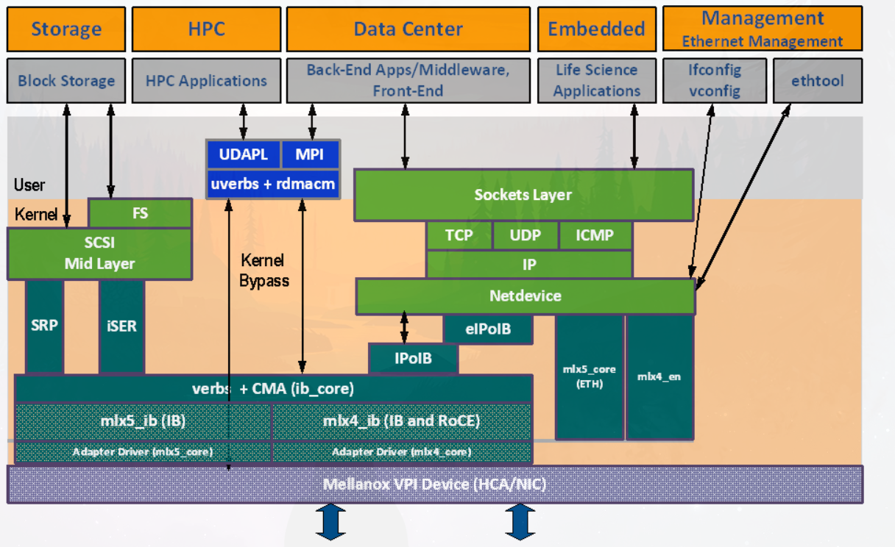

# Mellanox OFED简介
## 简介
`MLNX_OFED`是一个单独的`Virtual Protocol Interconnect`(VPI)软件栈，它包含了所有的NVIDIA 网络组件的适配.
官方文档地址：
https://docs.nvidia.com/networking/display/MLNXOFEDv551032/Introduction

## MLNX_OFED 架构图

从架构图中可以看出

|层|软件|
|----|----|
|用户态软件|HPC Application|
|用户态软件库|uverbs, rdmacm|
|kernel api|mlx5_ib, mlx4_ib, 会抽象出verbe, CMA)|
|网卡驱动|mlx5_core,mlx4_core|


# 裁剪MLNX_OFED包

官方提供的软件包有大量的rpm，并且会有一些包可能会覆盖系统
原有的用户态软件和kernel module, 所以需要裁剪．

如果仅支持nvmeof， 需要至少提供下面几个方面:
kernel module:
* mlx网卡驱动(仅nvmeof)
* kernel api module(这些在网卡驱动相关rpm包中)
* nvme相关驱动(主要为了确保nvme提供的内核参数符合mlnx_ofed的应用程序)
* 用户态软件库(uverbs, rdmacm)

ps :
mlnx-nvme这个驱动包提供了大量的nvme相关驱动:
关于nvme-of的内核参数配置, 见:
https://community.mellanox.com/s/article/howto-configure-nvme-over-fabrics--nvme-of--target-offload
其中配置target时，会涉及一些内核参数的调整．和产品交流了下，
了解到host, target均在咱们的系统上搭建．

## 相关rpm/srpm包
### 网卡驱动相关
* SRPM
```
mlnx-ofa_kernel
mlnx-tools(其中mlnx-ofa_kernel编译出的RPM部分依赖mlnx-tools, 该包为用户态包)
```

* RPMS
```
mlnx-ofa_kernel-modules(包含网卡驱动以及verbs+CMA)
mlnx-ofa_kernel(mlnx-ofa_kernel-modules依赖包)
mlnx-ofa-tools(mlnx-ofa_kernel依赖包)
```

### nvme相关驱动
```
mlnx-nvme
```

### 用户态软件库
#### SRPM
rdma-core

#### RPMS
该SRPM编译出的所有的RPMS
```
ibacm
infiniband-diags
infiniband-diags-compat
libibumad
libibverbs
libibverbs-utils
librdmacm
librdmacm-utils
rdma-core
rdma-core-debuginfo
rdma-core-devel
srp_daemon
```
* infiniband-diags && infiniband-diags-compat<br/>
官方介绍: OpenFabrics Alliance InfiniBand diagnostic tools
看起来像是一些诊断工具，暂时可以不提供(可能线上调试会用)

* srp daemon<br/>
其中srp_daemon是和srp相关，srp全称`scsi RDMA protocol`, 
是为了实现scsi协议的rdma相关的服务,该服务的作用在手册中有说明，
主要是和发现target有关．

* **主要的用户态包**
libibverbs
librdmacm
rdma-core

* 工具包 && 开发包
```
utils:
libibverbs-utils
librdmacm-utils

debuginfo && devel
rdma-core-debuginfo
rdma-core-devel
```
* 作用不确定的RPM包
```
ibacm
libibumad(和DOS MAD相关，看起来和防止DOS攻击有关)
```

建议: 
推测存储商不会去动除nvme rdma之外的软件，所以可以
先只提供`libibverbs` `librdmacm` `rdma-core` 这三个包
