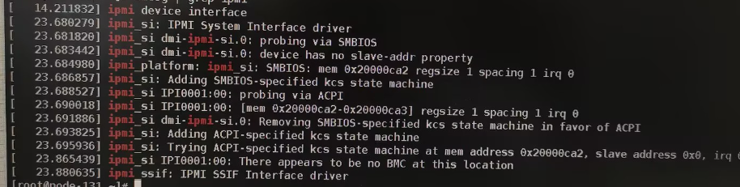
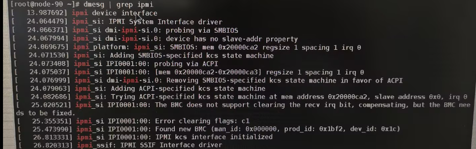

# 问题现象

在客户环境上, 没有`/dev/ipmi0`设备文件, 执行`ipmitool`相关命令会报找不到该设
备文件的错误, 现象如下:


目前报这个错误的节点只有一个, 和正常节点对比`dmesg |grep ipmi`:

* 问题节点

   
* 正常节点

  

可以发现问题节点会报`There appears to be no BMC at this location`的错误.

# 代码分析
```cpp
static int try_smi_init(struct smi_info *new_smi)
{
        ...
        /*
         * Attempt a get device id command.  If it fails, we probably
         * don't have a BMC here.
         */
        rv = try_get_dev_id(new_smi);
        if (rv) {
                if (new_smi->io.addr_source)
                        dev_err(new_smi->io.dev,
                               "There appears to be no BMC at this location\n");
                goto out_err;
        }
        ...
}
```

注释中也提到:
```
执行 "get device id" command, 如果其失败了, 似乎这里没有BMC.
```

查看该函数
```cpp
static int try_get_dev_id(struct smi_info *smi_info)
{
        unsigned char         msg[2];
        unsigned char         *resp;
        unsigned long         resp_len;
        int                   rv = 0;

        resp = kmalloc(IPMI_MAX_MSG_LENGTH, GFP_KERNEL);
        if (!resp)
                return -ENOMEM;

        /*
         * Do a Get Device ID command, since it comes back with some
         * useful info.
         */
        msg[0] = IPMI_NETFN_APP_REQUEST << 2;
        msg[1] = IPMI_GET_DEVICE_ID_CMD;
        smi_info->handlers->start_transaction(smi_info->si_sm, msg, 2);

        rv = wait_for_msg_done(smi_info);
        if (rv)
                goto out;

        resp_len = smi_info->handlers->get_result(smi_info->si_sm,
                                                  resp, IPMI_MAX_MSG_LENGTH);

        /* Check and record info from the get device id, in case we need it. */
        rv = ipmi_demangle_device_id(resp[0] >> 2, resp[1],
                        resp + 2, resp_len - 2, &smi_info->device_id);

out:
        kfree(resp);
        return rv;
}
```
可以看到其下发的是`IPMI_GET_DEVICE_ID_CMD`, 
