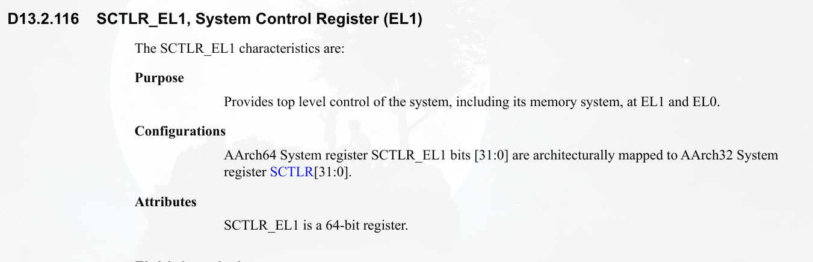

# 调查offline cpu陷入异常原因

## 查看正常cpu的堆栈 : CPU2

```
[    5.324322 ] CPU2 : task_stack is ffff000012330000
[   10.410065 ] secondary cpu (2) start
[   10.410148 ] Detected PIPT I-cache on CPU2
[   10.410157 ] secondary cpu notify (2) start
[   10.410194 ] GICv3: CPU2: found redistributor 2 region 0:0x00000000080e0000
[   10.410522 ] GICv3: CPU2: using allocated LPI pending table @0x0000000800350000
[   10.410594 ] secondary cpu notify (2) end
```

cpu2是可以正常启动的，其中task_struct 为 0xffff000012330000, 
大小实际上是2 * PAGE_SIZE = 128K

查看该堆栈:

```
ffff00001232ff40: 0x0000000000000085 0xffff0000116508a0
ffff00001232ff50: 0x0000000000000002 0x0000000000000002
ffff00001232ff60: 0xffff8007c35a9900 0x0000000000000000
ffff00001232ff70: 0x0000000000000000 0x0000000000000000
ffff00001232ff80: 0x0000000000000000 0xffff00001011f4c8
ffff00001232ff90: 0x0000000000000085 0xefea1f2e980fd700
ffff00001232ffa0: 0xffff00001232ffc0 0xffff000010094ad0         <====(1)
ffff00001232ffb0: 0x0000000000000002 0x0000000000000002
ffff00001232ffc0: 0x0000000000000000 0x0000000000000000
ffff00001232ffd0: 0x0000000000000000 0x0000000000000000
ffff00001232ffe0: 0x0000000000000000 0x0000000000000000
ffff00001232fff0: 0x0000000000000000 0x0000000000000000
```

我们直看栈底的一些内容:

1. ffff00001232ffa0处看起来像是函数开头部分的STP指令

查看0xffff000010094ad0地址指令
```
crash> dis -l 0xffff000010094ad0
/root/rpmbuild/BUILD/kernel-4.18.0-147.5.1.el8_1/linux-4.18.0-147.5.1.el8_1.5es.14.wang4.aarch64/arch/arm64/kernel/smp.c: 284
0xffff000010094ad0 <secondary_start_kernel+392>:        ldp     x19, x20, [sp,#16]
```

查看下`secondary_start_kernel`整个的反汇编

```
crash> dis -l secondary_start_kernel |grep -v "sadfasdf"
0xffff000010094948 <secondary_start_kernel>:    stp     x29, x30, [sp,#-64]!
0xffff00001009494c <secondary_start_kernel+4>:  mov     x29, sp
0xffff000010094950 <secondary_start_kernel+8>:  stp     x19, x20, [sp,#16]
...
0xffff000010094acc <secondary_start_kernel+388>:        bl      0xffff00001011f4a0 <cpu_startup_entry>
0xffff000010094ad0 <secondary_start_kernel+392>:        ldp     x19, x20, [sp,#16]
...
```

可以看到这个函数，会开辟64 bit 大小的栈空间, 所以这个函数的栈顶为
`ffff00001232ffc0`

而`ffff00001232ffb0 -> ffff00001232ffa8`实际上是`cpu_startup_entry`
的堆栈
可以看下`cpu_startup_entry`的反汇编

```
crash> dis -l cpu_startup_entry
/root/rpmbuild/BUILD/kernel-4.18.0-147.5.1.el8_1/linux-4.18.0-147.5.1.el8_1.5es.14.wang4.aarch64/kernel/sched/idle.c: 349
0xffff00001011f4a0 <cpu_startup_entry>: stp     x29, x30, [sp,#-32]!
0xffff00001011f4a4 <cpu_startup_entry+4>:       mov     x29, sp
```
这个函数开辟了32 bit大小的栈空间, 并将x29, x30存放在了栈顶

## 查看异常cpu的堆栈 : CPU3
```
[   10.411837 ] CPU3 : task_stack is ffff000012350000
[   12.494890 ] CPU3: failed to come online
[   12.494914 ] CPU3: failed in unknown state : 0x0
```

查看堆栈

```
ffff00001234ffa0: 0x0000000000000000 0x0000000000000000
ffff00001234ffb0: 0x0000000000000000 0x0000000000000000
ffff00001234ffc0: 0x0000000000000000 0x0000000000000005
ffff00001234ffd0: 0x0000000000000000 0x0000000000000000
ffff00001234ffe0: 0x0000000000000000 0x0000000000000000
ffff00001234fff0: 0x0000000000000000 0x0000000000000000
```

没有保存什么信息
根据qemu monitor `info register -a `命令获取PC寄存器:
```
CPU#3
PC=ffff000010082e00  SP=1de6ec7eecbfc5be
X00=ffff0000116508a8 X01=0000000000000000 X02=0000000000000000 X03=0000000000000000
X04=0000000000000000 X05=ffff000010082000 X06=0000000000000005 X07=0000000000000000
X08=ffff00001098e204 X09=0000000000000000 X10=00400034f5507510 X11=0000000000000000
```
根据pc的值打印来看

```
dis -l ffff000010082e00
/root/rpmbuild/BUILD/kernel-4.18.0-147.5.1.el8_1/linux-4.18.0-147.5.1.el8_1.5es.14.wang4.aarch64/arch/arm64/kernel/entry.S: 539
0xffff000010082e00 <el1_sync>:  stp     x0, x1, [sp]
0xffff000010082e04 <el1_sync+4>:        stp     x2, x3, [sp,#16]
0xffff000010082e08 <el1_sync+8>:        stp     x4, x5, [sp,#32]
0xffff000010082e0c <el1_sync+12>:       stp     x6, x7, [sp,#48]
```
在发生异常的时候，`kernel_ventry`宏定义，会做一些寄存器上下文的save操作
而该堆栈中没有信息，说明，在切换堆栈之前就已经发生了异常:
```
__secondary_switched:
    adr_l   x5, vectors
    msr vbar_el1, x5
    isb

    adr_l   x0, secondary_data
    ldr x1, [x0, #CPU_BOOT_STACK]   // get secondary_data.stack
    mov sp, x1						//<=====切换堆栈
    ldr x2, [x0, #CPU_BOOT_TASK]
    msr sp_el0, x2
    mov x29, #0
    mov x30, #0
    b   secondary_start_kernel
ENDPROC(__secondary_switched)
```
这里我们要看下在切换堆栈之前的堆栈地址是多少

## 进入secondary_entry堆栈为
在代码中写入了一个死循环:
```
ENTRY(secondary_entry)
1:
        b       1b
        bl      el2_setup                       // Drop to EL1
        bl      set_cpu_boot_mode_flag
        b       secondary_startup
ENDPROC(secondary_entry)
```
使用`info register -a`查看cpu寄存器

```
CPU#1
PC=000000004098e1e0  SP=0000000000000000
X00=0000000000000000 X01=0000000000000000 X02=0000000000000000 X03=0000000000000000
X04=0000000000000000 X05=0000000000000000 X06=0000000000000000 X07=0000000000000000
X08=0000000000000000 X09=0000000000000000 X10=0000000000000000 X11=0000000000000000
X12=0000000000000000 X13=0000000000000000 X14=0000000000000000 X15=0000000000000000
X16=0000000000000000 X17=0000000000000000 X18=0000000000000000 X19=0000000000000000
X20=0000000000000000 X21=0000000000000000 X22=0000000000000000 X23=0000000000000000
X24=0000000000000000 X25=0000000000000000 X26=0000000000000000 X27=0000000000000000
X28=0000000000000000 X29=0000000000000000 X30=0000000000000000
PSTATE=000003c5 ---- EL1h
q00=0000000000000000:0000000000000000 q01=0000000000000000:0000000000000000
q02=0000000000000000:0000000000000000 q03=0000000000000000:0000000000000000
q04=0000000000000000:0000000000000000 q05=0000000000000000:0000000000000000
q06=0000000000000000:0000000000000000 q07=0000000000000000:0000000000000000
q08=0000000000000000:0000000000000000 q09=0000000000000000:0000000000000000
q10=0000000000000000:0000000000000000 q11=0000000000000000:0000000000000000
q12=0000000000000000:0000000000000000 q13=0000000000000000:0000000000000000
q14=0000000000000000:0000000000000000 q15=0000000000000000:0000000000000000
q16=0000000000000000:0000000000000000 q17=0000000000000000:0000000000000000
q18=0000000000000000:0000000000000000 q19=0000000000000000:0000000000000000
q20=0000000000000000:0000000000000000 q21=0000000000000000:0000000000000000
q22=0000000000000000:0000000000000000 q23=0000000000000000:0000000000000000
q24=0000000000000000:0000000000000000 q25=0000000000000000:0000000000000000
q26=0000000000000000:0000000000000000 q27=0000000000000000:0000000000000000
q28=0000000000000000:0000000000000000 q29=0000000000000000:0000000000000000
q30=0000000000000000:0000000000000000 q31=0000000000000000:0000000000000000
FPCR: 00000000  FPSR: 00000000
```

sp是0，而且PC有值

## 查看异常原因
这里怀疑是这个代码流程

boot cpu:
```
int __cpu_up(unsigned int cpu, struct task_struct *idle)     
{                                                            
    int ret;                                                 
    long status;
	...
	
int __cpu_up(unsigned int cpu, struct task_struct *idle)                    
{                                                                           
    int ret;                                                                
    long status;                                                            
                                                                            
    secondary_data.task = idle;                //这里会赋值secondary_data相关数据结构
    secondary_data.stack = task_stack_page(idle) + THREAD_SIZE;
    update_cpu_boot_status(CPU_MMU_OFF);
    __flush_dcache_area(&secondary_data, sizeof(secondary_data));
                                                                            
    /*
     * Now bring the CPU into our world.
     */
	//在这里启动secondary cpu
    ret = boot_secondary(cpu, idle);                                        
    if (ret == 0) {                                                         
        /*                                                                  
         * CPU was successfully started, wait for it to come online or      
         * time out.                                                        
         */ 

	//等待超时                                                 
        wait_for_completion_timeout(&cpu_running,                           
                        msecs_to_jiffies(1000));                            
                                                                            
        if (!cpu_online(cpu)) {                                             
            pr_crit("CPU%u: failed to come online\n", cpu);                 
                                                                            
            if (IS_ENABLED(CONFIG_ARM64_USER_VA_BITS_52) && va52mismatch)   
                pr_crit("CPU%u: does not support 52-bit VAs\n", cpu);       
                                                                            
            ret = -EIO;                                                     
        }                                                                   
    } else {                                                                
        pr_err("CPU%u: failed to boot: %d\n", cpu, ret);                    
    }                                                                       
	//将secondary_data.task 赋值为NULL                                                               
    secondary_data.task = NULL;
    secondary_data.stack = NULL;
```

而secondary cpu代码
```
__secondary_switched:
        adr_l   x5, vectors
        msr     vbar_el1, x5
        isb
        adr_l   x0, secondary_data
        ldr     x1, [x0, #CPU_BOOT_STACK]       // get secondary_data.stack
        mov     sp, x1
        ldr     x2, [x0, #CPU_BOOT_TASK]
        msr     sp_el0, x2
        mov     x29, #0
        mov     x30, #0 
        b       secondary_start_kernel
ENDPROC(__secondary_switched)
```

所以会出现这样的情况
```
BOOT_CPU									BOOT_SECONDARY_CPU
boot_secondary								
											secondary_entry
wait

waittimeout

secondary_data.task stack = NULL
											__secondary_switched
											ldr     x1, [x0, #CPU_BOOT_STACK]		<===触发异常
```

## 验证异常代码
修改kernel　代码:
```
__secondary_switched:
        adr_l   x5, vectors
        msr     vbar_el1, x5
        isb
1:                                              //加入死循环
        b       1b
        adr_l   x0, secondary_data
        ldr     x1, [x0, #CPU_BOOT_STACK]       // get secondary_data.stack
        mov     sp, x1
        ldr     x2, [x0, #CPU_BOOT_TASK]
        msr     sp_el0, x2
        mov     x29, #0
        mov     x30, #0
        b       secondary_start_kernel
ENDPROC(__secondary_switched)

int __cpu_up(unsigned int cpu, struct task_struct *idle)
{
    ...
    //除cpu1之外的其他cpu才会等待2s
    if (cpu != 1) {
            wait_for_completion_timeout(&cpu_running,
                                        msecs_to_jiffies(2000));
    }
    ...
}
```
dmesg打印信息:

```
[    0.030990] smp: Bringing up secondary CPUs ...
[    0.031505] CPU1 : task_stack is ffff0000161f0000
[    0.031507] CPU1: failed to come online
[    0.031514] CPU1: failed in unknown state : 0x0
[    0.031549] smp: Brought up 1 node, 1 CPU
[    0.031554] SMP: Total of 1 processors activated.
[    0.031570] CPU features: detected: GIC system register CPU interface
[    0.581039] CPU: All CPU(s) started at EL1
```

可以看到主CPU没有等待secondary　cpu
通过qemu-monitor `info register  -a`查看寄存器信息:

```
CPU#1
PC=ffff00001098e214  SP=0000000000000000
```
查看pc代码:
```
crash> dis __secondary_switched
0xffff00001098e204 <__secondary_switched>:      adrp    x5, 0xffff000010082000 <vectors>
0xffff00001098e208 <__secondary_switched+4>:    add     x5, x5, #0x0
0xffff00001098e20c <__secondary_switched+8>:    msr     vbar_el1, x5
0xffff00001098e210 <__secondary_switched+12>:   isb

//下面代码为PC代码(死循环)
0xffff00001098e214 <__secondary_switched+16>:   b       0xffff00001098e214 <__secondary_switched+16>

0xffff00001098e218 <__secondary_switched+20>:   adrp    x0, 0xffff000011650000 <reset_devices>
0xffff00001098e21c <__secondary_switched+24>:   add     x0, x0, #0x8a8
0xffff00001098e220 <__secondary_switched+28>:   ldr     x1, [x0]
0xffff00001098e224 <__secondary_switched+32>:   mov     sp, x1
0xffff00001098e228 <__secondary_switched+36>:   ldr     x2, [x0,#8]
0xffff00001098e22c <__secondary_switched+40>:   msr     sp_el0, x2
0xffff00001098e230 <__secondary_switched+44>:   mov     x29, #0x0                       // #0
0xffff00001098e234 <__secondary_switched+48>:   mov     x30, #0x0                       // #0
0xffff00001098e238 <__secondary_switched+52>:   b       0xffff000010094948 <secondary_start_kernel>
```

所以可以推测，访问secondary_data中的数据成员会造成异常.

# 调研secondary cpu启动过长原因
由之前的调研可知，secondary cpu被 host kvm 将ip 置为`secondary entry`的物理地址,
代码如下:
```
ENTRY(secondary_entry)
   bl el2_setup       // Drop to EL1
   bl set_cpu_boot_mode_flag
   b  secondary_startup
ENDPROC(secondary_entry)

secondary_startup:
   /*
    * Common entry point for secondary CPUs.
    */
   bl __cpu_secondary_check52bitva
   bl __cpu_setup     // initialise processor
   adrp   x1, swapper_pg_dir
   bl __enable_mmu
   ldr x8, =__secondary_switched
   br x8
ENDPROC(secondary_startup)

__secondary_switched:
    adr_l   x5, vectors
    msr vbar_el1, x5
    isb

    adr_l   x0, secondary_data
    ldr x1, [x0, #CPU_BOOT_STACK] <<=============(1)：　陷入异常
    mov sp, x1
    ldr x2, [x0, #CPU_BOOT_TASK]
    msr sp_el0, x2
    mov x29, #0
    mov x30, #0
    b   secondary_start_kernel
ENDPROC(__secondary_switched)
```
从之前的调研可知，如果cpu offline, 最终会在(1)处陷入异常,
而陷入异常后，因为这个时候sp还是0, 所以进入异常处理函数后，
对堆栈的操作也是会再次陷入异常，从而导致一直死循环．走不到
`secondary_start_kernel`，这个c函数中．

在这个地方，由于流程较早，一些调试手段不可用，例如printk，而
现在又需要一种可以获取时间间隔的方式，来测试里面的哪个子流程
执行时间过长．

因为这个地方是在虚拟机里面，所以guest不好获取的话，可以通过
从host侧获取，方法就是通过在guest el1发生异常，陷入el2进入kvm
的代码，再从kvm中增加调试信息．但是这里要注意的是：陷入el2的方式
要尽量满足下面的需求:
* 次数不能过于频繁，最好是一般情况下guest不会发生的
* 可以trap el2 后不会对guest　state 造成影响，或者是造成影响后, 
 可以安全恢复guest上下文

这里我选择的是hvc指令, 主要原因如下:
* 该指令只在特定的时候guest会用到，次数并不多
* hvc指令，需要用寄存器传参数，其中`r0`寄存器传入的是function num, 
　function num传入的值不满足协议的话，host　会返回错误，但不会注入异常
* 该指令在返回时，会去赋值`r0, r1, r2, r3`这四个寄存器，也比较好恢复
现场

另外，在host kvm　处理hvc指令异常处理流程中，还有现成的ftrace event
可以使用，代码如下:

```
static int handle_hvc(struct kvm_vcpu *vcpu, struct kvm_run *run)
{
    int ret;

    trace_kvm_hvc_arm64(*vcpu_pc(vcpu), vcpu_get_reg(vcpu, 0),
            ¦   kvm_vcpu_hvc_get_imm(vcpu));
    vcpu->stat.hvc_exit_stat++;

    ret = kvm_hvc_call_handler(vcpu);
    if (ret < 0) {
        vcpu_set_reg(vcpu, 0, ~0UL);
        return 1;
    }

    return ret;
}
```
ftrace event `kvm_hvc_arm64`的定义为：
```
TRACE_EVENT(kvm_hvc_arm64,
    TP_PROTO(unsigned long vcpu_pc, unsigned long r0, unsigned long imm),
    TP_ARGS(vcpu_pc, r0, imm),

    TP_STRUCT__entry(
        __field(unsigned long, vcpu_pc)
        __field(unsigned long, r0)
        __field(unsigned long, imm)
    ),

    TP_fast_assign(
        __entry->vcpu_pc = vcpu_pc;
        __entry->r0 = r0;
        __entry->imm = imm;
    ),

    TP_printk("HVC at 0x%08lx (r0: 0x%08lx, imm: 0x%lx)",
        ¦ __entry->vcpu_pc, __entry->r0, __entry->imm)
);
```
从上面的定义可知，该ftrace function 会打印触发异常的pc, r0，以及hvc指令需要的#imm

修改代码，加入hvc指令，一步步缩小范围，最终修改代码如下，找到了执行时间慢的指令

修改的代码如下:
```
.macro my_hvc, imm_p
mov     x5, x0
mov     x6, x1
mov     x7, x2
mov     x8, x3
hvc     #\imm_p
mov     x0, x5
mov     x1, x6
mov     x2, x7
mov     x3, x8
.endm

ENTRY(__enable_mmu)
    ...
        my_hvc  3
        msr     ttbr1_el1, x1                   // load TTBR1
        my_hvc  0x31
        isb
        my_hvc  0x32
        msr     sctlr_el1, x0
        my_hvc  0x33
        isb
        my_hvc  0x34
        my_hvc  4
        /*
         * Invalidate the local I-cache so that any instructions fetched
         * speculatively from the PoC are discarded, since they may have
         * been dynamically patched at the PoU.
         */
        ic      iallu
        dsb     nsh
        isb
        ret
ENDPROC(__enable_mmu)
```

获取ftrace event 信息,如下:
```
    //这是boot cpu调用__enable_mmu　产生的打印信息
           <...>-16291 [015] .... 780932.836905: kvm_hvc_arm64: HVC at 0x4098e46c (r0: 0x34f5d91d, imm: 0x5)
           <...>-16291 [015] .... 780932.836929: kvm_hvc_arm64: HVC at 0x4098e2f4 (r0: 0x34f5d91d, imm: 0x3)
           <...>-16291 [015] .... 780932.836932: kvm_hvc_arm64: HVC at 0x4098e31c (r0: 0x34f5d91d, imm: 0x31)
           <...>-16291 [015] .... 780932.836936: kvm_hvc_arm64: HVC at 0x4098e344 (r0: 0x34f5d91d, imm: 0x32)
           <...>-16291 [015] .... 780932.836940: kvm_hvc_arm64: HVC at 0x4098e36c (r0: 0x34f5d91d, imm: 0x33)
           <...>-16291 [015] .... 780932.836943: kvm_hvc_arm64: HVC at 0x4098e394 (r0: 0x34f5d91d, imm: 0x34)
           <...>-16291 [015] .... 780932.836945: kvm_hvc_arm64: HVC at 0x4098e3b8 (r0: 0x34f5d91d, imm: 0x4)
           <...>-16291 [015] .... 780932.836953: kvm_hvc_arm64: HVC at 0x4098e494 (r0: 0x34f5d91d, imm: 0x6)

    //下面是secondary cpu调用__enable_mmu产生的打印信息:
        qemu-kvm-16293 [054] .... 780939.185069: kvm_hvc_arm64: HVC at 0x4098e204 (r0: 0x00000e11, imm: 0x1)
        qemu-kvm-16293 [054] .... 780939.185123: kvm_hvc_arm64: HVC at 0x4098e230 (r0: 0x34f5d91d, imm: 0x2)
        qemu-kvm-16293 [054] .... 780939.185134: kvm_hvc_arm64: HVC at 0x4098e2f4 (r0: 0x34f5d91d, imm: 0x3)
        qemu-kvm-16293 [054] .... 780939.185140: kvm_hvc_arm64: HVC at 0x4098e31c (r0: 0x34f5d91d, imm: 0x31)
        qemu-kvm-16293 [054] .... 780939.185144: kvm_hvc_arm64: HVC at 0x4098e344 (r0: 0x34f5d91d, imm: 0x32)
		-------------------这块花费的时间长-----------------------------------------------------------------
        qemu-kvm-16293 [052] .... 780950.614029: kvm_hvc_arm64: HVC at 0x4098e36c (r0: 0x34f5d91d, imm: 0x33)
        qemu-kvm-16293 [052] .... 780950.614052: kvm_hvc_arm64: HVC at 0x4098e394 (r0: 0x34f5d91d, imm: 0x34)
        qemu-kvm-16293 [052] .... 780950.614054: kvm_hvc_arm64: HVC at 0x4098e3b8 (r0: 0x34f5d91d, imm: 0x4)
        qemu-kvm-16293 [052] .... 780950.614064: kvm_hvc_arm64: HVC at 0x4098e258 (r0: 0x34f5d91d, imm: 0x1)
```
可以看到boot cpu 调用时，并没有发生执行时间过长的问题，而secondary cpu在执行 `hvc #32`　和`hvc #33`指令中
执行时间超过了1s, 该kernel代码为:
```
my_hvc  0x32
msr     sctlr_el1, x0
my_hvc  0x33
```
关于该指令在armv8　man中的说明:

可以看到是控制内存管理的主要系统寄存器．
MSR 当前系统寄存器的指令解码伪代码为:
```
if PSTATE.EL == EL0 then
    UNDEFINED;

elsif PSTATE.EL == EL1 then
	if EL2Enabled() && HCR_EL2.TVM == '1' then
		AArch64.SystemAccessTrap(EL2, 0x18);
	elsif EL2Enabled() && (!HaveEL(EL3) || SCR_EL3.FGTEn == '1') && HFGWTR_EL2.SCTLR_EL1 == '1' then
		AArch64.SystemAccessTrap(EL2, 0x18);
	elsif EL2Enabled() && HCR_EL2.<NV2,NV1,NV> == '111' then
		NVMem[0x110] = X[t];
	else
		SCTLR_EL1 = X[t];
elsif PSTATE.EL == EL2 then
	if HCR_EL2.E2H == '1' then
		SCTLR_EL2 = X[t];
else
	SCTLR_EL1 = X[t];
elsif PSTATE.EL == EL3 then
	SCTLR_EL1 = X[t];
```
可以看到当前异常级别为el1并且是在虚拟机中运行的时候，会trap到el2(kvm)，并且会注入一个`0x18`的值.


## 查看kvm代码
### 异常值宏定义
```
#define ESR_ELx_EC_SYS64    (0x18)
```

###　相关处理流程

```C/C++
int kvm_handle_sys_reg(struct kvm_vcpu *vcpu, struct kvm_run *run)
{
    struct sys_reg_params params;
    unsigned long esr = kvm_vcpu_get_hsr(vcpu);
    int Rt = kvm_vcpu_sys_get_rt(vcpu);
    int ret;

    trace_kvm_handle_sys_reg(esr);

    params.is_aarch32 = false;
    params.is_32bit = false;
    params.Op0 = (esr >> 20) & 3;
    params.Op1 = (esr >> 14) & 0x7;
    params.CRn = (esr >> 10) & 0xf;
    params.CRm = (esr >> 1) & 0xf;
    params.Op2 = (esr >> 17) & 0x7;
    params.regval = vcpu_get_reg(vcpu, Rt);
    params.is_write = !(esr & 1);

    ret = emulate_sys_reg(vcpu, &params);

    if (!params.is_write)
        vcpu_set_reg(vcpu, Rt, params.regval);
    return ret;
}
```
该函数会从esr中获取系统寄存器的值, 并且看下是否是写操作造成的异常，
然后调用 `emulate_sys_reg` 去模拟该次的行为，如果不是写操作的话，恢复
下该寄存器的值．

```C/C++
static int emulate_sys_reg(struct kvm_vcpu *vcpu,
            ¦  struct sys_reg_params *params)
{
    size_t num;
    const struct sys_reg_desc *table, *r;

    table = get_target_table(vcpu->arch.target, true, &num);

    /* Search target-specific then generic table. */
    r = find_reg(params, table, num);
    if (!r)
        r = find_reg(params, sys_reg_descs, ARRAY_SIZE(sys_reg_descs));

    if (likely(r)) {
        perform_access(vcpu, params, r);
    } else {
        kvm_err("Unsupported guest sys_reg access at: %lx [%08lx]\n",
            *vcpu_pc(vcpu), *vcpu_cpsr(vcpu));
        print_sys_reg_instr(params);
        kvm_inject_undefined(vcpu);
    }
    return 1;
}
```

该函数会在sys_reg_descs 表中找到该寄存器的描述符，然后在调用perform_access


host ftrace:
```
           <...>-25986 [042] ....  1310.015646: kvm_hvc_arm64: HVC at 0x4098e344 (r0: 0x34f5d91d, imm: 0x32)
        qemu-kvm-25986 [042] ....  1312.142496: kvm_hvc_arm64: HVC at 0x4098e36c (r0: 0x34f5d91d, imm: 0x33)
```

host dmesg:
```
[ 1293.854904] stage2 flush vm begin
[ 1293.868297] stage2 flush vm end
[ 1310.015649] stage2 flush vm begin
[ 1312.137469] stage2 flush vm end
```

# kernel stream git commit 
0ac398b171aacd0f0c132d989ec4efb5de94f34a
