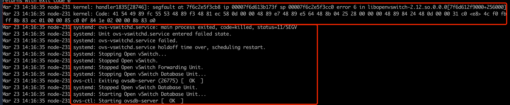
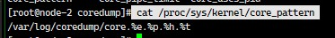
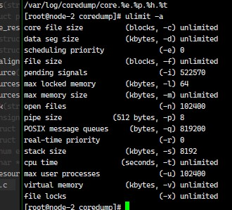

# 问题现象
在message文件中,显示ovs因段错误重启
信息如下


# 初步分析
## ulimit

ulimit和coredump文件路径均没有问题



## ftrace获取do_coredump有没有执行

由上面message信息可知,ovs是收到了SIGSEGV(段错误)
信号

查看kernel信号处理相关函数:
```
bool get_signal(struct ksignal *ksig)
{
    struct sighand_struct *sighand = current->sighand;
    struct signal_struct *signal = current->signal;
    int signr;

	...
	for (;;) {
		struct k_sigaction *ka;
		ka = &sighand->action[signr-1];                     
                                                    
		/* Trace actually delivered signals. */             
		trace_signal_deliver(signr, &ksig->info, ka);       
		//信号被忽略                              
		if (ka->sa.sa_handler == SIG_IGN) /* Do nothing.  */
		    continue;

		//信号处理是default
		if (ka->sa.sa_handler != SIG_DFL) {
		    /* Run the handler.  */
		    //在这个地方会赋值ka
		    ksig->ka = *ka;
   
		    if (ka->sa.sa_flags & SA_ONESHOT)
		        ka->sa.sa_handler = SIG_DFL;
   
		    break; /* will return non-zero "signr" value */ 
		}

	}
	//信号不被处理
	if (sig_kernel_ignore(signr)) /* Default is nothing. */ 
    	continue;
	...
	//该信号处理要不要产生coredump ====(1)=====
	if (sig_kernel_coredump(signr)) {                       
    	if (print_fatal_signals)                            
    	    print_fatal_signal(ksig->info.si_signo);        
    	proc_coredump_connector(current);                   
    	/*                                                  
    	 * If it was able to dump core, this kills all
    	 * other threads in the group and synchronizes with
    	 * their demise.  If we lost the race with another
    	 * thread getting here, it set group_exit_code
    	 * first and our do_group_exit call below will use
    	 * that value and ignore the one we pass it.
    	 */
    	do_coredump(&ksig->info);
	}
	...
}                                                       

```
从(1)处看, 如果SIGSEGV信号没有被忽略,也没有默认的信号处理函数,
则会使用`sig_kernel_coredump()`

`sig_kernel_coredump`相关定义:
```
#define sig_kernel_coredump(sig)    siginmask(sig, SIG_KERNEL_COREDUMP_MASK)
#define SIG_KERNEL_COREDUMP_MASK (\                       
    ¦   rt_sigmask(SIGQUIT)   |  rt_sigmask(SIGILL)    | \
    rt_sigmask(SIGTRAP)   	  |  rt_sigmask(SIGABRT)   | \    
    ¦   rt_sigmask(SIGFPE)    |  rt_sigmask(SIGSEGV)   | \
    rt_sigmask(SIGBUS)    	  |  rt_sigmask(SIGSYS)    | \    
    ¦   rt_sigmask(SIGXCPU)   |  rt_sigmask(SIGXFSZ)   | \
    SIGEMT_MASK                    )                      
```

从上面可以得知,SIGSEGV信号默认处理会触发coredump流程

# 使用ftrace (function_graph) 跟踪器调试
```
# tracer: function_graph
#
# CPU  DURATION                  FUNCTION CALLS
# |     |   |                     |   |   |   |
  10)               |  do_coredump() {
  10)               |    audit_core_dumps() {
  10)               |      audit_log_start() {
  10)   0.162 us    |        audit_filter();
  10)               |        kmem_cache_alloc() {
  10)               |          _cond_resched() {
  10)   0.027 us    |            rcu_all_qs();
  10)   0.313 us    |          }
  10)   0.028 us    |          should_failslab();
  10)   1.035 us    |        }
  10)               |        __alloc_skb() {
  10)               |          kmem_cache_alloc_node() {
  10)               |            _cond_resched() {
  10)   0.027 us    |              rcu_all_qs();
  10)   0.499 us    |            }
  10)   0.027 us    |            should_failslab();
  10)   1.233 us    |          }
  10)               |          __kmalloc_reserve.isra.50() {
  10)               |            __kmalloc_node_track_caller() {
  10)   0.057 us    |              kmalloc_slab();
  10)               |              _cond_resched() {
  10)   0.029 us    |                rcu_all_qs();
  10)   0.305 us    |              }
  10)   0.028 us    |              should_failslab();
  10)   1.498 us    |            }
  10)   1.823 us    |          }
  10)   0.487 us    |          ksize();
  10)   4.356 us    |        }
  10)               |        __nlmsg_put() {
  10)   0.035 us    |          skb_put();
  10)   0.340 us    |        }
  10)   0.106 us    |        ktime_get_coarse_real_ts64();
  10)               |        audit_log_format() {
  10)               |          audit_log_vformat() {
  10)   0.037 us    |            skb_put();
  10)   0.996 us    |          }
  10)   1.439 us    |        }
  10) + 10.114 us   |      }
  10)               |      audit_log_task() {
								...
  10) + 16.099 us   |      }
  10)               |      audit_log_format() {
  10)               |        audit_log_vformat() {
  10)   0.031 us    |          skb_put();
  10)   0.504 us    |        }
  10)   0.782 us    |      }
  10)               |      audit_log_end() {
								...
  10)   9.365 us    |      }
  10) + 37.732 us   |    }
  10) + 38.982 us   |  } 
```

下面查看do_coredump细节流程


# 进一步分析
```
:void do_coredump(const kernel_siginfo_t *siginfo)                      
{                                                                      
	...
	struct coredump_params cprm = {
	    .siginfo = siginfo,
	    .regs = signal_pt_regs(),
	    .limit = rlimit(RLIMIT_CORE),
	    .mm_flags = mm->flags,
	};
                                                                                                                                        
    audit_core_dumps(siginfo->si_signo);

    binfmt = mm->binfmt;                                               
    if (!binfmt || !binfmt->core_dump)	===(1)====
        goto fail;                                                     
    if (!__get_dumpable(cprm.mm_flags)) ===(2)====                     
        goto fail;

	//正常流程会走到这
	cred = prepare_creds();
	...
}

static inline int __get_dumpable(unsigned long mm_flags)
{
    return mm_flags & MMF_DUMPABLE_MASK;
}
```

通过ftrace信息和代码来看, 在(1)或者(2)处, goto fail
本地环境也出现了类似的现象, 通过`crash`工具调试分析:
```
crash> ps |grep ovs-vswit
   3736      1  60  ffff803f0f6f9600  IN   0.0 6583744 248448  ovs-vswitchd
crash> struct task_struct.mm ffff803f0f6f9600
  mm = 0xffff803f0da4c000
crash> struct mm_struct.flags 0xffff803f0da4c000
    flags = 204
```

查看kernel代码中和coredump `mm->flags`相关内容:
```
#define SUID_DUMP_DISABLE   0   /* No setuid dumping */
#define SUID_DUMP_USER      1   /* Dump as user of process */
#define SUID_DUMP_ROOT      2   /* Dump as root */

#define MMF_DUMPABLE_BITS 2
#define MMF_DUMPABLE_MASK ((1 << MMF_DUMPABLE_BITS) - 1)
```

可以看出如果后两位是`00`(`SUID_DUMP_DISABLE`),则不会产生
coredump

如果是
* `01`(`SUID_DUMP_USER`): 产生当前进程用户权限的coredump
* `10`(`SUID_DUMP_ROOT`): 产生root用户权限的coredump

## 查看何时设置的该flags
查看kernel相关代码，设置该flags的代码为`set_dumpable()`
```
void set_dumpable(struct mm_struct *mm, int value)
{
    unsigned long old, new;

    if (WARN_ON((unsigned)value > SUID_DUMP_ROOT))
        return;

    do {
        old = READ_ONCE(mm->flags);
        new = (old & ~MMF_DUMPABLE_MASK) | value;
    } while (cmpxchg(&mm->flags, old, new) != old);
}
```

查看调用代码:

```
   1   1365  /root/workspace/linux-4.18.0-147/fs/exec.c <<setup_new_exec>>
             set_dumpable(current->mm, suid_dumpable);
   2   1367  /root/workspace/linux-4.18.0-147/fs/exec.c <<setup_new_exec>>
             set_dumpable(current->mm, SUID_DUMP_USER);
   3    449  /root/workspace/linux-4.18.0-147/kernel/cred.c <<commit_creds>>
             set_dumpable(task->mm, suid_dumpable);
   4   2300  /root/workspace/linux-4.18.0-147/kernel/sys.c <<SYSCALL_DEFINE5>>
             set_dumpable(me->mm, arg2);
```

可以看到，有三个地方可以调到，`setup_new_exec`, `commit_creds`,
系统调用`prctl`

### 查看setup_new_exec代码
```
void setup_new_exec(struct linux_binprm * bprm)
{
	...
	if (bprm->interp_flags & BINPRM_FLAGS_ENFORCE_NONDUMP ||
	   !(uid_eq(current_euid(), current_uid()) &&
	     gid_eq(current_egid(), current_gid())))
	        set_dumpable(current->mm, suid_dumpable);
	else
	        set_dumpable(current->mm, SUID_DUMP_USER);
	...
}
```
在执行时发现，uid和euid不相等或者egid和gid不相等时，会设置成`suid_dumpable`

ps : `usid_dumpable`实际上是`/proc/sys/fs/suid_dumpable`值，也就是说
即便是判断了不能产生coredump，但是会根据该文件的值，设置coredump flags

### 查看commit_creds

```
int commit_creds(struct cred *new)
{
    struct task_struct *task = current;
    const struct cred *old = task->real_cred;
	...
	/* dumpability changes */
	if (!uid_eq(old->euid, new->euid) ||
	¦   !gid_eq(old->egid, new->egid) ||
	¦   !uid_eq(old->fsuid, new->fsuid) ||
	¦   !gid_eq(old->fsgid, new->fsgid) ||
	¦   !cred_cap_issubset(old, new)) {
	    if (task->mm)
	        set_dumpable(task->mm, suid_dumpable);
	    task->pdeath_signal = 0;
	    smp_wmb();
	}
}
```
可以发现设置前后的euid, egid,fsuid, fsgid不相同，
则改变进程dumpable

## 使用systemtap调试
脚本:
```
%{
#include <linux/cred.h>
%}

function print_euid()
%{
        STAP_PRINTF("current_euid(%d) current_uid(%d) current_egid(%d) current_gid(%d)\n",
                        current_euid(), current_uid(), current_egid(), current_gid());
%}
function print_mm_flags()
%{

        STAP_PRINTF("current->mm->flags (%d)\n", current->mm->flags);
%}

function print_new_old_cred:long(new_cred_addr:long)
%{
        const struct cred *old=current->real_cred;
        struct cred *new=(struct cred *)STAP_ARG_new_cred_addr;
        long ret = 0;

        STAP_PRINTF("\told->euid(%d) new->euid(%d) \n"
                    "\told->egid(%d) new->egid(%d) \n"
                    "\told->fsuid(%d) new->fsuid(%d) \n"
                    "\told->fsgid(%d new->fsgid(%d) \n",
                    old->euid, new->euid,
                    old->egid, new->egid,
                    old->fsuid, new->fsuid,
                    old->fsgid, new->fsgid);

        ret = uid_eq(old->euid, new->euid) && gid_eq(old->egid, new->egid) &&
                uid_eq(old->fsuid, new->fsuid) && gid_eq(old->fsgid, new->fsgid);
        STAP_RETURN(ret);
%}

probe kernel.function("setup_new_exec")
{
        exec_file_name=kernel_string($bprm->filename);
#printf("the execname(%s) filename(%s)\n", execname(), exec_file_name);

        if (exec_file_name == "/sbin/ovs-vswitchd") {
                printf("========setup_new_exec()====\n");
                printf("exec_name(%s) bprm->interp_flags(%lu)\n", execname(), $bprm->interp_flags);
                print_current_comm();
                print_euid();
                print_mm_flags();
        }

}
function print_current_comm()
%{
        STAP_PRINTF("current_comm (%s)\n", current->comm);
%}


probe kernel.function("setup_new_exec").return
{
        exec_file_name=kernel_string($bprm->filename);

        if (exec_file_name == "/sbin/ovs-vswitchd") {
                printf("========setup_new_exec().return====\n");
                print_current_comm();
                print_mm_flags();
        }

}

probe kernel.function("commit_creds")
{
        if (execname() == "ovs-vswitchd")
        {
                printf("========commit_creds()====\n");
                if (!print_new_old_cred($new))
                {
                        printf("print_backtrace==\n");
                        print_backtrace();
                        printf("print_ubacktrace==\n");
                        print_ubacktrace();
                }
                print_mm_flags();
        }
}
probe kernel.function("commit_creds").return
{
        if (execname() == "ovs-vswitchd")
        {
                printf("========commit_creds().return====\n");
                print_mm_flags();
        }
}

```
执行该脚本，并且执行`systemctl restart openvswitch`调试重启ovs

输出信息如下:

```
========setup_new_exec()====
exec_name(ovs-ctl) bprm->interp_flags(0)
current_comm (ovs-ctl)
current_euid(0) current_uid(0) current_egid(0) current_gid(0)
current->mm->flags (205)
========setup_new_exec().return====
current_comm (ovs-vswitchd)
current->mm->flags (205)
========commit_creds()====
        old->euid(0) new->euid(0)
        old->egid(0) new->egid(0)
        old->fsuid(0) new->fsuid(0)
        old->fsgid(0 new->fsgid(0)
current->mm->flags (205)
========commit_creds().return====
current->mm->flags (205)
WARNING: Missing unwind data for a module, rerun with 'stap -d /usr/lib64/libpthread-2.17.so'
WARNING: Missing unwind data for a module, rerun with 'stap -d /usr/lib64/libpthread-2.17.so'
========setup_new_exec()====
exec_name(nice) bprm->interp_flags(0)
current_comm (nice)
current_euid(0) current_uid(0) current_egid(0) current_gid(0)
current->mm->flags (205)
========setup_new_exec().return====
current_comm (ovs-vswitchd)
current->mm->flags (205)
========commit_creds()====
        old->euid(0) new->euid(0)
        old->egid(0) new->egid(0)
        old->fsuid(0) new->fsuid(0)
        old->fsgid(0 new->fsgid(0)
current->mm->flags (205)
========commit_creds().return====
current->mm->flags (205)
========commit_creds()====
        old->euid(0) new->euid(0)
        old->egid(0) new->egid(0)
        old->fsuid(0) new->fsuid(0)
        old->fsgid(0 new->fsgid(0)
current->mm->flags (205)
========commit_creds().return====
current->mm->flags (205)
========commit_creds()====
        old->euid(0) new->euid(0)
        old->egid(0) new->egid(0)
        old->fsuid(0) new->fsuid(0)
        old->fsgid(0 new->fsgid(0)
current->mm->flags (205)
========commit_creds().return====
current->mm->flags (205)
========commit_creds()====
        old->euid(0) new->euid(0)
        old->egid(0) new->egid(0)
        old->fsuid(0) new->fsuid(0)
        old->fsgid(0 new->fsgid(0)
current->mm->flags (205)
========commit_creds().return====
current->mm->flags (205)
========commit_creds()====
        old->euid(0) new->euid(0)
        old->egid(0) new->egid(0)
        old->fsuid(0) new->fsuid(0)
        old->fsgid(0 new->fsgid(0)
current->mm->flags (205)
========commit_creds().return====
current->mm->flags (205)
========commit_creds()====
        old->euid(0) new->euid(0)
        old->egid(0) new->egid(0)
        old->fsuid(0) new->fsuid(0)
        old->fsgid(0 new->fsgid(0)
current->mm->flags (205)
========commit_creds().return====
current->mm->flags (205)
========commit_creds()====
        old->euid(0) new->euid(0)
        old->egid(0) new->egid(0)
        old->fsuid(0) new->fsuid(0)
        old->fsgid(0 new->fsgid(0)
current->mm->flags (205)
========commit_creds().return====
current->mm->flags (205)
========commit_creds()====
        old->euid(0) new->euid(0)
        old->egid(0) new->egid(0)
        old->fsuid(0) new->fsuid(0)
        old->fsgid(0 new->fsgid(0)
current->mm->flags (205)
========commit_creds().return====
current->mm->flags (205)
========commit_creds()====
        old->euid(0) new->euid(0)
        old->egid(0) new->egid(0)
        old->fsuid(0) new->fsuid(0)
        old->fsgid(0 new->fsgid(0)
current->mm->flags (205)
========commit_creds().return====
current->mm->flags (205)
========commit_creds()====
        old->euid(0) new->euid(0)
        old->egid(0) new->egid(0)
        old->fsuid(0) new->fsuid(0)
        old->fsgid(0 new->fsgid(0)
current->mm->flags (205)
========commit_creds().return====
current->mm->flags (205)
========commit_creds()====
        old->euid(0) new->euid(0)
        old->egid(0) new->egid(0)
        old->fsuid(0) new->fsuid(0)
        old->fsgid(0 new->fsgid(0)
current->mm->flags (205)
========commit_creds().return====
current->mm->flags (205)
========commit_creds()====
        old->euid(0) new->euid(0)
        old->egid(0) new->egid(0)
        old->fsuid(0) new->fsuid(0)
        old->fsgid(0 new->fsgid(0)
current->mm->flags (205)
========commit_creds().return====
current->mm->flags (205)
========commit_creds()====
        old->euid(0) new->euid(0)
        old->egid(0) new->egid(0)
        old->fsuid(0) new->fsuid(0)
        old->fsgid(0 new->fsgid(0)
current->mm->flags (205)
========commit_creds().return====
current->mm->flags (205)
========commit_creds()====
        old->euid(0) new->euid(0)
        old->egid(0) new->egid(0)
        old->fsuid(0) new->fsuid(0)
        old->fsgid(0 new->fsgid(0)
current->mm->flags (205)
========commit_creds().return====
current->mm->flags (205)
========commit_creds()====
        old->euid(0) new->euid(0)
        old->egid(0) new->egid(0)
        old->fsuid(0) new->fsuid(0)
        old->fsgid(0 new->fsgid(0)
current->mm->flags (205)
========commit_creds().return====
current->mm->flags (205)
========commit_creds()====
        old->euid(0) new->euid(0)
        old->egid(0) new->egid(0)
        old->fsuid(0) new->fsuid(0)
        old->fsgid(0 new->fsgid(0)
current->mm->flags (205)
========commit_creds().return====
current->mm->flags (205)
========commit_creds()====
        old->euid(0) new->euid(0)
        old->egid(0) new->egid(0)
        old->fsuid(0) new->fsuid(0)
        old->fsgid(0 new->fsgid(0)
current->mm->flags (205)
========commit_creds().return====
current->mm->flags (205)
========commit_creds()====
        old->euid(0) new->euid(0)
        old->egid(0) new->egid(0)
        old->fsuid(0) new->fsuid(0)
        old->fsgid(0 new->fsgid(0)
current->mm->flags (205)
========commit_creds().return====
current->mm->flags (205)
========commit_creds()====
        old->euid(0) new->euid(0)
        old->egid(0) new->egid(0)
        old->fsuid(0) new->fsuid(0)
        old->fsgid(0 new->fsgid(0)
current->mm->flags (205)
========commit_creds().return====
current->mm->flags (205)
========commit_creds()====
        old->euid(0) new->euid(0)
        old->egid(0) new->egid(0)
        old->fsuid(0) new->fsuid(0)
        old->fsgid(0 new->fsgid(0)
current->mm->flags (205)
========commit_creds().return====
current->mm->flags (205)
========commit_creds()====
        old->euid(0) new->euid(0)
        old->egid(0) new->egid(0)
        old->fsuid(0) new->fsuid(0)
        old->fsgid(0 new->fsgid(0)
current->mm->flags (205)
========commit_creds().return====
current->mm->flags (205)
========commit_creds()====
        old->euid(0) new->euid(0)
        old->egid(0) new->egid(0)
        old->fsuid(0) new->fsuid(0)
        old->fsgid(0 new->fsgid(0)
current->mm->flags (205)
========commit_creds().return====
current->mm->flags (205)
========commit_creds()====
        old->euid(0) new->euid(0)
        old->egid(0) new->egid(0)
        old->fsuid(0) new->fsuid(0)
        old->fsgid(0 new->fsgid(0)
current->mm->flags (205)
========commit_creds().return====
current->mm->flags (205)
========commit_creds()====
        old->euid(0) new->euid(0)
        old->egid(0) new->egid(0)
        old->fsuid(0) new->fsuid(0)
        old->fsgid(0 new->fsgid(0)
current->mm->flags (205)
========commit_creds().return====
current->mm->flags (205)
========commit_creds()====
        old->euid(0) new->euid(0)
        old->egid(0) new->egid(0)
        old->fsuid(0) new->fsuid(0)
        old->fsgid(0 new->fsgid(0)
current->mm->flags (205)
========commit_creds().return====
current->mm->flags (205)
========commit_creds()====
        old->euid(0) new->euid(0)
        old->egid(0) new->egid(0)
        old->fsuid(0) new->fsuid(0)
        old->fsgid(0 new->fsgid(0)
current->mm->flags (205)
========commit_creds().return====
current->mm->flags (205)
========commit_creds()====
        old->euid(0) new->euid(0)
        old->egid(0) new->egid(0)
        old->fsuid(0) new->fsuid(0)
        old->fsgid(0 new->fsgid(0)
current->mm->flags (205)
========commit_creds().return====
current->mm->flags (205)
========commit_creds()====
        old->euid(0) new->euid(0)
        old->egid(0) new->egid(0)
        old->fsuid(0) new->fsuid(0)
        old->fsgid(0 new->fsgid(0)
current->mm->flags (205)
========commit_creds().return====
current->mm->flags (205)
========commit_creds()====
        old->euid(0) new->euid(0)
        old->egid(0) new->egid(0)
        old->fsuid(0) new->fsuid(0)
        old->fsgid(0 new->fsgid(0)
current->mm->flags (205)
========commit_creds().return====
current->mm->flags (205)
========commit_creds()====
        old->euid(0) new->euid(0)
        old->egid(0) new->egid(0)
        old->fsuid(0) new->fsuid(0)
        old->fsgid(0 new->fsgid(0)
current->mm->flags (205)
========commit_creds().return====
current->mm->flags (205)
========commit_creds()====
        old->euid(0) new->euid(0)
        old->egid(0) new->egid(0)
        old->fsuid(0) new->fsuid(0)
        old->fsgid(0 new->fsgid(0)
current->mm->flags (205)
========commit_creds().return====
current->mm->flags (205)
========commit_creds()====
        old->euid(0) new->euid(0)
        old->egid(0) new->egid(0)
        old->fsuid(0) new->fsuid(0)
        old->fsgid(0 new->fsgid(0)
current->mm->flags (205)
========commit_creds().return====
current->mm->flags (205)
========commit_creds()====
        old->euid(0) new->euid(0)
        old->egid(0) new->egid(0)
        old->fsuid(0) new->fsuid(0)
        old->fsgid(0 new->fsgid(0)
current->mm->flags (205)
========commit_creds().return====
current->mm->flags (205)
========commit_creds()====
        old->euid(0) new->euid(0)
        old->egid(0) new->egid(0)
        old->fsuid(0) new->fsuid(0)
        old->fsgid(0 new->fsgid(0)
current->mm->flags (205)
========commit_creds().return====
current->mm->flags (205)
========commit_creds()====
        old->euid(0) new->euid(0)
        old->egid(0) new->egid(0)
        old->fsuid(0) new->fsuid(0)
        old->fsgid(0 new->fsgid(0)
current->mm->flags (205)
========commit_creds().return====
current->mm->flags (205)
========commit_creds()====
        old->euid(0) new->euid(0)
        old->egid(0) new->egid(0)
        old->fsuid(0) new->fsuid(0)
        old->fsgid(0 new->fsgid(0)
current->mm->flags (205)
========commit_creds().return====
current->mm->flags (205)
========commit_creds()====
        old->euid(0) new->euid(0)
        old->egid(0) new->egid(0)
        old->fsuid(0) new->fsuid(0)
        old->fsgid(0 new->fsgid(0)
current->mm->flags (205)
========commit_creds().return====
current->mm->flags (205)
========commit_creds()====
        old->euid(0) new->euid(0)
        old->egid(0) new->egid(0)
        old->fsuid(0) new->fsuid(0)
        old->fsgid(0 new->fsgid(0)
current->mm->flags (205)
========commit_creds().return====
current->mm->flags (205)
========commit_creds()====
        old->euid(0) new->euid(0)
        old->egid(0) new->egid(0)
        old->fsuid(0) new->fsuid(0)
        old->fsgid(0 new->fsgid(0)
current->mm->flags (205)
========commit_creds().return====
current->mm->flags (205)
========commit_creds()====
        old->euid(0) new->euid(0)
        old->egid(0) new->egid(0)
        old->fsuid(0) new->fsuid(0)
        old->fsgid(0 new->fsgid(0)
current->mm->flags (205)
========commit_creds().return====
current->mm->flags (205)
========commit_creds()====
        old->euid(0) new->euid(0)
        old->egid(0) new->egid(0)
        old->fsuid(0) new->fsuid(0)
        old->fsgid(0 new->fsgid(0)
current->mm->flags (205)
========commit_creds().return====
current->mm->flags (205)
========commit_creds()====
        old->euid(0) new->euid(0)
        old->egid(0) new->egid(1002)
        old->fsuid(0) new->fsuid(0)
        old->fsgid(0 new->fsgid(1002)
print_backtrace==
 0xffff00001010a648 : commit_creds+0x0/0x2b8 [kernel]
 0xffff00001010a648 : commit_creds+0x0/0x2b8 [kernel]
 0xffff0000100f95f0 : __arm64_sys_setresgid+0x28/0x38 [kernel]
 0xffff000010095378 : el0_svc_handler+0xa0/0x128 [kernel]
 0xffff000010083788 : el0_svc+0x8/0xc [kernel]
print_ubacktrace==
 0xffff86b575d8 [/usr/lib64/libpthread-2.17.so+0x75d8/0x40000]
current->mm->flags (205)
========commit_creds().return====
current->mm->flags (204)
========commit_creds()====
        old->euid(0) new->euid(0)
        old->egid(1002) new->egid(1002)
        old->fsuid(0) new->fsuid(0)
        old->fsgid(1002 new->fsgid(1002)
current->mm->flags (204)
========commit_creds().return====
current->mm->flags (204)
========commit_creds()====
        old->euid(0) new->euid(327)
        old->egid(1002) new->egid(1002)
        old->fsuid(0) new->fsuid(327)
        old->fsgid(1002 new->fsgid(1002)
print_backtrace==
 0xffff00001010a648 : commit_creds+0x0/0x2b8 [kernel]
 0xffff00001010a648 : commit_creds+0x0/0x2b8 [kernel]
 0xffff0000100f9298 : __arm64_sys_setresuid+0x28/0x38 [kernel]
 0xffff000010095378 : el0_svc_handler+0xa0/0x128 [kernel]
 0xffff000010083788 : el0_svc+0x8/0xc [kernel]
print_ubacktrace==
 0xffff86b575d8 [/usr/lib64/libpthread-2.17.so+0x75d8/0x40000]
current->mm->flags (204)
========commit_creds().return====
current->mm->flags (204)
========commit_creds()====
        old->euid(327) new->euid(327)
        old->egid(1002) new->egid(1002)
        old->fsuid(327) new->fsuid(327)
        old->fsgid(1002 new->fsgid(1002)
current->mm->flags (204)
========commit_creds().return====
current->mm->flags (204)
========commit_creds()====
        old->euid(327) new->euid(327)
        old->egid(1002) new->egid(1002)
        old->fsuid(327) new->fsuid(327)
        old->fsgid(1002 new->fsgid(1002)
current->mm->flags (204)
========commit_creds().return====
current->mm->flags (204)
```

可以看出在执行`setup_new_exec()`前后,
`mm->flags`并未发生改变, 而在某次调用
`commit_creds`前后`mm->flags`发生了改变，
细节如下

```
========commit_creds()====
        old->euid(0) new->euid(0)
        old->egid(0) new->egid(1002)
        old->fsuid(0) new->fsuid(0)
        old->fsgid(0 new->fsgid(1002)
print_backtrace==
 0xffff00001010a648 : commit_creds+0x0/0x2b8 [kernel]
 0xffff00001010a648 : commit_creds+0x0/0x2b8 [kernel]
 0xffff0000100f95f0 : __arm64_sys_setresgid+0x28/0x38 [kernel]
 0xffff000010095378 : el0_svc_handler+0xa0/0x128 [kernel]
 0xffff000010083788 : el0_svc+0x8/0xc [kernel]
print_ubacktrace==
 0xffff86b575d8 [/usr/lib64/libpthread-2.17.so+0x75d8/0x40000]
current->mm->flags (205)
========commit_creds().return====
current->mm->flags (204)
```

该行为是通过`setresgid`系统调用导致，看起来是在设置用户组, 
是ovs主动行为

**所以，如果不修改ovs行为的话，不太好避免，只能通过调整，
/proc/sys/fs/suid_dumpable**

# 其他测试
该问题实际上是因为，在ovs启动时，进程用户:用户组为`root:root`
, 之后需要修改成`openvswitch:hugetlbfs`

通过查看ovs-vswitchd配置文件可知:
```
cat /usr/lib/systemd/system/ovs-vswitchd.service
...
[Service]
...
EnvironmentFile=/etc/openvswitch/default.conf
EnvironmentFile=-/etc/sysconfig/openvswitch
...
```

查看相关配置文件
```
[root@node-2 ~]# cat /etc/openvswitch/default.conf
OVS_USER_ID="root:root"

[root@node-2 ~]# cat /etc/sysconfig/openvswitch
OVS_USER_ID="openvswitch:hugetlbfs"
```

修改`/etc/sysconfig/openvswitch`为
```
OVS_USER_ID="root:root"
```

发现启动后，openvswitch进程用户为root
```
root 25236 34.1  0.0 6583936 248576 ?      S<Lsl 20:12  13:04 ovs-vswitchd
```
但是某些服务不正常，比如koji

```
[root@node-2 rpmbuild]# koji build es7 --scratch --arch-override=aarch64 /root/rpmbuild/SRPMS/kernel-4.18.0-147.5.1.el7.centos.es_22_usb_test.src.rpm
warning: Macro %el6 needs whitespace before body
2016-12-30 15:31:56,022 [ERROR] koji: SSLError: HTTPSConnectionPool(host='koji.easystack.io', port=443): Max retries exceeded with url: /kojihub/ssllogin (Caused by SSLError(SSLError(1, u'[SSL: CERTIFICATE_VERIFY_FAILED] certificate verify failed (_ssl.c:618)'),))
```

# 变更建议
根据https://access.redhat.com/solutions/2683931
和ubuntu默认配置
建议将`/proc/sys/fs/suid_dumpable` 默认修改为2
