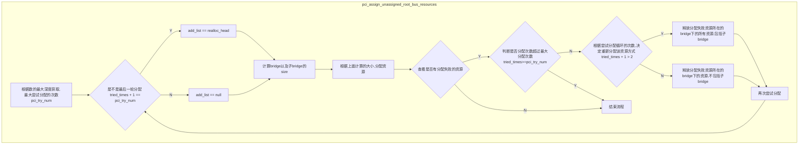

# pci realloc 
## kernel cmdline 作用

kernel doc中记录了该参数的作用

链接:https://docs.kernel.org/admin-guide/kernel-parameters.html

```
realloc=        Enable/disable reallocating PCI bridge resources
                if allocations done by BIOS are too small to
                accommodate resources required by all child
                devices.
                off: Turn realloc off
                on: Turn realloc on
realloc         same as realloc=on
```

BIOS/UEFI可能分配的桥的资源过少,导致其child devices不能分配到足够的资源,
开启这一功能后, 会重新分配桥的资源,满足其child devices的资源分配.

从上面信息可知配置`pci=realloc=on`, 或者`pci=realloc`参数可以使能这一功能, 
不配置该cmdline,或者配置`pci=realloc=off`关闭这一功能

ps :不配置cmdline不一定关闭该功能,还和某些编译选项有关,请看
`pci_realloc_detect`函数

## 代码分析

### 参数初始化代码

```c
//注册pci参数处理函数
early_param("pci", pci_setup);

s

tatic int __init pci_setup(char *str)
{
	...

	if (*str && (str = pcibios_setup(str)) && *str) {
	if (!strcmp(str, "nomsi")) {
	    pci_no_msi();
	...
	} else if (!strncmp(str, "realloc=", 8)) {
    	pci_realloc_get_opt(str + 8);
	} else if (!strncmp(str, "realloc", 7)) {
    	pci_realloc_get_opt("on");
	}
	...
}
```
从上面代码可以看出,如果配置了`pci=realloc`和配置了
`pci=realloc=on`效果一样

和`pci_realloc_get_opt`相关如下:
```c
/*
 * -1: undefined, will auto detect later
 *  0: disabled by user
 *  1: disabled by auto detect
 *  2: enabled by user
 *  3: enabled by auto detect
 */
enum enable_type {
    undefined = -1,
    user_disabled,
    auto_disabled,
    user_enabled,
    auto_enabled,
};

static enum enable_type pci_realloc_enable = undefined;
void __init pci_realloc_get_opt(char *str)
{
    if (!strncmp(str, "off", 3))
        pci_realloc_enable = user_disabled;
    else if (!strncmp(str, "on", 2))
        pci_realloc_enable = user_enabled;
}

```
该函数主要是设置全局变量`pci_realloc_enable`, 
该参数有`enum enable_type`取值范围,该枚举各个
成员含义如下:

|enmu enable_type |含义|
|--|--|
|undefine| 没有配置pci=realloc|
|user_disable| 用户层面上去disable,也就是配置了pci=realloc=off|
|auto_disabled| 自动的disable, 目前kernel并没有使用|
|user_enabled| 用户层面上区enable ,也就是配置了pci=realloc=on|
|auto_enabled| 自动的enable|

`pci_realloc_get_opt`描述了,`pci_realloc_enable`赋值
`user_disabled`, `user_enabled`情况

关于`auto_enabled`表示自动的enable,相关代码如下:
```c
//==========(1)===========
#if defined(CONFIG_PCI_IOV) && defined(CONFIG_PCI_REALLOC_ENABLE_AUTO)
static enum enable_type pci_realloc_detect(struct pci_bus *bus,
             enum enable_type enable_local)
{
    bool unassigned = false;
	//=========(2)===========
    if (enable_local != undefined)
        return enable_local;
	//=========(3)===========
    pci_walk_bus(bus, iov_resources_unassigned, &unassigned);
    if (unassigned)
        return auto_enabled;

    return enable_local;
}
#else
static enum enable_type pci_realloc_detect(struct pci_bus *bus,
             enum enable_type enable_local)
{
    return enable_local;
}
#endif
```
1. 如果没有`CONFIG_PCI_IOV`或者`CONFIG_PCI_REALLOC_ENABLE_AUTO`编译选项的话,
该函数返回`enable_local`, 否则执行(2)
2. 如果没有配置`pci=realloc`, 则进行(3)
3. 这里不展开`pci_walk_bus`的代码,该函数会深度优先遍历bus上的pci_tree, 
然后调用`iov_resources_unassigned`

```c
static int iov_resources_unassigned(struct pci_dev *dev, void *data)
{
    int i;
    bool *unassigned = data;
	//只看pci resources的 IOV 相关的resources
    for (i = PCI_IOV_RESOURCES; i <= PCI_IOV_RESOURCE_END; i++) {
        struct resource *r = &dev->resource[i];
        struct pci_bus_region region;

        /* Not assigned or rejected by kernel? */
        if (!r->flags)
            continue;

        pcibios_resource_to_bus(dev->bus, &region, r);
		//如果该resources 没有分配start, 则认为该资源没有分配 ===(1)===
        if (!region.start) {
            *unassigned = true;
            return 1; /* return early from pci_walk_bus() */
        }
    }

    return 0;
}
```

从(1)看,如果没有为IOV 分配resources的话, 就认为有一些IOV的资源
BIOS没有分配,该函数就会返回`auto_enable`, 这样在用户层面看起来就
不用关心`pci=realloc`参数.

### 主体处理流程
主要处理函数为`pci_assign_unassigned_resources`
该函数的调用流程为:

```
fs_initcall(pci_assign_unassigned_resources)
	pcibios_assign_resources
		pci_assign_unassigned_resources
```

### pci_assign_unssigned_resources
`pci_assign_unassigned_resources` 定义为:
```c
void __init pci_assign_unassigned_resources(void)
{
    struct pci_bus *root_bus;

    list_for_each_entry(root_bus, &pci_root_buses, node) {
        pci_assign_unassigned_root_bus_resources(root_bus);

        /* Make sure the root bridge has a companion ACPI device: */
        if (ACPI_HANDLE(root_bus->bridge))
            acpi_ioapic_add(ACPI_HANDLE(root_bus->bridge));
    }
}
```
对于多numa的环境, 可能会有多个host bridge, 从属于不同的总线
每个root_bus分别调用`pci_assign_unassigned_root_bus_resources`

### pci_assign_unassigned_root_bus_resources
<!-- flowchart TD -->
该函数的主体流程如下:


