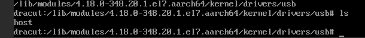
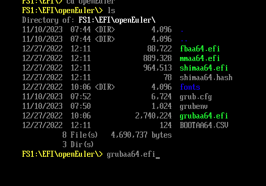

## 目前的方式(arm64)
```
    <disk type='block' device='disk'>
      <source dev='xxxx'/>
      <backingStore/>
      <target dev='sda' bus='usb'/>
      <serial>xxxx</serial>
      <boot order='1'/>
      <alias name='usb-disk0'/>
      <address type='usb' bus='0' port='1'/>
    </disk>
```

为usb方式. 但是部分镜像，例如`centos7.9`的initrd， 没有`usb-storage`驱动:



查看centos 7.9有什么其他合适的模块:

首先x86镜像没有测试出问题，所以可以说明一般都有scci驱动(sd_mod), 现在就是
如何选择controller，我们尝试使用virtio-scsi。进入系统查看是否有virtio-scsi模块.


> 小技巧
>
> 可以通过UEFI shell 进入此前的系统`openeuler`
>
> 

```
## 挂载盘
[root@wangfuqiang49-test ~]# mount /dev/sda2 /mnt/
[root@wangfuqiang49-test ~]# cd /mnt/boot

## 查看编译情况
[root@wangfuqiang49-test boot]# cat config-4.18.0-348.20.1.el7.aarch64 |grep VIRTIO |grep SCSI
# CONFIG_VIRTIO_BLK_SCSI is not set
CONFIG_SCSI_VIRTIO=m
[root@wangfuqiang49-test boot]# cat config-4.18.0-348.20.1.el7.aarch64 |grep BLK_DEV_SD
CONFIG_BLK_DEV_SD=y

## 查看initrd
[root@wangfuqiang49-test boot]# lsinitrd initramfs-4.18.0-348.20.1.el7.aarch64.img |grep virtio_scsi
-rw-r--r--   1 root     root         8960 Apr 14  2022 usr/lib/modules/4.18.0-348.20.1.el7.aarch64/kernel/drivers/scsi/virtio_scsi.ko.xz
```

可以发现有。
修改xml
```
[root@11-244-8-133 11:27:17 wangfuqiang]# diff -Naru i-buuyt8ah6i.xml i-buuyt8ah6i.xml.new
--- i-buuyt8ah6i.xml    2025-11-13 11:21:16.207458516 +0800
+++ i-buuyt8ah6i.xml.new        2025-11-13 11:25:49.841224790 +0800
@@ -85,15 +85,15 @@
   <on_crash>destroy</on_crash>
   <devices>
     <emulator>/usr/libexec/qemu-kvm</emulator>
+    <controller type='scsi' index='0' model='virtio-scsi'/>
     <disk type='block' device='disk'>
       <driver name='qemu' type='raw' cache='none' error_policy='report' rerror_policy='report'/>
       <source dev='/run/ebs/softlink/nbd_vol-i4jjw39blu_i-buuyt8ah6i'/>
       <backingStore/>
-      <target dev='sda' bus='usb'/>
+      <target dev='sda' bus='scsi'/>
       <serial>vol-i4jjw39blu</serial>
       <boot order='1'/>
-      <alias name='usb-disk0'/>
-      <address type='usb' bus='0' port='1'/>
+      <alias name='scsi-disk0'/>
     </disk>
     <disk type='block' device='disk'>
       <driver name='qemu' type='raw' cache='none' error_policy='report' rerror_policy='report' io='native' iothread='127' queues='4'/>
```

如此修改后，可以成功启动虚拟机.

## 测试其他镜像

编写自动化脚本测试其他镜像（脚本不展开），测试的镜像均能启动
