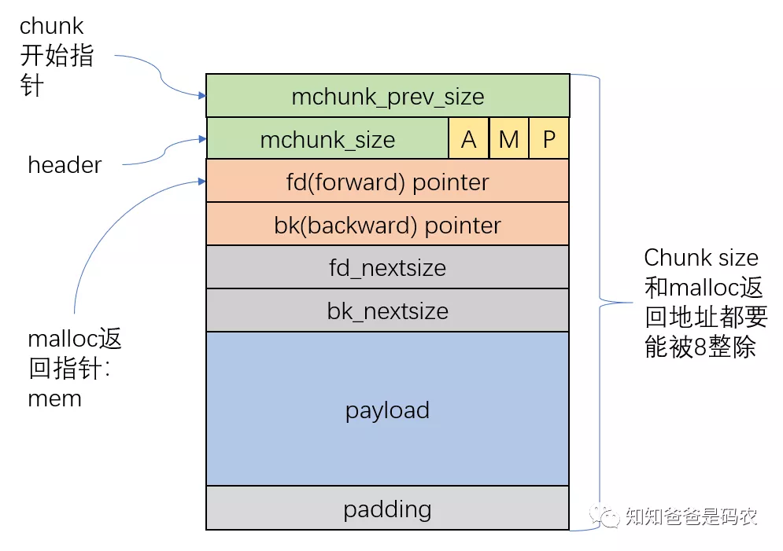
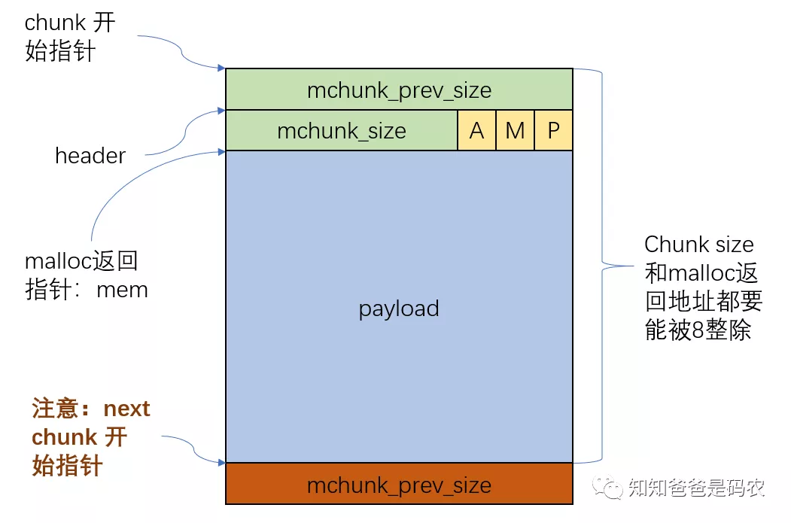

# 查看coredump堆栈
安装systemd-debuginfo-219-73.el7_8.6.5es.aarch64.rpm, glibc-debuginfo-2.17-292.el7.centos.es.aarch64.rpm
等debuginfo 包，查看异常堆栈:
```
gdb ./core.systemd.63108.node-1.domain.tld.1640145986
...
#0  0x0000ffff9c185488 in kill () at ../sysdeps/unix/syscall-template.S:81
#1  0x0000aaaab152747c in crash (sig=6) at src/core/main.c:172
#2  <signal handler called>
#3  0x0000ffff9c185228 in __GI_raise (sig=sig@entry=6) at ../nptl/sysdeps/unix/sysv/linux/raise.c:55
#4  0x0000ffff9c1868a0 in __GI_abort () at abort.c:90
#5  0x0000ffff9c1c516c in __libc_message (do_abort=<optimized out>, fmt=fmt@entry=0xffff9c28a620 "*** Error in `%s': %s: 0x%s ***\n") at ../sysdeps/unix/sysv/linux/libc_fatal.c:196
#6  0x0000ffff9c1cd67c in malloc_printerr (ar_ptr=0xffff9c2d0530 <main_arena>, ptr=<optimized out>, str=0xffff9c28a710 "free(): invalid next size (normal)", action=3) at malloc.c:4967
#7  _int_free (av=0xffff9c2d0530 <main_arena>, p=<optimized out>, have_lock=0) at malloc.c:3843
#8  0x0000aaaab15e1620 in mount_setup_unit (set_flags=true, fstype=0xaaaabfecfcf0 "tmpfs", options=<optimized out>,
    where=0xaaaac002ce90 "/var/lib/kubelet/pods/03a4f6ea-d8c9-45b3-9b93-108244abb801/volumes/kubernetes.io~secret/ceph-bootstrap-mds-keyring", what=0xaaaac0208600 "tmpfs", m=0xaaaabfaf0d80)
    at src/core/mount.c:1558
#9  mount_load_proc_self_mountinfo (m=m@entry=0xaaaabfaf0d80, set_flags=set_flags@entry=true) at src/core/mount.c:1628
#10 0x0000aaaab15e1ca8 in mount_dispatch_io (source=<optimized out>, fd=<optimized out>, revents=<optimized out>, userdata=0xaaaabfaf0d80) at src/core/mount.c:1771
#11 0x0000aaaab15c8d2c in source_dispatch (s=s@entry=0xaaaabfaffc70) at src/libsystemd/sd-event/sd-event.c:2115
#12 0x0000aaaab15c9bcc in sd_event_dispatch (e=0xaaaabfaf1440) at src/libsystemd/sd-event/sd-event.c:2472
#13 0x0000aaaab15c9d94 in sd_event_run (e=<optimized out>, timeout=<optimized out>) at src/libsystemd/sd-event/sd-event.c:2501
#14 0x0000aaaab152fa9c in manager_loop (m=0xaaaabfaf0d80) at src/core/manager.c:2316
#15 0x0000aaaab1523d5c in main (argc=5, argv=0xffffcb8b06b8) at src/core/main.c:1783
```

# 查看相关代码
经查看src.rpm包中代码，和debuginfo包中的二进制信息对不上。
所以这里我们通过gdb`l`命令查看相关代码

## 查看`mount_setup_unit`代码

```
				....
1550            free(p->what);
1551            p->what = w;
1552            w = NULL;
1553
1554            free(p->options);
1555            p->options = o;
1556            o = NULL;
1557
1558            free(p->fstype);			<===== 造成异常调用
(gdb)
1559            p->fstype = f;
1560            f = NULL;
1561
				....
```

根据之前调试经验，如果free函数发生异常可能存在两种情况:
1. free了一个被已经被free的内存
2. 存在malloc数组越界

## 查看调用`__libc_message`代码

```
(gdb) l malloc.c:4967
4962          buf[sizeof (buf) - 1] = '\0';
4963          char *cp = _itoa_word ((uintptr_t) ptr, &buf[sizeof (buf) - 1], 16, 0);
4964          while (cp > buf)
4965            *--cp = '0';
4966
4967          __libc_message (action & 2, "*** Error in `%s': %s: 0x%s ***\n",
4968                          __libc_argv[0] ?: "<unknown>", str, cp);
4969        }
```
这里我们可以获取下libc的打印，通过以下gdb命令:

```
(gdb) f 6
#6  0x0000ffff9c1cd67c in malloc_printerr (ar_ptr=0xffff9c2d0530 <main_arena>, ptr=<optimized out>, str=0xffff9c28a710 "free(): invalid next size (normal)", action=3) at malloc.c:4967
4967          __libc_message (action & 2, "*** Error in `%s': %s: 0x%s ***\n",
(gdb) p __libc_argv[0]
$7 = 0xffffcb8bff9c "/usr/lib/systemd/systemd"
(gdb) p str
$8 = 0xffff9c28a710 "free(): invalid next size (normal)"
(gdb) p cp
$9 = <optimized out>
(gdb) p buf
$10 = "0000aaaac01b9260"
```

这里cp变量被优化了(实际上就是没有保存在栈中，以寄存器的方式存储的），但是可以通过buf变量获取
所以这里打印的信息为:

```
*** Error in `/usr/lib/systemd/systemd': free(): invalid next size (normal): 0x0000aaaac01b9260 ***\n
```

我们再次看下`mount_setup_unit`堆栈

```
(gdb) f 8
#8  0x0000aaaab15e1620 in mount_setup_unit (set_flags=true, fstype=0xaaaabfecfcf0 "tmpfs", options=<optimized out>,
    where=0xaaaac002ce90 "/var/lib/kubelet/pods/03a4f6ea-d8c9-45b3-9b93-108244abb801/volumes/kubernetes.io~secret/ceph-bootstrap-mds-keyring", what=0xaaaac0208600 "tmpfs", m=0xaaaabfaf0d80)
    at src/core/mount.c:1558
1558            free(p->fstype);
(gdb) p p->fstype
$11 = 0xaaaac01b9260 "tmpfs"
```

所以果然是`p->fstype`有问题。


# 分析free出问题堆栈
## 查看_int_free堆栈流程
从上面获取的信息可得, Error msg为
```
free(): invalid next size (normal): 0x0000aaaac01b9260
```
所以`_int_free`走的代码流程为:

```
_int_free()
{
    ...
    size = chunksize(p);
...
    //分支1
	if ((unsigned long)(size) <= (unsigned long)(get_max_fast ())
	{
		//没走这个
    

	} else if (!chunk_is_mmapped(p)) {
		...
		//走的下面的流程
		nextsize = chunksize(nextchunk);
        //分支2
		if (__builtin_expect (nextchunk->size <= 2 * SIZE_SZ, 0)
		|| __builtin_expect (nextsize >= av->system_mem, 0))
		{
			errstr = "free(): invalid next size (normal)";
			goto errout;
		}
		...
	}
errout:
   if (! have_lock && locked)
	 (void)mutex_unlock(&av->mutex);
   malloc_printerr (check_action, errstr, chunk2mem(p));
   return;
}
```

## malloc链表分析

### free chunk
<br />

### malloc chunk
<br />

可以看出，每一个malloc申请的内存都是由一个chunk包裹着。
这里比较重要的成员为: `mchunk_size`，该`size`代表本chunk的大小

另外`mchunk_size`部分后三位代表下面的含义:
* NON_MAIN_ARENA的缩写，指所用arena是不是main arena的flag，
  关于arena在虚拟地址空间和堆一文中已经介绍过，这里不再赘述
* M: IS_MMAPPED的缩写，指所用chunk是不是经由mmap分配所得
* P: PREV_INUSE的缩写，指当前chunk的前一个chunk是不是allocated chunk，
    是的话这个bit为1，否则为0

对于这个case只了解这些就可以。


### 通过gdb查看相关内存
#### free chunk
从上面的打印信息可以看出，实际上调用free()传入的指针为:
`0x0000aaaac01b9260`, 该指针指向`malloc chunk payload`域。
而该chunk的首地址为`0x0000aaaac01b9260 - 16`
该`chunk`打印如下:

```
(gdb) p *(mchunkptr )(0x0000aaaac01b9260 - 16)
$3 = {prev_size = 7630703, size = 33, fd = 0x7366706d74, 
    bk = 0x44455a4900656d69, fd_nextsize = 0x79616c7265766f00, bk_nextsize = 0x21}
```

通过size来看，该chunk flag位只有P, 表示该chunk之前是alloced chunk

查看通过`_int_free()`代码第一个分支:
```
if ((unsigned long)(size) <= (unsigned long)(get_max_fast ()) {

}
```
拿`size`和`get_max_fast()`进行比较如果小于等于则执行该分支

`size`实际上通过下面代码获取
```
size = chunksize(p);

#define chunksize(p)         ((p)->size & ~(SIZE_BITS))
#define SIZE_BITS (PREV_INUSE|IS_MMAPPED|NON_MAIN_ARENA)
#define PREV_INUSE 0x1
#define IS_MMAPPED 0x2
#define NON_MAIN_ARENA 0x4
```
实际上就是将`chunksize`后三位清0
`get_max_fast()` 代码如下:
```
#define get_max_fast() global_max_fast
```

通过gdb查看`global_max_fast`
```
(gdb) p global_max_fast
$4 = 128
```
这里`chunksize == 32`, **所以**`chunksize < get_max_fast()` **!!!**

分析第二个分支:
```
//分支2
...
...

nextchunk = chunk_at_offset(p, size);
...

nextsize = chunksize(nextchunk);

if (__builtin_expect (nextchunk->size <= 2 * SIZE_SZ, 0)
|| __builtin_expect (nextsize >= av->system_mem, 0))
```
`chunk_at_offset()`定义为:
```
#define chunk_at_offset(p, s)  ((mchunkptr)(((char*)(p)) + (s)))
```

通过gdb获取该值:
```
(gdb) p *(mchunkptr )(0x0000aaaac01b9260 - 16 + 32)
$5 = {prev_size = 8746391189914545920, size = 33, fd = 0x7366706d74, bk = 0x65636976007366, fd_nextsize = 0x6e6f632f62696c2f,
  bk_nextsize = 0x21}
```

可以看出size = 33, chunksize = 32

两个if条件，第一个显然是不满足。

通过gdb查看`av->system_mem`

`av`是`_int_free`第一个参数，可以看下`__libc_free()`调用`_int_free()`代码
```
void
__libc_free(void* mem)
{
    ar_ptr = arena_for_chunk(p);
    _int_free(ar_ptr, p, 0);
}
```

查看 `arena_for_chunk()`代码:
```
#define arena_for_chunk(ptr) \
 (chunk_non_main_arena(ptr) ? heap_for_ptr(ptr)->ar_ptr : &main_arena)
#define chunk_non_main_arena(p) ((p)->size & NON_MAIN_ARENA)
#define NON_MAIN_ARENA 0x4
```

该代码会判断ptr所在的chunk是否是`main_arena`, 通过之前的`size(33)`可以看出，该chunk属于
`main_arena`

所以`av = & main_arena`

通过gdb查看该内存:
```
(gdb) p main_arena.system_mem
$6 = 9306112
```
可以看出`33 < 9306112`, 不满足第二个分支。

**该分支是怎么进去的呢，这里我想通过分析_int_free汇编以及__libc_message堆栈，看看能不能获取些有效信息<F2><F4><F5>**

## 汇编代码C代码分析:
### _int_free
```
static void
_int_free(mstate av, mchunkptr p, int have_lock)
{
    INTERNAL_SIZE_T size;        /* its size */
    mfastbinptr*    fb;          /* associated fastbin */
    mchunkptr       nextchunk;   /* next contiguous chunk */
    INTERNAL_SIZE_T nextsize;    /* its size */
    int             nextinuse;   /* true if nextchunk is used */
    INTERNAL_SIZE_T prevsize;    /* size of previous contiguous chunk */
    mchunkptr       bck;         /* misc temp for linking */
    mchunkptr       fwd;         /* misc temp for linking */
    
    const char *errstr = NULL;
    int locked = 0;

0x0000ffff9c1ccef0 <+0>:     stp     x29, x30, [sp,#-176]!
0x0000ffff9c1ccef4 <+4>:     mov     x29, sp
0x0000ffff9c1ccef8 <+8>:     stp     x19, x20, [sp,#16]

//第二个参数mchunkptr p 赋值给x1
0x0000ffff9c1ccefc <+12>:    mov     x19, x1
//获取x1 + 8存入x1, 为p->size
0x0000ffff9c1ccf00 <+16>:    ldr     x1, [x1,#8]
//第一个参数mstate av 赋值给x21
0x0000ffff9c1ccf04 <+20>:    stp     x21, x22, [sp,#32]
//做与操作, x20为size
0x0000ffff9c1ccf08 <+24>:    and     x20, x1, #0xfffffffffffffff8
	/*
     * #define chunksize(p)         ((p)->size & ~(SIZE_BITS))
	 * #define SIZE_BITS (PREV_INUSE|IS_MMAPPED|NON_MAIN_ARENA)
 	 */
	size = chunksize(p);

0x0000ffff9c1ccf0c <+28>:    mov     x21, x0
0x0000ffff9c1ccf14 <+36>:    stp     x23, x24, [sp,#48]
0x0000ffff9c1ccf18 <+40>:    stp     x25, x26, [sp,#64]
0x0000ffff9c1ccf1c <+44>:    stp     x27, x28, [sp,#80]
//第三个参数have lock 赋值给w23
0x0000ffff9c1ccf24 <+52>:    mov     w23, w2
	
 	//---------------------------------------------
	//--------------省略部分代码--------------------
 	//---------------------------------------------
	
	if ((unsigned long)(size) <= (unsigned long)(get_max_fast ()) 
/*
 * 获取x22, get_max_fast
 * #define get_max_fast() global_max_fast
 * (gdb) p &global_max_fast
 * $1 = (size_t *) 0xffff9c2d25b0 <global_max_fast>
 *
 * 0xffff9c2d2000  + 0x578 + 56 = 0xffff9c2d25b0 
 */
0x0000ffff9c1ccf40 <+80>:    adrp    x22, 0xffff9c2d2000 <initial_quick+360>
0x0000ffff9c1ccf44 <+84>:    add     x0, x22, #0x578
0x0000ffff9c1ccf48 <+88>:    ldr     x0, [x0,#56]
//x0为0xffff9c2d25b0, x20为chucksize
0x0000ffff9c1ccf4c <+92>:    cmp     x20, x0
/*
 * size <= get_max_fast() 
 * b.ls是小于等于则跳转, 按照这个代码流程来说，是没有走小于等于的流程
 */
0x0000ffff9c1ccf50 <+96>:    b.ls    0xffff9c1cd220 <_int_free+816>
	
/*
 * 该glibc并没有TRIM_FASTBINS编译选项
 */
#if TRIM_FASTBINS
      /*
    If TRIM_FASTBINS set, don't place chunks
    bordering top into fastbins
      */
      && (chunk_at_offset(p, size) != av->top)
#endif

 	//---------------------------------------------
	//--------------省略部分代码--------------------
 	//---------------------------------------------

	else if(!chunk_is_mapped) {
//chuck_is_mapped()  x1为p->size, 查看第1位(从0开始是否是1, 也就是是否是map)
0x0000ffff9c1ccf54 <+100>:   and     x1, x1, #0x2
//不为0则跳转, 这里map位为0, 所以不会跳转
0x0000ffff9c1ccf58 <+104>:   cbnz    x1, 0xffff9c1cd47c <_int_free+1420>
//w1又存放在w27中, 存放的为Map位
0x0000ffff9c1ccf5c <+108>:   mov     w27, w1

   		if (! have_lock) {
//比较w2(have_lock)
//如果是0则跳转，这里have_lock实际上是0
0x0000ffff9c1ccf60 <+112>:   cbz     w2, 0xffff9c1cd4e4 <_int_free+1524>
#if THREAD_STATS
    		if(!mutex_trylock(&av->mutex))
    	    	++(av->stat_lock_direct);
    		else {
				(void)mutex_lock(&av->mutex);
				++(av->stat_lock_wait);
    	   }
#else
		//实际上走的是这个分支
   		(void)mutex_lock(&av->mutex);
#endif
      locked = 1;
    }
//假如说上面发生了跳转，下面是跳转回来的流程

/*
 * x21为av, 这里取的是av->top
 * (gdb) p ((mstate )(0))->top
 * Cannot access memory at address 0x58
 * (gdb) p 0x58
 * $5 = 88
 *
 * x20为size, x19为p, 那么这里x24为nextchunk
 */
	nextchunk = chunk_at_offset(p, size);
0x0000ffff9c1ccf64 <+116>:   ldr     x0, [x21,#88]
0x0000ffff9c1ccf68 <+120>:   add     x24, x19, x20

	if (__builtin_expect (p == av->top, 0))
  	{
		errstr = "double free or corruption (top)";
		goto errout;
  	}
/*
 * (gdb) p ((mstate )0x0000ffff9c2d0530)->top
 * $2 = (mchunkptr) 0xaaaac02338e0
 *
 * 所以这里实际上不会执行下面的分支
 */
//x19为p, x0为av->top
0x0000ffff9c1ccf6c <+124>:   cmp     x19, x0
//相等则跳转
0x0000ffff9c1ccf70 <+128>:   b.eq    0xffff9c1cda98 <_int_free+2984>

    if (__builtin_expect (contiguous (av)
        && (char *) nextchunk
        >= ((char *) av->top + chunksize(av->top)), 0)) 
	{
		errstr = "double free or corruption (out)";
		goto errout;
	}
//获取av->flags赋值到w2
//(gdb) p ((mstate )0x0000ffff9c2d0530)->flags
//$3 = 4
0x0000ffff9c1ccf74 <+132>:   ldr     w2, [x21,#4]
//configuous(av->flags)
//#define contiguous(M)          (((M)->flags &  NONCONTIGUOUS_BIT) == 0)
//#define NONCONTIGUOUS_BIT     (2U)
//测试w2第二位是否是1, 如果测试位为0，则跳转, 这里为0, 所以跳转
0x0000ffff9c1ccf78 <+136>:   tbz     w2, #1, 0xffff9c1cdad0 <_int_free+3040>


	//下面是跳转回来的流程
	if (__builtin_expect (!prev_inuse(nextchunk), 0))
    {
        errstr = "double free or corruption (!prev)";
        goto errout;
    }
//x0赋值为nextchunk->size
0x0000ffff9c1ccf7c <+140>:   ldr     x0, [x24,#8]
//这里实际上是再看p->size & PREV_INUSE, 看下前面的chunk是不是alloced chunk
//如果测试位为0则跳转, 这里实际上为1，不会跳转
0x0000ffff9c1ccf80 <+144>:   tbz     w0, #0, 0xffff9c1cdaf4 <_int_free+3076>

 	//---------------------------------------------
	//--------------重要代码流程-------------------
 	//---------------------------------------------
	nextsize = chunksize(nextchunk);
//3969 : x0 为 nextchuck->size
0x0000ffff9c1ccf84 <+148>:   cmp     x0, #0x10
//x25为nextsize
0x0000ffff9c1ccf88 <+152>:   and     x25, x0, #0xfffffffffffffff8
//这时候的状态:x20为size, x19 为p, x24为nextchunk, x25为nextsize

    if (__builtin_expect (nextchunk->size <= 2 * SIZE_SZ, 0)
    || __builtin_expect (nextsize >= av->system_mem, 0))
    {
//小于等于16 跳转点为  errstr = "free(): invalid next size (normal)";
0x0000ffff9c1ccf8c <+156>:   b.ls    0xffff9c1cdb04 <_int_free+3092>
0x0000ffff9c1ccf8c <+156>:   b.ls    0xffff9c1cdb04 <_int_free+3092>
0x0000ffff9c1ccf90 <+160>:   ldr     x0, [x21,#2176]
//cmp nextsize and av->system_mem
0x0000ffff9c1ccf94 <+164>:   cmp     x25, x0
0x0000ffff9c1ccf98 <+168>:   b.cs    0xffff9c1cdb04 <_int_free+3092>

        errstr = "free(): invalid next size (normal)";
        goto errout;
//x20 为"free(): invalid next size (normal)"
//(gdb) p (char *)0xffff9c28a710
$5 = 0xffff9c28a710 "free(): invalid next size (normal)"
0x0000ffff9c1cdb04 <+3092>:  adrp    x20, 0xffff9c28a000
//这个时候，x19为p->size
0x0000ffff9c1cdb08 <+3096>:  add     x19, x19, #0x10
0x0000ffff9c1cdb0c <+3100>:  add     x20, x20, #0x710
//这里实际上发生了跳转
0x0000ffff9c1cdb10 <+3104>:  b       0xffff9c1cd590 <_int_free+1696>
    }
	...


//errout代码<_int_free+1696>
errout:
	if (have_lock || locked)
//做一个或操作
0x0000ffff9c1cd590 <+1696>:  orr     w27, w27, w23
//如果不等于0的话，会跳转
0x0000ffff9c1cd594 <+1700>:  cbnz    w27, 0xffff9c1cd690 <_int_free+1952>
		(void)mutex_unlock(&av->mutex);

//跳转回来的代码, 改代码实际上是malloc_printerr的代码，是内嵌到_int_free代码中
	malloc_printerr (check_action, errstr, chunk2mem(p), av);

```

### malloc_printerr

```
static void
malloc_printerr(int action, const char *str, void *ptr, mstate ar_ptr)
{
//(gdb) x/1xb 0xffff9c2d0140
//0xffff9c2d0140 <check_action>:  0x03
//通过adrp获取到check_action
0x0000ffff9c1cd598 <+1704>:  adrp    x0, 0xffff9c2d0000
0x0000ffff9c1cd59c <+1708>:  add     x0, x0, #0xe8
0x0000ffff9c1cd5a0 <+1712>:  ldr     w22, [x0,#88]
	if (ar_ptr)
	  set_arena_corrupt (ar_ptr);
//如果是x21, 0跳转, 这里adrp不是0，所以没有跳转
//#define set_arena_corrupt(A)   ((A)->flags |= ARENA_CORRUPTION_BIT)
//#define ARENA_CORRUPTION_BIT (4U)
//(gdb) p ((mstate) 0)->flags
//Cannot access memory at address 0x4
0x0000ffff9c1cd5a4 <+1716>:  cbz     x21, 0xffff9c1cd5b4 <_int_free+1732>
0x0000ffff9c1cd5a8 <+1720>:  ldr     w0, [x21,#4]
0x0000ffff9c1cd5ac <+1724>:  orr     w0, w0, #0x4
0x0000ffff9c1cd5b0 <+1728>:  str     w0, [x21,#4]
	if ((action & 5) == 5)
  		__libc_message (action & 2, "%s\n", str);
0x0000ffff9c1cd5b4 <+1732>:  mov     w0, #0x5                        // #5
//action & 5, w22为action
0x0000ffff9c1cd5b8 <+1736>:  and     w0, w22, w0
//action & 5 == 5
0x0000ffff9c1cd5bc <+1740>:  cmp     w0, #0x5
//调用__libc_message
0x0000ffff9c1cd5c0 <+1744>:  b.eq    0xffff9c1cd6c4 <_int_free+2004>
//上面流程中adrp为3, 所以不会走

//如果action & 1, 在这里action为3,所以满足, 在这里跳转
0x0000ffff9c1cd5c4 <+1748>:  tbnz    w22, #0, 0xffff9c1cd608 <_int_free+1816>
  	else if (action & 1)

//x19为mchunkptr p, 作为_itoa_word第一个参数
0x0000ffff9c1cd608 <+1816>:  mov     x0, x19
//取得的为buf[sizeof(buf) -1], 的地址, 第二个参数
0x0000ffff9c1cd60c <+1820>:  add     x1, x29, #0xa0
0x0000ffff9c1cd610 <+1824>:  mov     w2, #0x10                       // #16
0x0000ffff9c1cd614 <+1828>:  mov     w3, #0x0                        // #0
		char buf[2 * sizeof (uintptr_t) + 1];
		buf[sizeof (buf) - 1] = '\0';
		char *cp = _itoa_word ((uintptr_t) ptr, &buf[sizeof (buf) - 1], 16, 0);

		while (cp > buf)
//if cp > buf
0x0000ffff9c1cd624 <+1844>:  cmp     x0, x24
//cp 为__libc_message第四个参数
0x0000ffff9c1cd628 <+1848>:  mov     x4, x0
//如果小于等于跳转, 这里会进行一些补0操作，所以实际上不会跳转
0x0000ffff9c1cd62c <+1852>:  b.ls    0xffff9c1cd658 <_int_free+1896>

			*--cp = '0';
//调用memset(dst, data, size)
//第二个数值为x24 - x0 , x0为cp, x24为buf, 所以为x2 = cp-buf
0x0000ffff9c1cd630 <+1856>:  sub     x2, x0, x24
//第一个参数为x0 - x2 = cp - size 为 buf, 也就是dst
0x0000ffff9c1cd634 <+1860>:  sub     x0, x0, x2
//w1为0x30, 为'0'
0x0000ffff9c1cd638 <+1864>:  mov     w1, #0x30                       // #48
//x4实际上是cp, 将cp - 1 =  x19
0x0000ffff9c1cd63c <+1868>:  sub     x19, x4, #0x1
//保存x4
0x0000ffff9c1cd640 <+1872>:  str     x4, [x29,#104]
0x0000ffff9c1cd644 <+1876>:  bl      0xffff9c1d84ec <__GI_memset>
//x19 = cp - 1
//buf = x29, (0xa0 - 0x10)  = x29, 0x90
//x29 = buf - 0x90
//x0 = x29, #0x8f = buf - 0x90 + 8f = buf - 1
0x0000ffff9c1cd648 <+1880>:  add     x0, x29, #0x8f		//8f为143
//还原x4
0x0000ffff9c1cd64c <+1884>:  ldr     x4, [x29,#104]
//x19 = x0 - x19 = buf - 1 - cp + 1 = buf - cp
0x0000ffff9c1cd650 <+1888>:  sub     x19, x0, x19
//x4 + x19 = cp + buf - cp = buf
//x4在这里实际上是cp
0x0000ffff9c1cd654 <+1892>:  add     x4, x4, x19


	__libc_message (action & 2, "*** Error in `%s': %s: 0x%s ***\n",
	        __libc_argv[0] ?: "<unknown>", str, cp);

//获取__libc_argv[0]
0x0000ffff9c1cd658 <+1896>:  adrp    x0, 0xffff9c2d4000 <_res@GLIBC_2.17+40>
0x0000ffff9c1cd65c <+1900>:  ldr     x1, [x0,#3440]
//x22为action, 这里为action & 2
0x0000ffff9c1cd660 <+1904>:  and     w0, w22, #0x2
//x2: __libc_argv[0]
0x0000ffff9c1cd664 <+1908>:  ldr     x2, [x1]
//这里跳转实际上是去取"<unknown>"
0x0000ffff9c1cd668 <+1912>:  cbz     x2, 0xffff9c1cd6f4 <_int_free+2052>
//x1为:  "*** Error in `%s': %s: 0x%s ***\n"
0x0000ffff9c1cd66c <+1916>:  adrp    x1, 0xffff9c28a000
0x0000ffff9c1cd670 <+1920>:  add     x1, x1, #0x620
//x20, x3为str
0x0000ffff9c1cd674 <+1924>:  mov     x3, x20
0x0000ffff9c1cd678 <+1928>:  bl      0xffff9c1c4d94 <__libc_message>         ==========
```

通过上面的分析可以看出_int_free在开始运行时，局部变量存储的寄存器如下:

```
p: x19 
size : x20
nextchunk: x24
nextsize: x25
```

在调用`__libc_message()`前上面寄存器存储信息如下:

```
x19: buf - cp = - NUM(0000) = -4 = fffffffffffffffc
x20: str = "free(): invalid next size (normal)"
x24: buf = "0000aaaac01b9260"
x25: nextsize
```

上面的这些信息中仅剩x25中有用信息:
查看`__libc_message`反汇编和堆栈内存可得:
```
//__libc_message
0xffffcb8af050: 0x0000ffffcb8af7d0      0x0000ffff9c1cd67c
0xffffcb8af060: 0xfffffffffffffffc      0x0000ffff9c28a710      16  x19, x20 (x20为str)
0xffffcb8af070: 0x0000ffff9c2d0530      0x0000000000000003      32  x21, x22 (x21为action x22为action)
0xffffcb8af080: 0x0000000000000000      0x0000ffffcb8af860      48  x23, x24 (为buf)
0xffffcb8af090: 0x2f736679616c7260      0x0000aaaac021a1d0      64  x25, x26
0xffffcb8af0a0: 0x0000000000000001      0x0000aaaac0171fb0      80  x27, x28
```
可以看出x25值为`0x2f736679616c7260`, 并非`33`

而该进程又为单进程
```
(gdb) info threads
  Id   Target Id         Frame
  * 1    LWP 63108         0x0000ffff9c185488 in kill () at ../sysdeps/unix/syscall-template.S:81
```
**所以现象十分奇怪**


这里有两点推测:
* 硬件问题
* 问题出现在内核态: x25寄存器取得后，由于某种原因进入到内核态，
    当内核态返回用户态前，加载x25寄存器出错。而加载得x25寄存器是从kernel堆栈获取，
    所以可能出现了堆栈越界


# 第二次coredump分析

## 问题堆栈

```
#0  0x0000ffffa2735488 in kill () at ../sysdeps/unix/syscall-template.S:81
#1  0x0000aaaaab2d747c in crash (sig=11) at src/core/main.c:172
#2  <signal handler called>
#3  mount_dispatch_io (source=<optimized out>, fd=<optimized out>, revents=<optimized out>, userdata=0xaaaab2d10d80) at src/core/mount.c:1788
#4  0x0000aaaaab378d2c in source_dispatch (s=s@entry=0xaaaab2d1fca0) at src/libsystemd/sd-event/sd-event.c:2115
#5  0x0000aaaaab379bcc in sd_event_dispatch (e=0xaaaab2d11440) at src/libsystemd/sd-event/sd-event.c:2472
#6  0x0000aaaaab379d94 in sd_event_run (e=<optimized out>, timeout=<optimized out>) at src/libsystemd/sd-event/sd-event.c:2501
#7  0x0000aaaaab2dfa9c in manager_loop (m=0xaaaab2d10d80) at src/core/manager.c:2316
#8  0x0000aaaaab2d3d5c in main (argc=5, argv=0xffffd7f1b3b8) at src/core/main.c:1783
```
可以看到是收到了signal 11 ( SIGSEGV) 信号导致systemd挂死，该信号表明用户态进程发生了段错误。

查看frame 3, 和systemd代码

```
(gdb) bt full
#3  mount_dispatch_io (source=<optimized out>, fd=<optimized out>, revents=<optimized out>, userdata=0xaaaab2d10d80) at src/core/mount.c:1788
        mount = 0x0
        around = 0xaaaab2db7e80
        gone = 0x0
        m = 0xaaaab2d10d80
        what = <optimized out>
        i = {idx = 1, next_key = 0xaaaab31534f0}
        u = 0xaaaab3208d90
        r = <optimized out>
        __PRETTY_FUNCTION__ = "mount_dispatch_io"
        __func__ = "mount_dispatch_io"

(gdb) l mount.c:1788
1783            manager_dispatch_load_queue(m);
1784
1785            LIST_FOREACH(units_by_type, u, m->units_by_type[UNIT_MOUNT]) {
1786                    Mount *mount = MOUNT(u);
1787
1788                    if (!mount->is_mounted) {
1789
1790                            /* A mount point is not around right now. It
1791                             * might be gone, or might never have
1792                             * existed. */
```
可以看到`1788 : if(!mount->is_mounted)`该命令会访问mount变量指向的内存，而该地址是0，所以导致
段错误，查看MOUNT()定义:

```
#define DEFINE_CAST(UPPERCASE, MixedCase)                               \
        static inline MixedCase* UPPERCASE(Unit *u) {                   \
                if (_unlikely_(!u || u->type != UNIT_##UPPERCASE))      \
                        return NULL;                                    \
                                                                        \
                return (MixedCase*) u;                                  \
        }

...
DEFINE_CAST(MOUNT, Mount);
```

可以看到，该处会判断`u-type` 是否等于`UNIT_MOUNT`, 如果不等于则返回`NULL`.

通过gdb查看`u->type`
```
(gdb) p ((Unit *)0xaaaab3208d90)->type
$19 = -1568142808
```

查看该Unit其他成员:

```
(gdb) p *((Unit *)0xaaaab3208d90)
$20 = {manager = 0xffffa2880a28 <main_arena+1272>, type = -1568142808, load_state = 65535, merged_into = 0xaaaab3208d80, id = 0xaaaab3208d80 "", instance = 0x0, names = 0xaaaab2e16070, dependencies = {0xaaaab3089100, 0x0 <repeats 11 times>, 0xaaaab316c130, 0x0, 0xaaaab319a4b0, 0xaaaab2f0d050, 0x0, 0x0, 0x0, 0x0, 0x0, 0x0,
    0xaaaab30beb90, 0x0}, requires_mounts_for = 0xaaaab2f7c210, description = 0xaaaab2f28920 "/run/containerd/io.containerd.runtime.v2.task/k8s.io/c7156ef172ec4533d99bfbe773d10e7f5d12178b32fff2e7dc981c72ea670b9d/rootfs", documentation = 0x0, fragment_path = 0x0, source_path = 0xaaaab30a0c10 "/proc/self/mountinfo",
  dropin_paths = 0xaaaab2eea1d0, fragment_mtime = 0, source_mtime = 0, dropin_mtime = 1640822087351675, job = 0x0, nop_job = 0x0, job_timeout = 0, job_timeout_action = EMERGENCY_ACTION_NONE, job_timeout_reboot_arg = 0x0, refs_by_target = 0x0, conditions = 0x0, asserts = 0x0, condition_timestamp = {realtime = 0, monotonic = 0},
  assert_timestamp = {realtime = 0, monotonic = 0}, inactive_exit_timestamp = {realtime = 1640822087358381, monotonic = 175484572}, active_enter_timestamp = {realtime = 1640822087358381, monotonic = 175484572}, active_exit_timestamp = {realtime = 0, monotonic = 0}, inactive_enter_timestamp = {realtime = 0, monotonic = 0}, slice = {
    source = 0xaaaab3208d90, target = 0xaaaab2d2bcb0, refs_by_target_next = 0xaaaab3209658, refs_by_target_prev = 0xaaaab3208878}, units_by_type_next = 0xaaaab32086a0, units_by_type_prev = 0xaaaab3209480, has_requires_mounts_for_next = 0x0, has_requires_mounts_for_prev = 0x0, load_queue_next = 0x0, load_queue_prev = 0x0,
  dbus_queue_next = 0x0, dbus_queue_prev = 0x0, cleanup_queue_next = 0x0, cleanup_queue_prev = 0x0, gc_queue_next = 0x0, gc_queue_prev = 0x0, cgroup_queue_next = 0x0, cgroup_queue_prev = 0x0, target_deps_queue_next = 0x0, target_deps_queue_prev = 0x0, stop_when_unneeded_queue_next = 0x0, stop_when_unneeded_queue_prev = 0x0, pids = 0x0,
  sigchldgen = 0, gc_marker = 0, deserialized_job = -1, load_error = 0, check_unneeded_ratelimit = {interval = 10000000, begin = 0, burst = 16, num = 0}, unit_file_state = _UNIT_FILE_STATE_INVALID, unit_file_preset = -1,
  cgroup_path = 0xaaaab303f470 "/system.slice/run-containerd-io.containerd.runtime.v2.task-k8s.io-c7156ef172ec4533d99bfbe773d10e7f5d12178b32fff2e7dc981c72ea670b9d-rootfs.mount", cgroup_realized_mask = _CGROUP_CONTROLLER_MASK_ALL, cgroup_subtree_mask = 0, cgroup_members_mask = 0, on_failure_job_mode = JOB_REPLACE,
  stop_when_unneeded = false, default_dependencies = true, refuse_manual_start = false, refuse_manual_stop = false, allow_isolate = false, ignore_on_isolate = true, ignore_on_snapshot = false, condition_result = false, assert_result = false, transient = false, in_load_queue = false, in_dbus_queue = false, in_cleanup_queue = false,
  in_gc_queue = false, in_cgroup_queue = false, in_target_deps_queue = false, in_stop_when_unneeded_queue = false, sent_dbus_new_signal = true, no_gc = false, in_audit = false, on_console = false, cgroup_realized = true, cgroup_members_mask_valid = true, cgroup_subtree_mask_valid = true}
```

从打印来看，大部分成员值都是正确的。不过其相邻的:`manager`成员值貌似不对，**应该是发生了内存踩踏**


## 分析该chunk

通过gdb查看该chunk

```
$56 = {prev_size = 0, size = 1777, fd = 0xffffa2880a28 <main_arena+1272>, bk = 0xffffa2880a28 <main_arena+1272>, fd_nextsize = 0xaaaab3208d80, bk_nextsize = 0xaaaab3208d80}
(gdb) p sizeof(main_arena)
$57 = 2192

```

可以看到该chunk size为1777, 并且解析出fd 和bk都指向了main_arena中的地址, 所以很可能该chunk已经被free了，
难道这是一个use-after-free的问题?

## 通过gdb查看其他内容

### 再次查看相关代码
```
(gdb) l src/core/mount.c:1788
1783            manager_dispatch_load_queue(m);
1784
1785            LIST_FOREACH(units_by_type, u, m->units_by_type[UNIT_MOUNT]) {
1786                    Mount *mount = MOUNT(u);
1787
1788                    if (!mount->is_mounted) {
1789
1790                            /* A mount point is not around right now. It
1791                             * might be gone, or might never have
1792                             * existed. */
```
通过改代码可以看出，u 是通过LIST_FOREACH 取出的。

`LIST_FOREACH`定义: 
```
#define LIST_FOREACH(name,i,head)                                       \
        for ((i) = (head); (i); (i) = (i)->name##_next)
```

# 查看其余的三个coredump
其余的三个coredump均为coaster-agent
```
[root@node-3 coredump]# ls |grep core.coas
-rw-------  1 root 89522176 Jan 27 11:06 core.coaster-agent.3369.node-1.domain.tld.1641608611
-rw-------  1 root 87097344 Jan 27 11:06 core.coaster-agent.64650.node-1.domain.tld.1641048787
-rw-------  1 root 88801280 Jan 27 11:06 core.coaster-agent.6952.node-1.domain.tld.1641017647
```

`coaster-agent`是一个python脚本:
```
[root@node-3 coredump]# whereis coaster-agent
coaster-agent: /usr/bin/coaster-agent
[root@node-3 coredump]# file /usr/bin/coaster-agent
/usr/bin/coaster-agent: Python script, ASCII text executable
```

通过查找资料得知，可以通过下载`python-debuginfo`包调试coredump

查看python版本:

```
[root@node-3 coredump]# yum list python
warning: Macro %el6 needs whitespace before body
Loaded plugins: fastestmirror
Loading mirror speeds from cached hostfile
 * epel: mirrors.bfsu.edu.cn
Installed Packages
python.aarch64                                            2.7.5-86.el7.centos.es                                            @anaconda/6
```

安装python-debuginfo包后，执行gdb调试.

# 查看堆栈

## core.coaster-agent.3369.node-1.domain.tld.1641608611
```
#0  0x0000ffffaa9b5228 in __GI_raise (sig=sig@entry=6) at ../nptl/sysdeps/unix/sysv/linux/raise.c:55
#1  0x0000ffffaa9b68a0 in __GI_abort () at abort.c:90
#2  0x0000ffffaa9f516c in __libc_message (do_abort=<optimized out>, fmt=fmt@entry=0xffffaaaba620 "*** Error in `%s': %s: 0x%s ***\n")
    at ../sysdeps/unix/sysv/linux/libc_fatal.c:196
#3  0x0000ffffaa9fd67c in malloc_printerr (ar_ptr=0xffffaab00530 <main_arena>, ptr=<optimized out>,
    str=0xffffaaaba6f8 "free(): invalid pointer", action=3) at malloc.c:4967
#4  _int_free (av=0xffffaab00530 <main_arena>, p=<optimized out>, have_lock=0) at malloc.c:3843
#5  0x0000ffffaacf1a08 in dict_dealloc (mp=0xffff9bd084b0) at /usr/src/debug/Python-2.7.5/Objects/dictobject.c:1027
```
## core.coaster-agent.6952.node-1.domain.tld.1641017647
```
#0  0x0000ffff937f5228 in __GI_raise (sig=sig@entry=6) at ../nptl/sysdeps/unix/sysv/linux/raise.c:55
#1  0x0000ffff937f68a0 in __GI_abort () at abort.c:90
#2  0x0000ffff9383516c in __libc_message (do_abort=<optimized out>, fmt=fmt@entry=0xffff938fa620 "*** Error in `%s': %s: 0x%s ***\n")
    at ../sysdeps/unix/sysv/linux/libc_fatal.c:196
#3  0x0000ffff9383ccfc in malloc_printerr (ar_ptr=0xffff93940530 <main_arena>, ptr=0x18c99400,
    str=0xffff938fa688 "corrupted size vs. prev_size", action=3) at malloc.c:4967
#4  malloc_consolidate (av=av@entry=0xffff93940530 <main_arena>) at malloc.c:4161
```
## core.coaster-agent.64650.node-1.domain.tld.1641048787
```
#0  __GI_strlen (str=0x0) at strlen.c:78
#1  0x0000ffffad2a4168 in PyString_FromFormatV (format=format@entry=0xffffad33c408 "'%.200s' object has no attribute '__getitem__'",
    vargs=...) at /usr/src/debug/Python-2.7.5/Objects/stringobject.c:241
#2  0x0000ffffad300500 in PyErr_Format (exception=<type at remote 0xffffad3b8e40>,
    format=format@entry=0xffffad33c408 "'%.200s' object has no attribute '__getitem__'")
    at /usr/src/debug/Python-2.7.5/Python/errors.c:550
#3  0x0000ffffad25b6d0 in type_error (obj=<unknown at remote 0xffffa2559910>,
    msg=0xffffad33c408 "'%.200s' object has no attribute '__getitem__'") at /usr/src/debug/Python-2.7.5/Objects/abstract.c:17
```

可以看到除第三个外，其余两个都和malloc/free相关(libc内存管理), 
这个堆栈和`core.systemd.63108.node-1.domain.tld.1640145986`
第一次coredump很像. 
还需要进一步分析
