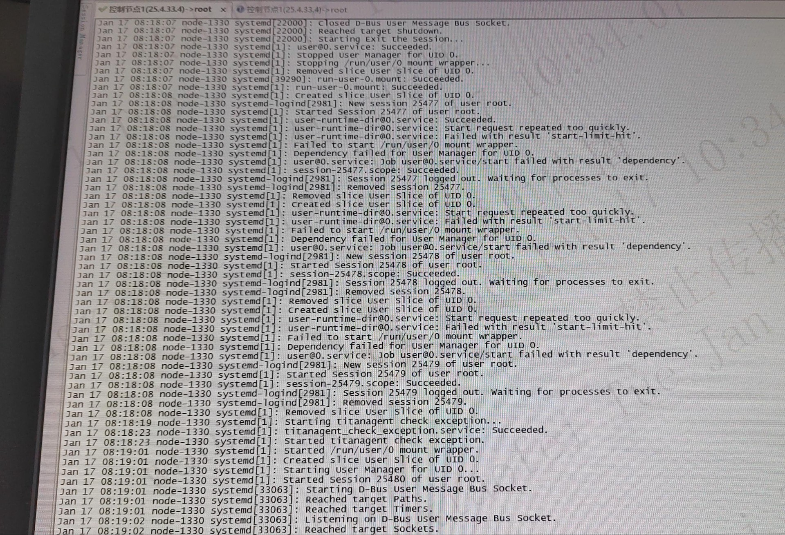

# 问题现象

可以看到主要的出错日志为:

```
systemd[1]: Created slice User Slice of UID 0
systemd-logind[1]: New session 25477 of user root.
systemd[1]: Started Session 25477 of user root
systemd[1]: user-runtime-dir@0.service: Succeeded.
systemd[1]: user-runtime-dir@0.service: Start request repeated too quickly.
systemd[1]: user-runtime-dir@0.service: Failed with result 'start-limit-hit'.
systemd[1]: Failed to start /run/user/0 mount wrapper.
systemd[1]: Dependency failed for user Manager for UID 0.
```
# 代码流程
## 服务依赖
### user@.sevice
```
[Unit]
Description=User Manager for UID %i
After=systemd-user-sessions.service
After=user-runtime-dir@%i.service
Requires=user-runtime-dir@%i.service

[Service]
User=%i
PAMName=systemd-user
Type=notify
ExecStart=-/usr/lib/systemd/systemd --user
Slice=user-%i.slice
KillMode=mixed
Delegate=pids memory
TasksMax=infinity
TimeoutStopSec=120s
```
### user-runtime-dir@%i.service
```
[Unit]
Description=/run/user/%i mount wrapper
StopWhenUnneeded=yes

[Service]
ExecStart=/usr/lib/systemd/systemd-user-runtime-dir start %i
ExecStop=/usr/lib/systemd/systemd-user-runtime-dir stop %i
RemainAfterExit=true
```

## systemd-logind
```
int session_start(Session *s, sd_bus_message *properties) {
	...
	log_struct(s->class == SESSION_BACKGROUND ? LOG_DEBUG : LOG_INFO,
		"MESSAGE_ID=" SD_MESSAGE_SESSION_START_STR,
		"SESSION_ID=%s", s->id,
		"USER_ID=%s", s->user->name,
		"LEADER="PID_FMT, s->leader,
		LOG_MESSAGE("New session %s of user %s.", s->id, s->user->name));
	...

}
static int method_create_session(sd_bus_message *message, void *userdata, sd_bus_error *error) {
	...
	r = session_start(session, message);
	...
}
const sd_bus_vtable manager_vtable[] = {
	...
	SD_BUS_METHOD("CreateSession", "uusssssussbssa(sv)", "soshusub", method_create_session, 0),
	...
};
```
可以看到，该代码流程可以通过`dbus method CreateSession` 调用到。
但是从上面的服务来看，`User Manager`service 是依赖`user-runtime-dir`
service，所以首先启动的应该是 `user-runtime-dir`。

但是从代码来看, 只有`pam_sm_open_session`调用到了。
```cpp
//===============src/login/pam_systemd.c===============
_public_ PAM_EXTERN int pam_sm_open_session(
                pam_handle_t *handle,
                int flags,
                int argc, const char **argv) {

	...
	r = sd_bus_message_new_method_call(
                bus,
                &m,
                "org.freedesktop.login1",
                "/org/freedesktop/login1",
                "org.freedesktop.login1.Manager",
                "CreateSession");
	...
}
```
关于`pam_systemd.c`文件的meson.build

```
        if conf.get('HAVE_PAM') == 1
                version_script_arg = join_paths(meson.current_source_dir(), pam_systemd_sym)
                pam_systemd = shared_library(
                        'pam_systemd',
                        pam_systemd_c,
                        name_prefix : '',
                        include_directories : includes,
                        link_args : ['-shared',
                                     '-Wl,--version-script=' + version_script_arg],
                        link_with : [libsystemd_static,
                                     libshared_static],
                        dependencies : [threads,
                                        libpam,
                                        libpam_misc],
                        link_depends : pam_systemd_sym,
                        install : true,
                        install_dir : pamlibdir)

                test('dlopen-pam_systemd',
                     test_dlopen,
                     args : [pam_systemd.full_path()]) # path to dlopen must include a slash
        endif
endif
```
可以看到该文件会编译成一个库pam_systemd.so, 在环境中也能找到
```
[root@node-1 systemd]# find /usr/lib64 |grep systemd
/usr/lib64/security/pam_systemd.so
```
这个库从后面的test来看，是使用dlopen打开的, 但是没有找到具体代码。
但是在`man/systemd-logind.service.xml`
找到一行:
```
<para>User sessions are registered with logind via the
<citerefentry><refentrytitle>pam_systemd</refentrytitle><manvolnum>8</manvolnum></citerefentry>
PAM module.</para>
```
看描述，User session 通过`pam_systemd` 被logind注册.
