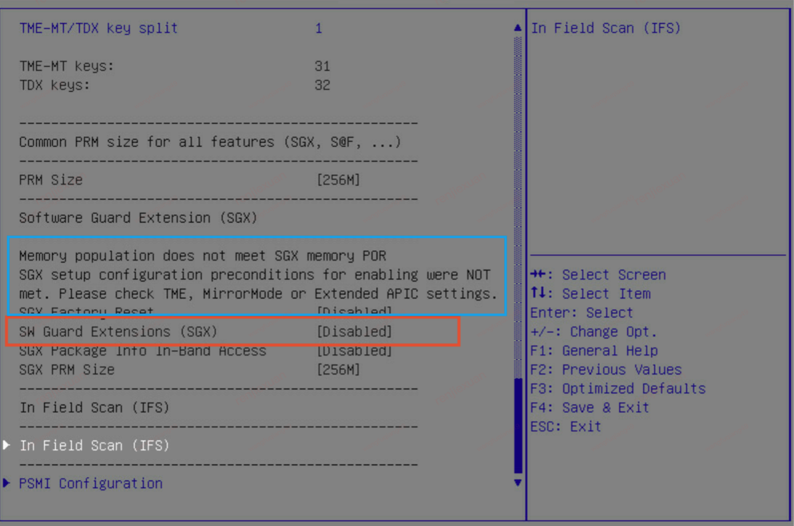
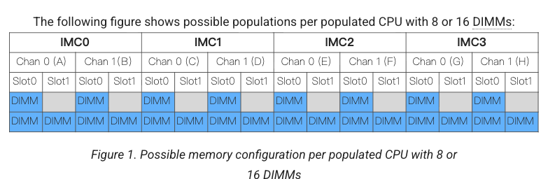

## 安装软件

* 执行`create-td-image.sh`命令缺少软件
  + `virt-install`
  + `libguestfs-tools`, `guestfs-tools-bash-completion`
  + `genisoimage`


## 问题

### TDX module无法初始化成功

现象, 系统引导后，系统中并未打印 tdx module init成功的日志:
```sh
[    0.310752] virt/tdx: BIOS enabled: private KeyID range [32, 64)
[    0.310755] virt/tdx: Disable ACPI S3. Turn off TDX in the BIOS to use ACPI S3.
```

kernel cmdline 如下:
```sh
[root@A01-R26-I118-28-2B70008 ~]# cat /proc/cmdline
BOOT_IMAGE=/vmlinuz-6.16.9 root=LABEL=label_root console=tty0 resume=UUID=14320753-ccf7-49e3-86b1-cc7e83eeeaeb cgroup_disable=files apparmor=0 crashkernel=512M selinux=0 nohibernate kvm_inte.tdx=1
```
如果正常初始化会打印下面信息:
```sh
...
[    5.205693] virt/tdx: BIOS enabled: private KeyID range [64, 128)
[   29.884504] virt/tdx: 1050644 KB allocated for PAMT
[   29.884513] virt/tdx: module initialized
...
```

调试内核代码发现是下面代码出问题

```sh
vt_init
=> tdx_bringup
   => __tdx_bringup
      => __do_tdx_bringup
         => 
        r = cpuhp_setup_state_cpuslocked(CPUHP_AP_ONLINE_DYN,
                                         "kvm/cpu/tdx:online",
                                         tdx_online_cpu, tdx_offline_cpu);
tdx_online_cpu
## 这个报错
=> seamcall_prerr(TDH_SYS_LP_INIT, &args);
```

请教硬件同事可能是SGX未开启导致，SGX BIOS界面显示如下:



而在链接<sup>5</sup>中. 

> At minimum, all slot 0's of all Integrated Memory Controller (IMC) channels >
> for all installed CPUs must be populated (i.e., 8 DIMMs per populated CPU >
> socket, at least). DIMM population must be symmetric across IMCs.

所有通道的slot0 必须插满内存，另外, DIMM 分布在 IMC 之间必须对称;我的理解是就两种内存
拓扑:

如下图所示:




## 参考链接
1. [tdx kvm-unit-test-tdx](https://github.com/intel/kvm-unit-tests-tdx)
2. [qemu]()
3. [libvirt]()
4. [kernel]()
5. [Intel® Confidential Computing Documentation -- Hardware Selection](https://cc-enabling.trustedservices.intel.com/intel-tdx-enabling-guide/03/hardware_selection/)
