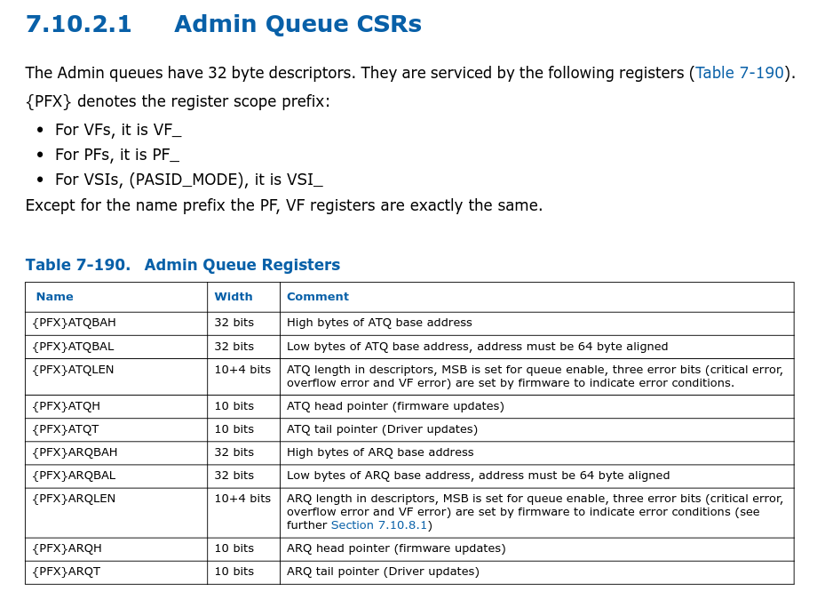

# Admin queue CSRs

可以看到里面包含了一些和队列相关的信息，
有ATQ/ARQ
 
* High/Low byte Queue base address
* Queue length
* ATQ head pointer (firmware updates)
* ATQ tail ointer  (Driver updates)
* ARQ head pointer (firmware updates)
* ARQ tail ointer  (Driver updates)

