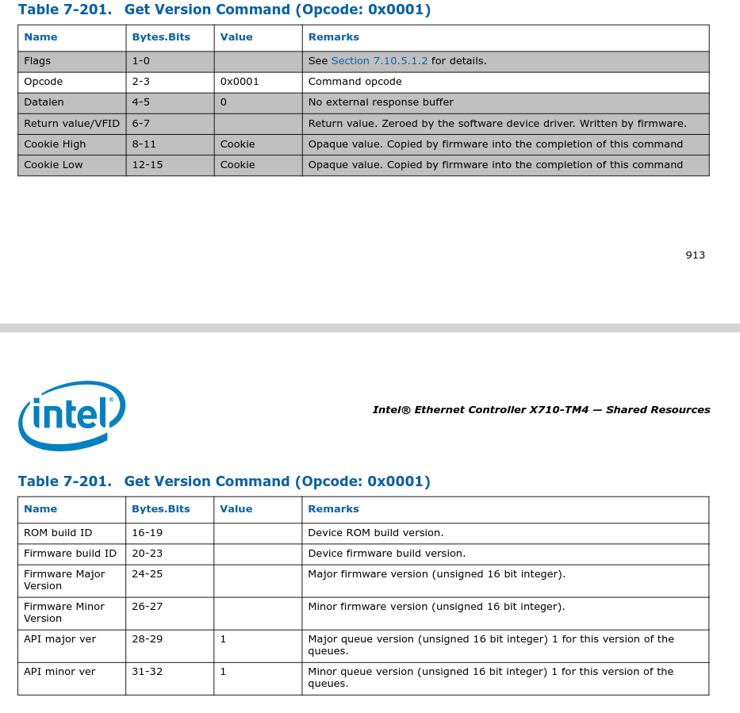

# 查看网卡型号
```
[Thu Jul 20 18:49:00 2023] i40e 0001:05:00.0: fw 8.5.67516 api 1.15 nvm 8.50 0x8000c1ed 1.3106.0 [8086:1572] [1bd4:0042]
```

查看 `/usr/share/hwdata/pci.ids`
```
...
8086  Intel Corporation
        ...
        1572  Ethernet Controller X710 for 10GbE SFP+
                ...
                1bd4 0042  10G SFP+ DP EP102Fi4 Adapter
...
```
可以看到是 intel x710 网卡类型
# detected a newer version of the NVM image
```
[Thu Jul 20 18:49:00 2023] i40e 0001:05:00.0: The driver for the device
detected a newer version of the NVM image v1.15 than expected v1.8. Please
install the most recent version of the network driver.
```

相关代码如下:
```cpp
static int i40e_probe(struct pci_dev *pdev, const struct pci_device_id *ent)
{
        ...
        if (hw->aq.api_maj_ver == I40E_FW_API_VERSION_MAJOR &&
            hw->aq.api_min_ver > I40E_FW_MINOR_VERSION(hw))
                dev_info(&pdev->dev,
                         "The driver for the device detected a newer version of the NVM image v%u.%u than expected v%u.%u. Please install the most recent version of the network driver.\n",
                         hw->aq.api_maj_ver,
                         hw->aq.api_min_ver,
                         I40E_FW_API_VERSION_MAJOR,
                         I40E_FW_MINOR_VERSION(hw));
        ...
}
```

## I40E_FW_MINOR_VERSION
查看 `I40E_FW_MINOR_VERSION` 定义:
```cpp
// driver version :  2.8.20-k
// from RHEL 8.1 kernel 4.18.0-147
#define I40E_FW_MINOR_VERSION(_h) ((_h)->mac.type == I40E_MAC_XL710 ? \
                                        I40E_FW_API_VERSION_MINOR_X710 : \
                                        I40E_FW_API_VERSION_MINOR_X722)
```
可以发现在代码里面写死的。

我们先看下 `hw->mac.type`的赋值:
```cpp
static i40e_status i40e_set_mac_type(struct i40e_hw *hw)
{
        i40e_status status = 0;

        if (hw->vendor_id == PCI_VENDOR_ID_INTEL) {
                switch (hw->device_id) {
                //#define I40E_DEV_ID_SFP_XL710           0x1572
                case I40E_DEV_ID_SFP_XL710:
                ...
                case I40E_DEV_ID_XXV710_N3000:
                        hw->mac.type = I40E_MAC_XL710;
                        break;
                case I40E_DEV_ID_KX_X722:
                case I40E_DEV_ID_QSFP_X722:
                case I40E_DEV_ID_SFP_X722:
                case I40E_DEV_ID_1G_BASE_T_X722:
                case I40E_DEV_ID_10G_BASE_T_X722:
                case I40E_DEV_ID_SFP_I_X722:
                        hw->mac.type = I40E_MAC_X722;
                        break;
                default:
                        hw->mac.type = I40E_MAC_GENERIC;
                        break;
                }
        } else {
                status = I40E_ERR_DEVICE_NOT_SUPPORTED;
        }

        hw_dbg(hw, "i40e_set_mac_type found mac: %d, returns: %d\n",
                  hw->mac.type, status);
        return status;
}
```
可以看到客户网卡对应的 vendor_id 对应的 `hw->mac.type`应为 `I40E_MAC_XL710`

对应的`I40E_FW_MINOR_VERSION`应为`I40E_FW_API_VERSION_MINOR_X710`

对比下该版本驱动和 intel 官网最新驱动:
```cpp
// driver version: 2.8.20-k
#define I40E_FW_API_VERSION_MINOR_X710  0x0008

// driver version: 2.23.17
#define I40E_FW_API_VERSION_MINOR_X710  0x000F //对应10进制为15
```

可以看到新版本驱动 `I40E_FW_API_VERSION_MINOR_X710` 是满足 `hw->ap.api_min_ver`

我们再来看下 `hw->ap.api_min_ver` 的赋值

## hw->ap.api_min_ver
```cpp
i40e_status i40e_init_adminq(struct i40e_hw *hw)
{
        ...
        /* There are some cases where the firmware may not be quite ready
         * for AdminQ operations, so we retry the AdminQ setup a few times
         * if we see timeouts in this first AQ call.
         */
        do {
                ret_code = i40e_aq_get_firmware_version(hw,
                                                        &hw->aq.fw_maj_ver,
                                                        &hw->aq.fw_min_ver,
                                                        &hw->aq.fw_build,
                                                        &hw->aq.api_maj_ver,
                                                        &hw->aq.api_min_ver,
                                                        NULL);
                if (ret_code != I40E_ERR_ADMIN_QUEUE_TIMEOUT)
                        break;
                retry++;
                msleep(100);
                i40e_resume_aq(hw);
        } while (retry < 10);
        ...
}

/**
 * i40e_aq_get_firmware_version
 * @hw: pointer to the hw struct
 * @fw_major_version: firmware major version
 * @fw_minor_version: firmware minor version
 * @fw_build: firmware build number
 * @api_major_version: major queue version
 * @api_minor_version: minor queue version
 * @cmd_details: pointer to command details structure or NULL
 *
 * Get the firmware version from the admin queue commands
 **/
i40e_status i40e_aq_get_firmware_version(struct i40e_hw *hw,
                                u16 *fw_major_version, u16 *fw_minor_version,
                                u32 *fw_build,
                                u16 *api_major_version, u16 *api_minor_version,
                                struct i40e_asq_cmd_details *cmd_details)
{
        struct i40e_aq_desc desc;
        struct i40e_aqc_get_version *resp =
                (struct i40e_aqc_get_version *)&desc.params.raw;
        i40e_status status;

        i40e_fill_default_direct_cmd_desc(&desc, i40e_aqc_opc_get_version);

        status = i40e_asq_send_command(hw, &desc, NULL, 0, cmd_details);

        if (!status) {
                if (fw_major_version)
                        *fw_major_version = le16_to_cpu(resp->fw_major);
                if (fw_minor_version)
                        *fw_minor_version = le16_to_cpu(resp->fw_minor);
                if (fw_build)
                        *fw_build = le32_to_cpu(resp->fw_build);
                if (api_major_version)
                        *api_major_version = le16_to_cpu(resp->api_major);
                if (api_minor_version)
                        *api_minor_version = le16_to_cpu(resp->api_minor);
        }

        return status;
}
```

可以看到，是通过adminq 发送`i40e_aqc_opc_get_version`命令获取，
`i40e_aqc_opc_get_version`定义:
```cpp
enum i40e_admin_queue_opc {
        /* aq commands */
        i40e_aqc_opc_get_version        = 0x0001,
        ...
}
```
手册中关于该命令描述如下:

> FROM x710 datasheet  7.10.10.1 Get Version Admin Command



可以看到，该命令可以获取当前的 Firmware version 和 queue version 
(API version), 这两个version都是由 major ver和 minor ver 构成。

那结合这两点来看，客户环境上 API  version 为 v1.15, 而RHEL 8.1 kernel自带
驱动写死的version 为 v1.8, 该打印的意思是驱动版本低，建议升级驱动版本。

另外，官方驱动包 `2.23.17`给出的 API version (v1.15) 正好为客户环境现在
安装的 VERSION ， **个人感觉不用更换固件**
