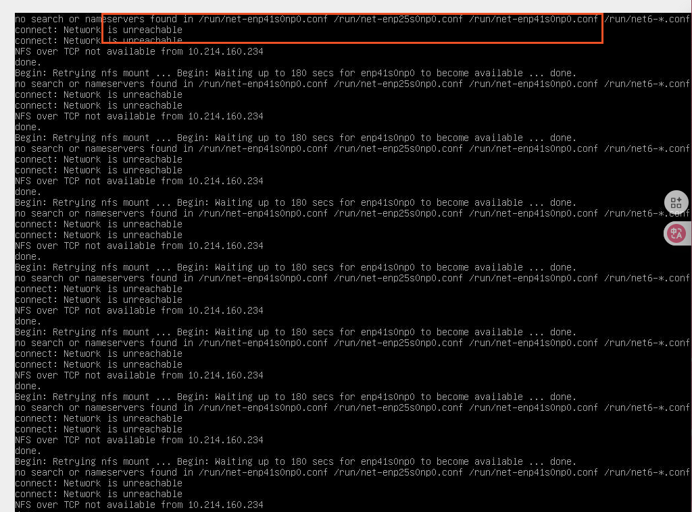
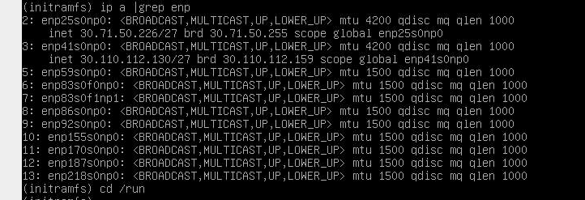
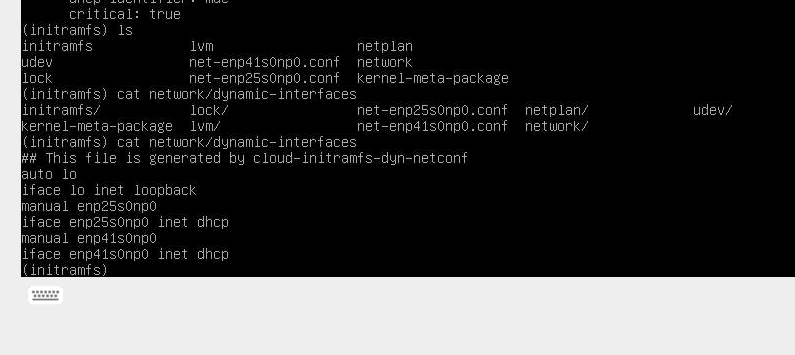
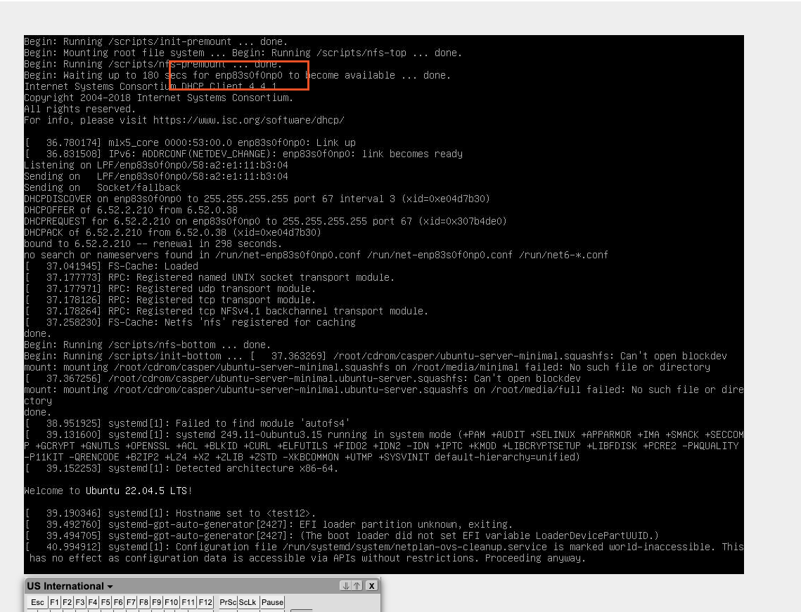

## 问题现象



显示使能了一些网卡，但是和nfs server还是不同。在dhcp server上也找不到
第二次dhcpd请求（第一次为PXE, 第二次为 initrd 中的网络服务)


一段时间后，进入initramfs, 查看网口:



DHCP的网口是`enp83xxxx`, 并没有获取到IP.

而`/run`下面有几个网口对应的配置文件


也没有`enp83xxxx`


## 查看脚本
上面配置文件显示， 网口配置文件是`cloud-initramfs-dyn-netconf`生成,
解压initramfs, 查看该脚本:
```sh
find_nic_by_mac() {
                # look for devices with matching mac address, and set RET if found.
                local mac="$1" curmac="" device="" found=""
                case "$mac" in
                        *[A-Z]*) mac=$(echo "$mac" | awk '{print(tolower($0))}')
                esac
                set +f
                for device in /sys/class/net/* ; do
                        [ -f "$device/address" ] || continue
                        read curmac < "$device/address" || continue
                        [ "$curmac" = "$mac" ] && found="${device##*/}" && break
                done
                set -f
                [ -n "$found" ] && _RET=$found && return 0
                return 1
}
bootif2macaddr() {
        # bootif is specified as BOOTIF=01-${mac_address} with '-' rather than ':'
        local input="$1" tok oifs="$IFS"
        input=${input#??-}
        IFS="-"
        _RET=""
        for tok in $input; do
                _RET="${_RET}:${tok}"
        done
        IFS="$oifs"
        _RET=${_RET#:}
}
bootif2macaddr "$BOOTIF" && [ -n "$_RET" ] ||
        fail "failed to convert BOOTIF='$BOOTIF'";
find_nic_by_mac "$macaddr" && [ -n "$_RET" ] ||
        fail "did no find a nic with $macaddr"
```
该脚本首先会调用`bootif2macaddr` 获取`BOOTIF`所指向的mac(如果是配置mac的话), 返
回到`_RET`， 并调用`find_nic_by_mac` 获取mac对应的网口, mac 会和
`/sys/class/net/*/device/address` 匹配, 随便找了台机器，
查看mac格式为`xx:xx:xx:xx:xx:xx`

但是`BOOTIF`如果是空呢? 个人没有找到具体脚本，个人怀疑是找了前两个口，在问题
机器上，网口正好乱序了.

而`BOOTIF` 怎么输入呢?

查看`./init`文件
```sh
for x in $(cat /proc/cmdline); do
    ...
    BOOTIF=*)
        BOOTIF=${x#BOOTIF=}
        ;;
    hwaddr=*)
        BOOTIF=${x#hwaddr=}
        ;;
```
可以看到会从`/proc/cmdline`中获取各个params, 可以是`BOOTIF=xxx`, 也可以是
`hwaddr=xxx`. 

修改tftpboot grub:
```
linux xxxxxxx hwaddr=xx:xx:xx:xx:xx:xx
              ^^^^^^^^^^^^^^^^^^^^^^^^(新增)
```

增加后,正常启动，并且乱序的网口也能获取到IP


