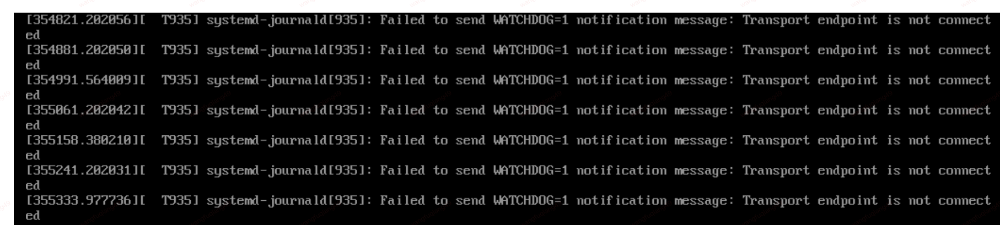

## 堆栈
```
#0  0x00007f6b68aadb5c in ?? () from /usr/lib64/libc.so.6
#1  0x00007f6b68a5ff46 in raise () from /usr/lib64/libc.so.6
#2  0x00007f6b68a4a33c in abort () from /usr/lib64/libc.so.6
#3  0x00007f6b68c7fdd4 in log_assert_failed (text=<optimized out>, file=<optimized out>, line=<optimized out>, func=<optimized out>) at ../src/basic/log.c:947
#4  0x00007f6b68d86bc5 in chase (path=0x563dc5badd51 "sys/bus/serio/devices/serio0", root=<optimized out>, flags=<optimized out>, ret_path=0x7fffb6044810, ret_fd=0x7fffb604480c)
    at ../src/basic/chase.c:648
#5  0x00007f6b68e22d36 in device_set_syspath (device=0x563dc5badba0, _syspath=_syspath@entry=0x7fffb6044920 "/sys/bus/serio/devices/serio0", verify=verify@entry=true)
    at ../src/libsystemd/sd-device/sd-device.c:153
#6  0x00007f6b68e23504 in device_new_from_syspath (ret=0x7fffb60449c8, syspath=0x7fffb6044920 "/sys/bus/serio/devices/serio0", strict=<optimized out>)
    at ../src/libsystemd/sd-device/sd-device.c:271
#7  0x00007f6b68e1d8af in enumerator_scan_dir_and_add_devices (enumerator=enumerator@entry=0x563dc5b9da80, basedir=basedir@entry=0x7f6b68e98fe1 "bus",
    subdir1=subdir1@entry=0x563dc5b9dbab "serio", subdir2=subdir2@entry=0x7f6b68e939a8 "devices") at ../src/libsystemd/sd-device/device-enumerator.c:731
#8  0x00007f6b68e1db80 in enumerator_scan_dir (enumerator=enumerator@entry=0x563dc5b9da80, basedir=basedir@entry=0x7f6b68e98fe1 "bus", subdir=subdir@entry=0x7f6b68e939a8 "devices",
    subsystem=subsystem@entry=0x0) at ../src/libsystemd/sd-device/device-enumerator.c:793
#9  0x00007f6b68e1dcce in enumerator_scan_devices_all (enumerator=0x563dc5b9da80) at ../src/libsystemd/sd-device/device-enumerator.c:972
#10 0x00007f6b68e1eb45 in device_enumerator_scan_devices (enumerator=0x563dc5b9da80) at ../src/libsystemd/sd-device/device-enumerator.c:1003
#11 device_enumerator_scan_devices (enumerator=0x563dc5b9da80) at ../src/libsystemd/sd-device/device-enumerator.c:983
#12 0x0000563d90ffb237 in trigger_main (argc=<optimized out>, argv=0x7fffb6044d70, userdata=<optimized out>) at ../src/udev/udevadm-trigger.c:545
#13 0x0000563d90fef92a in udevadm_main (argv=0x7fffb6044d68, argc=2) at ../src/udev/udevadm.c:117
#14 run (argv=0x7fffb6044d68, argc=2) at ../src/udev/udevadm.c:137
#15 main (argc=2, argv=0x7fffb6044d68) at ../src/udev/udevadm.c:140
```
代码 调用`abort()`的位置:
```sh
chase
## 传入的是空
|-> if (empty_or_root(root))
    |-> root = "/";
|-> fd = open(root, O_CLOEXEC|O_DIRECTORY|O_PATH);
|-> r = chaseat(fd, path, flags & ~CHASE_PREFIX_ROOT, ret_path ? &p : NULL, ret_fd ? &pfd : NULL);
        |-> r = chaseat_needs_absolute(dir_fd, path);
            |-> dir_fd_is_root(dir_fd);
                |-> path_is_root_at()
                    |-> r = statx_fallback(dir_fd, ".", 0, STATX_TYPE|STATX_INO|STATX_MNT_ID, &st.sx);
                    |-> r = statx_fallback(dir_fd, "..", 0, STATX_TYPE|STATX_INO|STATX_MNT_ID, &pst.sx);
                    |-> statx_mount_same(&st.nsx, &pst.nsx);
                        |-> if (FLAGS_SET(a->stx_mask, STATX_MNT_ID) && FLAGS_SET(b->stx_mask, STATX_MNT_ID))
                            |-> return a->stx_mnt_id == b->stx_mnt_id;   ## 这里会返回false
        |-> bool need_absolute = r;
        |-> if (need_absolute) 
            ## 只有上面返回值为true，才会赋值上绝对路径 '/'
            \-> done = strdup("/")
        |-> if (ret_path)
            \-> *ret_path = TAKE_PTR(done);
|-> if !FLAGS_SET(flags, CHASE_EXTRACT_FILENAME):
    |-> if (empty_or_root(root))
        |-> assert(path_is_absolute(p))  ##  abort() here
```

附: gdb调试结果:

查看`chase`打印具体的变量:
```
(gdb) p p
$1 = 0x563dc5bade90 "sys/devices/platform/i8042/serio0"
(gdb) p path
$2 = 0x563dc5badd51 "sys/bus/serio/devices/serio0"
(gdb) p root
$6 = <optimized out>
```

我们来单步调试下, 执行下面脚本:
```sh
gdb /usr/bin/udevadm -ex 'set args trigger' \
-ex 'b main' \
-ex 'r' \
-ex 'b chase' \
-ex 'c'
```
通过下面打印可以看到, 这里path没有什么问题
```
(gdb) p root
$1 = 0x0
(gdb) p path
$2 = 0x7fffffffe050 "/sys/bus/serio/devices/serio0"
```

调试`chaseat()`:
```sh
(gdb) p dir_fd
$12 = 5
(gdb) p flags
$13 = 0
(gdb) p path
$14 = 0x5555555f7d51 "sys/bus/serio/devices/serio0"
[root@AutoVm-Linux-8wwwau ~]# ls -l  /proc/7112/fd/5
l--------- 1 root root 64 Sep 22 14:18 /proc/7112/fd/5 -> / ## 指向根目录
```

## 编写小程序进一步测试
```cpp
#define _GNU_SOURCE
#include <stdio.h>
#include <sys/stat.h>
#include <fcntl.h>
#include <unistd.h>
#include <string.h>
#include <errno.h>
#include <linux/stat.h> // struct statx
#include <sys/syscall.h> // syscall numbers

int main(int argc, char *argv[]) {
    if (argc != 2) {
        fprintf(stderr, "用法: %s <文件路径>\n", argv[0]);
        return 1;
    }

    struct statx stx;
    memset(&stx, 0, sizeof(stx));

    // statx syscall: AT_FDCWD 表示当前工作目录，0 表示不加特殊flag
    int ret = syscall(SYS_statx, AT_FDCWD, argv[1], 0, STATX_ALL, &stx);
    if (ret != 0) {
        perror("statx");
        return 1;
    }

    printf("文件: %s\n", argv[1]);
    printf("大小: %lld 字节\n", (long long)stx.stx_size);
    printf("类型: 0x%x\n", stx.stx_mode & S_IFMT);
    printf("权限: 0%o\n", stx.stx_mode & 0777);
    printf("inode: %llu\n", (unsigned long long)stx.stx_ino);
    printf("硬链接数: %u\n", stx.stx_nlink);
    printf("UID: %u\n", stx.stx_uid);
    printf("GID: %u\n", stx.stx_gid);
    printf("设备主号: %u\n", stx.stx_dev_major);   // 文件所在设备的主设备号
    printf("设备次号: %u\n", stx.stx_dev_minor);   // 文件所在设备的次设备号
    printf("挂载ID: %llu\n", (unsigned long long)stx.stx_mnt_id); // 挂载点 ID (Linux 5.8+)

    printf("访问时间: %lld\n", (long long)stx.stx_atime.tv_sec);
    printf("修改时间: %lld\n", (long long)stx.stx_mtime.tv_sec);
    printf("创建时间: %lld\n", (long long)stx.stx_btime.tv_sec);

    return 0;
}
```
编译，并如下执行程序:
```
[root@AutoVm-Linux-8wwwau /]# /root/get_statx ./
文件: ./
大小: 4096 字节
类型: 0x4000
权限: 0555
inode: 2
硬链接数: 20
UID: 0
GID: 0
设备主号: 252
设备次号: 2
挂载ID: 99
访问时间: 1758518994
修改时间: 1758518233
创建时间: 1739965565
[root@AutoVm-Linux-8wwwau /]# /root/get_statx ../
文件: ../
大小: 4096 字节
类型: 0x4000
权限: 0555
inode: 2
硬链接数: 20
UID: 0
GID: 0
设备主号: 252
设备次号: 2
挂载ID: 319
访问时间: 1758518994
修改时间: 1758518233
创建时间: 1739965565
```
可以发现两者的挂载id并不一样

当我们再次执行`mount /`后再查看挂载ID
```
[root@AutoVm-Linux-8wwwau /]# mount /
[root@AutoVm-Linux-8wwwau /]# /root/get_statx ../
文件: ../
大小: 4096 字节
类型: 0x4000
权限: 0555
inode: 2
硬链接数: 20
UID: 0
GID: 0
设备主号: 252
设备次号: 2
挂载ID: 327
访问时间: 1758518994
修改时间: 1758518233
创建时间: 1739965565
```
可以发现又发生了改变.

## upstream改动
upstream有个patch 规避了这个问题:
```
commit e1f3d790f35234a380ddfb909ae5fa95a2538c1a
Author: Lennart Poettering <lennart@poettering.net>
Date:   Mon Aug 18 23:15:29 2025 +0200

    fd-util: fix path_is_root_at() when dealing with detached mounts

    path_is_root_at() is supposed to detect if the inode referenced by the
    specified fd is the "root inode". For that it checks if the inode and
    its parent are the same inode and the same mount. Traditionally this
    check was correct. But these days we actually have detached mounts (i.e.
    those returned by fsmount() and related calls), whose root inode also
    behaves like that.

    Our uses for path_is_root_at() use the function to detect if an absolute
    path would be identical to a relative path based on the specified fd
    (specifically: chaseat()), which goes really wrong if used on a detached
    mount.

    hence, let's adjust the function a bit, and let's go by path to "/" to
    check if the referenced inode is the actual root inode in our chroot.
```

大概的意思是, 因为引入了`detached mount`, `root` 和其 `parent`可能不是相同的
`mount`(我个人理解是 inode还是一个). 所以他简单调整了下，判断该path 和 当前进程
能看到的`"/"` 目录是不是一个inode和 mount.

代码调整也比较简单:
```diff
@@ -1035,10 +1035,9 @@ int fd_get_diskseq(int fd, uint64_t *ret) {
 }

 int path_is_root_at(int dir_fd, const char *path) {
-        _cleanup_close_ int fd = -EBADF, pfd = -EBADF;
-
         assert(dir_fd >= 0 || dir_fd == AT_FDCWD);

+        _cleanup_close_ int fd = -EBADF;
         if (!isempty(path)) {
                 fd = openat(dir_fd, path, O_PATH|O_DIRECTORY|O_CLOEXEC);
                 if (fd < 0)
@@ -1047,19 +1046,19 @@ int path_is_root_at(int dir_fd, const char *path) {
                 dir_fd = fd;
         }

-        pfd = openat(dir_fd, "..", O_PATH|O_DIRECTORY|O_CLOEXEC);
-        if (pfd < 0)
-                return errno == ENOTDIR ? false : -errno;
+        _cleanup_close_ int root_fd = openat(AT_FDCWD, "/", O_PATH|O_DIRECTORY|O_CLOEXEC);
+        if (root_fd < 0)
+                return -errno;

-        /* Even if the parent directory has the same inode, the fd may not point to the root directory "/",
-         * and we also need to check that the mount ids are the same. Otherwise, a construct like the
-         * following could be used to trick us:
+        /* Even if the root directory has the same inode as our fd, the fd may not point to the root
+         * directory "/", and we also need to check that the mount ids are the same. Otherwise, a construct
+         * like the following could be used to trick us:
          *
-         * $ mkdir /tmp/x /tmp/x/y
-         * $ mount --bind /tmp/x /tmp/x/y
+         * $ mkdir /tmp/x
+         * $ mount --bind / /tmp/x
          */

-        return fds_are_same_mount(dir_fd, pfd);
+        return fds_are_same_mount(dir_fd, root_fd);
 }
```

## 简单修改代码测试

> 使用openeuler upstream systemd
```diff
Subject: [PATCH] sample fix bug

---
 src/basic/fd-util.c | 2 +-
 1 file changed, 1 insertion(+), 1 deletion(-)

diff --git a/src/basic/fd-util.c b/src/basic/fd-util.c
index fa3fc77..d6d24c9 100644
--- a/src/basic/fd-util.c
+++ b/src/basic/fd-util.c
@@ -920,7 +920,7 @@ int path_is_root_at(int dir_fd, const char *path) {
         if (r < 0)
                 return r;

-        r = statx_fallback(dir_fd, "..", 0, STATX_TYPE|STATX_INO|STATX_MNT_ID, &pst.sx);
+        r = statx_fallback(dir_fd, "/", 0, STATX_TYPE|STATX_INO|STATX_MNT_ID, &pst.sx);
         if (r < 0)
                 return r;
```

合入patch后，没有其他问题.

## 附录
### 其他现象
执行`mount /`后，可能会有如下现象



合入上面的patch后，还未遇到该问题.
