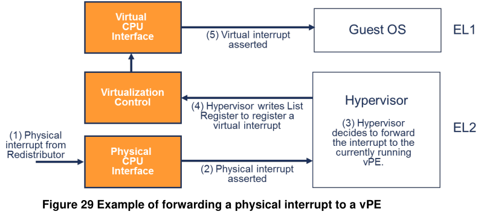
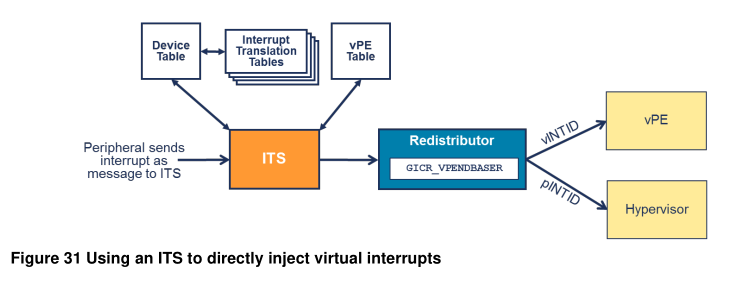
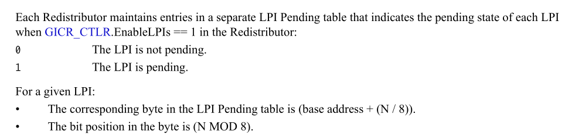

##  VGIC vm change state callbak
```cpp
static void vm_change_state_handler(void *opaque, int running,
                                    RunState state)
{
    GICv3State *s = (GICv3State *)opaque;
    Error *err = NULL;
    int ret;

    if (running) {
        return;
    }
    //===========(1)=============
    ret = kvm_device_access(s->dev_fd, KVM_DEV_ARM_VGIC_GRP_CTRL,
                           KVM_DEV_ARM_VGIC_SAVE_PENDING_TABLES,
                           NULL, true, &err);
    if (err) {
        error_report_err(err);
    }
    if (ret < 0 && ret != -EFAULT) {
        abort();
    }
}
```
可以看到在(1)处，会去 save pending table。

在看 lpi pending tables之前我们先看下 ARM64 中中断是如何注入的:
## interrupt inject
### LR -- list register



上图是一个 forward physical interrupt to vPE, 注入虚拟中断的流程
和其类似，只不过中断的来源不同( (1), (2), (3) 的流程不同) ，我们
主要看 (4), (5).

(4): 将 virtual interrupt (INTID) 写入  LR(list register) 寄存器
(5): 在 Centos OS中 会检测到该 virtual interrupt assert

所以关键的一步是，写入LR寄存器。写该寄存器后，会在切换到 guest时，cpu会将
该 interrupt assert, (在手册的 6.2.1 Usage model for the 
List register 中有讲)，这里不再赘述。


### KVM侧中断注入
```
-> irqfd_inject
  -> kvm_set_irq(kvm_set_irq(kvm, KVM_USERSPACE_IRQ_SOURCE_ID, irqfd->gsi, 1, false);
    -> struct kvm_kernel_irq_routing_entry irq_set[KVM_NR_IRQCHIPS];
    -> kvm_irq_map_gsi(kvm, irq_set, irq) // 根据用户态传下来的gsi（irq）找到kvm侧对应的kvm_kernel_irq_routing_entry结构体irq_set
    									  // 每个设备都有单独的struct kvm_kernel_irq_routing_entry
    -> kvm_set_msi(&irq_set[i], kvm, irq_source_id, level, ...) // 根据kvm_kernel_irq_routing_entry，构建struct kvm_msi，
                                                                // msi.address_lo = e->msi.address_lo;
                                                                // msi.address_hi = e->msi.address_hi;
                                                                // msi.data = e->msi.data;
																// msi.flags = e->msi.flags;
																// msi.devid = e->msi.devid;
																// 在这里，gsi号已经被丢弃，
																// 经过调试发现，address_lo和address_hi所有设备完全一样
																// 每个设备的devid号唯一
      -> vgic_its_inject_msi(kvm, &msi)
      	-> vgic_msi_to_its(kvm, msi) // 根据msi的address_lo和address_hi，获取到struct vgic_its，所有设备共用一个
      	-> vgic_its_trigger_msi(kvm, its, msi->devid, msi->data)
      	   -> vgic_its_resolve_lpi(kvm, its, devid, eventid, &irq) // 根据msi的devid和data找到struct vgic_irq irq
      	   														   // 每个设备对应一个
      	   -> vgic_queue_irq_unlock(kvm, irq, flags)  // 此时的irq是struct vgic_irq，并不是gsi（irq）号。
      	   -> irq->pending_latch = true
      	   	-> vgic_target_oracle(irq)	// 计算irq在应该哪个vcpu上运行
      	   	-> list_add_tail(&irq->ap_list, &vcpu->arch.vgic_cpu.ap_list_head) // 将irq->ap_list添加到相应vcpu的数据结构中
      	   	-> kvm_make_request(KVM_REQ_IRQ_PENDING, vcpu)
      	   	-> kvm_vcpu_kick(vcpu)  // 通知对应vcpu线程
```
注入流程大概如上，这里msi都为 lpi, 上面的流程实际上是emulate its的流程:



映射 event ID -device ID -> vINTID, 而 eventid 和 device id在 msi 相关信息中(msi data)中。

细节我们不再展开，这里我们主要关心下和LR相关的流程.
主要的代码在
```
-> list_add_tail(&irq->ap_list, &vcpu->arch.vgic_cpu.ap_list_head)
```
该行，会将该irq链接到 `vcpu->arch.vgic_cpu.ap_list_head`中。

而在切换到guest之前，会将其加载到 LR中，流程如下:
```
kvm_arch_vcpu_ioctl_run   // qemu侧执行ioctl VCPU_RUN
	-> kvm_vgic_flush_hwstate
		-> vgic_flush_lr_state
			-> compute_ap_list_depth  // 计算深度当前CPU上所有的irq，
								   // 每个irq，gic-v3只会返回一个true，也就是一个中断
			-> vgic_sort_ap_list // 如果vcpu上有多个中断在pending或者enable（个数大于4）
            				  // mlit_sgi（gic-v3不会是mli_sgi？），根据irq是否enable
							  // pending、或者优先级来排序。
            -> vgic_populate_lr
            	-> vgic_v3_populate_lr // 判断对应struct vgic_irq结构体成员，然后组织一个
            						// 64位的val值，最后写入到
            						// vcpu->arch.vgic_cpu.vgic_v3.vgic_lr[lr] = val
            -> vgic_restore_state
            	-> __vgic_v3_restore_state 
            		-> write_gicreg(cpu_if->vgic_hcr, ICH_HCR_EL2); // 向寄存器ICH_HCR_EL2写入值
            		-> __gic_v3_set_lr(cpu_if->vgic_lr[i], i);	// 向ICH_LRx_EL2写入  
```

### lpi pending tables
我们回过头来看 lpi pending tables:
> ARM64 lpi pending tables
>
> 在gic spec 5.1.2 LPI Pending tables中有讲到，`GICR_PENDBASER`
> 会指向一块内存，该内存中的相应的bits对应这LPI的 pending 状态,
> 
> LPI 所对应的bit位置计算:
>
> byte index: base address + (N/8) <br/>
> bit in this byte : N MOD 8



所以可以看到，gic 在内存中维护了一块区域，用来 indicate LPI pending 
state。

我们来看下kvm 是如何 save lpi pending state:

堆栈如下:
```
 0xffff0000100ca140 : vgic_v3_save_pending_tables+0x0/0x198 [kernel]
 0xffff0000100ca140 : vgic_v3_save_pending_tables+0x0/0x198 [kernel]
 0xffff0000100d051c : vgic_v3_set_attr+0x3c/0x48 [kernel]
 0xffff0000100a75dc : kvm_device_ioctl_attr+0x8c/0xc0 [kernel]
 0xffff0000100a76b4 : kvm_device_ioctl+0xa4/0x108 [kernel]
 0xffff0000103259bc : do_vfs_ioctl+0xc4/0x890 [kernel]
 0xffff00001032620c : ksys_ioctl+0x84/0xb8 [kernel]
 0xffff000010326268 : __arm64_sys_ioctl+0x28/0x38 [kernel]
 0xffff000010095378 : el0_svc_handler+0xa0/0x128 [kernel]
 0xffff000010083788 : el0_svc+0x8/0xc [kernel]
 0xffffaf0060ec [/usr/lib64/libc-2.17.so+0xd60ec/0x190000]
```
KVM 代码如下:
```cpp
int vgic_v3_save_pending_tables(struct kvm *kvm)
{
        struct vgic_dist *dist = &kvm->arch.vgic;
        int last_byte_offset = -1;
        struct vgic_irq *irq;
        int ret;
        u8 val;
    /////////////////(1)/////////////////
        list_for_each_entry(irq, &dist->lpi_list_head, lpi_list) {
                int byte_offset, bit_nr;
                struct kvm_vcpu *vcpu;
                gpa_t pendbase, ptr;
                bool stored;

                vcpu = irq->target_vcpu;
                if (!vcpu)
                        continue;
        /////////////////(2)/////////////////
                pendbase = GICR_PENDBASER_ADDRESS(vcpu->arch.vgic_cpu.pendbaser);

        /////////////////(3)/////////////////
                byte_offset = irq->intid / BITS_PER_BYTE;
                bit_nr = irq->intid % BITS_PER_BYTE;
                ptr = pendbase + byte_offset;

                if (byte_offset != last_byte_offset) {
            /////////////////(4)/////////////////
                        ret = kvm_read_guest_lock(kvm, ptr, &val, 1);
                        if (ret)
                                return ret;
                        last_byte_offset = byte_offset;
                }

                stored = val & (1U << bit_nr);
        /////////////////(5)/////////////////
                if (stored == irq->pending_latch)
                        continue;

        /////////////////(6)/////////////////
                if (irq->pending_latch)
                        val |= 1 << bit_nr;
                else
                        val &= ~(1 << bit_nr);

        /////////////////(7)/////////////////
                ret = kvm_write_guest_lock(kvm, ptr, &val, 1);
                if (ret)
                        return ret;
        }
        return 0;
}
```

该函数流程比较简单:
1. 遍历lpi_list_head中的每一项，获取 vgic_irq
2. 获取pendbase(GICR_PENDBASER)
3. 计算其位置
4. 获取guest page 中原有数据
5. 判断原有数据和irq中保存的中断状态是否一致，如果一致continue
6. 如果一致，更新中断状态
7. 将新值写会guest page

> NOTE 
>
> GICR_PENDBASER 指向的是guest的内存，所以，将lpi pending 
> status保存到 lpi pending tables中，会随着内存迁移，将中断
> 状态迁移到目的端。

所以我们需要在 qemu save pending tables之前，将所有的msi注入
到kvm, 经调试，发现在其之后，仍有中断通过直接注入的方式(非irqfd)
注入到kvm。

### virtio-blk vm change status
virtio-blk同样有change state 的回调，代码为:
```cpp
/* Context: QEMU global mutex held */
void virtio_blk_data_plane_stop(VirtIODevice *vdev)
{
    VirtIOBlock *vblk = VIRTIO_BLK(vdev);
    VirtIOBlockDataPlane *s = vblk->dataplane;
    BusState *qbus = qdev_get_parent_bus(DEVICE(vblk));
    VirtioBusClass *k = VIRTIO_BUS_GET_CLASS(qbus);
    unsigned i;
    unsigned nvqs = s->conf->num_queues;

    if (!vblk->dataplane_started || s->stopping) {
        return;
    }

    /* Better luck next time. */
    if (vblk->dataplane_disabled) {
        vblk->dataplane_disabled = false;
        vblk->dataplane_started = false;
        return;
    }
    s->stopping = true;
    trace_virtio_blk_data_plane_stop(s);

    aio_context_acquire(s->ctx);
    aio_wait_bh_oneshot(s->ctx, virtio_blk_data_plane_stop_bh, s);

    /* Drain and try to switch bs back to the QEMU main loop. If other users
     * keep the BlockBackend in the iothread, that's ok */
    blk_set_aio_context(s->conf->conf.blk, qemu_get_aio_context(), NULL);

    aio_context_release(s->ctx);
    
    //close host notify
    for (i = 0; i < nvqs; i++) {
        virtio_bus_set_host_notifier(VIRTIO_BUS(qbus), i, false);
        virtio_bus_cleanup_host_notifier(VIRTIO_BUS(qbus), i);
    }

    qemu_bh_cancel(s->bh);
    notify_guest_bh(s); /* final chance to notify guest */

    /* Clean up guest notifier (irq) */
    //close guest notify
    k->set_guest_notifiers(qbus->parent, nvqs, false);

    vblk->dataplane_started = false;
    s->stopping = false;
}
```
在该流程中会去 close guest notify 和 host notify:
* close host notify: host端下发新的io请求， guest 端不再处理。（guest通过写
 PCI bar空间来完成notify (详细见 virtio spec 4.1.4.4 Notification structure layout)
 如果guest写了，相当于通知到了后端，qemu这边就需要处理，而这个行为vcpu 线程会捕捉到,
 所以这里的 host notify 实际上是用来 vcpu线程 通知 io 线程
* close guest notify : guest不能在通过irqfd注入中断，通过直接注入msi
  的方式注入中断。

可以看到在 `virtio_blk_data_plane_stop()`执行后，虽然将 guest notify close 了，
但是还是允许 guest通过 direct inject msi 的方式注入中断。

那么这里为什么要允许呢，因为执行到这的时候，还有qemu已经下发的io还没有返回。
qemu这边有相关的接口用于等待block设备的io返回。
```cpp
void bdrv_drain_all(void)           //用于等待所有blk设备io返回
void blk_drain(BlockBackend *blk)   //等待一个io设备io返回
```
具体细节不再展开。

那么我们看下，在什么时候，执行相关等待函数呢?
```
do_vm_stop
  pause_all_vcpus       //暂停所有vcpu
  vm_state_notify
    virtio_blk_data_plane_stop  //virtio-blk change status notify
    vm_change_state_handler     //GIC-v3 change status notify
  bdrv_drain_all        //等待所有blk设备io返回
```
从上面流程看，等待blk 设备 io返回 在GICv3 change status notify (save
lpi pending tables）之后执行，如果判断该io需要注入中断到kvm，则注入
kvm的中断将丢失。

# 上游patch
在上游代码中，发现了该patch:
```
commit a937f8e8577babc32b24d4f518cb336c013cd14f
Author: Stefan Hajnoczi <stefanha@redhat.com>
Date:   Wed Nov 2 14:23:37 2022 -0400

    virtio-blk: simplify virtio_blk_dma_restart_cb()
...
@@ -325,8 +317,13 @@ void virtio_blk_data_plane_stop(VirtIODevice *vdev)
     aio_context_acquire(s->ctx);
     aio_wait_bh_oneshot(s->ctx, virtio_blk_data_plane_stop_bh, s);

-    /* Drain and try to switch bs back to the QEMU main loop. If other users
-     * keep the BlockBackend in the iothread, that's ok */
+    /* Wait for virtio_blk_dma_restart_bh() and in flight I/O to complete */
+    blk_drain(s->conf->conf.blk);
+
+    /*
+     * Try to switch bs back to the QEMU main loop. If other users keep the
+     * BlockBackend in the iothread, that's ok
...
```
可以看到其在 `virtio_blk_data_plane_stop()`中增加了等待io返回的流程。
需要注意的是，该patch仅解决了virtio-blk设备的中断丢失，可能还有其他的
设备也存在这个问题。个人觉得可以在 `vm_change_state_handler()`中增加
`bdrv_drain_all()`流程，但是即便这样也只是解决了block设备的中断丢失问题，
不清楚其他的设备是否存在该问题。

# x86 ?
该问题可以在x86上复现么? 我没来看下x86是如何处理的。
我们先来思考下，x86的中断状态保存在哪些地方:

* virtual-APIC page
* rvi
* pid

我们分别来看下:

## virtual-APIC page
guest 对于 apic register的访问，会落在 apic-access page中(memory-based),
而对于该地址的访问，最终会访问到virtual-APIC page, 而这个page，我们来
看下什么时候申请的:
```cpp
int kvm_create_lapic(struct kvm_vcpu *vcpu, int timer_advance_ns)
{
        struct kvm_lapic *apic;

        ASSERT(vcpu != NULL);
        apic_debug("apic_init %d\n", vcpu->vcpu_id);

        apic = kzalloc(sizeof(*apic), GFP_KERNEL_ACCOUNT);
        if (!apic)
                goto nomem;

        vcpu->arch.apic = apic;
        //该地方申请
        apic->regs = (void *)get_zeroed_page(GFP_KERNEL_ACCOUNT);
        ...
        kvm_iodevice_init(&apic->dev, &apic_mmio_ops);
        ...
}
```

可以看到，并没有和guest内存做映射。那么迁移的时候，还需要做另外的动作。
在下面的路径中会获取apic的寄存器状态:
```
kvm_vcpu_ioctl
  kvm_arch_vcpu_ioctl
    kvm_vcpu_ioctl_get_lapic
```

我们来看下该函数:
```cpp
static int kvm_vcpu_ioctl_get_lapic(struct kvm_vcpu *vcpu,
                                    struct kvm_lapic_state *s)
{
        if (vcpu->arch.apicv_active)
                kvm_x86_ops->sync_pir_to_irr(vcpu);

        return kvm_apic_get_state(vcpu, s);
}
int kvm_apic_get_state(struct kvm_vcpu *vcpu, struct kvm_lapic_state *s)
{
        memcpy(s->regs, vcpu->arch.apic->regs, sizeof(*s));
        return kvm_apic_state_fixup(vcpu, s, false);
}
```
可以看到，这里会把virtual-APIC page的内容，copy到s中，传递给用户态。

## rvi
实际上rvi不需要同步，我们来看下intel 这边virtual interrupt delivery 的流程
```
Vector := RVI;
VISR[Vector] := 1;
SVI := Vector;
VPPR := Vector & F0H;
VIRR[Vector] := 0;
IF any bits set in VIRR
    THEN RVI := highest index of bit set in VIRR
    ELSE RVI := 0;
FI;
cease recognition of any pending virtual interrupt;
IF transactional execution is in effect
    THEN abort transactional execution and transition to a non-transactional execution;
FI;
IF logical processor is in enclave mode
    THEN cause an Asynchronous Enclave Exit (AEX) (see Chapter 37, “Enclave Exiting Events”)
FI;
IF CR4.UINTR = 1 AND IA32_EFER.LMA = 1 AND Vector = UINV
    THEN virtualize user-interrupt notification identification and processing (see Section 30.2.3)
    ELSE deliver interrupt with Vector through IDT;
FI;
```

可以看到, 该 rvi 的vector delivery的时候，才去更新 VIRR的值。虽然在该流程
中会获取VIRR中 highest bit index, 但是并没有clear。所以VIRR中始终保存这，当前
vcpu 所有的pending interrupt vector.

## pid->pir
pid(post interrupt descriptor)中也保存着一些pending irq, 在上面提到的函数
kvm_vcpu_ioctl_get_lapic()中kvm_x86_ops->sync_pir_to_irr回调中会sync pir 
到 irr，这里不再展开。

经过调试，发现x86的迁移流程为:
```
热迁移CPU:
1. pause_all_vcpus
2. vm_state_notify
3. bdrv_drain_all
4. 通知VCPU线程同步CPU状态，包括VAPIC(cpu_synchronize_all_states)
5. vcpu执行ioctl系统调用同步CPU状态(do_kvm_cpu_synchronize_state)
```
