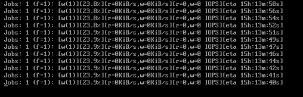

# 问题现象
当down iscsi link, 并且之后up后, fio仍然卡住:


# 现场保存, 环境信息记录
* qemu 信息
  + 39环境 - node-3
  + instance-00000010
  + 虚机名: instance-U-3
  + OS版本
  ```
  [root@instance-u-3 wangfuqiang]# cat /etc/redhat-release
  CentOS Linux release 7.8.2003 (AltArch)
  ```
  + debuginfo链接
    * [kernel-debuginfo](http://debuginfo.centos.org/7/aarch64/kernel-debuginfo-4.18.0-147.8.1.el7.aarch64.rpm)
    * [kernel-debuginfo-common](http://debuginfo.centos.org/7/aarch64/kernel-debuginfo-common-aarch64-4.18.0-147.8.1.el7.aarch64.rpm)
* gcore保存qemu进程现场

  `gcore -o qemu-2024-01-17.coredump 35468`
* virsh 保存虚拟机现场
  ```
  bash-4.4# virsh dump --domain instance-00000010 --memory-only --format=kdump-zlib /root/instance-00000010-2024-01-17.zlib
  ```
* 虚拟机内核版本

  `4.18.0-147.8.1.el7.aarch64`

* 部分符号信息
  ```
  [root@instance-u-3 wangfuqiang]# cat /proc/kallsyms |grep -E ' kimage_vaddr| kimage_voffset'
  ffff30c0591a1000 T kimage_vaddr
  ffff30c059512518 R kimage_voffset
  ```
* 查看虚机内存
  ```
  virsh # qemu-monitor-command --domain instance-00000010 --hmp x/1xg 0xffff30c0591a1000
  ffff30c0591a1000: 0xffff30c058840000
  
  virsh # qemu-monitor-command --domain instance-00000010 --hmp x/1xg 0xffff30c059512518
  ffff30c059512518: 0xffff30bfbc800000
  ```
# fio 参数
```
[root@instance-u-3 wangfuqiang]# ps aux |grep fio
root     12004  0.2  5.4 1044864 423040 tty1   Sl+  02:17   0:46 fio --name=test --rw=randwrite --bs=4k --ramp_time=5s --runtime=72000 --ioengine=libaio --iodepth=4 --numjobs=1 --filename=/dev/vdb --direct=1 --group_reporting --time_based=1 --randrepeat=0 --eta-newline 1 --write_iops_log=fio_log-2.txt --log_avg_msec=1000
root     12006  3.9  0.1 982848  8960 ?        Ss   02:17  11:40 fio --name=test --rw=randwrite --bs=4k --ramp_time=5s --runtime=72000 --ioengine=libaio --iodepth=4 --numjobs=1 --filename=/dev/vdb --direct=1 --group_reporting --time_based=1 --randrepeat=0 --eta-newline 1 --write_iops_log=fio_log-2.txt --log_avg_msec=1000
root     12482  0.0  0.0 110400  2496 pts/0    S+   07:15   0:00 grep --color=auto fio
```

# guest 中 vdb inflight
```
[root@instance-u-3 wangfuqiang]# cat /sys/block/vdb/inflight
       0        4
```
# host 中 dm-65 inflight
```
[root@node-3 ~]# cat /sys/block/dm-65/inflight
       0        0
```


# crash 调试
> NOTE
>
> 在 该虚拟机中, 不能使用该版本自带的crash, 经测试 crash-7.2.6-2
> 版本可以使用.
>
> 另外, 尝试测试crash的多个版本, 使用virsh dump 下来的vmcore, 不能打开,
> 会报:
> ```
> crash: usr/lib/debug/lib/modules/4.18.0-147.8.1.el7.aarch64/vmlinux and instance-00000010.2024-01-17.2.zlib do not match!
> ```
> 这样的错误.

## 尝试使用crash 获取virt queue 相关信息
首先测试设备vdb的信息如下:
```
[root@instance-u-3 ~]# ls -l /dev/vdb
brw-rw---- 1 root disk 253, 16 Jan 17 06:30 /dev/vdb
```
主次设备号为(253,16)

使用crash调试
```
crash> dev |grep vir
 253      virtblk        ffffea6b4ffcd800  virtblk_fops --->这里不知道为啥只显示一个
crash> gendisk.major ffffea6b4ffcd800
  major = 253
crash> gendisk.first_minor ffffea6b4ffcd800
  first_minor = 16
crash> gendisk.disk_name ffffea6b4ffcd800
  disk_name = "vdb\000\000\000\000\000\000\000\000\000\000\000\000\000\000\000\000\000\000\000\000\000\000\000\000\000\000\000b"
```
找到的设备正好是 vdb, 不知道为什么vda没有显示出来.

继续找 Virt queue
```
crash> gendisk.queue ffffea6b4ffcd800
  queue = 0xffffea6b4f4bf2f8
crash> request_queue.queuedata 0xffffea6b4f4bf2f8
  queuedata = 0xffffea6b51feea00
crash> struct virtio_blk 0xffffea6b51feea00
struct virtio_blk {
  vdev = 0xffffea6b50ded800,
  disk = 0xffffea6b4ffcd800,
  tag_set = {
    map = {{
        mq_map = 0xffffea6b5098b600,
        nr_queues = 1,
        queue_offset = 0
      }, {
        mq_map = 0x0,
        nr_queues = 0,
        queue_offset = 0
      }, {
        mq_map = 0x0,
        nr_queues = 0,
        queue_offset = 0
      }, {
        mq_map = 0x0,
        nr_queues = 0,
        queue_offset = 0
      }, {
        mq_map = 0x0,
        nr_queues = 0,
        queue_offset = 0
      }, {
        mq_map = 0x0,
        nr_queues = 0,
        queue_offset = 0
      }},
    nr_maps = 1,
    ops = 0xffff30c01fd00138 <virtio_mq_ops>,
    nr_hw_queues = 1,
    queue_depth = 128,
    reserved_tags = 0,
    cmd_size = 4120,
    numa_node = -1,
    timeout = 0,
    flags = 1,
    driver_data = 0xffffea6b51feea00,
    tags = 0xffffea6b5098d680,
    tag_list_lock = {
      owner = {
        counter = 0
      },
      wait_lock = {
        {
          rlock = {
            raw_lock = {
              {
                val = {
                  counter = 0
                },
                {
                  locked = 0 '\000',
                  pending = 0 '\000'
                },
                {
                  locked_pending = 0,
                  tail = 0
                }
              }
            }
          }
        }
      },
      osq = {
        tail = {
          counter = 0
        }
      },
      wait_list = {
        next = 0xffffea6b51feeac0,
        prev = 0xffffea6b51feeac0
      }
    },
    tag_list = {
      next = 0xffffea6b4f4bfa30,
      prev = 0xffffea6b4f4bfa30
    },
    rh_reserved1 = 0,
    rh_reserved2 = 0,
    rh_reserved3 = 0,
    rh_reserved4 = 0,
    rh_reserved5 = 0,
    rh_reserved6 = 0,
    rh_reserved7 = 0,
    rh_reserved8 = 0
  },
  config_work = {
    data = {
      counter = 68719476704
    },
    entry = {
      next = 0xffffea6b51feeb28,
      prev = 0xffffea6b51feeb28
    },
    func = 0xffff30c01fcf11f0 <virtblk_config_changed_work>,
    rh_reserved1 = 0,
    rh_reserved2 = 0,
    rh_reserved3 = 0,
    rh_reserved4 = 0
  },
  sg_elems = 128,
  index = 1,
  num_vqs = 1,  <---这里 队列数量只有一个
  vqs = 0xffffea6b50984480
}
crash> struct virtio_blk -o 0xffffea6b51feea00
struct virtio_blk {
  [ffffea6b51feea00] struct virtio_device *vdev;
  [ffffea6b51feea08] struct gendisk *disk;
  [ffffea6b51feea10] struct blk_mq_tag_set tag_set;
  [ffffea6b51feeb20] struct work_struct config_work;
  [ffffea6b51feeb60] unsigned int sg_elems;
  [ffffea6b51feeb64] int index;
  [ffffea6b51feeb68] int num_vqs;
  [ffffea6b51feeb70] struct virtio_blk_vq *vqs;
}
SIZE: 376
crash> rd ffffea6b51feeb70 8
ffffea6b51feeb70:  ffffea6b50984480 0000000000000000   .D.Pk...........
ffffea6b51feeb80:  0000000000000000 0000000000000000   ................
ffffea6b51feeb90:  0000000000000000 0000000000000000   ................
ffffea6b51feeba0:  0000000000000000 0000000000000000   ................

crash> virtio_blk_vq 0xffffea6b50984480
struct virtio_blk_vq {
  vq = 0xffffea6b51694000,
  lock = {
    {
      rlock = {
        raw_lock = {
          {
            val = {
              counter = 0
            },
            {
              locked = 0 '\000',
              pending = 0 '\000'
            },
            {
              locked_pending = 0,
              tail = 0
            }
          }
        }
      }
    }
  },
  name = "req.0\000\317X\300\060\377\377\000W\230P"
}
crash> virtqueue 0xffffea6b51694000
struct virtqueue {
  list = {
    next = 0xffffea6b50dedbf8,
    prev = 0xffffea6b50dedbf8
  },
  callback = 0xffff30c01fcf0068 <virtblk_done>,
  name = 0xffffea6b5098448c "req.0",
  vdev = 0xffffea6b50ded800,
  index = 0,
  num_free = 124,
  priv = 0xffff0000142a3000
}
crash> struct vring_virtqueue 0xffffea6b51694000
struct vring_virtqueue {
  vq = {
    list = {
      next = 0xffffea6b50dedbf8,
      prev = 0xffffea6b50dedbf8
    },
    callback = 0xffff30c01fcf0068 <virtblk_done>,
    name = 0xffffea6b5098448c "req.0",
    vdev = 0xffffea6b50ded800,
    index = 0,
    num_free = 124,    -->这里表示有124个free
    priv = 0xffff0000142a3000
  },
  vring = {
    num = 128,
    desc = 0xffffea6b509f0000,
    avail = 0xffffea6b509f0800,
    used = 0xffffea6b509f0940
  },
  weak_barriers = true,
  broken = false,
  indirect = true,
  event = true,
  free_head = 1,
  num_added = 0,
  last_used_idx = 43932, -->1
  avail_flags_shadow = 0,
  avail_idx_shadow = 43936, -->2
  notify = 0xffff30c058dcf3d8,
  we_own_ring = true,
  queue_size_in_bytes = 3398,
  queue_dma_addr = 8868790272,
  desc_state = 0xffffea6b51694090
}

crash> vring_used 0xffffea6b509f0940
struct vring_used {
  flags = 0,
  idx = 43936, ---> 3
  ring = 0xffffea6b509f0944
}
crash> vring_avail 0xffffea6b509f0800
struct vring_avail {
  flags = 0,
  idx = 43936, ---> 4
  ring = 0xffffea6b509f0804
}

crash> p ((struct vring_avail*) 0xffffea6b509f0800)->ring[128]
$6 = 43932 --> 5
crash> p ((struct vring_used *)0xffffea6b509f0940)->ring[128]
$7 = {
  id = 43936, --> 6
  len = 0
}
```
这里需要说明下
1. guest 在最后一次收到 interrupt 后, used_idx的值
2. guest 在最后一次下发io请求到 avail vring 时, avail_idx的值
3. used_idx in vring
4. avail_idx in vring
5. used_event, 这个是用来限制guest 向 host发notify, 当guest在处理avail
   vring 时, avail idx 达到 used_event, 才会发notify给host, 
6. avail_event, 这个是用来限制 host 向 guest发notify(interrupt), 当 host
   处理used vring 时, used_idx 达到 avail_idx, 才会发 notify 给guest

通过上面来看
(2)(4) 表示 guest 已经发IO请求 给 host

(3)(6) 表示 host 已经处理完IO请求.

(3)(6) 结合 (1)(5) 表示 guest 上次收到host notify 后used_idx 是 43932, 
而这是host又更新了 used_vring, (如果判断没有问题的话, 会发notify 给guest),
但是现在来看, guest 似乎没有收到这个notify

我们再使用 gdb 调试 qemu
# gdb
```
(gdb) p block_backends
$1 = {tqh_first = 0xaaaae71d4330, tqh_circ = {tql_next = 0xaaaae71d4330, tql_prev = 0xaaaae8fa78e8}}
```

设备信息
```
virsh # qemu-monitor-command --domain instance-00000010 --hmp info block
libvirt-pflash0-format: /usr/share/edk2/aarch64/QEMU_EFI-silent-pflash.raw (raw, read-only)
    Attached to:      /machine/virt.flash0
    Cache mode:       writeback

libvirt-pflash1-format: /var/lib/libvirt/qemu/nvram/instance-00000010_VARS.fd (raw)
    Attached to:      /machine/virt.flash1
    Cache mode:       writeback

libvirt-2-format: json:{"driver": "raw", "file": {"pool": "volumes", "image": "volume-b4009bd8-78a9-4f5a-845a-c3fbfa38c0b0", "server.0.host": "39.168.30.2", "server.1.host": "39.168.30.3", "server.2.host": "39.168.30.4", "driver": "rbd", "server.0.port": "6789", "server.1.port": "6789", "server.2.port": "6789", "user": "admin"}} (raw)
    Attached to:      /machine/peripheral/virtio-disk0/virtio-backend
    Cache mode:       writeback, direct

libvirt-1-format: /dev/dm-65 (raw)
    Attached to:      /machine/peripheral/virtio-disk1/virtio-backend
    Cache mode:       writeback, direct
```
需要调试的设备是 : `/dev/dm-65` -- `/machine/peripheral/virtio-disk1/virtio-backend`

gdb 继续获取信息:
```
(gdb) p *(((((struct BlockBackend *)0xaaaae71d4330)->link->tqe_next)->link->tqe_next)->link->tqe_next)
$2 = {name = 0x0, refcnt = 1, root = 0xaaaae8f2fb90, ctx = 0xaaaae6e73ef0, legacy_dinfo = 0x0, link = {tqe_next = 0x0, tqe_circ = {tql_next = 0x0, tql_prev = 0xaaaae8e652b8}},
  monitor_link = {tqe_next = 0x0, tqe_circ = {tql_next = 0x0, tql_prev = 0x0}}, public = {throttle_group_member = {aio_context = 0x0, throttled_reqs_lock = {locked = 0, ctx = 0x0,
        from_push = {slh_first = 0x0}, to_pop = {slh_first = 0x0}, handoff = 0, sequence = 0, holder = 0x0}, throttled_reqs = {{entries = {sqh_first = 0x0, sqh_last = 0x0}}, {entries = {
            sqh_first = 0x0, sqh_last = 0x0}}}, io_limits_disabled = 0, restart_pending = 0, throttle_state = 0x0, throttle_timers = {timers = {0x0, 0x0}, clock_type = QEMU_CLOCK_REALTIME,
        read_timer_cb = 0x0, write_timer_cb = 0x0, timer_opaque = 0x0}, pending_reqs = {0, 0}, round_robin = {le_next = 0x0, le_prev = 0x0}}}, dev = 0xaaaae8fa3850,
  dev_ops = 0xaaaada1e8c68 <virtio_block_ops>, dev_opaque = 0xaaaae8fa3850, guest_block_size = 512, root_state = {open_flags = 0, detect_zeroes = BLOCKDEV_DETECT_ZEROES_OPTIONS_OFF},
  enable_write_cache = true, stats = {lock = {lock = {__data = {__lock = 0, __count = 0, __owner = 0, __nusers = 0, __kind = 0, __spins = 0, __list = {__prev = 0x0, __next = 0x0}},
        __size = '\000' <repeats 47 times>, __align = 0}, initialized = true}, nr_bytes = {0, 0, 0, 0, 0}, nr_ops = {0, 0, 0, 0, 0}, invalid_ops = {0, 0, 0, 0, 0}, failed_ops = {0, 0, 0,
      0, 0}, total_time_ns = {0, 0, 0, 0, 0}, merged = {0, 0, 0, 0, 0}, last_access_time_ns = 0, intervals = {slh_first = 0x0}, account_invalid = false, account_failed = false,
    latency_histogram = {{nbins = 0, boundaries = 0x0, bins = 0x0}, {nbins = 0, boundaries = 0x0, bins = 0x0}, {nbins = 0, boundaries = 0x0, bins = 0x0}, {nbins = 0, boundaries = 0x0,
        bins = 0x0}, {nbins = 0, boundaries = 0x0, bins = 0x0}}}, on_read_error = BLOCKDEV_ON_ERROR_REPORT, on_write_error = BLOCKDEV_ON_ERROR_ENOSPC, iostatus_enabled = true,
  iostatus = BLOCK_DEVICE_IO_STATUS_OK, perm = 3, shared_perm = 31, disable_perm = false, allow_aio_context_change = false, allow_write_beyond_eof = false, remove_bs_notifiers = {
    notifiers = {lh_first = 0x0}}, insert_bs_notifiers = {notifiers = {lh_first = 0x0}}, aio_notifiers = {lh_first = 0x0}, quiesce_counter = 0, queued_requests = {entries = {
      sqh_first = 0x0, sqh_last = 0xaaaae8fa7be0}}, disable_request_queuing = false, vmsh = 0x0, force_allow_inactivate = false, in_flight = 0}
(gdb) p (((((struct BlockBackend *)0xaaaae71d4330)->link->tqe_next)->link->tqe_next)->link->tqe_next)->in_flight
$3 = 0
(gdb) p (((((struct BlockBackend *)0xaaaae71d4330)->link->tqe_next)->link->tqe_next)->link->tqe_next)->dev_ops
$15 = (const BlockDevOps *) 0xaaaada1e8c68 <virtio_block_ops>
(gdb) p (((((struct BlockBackend *)0xaaaae71d4330)->link->tqe_next)->link->tqe_next)->link->tqe_next)->dev_opaque
$16 = (void *) 0xaaaae8fa3850
(gdb) p (struct VirtIODevice *)0xaaaae8fa3850
$17 = (struct VirtIODevice *) 0xaaaae8fa3850
(gdb) p *(struct VirtIODevice *)0xaaaae8fa3850                                                                                                                                                          
$18 = {parent_obj = {parent_obj = {class = 0xaaaae6e74230, free = 0x0, properties = 0xaaaae8f2e760, ref = 2, parent = 0xaaaae8f9b5c0}, id = 0x0,
    canonical_path = 0xaaaae9043830 "/machine/peripheral/virtio-disk1/virtio-backend", realized = true, pending_deleted_event = false, pending_deleted_expires_ms = 0, opts = 0x0, hotplugged = 0,
    allow_unplug_during_migration = false, parent_bus = 0xaaaae8fa37c8, gpios = {lh_first = 0x0}, clocks = {lh_first = 0x0}, child_bus = {lh_first = 0x0}, num_child_bus = 0, instance_id_alias = -1,
    alias_required_for_version = 0, reset = {count = 0, hold_phase_pending = false, exit_phase_in_progress = false}}, name = 0xaaaad9ebe8c8 "virtio-blk", status = 15 '\017', isr = 1 '\001',
  queue_sel = 0, guest_features = 5100301908, host_features = 6325038676, backend_features = 0, config_len = 57, config = 0xaaaae8fd5b10, config_vector = 0, generation = 0, nvectors = 0,
  vq = 0xaaaae8fadb00, listener = {begin = 0x0, commit = 0xaaaad9c357a8 <virtio_memory_listener_commit>, region_add = 0x0, region_del = 0x0, region_nop = 0x0, log_start = 0x0, log_stop = 0x0,
    log_sync = 0x0, log_sync_global = 0x0, log_clear = 0x0, log_global_start = 0x0, log_global_stop = 0x0, log_global_after_sync = 0x0, eventfd_add = 0x0, eventfd_del = 0x0, coalesced_io_add = 0x0,
    coalesced_io_del = 0x0, priority = 0, name = 0xaaaad9ed5380 "virtio", address_space = 0xaaaada2db6b0 <address_space_memory>, link = {tqe_next = 0xaaaae90e08e0, tqe_circ = {tql_next = 0xaaaae90e08e0,
        tql_prev = 0xaaaae8e60e10}}, link_as = {tqe_next = 0xaaaae90e08e0, tqe_circ = {tql_next = 0xaaaae90e08e0, tql_prev = 0xaaaae8e60e20}}}, device_id = 2, vm_running = true, broken = false,
  use_disabled_flag = false, disabled = false, use_started = true, started = true, start_on_kick = false, disable_legacy_check = true, vmstate = 0xaaaae8e65080, bus_name = 0x0, device_endian = 1 '\001',
  use_guest_notifier_mask = true, dma_as = 0xaaaada2db6b0 <address_space_memory>, vector_queues = 0xaaaae6e65390}
(gdb) p ((struct VirtIODevice *)0xaaaae8fa3850)->vq                                                                                                                                                     
$19 = (VirtQueue *) 0xaaaae8fadb00
(gdb) p *(struct VirtQueue *)0xaaaae8fadb00                                                                                                                                                             
$20 = {vring = {num = 128, num_default = 128, align = 4096, desc = 8868790272, avail = 8868792320, used = 8868792640, caches = 0xaaaae9189000}, used_elems = 0xaaaae8fd5b60, last_avail_idx = 43936,
  last_avail_wrap_counter = true, shadow_avail_idx = 43936, shadow_avail_wrap_counter = true, used_idx = 43936, used_wrap_counter = true, signalled_used = 0, signalled_used_valid = false,
  notification = true, queue_index = 0, inuse = 0, vector = 1, handle_output = 0xaaaad9c06510 <virtio_blk_handle_output>, handle_aio_output = 0xaaaad9c06838 <virtio_blk_data_plane_handle_output>,
  vdev = 0xaaaae8fa3850, guest_notifier = {rfd = 49, wfd = 49, initialized = true}, host_notifier = {rfd = 51, wfd = 51, initialized = true}, host_notifier_enabled = true, node = {le_next = 0x0,
    le_prev = 0xaaaae6e65398}}
```

从VirtQueue 中信息得知:
1. shadow_avail_idx = 43936, 表示host已经收到了 guest的io请求
2. used_idx = 43936, 表示host已经将IO请求下发给后端存储,并且io返回,并且更新了 used_vring (当然从used_vring->idx也能看出来)
3. 很奇怪的是`signalled_used = 0`, `signalled_used_valid = false`(不太确定会不会因为此丢失中断.

# signalled_used && signalled_used_valid
我们来分析下,除了`virtio_reset`, 还有没有其他流程可以导致, `signalled_used_valid == false`

确实有下面的一个函数栈:
```
virtio_blk_req_complete
  virtqueue_push
    virtqueue_flush
      virtqueue_split_flush == 可能更新 signalled_used_valid
virtio_blk_data_plane_notify
  virtio_notify_irqfd
    virtio_should_notify
      virtio_split_should_notify == 更新 signalled_used
```

我们分别来看下, 为了便于理解, 我们先看 virtio_split_should_notify

##  virtio_split_should_notify
```cpp
static bool virtio_split_should_notify(VirtIODevice *vdev, VirtQueue *vq)
{
    uint16_t old, new;
    bool v;
    /* We need to expose used array entries before checking used event. */
    smp_mb();
    /* Always notify when queue is empty (when feature acknowledge) */
    if (virtio_vdev_has_feature(vdev, VIRTIO_F_NOTIFY_ON_EMPTY) &&
        !vq->inuse && virtio_queue_empty(vq)) {
        return true;
    }

    if (!virtio_vdev_has_feature(vdev, VIRTIO_RING_F_EVENT_IDX)) {
        return !(vring_avail_flags(vq) & VRING_AVAIL_F_NO_INTERRUPT);
    }
    //==(1)==
    v = vq->signalled_used_valid;
    //==(2)==
    vq->signalled_used_valid = true;
    //==(3)==
    old = vq->signalled_used;
    //==(4)==
    new = vq->signalled_used = vq->used_idx;
    //==(5)==
    return !v || vring_need_event(vring_get_used_event(vq), new, old);
}
```
1. 获取signalled_used_valid, 这个表示 signalled_used 是否是合法的
2. 因为该流程将正确的更新 signalled_used, 所以将signalled_used_valid 设置为true
3. 获取 old signalled_used, 表示上一次更新的值.
4. 更新signalled_used
5. 这里分两种情况
   + !(old signalled_used_valid), 说明上一次的signalled_used 是不合法的, 所以不能用于
     用来判断是否要发notify, 为了保险起见, 直接发notify给guest.
   + old signalled_used 是合法的, 通过计算来判断 是否要发notify

我们来看下`vring_need_event`
```cpp
/*
 * The following is used with USED_EVENT_IDX and AVAIL_EVENT_IDX.
 * Assuming a given event_idx value from the other side, if we have just
 * incremented index from old to new_idx, should we trigger an event?
 */
static inline int vring_need_event(__u16 event_idx, __u16 new_idx, __u16 old)
{
    /*
     * Note: Xen has similar logic for notification hold-off
     * in include/xen/interface/io/ring.h with req_event and req_prod
     * corresponding to event_idx + 1 and new_idx respectively.
     * Note also that req_event and req_prod in Xen start at 1,
     * event indexes in virtio start at 0.
     */
    return (__u16)(new_idx - event_idx - 1) < (__u16)(new_idx - old);
}
```
virtio spec中规定的是否要发notify的逻辑是 new_idx >= event_idx + 1
这里我们简单分析下, 为什么要这样判断.

> https://zhuanlan.zhihu.com/p/544938430
>
> 这里用数学去证明超出了我的能力, 上面链接中, 该博主提出了一个简单易懂
> 的结论
>
>> 只有当event_idx在[old, new - 1]范围时，才会允许触发中断
>
> 这里我们用举例子的方式, 来看下
>
> 为了方便, 我们这里将new = new - 1
* |-(1)-old-(2)-new-(3)-|
  1. new - (1) > new - old,  不满足
  2. new - (2) < new - old, 满足, 发中断
  3. new - (3) > new - old, (这里 new - (3) 溢出, 肯定大于 new - old), 不满足

* |-(1)-new-(2)-old-(3)-|
  1. new - (1) < new - old, (new - old 溢出), 满足, 发中断
  2. new - (2) > new - old, 两者都溢出, 举个例子, (unsigned)(1 - 2) > (unsigned)(1 - 3), 不满足
  3. new - (3) < new - old, 同上, 满足,  发中断.

所以结合上面来看, 确实是在 [old, new - 1] 范围, 但是不知道如何用数学的方式论证.

## virtqueue_split_flush
```cpp
/* Called within rcu_read_lock().  */
static void virtqueue_split_flush(VirtQueue *vq, unsigned int count)
{
    uint16_t old, new;

    if (unlikely(!vq->vring.used)) {
        return;
    }

    /* Make sure buffer is written before we update index. */
    smp_wmb();
    trace_virtqueue_flush(vq, count);
    old = vq->used_idx;
    new = old + count;
    vring_used_idx_set(vq, new);
    vq->inuse -= count;
    //==(1)==
    if (unlikely((int16_t)(new - vq->signalled_used) < (uint16_t)(new - old)))
        vq->signalled_used_valid = false;
}
```
```
    //==(1)==
    v = vq->signalled_used_valid;
    //==(2)==
    vq->signalled_used_valid = true;
    //==(3)==
    old = vq->signalled_used;
    //==(4)==
    new = vq->signalled_used = vq->used_idx;
    //==(5)==
    return !v || vring_need_event(vring_get_used_event(vq), new, old);
```
1. 这个unlikely的判断,  结合上面函数的分析来看, 是判断 vq->signalled_used, 
   是否在[old, new] 范围之内, 这里并不是很清楚为什么要这样做. 不过从现在的代码流
   来看, signalled_used 更新一定是更新到 used_idx的值. 两者始终是相等的.
