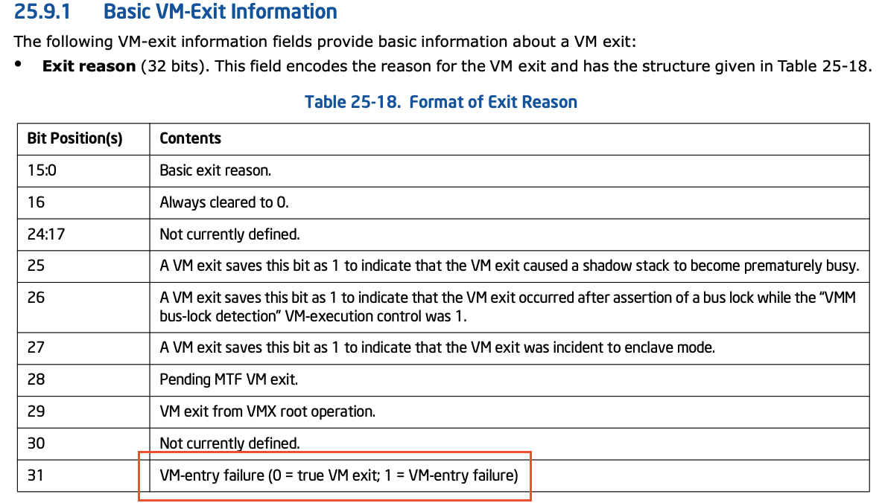
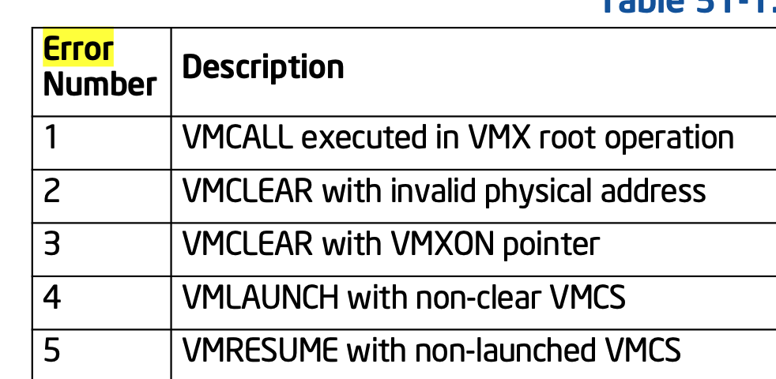
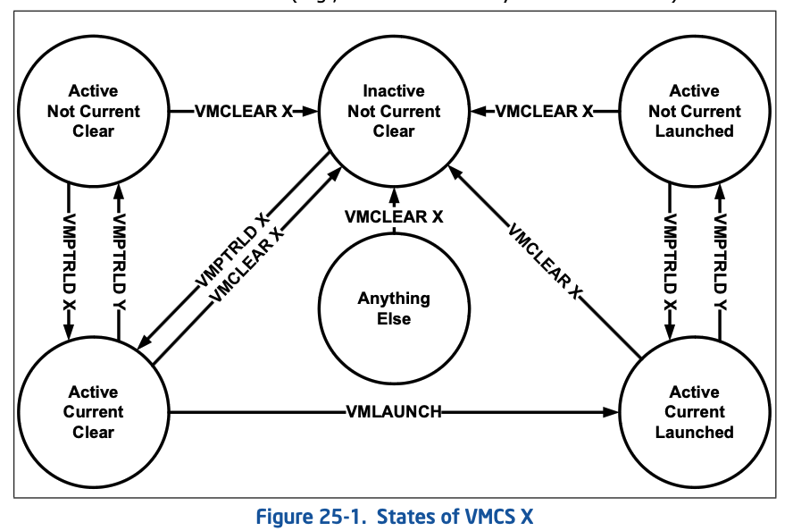

## 现象

qemu异常退出, qemu log
```
KVM: entry failed, hardware error 0x5
RAX=ffffffffada37440 RBX=ffff88ab803199c0 RCX=ffff88aeabfb5980 RDX=000000000052d936
RSI=0000000000000087 RDI=0000000000000003 RBP=0000000000000000 RSP=ffff998e0009bee8
R8 =00000b63d6d9169b R9 =0000000000000001 R10=ffff88aeabf53400 R11=0000000000000000
R12=0000000000000000 R13=0000000000000000 R14=0000000000000000 R15=0000000000000000
RIP=ffffffffada37453 RFL=00000202 [-------] CPL=0 II=0 A20=1 SMM=0 HLT=0
ES =0000 0000000000000000 ffffffff 00c00000
CS =0010 0000000000000000 ffffffff 00a09b00 DPL=0 CS64 [-RA]
SS =0018 0000000000000000 ffffffff 00c09300 DPL=0 DS   [-WA]
DS =0000 0000000000000000 ffffffff 00c00000
FS =0000 0000000000000000 ffffffff 00c00000
GS =0000 ffff88aeabf80000 ffffffff 00c00000
LDT=0000 0000000000000000 00000000 00000000
TR =0040 fffffe00000b4000 00004087 00008b00 DPL=0 TSS64-busy
GDT=     fffffe00000b2000 0000007f
IDT=     fffffe0000000000 00000fff
CR0=80050033 CR2=00007fa443039008 CR3=000000014021e003 CR4=00370ee0
DR0=0000000000000000 DR1=0000000000000000 DR2=0000000000000000 DR3=0000000000000000 
DR6=00000000fffe0ff0 DR7=0000000000000400
EFER=0000000000000d01
Code=cc 0f 1f 44 00 00 e9 07 00 00 00 0f 00 2d d7 c4 5c 00 fb f4 <c3> 66 66 2e 0f 1f 84 00 00 00 00 00 90 0f 1f 44 00 00 65 48 8b 04 25 40 f0 01 00 f0 80 48
```
## 版本
qemu, kernel: openeuler 2203 sp1

## 代码分析
qemu:
```sh
kvm_arch_handle_exit
=> switch (run->exit_reason)
   => case KVM_EXIT_FAIL_ENTRY:
   => code = run->fail_entry.hardware_entry_failure_reason
   => fprintf(stderr, "KVM: entry failed, hardware error 0x%" PRIx64 "\n",
        code);
```

对于 `KVM_EXIT_FAIL_ENTRY` 赋值，我们需要看下kvm代码:
```cpp
static int vmx_handle_exit(struct kvm_vcpu *vcpu, fastpath_t exit_fastpath)
{
    ...
    //==1==
    if (exit_reason.failed_vmentry) {
        dump_vmcs();
        vcpu->run->exit_reason = KVM_EXIT_FAIL_ENTRY;
        vcpu->run->fail_entry.hardware_entry_failure_reason
            = exit_reason.full;
        vcpu->run->fail_entry.cpu = vcpu->arch.last_vmentry_cpu;
        return 0;
    }

    //==2==
    if (unlikely(vmx->fail)) {
        dump_vmcs();
        vcpu->run->exit_reason = KVM_EXIT_FAIL_ENTRY;
        vcpu->run->fail_entry.hardware_entry_failure_reason
            = vmcs_read32(VM_INSTRUCTION_ERROR);
        vcpu->run->fail_entry.cpu = vcpu->arch.last_vmentry_cpu;
        return 0;
    }
    ....
}
```
对于该原因，内核赋值有两种硬件报错:
1. failed_vmentry
2. vmx failed

## vmentry failed
在`intel sdm 25.9.1 Basic VM-Exit Information`:



`vm-exit information`(对于代码中的`basic_reason`最高位(bit31)) 表示本次
退出的原因是
* vm entry failed
* vm exit

VM exit就不多说，vm entry failed。是指在vm entry 过程中check失败了,在`intel
sdm 27.3.1 Checks on the Guest State Area`中有描述，具体会check哪些项.

而关于`VM-exit information` basic exit reason(bit 15:0). 会报告其具体的原因, 在
`intel sdm 27.8 VM-ENTRY FAILURES DURING OR AFTER LOADING GUEST STATE`:

> Bits 15:0 of this field contain the basic exit reason. It is loaded with a
> number indicating the general cause of the VM-entry failure. The following
> numbers are used:
>
> 33. VM-entry failure due to invalid guest state. A VM entry failed one of the
>     checks identified in Section 27.3.1.
> 34. VM-entry failure due to MSR loading. A VM entry failed in an attempt to
>     load MSRs (see Section 27.4).
> 41. VM-entry failure due to machine-check event. A machine-check event
>     occurred during VM entry (see Section 27.9).

其实就是guest state设置的有问题，会触发该异常.

只有这三个值，并且其高位一定是1, 而代码中直接将
```
vcpu->run->fail_entry.hardware_entry_failure_reason = exit_reason.full;
```

所以如果是vm entry failed，一定是类似这样的:
```
KVM: entry failed, hardware error 0x80000021
```

所以该问题是, vmx failed

## vmx failed

`vmx failed` ? 啥东西，第一次听说。我们直接看`VM_INSTRUCTION_ERROR`是哪个字段
```
VM_INSTRUCTION_ERROR            = 0x00004400,
```
在`intel sdm Appendix B Field Encoding in VMCS` 查找该字段, 在`B.3.2 32-Bit
Read-Only Data Fields`一节中有提到该offset为`VM-instruction error`

在 `intel sdm 25.9.5 VM-isntruction Error Field`中介绍了该字段:

> The 32-bit VM-instruction error field does not provide information about the
> most recent VM exit. In fact, it is not modified on VM exits. Instead, it
> provides information about errors encountered by a non-faulting execution of
> one of the VMX instructions.

大概意思是说，在某次`VMX instructions` 失败时，提供其错误信息. 那对于vm entry相
关指令:
* vmlaunch
* vmresume

会触发`vmx failed`还是`vmentry failed`, 个人理解的是如果时`guest stateinvalid`报后者,
如果是其他的则报前者。

那问题来了，怎么能看出来是`vmx-exit && vmentry failed`还是，`vmx failed`呢?

vmx会将vmx exit的返回地址设置`vmx_vmexit`的地址.

```
vmcs_writel(HOST_RIP, (unsigned long)vmx_vmexit); /* 22.2.5 */
```

这样通过`vmx-exit`返回时，就会执行`vmx_vmexit`函数，但是这不适用于`vmentry
failed`:

> from CHAPTER 27 VM ENTRIES
> 
> Steps 1–4 above perform checks that may cause VM entry to fail. Such failures
> occur in one of the following three ways:
> * Some of the checks in Section 27.1 may generate ordinary faults (for example,
>   an invalid-opcode exception). Such faults are delivered normally.
> * Some of the checks in Section 27.1 and all the checks in Section 27.2 cause
>   control to pass to the instruction following the VM-entry instruction. The
>   failure is indicated by setting RFLAGS.ZF1 (if there is a current VMCS) or
>   RFLAGS.CF (if there is no current VMCS). If there is a current VMCS, an
>   error number indicating the cause of the failure is stored in the
>   VM-instruction error field. See Chapter 31 for the error numbers.

大概的意思是,  某些会是ordinary fault, 而某些只是将`RFLAGS.ZF`设置为1，并将控制
权传递给下一条指令, 我们来看下具体代码

```
vmx_vcpu_enter_exit
=> vmx->fail = __vmx_vcpu_run(vmx, (unsigned long *)&vcpu->arch.regs,
               flags);
```

我们来看下`__vmx_vcpu_run`:
```
SYM_FUNC_START(__vmx_vcpu_run)
.Lvmresume:
    vmresume
    // 这里一定时vm entry failed了
    jmp .Lvmfail
    // 这里加了两个 exttable，让其 vmresume, vmlaunch触发异常, 
    // 也直接走到failed
    _ASM_EXTABLE(.Lvmresume, .Lfixup)
    _ASM_EXTABLE(.Lvmlaunch, .Lfixup)

.Lfixup:
    cmpb $0, kvm_rebooting
    jne .Lvmfail
    ud2
.Lvmfail:
    /* VM-Fail: set return value to 1 */
    mov $1, %_ASM_BX
    jmp .Lclear_regs
```

在`Lvmfail`标签中，会将返回值设置为1.

而`intel sdm 31.4 VM INSTRUCTION ERROR NUMBERS` 则提供了vmx failed 错误码:



可以看到5是:`VMRESUME with non-launched VMCS`.

错误原因也很明显:

**在没有lanuch情况下, 执行了vmresume**

## VMCS state



> 这里不介绍过多内容.

* clear: 表示该 该cpu上还没有launch过该vmcs
* active: 表示, cpu上已经有load 过某些vmcs的信息
* launch: 表示, cpu 上已经 运行果vmcs的信息
* current: 表示vmread/vmwrite 等命令操作的vmcs

这是一个循序渐进的过程.  首先active可能是load了一小部分，但是如果要运行，
还得继续得load一些信息，就需要执行`launch`.

而假如要运行某个vmcs，首先需要调用`vmptrload`将该`vmcs`某些信息加载到该cpu上,
如果该cpu第一次运行或者运行vmclear后第一次运行vmcs, 而调用`vmlaunch`,否则调用
`vmresume`

## KVM 代码

kvm代码看起来是通过`vcpu_load()`, `vcpu_put()`来调用`load`, `clear` 操作。
我们先不说结论，先看下其调用时机, 有下面几种情况:

成对出现:
```cpp
int kvm_arch_vcpu_ioctl_get_regs(struct kvm_vcpu *vcpu, struct kvm_regs *regs)
{
    int i;

    vcpu_load(vcpu);

    for (i = 0; i < ARRAY_SIZE(vcpu->arch.gprs); i++)
        regs->gpr[i] = vcpu->arch.gprs[i];

    regs->hi = vcpu->arch.hi;
    regs->lo = vcpu->arch.lo;
    regs->pc = vcpu->arch.pc;

    vcpu_put(vcpu);
    return 0;
}
```

2. `kvm_sched_in->kvm_arch_vcpu_load`
```cpp
static void kvm_sched_in(struct preempt_notifier *pn, int cpu)
{
    struct kvm_vcpu *vcpu = preempt_notifier_to_vcpu(pn);

    WRITE_ONCE(vcpu->preempted, false);
    WRITE_ONCE(vcpu->ready, false);

    __this_cpu_write(kvm_running_vcpu, vcpu);
    kvm_arch_sched_in(vcpu, cpu);
    kvm_arch_vcpu_load(vcpu, cpu);
}
```

而`kvm_sched_out`没有调用`vcpu_put()`这是为啥呢?

因为`vcpu_load`是有代价的，简单一句话，非必要不clear. 所以在`vcpu_put()`中并未选
择将`vmcs clear`， 而是在 `vcpu_load()`中判断 当前vmcs 要load的cpu，是否是之前
已经load的cpu，如果是，则不load， 如果不是，则load，并在之前的cpu上clear.

具体代码:
```cpp
void vmx_vcpu_load_vmcs(struct kvm_vcpu *vcpu, int cpu,
            struct loaded_vmcs *buddy)
{
    struct vcpu_vmx *vmx = to_vmx(vcpu);
    bool already_loaded = vmx->loaded_vmcs->cpu == cpu;
    struct vmcs *prev;
    //如果该cpu 没有load，说明其在其他cpu上load了
    if (!already_loaded) {
        //clear 其他cpu
        loaded_vmcs_clear(vmx->loaded_vmcs);
        local_irq_disable();

        /*
         * Ensure loaded_vmcs->cpu is read before adding loaded_vmcs to
         * this cpu's percpu list, otherwise it may not yet be deleted
         * from its previous cpu's percpu list.  Pairs with the
         * smb_wmb() in __loaded_vmcs_clear().
         */
        smp_rmb();

        list_add(&vmx->loaded_vmcs->loaded_vmcss_on_cpu_link,
             &per_cpu(loaded_vmcss_on_cpu, cpu));
        local_irq_enable();
    }
    prev = per_cpu(current_vmcs, cpu);
    if (prev != vmx->loaded_vmcs->vmcs) {
        //load 到当前的vcpu上
        per_cpu(current_vmcs, cpu) = vmx->loaded_vmcs->vmcs;
        vmcs_load(vmx->loaded_vmcs->vmcs);

        /*
         * No indirect branch prediction barrier needed when switching
         * the active VMCS within a guest, e.g. on nested VM-Enter.
         * The L1 VMM can protect itself with retpolines, IBPB or IBRS.
         */
        if (!buddy || WARN_ON_ONCE(buddy->vmcs != prev))
            indirect_branch_prediction_barrier();
    }
    ...
```
看起来没什么问题，执行`vmx_vcpu_load()`将之前运行的cpu上的数据clear, 执行
并将vmcs load到该cpu上。

## have RACE or not?

会不会有两个cpu同时执行load? 也就是说这些操作会不会都是在当前的vcpu线程中执行?

我们以一个函数为例（其他的都一样) 
```
kvm_arch_vcpu_ioctl_get_regs()  KVM_GET_REGS
```
查看qemu代码
```

kvm_arch_put_registers
=> kvm_getput_regs
   => kvm_vcpu_ioctl(CPU(cpu), KVM_GET_REGS, &regs);
```
而`kvm_arch_put_registers`有:
* kvm_cpu_exec
* do_kvm_cpu_synchronize_post_reset
  ```
  kvm_cpu_synchronize_post_reset
    run_on_cpu(cpu, do_kvm_cpu_synchronize_post_reset, RUN_ON_CPU_NULL);
  ```
* do_kvm_cpu_synchronize_post_init
  ```
  kvm_cpu_synchronize_post_init
    run_on_cpu(cpu, do_kvm_cpu_synchronize_post_init, RUN_ON_CPU_NULL);
  ```
**可以看出，即便不是vcpu线程发起，调用者也会让其在vcpu线程里面跑，所以这些函数调用
一定是串行的!!**

从这里看如果出问题很像是硬件问题!

## 硬件问题?

在链接[1]中有人描述了该问题并怀疑是硬件问题:

> hi, all
> 
> We have several servers with the same cpu type, but just one of them occur
> this problem. So we  guess it's a cpu defect, and after replace the cpu , the
> problem does not occur anymore. It seems like a cpu defect, but not 100%
> confirmation.

## 参考链接
1. [redhat bugzilla: hardware error 0x5](https://bugzilla.kernel.org/show_bug.cgi?id=197813)
2. [A Windows Server 2019 guest got paused suddenly on RHEL8 KVM host with "KVM: entry failed, hardware error 0x80000021"](https://access.redhat.com/solutions/6975648)
