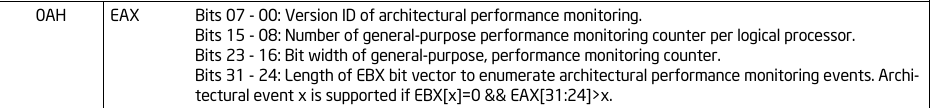
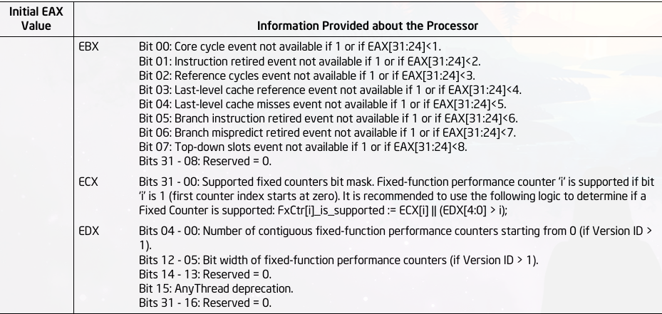
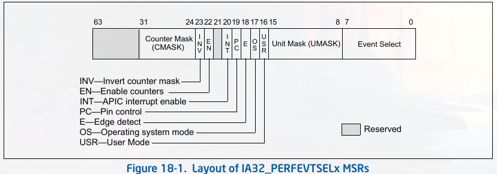
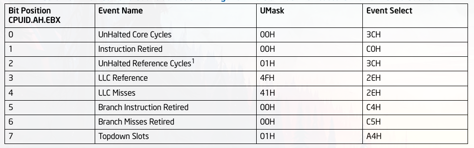

# performance monitor
性能监视器在`Pentinm`处理器被引进，其包含一组`model-specific 
performance-monitoring`MSR计数器．这些计数器允许去选择监控和
测量．某些性能参数．从这些计数器中获取道的信息可以被用作调试
系统和编译性能．

在`intel P6 family `处理器家族中，性能监控机制被增强，他允许
更多的事件选择并且有更好的机制去控制这些监控事件．另外，`Int
el NetBurst microarchitecture`引入了一种distributed(分布式?)
性能监控机制和监控事件．

性能监控机制和性能监控事件被定义在Pentium, `P6 family`,`Intel
processors base on Intel NetBurst microarchitecture` 不是
architectural．他们全部是`model specific`(在处理器family之间不
兼容)．`Intel Core Solo`和`Intel Core Duo`处理器支持一系列的
architectural性能监控事件和no-architectural性能监控事件．

性能监控机制和性能监控事件被定义在Pentium, `P6 family`,`Intel 
processors base on Intel NetBurst microarchitecture` 不是
architectural．他们全部是`model specific`(在处理器family之间不
兼容)．`Intel Core Solo`和`Intel Core Duo`处理器支持一系列的
architectural性能监控事件和non-architectural性能监控事件．

从`Intel Core Solo`和`Intel Core Duo`处理器开始，有两类性能监视
器功能．第一类支持的事件使用计数或者interrupt-base 事件采样方法.
这些事件是non-architectural并且在各个处理器之间也不相同．它们与奔
腾M处理器类似。 这些non-architectural性能监控事件对于microarchitecture
是特殊的并且可能会逐渐增强．在18.6.3中被详细介绍．对于一个给定的
microarchitecture 中的non-architectural事件不能使用CPUID枚举出来．

第二类performance monitoring capabilities被称为architectural monitoring.
他们支持相同的计数和interrupt-based　事件采样方法,并且有一组相似的
available events．architectural performance events 的可见行为在各个
处理器实现中是一致的．这些功能可以使用`CPUID.OAH`被列举出来．

PS: CPUID.OAH

##  Archtecture performance monitoring
当这些性能监控事件在不同的microarchitecture中表现一致的话，我们称这些
性能监控事件是architectural．Intel Core Solo和Intel Core Duo处理器进入了
architectural performance monitoring .这些feature提供了一个可以让软件去
枚举performance events机制，并且提供了对于这些事件的配置和计数功能．

Archtecture performance monitoring 允许处理器在实现的时候有一些增强功能．
`CPUID.OAH`提供了 version ID对于每个的实现. Intel Core Solo和Intel Core 
Duo处理器支持了基础功能，其version ID 为1．

## Archtecture Performance Monitoring Version 1
配置一个 aarchitectural performance monitoring event 涉及对　performance 
event select registers编程．对于这些performance event select MSRs
(IA32_PERFEVTSELx MSR) 数量是有限的．对于 performance monitoring events
的报告结果在 performance monitoring counter(IA32_PMCx MSR)．Performance 
monitoring counters 和 performance monitoring select registers 是成对出
现的．

Performance monitoring select registers 和 counters 是 architectural体现
在下面几个方面:
* IA32_PERFEVTSELx 位图是在所有微架构中保持一致．
* IA32_PERFEVTSELx MSRs的地址在所有微架构中保持一致.
* IA32_PMCx MSRs地址在所有微架构中保持一致.
* 每个逻辑处理器有自己的一组IA32_PMCx和 IA32_PERFEVTSELx MSRs．配置和计数
  功能不会在这些逻辑处理器中共享.

Archtecture performance monitoring 提供了CPUID机制来枚举下面的信息:
* 在逻辑处理器中的软件可获取的performance monitoring counters 数量
* 每个IA32_PMCx支持的bits位数(支持多大的计数)
* 逻辑处理器支持的 architectural performance monitoring events的数量

软件可以使用CPUID去发现 architectural performance monitoring 可用性. 这个分
支提供了一个可以获取到 architectural performance monitoring 版本号的标识符．

这个版本标识符通过查询CPUID.OAH:EAX[bits 7:0]．如果version字段 > 0,，则表示
支持 architectural performance monitoring．软件应该首先查询CPUID.OAH的version
标识符．然后分析CPUID.OAH.EAX, CPUID.OAH.EBX判断功能是否available．

在最初的 architectural performance monitoring实现中，软件可以决定有多少个
IA32_PERFEVTSELx/IA32_PMCx MSR 对在每个核心上可以被支持，ＰＭＣ的bit-width，
以及 architectural performance monitoring events的数量．

## Architectural Performance Monitoring Version 1 Facilities
Archtecture performance monitoring 功能包括一系列的 performance monitoring
计数器和 performance event select registers．这些MSR有一下性质：
* IA32_PMCx MSRs 起始于`OC1H`地址并且占据了一段MSR地址空间．每个逻辑处理器的
MSRs数量在CPUID.OAH.EAX[15:8]中被指出．注意这个与硬件上存在的physical counters
数量可能不一致，因为如果高特权的代理(eg. a VMM)可能不会暴露所有的计数器．
* IA32_PERFEVTSELx MSRs起始于`186H`地址并且占据了一段MSR地址空间．每个事件
选择器与相对应的 performance counter(在`OC1H`地址空间)成对．同理，这个数量和
硬件上存在的 physical counters数量可能不一致．
* IA32_PMCx的bit宽度在CPUID.OAH.EAX[23:16]中被指出．这是读操作的合法bit宽度．
对于写操作，这个MSR低32位都可以被写入任何值，并high-order bit 从bit 31位进行
符号扩展．
* IA32_PERFEVTSELx MSRs 的位图被定义成 architecturally.

下图是 IA32_PERFEVTSELx MSRs的位图:

* Event select field - 选择event logic unit被用来当作探测 microarchitectural
条件．对于这个field的值的集合被定义成 architectural;每个值对应着一个event 
logic unit　用作一个 architectural performance event．architecturl event
的数量通过CPUID.OAH.EAX查询．一个处理器应该支持pre-defined values的一个子集．

* Unit mask(UMASK) field [8 - 15]－ 这些bit限定了select event logic unit
探测的条件．对于每个event logic unit来说，合法的UMASK值都是特定的．对于每个
architectural event来说，他对应的UMASK value都定义了一个特定的 microarchitectural 
条件．

一个pre-defined microarchitectural condition相联系的 architectural event可能
不会适用于被给定的处理器．这个处理器只会reports pre-defined　architectural 
events的一个子集．Pre-defined architectural events在下图中被列出．支持的 
pre-defined architectural events在CPUID.OAH:EBX中被枚举.

# 相关commit
https://patchwork.kernel.org/project/kvm/patch/1457031201-31723-1-git-send-email-rkrcmar@redhat.com/
