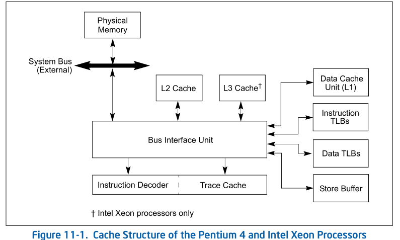
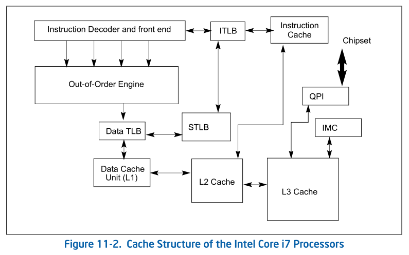
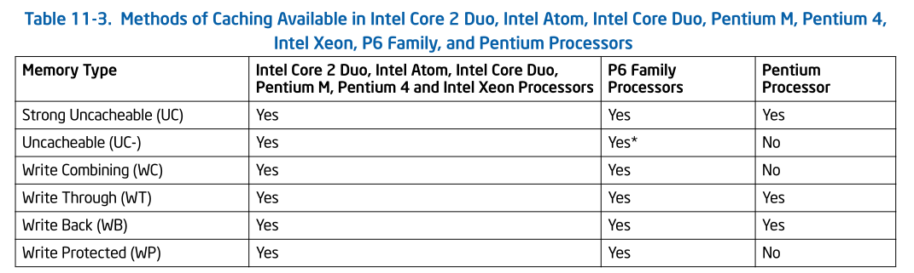

# MEMORY CACHE CONTROL
This chapter describes the memory cache and cache control 
mechanisms, the TLBs, and the store buffer in Intel 64 and 
IA-32 processors. It also describes the memory type range 
registers (MTRRs) introduced in the P6 family processors 
and how they are used to control caching of physical memory 
locations.

该章节描述了Intel 64  和 IA-32 处理器中的memory cache 和 
cache control机制， TLB和store buffer。也描述了P6 family processor
引进的memory type range register (MTRRs) 和他们如何用于控制physical
memory locations 的cache。

## 11.1 INTERNAL CACHES, TLBS, AND BUFFERS
The Intel 64 and IA-32 architectures support cache, translation
look aside buffers (TLBs), and a store buffer for temporary 
on-chip (and external) storage of instructions and data. 
(Figure 11-1 shows the arrangement of caches, TLBs, and the 
store buffer for the Pentium 4 and Intel Xeon processors.) 
Table 11-1 shows the characteristics of these caches and buffers
for the Pentium 4, Intel Xeon, P6 family, and Pentium processors.
The sizes and char- acteristics of these units are machine specific
and may change in future versions of the processor. The CPUID
instruction returns the sizes and characteristics of the caches and 
buffers for the processor on which the instruction is executed. See 
“CPUID—CPU Identification” in Chapter 3, “Instruction Set Reference, A-L,” 
of the Intel® 64 and IA-32 Architectures Software Developer’s Manual, 
Volume 2A. 

Intel 64 和IA-32 架构支持cache, translation look aside buffers(TLBs),
和为  临时 on-chip (和外部的) 指令和数据的storage 建立的 store buffer
(Figure 11-1展示了对于Pentium 4, Intel Xeon, P6 family, 和 Pentium 处理器
的这些caches和buffers的特征）。这些单units 的大小和特征是machine specific
并且在之后的处理器版本中可能会改变。CPUID instruction 返回了对于运行该指令
的处理器上的caches和buffers 的sizes和特征。请查看Chapter 3 中的"CPUID - 
CPU Identification”章节。

Figure 11-2 shows the cache arrangement of Intel Core i7 processor.

图片11-2 展示了Intel Core i7 处理器的cache 部署

Table 11-1. Characteristics of the Caches, TLBs, Store Buffer,
and Write Combining Buffer in Intel 64 and IA-32 Processors

TABLE 11-1 (略)

Intel 64 and IA-32 processors may implement four types of caches:
the trace cache, the level 1 (L1) cache, the level 2 (L2) cache,
and the level 3 (L3) cache. See Figure 11-1. Cache availability
is described below:

Intel 64 和 IA-32 处理器可以实现四种类型的caches: trace cache, level 
1 (L1) cache , level 2 (L2) cache和level 3 (L3) cache。 查看Figure 
11-1。Cache 可用性如下描述:

* Intel Core i7, i5, i3 processor family and Intel Xeon processor
family based on Nehalem microarchitecture and Westmere 
microarchitecture — The L1 cache is divided into two sections:
one section is dedicated to caching instructions (pre-decoded
instructions) and the other caches data. The L2 cache is a unified
data and instruction cache. Each processor core has its own L1 and L2.
The L3 cache is an inclusive, unified data and instruction cache,
shared by all processor cores inside a physical package. No trace
cache is implemented.
 

Intel Core i7, i5,i3 处理器 家族和基于 Nehalem microarchitecture 和
Westmere microarchitecture 的Intel Xeon 处理器家族:
 
L1 cache 被分成两个部分:
一部分是用于cache instructions(预解码指令) ，另一部分是caches data。
L2 cache 是一个不区分data 和 instructions 的cache。每个处理器核心
有自己的L1和L2 cache 。L3 cache 是一个 inclusive(包括全部的?) 不区分
data 和 instructions cache, 并且被 physical package 内部中所有的
处理器核心共享。No trace cache 在该架构中实现。

* Intel® Core™ 2 processor family and Intel® Xeon® processor 
family based on Intel® Core™ microarchitecture — The L1 cache
is divided into two sections: one section is dedicated to caching
instructions (pre- decoded instructions) and the other caches data.
The L2 cache is a unified data and instruction cache located on the 
processor chip; it is shared between two processor cores in a 
dual-core processor implementation. Quad-core processors have two
L2, each shared by two processor cores. No trace cache is implemented.
 

Intel(R) Core(TM) 处理器家族和 基于Intel(R) Core(TM) microarchitecture
的Intel (R) Xeon(R) 处理器家族:
 
L1 cache  被分为两部分: 一部分用于缓存指令(预解码指令)另一部分用于缓存
data。L2 cache 不区分data和 instruction cache , 这些cache 位于procoessor 
chip; 它在 dual-core 处理器实现中的两个 processor core 之间共享。Qual-core
处理器有两个L2, 每个在两个处理器中共享。没有trace cache 被实现。

* Intel Atom® processor — The L1 cache is divided into two sections:
one section is dedicated to caching instructions (pre-decoded 
instructions) and the other caches data. The L2 cache is a 
unified data and instruction cache is located on the processor 
chip. No trace cache is implemented.
 

Intel Atom(R) procssor:
L1 cache 被分为两部分: 一部分用于缓存指令(预解码指令), 另一部分用于缓存
data. L2 cache不区分data和指令，并且cache位于processor chip上。
没有trace cache 的实现。
 

* Intel® Core™ Solo and Intel® Core™ Duo processors — The L1 
cache is divided into two sections: one section is dedicated
to caching instructions (pre-decoded instructions) and the other
caches data. The L2 cache is a unified data and instruction 
cache located on the processor chip. It is shared between two
processor cores in a dual-core processor implementation. No 
trace cache is implemented.
 

Intel® Core™ Solo and Intel® Core™ Duo processors :
 
L1 cache 被分为两部分: 一部分用于缓存指令(预解码指令)另一部分
用于缓存数据。L2 cache 不区分data 和 instruction cache, 
并且位于processor chip。它在两个 dual-core processor 实现
的处理器核心之间共享。没有trace cache 的实现。

* Pentium® 4 and Intel® Xeon® processors Based on Intel 
NetBurst® microarchitecture — The trace cache caches decoded 
instructions (μops) from the instruction decoder and the L1 
cache contains data. The L2 and L3 caches are unified data and
instruction caches located on the processor chip.Dualcore
processors have two L2, one in each processor core. Note that 
the L3 cache is only implemented on some Intel Xeon processors.

* P6 family processors — The L1 cache is divided into two sections:
one dedicated to caching instructions (pre- decoded instructions)
and the other to caching data. The L2 cache is a unified data and
instruction cache located on the processor chip. P6 family 
processors do not implement a trace cache.

* Pentium® processors — The L1 cache has the same structure as
on P6 family processors. There is no trace cache. The L2 cache
is a unified data and instruction cache external to the processor
chip on earlier Pentium processors and implemented on the processor
chip in later Pentium processors. For Pentium processors where
the L2 cache is external to the processor, access to the cache
is through the system bus. 

For Intel Core i7 processors and  processors based on Intel Core, 
Intel Atom, and Intel NetBurst microarchitectures, Intel Core
Duo, Intel Core Solo and Pentium M processors, the cache lines
for the L1 and L2 caches (and L3 caches if supported) are 64 
bytes wide. The processor always  reads a cache line from system
memory beginning on a 64- byte **boundary.**1 (A 64-byte 
aligned cache line begins at an  address  with its 6 least- 
**significant**2 bits clear.) A cache line  can be 
filled from memory with a **8-transfer burst** 3transaction. The 
caches do not support partially-filled cache lines, so caching
even a single doubleword requires caching an entire line.
 

1. boundary: 界限分界线。这里指的是对齐的字节
2. significant : 有意义的; least-significant ，这里指的是最低的有效位
3. transfer: 转让调动，一次完整的DMA数据传输称为transfer, 可以包含多个
burst, burst数量被称为transfer数量
  
 burst: 突发, DMA传输中的最小单元
  
 所以，这里应该指的是，一次从memory -> cacheline的transfer ,中有8个burst.
 也就是8个bype数据(64 byte)。每个byte代表一个burst(以地址为单位)

The L1 and L2 cache lines in the P6 family and Pentium processors
are 32 bytes wide, with cache line reads from system memory 
beginning on a 32-byte boundary (5 least-significant bits of 
a memory address clear.) A cache line can be filled from memory
with a 4-transfer burst transaction. Partially-filled cache 
lines are not supported. The trace cache in processors based 
on Intel NetBurst microarchitecture is available in all 
execution modes: protected mode, system management mode (SMM),
and real-address mode. The L1,L2, and L3 caches are also available
in all execution modes; however, use of them must be handled 
carefully in SMM (see Section 31.4.2, “SMRAM Caching”).

The TLBs store the most recently used page-directory and page-table
entries. They speed up memory accesses when paging is enabled by
reducing the number of memory accesses that are required to read
the page tables stored in system memory. The TLBs are divided into
four groups: instruction TLBs for 4-KByte pages, data TLBs for
4-KByte pages; instruction TLBs for large pages (2-MByte, 4-MByte
or 1-GByte pages), and data TLBs for large pages. The TLBs are
normally active only in protected mode with paging enabled. When
paging is disabled or the processor is in real-address mode, 
the TLBs maintain their **contents**1 until 
**explicitly**2 or **implicitly**3
flushed (see Section 11.9, “Invalidating the Translation 
Lookaside Buffers (TLBs)”).

四种TLB: 
<ul>
	<li>instruction TLB for 4-KByte page</li>
	<li>data TLB for 4-KByte page</li>
	<li>instruction TLB for large page</li>
	<li>data TLB for large page</li>
</ul>

1. content: 内容 
2. explicitly: 明确而详细的 
3. implicitly: 含蓄的，不直接表明的 

这里指的是当paging 改变为disabled的状态，或者处理器正处于
real-address模式，TLBs 将会继续维护这些内容，直到被明确（直接）
或者间接的flush

Processors based on Intel Core microarchitectures implement one
level of instruction TLB and two levels of data TLB. Intel Core
i7 processor provides a second-level unified TLB. The store 
buffer is associated with the processors instruction execution
units. It allows writes to system memory and/or the internal 
caches to be saved and in some cases combined to optimize the
processor’s bus accesses. The store buffer is always enabled 
in all execution modes.

store buffer 和处理器 指令执行单元联系起来。它允许将写入系统内存和
internal caches的数据存储下来，在某些情况下组合起来去优化processor's
bus 访问。在所有的执行模式中，strore buffer 总是 enabled

The processor’s caches are for the **most part**1 transparent to 
software. When enabled, instructions and data **flow through** 2
these caches without the need for explicit software control. 
However, knowledge of the behavior of these caches may be 
useful in optimizing software performance. For example, 
knowledge of cache dimensions3 and replacement
4 algorithms gives an indication of how large of 
a data structure can be operated on at once without causing 
cache thrashing5.

1. most part: 很大程度上;大部分  
2. 流经; 流过;   
3. 量度, 维度  
4. 替换  
5. 激烈的运动，移动

这些cache 维度和替换算法的知识可以表明一次操作多大的数据而不会导致
缓存抖动

In multiprocessor systems, maintenance of cache consistency may,
**in rare circumstances**1, require intervention2 by system software.
For these rare cases, the processor provides privileged cache
control instructions for use in flushing caches and forcing 
**memory ordering**3.

1.  rare: 极少数 circumstances: 环境，情形，情况   
in rare circumstances: 在极少数的情况下 
2. 介入
3. 内存访问排序 这里指的是一些内存屏障指令

There are several instructions that software can use to improve
the performance of the L1, L2, and L3 caches, including the 
PREFETCHh, CLFLUSH, and CLFLUSHOPT instructions and the **non-temporal**1
move instructions (MOVNTI, MOVNTQ, MOVNTDQ, MOVNTPS, and MOVNTPD).
The use of these instructions are discussed in Section 11.5.5,
“Cache Management Instructions.” 

1. !!!!!

## 11.2 CACHING TERMINOLOGY
IA-32 processors (beginning with the Pentium processor) and 
Intel 64 processors use the MESI (modified, exclu- sive, 
shared, invalid) cache protocol to maintain consistency with 
internal caches and caches in other processors (see Section 
11.4, “Cache Control Protocol”). 

When the processor recognizes that an operand1 
being read  from memory is cacheable, the  processor 
reads an entire  cache line into the appropriate  cache 
(L1, L2, L3, or all).  This operation is called a cache 
line fill. If the memory location containing that operand is 
still cached the next time the processor attempts to access 
the operand, the processor can read the operand from the cache
instead of going back to memory. This operation is called a 
cache hit.

1. operand: 操作数

cache line fill: 如果processor识别到 内存中读取的操作数是可缓存
,该操作被称为cache line fill
的，processor 读取整个的cache line 到合适的cache 中(L1,L2,L3 or all)

cache hit: 如果memory location 包含的操作数已经缓存了，下次处理器尝试
去访问这个操作数，处理器可以从cache 中读取该操作数，而不是回到内存中
读取。该操作被称为 a cache hit。

When the processor attempts to write an operand to a cacheable
area of memory, it first checks if a cache line for that memory
location exists in the cache. If a valid cache line does exist,
the processor (depending on the write policy1 currently **in force**2)
can write the operand into the cache instead of writing it out
to system memory. This operation is called a **write hit**. If a 
write misses the cache (that is, a valid cache line is not 
present for area of memory being written to), the processor 
performs a cache line fill, write allocation. Then it writes 
the operand into the cache line and (depending on the write 
policy currently in force) can also write it out to memory. 
If the operand is to be written out to memory, it is written 
first into the store buffer, and then written from the store 
buffer to memory when the system bus is available. (Note that
for the Pentium processor, write misses do not result in a cache
line fill; they always result in a write to memory. For this 
processor, only read misses result in cache line fills.)

1. policy: 策略 
2. in force : 实施中的，现行的 

当write 操作缓存miss, 处理器会执行一个cache line fill的操作。然后
write 这个操作数到 cachline 并且（根据当前的写入策略) 回写到内存。
如果操作数要回写到内存，现将其写入store buffer, 然后等system bus is available
时， 将store buffer 中的数据写入memory

在奔腾处理器中，write misses 不会导致 cache line fill; 他们
总是会写入到内存中。对于这些处理器，只有read misses会导致 cache line fill

When operating in an MP system, IA-32 processors (beginning 
with the Intel486 processor) and Intel 64 processors have the
ability to snoop other processor’s accesses to system memory 
and to their internal caches. They use this snooping ability 
to keep their internal caches consistent both with system memory
and with the caches in other processors on the bus. For example,
in the Pentium and P6 family processors, if through snooping 
one processor detects1 that another processor intends2 to write
to a memory location that it currently has cached in shared 
state, the snooping processor will invalidate its cache line 
forcing it to perform a cache line fill the next time it 
accesses the same memory location.

1. detect : 发现察觉 
2. intend: 打算

这里提到的某些处理器可能会有一定的snoop 行为。这个snoop 行为会使得
自己的internal cache 和system memory 以及其他cpu core 的 internal cache
有一些通信行为。 如果另一个处理器修改了 本处理器中cache 数据，
本处理器会snoop 到， 并且 invalidate internal cache line . 如果下
次要访问这块内存的话，需要去执行一个 cache line  fill 的操作.

Beginning with the P6 family processors, if a processor detects1
(through snooping) that another processor is trying to access
a memory location that it has modified in its cache, but has 
not yet written back to system memory, the snooping processor
will signal the other processor (**by means of**2 the HITM# signal)
that the cache line is held in modified state and will perform
an implicit write-back of the modified data. The implicit 
write-back is transferred directly to the initial requesting 
processor and snooped by the memory controller to assure that
system memory has been updated. Here, the processor with the 
valid data may pass the data to the other processors without 
actually writing it to system memory; however, it is the 
responsibility of the memory controller to snoop this operation
and update memory. 

1. detect : 发现察觉 
2. be means of: 通过

这里讲的是如果有个处理器发现(通过snoop)另一个处理器尝试访问一个内存，
但是该内存在本处理器的缓存中已经修改了, 但是还没有写回到
系统内存中， snoop processor 会向其他的处理器发送一个信号(通过HITM#信号),
该信号表示该cache line 已经处于修改的状态，并且将会执行一个隐式
的modify data 的 write-back操作。该 隐式write-back 会直接传输到
发起request 的 processor 被嗯切被memory controller snoop 到，用于
保证系统内存已经更新。这里带有合法data的(正确的)processor  可能将输出直接
传输到其他的处理器，在数据实际没有写入系统内存的情况下;
但是, memory controller 负责 snoop 该行为并且更新内存。

## 11.3 METHODS OF CACHING AVAILABLE
The processor allows any area of system memory to be cached in
the L1, L2, and L3 caches. In individual pages or regions of 
system memory, it allows the type of caching (also called memory
type) to be specified (see Section 11.5). Memory types currently
defined for the Intel 64 and IA-32 architectures are (see Table
11-2):

这里将的memory type 实际上指 独立的内存页或者内存区间的 cache type.

* Strong Uncacheable (UC) —System memory locations are not 
cached. All reads and writes appear on the system bus and are
executed in program order without reordering. No speculative1
memory accesses, page-table walks, or prefetches of speculated
branch targets are made. This type of cache-control is useful
for memory-mapped I/O devices. When used with normal RAM, it 
greatly reduces processor performance.

1. speculative: 投机的; 推测出的

UC： 有以下几个特点： 
1. 对system memory 访问不会触发cache   
2. 任何读写访问不会被重新排序  
3. 没有投机内存访问，page-table walks, 以及预取推测的分支目标

* Uncacheable (UC-) — Has same characteristics as the strong 
uncacheable (UC) memory type, except that this memory type can
be overridden by programming the MTRRs for the WC memory type.
This memory type is available in processor families starting 
from the Pentium III processors and can only be selected 
through the PAT.

基本于UC相同，除了 该memory type 可以通过编程MTRRs 值覆盖 成WC 
memory type.

* Write Combining (WC) — System memory locations are not cached
(as with uncacheable memory) and coherency is not enforced强制 by
the processor’s bus coherency protocol. Speculative reads are
allowed. Writes may be delayed and combined组合;结合;合并 in the write 
combining buffer (WC buffer) to reduce memory accesses. 
If the WC buffer is partially filled, the writes may be delayed
until the next occurrence事件，事情 of a serializing序列化 event; such as an 
SFENCE or MFENCE instruction, CPUID or other serializing instruction,
a read or write to uncached memory, an interrupt occurrence, 
or an execution of a LOCK instruction (including one with an 
XACQUIRE or XRELEASE prefix). In addition, an execution of the
XEND instruction (to end a transactional region) evicts逐出，赶出 any 
writes that were buffered before the corresponding execution 
of the XBEGIN instruction (to begin the transactional region)
before evicting any writes that were performed inside the 
transactional region. This type of cache-control is appropriate
for video frame buffers, where the order of writes is unimportant
as long as the writes update memory so they can be seen on the
graphics display. See Section 11.3.1, “Buffering of Write 
Combining Memory Locations,” for more information about caching
the WC memory type. This memory type is available in the Pentium
Pro and Pentium II processors by programming the MTRRs; or in
processor families starting from the Pentium III processors by
programming the MTRRs or by selecting it through the PAT.

1. enforced: 强制 
2. 组合;结合
  
Write Combining (WC)有以下特点: 
1. not cached (uncacheable memory) 
2. 允许投机读取 
3. 写操作将会被delayed 并且 combined(合并)在write combining buffer(WC buffer)
来减少 memory access 
4. 如果WC buffer 被部分填充，writes操作将会delay, 知道发生了一些事件,例如 一些序列化指令，read or write to uncached memory , interrupt事件。
... 
5. 某些寄存器可以通过 MTRRs 编程或者通过PAT 选择 enable 该memory type

(Note:  Speculative read是指读之前并不验证内存的有效性，先冒险的读进来，
如果发现不是有效数据再取消读取操作，并更新内存后再读取. 比如说数据还是被
buffer在WC buffer中)
 
来自: https://blog.csdn.net/chen1540524015/article/details/74219375

* Write-through (WT) — Writes and reads to and from system 
memory are cached. Reads come from cache lines on cache hits;
read misses cause cache fills. Speculative reads are allowed.
All writes are written to a cache line (when possible) and 
through to system memory. When writing through to memory, invalid
cache lines are never filled, and valid cache lines are either
filled or invalidated. Write combining is allowed. This type of
cache-control is appropriate for frame buffers or when there 
are devices on the system bus that access system memory, but 
do not perform snooping of memory accesses. It enforces coherency
between caches in the processors and system memory. 

Write-through (WT) : 
<ol>
<li>Write to 和 read from memory 会被cache.</li>
<li>read 会在cache hits 情况下从cache line 获取,在miss情况下
会造成cache fills</li>
<li> 允许 speculative read
<li> 所有的写操作会写入到一个cache line(如果可能的话）并且会写入system
memory.</li>
<li> 当写向内存时，无效的cache line 不会被filled, 有效的cache line 
可能会被fill, 或者被 无效(这里应该指的是other processor cpu)</li>
<li>  此类行的cache 使用于frame buffer 或者systemd bus 上的devices 
访问系统 内存</li>

<li> 不能执行snoop memory access.(???)</li>

<li> 会在processor cache 和 system memory 强制保持一致性.</li>
</ol>

* Write-back (WB) — Writes and reads to and from system memory
are cached. Reads come from cache lines on cache hits; read 
misses cause cache fills. Speculative reads are allowed. Write
misses cause cache line fills (in processor families starting
with the P6 family processors), and writes are performed entirely
in the cache, when possible. Write combining is allowed. The 
write-back memory type reduces bus traffic by eliminating清除 many
unnecessary writes to system memory. Writes to a cache line are
not immediately forwarded to system memory; instead, they are
accumulated积累 in the cache. The modified cache lines are written
to system memory later, when a write-back operation is performed.
Write-back operations are triggered when cache lines need to 
be deallocated解除分配;释放, such as when new cache lines are being allocated 
in a cache that is already full. They also are triggered by the
mechanisms used to maintain cache consistency. This type of 
cache-control provides the best performance, but it requires 
that all devices that access system memory on the system bus 
be able to snoop memory accesses to ensure system memory and 
cache coherency.

同上1,2,3
<ol>
	<li>
	write操作将会导致cache line fill , 并且写操作将会全部在cache中进行。
	</li>
	<li>Write combining 将被允许</li>
	<li>
	write-back memory type 减少了bu通信，通过避免了许多不必要的写入内存操作。
	</li>
	<li>
	写入cache line 后，不会立即写入system memory， 相反的，他们会在
	cache 中积累。
	</li>
	<li>
	Write-back 操作将会在cache line 需要被释放的情况下触发.cache line
	需要释放的情形有: 分配new cache line 但是cache 已经满了;另外还可能
	由于 保持cache一致性出发。
	</li>
	<li>
	此种cache 类型提供了最好的性能，但是需要所有系统总线上的访问系统
	内存的设备可以 snoop memory access来确保系统内存和cache 的一致性
	</li>
</ol>

* Write protected (WP) — Reads come from cache lines when 
possible, and read misses cause cache fills. Writes are propagated 传播，传送，传导
to the system bus and cause corresponding相一致;相应的;对应的 cache lines on all 
processors on the bus to be invalidated. Speculative reads are
allowed. This memory type is available in processor families 
starting from the P6 family processors by programming the MTRRs 
(see Table 11-6).

Table 11-3 shows which of these caching methods are available
in the Pentium, P6 Family, Pentium 4, and Intel Xeon processors. 

<ol>
	<li>读操作来自于cache line ,如果read miss 导致 cache line fill</li>
	<li>
	写操作将会传播到系统总线上，并且造成所有处理器上的相应的cache line 都被
	invalidated
	</li>
	<li>
	允许 Speculative read.
	</li>
</ol>

### 11.3.1 Buffering of Write Combining Memory Locations
Writes to the WC memory type are not cached in the typical
sense of the word cached. They are retained in an internal 
write combining buffer (WC buffer) that is separate from 
the internal L1, L2, and L3 caches and the store buffer. 
The WC buffer is not snooped and thus does not provide data 
coherency. Buffering of writes to WC memory is done to allow 
software a small window of time to supply more modified data 
to the WC buffer while remaining as non-intrusive to software
as possible. The buffering of writes to WC memory also causes
data to be collapsed; that is, multiple writes to the same memory
location will leave the last data written in the location and
the other writes will be lost.

The size and structure of the WC buffer is not architecturally
defined. For the Intel Core 2 Duo, Intel Atom, Intel Core Duo,
Pentium M, Pentium 4 and Intel Xeon processors; the WC buffer
is made up of several 64-byte WC buffers. For the P6 family 
processors, the WC buffer is made up of several 32-byte WC buffers.

When software begins writing to WC memory, the processor begins
filling the WC buffers one at a time. When one or more WC buffers
has been filled, the processor has the option of evicting the 
buffers to system memory. The protocol for evicting the WC buffers
is implementation dependent and should not be relied on by 
software for system memory coherency. When using the WC memory
type, software must be sensitive to the fact that the writing 
of data to system memory is being delayed and must deliberately
empty the WC buffers when system memory coherency is required.

Once the processor has started to evict data from the WC buffer
into system memory, it will make a bus-transaction style 
decision based on how much of the buffer contains valid data. 
If the buffer is full (for example, all bytes are valid), the
processor will execute a burst-write transaction on the bus. 
This results in all 32 bytes (P6 family proces- sors) or 64 
bytes (Pentium 4 and more recent processor) being transmitted
on the data bus in a single burst trans- action. If one or more
of the WC buffer’s bytes are invalid (for example, have not 
been written by software), the processor will transmit the data
to memory using “partial write” transactions (one chunk at a 
time, where a “chunk” is 8 bytes).

This will result in a maximum of 4 partial write transactions
(for P6 family processors) or 8 partial write transactions 
(for the Pentium 4 and more recent processors) for one WC 
buffer of data sent to memory.

The WC memory type is weakly ordered by definition. Once the 
eviction of a WC buffer has started, the data is subject to 
the weak ordering semantics of its definition. Ordering is not
maintained between the successive alloca- tion/deallocation of
WC buffers (for example, writes to WC buffer 1 followed by 
writes to WC buffer 2 may appear as buffer 2 followed by buffer
1 on the system bus). When a WC buffer is evicted to memory as
partial writes there is no guaranteed ordering between 
successive partial writes (for example, a partial write for 
chunk 2 may appear on the bus before the partial write for 
chunk 1 or vice versa).

The only elements of WC propagation to the system bus that are
guaranteed are those provided by transaction atomicity. For 
example, with a P6 family processor, a completely full WC buffer
will always be propagated as a single 32-bit burst transaction
using any chunk order. In a WC buffer eviction where data will
be evicted as partials, all data contained in the same chunk 
(0 mod 8 aligned) will be propagated simultaneously. Likewise,
for more recent processors starting with those based on Intel
NetBurst microarchitectures, a full WC buffer will always be 
propagated as a single burst transactions, using any chunk 
order within a transaction. For partial buffer propaga- tions,
all data contained in the same chunk will be propagated 
simultaneously. 
