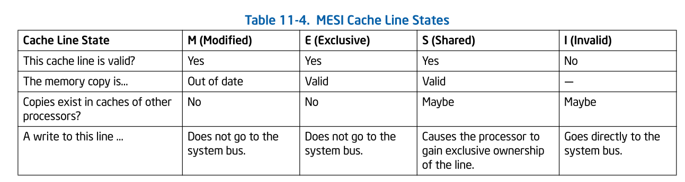
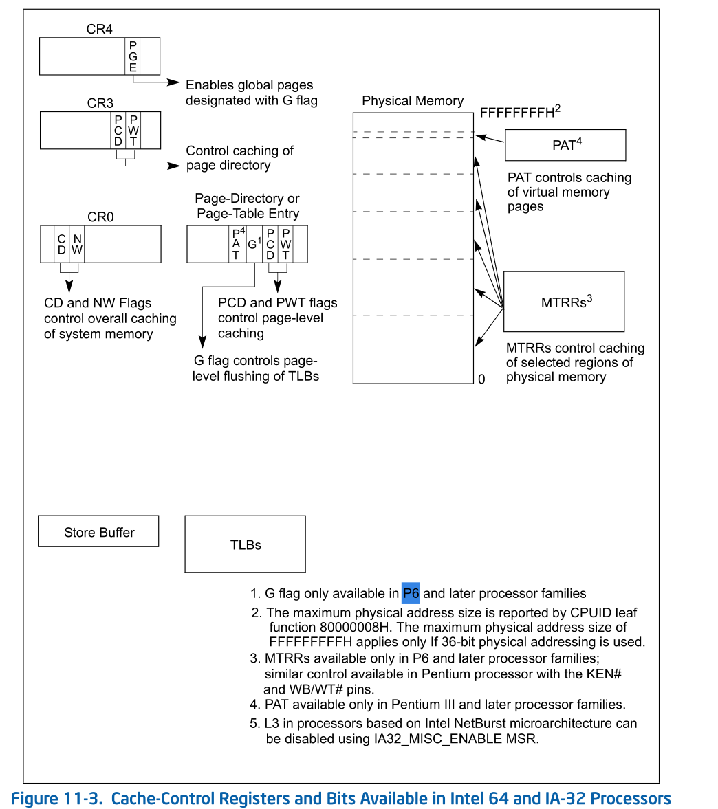
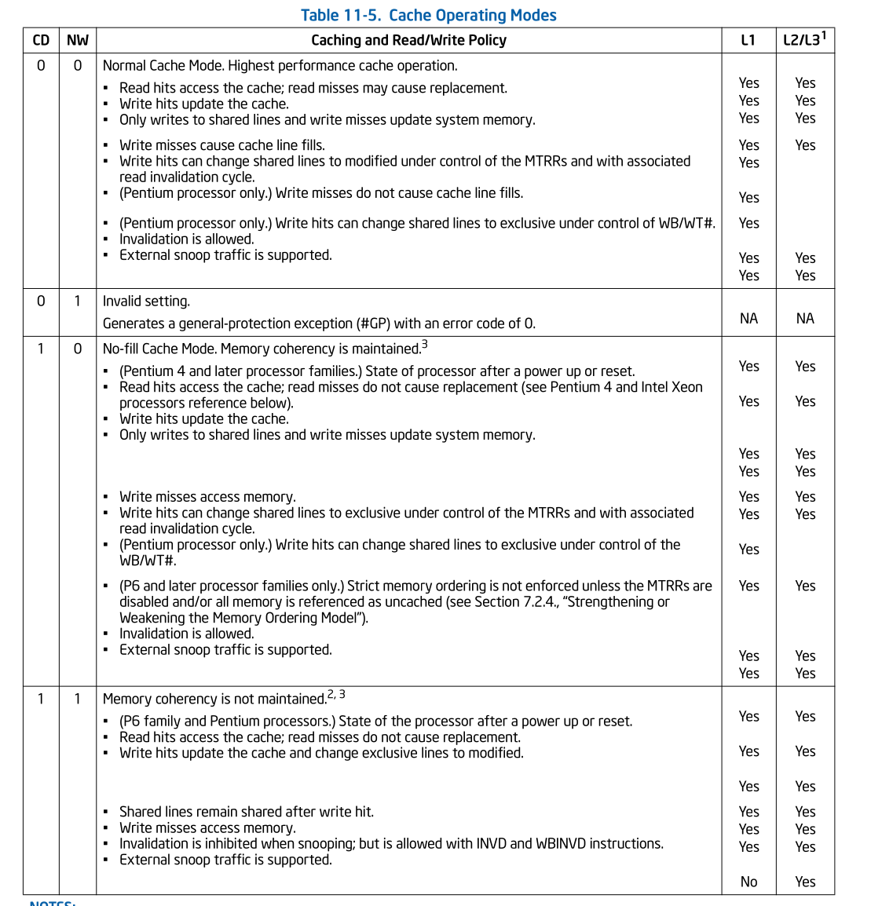
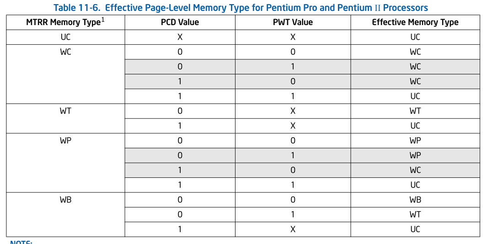
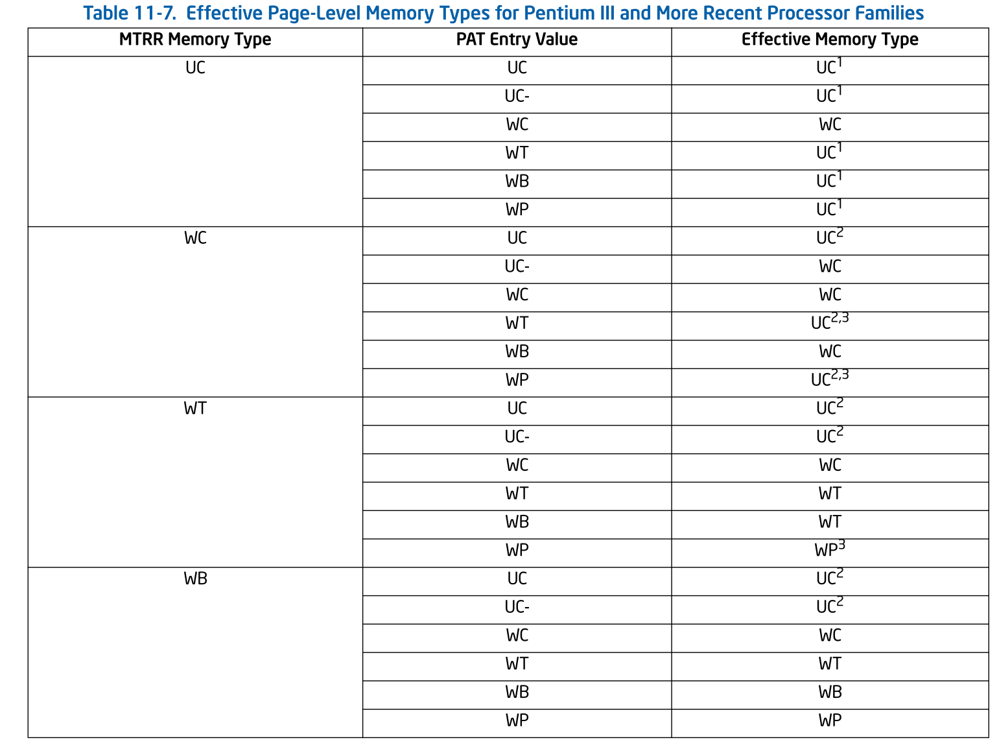
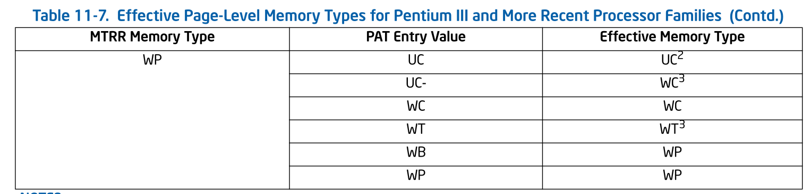

# MEMORY CACHE CONTROL
This chapter describes the memory cache and cache control 
mechanisms, the TLBs, and the store buffer in Intel 64 and 
IA-32 processors. It also describes the memory type range 
registers (MTRRs) introduced in the P6 family processors 
and how they are used to control caching of physical memory 
locations.

该章节描述了Intel 64  和 IA-32 处理器中的memory cache 和 
cache control机制， TLB和store buffer。也描述了P6 family processor
引进的memory type range register (MTRRs) 和他们如何用于控制physical
memory locations 的cache。

## 11.1 INTERNAL CACHES, TLBS, AND BUFFERS
The Intel 64 and IA-32 architectures support cache, translation
look aside buffers (TLBs), and a store buffer for temporary 
on-chip (and external) storage of instructions and data. 
(Figure 11-1 shows the arrangement of caches, TLBs, and the 
store buffer for the Pentium 4 and Intel Xeon processors.) 
Table 11-1 shows the characteristics of these caches and buffers
for the Pentium 4, Intel Xeon, P6 family, and Pentium processors.
The sizes and char- acteristics of these units are machine specific
and may change in future versions of the processor. The CPUID
instruction returns the sizes and characteristics of the caches and 
buffers for the processor on which the instruction is executed. See 
“CPUID—CPU Identification” in Chapter 3, “Instruction Set Reference, A-L,” 
of the Intel® 64 and IA-32 Architectures Software Developer’s Manual, 
Volume 2A. 

Intel 64 和IA-32 架构支持cache, translation look aside buffers(TLBs),
和为  临时 on-chip (和外部的) 指令和数据的storage 建立的 store buffer
(Figure 11-1展示了对于Pentium 4, Intel Xeon, P6 family, 和 Pentium 处理器
的这些caches和buffers的特征）。这些单units 的大小和特征是machine specific
并且在之后的处理器版本中可能会改变。CPUID instruction 返回了对于运行该指令
的处理器上的caches和buffers 的sizes和特征。请查看Chapter 3 中的"CPUID - 
CPU Identification”章节。

Figure 11-2 shows the cache arrangement of Intel Core i7 processor.

图片11-2 展示了Intel Core i7 处理器的cache 部署

Table 11-1. Characteristics of the Caches, TLBs, Store Buffer,
and Write Combining Buffer in Intel 64 and IA-32 Processors

TABLE 11-1 (略)

Intel 64 and IA-32 processors may implement four types of caches:
the trace cache, the level 1 (L1) cache, the level 2 (L2) cache,
and the level 3 (L3) cache. See Figure 11-1. Cache availability
is described below:

Intel 64 和 IA-32 处理器可以实现四种类型的caches: trace cache, level 
1 (L1) cache , level 2 (L2) cache和level 3 (L3) cache。 查看Figure 
11-1。Cache 可用性如下描述:

* Intel Core i7, i5, i3 processor family and Intel Xeon processor
family based on Nehalem microarchitecture and Westmere 
microarchitecture — The L1 cache is divided into two sections:
one section is dedicated to caching instructions (pre-decoded
instructions) and the other caches data. The L2 cache is a unified
data and instruction cache. Each processor core has its own L1 and L2.
The L3 cache is an inclusive, unified data and instruction cache,
shared by all processor cores inside a physical package. No trace
cache is implemented.
 

Intel Core i7, i5,i3 处理器 家族和基于 Nehalem microarchitecture 和
Westmere microarchitecture 的Intel Xeon 处理器家族:
 
L1 cache 被分成两个部分:
一部分是用于cache instructions(预解码指令) ，另一部分是caches data。
L2 cache 是一个不区分data 和 instructions 的cache。每个处理器核心
有自己的L1和L2 cache 。L3 cache 是一个 inclusive(包括全部的?) 不区分
data 和 instructions cache, 并且被 physical package 内部中所有的
处理器核心共享。No trace cache 在该架构中实现。

* Intel® Core™ 2 processor family and Intel® Xeon® processor 
family based on Intel® Core™ microarchitecture — The L1 cache
is divided into two sections: one section is dedicated to caching
instructions (pre- decoded instructions) and the other caches data.
The L2 cache is a unified data and instruction cache located on the 
processor chip; it is shared between two processor cores in a 
dual-core processor implementation. Quad-core processors have two
L2, each shared by two processor cores. No trace cache is implemented.
 

Intel(R) Core(TM) 处理器家族和 基于Intel(R) Core(TM) microarchitecture
的Intel (R) Xeon(R) 处理器家族:
 
L1 cache  被分为两部分: 一部分用于缓存指令(预解码指令)另一部分用于缓存
data。L2 cache 不区分data和 instruction cache , 这些cache 位于procoessor 
chip; 它在 dual-core 处理器实现中的两个 processor core 之间共享。Qual-core
处理器有两个L2, 每个在两个处理器中共享。没有trace cache 被实现。

* Intel Atom® processor — The L1 cache is divided into two sections:
one section is dedicated to caching instructions (pre-decoded 
instructions) and the other caches data. The L2 cache is a 
unified data and instruction cache is located on the processor 
chip. No trace cache is implemented.
 

Intel Atom(R) procssor:
L1 cache 被分为两部分: 一部分用于缓存指令(预解码指令), 另一部分用于缓存
data. L2 cache不区分data和指令，并且cache位于processor chip上。
没有trace cache 的实现。
 

* Intel® Core™ Solo and Intel® Core™ Duo processors — The L1 
cache is divided into two sections: one section is dedicated
to caching instructions (pre-decoded instructions) and the other
caches data. The L2 cache is a unified data and instruction 
cache located on the processor chip. It is shared between two
processor cores in a dual-core processor implementation. No 
trace cache is implemented.
 

Intel® Core™ Solo and Intel® Core™ Duo processors :
 
L1 cache 被分为两部分: 一部分用于缓存指令(预解码指令)另一部分
用于缓存数据。L2 cache 不区分data 和 instruction cache, 
并且位于processor chip。它在两个 dual-core processor 实现
的处理器核心之间共享。没有trace cache 的实现。

* Pentium® 4 and Intel® Xeon® processors Based on Intel 
NetBurst® microarchitecture — The trace cache caches decoded 
instructions (μops) from the instruction decoder and the L1 
cache contains data. The L2 and L3 caches are unified data and
instruction caches located on the processor chip.Dualcore
processors have two L2, one in each processor core. Note that 
the L3 cache is only implemented on some Intel Xeon processors.

* P6 family processors — The L1 cache is divided into two sections:
one dedicated to caching instructions (pre- decoded instructions)
and the other to caching data. The L2 cache is a unified data and
instruction cache located on the processor chip. P6 family 
processors do not implement a trace cache.

* Pentium® processors — The L1 cache has the same structure as
on P6 family processors. There is no trace cache. The L2 cache
is a unified data and instruction cache external to the processor
chip on earlier Pentium processors and implemented on the processor
chip in later Pentium processors. For Pentium processors where
the L2 cache is external to the processor, access to the cache
is through the system bus. 

For Intel Core i7 processors and  processors based on Intel Core, 
Intel Atom, and Intel NetBurst microarchitectures, Intel Core
Duo, Intel Core Solo and Pentium M processors, the cache lines
for the L1 and L2 caches (and L3 caches if supported) are 64 
bytes wide. The processor always  reads a cache line from system
memory beginning on a 64- byte **boundary.**1 (A 64-byte 
aligned cache line begins at an  address  with its 6 least- 
**significant**2 bits clear.) A cache line  can be 
filled from memory with a **8-transfer burst** 3transaction. The 
caches do not support partially-filled cache lines, so caching
even a single doubleword requires caching an entire line.
 

1. boundary: 界限分界线。这里指的是对齐的字节
2. significant : 有意义的; least-significant ，这里指的是最低的有效位
3. transfer: 转让调动，一次完整的DMA数据传输称为transfer, 可以包含多个
burst, burst数量被称为transfer数量

burst: 突发, DMA传输中的最小单元
 
所以，这里应该指的是，一次从memory -> cacheline的transfer ,中有8个burst.
也就是8个bype数据(64 byte)。每个byte代表一个burst(以地址为单位)

The L1 and L2 cache lines in the P6 family and Pentium processors
are 32 bytes wide, with cache line reads from system memory 
beginning on a 32-byte boundary (5 least-significant bits of 
a memory address clear.) A cache line can be filled from memory
with a 4-transfer burst transaction. Partially-filled cache 
lines are not supported. The trace cache in processors based 
on Intel NetBurst microarchitecture is available in all 
execution modes: protected mode, system management mode (SMM),
and real-address mode. The L1,L2, and L3 caches are also available
in all execution modes; however, use of them must be handled 
carefully in SMM (see Section 31.4.2, “SMRAM Caching”).

The TLBs store the most recently used page-directory and page-table
entries. They speed up memory accesses when paging is enabled by
reducing the number of memory accesses that are required to read
the page tables stored in system memory. The TLBs are divided into
four groups: instruction TLBs for 4-KByte pages, data TLBs for
4-KByte pages; instruction TLBs for large pages (2-MByte, 4-MByte
or 1-GByte pages), and data TLBs for large pages. The TLBs are
normally active only in protected mode with paging enabled. When
paging is disabled or the processor is in real-address mode, 
the TLBs maintain their **contents**1 until 
**explicitly**2 or **implicitly**3
flushed (see Section 11.9, “Invalidating the Translation 
Lookaside Buffers (TLBs)”).

四种TLB: 
<ul>
	<li>instruction TLB for 4-KByte page</li>
	<li>data TLB for 4-KByte page</li>
	<li>instruction TLB for large page</li>
	<li>data TLB for large page</li>
</ul>

1. content: 内容 
2. explicitly: 明确而详细的 
3. implicitly: 含蓄的，不直接表明的 

这里指的是当paging 改变为disabled的状态，或者处理器正处于
real-address模式，TLBs 将会继续维护这些内容，直到被明确（直接）
或者间接的flush

Processors based on Intel Core microarchitectures implement one
level of instruction TLB and two levels of data TLB. Intel Core
i7 processor provides a second-level unified TLB. The store 
buffer is associated with the processors instruction execution
units. It allows writes to system memory and/or the internal 
caches to be saved and in some cases combined to optimize the
processor’s bus accesses. The store buffer is always enabled 
in all execution modes.

store buffer 和处理器 指令执行单元联系起来。它允许将写入系统内存和
internal caches的数据存储下来，在某些情况下组合起来去优化processor's
bus 访问。在所有的执行模式中，strore buffer 总是 enabled

The processor’s caches are for the **most part**1 transparent to 
software. When enabled, instructions and data **flow through** 2
these caches without the need for explicit software control. 
However, knowledge of the behavior of these caches may be 
useful in optimizing software performance. For example, 
knowledge of cache dimensions3 and replacement
4 algorithms gives an indication of how large of 
a data structure can be operated on at once without causing 
cache thrashing5.

1. most part: 很大程度上;大部分  
2. 流经; 流过;   
3. 量度, 维度  
4. 替换  
5. 激烈的运动，移动

这些cache 维度和替换算法的知识可以表明一次操作多大的数据而不会导致
缓存抖动

In multiprocessor systems, maintenance of cache consistency may,
**in rare circumstances**1, require intervention2 by system software.
For these rare cases, the processor provides privileged cache
control instructions for use in flushing caches and forcing 
**memory ordering**3.

1.  rare: 极少数 circumstances: 环境，情形，情况   
in rare circumstances: 在极少数的情况下 
2. 介入
3. 内存访问排序 这里指的是一些内存屏障指令

There are several instructions that software can use to improve
the performance of the L1, L2, and L3 caches, including the 
PREFETCHh, CLFLUSH, and CLFLUSHOPT instructions and the **non-temporal**1
move instructions (MOVNTI, MOVNTQ, MOVNTDQ, MOVNTPS, and MOVNTPD).
The use of these instructions are discussed in Section 11.5.5,
“Cache Management Instructions.” 

1. !!!!!

## 11.2 CACHING TERMINOLOGY
IA-32 processors (beginning with the Pentium processor) and 
Intel 64 processors use the MESI (modified, exclu- sive, 
shared, invalid) cache protocol to maintain consistency with 
internal caches and caches in other processors (see Section 
11.4, “Cache Control Protocol”). 

When the processor recognizes that an operand1 
being read  from memory is cacheable, the  processor 
reads an entire  cache line into the appropriate  cache 
(L1, L2, L3, or all).  This operation is called a cache 
line fill. If the memory location containing that operand is 
still cached the next time the processor attempts to access 
the operand, the processor can read the operand from the cache
instead of going back to memory. This operation is called a 
cache hit.

1. operand: 操作数

cache line fill: 如果processor识别到 内存中读取的操作数是可缓存
,该操作被称为cache line fill
的，processor 读取整个的cache line 到合适的cache 中(L1,L2,L3 or all)

cache hit: 如果memory location 包含的操作数已经缓存了，下次处理器尝试
去访问这个操作数，处理器可以从cache 中读取该操作数，而不是回到内存中
读取。该操作被称为 a cache hit。

When the processor attempts to write an operand to a cacheable
area of memory, it first checks if a cache line for that memory
location exists in the cache. If a valid cache line does exist,
the processor (depending on the write policy1 currently **in force**2)
can write the operand into the cache instead of writing it out
to system memory. This operation is called a **write hit**. If a 
write misses the cache (that is, a valid cache line is not 
present for area of memory being written to), the processor 
performs a cache line fill, write allocation. Then it writes 
the operand into the cache line and (depending on the write 
policy currently in force) can also write it out to memory. 
If the operand is to be written out to memory, it is written 
first into the store buffer, and then written from the store 
buffer to memory when the system bus is available. (Note that
for the Pentium processor, write misses do not result in a cache
line fill; they always result in a write to memory. For this 
processor, only read misses result in cache line fills.)

1. policy: 策略 
2. in force : 实施中的，现行的 

当write 操作缓存miss, 处理器会执行一个cache line fill的操作。然后
write 这个操作数到 cachline 并且（根据当前的写入策略) 回写到内存。
如果操作数要回写到内存，现将其写入store buffer, 然后等system bus is available
时， 将store buffer 中的数据写入memory

在奔腾处理器中，write misses 不会导致 cache line fill; 他们
总是会写入到内存中。对于这些处理器，只有read misses会导致 cache line fill

When operating in an MP system, IA-32 processors (beginning 
with the Intel486 processor) and Intel 64 processors have the
ability to snoop other processor’s accesses to system memory 
and to their internal caches. They use this snooping ability 
to keep their internal caches consistent both with system memory
and with the caches in other processors on the bus. For example,
in the Pentium and P6 family processors, if through snooping 
one processor detects1 that another processor intends2 to write
to a memory location that it currently has cached in shared 
state, the snooping processor will invalidate its cache line 
forcing it to perform a cache line fill the next time it 
accesses the same memory location.

1. detect : 发现察觉 
2. intend: 打算

这里提到的某些处理器可能会有一定的snoop 行为。这个snoop 行为会使得
自己的internal cache 和system memory 以及其他cpu core 的 internal cache
有一些通信行为。 如果另一个处理器修改了 本处理器中cache 数据，
本处理器会snoop 到， 并且 invalidate internal cache line . 如果下
次要访问这块内存的话，需要去执行一个 cache line  fill 的操作.

Beginning with the P6 family processors, if a processor detects1
(through snooping) that another processor is trying to access
a memory location that it has modified in its cache, but has 
not yet written back to system memory, the snooping processor
will signal the other processor (**by means of**2 the HITM# signal)
that the cache line is held in modified state and will perform
an implicit write-back of the modified data. The implicit 
write-back is transferred directly to the initial requesting 
processor and snooped by the memory controller to assure that
system memory has been updated. Here, the processor with the 
valid data may pass the data to the other processors without 
actually writing it to system memory; however, it is the 
responsibility of the memory controller to snoop this operation
and update memory. 

1. detect : 发现察觉 
2. be means of: 通过

这里讲的是如果有个处理器发现(通过snoop)另一个处理器尝试访问一个内存，
但是该内存在本处理器的缓存中已经修改了, 但是还没有写回到
系统内存中， snoop processor 会向其他的处理器发送一个信号(通过HITM#信号),
该信号表示该cache line 已经处于修改的状态，并且将会执行一个隐式
的modify data 的 write-back操作。该 隐式write-back 会直接传输到
发起request 的 processor 被嗯切被memory controller snoop 到，用于
保证系统内存已经更新。这里带有合法data的(正确的)processor  可能将输出直接
传输到其他的处理器，在数据实际没有写入系统内存的情况下;
但是, memory controller 负责 snoop 该行为并且更新内存。

## 11.3 METHODS OF CACHING AVAILABLE
The processor allows any area of system memory to be cached in
the L1, L2, and L3 caches. In individual pages or regions of 
system memory, it allows the type of caching (also called memory
type) to be specified (see Section 11.5). Memory types currently
defined for the Intel 64 and IA-32 architectures are (see Table
11-2):

这里将的memory type 实际上指 独立的内存页或者内存区间的 cache type.

* Strong Uncacheable (UC) —System memory locations are not 
cached. All reads and writes appear on the system bus and are
executed in program order without reordering. No speculative1
memory accesses, page-table walks, or prefetches of speculated
branch targets are made. This type of cache-control is useful
for memory-mapped I/O devices. When used with normal RAM, it 
greatly reduces processor performance.

1. speculative: 投机的; 推测出的

UC： 有以下几个特点： 
1. 对system memory 访问不会触发cache   
2. 任何读写访问不会被重新排序  
3. 没有投机内存访问，page-table walks, 以及预取推测的分支目标

* Uncacheable (UC-) — Has same characteristics as the strong 
uncacheable (UC) memory type, except that this memory type can
be overridden by programming the MTRRs for the WC memory type.
This memory type is available in processor families starting 
from the Pentium III processors and can only be selected 
through the PAT.

基本于UC相同，除了 该memory type 可以通过编程MTRRs 值覆盖 成WC 
memory type.

* Write Combining (WC) — System memory locations are not cached
(as with uncacheable memory) and coherency is not enforced强制 by
the processor’s bus coherency protocol. Speculative reads are
allowed. Writes may be delayed and combined组合;结合;合并 in the write 
combining buffer (WC buffer) to reduce memory accesses. 
If the WC buffer is partially filled, the writes may be delayed
until the next occurrence事件，事情 of a serializing序列化 event; such as an 
SFENCE or MFENCE instruction, CPUID or other serializing instruction,
a read or write to uncached memory, an interrupt occurrence, 
or an execution of a LOCK instruction (including one with an 
XACQUIRE or XRELEASE prefix). In addition, an execution of the
XEND instruction (to end a transactional region) evicts逐出，赶出 any 
writes that were buffered before the corresponding execution 
of the XBEGIN instruction (to begin the transactional region)
before evicting any writes that were performed inside the 
transactional region. This type of cache-control is appropriate
for video frame buffers, where the order of writes is unimportant
as long as the writes update memory so they can be seen on the
graphics display. See Section 11.3.1, “Buffering of Write 
Combining Memory Locations,” for more information about caching
the WC memory type. This memory type is available in the Pentium
Pro and Pentium II processors by programming the MTRRs; or in
processor families starting from the Pentium III processors by
programming the MTRRs or by selecting it through the PAT.

1. enforced: 强制 
2. 组合;结合
  
Write Combining (WC)有以下特点: 
1. not cached (uncacheable memory) 
2. 允许投机读取 
3. 写操作将会被delayed 并且 combined(合并)在write combining buffer(WC buffer)
来减少 memory access 
4. 如果WC buffer 被部分填充，writes操作将会delay, 知道发生了一些事件,例如 一些序列化指令，read or write to uncached memory , interrupt事件。
... 
5. 某些寄存器可以通过 MTRRs 编程或者通过PAT 选择 enable 该memory type

(Note:  Speculative read是指读之前并不验证内存的有效性，先冒险的读进来，
如果发现不是有效数据再取消读取操作，并更新内存后再读取. 比如说数据还是被
buffer在WC buffer中)
 
来自: https://blog.csdn.net/chen1540524015/article/details/74219375

* Write-through (WT) — Writes and reads to and from system 
memory are cached. Reads come from cache lines on cache hits;
read misses cause cache fills. Speculative reads are allowed.
All writes are written to a cache line (when possible) and 
through to system memory. When writing through to memory, invalid
cache lines are never filled, and valid cache lines are either
filled or invalidated. Write combining is allowed. This type of
cache-control is appropriate for frame buffers or when there 
are devices on the system bus that access system memory, but 
do not perform snooping of memory accesses. It enforces coherency
between caches in the processors and system memory. 

Write-through (WT) : 
<ol>
<li>Write to 和 read from memory 会被cache.</li>
<li>read 会在cache hits 情况下从cache line 获取,在miss情况下
会造成cache fills</li>
<li> 允许 speculative read
<li> 所有的写操作会写入到一个cache line(如果可能的话）并且会写入system
memory.</li>
<li> 当写向内存时，无效的cache line 不会被filled, 有效的cache line 
可能会被fill, 或者被 无效(这里应该指的是other processor cpu)</li>
<li>  此类行的cache 使用于frame buffer 或者systemd bus 上的devices 
访问系统 内存</li>

<li> 不能执行snoop memory access.(???)</li>

<li> 会在processor cache 和 system memory 强制保持一致性.</li>
</ol>

* Write-back (WB) — Writes and reads to and from system memory
are cached. Reads come from cache lines on cache hits; read 
misses cause cache fills. Speculative reads are allowed. Write
misses cause cache line fills (in processor families starting
with the P6 family processors), and writes are performed entirely
in the cache, when possible. Write combining is allowed. The 
write-back memory type reduces bus traffic by eliminating清除 many
unnecessary writes to system memory. Writes to a cache line are
not immediately forwarded to system memory; instead, they are
accumulated积累 in the cache. The modified cache lines are written
to system memory later, when a write-back operation is performed.
Write-back operations are triggered when cache lines need to 
be deallocated解除分配;释放, such as when new cache lines are being allocated 
in a cache that is already full. They also are triggered by the
mechanisms used to maintain cache consistency. This type of 
cache-control provides the best performance, but it requires 
that all devices that access system memory on the system bus 
be able to snoop memory accesses to ensure system memory and 
cache coherency.

同上1,2,3
<ol>
	<li>
	write操作将会导致cache line fill , 并且写操作将会全部在cache中进行。
	</li>
	<li>Write combining 将被允许</li>
	<li>
	write-back memory type 减少了bu通信，通过避免了许多不必要的写入内存操作。
	</li>
	<li>
	写入cache line 后，不会立即写入system memory， 相反的，他们会在
	cache 中积累。
	</li>
	<li>
	Write-back 操作将会在cache line 需要被释放的情况下触发.cache line
	需要释放的情形有: 分配new cache line 但是cache 已经满了;另外还可能
	由于 保持cache一致性出发。
	</li>
	<li>
	此种cache 类型提供了最好的性能，但是需要所有系统总线上的访问系统
	内存的设备可以 snoop memory access来确保系统内存和cache 的一致性
	</li>
</ol>

* Write protected (WP) — Reads come from cache lines when 
possible, and read misses cause cache fills. Writes are propagated 传播，传送，传导
to the system bus and cause corresponding相一致;相应的;对应的 cache lines on all 
processors on the bus to be invalidated. Speculative reads are
allowed. This memory type is available in processor families 
starting from the P6 family processors by programming the MTRRs 
(see Table 11-6).

Table 11-3 shows which of these caching methods are available
in the Pentium, P6 Family, Pentium 4, and Intel Xeon processors. 

<ol>
	<li>读操作来自于cache line ,如果read miss 导致 cache line fill</li>
	<li>
	写操作将会传播到系统总线上，并且造成所有处理器上的相应的cache line 都被
	invalidated
	</li>
	<li>
	允许 Speculative read.
	</li>
</ol>

### 11.3.1 Buffering of Write Combining Memory Locations
Writes to the WC memory type are not cached in the typical
sense语义 of the word cached. They are retained in an internal 
write combining buffer (WC buffer) that is separate分离，分开 from 
the internal L1, L2, and L3 caches and the store buffer. 
The WC buffer is not snooped and thus does not provide data 
coherency. Buffering of writes to WC memory is done to allow 
software a small window of time to supply(supply to)向...提供... more modified data 
to the WC buffer while remaining as non-intrusive入侵,侵入 to software
as possible. The buffering of writes to WC memory also causes
data to be collapsed倒塌,坍塌;崩溃; that is, multiple writes to the same memory
location will leave the last data written in the location and
the other writes will be lost.

Write to WC memory type 不会按照传统语义的缓存 进行缓存（可能缓存
但是缓存的含义和传统含义不一样）。它保留在一个内部的write combining buffer
(WC buffer), 该buffer 和内部的L1, L2 ,以及L3 caches 和store buffer是分开的。
WC buffer不支持snoop因此不提供数据一致性。写入WC buffer的缓冲是为了让软件
有一小段时间窗口用于提供更多的 modified data 给WC buffer，并且尽量向软件保持
no-instrusive。写入WC memory的缓冲也早造成了数据 collapsed. 这指的是，
对同一个内存 location 进行多个write操作将留下最后的 data written 到location中
并且其他的写入将会丢失。

The size and structure of the WC buffer is not architecturally
defined. For the Intel Core 2 Duo, Intel Atom, Intel Core Duo,
Pentium M, Pentium 4 and Intel Xeon processors; the WC buffer
is made up of several 64-byte WC buffers. For the P6 family 
processors, the WC buffer is made up of several 32-byte WC buffers.

WC buffer 的size和structure 不是 architecturally defined.

When software begins writing to WC memory, the processor begins
filling the WC buffers one at a time. When one or more WC buffers
has been filled, the processor has the option of evicting the 
buffers to system memory. The protocol for evicting the WC buffers
is implementation dependent and should not be relied on by 
software for system memory coherency. When using the WC memory
type, software must be sensitive需要秘密或慎重处理的 to the fact that the writing 
of data to system memory is being delayed and must
deliberately有意的，故意的
empty the WC buffers when system memory coherency is required.

当软件开始写入WC memory时， processor 开始一次 fill 一个WC buffer。
当一个或者多个 WC buffer 已经fill时， processor 可以选择将 buffer 
evict 到  system memory。对于 evict WC buffer 的协议是 implementation
dependent 并且对于system memory coherency不应该依赖软件. 当使用WC memory
type 时， software 必须慎重考虑 写入数据到系统内存的延迟的这个事实
并且当系统内存一致性需要时，有意的清空WC buffer 

Once the processor has started to evict data from the WC buffer
into system memory, it will make a bus-transaction style 
decision决心，决定，决策 based on how much of the buffer contains valid data. 
If the buffer is full (for example, all bytes are valid), the
processor will execute a burst-write transaction on the bus. 
This results in all 32 bytes (P6 family proces- sors) or 64 
bytes (Pentium 4 and more recent processor) being transmitted
on the data bus in a single burst transaction. If one or more
of the WC buffer’s bytes are invalid (for example, have not 
been written by software), the processor will transmit the data
to memory using “partial write” transactions (one chunk at a 
time, where a “chunk” is 8 bytes).

一旦处理器开始 从WC buffer 中evict data 到system memory。
它将会根据buffer中包含了多少 valid data 作出 bus-transaction 
style(样式) 决策。(也就是说不同数量的valid data 产生的bus-transaction
不同). 如果buffer 是满的(例如所有的字节都是 valid), 处理器将会
向总线上发出一个burst-write transaction。这将导致整个32 bytes 
或者64 bytes数据存放在一个单独的burst transaction 传送到 data bus上。
如果WC buffer的一个或多个字节是 invalid(例如, 还没有被软件写入), 
处理器将会将数据以"partial write" transaction的方式传送到 memory。
（一次传送一个chunk ,每个chunk 是8 bytes)

This will result in a maximum of 4 partial write transactions
(for P6 family processors) or 8 partial write transactions 
(for the Pentium 4 and more recent processors) for one WC 
buffer of data sent to memory.

这将会导致对于一个WC buffer 数据发送到memory 的最大值 是4 partial write
transactions或者 8 partial write translation.

The WC memory type is weakly ordered by definition. Once the 
eviction of a WC buffer has started, the data **is subject to**受...支配，受... 影响
the weak ordering semantics of its definition. Ordering is not
maintained between the successive连续的 allocation/deallocation of
WC buffers (for example, writes to WC buffer 1 followed by 
writes to WC buffer 2 may appear as buffer 2 followed by buffer
1 on the system bus). When a WC buffer is evicted to memory as
partial writes there is no guaranteed ordering between 
successive partial writes (for example, a partial write for 
chunk 2 may appear on the bus before the partial write for 
chunk 1 or **vice versa**反之亦然).

WC memory type 根据定义是弱排序的。一旦WC buffer eviction 操作开始 ,
data 收其定义的弱排序语义的影响。在WC buffers 连续的allocation/deallocation
不再保持顺序(例如，在写入WC buffer 2 后写入 WC buffer 1 可能会在总线上
呈现为在buffer 1 后面是 buffer 2。 当WC buffer 以partial write
的方式evict 到 memory , 不保障连续的 partial write 顺序（例如, 对于
chunk 1 的 partial write 可能会在 对于chunk 2 的partial write 之前出现在
bus上, 反之亦然。

The only elements of WC propagation繁殖;增殖;传播 to the system bus that are
guaranteed are those provided by transaction atomicity. For 
example, with a P6 family processor, a completely full WC buffer
will always be propagated as a single 32-bit burst transaction
using any chunk order. In a WC buffer eviction where data will
be evicted as partials, all data contained in the same chunk 
(0 mod 8 aligned) will be propagated simultaneously同时. Likewise同样的,
for more recent processors starting with those based on Intel
NetBurst microarchitectures, a full WC buffer will always be 
propagated as a single burst transactions, using any chunk 
order within a transaction. For partial buffer propagations,
all data contained in the same chunk will be propagated 
simultaneously. 

WC 传播到 system bus 保障的唯一原则是 提供 transaction atomicity.
例如，对于P6 family processor, 一个 完整的full WC buffer 总是会
以一个单独的, 使用任何顺序的chunk的32-bit burst transaction传播.
在WC buffer eviction 中，数据是 以partial evict ，所有的在相同chunk 中的
数据被同时传播. 对于更多近期的processor (从基于
NetBurst microarchitecture 开始), 一个full WC buffer 会以一个单独的
burst transaction 传播，并且在该transaction中 使用任意顺序的chunk。
对于 partial buffer 传播，在相同chunk中的所有的数据被同时传播。

### 11.3.2 Choosing a Memory Type
The simplest system memory model does not use memory-mapped 
I/O with read or write **side effects**负面影响, does not include a 
frame buffer, and uses the write-back memory type for all 
memory. An I/O agent can perform direct memory access (DMA) 
to write-back memory and the cache protocol maintains cache 
coherency.

最简单的system memory 模型 不使用带有read or write 负面影响的
memory-mapped I/O, 不包括 frame buffer, 并且为所有的内存使用
write-back memory type。I/O agent 可以执行 DMA 到 write-back
memory 并且 cache protocol 会维持cache的一致性。

A system can use strong uncacheable memory for other memory-mapped I/O,
and should always use strong uncacheable memory for memory-mapped
I/O with read side effects.

系统可以为其他的memory-mapped I/O 使用 strong uncacheable memory, 并且
对于带有 read副作用的memory-mapped I/O 总是使用strong uncacheable memory.

Dual-ported memory can be considered a write side effect, making 
relatively相对的 prompt准时的;及时的 writes 
desirable可取的，值得拥有的, because those writes cannot 
be observed at the other port until they reach the memory agent.
A system can use strong uncacheable, uncacheable, write-through, 
or write-combining memory for frame buffers or dual-ported memory 
that contains pixel values displayed on a screen. Frame buffer 
memory is typically large (a few megabytes) and is usually written
more than it is read by the processor. Using strong uncacheable
memory for a frame buffer generates产生 very large amounts of bus
traffic, because operations on the entire buffer are implemented
using partial writes rather than line writes. Using write-through
memory for a frame buffer can displace almost all other useful
cached lines in the processor's L2 and L3 caches and L1 data cache.
Therefore, systems should use write-combining memory for frame
buffers whenever possible.

Dual-port memory 可以认为是一个 write 副作用的内存，使得写操作
变得相对迅速, 因为这些写操作不能在其他的port 上被发现，直到
他们到达memory agent。system 可以为包含了screen上display的像素值的
或者 dual-ported memory或者frame buffer 使用strong uncacheable, 
uncacheable， write-though, 或者write-combining memory. Frame buffer
memory 很大（几兆B字节) 并且通常写比处理器进行的读操作多些。为frame 
buffer 使用 strong uncacheable 内存会产生大量的bus traffic,
因为对整个buffer 的操作是使用部分写入而不是行写入来实现的。为frame 
buffer使用 write-through memory 会提到处理器L2,L3 cache和L1 data cache
中的其他有用的cache line 。因此, 系统在任何可能的时候都应该为 
frame buffer 使用 write-combining memory。

Software can use page-level cache control, to assign appropriate
effective memory types when software will not access data structures
**in ways that**以某种方式 benefit from write-back caching. For example, software
may read a large data structure once and not access the structure
again until the structure is rewritten by another agent. Such a
large data structure should be marked as uncacheable, or reading
it will evict cached lines that the processor will be referencing
again.

当software 访问这些 data structure时，不会在从write-back cache中受益，
软件可以使用page-level cache 控制, 来分配合适有效的memory type。
例如software 可能一次性的读取一个大的数据结构并且直到另一个agent
重写这个数据结构之前都不会再去访问。像这样如此大的数据结构
应该被标记为 uncacheable, 否则读取它将 evict 处理器将再次引用
的缓存行。

A similar example would be a write-only data structure that 
is written to (to export the data to another agent), but never
read by software. Such a structure can be marked as uncacheable,
because software never reads the values that it writes (though
as uncacheable memory, it will be written using partial writes,
while as write-back memory, it will be written using line writes,
which may not occur until the other agent reads the structure 
and triggers implicit write-backs).

一个相似的例子为 write-only data structure, 该数据结构回写入，
但是不会被软件读。这样的数据结构可以被标记为不可缓存，因为软件
从不会读其写入的值(虽然作为不可缓存的内存，它将使用部分写入来写入，
而作为回写内存，它将使用行写入来写入，直到其他代理读取结构并触发隐式
write-backs，才可能发生该操作(回写))

On the Pentium III, Pentium 4, and more recent processors, new
instructions are provided that give software greater control 
over the caching, prefetching, and the write-back characteristics
of data. These instructions allow software to use weakly ordered
or processor ordered memory types to improve processor performance,
but when necessary to force strong ordering on memory reads and/or
writes. They also allow software greater control over the caching
of data. For a description of these instructions and there intended打算
use, see Section 11.5.5, “Cache Management Instructions.” 

在奔腾 3, 4 和最近更多的处理器，提供了更多的新的指令，用于给软件更好
的控制 caching, prefetching 和回写特性。这些指令允许软件使用弱排序
或者processor ordered memory type 来提升处理器性能，但在必要时强制
对内存写入和读取进行强排序。他们也允许软件更好的对 数据的缓存进行更好的
控制。关于这些指令和预期用途的描述，请参照 11.5.5 “Cache Management
Instructions"

### 11.3.3 Code Fetches in Uncacheable Memory
Programs may execute code from uncacheable (UC) memory, but the
implications are different from accessing data in UC memory. 
When doing code fetches, the processor never transitions from 
cacheable code to UC code speculatively. It also never 
speculatively fetches branch targets that result in UC code.

程序从 uncacheable(UC) 内存中 执行代码，但是 含义不同于访问UC 
memory 中的data。 当执行 code fetch 时，处理器不会推测性的从
cacheable code 转换成 UC code。它也不会推测性的获取获取UC
代码的分支目标（现在有两个分支，一个分支是UC code , 他不会去
预取该分支)

The processor may fetch the same UC cache line multiple times 
in order to decode an instruction once. It may decode consecutive连续的
UC instructions in a cacheline without fetching between each 
instruction. It may also fetch additional cachelines from the
same or a consecutive 4-KByte page in order to decode one 
non-speculative UC instruction (this can be true even when the
instruction is contained fully in one line).

处理器可以多次获取相同的 UC 高速缓存行，以便对指令一次完成解码。(?????)
它可以在高速缓存行中解码连续的 UC 指令，而无需在每条指令之
间进行fetch。 它还可以从相同或连续的 4 KB 页中获取额外的cache line
, 以解码一条非推测 UC 指令(即使指令完全包含在一个缓存行中，这也是
正确的)(?????)

Because of the above and because cacheline sizes may change in
future processors, software should avoid placing memory-mapped
I/O with read side effects in the same page or in a subsequent后来的随后的
page used to execute UC code. 

因为上面的描述和cache line size 可能在未来的处理器中会改变, 软件
应该避免将具有读副作用的memory-mapped I/O 放置到相同的页面
或者后续的页面中。
 
??????

## 11.4 CACHE CONTROL PROTOCOL

The following section describes the cache control protocol 
currently defined for the Intel 64 and IA-32 architectures.

接下来的章节描述了当前 Intel 64 和IA-32 架构定义的 cache control
protocol

In the L1 data cache and in the L2/L3 unified caches, the MESI
(modified, exclusive, shared, invalid) cache protocol maintains
consistency with caches of other processors. The L1 data cache
and the L2/L3 unified caches have two MESI status flags per 
cache line. Each line can be marked as being in one of the 
states defined in Table 11-4. In general, the operation of the
MESI protocol is transparent to programs. 

在L1 data cache 和 在L2/L3 无差别cache中（不区分data/instruction cache),
MESI cache 协议保持了和其他处理器中的cache的一致性。L1 data cache
和L2/L3 无差别cache 每个cache line  有两个MESI status flags, 每个cache line 
可以被编辑为 Table 11-4 中的某一个status。一般来说，MESI协议对
程序(对软件层)是透明的。

The L1 instruction cache in P6 family processors implements 
only the “SI” part of the MESI protocol, because the
instruction cache is not writable. The instruction cache 
monitors changes in the data cache to maintain consistency
between the caches when instructions are modified. See Section
11.6, “Self-Modifying Code,” for more information
on the implications of caching instructions.

P6 family processor 中的 L1 instruction cache 只实现了MESI协议
中的”SI“部分，因为 instruction cache 是不可写的。instruction
cache 监视器在instruction 改变的的时候，去 改变 data cache 
来维护两个cache 之间的一致性。更多cache instruction 的实现的
相关信息请查看 "11.6" Self-Modifying Code。

## 11.5 CACHE CONTROL
The Intel 64 and IA-32 architectures provide a variety多样的 of 
mechanisms for controlling the caching of data and instructions
and for controlling the ordering of reads and writes between 
the processor, the caches, and memory. These mechanisms can be
divided into two groups:

Intel 64和IA-32 架构提供了多样的机制用于控制数据和指令缓存并且用于
控制处理器, 缓存和内存之间的读取和写入顺序。这些机制可以分为两组:

* Cache control registers and bits — The Intel 64 and IA-32 
 architectures define several dedicated专用的 
 registers and various各种, 各个
 bits within control registers and page- and directory-table 
 entries that control the caching system memory locations in 
 the L1, L2, and L3 caches. These mechanisms control the 
 caching of virtual memory pages and of regions of physical 
 memory.
 

Cache control register and bit : 
Intel 64 和IA-32 架构定义了一些专用的寄存器和control register
和 page directory-table entries 中的多个控制 在L1,L2,L3 cache
的缓存system memory location 的 各个bits。这些机制控制 virtual
memory pages 和physical memory region 的缓存行为。

* Cache control and memory ordering instructions — The Intel 
 64 and IA-32 architectures provide several instructions 
 that control the caching of data, the ordering of memory 
 reads and writes, and the prefetching of data. These 
 instructions allow software to control the caching of specific
 data structures, to control memory coherency for specific 
 locations in memory, and to force strong memory ordering at 
 specific locations in a program.
 

Cache control and memory ordering **instruction**:
intel 64 和 IA-32 架构提供了一些用于控制 缓存数据，内存读写顺序，
数据预取行为的指令。这些指令允许软件控制特定数据结构，内存中
特定位置的内存一致性，以及强制 在程序中的特定位置memory 
强排序ordering 。
 

The following sections describe these two groups of cache 
control mechanisms.

接下来的章节描述缓存控制的这两种机制:

### 11.5.1 Cache Control Registers and Bits
Figure 11-3 depicts描绘，描画 cache-control mechanisms in IA-32 
processors. Other than for the matter of memory address 
space, these work the same in Intel 64 processors.

Figure 11-3 描述了 IA-32 处理器中的cache-control 机制。除了内存地址空间
的问题，其他与 Intel 64处理器中工作方式相同。

The Intel 64 and IA-32 architectures provide the following 
cache-control registers and bits for use in enabling or 
restricting caching to various pages or regions in memory:

Intel 64 和 IA-32 架构提供了下面的 cache-control 寄存器
和控制位用于 enable 或者限制 各种page 或memory region 的
caching 行为。

* **CD flag, bit 30 of control register CR0** — Controls caching 
of system memory locations (see Section 2.5, “Control 
Registers”). If the CD flag is clear, caching is enabled for
the whole of system memory, but may be restricted for 
individual个别的，单独的 pages or regions of memory by other cache-control
mechanisms. When the CD flag is set, caching is restricted in
the processor’s caches (cache hierarchy) for the P6 and more 
recent processor families and prevented for the Pentium processor
(see note below). With the CD flag set, however, the caches 
will still respond回应 to snoop traffic. Caches should be explicitly
flushed to ensure memory coherency. For highest processor 
performance, both the CD and the NW flags in control register
CR0 should be cleared. Table 11-5 shows the interaction合作;配和 of 
the CD and NW flags.
 

CD flag, CR0 的 30位: 
控制system memory locations 的cache 行为(请看 Section 2.5 "Control
Register")。如果CD flag 是clean，对于整个系统内存，caching 都是
enabled, 但是对于某些单独的page和 内存中的regions 可能会被通过其他的
cache control 机制限制。当CD flag 设置，对于P6 和更新的处理器家族 在 processor
‘caches( cache hierarchy)的缓存行为 被限制，并且对于 Pentium 处理器，
caching 被阻止。但是当CD flag 设置时，caches 仍然会反馈snoop traffic。
Caches 应该显示的被flush 保证内存一致性。为了达到更高的处理器性能，
CR0 控制寄存器中的CD和NW flags都应该被clear。Table 11-5 展示了
CD 和 NW flags的配合使用。

 
The effect of setting the CD flag is somewhat有点;稍微 different 
for processor families starting with P6 family than the Pentium
processor (see Table 11-5). To ensure memory coherency after 
the CD flag is set, the caches should be explicitly flushed 
(see Section 11.5.3, “Preventing Caching”). Setting the CD 
flag for the P6 and more recent processor families modifies 
cache line fill and update behavior. Also, setting the CD 
flag on these processors do not force strict ordering of memory
accesses unless the MTRRs are disabled and/or all memory is 
referenced as uncached (see Section 8.2.5, “Strengthening 
or Weakening the Memory-Ordering Model”). 
 

在P6 family以及之后的处理器家族中设置CD flags 和 Pentium
processor 有些不同（请查看Table 11-5) 。在设置了CD flags 后，
为了保证内存一致性, cache 应该被显式的flush（请查看Section 11.5.3，
“Preventing Caching")。对于P6 和最近的一些处理器家族，设置了CD flasg
将会改变 cache line fill 和 update 的一些行为。另外，在这些处理器
上设置CD flags 不会强制的 严格的对memory access 进行排序，除非MTRRs 
是disabled 或者 所有的memory 都被引用为uncached (请查看 Section 8.2.5
"Strengthening or Weakening the Memory-Ordering Model”)

1. designate:指定

* **NW flag, bit 29 of control register CR0** — Controls the write
policy for system memory locations (see Section 2.5, “Control
Registers”). If the NW and CD flags are clear, write-back is 
enabled for the whole of system memory, but may be restricted 
for individual pages or regions of memory by other cache-control
mechanisms. Table 11-5 shows how the other combinations结合,组合 of CD 
and NW flags affects caching.
 

NW flags, control register CR0的29 bit: 
控制对于system memory locations 的写策略(请查看Section 2.5 "control
Register"). 如果NW 和 CD flags被清空，write-back 对于整个的系统内存
来说是enabled，但是可能会通过其他的缓存控制机制限制一些单独的页或者
内存中的一些区域。Table 11-5 表明了 CD和NW flags的其他组合怎么影响caching
行为。

NOTES

 

For the Pentium 4 and Intel Xeon processors, the NW flag
is a don’t care flag; that is, when the CD flag is set, the 
processor uses the no-fill cache mode, regardless of the setting
of the NW flag. For Intel Atom processors, the NW flag is a don’t
care flag; that is, when the CD flag is set, the processor 
disables caching, regardless of the setting of the NW flag.

对于 Pentium 4和Intel Xeon processors, NW flags是一个不需要关心的位
（无意义的位），因为，当CD flags设置的时候，无论NW 为是否设置,
processor都使用no-fill cache mode。对于Intel Atom 处理器，NW flags
也是一个不需要关心的位，因为如果CD flags设置了，不管NW flags是否设置，
processor 都将disables caching。

For the Pentium processor, when the L1 cache is disabled (the
CD and NW flags in control register CR0 are set), external 
snoops are accepted in DP (dual-processor) systems and 
inhibited in uniprocessor systems.

对于 Pentium 处理器而言，当L1 cache 是 disabled ( CR0 中的CD 和NW 
flags都被设置），额外的snoop 在DP （dual-processor) system 中被接受，
在 uniprocessor(单处理器) system 中被 inhibited(抑制)

When snoops are inhibited, address parity is not checked and 
APCHK# is not asserted for a corrupt address; however, when 
snoops are accepted, address parity is checked and APCHK# is 
asserted for corrupt addresses. 

当snoop 被 inhibited, address parity(地址奇偶 ap) 将不会被校验，
并且对于 corrupt address (错误地址) APCHK# 信号也不会 assert;
但是当snoop 被 accepted, AP 将会被检查，并且 对于错误地址 APCHK# 
信号会 assert.

* **PCD and PWT flags in paging-structure entries** — Control 
the memory type used to access paging structures and pages 
(see Section 4.9, “Paging and Memory Typing”).
 

paging-structure entries 中的PCD 和 PWD flags:  
控制访问 paging structures 和 其pages 的 memory type (请看
Section 4.9 "Paging and Memory Type")

* **PCD and PWT flags in control register CR3** — Control the 
memory type used to access the first paging structure of 
the current paging-structure hierarchy (see Section 4.9, 
“Paging and Memory Typing”). 
 

CR3 中的 PCD 和 PWT flags:  
控制用于访问当前 paging-structure 层级中的first paging structure
的memory type (请查看 Section 4.9 "Paging and Memory Typing"

* **G (global) flag in the page-directory and page-table entries
(introduced to the IA-32 architecture in the P6 family 
processors)** — Controls the flushing of TLB entries for 
individual pages. See Section 4.10, “Caching Translation 
Information,” for more information about this flag.
 

page-directory 和 page-table entries中的 G (global) flags (在P6
family processor 中被引进): 
为单独的page 控制其TLB entries 的flush 行为。请看4.10, "Caching
Translation Information"， 了解关于此flag 的更多信息

* **PGE (page global enable) flag in control register CR4** — 
Enables the establishment of global pages with the G flag. 
See Section 4.10, “Caching Translation Information,” for more
information about this flag. 
 

CR4控制寄存器中的PGE (page global enable) flags: 
使在全局建立pages时，带有G flag。请查阅 Section 4.10 "Caching
Translation Information" 了解关于此flags的更多信息

* **Memory type range registers  (MTRRs) (introduced in 
P6 family processors)** — Control the  type of 
caching used in specific regions of physical memory. 
Any of the caching types described in Section 11.3, “Methods 
of Caching Available,” can be selected. See Section 11.11, 
“Memory Type Range Registers (MTRRs),” for a detailed 
description of the MTRRs.
 

Memory type ranger registers (MTRRs) 在P6 family中被引进: 
控制 在物理内存中指定regions的memory type。所有可以选择的caching type 
在Section 11.3 "Methods of Caching Availble" 描述。在Section 11.11
"Memory Type Range Registers(MTRRs) 详细描述了MTRRs。

* **Page Attribute Table (PAT) MSR (introduced in the Pentium 
III processor)** — Extends the memory typing capabilities of 
the processor to permit memory types to be assigned on a 
page-by-page basis基础 (see Section 11.12, “Page Attribute Table 
(PAT)”).
 

Page Attribute Table (PAT) MSR (在奔鹏3处理器中引进): 
扩展 processor 的 memory type capabilities 允许分配 page-by-page
基础的memory type。（请查看Section 11.12 "Page Attribute Table (PAT)")

* **Third-Level Cache Disable flag, bit 6 of the IA32_MISC_ENABLE
MSR (Available only in processors based on Intel NetBurst 
microarchitecture)** — Allows the L3 cache to be disabled 
and enabled, independently of the L1 and L2 caches.
 

Third-level Cache Disable flag, IA32_MISC_ENABLE MSR的第6 bits: 
允许L3cache disabled / enabled , 独立于L1 L2 caches.

* **KEN# and WB/WT# pins (Pentium processor)** — Allow external 
hardware to control the caching method used for specific areas 
of memory. They perform similar (but not identical完全
相同的;一模一样的) functions to the MTRRs in the P6 family 
processors.
 

KEN# 和 WB/WT# pins （奔腾处理器): 
允许外部硬件控制用于内存特定内存区域的caching method( memory type)。
它的功能和P6 family processors的MTRRs 很相似（但不完全一样)

* **PCD and PWT pins (Pentium processor)** — These pins (which 
are associated with the PCD and PWT flags in control register
CR3 and in the page-directory and page-table entries) permit 
caching in an external L2 cache to be controlled on a 
page-by-page basis, consistent with the control exercised on 
the L1 cache of these processors. The P6 and more recent 
processor families do not provide these pins because the L2 
cache in internal to the chip package.
 

PCD 和PWT pins(奔腾处理器）: 
这些pins(这些pins 和CR3 /page-directory / page-table entries 中的
PCD 和PWT 相关联） 允许在外部的L2 cache 中缓存以page-by-pages为基础
进行控制, 与对这些的L1 缓存执行的控制一致。P6 和更新的处理器系列
不提供这些引脚，因为L2缓存芯片封装在内部。

### 11.5.2 Precedence of Cache Controls
The cache control flags and MTRRs operate hierarchically for 
restricting caching. That is, if the CD flag is set, caching 
is prevented globally (see Table 11-5). If the CD flag is clear,
the page-level cache control flags and/or the MTRRs can be used
to restrict caching. If there is an overlap重叠 of page-level and
MTRR caching controls, the mechanism that prevents caching 
has precedence优先. For example, if an MTRR makes a region of 
system memory uncacheable, a page-level caching control 
cannot be used to enable caching for a page in that region. The
converse反过来说 is also true; that is, if a page-level caching control
designates清楚的标出指出 a page as uncacheable, an MTRR cannot be used to 
make the page cacheable.

缓存控制flags 和 MTRRs 分层管理 以限制缓存行为。也就是说，如果设置了
CD flags， caching 会被全面的阻止( 请看Table 11-5).如果清空
CD flags, page-level cache control flag 和MTRRs 可以被用来
限制缓存行为。如果 page-level 和 MTRR 缓存控制发生了重叠，
阻止缓存的行为机制优先。 举个例子，如果 某个MTRRs 表名某系统内存区域
是uncacheable, page-level control 对于该region中的page 不能enable caching。
反过来说也是一样: 如果page-level caching control 指明一个pages 是uncacheable,
MTRR 不能使 page cacheable。

In cases where there is a overlap in the assignment of the 
write-back and write-through caching policies to a page and 
a region of memory, the write-through policy takes precedence.
The write-combining policy (which can only be assigned through
an MTRR or the PAT) takes precedence over either write-through
or write-back. 

在 对一个page 或者memory regions的 write-back 和write-through 
缓存策略分配发生重叠的情况下，write-through 策略优先级更高。
write-combining策略(只能通过MTRR或者PAT分配) 优先级要高于
write-though 和write-back。

The selection of memory types at the page level
varies depending on whether PAT is being used to select memory
types for pages, as described in the following sections.

page level 的 memory types 选择取决于用于PAT是否用来给page选择
memory type， 如下面的章节所述:

On processors based on Intel NetBurst microarchitecture, the 
third-level cache can be disabled by bit 6 of the 
IA32_MISC_ENABLE MSR. Using IA32_MISC_ENABLE[bit 6] takes 
precedence over the CD flag, MTRRs, and PAT for the L3 cache 
in those processors. That is, when the third-level cache disable
flag is set (cache disabled), the other cache controls have no
affect on the L3 cache; when the flag is clear (enabled), the
cache controls have the same affect on the L3 cache as they 
have on the L1 and L2 caches.

在基于 Intel NetBurst microarchitecture的处理器来说，third-level
cache 可以通过 IA32_MISC_ENABLE MSR的第6位 disable。对于这些处理器中
的L3 cache来说，使用  IA32_MISC_ENABLE  [bit 6] 比CD flags , 
MTRRs, 以及PAT 优先级要高。也就是说，当third-level cache disable
flags 被设置时( cache disabled) , 其他的cache controls 对L3 cache
不起作用; 当flags 被清空( enabled) ，cache controls 在L3 cache上的
影响和其在L1, L2 cache上的影响一样。

IA32_MISC_ENABLE[bit 6] is not supported in Intel Core i7 
processors, nor processors based on Intel Core, and Intel 
Atom microarchitectures. 

IA32_MISC_ENABLE[bit 6] 在Intel Core i7, Intel core和Intel 
Atom microarchitectures 等处理器中不支持。

#### 11.5.2.1 Selecting Memory Types for Pentium Pro and Pentium II Processors
The Pentium Pro and Pentium II processors do not support the 
PAT. Here, the effective memory type for a page is selected 
with the MTRRs and the PCD and PWT bits in the page-table or 
page-directory entry for the page. Table 11-6 describes the 
mapping of MTRR memory types and page-level caching attributes
to effective memory types, when normal caching is in effect 
(the CD and NW flags in control register CR0 are clear). 
Combinations that appear in gray are implementation-defined 
for the Pentium Pro and Pentium II processors. System designers
are encouraged鼓励，支持 to avoid these implementation-defined 
combinations.

Pentium Pro 和 Pentium 2 处理器不支持PAT。 这里，对于一个page 的
通过 MTRRs和该page 的 page-table 或者page-directory entry 中的 PCD
和PWT 位去选择 有效的memory type. Table 11-6 描述了 MTRR memory type 
和 page-level caching 属性到有效的 memory type 的映射，在normal cache 
生效的情况下(CR0 中的CD 和 NW flags 是clear状态）。图中的灰颜色的组合
对于Pentium Pro 和 Pentium II 处理器来说是implementation-defined。
系统设计时尽量去避免这些 implementation-defined 组合。

NOTE:

 

1. These effective memory types also apply to the Pentium 4, 
Intel Xeon, and Pentium III processors when the PAT bit is not
used (set to 0) in page-table and page-directory entries.
 
当PAT bit 没有在page-table 和page-directory entries中使用时，(set to 0)
这些有效的memory types 也是用于  Pentium 4, Intel Xeon, 和
Pentium III 处理器。

When normal caching is in effect, the effective memory type 
shown in Table 11-6 is determined using the following
rules:

当normal caching 是生效的状态，memory type 的有效性在Table 11-6
中展示，memory type 的有效性使用下面的规则确定。

1. If the PCD and PWT attributes for the page are both 0, then
the effective memory type is identical完全相同的，一模一样的 
to the MTRR-defined memory type.
2. If the PCD flag is set, then the effective memory type 
is UC.
3. If the PCD flag is clear and the PWT flag is set, the 
effective memory type is WT for the WB memory type and
the MTRR-defined memory type for all other memory types.
4. Setting the PCD and PWT flags to opposite相反的 values is 
considered model-specific for the WP and WC memory
types and architecturally-defined for the WB, WT, and UC 
memory types.

1. 如果 对于page 的 PCD 和 PWT  attribute 都是0, 有效
memory type 和 MTRR-defined memory type 保持一致  
2. 如果设置了PCD flag, 有效memory type 为UC。 
3. 如果PCD flags 是clear 状态，并且设置了PWT flags,
对于WB memory type 来说， 有效memory type 为 WT, 
并且对于其他所有 memory type来说， 有效memory 
type 为 MTRR-defined memory type。 
4. 将 PCD 和 PWT 标志设置为相反的值被认为是针对 WP 和 WC 
内存类型的模型特定和针对 WB、WT 和 UC 内存类型的体系结构
定义的。
(说明了WC, WP 中灰色部分)

#### 11.5.2.2 Selecting Memory Types for Pentium III and More Recent Processor Families
The Intel Core 2 Duo, Intel Atom, Intel Core Duo, Intel Core 
Solo, Pentium M, Pentium 4, Intel Xeon, and Pentium III 
processors use the PAT to select effective page-level memory 
types. Here, a memory type for a page is selected by the MTRRs
and the value in a PAT entry that is selected with the PAT, 
PCD and PWT bits in a page-table or page- directory entry (see
Section 11.12.3, “Selecting a Memory Type from the PAT”). 
Table 11-7 describes the mapping of MTRR memory types and PAT
entry types to effective memory types, when normal caching is
in effect (the CD and NW flags in control register CR0 are clear). 

在Intel Core 2 Duo, Intel Atom, Intel Core Duo, Intel Core Solo,
Pentium M, Pentium 4, Intel Xeon, 和 Pentium III 处理器中，使用PAT
来选择page-level memory type。 这里, 一个page 的memory type 通过MTRRs
和PAT entry中的value选择，而PAT entry value 通过 page-table或者
page-directory entry 中的PCD 和PWT 位选择（请查看 Section 11.12.3 
"Selecting a Memory Type from PAT"). Table 11-7 描述了 当 normal 
caching 是有效时(CR0 中的CD 和 NW 是clear状态) MTRR memory type 和 
PAT entry types 到 有效memory type 的映射。

NOTES:

1. The UC attribute comes from the MTRRs and the processors
are not required to snoop their caches since the data could
never have been cached. This attribute is preferred选择某物，更喜欢某物 for
performance reasons.
2. The UC attribute came from the page-table or page-directory
entry and processors are required to check their caches because
the data may be cached due to page aliasing, which is not 
recommended.
3. These combinations were specified as “undefined” in previous
editions of the Intel® 64 and IA-32 Architectures Software 
Developer’s Manual. However, all processors that support both 
the PAT and the MTRRs determine the effective page-level memory
types for these combinations as given. 

1. UC属性来自于MTRRs ，并且处理器不需要snoop 其缓存，因此数据永远
不会被cache. 出于性能原因，该属性是首选的。
2. UC 属性来自于page-table 或者 page-directory entry 并且处理器不需要
去检查其缓存，因为数据可能因为page aliasing被缓存，不推荐这样做。
3. 在之前的spec手册中，这些组合被指定为 "undefined"。但是，所有同时支持
PAT和MTRRs的处理器会根据给定的这些组合确定有效的 page-level memory
type。

#### 11.5.2.3 Writing Values Across Pages with Different Memory Types 
If two adjoining相邻的 pages in memory have different memory types,
and a word or longer operand is written to a memory location 
that crosses the page boundary between those two pages, the 
operand might be written to memory twice两次. This action does not
present a problem for writes to actual memory; however, if a 
device is mapped the memory space assigned to the pages, the 
device might malfunction运行不正常，发生故障. 

如果内存中两个相邻的pages有不同的memory type., 并且向一个memory location
中写入一个 word 或者更长字节的数据，并且该memory location 穿过了
两个page的之间的边界（跨page访问), 这个操作可能得分两次写入到内存。
该操作不会对写入实际内存造成问题; 但是如果设备映射到分配给该pages
的内存空间，设备可能运行不正常。

### 11.5.3 Preventing Caching
To disable the L1, L2, and L3 caches after they have been 
enabled and have received cache fills, perform the following 
steps:

在L1, L2, L3 cache 已经enabled 并且已经收到了一些cache fills(已经
fill了一些cache) 之后，想要去 disable L1, L2, L3 caches，执行下面
的步骤:

1. Enter the no-fill cache mode. (Set the CD flag in control 
register CR0 to 1 and the NW flag to 0.

2. Flush all caches using the WBINVD instruction.

3. Disable the MTRRs and set the default memory type to 
uncached or set all MTRRs for the uncached memory type (see 
the discussion of the discussion of the TYPE field and the 
E flag in Section 11.11.2.1, “IA32_MTRR_DEF_TYPE MSR”).

1. 进入 no-fill cache 模式(设置CR0 中的CDflags为1，并且NW
flag 为0。
2. 通过WBINVND指令 flush所有的缓存
3.  disable MTRRs 并且设置默认的memory type 成uncached或者
设置所有的 MTRRs 为 uncached memory type (请参阅 Section 11.11.2.1
"IA32_MTRR_DEF_TYPE MSR" 中的TYPE field和E flag)

The caches must be flushed (step 2) after the CD flag is set 
to ensure system memory coherency. If the caches are not 
flushed, cache hits on reads will still occur and data will 
be read from valid cache lines.

在CD flags被设置后为了保证系统内存一致性 caches 必须被flush。
如果cache 没有被flush, 在read时，仍然会发生cache hits 并且
数据也将从valid cache line中读取。

The intent目的 of the three separate独立的; 分别的 
steps listed above address 处理...问题 three distinct不同的
requirements: (i) discontinue停止 new data 
replacing existing data in the cache (ii) ensure data already
in the cache are evicted to memory, (iii) ensure subsequent随后的
memory references observe遵守 UC memory type semantics. Different
processor implementation of caching control hardware may allow
some variation变化 of software implementation of these three 
requirements. See note below. 

上面列出的这些独立的步骤 的目的是解决三个不同的要求:

1. 停止新数据替换现有cache中的数据
2. 保证现有cache中的数据会被 evict 到 内存中
3. 保证随后的内存引用遵守UC memory type 语义。

cache control hardware 的不同处理器实现可能允许这
三个要求的软件实现有一些变化。请看下面的Note

NOTES:

Setting the CD flag in control register CR0 modifies the 
processor’s caching behavior as indicated in Table 11-5, 
but setting the CD flag alone may not be sufficient足够; 充足 across 
all processor families to force the effective memory type 
for all physical memory to be UC nor does it force strict 
memory ordering, due to hardware implementation variations 
across different processor families. To force the UC memory 
type and strict memory ordering on all of physical memory, 
it is sufficient to either program the MTRRs for all physical
memory to be UC memory type or disable all MTRRs. 

设置控制寄存器CR0中的CD flags 修改了处理器中的caching 行为像
Table 11-5描述的那样, 但是由于硬件在不同处理器家族中实现不同，
单独设置CD flags不足以让所有的处理器家族去强制其所有物理内存
的有效memory type为 UC , 也不会强制严格的内存排序。为了强制UC
memory type 并且在所有的物理内存都严格的memory ordering，
将所有物理内存的MTRR编程为 UC memory type 或者disable所有的
MTRRs 就可以满足上面的要求。

For the Pentium 4 and Intel Xeon processors, after the sequence of 
steps given above has been executed, the cache lines containing
the code between the end of the WBINVD instruction and before
the MTRRS have actually been disabled may be retained保留; 保存 in the 
cache hierarchy. Here, to remove code from the cache completely,
a second WBINVD instruction must be executed after the MTRRs 
have been disabled.

对于 Pentium 4 和 Intel Xeon 处理器,在上面给定的步骤顺序执行后,
执行WBINVD 指令后和MTRRs 在实际的被disabled 之前的code 的缓存行仍然会
保留在 cache 层级中。这里，要从cache 层级中移除这些code, 
必须在MTRRs 被disabled 之后 执行第二个 WBINVD 指令

For Intel Atom processors, setting the CD flag forces all 
physical memory to observe UC semantics (without requiring 
memory type of physical memory to be set explicitly). 
Consequently因此, software does not need to issue a second 
WBINVD as some other processor generations might require. 

对于Intel Atom 处理器，设置CD flag 会强制所有的物理内存去
遵守UC语义(不需要物理内存的memory type 被显示的设置)。
因此，软件不需要像其他代的CPU 需要的那样去提交第二个 WBINVD指令。

### 11.5.4 Disabling and Enabling the L3 Cache
On processors based on Intel NetBurst microarchitecture, the
third-level cache can be disabled by bit 6 of the IA32_MISC_ENABLE
MSR. The third-level cache disable flag (bit 6 of the IA32_MISC_ENABLE
MSR) allows the L3 cache to be disabled and enabled, independently
of the L1 and L2 caches. **Prior to**在...之前 using this control to disable
or enable the L3 cache, software should disable and flush all
the processor caches, as described earlier in Section 11.5.3,
“Preventing Caching,” to prevent of loss of information stored
in the L3 cache. After the L3 cache has been disabled or enabled,
caching for the whole processor can be restored恢复. 

在基于 NetBurst microarchitecture 处理器上，third-level cache 可以通过
IA32_MISC_ENABLE MSR 中的bit 6 disable。third-level cache disable
flag( IA32_MISC_ENABLE MSR 中的 bit 6)允许 L3 cache 去disable 或enable,
并且该操作独立于L1和L2 cache, 软件应该像前面的章节 11.5.3 "Preventing Caching"
描述的那样去disable 并且 flush 所有的处理器缓存, 来防止L3 cache中存储
的数据丢失。在L3 cache 被disable 或者enable 后，可以恢复整个处理器的缓存。

Newer Intel 64 processor with L3 do not support IA32_MISC_ENABLE[bit 6], 
the procedure程序;过程;步骤 described in Section 11.5.3, “Preventing Caching,” 
apply to the entire cache hierarchy.

更加新的带有L3 cache 的 Intel 64 processor 不支持 IA32_MISC_ENABLE[bit 6],
Section 11.5.3 "Preventing Caching" 描述的流程适用于整个cache层级。

### 11.5.5 Cache Management Instructions
The Intel 64 and IA-32 architectures provide several instructions
for managing the L1, L2, and L3 caches. The INVD and WBINVD 
instructions are privileged instructions and operate on the L1,
L2 and L3 caches as a whole. The PREFETCHh, CLFLUSH and CLFLUSHOPT
instructions and the non-temporal move instructions (MOVNTI,
MOVNTQ, MOVNTDQ, MOVNTPS, and MOVNTPD) offer more granular 颗粒;粒状
control over caching, and are available to all privileged levels.

Intel 64 和 IA-32 架构提供了一系列用于管理L1,L2,L3 cache的指令。
INVD 和 WBINVD 指令时特权级指令并且对L1, L2 L3 cache 做一个整体的
操作。PREFETCHh, CLFLUSH 和 CLFLUSHOPT 指令和 non-temporal mov
指令(MOVNTI, MOVNTQ, MOVNTDQ, MOVNTPS以及MOVNTPD) 对cache提供了
更精细的控制，并且对提供给所有的特权级使用。

The INVD and WBINVD instructions are used to invalidate the 
contents内容 of the L1, L2, and L3 caches. The INVD instruction 
invalidates all internal cache entries, then generates a 
special-function bus cycle that indicates that external caches
also should be invalidated. The INVD instruction should be 
used with care. It does not force a write-back of modified 
cache lines; therefore, data stored in the caches and not 
written back to system memory will be lost. Unless there is 
a specific requirement or benefit to invalidating the caches
without writing back the modified lines (such as, during testing
or fault recovery where cache coherency with main memory is 
not a concern), software should use the WBINVD instruction.

INVD和WBINVD指令用于无效 L1,L2,L3 cache内容。INVD指令无效所有的 internal
cache entries, 然后生成一个 special-function bus cycle, 该bus
cycle 表明外部的cache 也应该被 invalidate. INVD指令应该被小心使用。
他不会强制回写修改过的缓存行; 因此，数据存储在 caches中并且没有被
会写到系统内存将会丢失。除非在没有write back 修改过的缓存行就invalidate 
cache 有特殊需求，或者收益点(能从该行为中获益)（例如, 处于test 流程
或者 在做一个fault recovery 这里并不关注 main memory 中的cache 一致性),
否则软件应该使用WBINVD 指令。

The WBINVD instruction first writes back any modified lines 
in all the internal caches, then invalidates the contents of
both the L1, L2, and L3 caches. It ensures that cache coherency
with main memory is maintained regardless of the write policy
in effect (that is, write-through or write-back). Following 
this operation, the WBINVD instruction generates one (P6 family
processors) or two (Pentium and Intel486 processors) 
special-function bus cycles to indicate to external cache 
controllers that write-back of modified data followed by 
invalidation of external caches should occur. The amount of 
time or cycles for WBINVD to complete will vary due to the size
of different cache hierarchies and other factors. **As a 
consequence**因此, the use of the WBINVD instruction can have an impact
on interrupt/event response time.

WBINVD 指令首先会write back internal cache 中的任何modified line,
然后无效L1,L2,L3 cache中的内容。他会保证 main memory 的一致性,
无论write policy 是否生效(这里指的是， write-through 或write-back).
在这个操作之后，WBINVD指令生成一个(P6 family 处理器) 或者两个
(Pentium 或者Intel486 处理器) special-function bus cycle 来指示
外部 cache controllers write-back modified data, 然后使外部缓存
失效。对于WBINVD 完成的time 或者cycle将会不同，由于 不同cache
层级的size 或者其他影响。因此，使用 WBINVD指令可以对 interrupt/event
回应产生影响。(可能会造成延迟)

The PREFETCHh instructions allow a program to suggest to the
processor that a cache line from a specified location in system
memory be prefetched into the cache hierarchy (see Section 11.8,
“Explicit Caching”). 

PREFETCHh 指令允许程序 建议 来自系统内存中指定位置的cache line 可以
被预取到 cache 层级中。（请查看11.8 "Explicit caching").

The CLFLUSH and CLFLUSHOPT instructions allow selected cache
lines to be flushed from memory. These instructions give a 
program the ability to explicitly free up cache space, when 
it is known that cached section of system memory will not be
accessed in the near future.

CLFLUSH 和CLFLUSHOPT 指令允许从内存中 选择要刷新的cache line。
这些指令提供给软件一个能力(方法) 在当他们知道 系统内存中的 
cached section 在近期不会在访问的时候, 去显式的free cache 空间，

The non-temporal move instructions (MOVNTI, MOVNTQ, MOVNTDQ,
MOVNTPS, and MOVNTPD) allow data to be moved from the 
processor’s registers directly into system memory without being
also written into the L1, L2, and/or L3 caches. These 
instructions can be used to prevent cache pollution污染 when 
operating on data that is going to be modified only once before
being stored back into system memory. These instructions operate
on data in the general-purpose通用目的; purpose:目的, 
MMX, and XMM registers. 

non-temporal mov instruction(MOVNTI, MOVNTQ, MOVNTDQ,
MOVNTPS,和 MOVNTPD) 允许数据数据从处理器中的寄存器直接移动到
系统内存，并且不会写入到 L1, l2 和/或 L3 caches。这些指令用于
防止cache污染，操作的始于在存储到system memory 之前，只会修改一次。
这些指令操作的对象可以是 general-purpose（通用目的)， MMX和
XMM等寄存器。

### 11.5.6 L1 Data Cache Context Mode
L1 data cache context mode is a feature of processors based 
on the Intel NetBurst microarchitecture that support
Intel Hyper-Threading Technology. When CPUID.1:ECX[bit 10] = 1,
the processor supports setting L1 data cache context mode 
using the L1 data cache context mode flag ( IA32_MISC_ENABLE[bit 24] ). 
Selectable modes are adaptive mode (default) and shared mode.

The BIOS is responsible for configuring the L1 data cache 
context mode.

#### 11.5.6.1 Adaptive Mode
Adaptive mode facilitates L1 data cache sharing between logical
processors. When running in adaptive mode, the L1 data cache
is shared across logical processors in the same core if:

* CR3 control registers for logical processors sharing the 
cache are identical.
* The same paging mode is used by logical processors sharing the cache.

In this situation, the entire L1 data cache is available to 
each logical processor (instead of being competitively shared).

If CR3 values are different for the logical processors sharing
an L1 data cache or the logical processors use different paging
modes, processors compete for cache resources. This reduces the
effective size of the cache for each logical processor. Aliasing
of the cache is not allowed (which prevents data thrashing).

#### 11.5.6.2 Shared Mode
In shared mode, the L1 data cache is competitively shared 
between logical processors. This is true even if the logical
processors use identical CR3 registers and paging modes.

In shared mode, linear addresses in the L1 data cache can be 
aliased, meaning that one linear address in the cache can 
point to different physical locations. The mechanism for 
resolving aliasing can lead to thrashing. For this reason, 
IA32_MISC_ENABLE[bit 24] = 0 is the preferred configuration 
for processors based on the Intel NetBurst microarchitecture
that support Intel Hyper-Threading Technology. 

## 11.6 SELF-MODIFYING CODE
A write to a memory location in a code segment that is currently
cached in the processor causes the associated cache line (or lines)
to be invalidated. This check is based on the physical address
of the instruction. In addition, the P6 family and Pentium processors
check whether a write to a code segment may modify an instruction
that has been prefetched for execution. If the write affects a
prefetched instruction, the prefetch queue is invalidated. This
latter check is based on the linear address of the instruction.
For the Pentium 4 and Intel Xeon processors, a write or a snoop
of an instruction in a code segment, where the target instruction
is already decoded and resident in the trace cache, invalidates
the entire trace cache. The latter behavior means that programs
that self-modify code can cause severe degradation of performance
when run on the Pentium 4 and Intel Xeon processors.

In practice, the check on linear addresses should not create
compatibility problems among IA-32 processors. Applications
that include self-modifying code use the same linear address
for modifying and fetching the instruction. Systems software,
such as a debugger, that might possibly modify an instruction
using a different linear address than that used to fetch the
instruction, will execute a serializing operation, such as a
CPUID instruction, before the modified instruction is executed,
which will automatically resynchronize the instruction cache
and prefetch queue. (See Section 8.1.3, “Handling Self- and 
Cross-Modifying Code,” for more information about the use of
self-modifying code.)

For Intel486 processors, a write to an instruction in the cache
will modify it in both the cache and memory, but if the instruction
was prefetched before the write, the old version of the instruction
could be the one executed. To prevent the old instruction from
being executed, flush the instruction prefetch unit by coding
a jump instruction immediately after any write that modifies
an instruction. 
