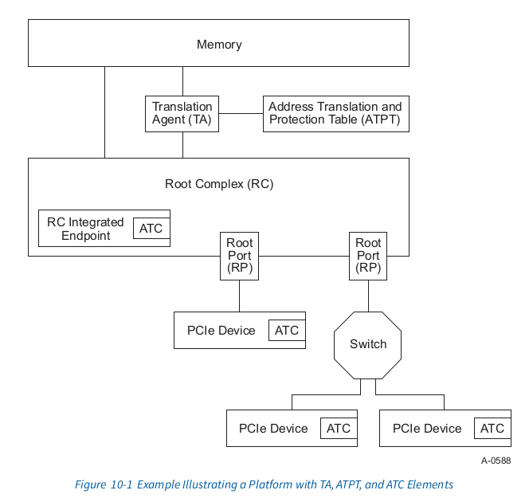
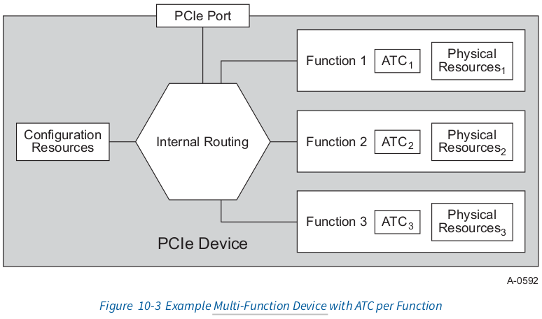
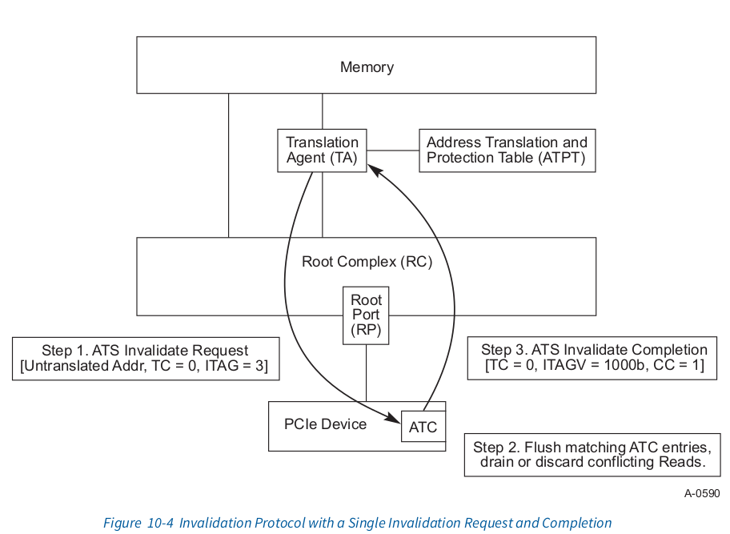

# ATS Specification

# 10.1 ATS Architectural Overview
Most contemporary system architectures make provisions for translating addresses from DMA (bus mastering) I/O Functions. In many implementations, it has been common
practice to assume that the physical address space seen by the CPU and by an I/O
Function is equivalent. While in others, this is not the case. The address programmed into
an I/O Function is a “handle” that is processed by the Root Complex (RC). The result of 
this processing is often a translation to a physical memory address within the central complex. 
Typically, the processing includes access rights checking to insure that the DMA Function 
is allowed to access the referenced memory location(s).

大部分现代系统架构对I/O Functions 的DMA (bus mastering)的地址转换作了规定.
在许多实现中, 通常的做法是假定CPU 和I/O Fucntions看到的是相同的物理地址空间.
而在其他情况下并非如此.地址以"handle"的方式被编程进I/O Function,该地址由Root 
Complex(RC)处理. 这个处理的结果通常是翻译为 central complex 中的physical memory
address.通常的,这个过程包括访问权限的检查,来月报DMA Function
允许访问指定的memory locations

The purposes for having DMA address translation vary and include:
* Limiting the destructiveness of a “broken” or miss-programmed DMA I/O Function
* Providing for scatter/gather
* Ability to redirect message-signaled interrupts (e.g., MSI or MSI-X) to 
different address ranges without requiring coordination with the underlying I/O Function
* Address space conversion (32-bit I/O Function to larger system address space)
* Virtualization support

进行DMA address translation的不同的目的包括
<ul>
	<li>
	限制"broken"或者误编程的DMA I/O Function
	</li>
	<li>
	提供给 scatter/gather使用
	</li>
	<li>
	能够将message-signaled interrupts(例如:MSI/MSIx)重定向到不同的
	地址范围,并且不需要和下层的I/O Function协调
	</li>
	<li>
	地址空间的转换(将32-bit I/O Function转换成更大的系统地址空间)
	</li>
	<li>虚拟化支持</li>
</ul>

Irrespective of the motivation, the presence of DMA address translation 
in the host system has certain performance implications for DMA accesses.

不管动机如何, 主机系统中的DMA address translation的存在会造成DMA
access时有一定的性能影响

Depending on the implementation, DMA access time can be significantly 
lengthened due to the time required to resolve the actual physical address. 
If an implementation requires access to a main-memory-resident translation table, the
access time can be significantly longer than the time for an untranslated access. 
Additionally, if each transaction requires multiple memory accesses (e.g., for a 
table walk), then the memory transaction rate (i.e., overhead) associated
with DMA can be high.

根据实现情况,DMA access的时间会因为解析世纪的物理地址而显著增长. 
如果实现中需要访问main-memory-resident(主存中驻留)de地址转换表, 访问的时间可能
比不经过翻译的访问时间长的多.此外,如果每个transaction需要
multiple memory access(例如 for a table work), 则和DMA相关的内存事务率(即开销)
可能会很高

To mitigate these impacts, designs often include address translation 
caches in the entity that performs the address translation. In a CPU, 
the address translation cache is most commonly referred to as a translation 
look-aside buffer (TLB). For an I/O TA, the term address translation cache 
or ATC is used to differentiate it from the translation cache used
by the CPU.

为了减轻这些影响, 设计时通常在执行地址转换的实体中包含地址转换缓存. 在CPU
中,地址转换缓存最常见之的是 translation look-aside buffer(TLB). 对于I/O TA, 
使用术语address translation cache 或者ATC 来区分CPU使用的地址转换缓存

While there are some similarities between TLB and ATC, there are important 
differences. A TLB serves the needs of a CPU that is nominally running one 
thread at a time. The ATC, however, is generally processing requests from 
multiple I/O Functions, each of which can be considered a separate thread. 
This difference makes sizing an ATC difficult depending
upon cost models and expected technology reuse across a wide range of system 
configurations.

虽然对于TLB和ATC之间有一些相似点, 但是也有很大的不同之处. TLB 只服务于一个
同一时间只运行一个thread的CPU. 而ATC通常处理来自于muliple I/O Functions,他们
中的每个都可以被认为是一个单独的thread.这种差异是的根据成本模型确定ATC的大小
和在广泛的系统配置中预期的技术重用变得困难.(实际上就是难以根据之前的框架设计)

The mechanisms described in this specification allow an I/O Device to participate 
in the translation process and provide an ATC for its own memory accesses. The 
benefits of having an ATC within a Device include:

* Ability to alleviate TA resource pressure by distributing address translation 
caching responsibility (reduced probability of “thrashing” within the TA)
* Enable ATC Devices to have less performance dependency on a system’s ATC size
* Potential to ensure optimal access latency by sending pretranslated requests to central complex

在本规范中描述的机制允许I/O Device来参与translation的处
理并且提供对于他们自己内存访问的ATC. 在Device中有ATC的好处包括:
<ul>
	<li>
	能够通过分配address trasnlation cache(ATC)责任来缓解
	TA资源方面的压力(减少TA中的"thrashing(抖动)"的可能性)
	</li>
	<li>
	使ATC devices减少对系统ATC size的性能依赖
	</li>
	<li>
	通过向central complex发送 pretranslated requests来
	保证最佳访问延迟的潜力
	</li>
</ul>

This specification will provide the interoperability that allows PCIe Devices 
to be used in conjunction with a TA, but the TA and its Address Translation 
and Protection Table (ATPT) are treated as implementation-specific and are outside the
scope of this specification. While it may be possible to implement ATS within 
other PCIe Components, this specification is confined to PCIe Devices and PCIe 
Root Complex Integrated Endpoints (RCiEPs).

这个规范提供允许PCIe设备和TA结合使用的互操作性. 但是TA和他的Address Translation
以及Protection Table(ATPT)被作为implementation-specific(特定实现)对待并且在本规范
的范围之外. 虽然可以在其他的PCIe 组建中实现ATS, 但是本规范仅限于PCIe Devices和PCIe
Root Complex Integrated Endpoints. (RCiEPs)

Figure 10-1 illustrates an example platform with a TA and ATPT, along with a set 
of PCIe Devices and RC Integrated Endpoints with integrated ATC. A TA and an ATPT 
are implementation-specific and can be distinct or integrated components within a 
given system design.

图10-1举例说明了一个带有TA和ATPT的平台, 并带有一些PCIe Devices和RC Integrated
Endpoints with integrated ATC.TA和ATPT是 implementation-specific并且在给定的系统
设计中是不同的或者集成的组件

# 10.1.1 Address Translation Services (ATS) Overview
The ATS chapter provides a new set of TLP and associated semantics. ATS uses 
a request-completion protocol between a Device[^1] and a Root Complex (RC) to 
provide translation services. In addition, a new AT field is defined within the
Memory Read and Memory Write TLP. The new AT field enables an RC to determine 
whether a given request has been translated or not via the ATS protocol.

ATS这个章节提供了一组新的TLP和相关的概念.ATS在Device[1]和Root Complex(RC)之间
使用一种request-completion协议来确保 translation services. 此外,在Memory Read和
Memory Write TLP中提供了一个新的AT字段. 这个新的AT字段使RC 确定给定的request是否
通过ATS协议进行了translate

Figure 10-2 illustrates the basic flow of an ATS Translation Request operation

Figure 10-2 描述了ATS Translation Request主要的操作流程

In this example, a Function-specific work request is received by a single-Function 
PCIe Device. The Function determines through an implementation-specific method 
that caching a translation within its ATC would be beneficial. There are a
number of considerations a Function or software can use in making such a 
determination; for example:
* Memory address ranges that will be frequently accessed over an extended 
period of time or whose associated buffer content is subject to a significant 
update rate
* Memory address ranges, such as work and completion queue structures, 
data buffers for low-latency communications, graphics frame buffers, host memory 
that is used to cache Function-specific content, and so forth

在这个例子中,一个Singal-Function接收到一个 Function-specific 工作请求.
该Function确定了通过使用他自己的ATC缓存translation这样的 implementation-specific
方法是有效的.这里有几条注意事项,当一个Function或者software作出上述决定的时候, 
例如:
<ul>
	<li>
	该内存地址段在一段时间内被频繁访问,或者相关的buffer内容处于一个很高的更新频率
	</li>
	<li>
	该内存地址段是例如工作和完成队列数据结构,低延迟通信的data buffers, 图形帧缓冲区
	用于缓存 Function-specific内容的内存等等
	</li>
</ul>

The Function generates an ATS Translation Request which is sent upstream through 
the PCIe hierarchy to the RC which then forwards it to the TA. An ATS Translation 
Request uses the same routing and ordering rules as defined in this
specification. Further, multiple ATS Translation Requests can be outstanding at 
any given time; i.e., one may pipeline multiple requests on one or more TC. Each 
TC represents a unique ordering domain and defines the domain that must
be used by the associated ATS Translation Completion.

Function生成了一个ATS Translation Request, 该 Request发送到upstream,该过程通过PCIe
层级到RC, 该RC接下来将转发到TA.一个ATS Translation Request使用同本规范中定义的路由
和排序规则. 此外, multiple ATS Translation Request 在任何时间都可以是
outstanding(这个需要在看下).例如,一个 pipeline multiple
requests可能需要一个或多个TC.每个TC代表一个唯一的顺序域, 并定义关联的ATS翻译完成
必须使用的域

Upon receipt of an ATS Translation Request, the TA performs the following basic steps:
1. Validates that the Function has been configured to issue ATS Translation Requests.
2. Determines whether the Function may access the memory indicated by the ATS 
Translation Request and has the associated access rights.
3. Determines whether a translation can be provided to the Function. 
If yes, the TA issues a translation to the Function.
	+ ATS is required to support a variety of page sizes to accommodate a 
	range of ATPT and processor implementations.
		+ Page sizes are required to be a power of two and naturally aligned.
		+ The minimum supported page size is 4096 bytes. ATS capable components 
		are required to support this minimum page size.
	+ A Function must be informed of the minimum translation or invalidate size 
	it will be required to support to provide the Function an opportunity to optimize 
	its resource utilization. The smallest minimum translation size must be 4096 bytes.
4. The TA communicates the success or failure of the request to the RC which 
generates an ATS Translation Completion and transmits via a Response TLP through 
a RP to the Function.
	+ An RC is required to generate at least one ATS Translation Completion per 
	ATS Translation Request;i.e., there is minimally a 1:1 correspondence 
	independent of the success or failure of the request.
		+ A successful translation can result in one or two ATS Translation 
		Completion TLPs per request. The Translation Completion indicates 
		the range of translation covered.
		+ An RC may pipeline multiple ATS Translation Completions; i.e., 
		an RC may return multiple ATS Translation Completions and these ATS 
		Translation Completions may be in any order relative to ATS 
		Translation Requests.
		+ The RC is required to transmit the ATS Translation Completion 
		using the same TC (Traffic Class) as the corresponding ATS 
		Translation Request.
	+ The requested address may not be valid. The RC is required to issue 
	a Translation Completion indicating that the requested address is 
	not accessible.

当受到一个ATS Translation Request, TA 执行下面的主要步骤:
<ol>
	<li>
	验证这个Function已经被配置了,可以用来提交 ATS Translation Requests.
	</li>
	<li>
	确定 Function 是否可以访问 ATS Translation Request 指示的内存并具
	有相关的访问权限。
	</li>
	<li>
	确定可以向该Function 提供 translation.如果可以, TA 将对该Function
	提交一个 translation
	<ul>
		<li>
		ATS 需要支持各种页面大小以适应一系列 ATPT 和处理器实现。
		<ul>
			<li>页面大小必须是2的幂,并自然对齐</li>
			<li>
			支持的page size的最小值是4096字节. ATS capable 组件需要
			支持此最小页面的大小
			</li>
		</ul>
		</li>
		<li>
		为了优化Function的资源利用率,该Function必须被告知他需要支持的
		minimun translation和invalidate size. 最小的minimun translation 
		size必须是4096 bytes
		</li>
	</ul>
	</li>
	<li>
	TA需要告诉RC 该请求的结果是成功还是失败, 该RC会产生一个ATS Translation
	Completion并且通过RP 向Fucntion发送一个 Response TLP
	<ul>
		<li>
		RC需要为每个ATS Translation Request 生成至少一个ATS Translation 
		Completion; 也就是说, 至少存在1:1的对应关系, 与request的成功失败无关
		</li>
		<ul>
			<li>
			一个成功执行的translation可以为每个request回应一条或两条
			ATS Translation Completion. Translation Completion表明了
			translation 的范围.
			</li>
			<li>
			RC可能pipeline multiple ATS Translation Completions. 也就是说
			RC可能返回muliple ATS Translation Completions并且这些ATS Translation
			Completions 打乱了原有ATS Translation Request的顺序
			</li>
		</ul>
		<li>
		请求的地址可能是非法的.RC需要产生一个Translation Completion
		标识请求的地址是不可访问的
		</li>
	</ul>
	</li>
</ol>

When the Function receives the ATS Translation Completion and either 
updates its ATC to reflect the translation or notes that a translation 
does not exist. The Function proceeds with processing its work request 
and generates subsequent requests using either a translated address 
or an untranslated address based on the results of the Completion.
* Similar to Read Completions, a Function is required to allocate 
resource space for each completion(s) without causing backpressure 
on the PCIe Link.
* A Function is required to discard Translation Completions that 
might be “stale”. Stale Translation Completions can occur for a 
variety of reasons.

当一个Function收到了ATS Translation Completion并且更新了这个translation
对应的ATC或者发现这个translation不存在. (应该是该function没有发出过 
ATS Request). 该 Function 继续处理他的工作请求并且接下来产生的请求根据
Completion的结果使用已经翻译过的地址或者未翻译的地址
<ul>
	<li>
	和Read Completions相似, Function需要在当前PCIe link不产生backpressure
	的情况下, 为每个compleions分配resource space
	</li>
	<li>
	Function 需要丢弃已经"stale"(实效的)Translation Completions. Stale
	Translation Completion可能由于不同的原因产生
	</li>
</ul>

As one can surmise, ATS Translation Request and Translation Completion 
processing is conceptually similar and, in many respects, identical to 
PCIe Read Request and Read Completion processing. This is intentional 
to reduce design complexity and to simplify integration of ATS into existing 
and new PCIe-based solutions. Keeping this in mind, ATS requires the following:
* ATS capable components must interoperate with [PCIe-1.1] compliant components.
* ATS is enabled through a new Capability and associated configuration 
 structure. To enable ATS, software must detect this Capability and enable 
 the Function to issue ATS TLP. If a Function is not enabled, the Function is
 required not to issue ATS Translation Requests and is required to issue all 
 DMA Read and Write Requests with the TLP AT field set to “untranslated”.
* ATS TLPs are routed using either address-based or Requester ID (RID) routing.
* ATS TLPs are required to use the same ordering rules as specified in 
 this specification.
* ATS TLPs are required to flow unmodified through [PCIe-1.1] compliant Switches.
* A Function is permitted to intermix translated and untranslated requests.
* ATS transactions are required not to rely upon the address field of a 
 memory request to communicate additional information beyond its current 
 use as defined by the PCI-SIG.

作为推测, ATS Translation Request 和Translation Completion 处理在概念上
相似.并且在很多方面与PCIe Read Request和Read Completion处理上一致. 这是
刻意为了减少设计的复杂性,并简化集成ATS进现有的和新的PCIe-based 解决方案
牢记这一点，ATS 需要遵守以下方面：

<ul>
	<li>
	支持 ATS 的组件必须与符合 [PCIe-1.1] 的组件 交互。
	</li>
	<li>
	ATS 需要通过一个新的 Capability 和相关的configuration structure enable.
	为了enable ATS, 软件必须识别这个 Capability 并且使能该 Function 来提交
	ATS TLP. 如果一个Function 没有 enable, Function 不能提交 ATS Translation
	Request 并且提交的 DMA Read 和 Write Request 的TLP 中的AT filed 需要设置
	成"untranslated"
	</li>
	<li>
	ATS TLPs 可以通过 address-based 或者 Requester ID (RID) 路由
	</li>
	<li>
	ATS TLPs 需要 未经修改的通过[PCIe-1.1] compliant Switches.
	</li>
	<li>
	Function 允许去混合 translated 和 untranslated request
	</li>
	<li>
	要求 ATS translation 不依赖内存请求的地址字段传递当前PCI-SIG之外
	的额外信息
	</li>
</ul>

> IMPLEMENTATION NODE
>> Adress Range Overlap
>>> It is likely that the untranslated and translated address range 
>>> will overlap, perhaps in their entirety. This is not a
>>> requirement of ATS but may be an implementation constraint on 
>>> the TA so that memory requests will be properly routed.

Address Range Overlap(重叠)
untranslated 和 translated address range 很可能发生重叠, 也可能发生了
全部的重叠.这不是ATS的需求,但是这可能对TA的实现限制, 以便正确路由内存
请求

In contrast to the prior example, Figure 10-3 illustrates an 
example Multi-Function Device. In this example Device, there
are three Functions. Key points to note in Figure 10-3 are:

* Each ATC is associated with a single Function. Each ATS-capable 
Function must be able to source and sink at least one of each ATS 
Translation Request or Translation Completion type.
* Each ATC is configured and accessed on a per Function basis. A 
Multi-Function Device is not required to implement ATS on every 
Function.
* If the ATC implementation shares resources among a set of 
Functions, then the logical behavior is required to
be consistent with fully independent ATC implementations.

对比前一个例子, Figure 10_3 举例说明了一个Multi-Function Device.
在这个例子中的Device, 有三个Functions. Figure 10-3 需要注意的关键点
如下:

<ul>
	<li>
	每个ATC和一个单独的Function相关. 每个ATS-capable Function 必须
	能够去source and sick至少 ATS Translation Request 或 Translation
	Completion 一种
	</li>
	<li>
	每个ATC都基于每个Function进行配置和访问. 一个 Multi-Function设备
	不需要在每个Function上
	</li>
	<li>
	如果 ATC 实现在一组功能之间共享资源，则逻辑行为需要与完全独立的 
	ATC 实现一致。
	</li>
</ul>

Independent of the number of Functions within a Device, the 
following are required:
* A Function is required not to issue any TLP with the AT 
field set unless the address within the TLP was obtained
through the ATS Translation Request and Translation Completion 
protocol.
* Each ATC is required to only be populated using the ATS 
protocol; i.e., each entry within the ATC must be filled
via an ATS Translation Completion in response to the Function 
issuing an ATS Translation Request for a given address.
* Each ATC cannot be modified except through the ATS protocol. 
That is:
	+ Host system software cannot modify the ATC other than 
	through the protocols defined in this specification except 
	to invalidate one or more translations in an ATC. A Device 
	or Function reset would be an example of an operation 
	performed by software to change the contents of the ATC, but a
	reset is only allowed to invalidate entries not modify their contents.
	+ It must not be possible for host system software to 
	use software executing on the Device to modify the ATC.

与Device中的Function数量无关,需要遵守下面:
<ul>
	<li>
	Function不需要提交带有AT字段的TLP除非这个TLP中的address通过
	ATS Translation Request 和Translation Completion 协议获取过
	</li>
	<li>
	每个ATC只能使用ATS协议填充. 也就是说,ATC中的每个entry都必须由
	该Fcuntion 提交一个给定地址的ATS translation Requests , 然后
	回应ATS Translation Completion 来填充
	</li>
	<li>
	每一个ATC 不能被修改,除非通过ATS protocol.
	<ul>
		<li>
		Host 系统软件只能通过该规范中的定义的协议来修改ATC, 除非去invalidate
		一个或多个ATC中的 translations. Device 或者Function Reset操作将会是
		一个由software 去改变ATC内容的例子,但是reset操作只能能允许去invalidate
		entries 但是不能modify他们的内容
		</li>
		<li>
		主机系统软件不得使用在设备上执行的软件来修改 ATC。
		</li>
	</ul>
	</li>
</ul>

When a TA determines that a Function should no longer maintain a translation 
within its ATC, the TA initiates the ATS invalidation protocol. The invalidation 
protocol consists of a single Invalidation Request and one or more Invalidate
Completions.

当TA判定该function应该不再维护在ATC中的某个translation时. TA会发起ATS
invailidation protocol. invailidate protocol 由一个 Invalidation Request 和
一个或多个 Invalidate Completions组成

As Figure 10-4 illustrates, there are essentially three steps in the ATS Invalidation protocol:
1. The system software updates an entry in the tables used by the TA. After the table is changed, the TA
determines that a translation should be invalidated in an ATC and initiates an Invalidation Request TLP which
is transmitted from the RP to the example single-Function Device. The Invalidate Request communicates an
untranslated address range, the TC, and an RP unique tag which is used to correlate Invalidate Completions
with the Invalidation Request.

2. The Function receives the Invalidate Request and invalidates all matching ATC entries. A Function is not
required to immediately flush all pending requests upon receipt of an Invalidate Request. If transactions are in
a queue waiting to be sent, it is not necessary for the Function to expunge requests from the queue even if
those transactions use an address that is being invalidated.
	* A Function is required not to indicate the invalidation has completed until all outstanding Read
	  Requests or Translation Requests that reference the associated translated address have been retired
	  or nullified.
	* A Function is required to ensure that the Invalidate Completion indication to the RC will arrive at the
		RC after any previously posted writes that use the “stale” address.
3. When a Function has ascertained that all uses of the translated address are complete, it issues one or more ATS
Invalidate Completions.
	* An Invalidate Completion is issued for each TC that may have referenced the range invalidated. These
	  completions act as a flush mechanism to ensure the hierarchy is cleansed of any in-flight
	  transactions which may contain references to the translated address.
		+ The number of Completions required is communicated within each Invalidate Completion.
		   A TA or RC implementation can maintain a counter to ensure that all Invalidate
		Completions are received before considering the translation to no longer be in use.
		+ If more than one Invalidation Complete is sent, the Invalidate Completion sent in each TC
		must be identical in the fields detailed in Section 10.3.2 .
	* An Invalidate Completion contains the ITAG from Invalidate Request to enable the RC to correlate
	  Invalidate Requests and Completions.

如10-4图所示, ATS Invalidate protocol 基本上包含三个步骤
<ul>
	<li>
	system software更新了一个entry, 而这个entry恰好被TA使用.
	在这个table被改变后,TA判定对应的translation应该在ATC中被
	invailidated并且发起一个 Invalidation Request TLP,该TLP从
	RP传达到例子中的single-Function Device.该Invalidate Request
	传递了一个 untranslated address range, TC, 和一个 RP unique
	tag, 该tag用来把 Invalidate Completions 和 Invalidation Request
	关联起来
	</li>
	<li>
	该function收到了Invalidate Request并且无效了所有对应的ATC 
	entries. 在收到 Invalidate Request 后, function 不需要立即flush
	所有pending的 requests.如果一个 transactions 正在队列中等待发送, 
	则该function没有必要从队列中删除请求, 即使这些事务使用的address正在
	被 invailidated
	<ul>
		<li>
		在引用相关translated address 的outstanding Read Request或者 
		Translation Request 在停用或者无效之前, function 不需要表明
		invailidate 已经 complete
		</li>
		<li>
		Function需要保证 发送到RC的 Invalidate Completion 到达RC之前,
		之前任何的posted writes都必须使用 "stale"(老的,旧的) 地址
		</li>
	</ul>
	</li>
	<li>
	当该function 确定了所用这个translated address相关请求都已经complete, 
	他会提交1个或多个ATS Invalidate Completions
	<ul>
		<li>
		为每个引用了无效范围的TC发出 Invalidate Completion. 这些 completions
		充当了一个flush 机制来保证 hierarchy已经清除了任何可能包含translated 
		address的正在处理的事物
		<ul>
			<li>
			每个Invalidate Completion 都会包含Completions的数量.TA或者RC的实
			现中会包含一个计数器来确保在认为这个translation 没有人在使用之前,
			所有的 Invalidate Completions都已经收到.
			</li>
			<li>
			如果多个 Invalidate Complete 发出, 每个TC 发出的Invalidate Completion 
			需要和 Section 10.3.2中描述的字段保持一致
			</li>
		</ul>
		</li>
		<li>
		Invalidate Completion 中包含来自于 Invalidate Request 中的ITAG  来保证
		RC可以将这些 Invalidate Request和 Completion 联系起来
		</li>
	</ul>
	</li>
</ul>

# 10.1.2 Page Request Interface Extension

ATS improves the behavior of DMA based data movement. An associated 
Page Request Interface (PRI) provides additional advantages by allowing 
DMA operations to be initiated without requiring that all the data to 
be moved into or out of system memory be pinned. The overhead 
associated with pinning memory may be modest, but the negative
impact on system performance of removing large portions of memory 
from the pageable pool can be significant. 

ATS改善了基于DMA的数据移动行为. 相关的 Page Request Interface (PRI) 
提供了其他的优点: 在没有所有的数据可以被传输(感觉这里是说,不需要所有的内存
请求的地址都是present的)或者目的内存在pinned 系统内存之外条件下, 
允许 DMA 操作被发起. 和 pinning memory相关的开销可能不明显,但是
从pageable pool 中删除大量的内存对系统性能负面影响可能很大.(这里可能
从资源消耗考虑,占用的大量的页表资源). 

PRI is functionally independent of the other aspects of ATS. That 
is, a device that supports ATS need not support PRI, but PRI is 
dependent on ATS’s capabilities.

PRI 在功能方面是独立于 ATS 其他部分. 展开来说, 一个设备支持ATS 不一定
支持PRI, 但是 PRI 依赖 ATS的capabilitis

Intelligent I/O devices can be constructed to make good use of a 
more dynamic memory interface. Pinning will always have the best 
performance characteristics from a device’s perspective-all the 
memory it wants to touch is guaranteed to be present. However, 
guaranteeing the residence of all the memory a device might touch 
can be problematic and force a sub-optimal level of device awareness 
on a host. Allowing a device to operate more independently (to page 
fault when it requires memory resources that are not present) provides 
a superior level of coupling between device and host. 

可以构建智能 I/O 设备以充分利用更动态的内存接口。从设备的全视角来看,
Pining 总是会有更高的性能特性 -- 该设备想要touch 的内存需要保证present.
但是, 保证设备可能touch的所有内存都present可能是有问题的,并且会对host
device awareness 水平强制处于 sub-optimal. 允许设备操作来更加独立(当他
需要的内存资源不是present的时候,会触发一个page fault)在设备和主机之间
提供了更高级别(更良好)的耦合. (降低了耦合性, 或者说host对于device不需
要增加一些特殊的管理了)

The mechanisms  used to take advantage of a Page Request Interface 
are very device specific. As an example of a model in which such 
an interface could improve overall system performance, let us examine 
a high-speed LAN device. Such adevice knows its burst rate and 
need only have as much physical buffer space available for inbound 
data as it can receive within some quantum. A vector of unpinned 
virtual memory pages could be made available to the device, that the
device then requests as needed to maintain its burst window. This 
minimizes the required memory footprint of the device and simplifies 
the interface with the host, both without negatively impacting 
performance.

利用 Page Request Interface 的机制实现是非常特定于设备的.  让我们来
参考一个高速的LAN 设备, 作为例子模型来展示像这样的一个接口可以提高系统
整体的性能.这样的一个设备指导它的burst rate(突发速率,最大速率)并且只
需要为在一定范围内它可以接受的数据提供尽可能多的物理buffer空间. 可以向
设备提供一个不固定的虚拟内存页的vector(也就是所有的page不一定是pinned,
可能不是present，可能present，但是指向的physical page不同)， 之后设备
需要维护他的 burst windows. 这将最小化设备所需的内存占用，简化与主机
的接口，并且两者不会产生性能方面的负面影响.

The ability to page, begs the question of page table status flag 
management. Typical TAs associate flags (e.g., dirty and access 
indications) with each untranslated address. Without any additional 
hints about how to manage pages mapped to a Function, such TAs would 
need to conservatively assume that when they grant a Function 
permission to read or write a page, that Function will use the 
permission. Such writable pages would need to be marked as dirty 
before their translated addresses are made available to a Function.

对于page来说，该 ability回避了page table status flag 管理的问题。
典型的TA 会将flags(eg. dirty && access 标志位)和每个未翻译的address
联系起来。如果没有关于如何管理映射到function页面的额外的指示, 这些TAs
需要谨慎的假设当他们授予一个function去读写一个page 权限, 这些function
将会使用这些权限.(当function 去write, 那么认为该page就有write的权限).
这些可写页面需要在translated address 提供给function之前, 需要标记成
脏页

This conservative dirty-on-write-permission-grant behavior is 
generally not a significant issue for Functions that do not support 
paging, where pages are pinned and the cost of saving a clean 
page to memory will seldom be paid. However, Functions that support 
the Page Request Interface could pay a significant penalty if all 
writable pages are treated as dirty, since such Functions operate 
without pinning their accessible memory footprints and may issue 
speculative page requests for performance. The cost of saving clean 
pages (instead of just discarding them) in such systems can diminish
the value of otherwise attractive paging techniques. This can cause 
significant performance issues and risk functional issues in 
circumstances where the backing store is unable to be written, 
such as a CD-ROM.

对于不支持paging的function来说, 保守的 dirty-on-write-permission-grant行为
通常不会是一个重要问题, 其中固定页面在保存clean page到内存中将花费很少
代价. 但是支持 Page Request Interface 的function可能会付出比较大的代价
,如果所有的可写入的page都被对待为dirty的话,因为这些function不会固定他们要
访问的内存空间并且可能会有一些预测性质的 page request 来提高性能(预读).
在无法写入后段存储(例如 CD-ROM) 的情景下, 可能会导致严重的性能问题
以及可能会造成一些安全问题(risk functional issues)

The No Write (NW) flag in Translation Requests indicates that 
a Function is willing to restrict its usage to only reading the
page, independent of the access rights that would otherwise have 
been granted.

Translation Requests NO Write (NW) flag 表明function将其使用限制
为仅读取页面，而与原本授予的访问权限无关。

If a device chooses to request only read access by issuing a 
Translation Request with the NW flag Set and later determines 
that it needs to write to the page, then the device must issue 
a new Translation Request.

如果 device 通过发出带有 NW flag 的 Translation Request 
来提交只读请求 ,然而之后决定需要去写这个page, 这样的话,device
必须发出一个新的 Translation Request

Upon receiving a Translation Request with the NW flag Clear, 
TAs are permitted to mark the associated pages dirty. It is 
strongly recommended that Functions not issue such Requests unless
they have been given explicit write permission. An example of 
write permission is where the host issues a command to a Function 
to load data from a storage device and write that data into memory.

当受到一个不带 NW flag的 Translation Request, TAs 允许去标记相关的
page 为dirty . 强烈建议function 不要发出这样的请求,除非他们已经获得了
明确的写入权限.写入权限的一个例子是, 当主机提交了给function一个 从
storage device 中 load data的cmd并且将该数据写入内存

# 10.1.3 Process Address Space ID (PASID)
Certain TLPs can optionally be associated with a Process Address 
Space ID (PASID). This value is conveyed using the PASID TLP Prefix. 
The PASID TLP Prefix is defined in the Section 6.20 .

某些TLPs 可以选择性的带有 Process Address Space ID (PASID).该值
通过 PASID TLP Prefix(前缀)标识. PASID TLP Prefix 在Section 
6.20 中定义

The PASID TLP Prefix is permitted on:
* Memory Requests (including Untranslated AtomicOp Requests) 
  with Untranslated Addresses
* Address Translation Requests
* Page Request Messages
* ATS Invalidation Requests
* PRG Response Messages

PASID TLP Prefix允许在下面的请求中使用:
<ul>
	<li>
	带有 Untranslated Adress Memory Requests(包括 Untranslated
	AtomicOp Requests)
	</li>
	<li>
	Address Translation Requests
	</li>
	<li>
	Page Request Messages
	</li>
	<li>
	ATS Invalidation Requests
	</li>
	<li>
	RPG Response Messages
	</li>
</ul>

Usage of the PASID TLP Prefix for Untranslated Memory Requests 
is defined in Section 6.20 . This section describes PASID
TLP Prefix for the remaining TLPs.

对于 Untranslated Memory Requests使用 PASID TLP Prefix在
Section 6.20中定义. 该章节描述了其他 TLPs 中的PASID TLP 
Prefix

When a Request does not have a PASID TLP Prefix, the Untranslated 
Address represents an address space associated with the Requester 
ID.

When a Request has a PASID TLP Prefix, the Untranslated Address 
represents an address space associated with both the Requester 
ID and the PASID value.

当一个Requset 不带有 PASID TLP Prefix, 这个 Untranslated 
Address 表示与 Requester ID相关的地址空间

当一个Request 带有 PASID TLP Prefix, 这个 Untranslated
Address 表示 与Requester ID和PASID 值 相关的地址空间
(Requester ID + PASID --> request)

When a Response has a PASID TLP Prefix, the PASID value reflects 
the address space associated the corresponding Request.

当一个 Response 带有 PASID TLP Prefix, 这个 PASID的值反映了
与其相应的请求相关的地址空间

Each Function has an independent set of PASID values. The PASID 
field is 20 bits wide however the effective width is constrained 
by the  lesser of the width supported by the Root Complex (TA) 
and the  width supported by the Function (ATC). Unused upper bits 
of the PASID value must be 0b.

每个 function 都有一组独立的 PASID 值. PASID字段有20 bits宽, 但是
有效的宽度会被 Root Complex (TA) 和function (ATC) 限制的更短.
PASID的没有使用的高bits位必须是0

For Endpoints in systems where a Virtual Intermediary (VI) is 
present, Untranslated.

对于一个存在 Virtual Intermediary (VI) (VMM) 的Enpoints, 是 
Untranslated

Addresses with an associated PASID are typically used to represent 
Guest Virtual Addresses (GVA) and Untranslated Addresses that are 
not associated with a PASID represent Guest Physical Addresses (GPA). 
The TA could be designed so that the VI manages the tables used 
to perform translations from GPA to Translated Addresses while the 
individual Guest Operating Systems manage tables used to perform 
translations from GVA to GPA. When translating an address with an
associated PASID, the TA performs both translations and returns 
the resulting Translated Address (i.e., GVA to GPA followed by GPA 
to Translated Address). The intermediate GPA value is not visible 
to the ATC.

带有相关的 PASID 的address 通常用于标识 Guest Virtual Address (GVA),
不带 PASID 的 Untranslated Address标识 Guest Physical Address (GPA).
TA这样设计以便 VI 管理用于执行从GPA  到 Translated Address 页表,
而独立的Guest 操作系统管理用于从GVA到 GPA的页表.当 转换一个带有
相关 PASID的地址, TA 执行 两种translations 并且返回 Translated 
Address (也就是说: GVA --> GPA 然后是 GPA --> Translated Address).
中间的GPA值对ATC不可见

When an ATC invalidates a cached GPA mapping, it invalidates the 
GPA mapping and also invalidates all GVA mappings in the ATC. When 
the GPA invalidate completes, the VI can safely remove pages backing 
GPA memory range from a Guest Operating System. The VI does not 
need to know which GVA mappings involved the GPA mapping.

