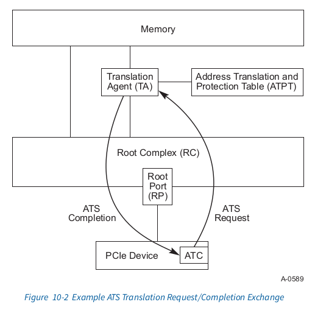

# ATS Specification

# 10.1 ATS Architectural Overview
Most contemporary system architectures make provisions for translating addresses from
DMA (bus mastering) I/O Functions. In many implementations, it has been common
practice to assume that the physical address space seen by the CPU and by an I/O
Function is equivalent. While in others, this is not the case. The address programmed into
an I/O Function is a “handle” that is processed by the Root Complex (RC). The result of 
this processing is often a translation to a physical memory address within the central complex. 
Typically, the processing includes access rights checking to insure that the DMA Function 
is allowed to access the referenced memory location(s).

大部分现代系统架构对I/O Functions 的DMA (bus mastering)的地址转换作了准备.
在许多实现中, 通常的做法是假定CPU 和I/O Fucntions看到的是相同的物理地址空间.
而在其他情况下并非如此.地址以"handle"的方式被编程进I/O Function,该地址由Root 
Complex(RC)处理. 这个处理的结果通常是翻译为 central complex 中的physical memory
address.通常的,这个过程包括访问权限的检查,来月报DMA Function
允许访问指定的memory locations

The purposes for having DMA address translation vary and include:
* Limiting the destructiveness of a “broken” or miss-programmed DMA I/O Function
* Providing for scatter/gather
* Ability to redirect message-signaled interrupts (e.g., MSI or MSI-X) to 
different address ranges without requiring coordination with the underlying I/O Function
* Address space conversion (32-bit I/O Function to larger system address space)
* Virtualization support

进行DMA address translation的不同的目的包括
<ul>
	<li>
	限制"broken"或者误编程的DMA I/O Function
	</li>
	<li>
	提供给 scatter/gather使用
	</li>
	<li>
	能够将message-signaled interrupts(例如:MSI/MSIx)重定向到不同的
	地址范围,并且不需要和下层的I/O Function协调
	</li>
	<li>
	地址空间的转换(将32-bit I/O Function转换成更大的系统地址空间)
	</li>
	<li>虚拟化支持</li>
</ul>

Irrespective of the motivation, the presence of DMA address translation 
in the host system has certain performance implications for DMA accesses.

不管动机如何, 主机系统中的DMA address translation的存在会造成DMA
access时有一定的性能影响

Depending on the implementation, DMA access time can be significantly 
lengthened due to the time required to resolve the actual physical address. 
If an implementation requires access to a main-memory-resident translation table, the
access time can be significantly longer than the time for an untranslated access. 
Additionally, if each transaction requires multiple memory accesses (e.g., for a 
table walk), then the memory transaction rate (i.e., overhead) associated
with DMA can be high.

根据实现情况,DMA access的时间会因为解析世纪的物理地址而显著增长. 
如果实现中需要访问main-memory-resident(主存中驻留)de地址转换表, 访问的时间可能
比不经过翻译的访问时间长的多.此外,如果每个transaction需要
multiple memory access(例如 for a table work), 则和DMA相关的内存事务率(即开销)
可能会很高

To mitigate these impacts, designs often include address translation 
caches in the entity that performs the address translation. In a CPU, 
the address translation cache is most commonly referred to as a translation 
look-aside buffer (TLB). For an I/O TA, the term address translation cache 
or ATC is used to differentiate it from the translation cache used
by the CPU.

为了减轻这些影响, 设计时通常在执行地址转换的实体中包含地址转换缓存. 在CPU
中,地址转换缓存最常见之的是 translation look-aside buffer(TLB). 对于I/O TA, 
使用术语address translation cache 或者ATC 来区分CPU使用的地址转换缓存

While there are some similarities between TLB and ATC, there are important 
differences. A TLB serves the needs of a CPU that is nominally running one 
thread at a time. The ATC, however, is generally processing requests from 
multiple I/O Functions, each of which can be considered a separate thread. 
This difference makes sizing an ATC difficult depending
upon cost models and expected technology reuse across a wide range of system 
configurations.

虽然对于TLB和ATC之间有一些相似点, 但是也有很大的不同之处. TLB 只服务于一个
同一时间只运行一个thread的CPU. 而ATC通常处理来自于muliple I/O Functions,他们
中的每个都可以被认为是一个单独的thread.这种差异是的根据成本模型确定ATC的大小
和在广泛的系统配置中预期的技术重用变得困难.(实际上就是难以根据之前的框架设计)

The mechanisms described in this specification allow an I/O Device to participate 
in the translation process and provide an ATC for its own memory accesses. The 
benefits of having an ATC within a Device include:

* Ability to alleviate TA resource pressure by distributing address translation 
caching responsibility (reduced probability of “thrashing” within the TA)
* Enable ATC Devices to have less performance dependency on a system’s ATC size
* Potential to ensure optimal access latency by sending pretranslated requests to central complex

在本规范中描述的机制允许I/O Device来参与translation的处
理并且提供对于他们自己内存访问的ATC. 在Device中有ATC的好处包括:
<ul>
	<li>
	能够通过分配address trasnlation cache(ATC)责任来缓解
	TA资源方面的压力(减少TA中的"thrashing(抖动)"的可能性)
	</li>
	<li>
	使ATC devices减少对系统ATC size的性能依赖
	</li>
	<li>
	通过向central complex发送 pretranslated requests来
	保证最佳访问延迟的潜力
	</li>
</ul>

This specification will provide the interoperability that allows PCIe Devices 
to be used in conjunction with a TA, but the TA and its Address Translation 
and Protection Table (ATPT) are treated as implementation-specific and are outside the
scope of this specification. While it may be possible to implement ATS within 
other PCIe Components, this specification is confined to PCIe Devices and PCIe 
Root Complex Integrated Endpoints (RCiEPs).

这个规范提供允许PCIe设备和TA结合使用的互操作性. 但是TA和他的Address Translation
以及Protection Table(ATPT)被作为implementation-specific(特定实现)对待并且在本规范
的范围之外. 虽然可以在其他的PCIe 组建中实现ATS, 但是本规范仅限于PCIe Devices和PCIe
Root Complex Integrated Endpoints. (RCiEPs)

Figure 10-1 illustrates an example platform with a TA and ATPT, along with a set 
of PCIe Devices and RC Integrated Endpoints with integrated ATC. A TA and an ATPT 
are implementation-specific and can be distinct or integrated components within a 
given system design.

图10-1举例说明了一个带有TA和ATPT的平台, 并带有一些PCIe Devices和RC Integrated
Endpoints with integrated ATC.TA和ATPT是 implementation-specific并且在给定的系统
设计中是不同的或者集成的组件

# 10.1.1 Address Translation Services (ATS) Overview
The ATS chapter provides a new set of TLP and associated semantics. ATS uses 
a request-completion protocol between a Device[^1] and a Root Complex (RC) to 
provide translation services. In addition, a new AT field is defined within the
Memory Read and Memory Write TLP. The new AT field enables an RC to determine 
whether a given request has been translated or not via the ATS protocol.

ATS这个章节提供了一组新的TLP和相关的概念.ATS在Device[1]和Root Complex(RC)之间
使用一种request-completion协议来确保 translation services. 此外,在Memory Read和
Memory Write TLP中提供了一个新的AT字段. 这个新的AT字段使RC 确定给定的request是否
通过ATS协议进行了translate

Figure 10-2 illustrates the basic flow of an ATS Translation Request operation

Figure 10-2 描述了ATS Translation Request主要的操作流程

In this example, a Function-specific work request is received by a single-Function 
PCIe Device. The Function determines through an implementation-specific method 
that caching a translation within its ATC would be beneficial. There are a
number of considerations a Function or software can use in making such a 
determination; for example:
* Memory address ranges that will be frequently accessed over an extended 
period of time or whose associated buffer content is subject to a significant 
update rate
* Memory address ranges, such as work and completion queue structures, 
data buffers for low-latency communications, graphics frame buffers, host memory 
that is used to cache Function-specific content, and so forth

在这个例子中,一个Singal-Function接收到一个 Function-specific 工作请求.
该Function确定了通过使用他自己的ATC缓存translation这样的 implementation-specific
方法是有效的.这里有几条注意事项,当一个Function或者software作出上述决定的时候, 
例如:
<ul>
<li>

</li>
</ul>

[^1]:All references within this  chapter to a Device apply equally to 
a PCIe Device or a Root Complex Integrated  Endpoint. ATS does 
not delineate between these two types in terms of requirements, 
semantics, configuration, error handling, etc. From a software perspective, an 
ATS-capable Root Complex Integrated Endpoint must behave the same as an 
ATS-capable non-integrated Device. 
