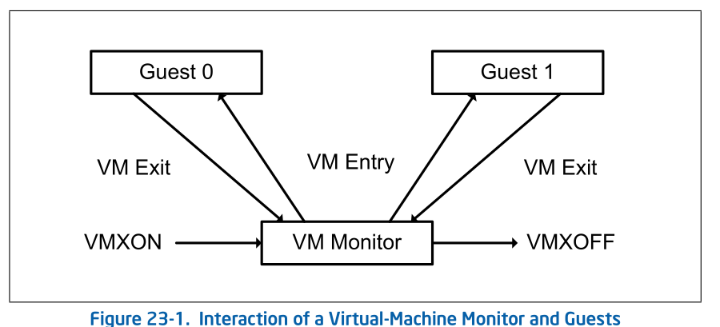

## 23.3 INTRODUCTION TO VMX OPERATION
Processor support for virtualization is provided by a form of
processor operation called VMX operation. There are two kinds
of VMX operation: VMX root operation and VMX non-root operation.
In general, a VMM will run in VMX root operation and guest 
software will run in VMX non-root operation. Transitions 
between VMX root operation and VMX non-root operation are called
VMX transitions. There are two kinds of VMX transitions. Transitions
into VMX non-root operation are called VM entries. Transitions
from VMX non-root operation to VMX root operation are called VM exits.
 

通过一种称为 VMX operation的一种prcoessor operation 提供了processor
对于虚拟化的支持。这有两种类型的VMX operation: VMX root operation和
VMX non-root operation。 通常来说, VMM 会运行在 VMX root operation中，
而guest software 将会运行在 VMX non-root operation。在VMX root operation
和VMX non-root operation 之间的转换称为 VMX transitions。这里有两种
类型的VMX transitions。转换进入 VMX non-root operation称为 VM entries.
来自 VMX non-root到 VMX root operation的转换称为 VM exits.

Processor behavior in VMX root operation **is very much as**非常像 it is
outside VMX operation. The principal主要的 differences are that a set
of new instructions (the VMX instructions) is available and that
the values that can be loaded into certain control registers 
are limited (see Section 23.8).
 

处理器在VMX root operation 中的行为和它在 VMX operation 之外
的行为非常像。主要的不同是它获得了一个新的指令集合(VMX instructions)并且
可以加载到某些 control register的值是有限的

Processor behavior in VMX non-root operation is restricted and
modified to facilitate使..变容易/减少困难 virtualization. Instead of their ordinary
operation, certain instructions (including the new VMCALL instruction)
and events cause VM exits to the VMM. Because these VM exits 
replace ordinary behavior, the functionality of software in VMX
non-root operation is limited. It is this limitation that allows
the VMM to retain control of processor resources.
 

在VMX non-root operation 下的 processor behavior 是被限制的并且
修改的更容易虚拟化。不像他们原来的 operation, 某些指令(包括新的 VMCALL指令)
和时间 可以导致 VM exits到站VMM中。因为这些 VM exits 代替了原来的 behavior,
VMX non-root operation 下的软件功能是受限制的。这些限制允许VMM 对处理器
资源保持控制。

There is no software-visible bit whose setting indicates whether
a logical processor is in VMX non-root operation. This fact may
allow a VMM to prevent guest software from determining that it
is running in a virtual machine. Because VMX operation places
restrictions even on software running with current privilege
level (CPL) 0, guest software can run at the privilege level
for which it was originally designed. This capability may simplify
the devel- opment of a VMM. 
 

没有 软件可见的bit用来指示 逻辑处理器是否在 VMX non-root operation。
该影响可以允许VMM 去阻止 guest software 来判断 他们是否运行在VM中。
因为 VMX operation 甚至对当前运行级别(CPL)0 也有限制，所以guest software
可以运行在他们原先设计的特权级中。这样的兼容可以简化VMM的开发。

## 23.4 LIFE CYCLE OF VMM SOFTWARE

Figure 23-1 illustrates the life cycle of a VMM and its guest
software as well as the interactions相互作用 between them. The following
items summarize that life cycle:
 

图片23-1说明了VMM 和 guest software 的生命周期, 并且说明了他们之间的
相互作用。接下来的几个条目总结了 他们的生命周期:

* Software enters VMX operation by executing a VMXON instruction.
 

软件通过执行 VMXON 指令 进入 VMX operation。

* Using VM entries, a VMM can then enter guests into virtual machines
(one at a time). The VMM effects a VM entry using instructions
VMLAUNCH and VMRESUME; it regains重新获得 control using VM exits.
 

使用 VM entries, VMM 可以将guest 进入到 VM中(一次一个). VMM 使用 VMLAUNCH
和 VMRESUME指令是 VM entry 生效。他将通过使用VM exits重新获得控制权.

* VM exits transfer control to an entry point specified by the
VMM. The VMM can take action appropriate to the cause of the 
VM exit and can then return to the virtual machine using a VM 
entry.
 

VM exits 将控制权转移到VMM 指定的 entry point。VMM可以针对VM exit
的原因采取适当的措施，并且通过使用VM entry 再返回到VM中。

* Eventually, the VMM may decide解决,对...作出判断 to shut itself down and leave
VMX operation. It does so by executing the VMXOFF instruction.
 

最后，VMM 可以决定自行关闭并离开 VMX operation。通过VMXOFF 指令
完成该操作。

